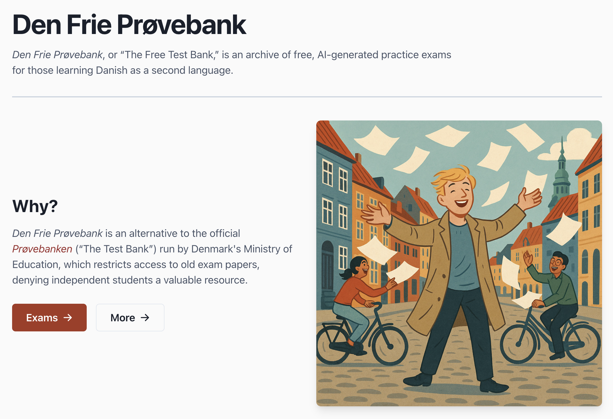

# Den Frie Prøvebank

[_Den Frie Prøvebank_](https://den-frie-provebank.dk/), or "The Free Test Bank," is an archive of free, AI-generated practice exams for those learning Danish as a second language.

To begin with, _Den Frie Prøvebank_ has focussed on _Studieprøven_, the highest level official test of proficiency in Danish as a second language.

- [Get the tests](#get-the-tests)
- [Frequently-Asked Questions](#frequently-asked-questions)
  - [Why create a test bank?](#why-create-a-test-bank)
  - [How are the tests created?](#how-are-the-tests-created)
  - [Do your tests match the structure and content of the official tests?](#do-your-tests-match-the-structure-and-content-of-the-official-tests)
- [Development roadmap](#development-roadmap)
- [Contributing](#contributing)

-----
## Get the tests

Our archive of practice exams are freely available at [den-frie-provebank.dk](https://den-frie-provebank.dk/)

## Frequently-Asked Questions

### Why create a test bank?

_Den Frie Prøvebank_ is an alternative to the official [_Prøvebanken_](https://www.xn--prvebanken-1cb.dk/proevematerialer/DAU) ("The Test Bank") run by Denmark's Ministry of Education, which restricts access to old exam papers, denying independent students a valuable resource:

> _The materials in Prøvebanken are protected by copyright. Access to the tests and exam sets is secured with a personal UNI-login and restricted to institutions administering exams under the Ministry of Education. For example, teachers and instructors with a UNI-login may download and use the materials for teaching ... The test sets may not be used for text and data mining, including the training or development of AI models._
> \- Translated copyright notice from [_Prøvebanken_](https://www.xn--prvebanken-1cb.dk/proevematerialer/DAU/DAUSP/materialesamling/4d768305-4398-4001-9fa5-b3e2db24bc81)

This came as a rude shock to someone who'd just signed up to take _Studieprøven_ as an independent student. It also struck me as totally bizarre: Why restrict public access to publicly-funded exam papers? What's the angle? Might foreigners learn Danish, or something?

In Australia, where I grew up, old exams like those confined to _Prøvebanken_ are [publicly available](https://www.vcaa.vic.edu.au/assessment/vce/examination-specifications-past-examinations-and-examination-reports/examination-specifications-past-examinations-and-external-assessment-reports). Want to take the high school linguistics exam from 2017? [Print it out.](https://www.vcaa.vic.edu.au/sites/default/files/Documents/exams/englishlanguage/2017/2017englang-cpr-w.pdf) Want to grade your paper? Here's [a detailed rundown of every question](https://www.vcaa.vic.edu.au/sites/default/files/Documents/exams/englishlanguage/2017/englang_examrep17.pdf), including sample answers and a statistical breakdown of cohort performance.

Such resources were invaluable to my studies, back then: Why can't independent, foreign students of Danish be afforded the same?

-----

### How are the tests created?

The tests are created using a general purpose AI agent, which is provided:

- The Danish government's official outline of the test concerned (e.g. [_Studieprøven_](https://danskogproever.dk/sprogcenter/danskproever/om-studieproeven-sp-indhold-og-niveau/))
- A prompt asking it to generate a test based on this outline.

The generated test is then validated by an AI agent and, when time allows, a human. (At the time of writing, we're still validating our exams.) If there are errors, these are corrected. After this, an answer key for the less open-ended portions of the test is requested.

In this repository, you can find all of the assets - like the test outline - and prompts used to generate and correct these tests.

> [!NOTE]
> _Den Frie Prøvebank_ does not violate the copyright claimed by _Prøvebanken_, as materials from _Prøvebanken_ are not used, at any stage, in the generation of practice exam papers.

-----

### Do your tests match the structure and content of the official tests?

This is a goal, but not something we can actually ascertain. 

The official exams are locked to all but employees of teaching institutions, so we can't really test how well we mimic the official papers - and, as a user, you should understand this limitation.

The exams _Den Frie Prøvebank_ provide are best considered an AI agent's interpretation of the structure and content of the official exams, as outlined on various Danish government websites. Whether it's a good or bad interpretation is not something we can determine.

That being said, as somebody who's taken a number of the exams we plan to feature (e.g. PD2 and PD3), I would say that the material we provide aligns, more or less, with my recollection of the exams I sat. My personal assessment is that our papers provide, at minimum, some useful exercises of Danish ability that imperfectly resemble the official exams.

> [!WARNING]
> _Den Frie Prøvebank's_ ability to validate how well its tests match the official tests, in terms of content and structure, is limited. Users should seek guidance from official teaching institutions as to the structure and content of the exams in question.

## Development roadmap

This is a hobby project, so your mileage may vary, but here's some indication of my intentions for _Den Frie Prøvebank_:

- [x] August, 2025 - Create and validate 25 practice tests for Studieprøven, in markdown
- [x] August, 2025 - Setup script for converting these tests into PDFs, with space for answers
- [x] September, 2025 - Create and validate 10 practice tests for PD3
- [x] September, 2025 - Create and validate 10 practice tests for PD2
- [x] September, 2025 - Create site making these practice tests publically available
- [x] September 27, 2025 - Launch site with video explaining initiative
- [ ] September 27 to October 4, 2025 - Tiny Reddit campaign about "Tankeløs, utaknemmelig udlænding 'Søren Michael Frederiksen'..." running on Copenhagen, Denmark subreddits
- [ ] October, 2025 - Undertake human validation of first 10 Studieprøven exams
- [ ] October, 2025 - Undertake human validation of first 10 PD2 exams
- [ ] October, 2025 - Undertake human validation of first 10 PD3 exams

## Contributing

If you've found an error or issue with our exam papers - and there will be plenty, I'm sure - feel free to open an issue or pull request, on this repository.

All contributions are appreciated, but those that adhere to this code of conduct especially so:

1. Be decent. (It's just a bunch of AI-generated test papers. Nothing to get worked up about.)
2. Understand this is a hobby project. (I'll try to get to it, but I also have a kolonihave.)

