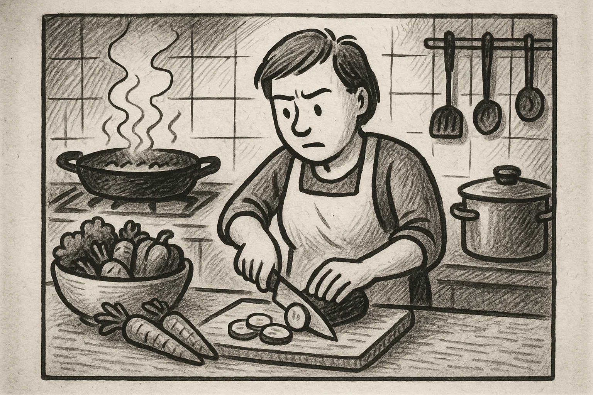
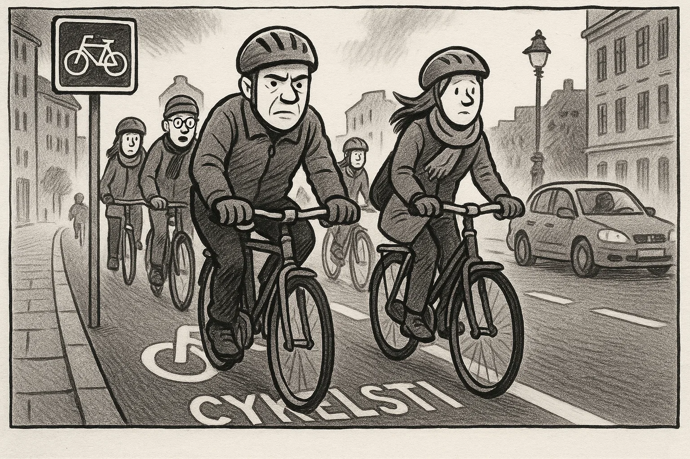
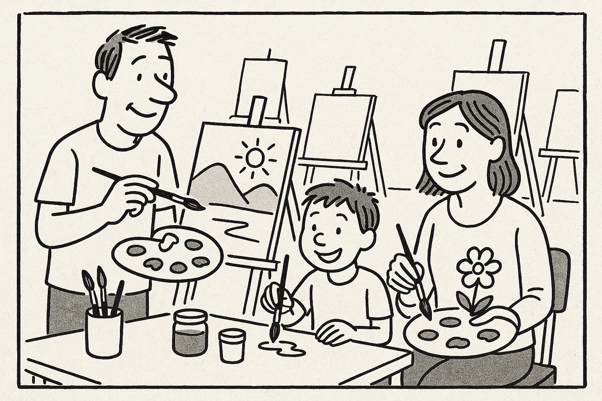

# Prøve i Dansk 2 _Practice Test 1_

  

## Outline

- Læseforståelse (90 minutter)
  - Delprøve 1
  - Delprøve 2
- Skriftlig fremstilling (90 minutter)
- Mundtlig kommunikation (20 minutter)

  Help Den Frie Prøvebank

_This practice test was generated by Den Frie Prøvebank and is unofficial. Den Frie Prøvebank's ability to validate how well its tests match the official tests, in terms of content and structure, is limited. Users should seek guidance from official teaching institutions as to the structure and content of the exams in question._

## Læseforståelse

### Delprøve 1 (30 minutter)

**Ingen hjælpemidler tilladt**

#### Opgave 1

Nedenfor finder du fire opslagstekster (A–D) fra brochurer, pjecer og hjemmesider. I alt er der ca. 2000 ord. Læs dem alle grundigt. Der er seks spørgsmål til teksterne.

**Tekst A: Dit lokale kulturhus – et levende mødested**  

Kulturhuset “Byens Rum” i centrum af din kommune er blevet et populært samlingspunkt for borgere i alle aldre. Huset åbnede i 1998 og er siden blevet udvidet flere gange. I stueetagen findes en café med økologiske retter, en lille butik med lokalt håndværk og et udstillingsområde med skiftende kunstudstillinger. På første sal ligger et bibliotek med både fysiske bøger, digitale resurser og hyggelige læsehjørner. På hverdage tilbyder huset et bredt program af kurser, foredrag og workshops: alt fra maleri, keramik og tekstil til yoga, mindfulness og sprogundervisning. Om aftenen er der ofte koncerter, filmvisninger og forfatteraftener.  

Kulturhuset er åbent fra kl. 9.00–21.00 mandag til torsdag, fredag til kl. 18.00 og lørdag til kl. 16.00. Søndag er der lukket. Alle arrangementer annonceres i et månedligt program, som kan hentes i foyeren eller på kulturhusets hjemmeside. Medlemskab koster 500 kr. om året og giver rabat på kurser og gratis adgang til flere arrangementer. Børn under 12 år har gratis adgang i følge med en voksen. For mennesker med nedsat mobilitet er der elevator til alle etager og handicapvenlige toiletter. Huset drives af kommunen i samarbejde med frivillige. Har du forslag til nye aktiviteter eller ønsker at bidrage som frivillig, kan du kontakte kulturhuslederen på mail eller besøge kontoret på 2. sal.

**Tekst B: Sprogcafé for nye danskere**  

Sprogcaféen “Snak Sammen” er et gratis tilbud til voksne udlændinge, der gerne vil øve dansk i uformelle rammer. Caféen ligger i byens hovedbibliotek, sal 3. Her mødes deltagere hver tirsdag og torsdag kl. 17.00–19.00. Frivillige, der selv har dansk som modersmål, faciliterer samtaler om hverdagsliv, arbejde, kultur og aktuelle nyheder. Man bliver inddelt i små grupper, så alle får mulighed for at tale. Sprogcaféen kræver ingen tilmelding – du dukker bare op, og der bliver serveret kaffe og te.  

Deltagerne behøver ikke at forberede sig, men er velkomne til at medbringe aviser, billeder eller emner, de gerne vil tale om. Der er også adgang til spil og kort, som kan bruges til samtale. Formålet med caféen er at skabe et trygt og hyggeligt rum, hvor man kan træne sproget og lære nye mennesker at kende. Børn er velkomne, men der tilbydes ikke børnepasning. Har du spørgsmål, eller ønsker du at blive frivillig, kan du kontakte bibliotekaren på telefon eller via hjemmesiden.

**Tekst C: Miljøvenlig hverdag – spar energi i dit hjem**  

På Energistyrelsens hjemmeside kan du finde en omfattende guide til, hvordan du reducerer din boligs energiforbrug. Guiden forklarer, at små ændringer i hverdagen både sparer penge og skåner klimaet. Den anbefaler, at man udskifter gamle elpærer med LED‑pærer, som bruger op til 80 % mindre strøm og holder længere. Derudover beskriver den, hvordan man med termostater og tidsstyring kan optimere varmeforbruget. Ved at sænke temperaturen én grad sparer man ca. 5 % på varmeregningen.  

Et andet fokusområde er husholdningsapparater: vaskemaskine, opvaskemaskine og tørretumbler bør have energimærke A++ eller bedre. Det anbefales at vaske ved lavere temperaturer og altid fylde maskinerne helt. Stikkontakter med sluk‑funktion kan eliminere standby‑forbrug, og energimåleren giver overblik over forbruget i realtid. Guiden indeholder også afsnit om isolering, vinduesudskiftning, tilskud til varmepumper og solceller samt links til beregningsværktøjer. Endelig opfordres der til grøn adfærd: at cykle eller tage offentlig transport frem for bilen, spise mindre kød og sortere affald korrekt.

**Tekst D: Frivilligt arbejde – gør en forskel i dit lokalområde**  
Kommunen tilbyder et bredt udvalg af frivillige aktiviteter gennem platformen “Giv en Hånd”. Her kan du vælge mellem at besøge ældre i plejeboliger, læse højt for børn på biblioteket, være lektiehjælper for unge, deltage i naturplejeprojekter eller hjælpe i genbrugsbutikker. Frivilligt arbejde giver mulighed for at møde andre mennesker, udvikle nye kompetencer og styrke dit netværk.  

Du bestemmer selv, hvor meget tid du vil bruge. Mange engagerer sig et par timer om ugen, men alt fra en enkelt gang om måneden til flere gange om ugen er velkomment. Som frivillig får du introduktion og vejledning, og du er dækket af en frivilligforsikring. For at komme i gang skal du oprette en profil på hjemmesiden og vælge det projekt, der interesserer dig. En koordinator kontakter dig og arrangerer et introduktionsmøde. Du kan også kontakte frivilligcenteret personligt hver onsdag mellem kl. 15.00 og 17.00 i lokalet ved siden af rådhuset.  

##### Spørgsmål til teksterne

1. Hvad er den normale åbningstid i kulturhuset “Byens Rum” om lørdagen?  

2. Hvor meget koster et medlemskab af kulturhuset om året?  

3. Hvor og hvornår mødes Sprogcaféen “Snak Sammen”?  

4. Nævn én ting, som deltagere kan medbringe til sprogcaféen, hvis de ønsker det.  

5. Hvilket energimærke anbefales til husholdningsapparater ifølge Energistyrelsens guide?  

6. Hvor mange timer om ugen forventes man som minimum at arbejde frivilligt via “Giv en Hånd”?  

#### Opgave 2

Nedenfor finder du ni korte tekster (A–I), fx annoncer og opslag, med en samlet længde på omkring 375 ord. De enkelte tekster identificeres ved et bogstav. Der er syv sætninger (1–7), som skal matches med teksterne. Sæt kun ét bogstav ved hver sætning.  

**A.** *Lejlighed til leje* – Lys 2‑værelses lejlighed på 55 m² i Aalborg centrum udlejes fra 1. maj. Husleje 4.700 kr./måned + forbrug. Rolige lejere uden husdyr foretrækkes. Kontakt: 12 34 56 78.  

**B.** *Gratis koncert* – Kom og hør det lokale jazzband spille søndag kl. 14 i byparken. Der sælges kaffe og kage. Medbring et tæppe. Alle er velkomne.  

**C.** *Loppemarked* – Stort indendørs loppemarked i sportshallen lørdag kl. 10–15. Sælg dine brugte ting, eller find gode tilbud. Stand 75 kr. Tilmelding på www.loppe.dk.  

**D.** *Frisør søges* – Vi søger en dygtig frisør til vores salon i Esbjerg. Stillingen er fuld tid. Du skal have erfaring og være serviceminded. Ansøg på mail senest 15. april.  

**E.** *Cykel fundet* – En sort herrecykel uden lys og lås er fundet ved biblioteket. Henvendelse med beskrivelse og ID på kontoret.  

**F.** *Ny cykelsti* – Arbejdet på den nye cykelsti mellem Skanderborg og Ry starter på mandag. Strækningen vil være spærret i to uger. Brug omkørselsruterne.  

**G.** *Restaurant medarbejder* – Smilende deltidsmedarbejder søges til café i Odense. Arbejdstid 15 timer om ugen, primært eftermiddag og weekend. Erfaring med kundeservice er en fordel.  

**H.** *Yoga for begyndere* – Kom i gang med yoga hver torsdag kl. 18–19 i gymnastiksalen. Medbring egen måtte og løstsiddende tøj. Pris: 50 kr. pr. gang.  

**I.** *Læsekreds* – Elsker du at læse? Meld dig til vores læsekreds. Vi mødes første mandag i måneden kl. 19 på biblioteket. Første bog er “Peters Jul”. Gratis deltagelse.

**Sætninger:**

_Sæt kun ét bogstav ved hver sætning._

1. Jeg vil gerne vide, hvornår loppemarkedet slutter. _________
2. Jeg leder efter et deltidsjob med kundekontakt i Odense. _________
3. Jeg skal udleje en stand og betaler 75 kr. for den. _________
4. Min cykel blev væk ved biblioteket. Hvem kan jeg tale med? _________
5. Jeg vil gerne bestille tid til at få klippet mit hår og er i Esbjerg. _________ 
6. Jeg vil begynde at dyrke yoga og skal huske at tage noget med til timen. _________ 
7. Jeg vil gerne høre livemusik gratis i weekenden. _________ 

### Delprøve 2 (60 minutter)

**Ingen hjælpemidler tilladt**

#### Opgave 3

Læs nedenstående fortælling. I teksten er der fjernet ni ord. Ordene findes i listen under teksten sammen med fem ekstra ord, der ikke passer.  

**Tekst:**  
Min veninde Maria flyttede til Danmark for tre år siden. Da hun kom, kendte hun ingen og talte kun lidt dansk. Hun meldte sig hurtigt til en *sprogskole*, hvor hun mødte andre **(1)** ______ udlændinge. I begyndelsen syntes hun, at det danske vejr var **(2)** ______, og hun savnede sin familie meget. Hun brugte derfor mange aftener på at **(3)** ______ med dem over video.  

Efter et par måneder begyndte hun at tage del i forskellige aktiviteter i **(4)** ______. Hun blev frivillig i en genbrugsbutik og tilmeldte sig et dansehold. Hendes **(5)** ______ for dansk mad voksede langsomt, især efter at hun havde lært at lave frikadeller og rugbrød. På sprogskolen fik hun en god **(6)** ______ med sin lærer, som opmuntrede hende til at øve sig hver dag. Snart turde hun tale med naboerne og spørge om hjælp, når noget var **(7)** ______.  

I dag arbejder Maria som social- og sundhedshjælper. Hun synes, det er meningsfuldt at **(8)** ______ for andre mennesker, og hun planlægger at tage en uddannelse inden for sygepleje. Hun er stolt af at have skabt et nyt **(9)** ______ i Danmark og føler sig nu hjemme her.

**Ord til brug (ni passer, fem er distraktorer):**

*Noter: Skriv det korrekte ord i hver blank. Ét ord må kun bruges én gang.*

  <ul class="column">
    <li>unge</li>
    <li>plan</li>
    <li>kolde</li>
    <li>tale</li>
    <li>ringe</li>
    <li>humor</li>
    <li>landsbyen</li>
  </ul>
  <ul class="column">
    <li>netværk</li>
    <li>smag</li>
    <li>bo</li>
    <li>kommunikation</li>
    <li>tage sig</li>
    <li>kammeratskab</li>
    <li>svært</li>
  </ul>

#### Opgave 4

Læs teksten nedenfor. Den består af seks afsnit. I hvert afsnit er der fjernet én sætning. Efter teksten finder du otte sætninger (A–H), hvoraf seks passer i hullerne. To sætninger er distraktorer.  

**Tekst:**  

**Afsnit 1** 

Anna har altid drømt om at rejse. Som barn læste hun bøger om fjerne lande og kiggede i atlas. Da hun fyldte 25, besluttede hun at tage et år fri fra sit job i supermarkedet for at udforske verden. **(1)** ______  

**Afsnit 2** 

Annas rejse startede i Spanien, hvor hun tilbragte tre måneder i en lille landsby. Hun boede hos en familie og passede deres børn i bytte for kost og logi. **(2)** ______ 

**Afsnit 3**

Næste stop var Brasilien. Her arbejdede hun som frivillig på et projekt, der planter træer i regnskoven. **(3)** ______ Hun blev venner med de andre frivillige og lærte lidt portugisisk.  

**Afsnit 4**

Efter seks måneder følte Anna sig mere selvsikker. Hun tog til Japan og underviste skolebørn i engelsk. **(4)** ______ Hun boede hos en værtinde, som viste hende japanske traditioner, og i weekenden besøgte hun templer og prøvede sushi.  

**Afsnit 5**

Annas sidste destination var Grønland. Her hjalp hun til på et forskningscenter, der undersøger klimaforandringer. **(5)** ______ Selvom vejret var barskt, fandt hun ro i det storslåede landskab.  

**Afsnit 6**

Efter et år vendte Anna hjem til Danmark. Hun følte sig forandret; hun havde lært om forskellige kulturer og om sig selv. **(6)** ______ Hun begyndte at studere antropologi, så hun en dag kan arbejde med kulturforståelse.

**Sætninger (A–H):**

*Skriv bogstavet for den rigtige sætning ved hver 1 – 6. To sætninger skal ikke bruges.*

<ul class="multiple-choice-answers">
  <li>Hjemmefra havde hun sparet penge op til flybilletter og forsikring.</li>
  <li>Hver dag var en ny udfordring, men hun elskede at være ude i naturen.</li>
  <li>De lokale var meget gæstfrie, og hun blev inviteret til flere fester.</li>
  <li>Hun havde læst om landet før og var fascineret af dets historie.</li>
  <li>Hun savnede ofte sin familie, men videoopkald gjorde afstanden mindre.</li>
  <li>Erfaringerne fra hendes rejser gav hende mod til at vælge en ny uddannelse.</li>
  <li>Hun blev imponeret over, hvor disciplineret børnene var i skolen.</li>
  <li>Hun lærte at lave paella og brugte sine fridage på at vandre i bjergene.</li>
</ul>

#### Opgave 5

Du skal læse et interview med en person. Teksten består af otte afsnit (A–H). Der er fem spørgsmål til teksten. Sæt bogstavet for det afsnit, der indeholder svaret, ved hvert spørgsmål.

**Tekst:**  

**Afsnit A** 

Louise Larsen er 32 år og arbejder som entreprenør. Hun står bag firmaet “Grønne Løsninger”, der hjælper familier med at renovere deres huse klimavenligt. Louise bor i en landsby i Midtjylland med sin mand og to små børn.  

**Afsnit B** 

Efter gymnasiet var hun i lære som tømrer. Hun elskede at bygge, men undrede sig over, hvor meget affald der blev produceret. Hun begyndte at interessere sig for genbrug af byggematerialer og læste artikler om bæredygtigt byggeri.  

**Afsnit C**

I 2018 startede hun sin virksomhed. I begyndelsen arbejdede hun alene og kørte rundt i sin varevogn for at rådgive kunder. Hun oplevede, at mange ikke vidste, at man kan spare penge ved at isolere bedre og bruge genbrugstræ.  

**Afsnit D**  

Firmaet har nu otte ansatte, heraf fire lærlinge. Louise prioriterer at give unge en chance i branchen. Hun holder foredrag på erhvervsskoler og deltager i lokale messer.  

**Afsnit E**  

Louise fortæller, at en af de største udfordringer er at overbevise folk om at investere i grønne løsninger. “Mange tror, at det er dyrt, men på lang sigt tjener det sig ind,” siger hun. Hun forsøger at forklare kunderne fordelene, både økonomisk og miljømæssigt.  

**Afsnit F**  

Hun har selv renoveret sit eget hus med solceller, isolering og regnvandsopsamling. Familien dyrker desuden deres egne grøntsager og har høns. “Det handler om at leve efter det, man prædiker,” griner hun.  

**Afsnit G**  

Når hun ikke arbejder, bruger Louise tiden på at løbe i skoven eller lege med børnene i haven. Hun holder også af at læse krimier og lytte til podcasts om iværksætteri.  

**Afsnit H**  

Louise drømmer om at udvide sin virksomhed til andre nordiske lande. Hun samarbejder allerede med firmaer i Sverige og Norge og håber at kunne udvikle fælles projekter, der kan inspirere flere til at bygge bæredygtigt.

##### Spørgsmål

1. I hvilket afsnit beskrives Louises familieliv?  

2. Hvorfor begyndte Louise at interessere sig for genbrug af byggematerialer?  

3. Hvor mange ansatte arbejder der nu i virksomheden “Grønne Løsninger”?  

4. Hvad er en af de største udfordringer i Louises arbejde?  

5. Hvad laver Louise i sin fritid?  

## Skriftlig fremstilling (90 minutter – alle ordbøger tilladt)

### Delprøve 1 – vælg enten 1A eller 1B

**1A.** Du har boet i din lejlighed i tre år. De seneste måneder har der været meget larm fra din overbo om aftenen og natten. Du ønsker at klage til boligforeningen og foreslå en løsning. Skriv en halvformel henvendelse på ca. 150–200 ord, hvor du:

- beskriver problemet med den høje musik og tidspunktet på døgnet  
- fortæller, hvordan det påvirker dig og din familie  
- nævner, at du har forsøgt at tale med naboen uden held  
- foreslår, hvad boligforeningen kan gøre for at løse problemet  

**1B.** Din veninde har åbnet en lille cafe i din by og beder dig om at skrive et opslag til hendes hjemmeside, der skal tiltrække nye kunder. Skriv en halvformel tekst på ca. 150–200 ord, hvor du:

- beskriver cafeens beliggenhed og indretning  
- fortæller om menukortet og særlige tilbud  
- fremhæver atmosfæren og serviceniveauet  
- opfordrer folk til at komme på besøg og dele opslaget  

### Delprøve 2

Du har netop afsluttet et dansk kursus. Din underviser sender dig en e‑mail, hvor hun beder dig om at skrive et kort brev til en tidligere kursist, som overvejer at starte på kurset. Skriv en uformel e‑mail på mindst 100 ord, hvor du:

- hilser pænt og præsenterer dig selv  
- fortæller kort om, hvordan kurset var opbygget  
- beskriver, hvad du lærte, og hvordan du brugte det i hverdagen  
- giver din mening om læreren og klassemiljøet  
- opmuntrer kursisten til at tilmelde sig og tilbyd at besvare spørgsmål  

_Brug disse sider til at skrive din skriftlige opgave._

## Mundtlig kommunikation (20 minutter for to prøvedeltagere)

### Delprøve 1 (ca. 10 minutter i alt)

Hver prøvedeltager forbereder og holder en præsentation på ca. 1½ minut om et selvvalgt emne fra sin hverdag, fx. arbejde, fritidsinteresser, familie, bolig eller en tradition. Efter præsentationen interviewer eksaminator prøvedeltageren i ca. 3½ minut med spørgsmål, der uddyber emnet.  

**Fokus:** Evne til at fortælle sammenhængende om personligt erfarede forhold og at forstå og besvare spørgsmål fra eksaminator.  

### Delprøve 2 (ca. 10 minutter i alt)

Der er tre emner (A, B og C) om konkrete hverdagsforhold. Til hvert emne hører to billeder (Billede 1 og Billede 2), som illustrerer en situation. Prøvedeltagerne vælger ét emne. Først interviewer eksaminator hver prøvedeltager enkeltvis om det valgte billede. Derefter følger en samtale mellem de to prøvedeltagere, hvor de taler sammen på baggrund af en case, som eksaminator præsenterer. Eksaminator fungerer som mediator og sørger for, at begge prøvedeltagere kommer til orde.

**Emner og billeder:**

- **Emne A: Indkøb og sundhed**  

Byrådet overvejer at lukke den lokale grøntsagsbutik for at gøre plads til en større kæde. Diskutér fordele og ulemper ved denne beslutning, og kom med forslag til, hvordan man kan støtte sunde indkøbsmuligheder i lokalområdet.

- **Emne B: Transport og miljø**  

Kommunen vil begrænse biltrafikken i centrum ved at lave flere cykelstier, hæve parkeringsafgifterne og indføre bilfrie zoner. Diskutér fordele og ulemper for miljø, pendlere og butikker, og kom med forslag til, hvordan flere kan bruge cykel eller bus, samtidig med at ældre og handicappede har gode transportmuligheder.

- **Emne C: Fritidsaktiviteter**  

Der mangler penge til fritidsaktiviteter, og kommunen overvejer at fjerne nogle grønne områder og lukke et kunstværksted. Diskutér, hvad det betyder for sundhed og fællesskab, og foreslå løsninger eller samarbejder, der kan bevare sport og kreative tilbud.

---

_This practice test was generated by Den Frie Prøvebank and is unofficial. Den Frie Prøvebank's ability to validate how well its tests match the official tests, in terms of content and structure, is limited. Users should seek guidance from official teaching institutions as to the structure and content of the exams in question._

