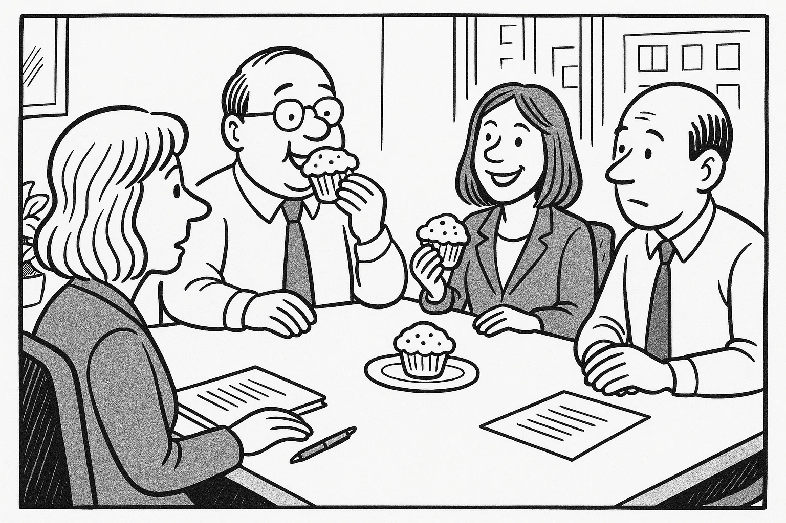

# Prøve i Dansk 2 _Practice Test 10_

  

## Outline

- Læseforståelse (90 minutter)
  - Delprøve 1
  - Delprøve 2
- Skriftlig fremstilling (90 minutter)
- Mundtlig kommunikation (20 minutter)

  Help Den Frie Prøvebank

_This practice test was generated by Den Frie Prøvebank and is unofficial. Den Frie Prøvebank's ability to validate how well its tests match the official tests, in terms of content and structure, is limited. Users should seek guidance from official teaching institutions as to the structure and content of the exams in question._

## Læseforståelse

### Delprøve 1 (30 minutter)

**Ingen hjælpemidler tilladt**

#### Opgave 1

Nedenfor finder du fire opslagstekster (A–D) fra brochurer, pjecer og hjemmesider. I alt er der ca. 2000 ord. Læs dem alle grundigt. Der er seks spørgsmål til teksterne.

**Tekst A: Det lokale idrætscenter – et aktivt samlingspunkt**  

Idrætscentret “Energi & Bevægelse” åbnede i 2005 og har siden udviklet sig til byens naturlige mødested for folk i alle aldre. Huset rummer et fitnesscenter med moderne maskiner, en svømmehal med sauna, to store sale til holdtræning samt en hyggelig café. I stueetagen er der også et legeland til børn og et værested for seniorer. Hverdagen byder på et bredt program: alt fra styrketræning, pilates og dans til hold i vandgymnastik, badminton og bordtennis. Om aftenen arrangeres der ofte foredrag om sundhed, konkurrencer og fællesspisning.  

Idrætscentret har åbent mandag til fredag kl. 6.00–22.00, lørdag kl. 8.00–19.00 og søndag kl. 9.00–18.00. Et årsmedlemskab koster 600 kr., og et engangsgebyr på 250 kr. dækker introduktion og nøglekort. Studerende får 50 % rabat, og børn under 10 år har gratis adgang i følge med en voksen. Medlemskabet inkluderer fri adgang til svømmehallen og rabat på hold. Der er elevator til alle etager, handicapvenlige omklædningsrum og gratis Wi-Fi. Centret drives af en forening i samarbejde med frivillige. Hvis du har idéer til nye aktiviteter eller ønsker at blive frivillig, kan du kontakte receptionen på telefon eller via mail.  

**Tekst B: Bibliotekets nye digitale univers – adgang til viden 24/7**  

Byens bibliotek har lanceret et digitalt univers, der gør det nemt at låne bøger, magasiner og lydbøger hjemmefra. Med appen “eBibliotek” kan du læse e‑bøger på din mobil eller tablet og lytte til lydbøger på farten. Tjenesten er gratis for alle, der har et bibliotekskort, og du kan låne døgnet rundt uden at tænke på åbningstider. Appen indeholder også podcasts, aviser på flere sprog og anbefalinger fra bibliotekarer.  

Det fysiske bibliotek er stadig åbent mandag til fredag kl. 10–18 og lørdag kl. 10–14, hvor du kan få hjælp til at installere appen og få en introduktion til de digitale muligheder. Med jævne mellemrum afholder biblioteket workshops om digital læsning og tilbyder individuel vejledning til ældre. Du kan tilmelde dig via hjemmesiden eller ringe til digitaliseringsafdelingen. Har du glemt din pinkode, eller har du brug for hjælp til at oprette et lånerkort, kan du skrive til bibliotekets kundeservice. De holder også en digital læseklub, hvor du kan deltage online og diskutere bøger med andre.  

**Tekst C: Sommerfestivalen “Byens Lyde” – oplev musik og fællesskab**  

Hver sommer forvandles byens torv til en festplads, når festivalen “Byens Lyde” løber af stablen. Festivalen starter den 20. juli med en gratis åbningskoncert på hovedtorvet kl. 17.00, hvor lokale bands spiller, og borgmesteren byder velkommen. De følgende fire dage er der mere end 30 koncerter fordelt på tre scener – fra jazz og folk til rock og elektronisk musik. Udover musik kan du opleve street food, workshops for børn, kunsthåndværk og debatarrangementer om byens kulturliv.  

Festivalen organiseres af foreningen “Kultur for Alle” og bygger på frivilligt engagement. Et dagsarmbånd koster 200 kr., og et partoutkort til alle dage koster 600 kr. Børn under 12 år har gratis adgang i følge med en voksen. Vil du være frivillig, kan du tilmelde dig via hjemmesiden: du arbejder mindst seks timer, får et festivalarmbånd, mad og drikke samt en T‑shirt. Efter festivalen inviteres alle frivillige til en takke­fest. Festivalområdet er tilgængeligt for kørestolsbrugere, og der er et særligt stilleområde for familier. Hvis du har spørgsmål om programmet, billetter eller frivilligt arbejde, kan du kontakte festival­kontoret via e‑mail.  

**Tekst D: Gratis kursus i førstehjælp – lær at redde liv**  

Røde Kors og det lokale sundhedscenter tilbyder et gratis kursus i førstehjælp hver anden lørdag i måneden fra kl. 10.00 til 13.00. Kurset afholdes i sundhedscentrets undervisningslokale på Parkvej 12 og er åbent for alle over 16 år. Ingen forudgående erfaring er nødvendig. Instruktører gennemgår hjertemassage, brug af hjertestarter, behandling af sår og håndtering af chok. Deltagerne får lov at øve på dukker og afslutter med et bevis, som kan bruges i forbindelse med visse job.  

Der er plads til 20 deltagere pr. kursus. Du tilmelder dig via Røde Kors’ hjemmeside eller ved at ringe til kursuskoordinatoren. Hvis kurset er fuldt booket, kan du blive skrevet på en venteliste. Har du spørgsmål om tilmelding eller særlige behov, kan du kontakte Røde Kors’ lokale kontor på telefon. Tag gerne praktisk tøj på og medbring en vandflaske. Kurset er gratis takket være støtte fra kommunen.  

##### Spørgsmål til teksterne

1. Hvad koster et årsmedlemskab i idrætscentret “Energi & Bevægelse”?  

2. Hvilket digitalt tilbud kan du bruge til at læse bøger på din mobiltelefon?  

3. Hvornår starter musikfestivalen “Byens Lyde”, og hvor foregår åbningskoncerten?  

4. Hvordan kan du deltage som frivillig til festivalen, og hvad får du til gengæld?  

5. Hvor lang tid varer førstehjælpskurset, og hvem kan deltage?  

6. Hvem kan man kontakte, hvis man har spørgsmål om tilmelding til førstehjælpskurset?  

#### Opgave 2

Nedenfor finder du ni korte tekster (A–I), fx annoncer og opslag, med en samlet længde på omkring 375 ord. De enkelte tekster identificeres ved et bogstav. Der er syv sætninger (1–7), som skal matches med teksterne. Sætningen til den øverste annonce (A) fungerer som et eksempel. Sæt kun ét bogstav ved hver sætning.  

**A.** *Børnecykel til salg* – Blå børnecykel (18") i fin stand sælges for 500 kr. Den står i Roskilde. Kontakt: 61 23 45 67.  

**B.** *Gratis foredrag* – Kom og hør klimaforskeren Lotte Hansen fortælle om bæredygtige byer tirsdag kl. 19.00 på biblioteket. Gratis entré. Tilmelding via bibliotekets hjemmeside.  

**C.** *Loppemarked* – Stort indendørs loppemarked i hallen på søndag kl. 9–15. Sælg dine brugte ting, eller find gode tilbud. Stand 50 kr. Tilmelding på www.loppehus.dk.  

**D.** *Rengøringsassistent søges* – Lille kontor i Aarhus søger en grundig rengøringsmedarbejder ca. 10 timer om ugen. Erfaring ønskes. Ansøgning sendes senest 1. oktober til info@rentoffice.dk.  

**E.** *Nøgle fundet* – En nøglering med tre nøgler er fundet ved busstoppestedet på Strandvejen. Beskriv nøgleringen og få den udleveret i kiosken.  

**F.** *Svømmehallen lukkes* – Den kommunale svømmehal er lukket for renovering fra 1. september til 30. september. Vi glæder os til at åbne igen med nye omklædningsrum.  

**G.** *Legegruppe* – Forældre og børn (0–3 år) mødes hver onsdag kl. 10–12 i kulturhuset. Medbring frugt og tæppe. Gratis deltagelse.  

**H.** *Madlavningskursus* – Lær at lave sunde hverdagsretter hver mandag kl. 18–20 i skolekøkkenet. Pris: 100 kr. pr. gang. Medbring forklæde.  

**I.** *Bogklub* – Elsker du at læse? Meld dig til vores bogklub. Vi mødes den sidste torsdag i hver måned kl. 19 på biblioteket. Første bog er “Den Lille Prins”. Gratis deltagelse.

**Sætninger:**

_Sæt kun ét bogstav ved hver sætning._

1. Jeg leder efter en brugt børnecykel i god stand. _________  
2. Jeg vil gerne tilmeldes et kursus, hvor jeg lærer at lave mad hver mandag aften. _________  
3. Jeg planlægger at sælge mine gamle ting næste søndag og skal booke en stand for 50 kr. _________  
4. Jeg vil gerne have hjælp til rengøring et par timer om ugen i Aarhus. _________  
5. Jeg skal hente mine nøgler, som jeg tabte på vej til bussen. Hvem kan jeg tale med? _________  
6. Jeg vil gerne tage mit barn med til en legegruppe midt på ugen. _________  
7. Jeg søger en gratis begivenhed om klima, hvor jeg kan høre et foredrag. _________  

### Delprøve 2 (60 minutter)

**Ingen hjælpemidler tilladt**

#### Opgave 3

Læs nedenstående fortælling. I teksten er der fjernet ni ord. Ordene findes i listen under teksten sammen med fem ekstra ord, der ikke passer.  

**Tekst:**  
Min bror Mikkel flyttede til København for to år siden for at starte på universitetet. I begyndelsen følte han sig alene, for han kendte ingen i byen. Han boede i en lille studielejlighed og brugte meget tid på at læse. Det var **(1)** ______ for ham at finde rundt i det nye miljø, og den travle trafik gjorde ham nervøs. Han savnede sine gamle **(2)** ______ og familien hjemme i Jylland. Derfor ringede han ofte hjem og skrev lange e‑mails. Efter et par uger besluttede han at melde sig ind i universitetets løbeklub for at møde nye mennesker. Han **(3)** ______ hurtigt mange fælles interesser med de andre medlemmer. Sammen deltog de i løb i parken og organiserede fælles middage.  

Mikkel begyndte også at arbejde frivilligt som lektiehjælper for børn i nabolaget. Det gav ham stor **(4)** ______ at se børnene blive gladere og dygtigere. Hans dansklærer i gymnasiet havde engang sagt, at man lærer mest ved at **(5)** ______ andre, og Mikkel opdagede, at det passede. Samtidig blev han mere tryg ved at tale i offentlige sammenhænge. Efter det første semester følte han sig mere **(6)** ______ og tog bussen uden problemer. Han fandt en god **(7)** ______ med en studiekammerat, som introducerede ham til en lokal fodboldklub. Nu træner han to gange om ugen og har fået et endnu større **(8)** ______.  

I dag er Mikkel glad for sit valg. Han har lært at klare sig selv, men han glemmer aldrig at besøge familien i ferierne. Han ser frem til at blive færdiguddannet og **(9)** ______ i Danmark i mange år fremover.

**Ord til brug (ni passer, fem er distraktorer):**

_Noter: Skriv det korrekte ord i hver blank. Ét ord må kun bruges én gang._

  <ul class="column">
    <li>svært</li>
    <li>venner</li>
    <li>delte</li>
    <li>glæde</li>
    <li>by</li>
    <li>undervise</li>
    <li>lange</li>
  </ul>
  <ul class="column">
    <li>madlavning</li>
    <li>netværk</li>
    <li>undskyldning</li>
    <li>bo</li>
    <li>venskab</li>
    <li>musik</li>
    <li>selvsikker</li>
  </ul>

#### Opgave 4

Læs teksten nedenfor. Den består af seks afsnit. I hvert afsnit er der fjernet én sætning. Efter teksten finder du otte sætninger (A–H), hvoraf seks passer i hullerne. To sætninger er distraktorer.  

**Tekst:**  

**Afsnit 1**  

Lise har altid elsket at løbe. Som teenager deltog hun i lokale motionsløb, og hun kunne lide følelsen af frihed, når hun løb gennem skoven. Da hun fyldte 30, besluttede hun at tilmelde sig sit første maratonløb i København. **(1)** ______  

**Afsnit 2**  

Hun begyndte at træne tidligt om morgenen, inden hun gik på arbejde som sygeplejerske. I starten var det svært at finde energien efter en lang arbejdsdag, men hun holdt fast. Hun ændrede også sin kost og spiste mere grønt og pasta for at få energi. **(2)** ______  

**Afsnit 3**  

Efter nogle uger meldte hun sig ind i en løbeklub. Her fandt hun støtte og råd hos mere erfarne løbere. De lærte hende at strække korrekt og at lytte til kroppen. **(3)** ______ Hun fandt nye venner, som hun også så uden for træningen.  

**Afsnit 4**  

Et halvt år senere løb hun et halvmaraton som en del af sin træning. Hun gennemførte i en tid, hun var tilfreds med, men vidste, at et helt maraton ville være hårdere. Efter løbet fik hun problemer med et knæ, som hun heldigvis fik behandlet hos en fysioterapeut. **(4)** ______  

**Afsnit 5**  

På maratondagen i København var vejret koldt og blæsende. Tusenvis af løbere stod klar på startlinjen, og Lise mærkede nervøsiteten i maven. Hun startede i et roligt tempo og fokuserede på sit åndedræt. **(5)** ______ Hendes mentale styrke blev sat på prøve, men hun tænkte på alt det arbejde, hun havde lagt i forberedelserne.  

**Afsnit 6**  

Da hun passerede målstregen, var hun udmattet, men også lykkelig. Hun havde bevist over for sig selv, at hun kunne nå det mål, hun havde sat. Efter løbet fejrede hun med venner over en stor middag. **(6)** ______

**Sætninger (A–H):**

_Skriv bogstavet for den rigtige sætning ved hver 1 – 6. To sætninger skal ikke bruges._

<ul class="multiple-choice-answers">
  <li>Hun satte sig et detaljeret træningsprogram og købte et par ordentlige løbesko.</li>
  <li>Løb med klubben gjorde hende mere motiveret, og hun glædede sig til hver træning.</li>
  <li>Hun øgede gradvist distancen og lyttede til sin krops signaler.</li>
  <li>Hendes familie var stolt af hende og overrasket over hendes viljestyrke.</li>
  <li>Omkring kilometer 35 ramte hun den berømte mur, men publikums opmuntring hjalp hende igennem.</li>
  <li>Erfaringen gav hende mod til at sætte nye mål for fremtiden.</li>
  <li>Hun drømte om at rejse verden rundt og skrive en bog om maratonløb.</li>
  <li>Hun savnede ofte sin familie under de lange løbeture, men podcasts gjorde tiden kortere.</li>
</ul>

#### Opgave 5

Du skal læse et interview med en person. Teksten består af otte afsnit (A–H). Der er fem spørgsmål til teksten. Sæt bogstavet for det afsnit, der indeholder svaret, ved hvert spørgsmål.

**Tekst:**  

**Afsnit A**  

Jens Møller er 45 år og driver bageriet “Surdej & Sødmælk” i en mindre by på Fyn. Han bor i en gammel bindingsværksgård med sin kone og tre børn. Bageriet ligger i byens hovedgade, og duften af friskbagt brød spreder sig hver morgen.  

**Afsnit B**  

Efter gymnasiet kom Jens i lære som bager. Han elskede håndværket, men han blev hurtigt optaget af ideen om at bruge økologiske råvarer og surdej i stedet for gær. Han læste fagbøger om langsom hævning og tog på kurser i Frankrig for at lære traditionerne.  

**Afsnit C**  

I 2015 åbnede han sin egen butik. I begyndelsen arbejdede han alene og leverede brød på cykel til kunder i området. Folk var nysgerrige, og rygtet om det sprøde brød spredte sig hurtigt. Han stod op kl. 3 om natten for at ælte dej og bagte det meste med håndkraft.  

**Afsnit D**  

Bageriet beskæftiger nu seks medarbejdere, heraf to lærlinge. Jens prioriterer at give unge en chance i faget og tager dem med på messer, hvor de præsenterer deres bagværk. Han inviterer også skoleklasser ind for at se, hvordan brød bliver til.  

**Afsnit E**  

Jens fortæller, at en af de største udfordringer er konkurrencen fra supermarkeder. “Mange kunder ser på prisen uden at tænke på håndværk og kvalitet,” siger han. Han forsøger at forklare forskellen og giver smagsprøver på hans rugbrød og croissanter.  

**Afsnit F**  

Han har investeret i solceller på taget og nye energieffektive ovne for at reducere klimaaftrykket. De ingredienser, han bruger, kommer fortrinsvis fra lokale landmænd. Alt brød, der ikke sælges samme dag, sælges billigt eller gives til et herberg.  

**Afsnit G**  

Når Jens ikke står i bageriet, går han gerne på vandreture i skoven eller fisker ved de små søer i nærheden. Han holder også af at lave mad med sine børn og læse krimier om aftenen.  

**Afsnit H**  

Han drømmer om at udvide med en café ved siden af bageriet og tilbyde workshops i surdej. Han samarbejder allerede med bagere i Sverige og håber at inspirere flere til at vælge bæredygtigt brød.

##### Spørgsmål

1. I hvilket afsnit nævnes Jens’ familieliv?  

2. Hvorfor begyndte Jens at interessere sig for surdej og økologiske ingredienser?  

3. Hvor mange ansatte arbejder der nu i bageriet “Surdej & Sødmælk”?  

4. Hvad er en af de største udfordringer for Jens’ virksomhed?  

5. Hvad laver Jens i sin fritid?  

## Skriftlig fremstilling (90 minutter – alle ordbøger tilladt)

### Delprøve 1 – vælg enten 1A eller 1B

**1A.** Du tager bussen til arbejde hver dag. De seneste måneder har bussen været forsinket eller helt aflyst flere gange, hvilket har gjort dig forsinket på arbejde. Du ønsker at klage til kommunen og foreslå forbedringer. Skriv en halvformel henvendelse på ca. 150–200 ord, hvor du:

- beskriver problemet med bussernes manglende punktlighed og specifikke tidspunkt(er)  
- forklarer, hvordan dette påvirker dig og andre passagerer  
- nævner, at du har kontaktet busselskabet uden at få et klart svar  
- foreslår, hvad kommunen kan gøre for at forbedre offentlig transport i dit område  

**1B.** Din ven har åbnet en butik med lokalt produceret og bæredygtigt tøj. Han beder dig om at skrive et opslag til butikkens hjemmeside, der skal tiltrække nye kunder. Skriv en halvformel tekst på ca. 150–200 ord, hvor du:

- beskriver butikkens beliggenhed og indretning  
- fortæller om tøjudvalget og de bæredygtige materialer  
- fremhæver butikkens værdier, atmosfære og kundeservice  
- opfordrer folk til at komme på besøg og dele opslaget med deres netværk  

### Delprøve 2

Du har netop deltaget i et introduktionsforløb om frivilligt arbejde i Danmark. Underviseren sender dig en e‑mail, hvor han beder dig skrive en kort e‑mail til en person, som overvejer at deltage på næste hold. Skriv en uformel e‑mail på mindst 100 ord, hvor du:

- hilser pænt og præsenterer dig selv  
- beskriver kort, hvordan kurset var opbygget (foredrag, workshops, besøg)  
- fortæller, hvad du lærte, og hvordan det hjalp dig i praksis  
- giver din mening om underviseren og gruppens atmosfære  
- opmuntrer personen til at deltage og tilbyder at svare på spørgsmål  

_Brug disse sider til at skrive din skriftlige opgave._

## Mundtlig kommunikation (20 minutter for to prøvedeltagere)

### Delprøve 1 (ca. 10 minutter i alt)

Hver prøvedeltager forbereder og holder en præsentation på ca. 1½ minut om et selvvalgt emne fra sin hverdag, fx arbejde, fritidsinteresser, familie, bolig eller en tradition. Efter præsentationen interviewer eksaminator prøvedeltageren i ca. 3½ minut med spørgsmål, der uddyber emnet.  

**Fokus:** Evne til at fortælle sammenhængende om personligt erfarede forhold og at forstå og besvare spørgsmål fra eksaminator.  

### Delprøve 2 (ca. 10 minutter i alt)

Der er tre emner (A, B og C) om konkrete hverdagsforhold. Til hvert emne hører to billeder (Billede 1 og Billede 2), som illustrerer en situation. Prøvedeltagerne vælger ét emne. Først interviewer eksaminator hver prøvedeltager enkeltvis om det valgte billede. Derefter følger en samtale mellem de to prøvedeltagere, hvor de taler sammen på baggrund af en case, som eksaminator præsenterer. Eksaminator fungerer som mediator og sørger for, at begge prøvedeltagere kommer til orde.

**Emner og billeder:**

- **Emne A: Arbejdsliv og hjemmearbejde**  

Kommunen overvejer at give flere ansatte mulighed for at arbejde hjemme et par dage om ugen for at reducere pendlertrafikken og forbedre work‑life balance. Diskutér fordele og ulemper ved hjemmearbejde sammenlignet med at være på kontoret, og kom med forslag til, hvordan man kan støtte medarbejdere, der arbejder hjemme, samtidig med at man bevarer fællesskabet på arbejdspladsen.

- **Emne B: Børnepasning og familie**  

Byrådet planlægger at lukke et lille dagtilbud i bydelen og samle pasningen i en større institution længere væk. Diskutér fordele og ulemper ved denne beslutning for forældre, børn og lokalsamfundet. Kom med forslag til, hvordan man kan sikre fleksible pasningsmuligheder, så forældre kan kombinere arbejde og familieliv, og hvordan man kan støtte små institutioner.

- **Emne C: Boligudvikling og grønne områder**  

En entreprenør vil opføre en ny boligblok på et grønt område i byen for at skabe flere lejligheder til unge familier. Diskutér konsekvenserne for miljøet, naturen og lokalsamfundet, og kom med ideer til, hvordan man kan balancere behovet for boliger med ønsket om at bevare grønne områder og fællesskab.

---

_This practice test was generated by Den Frie Prøvebank and is unofficial. Den Frie Prøvebank's ability to validate how well its tests match the official tests, in terms of content and structure, is limited. Users should seek guidance from official teaching institutions as to the structure and content of the exams in question._
