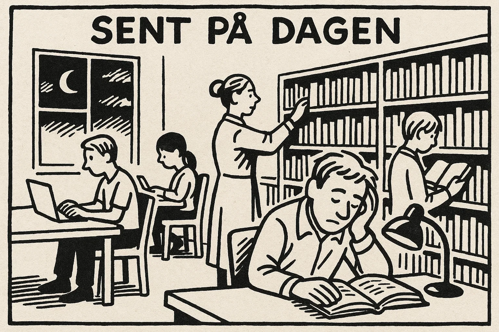
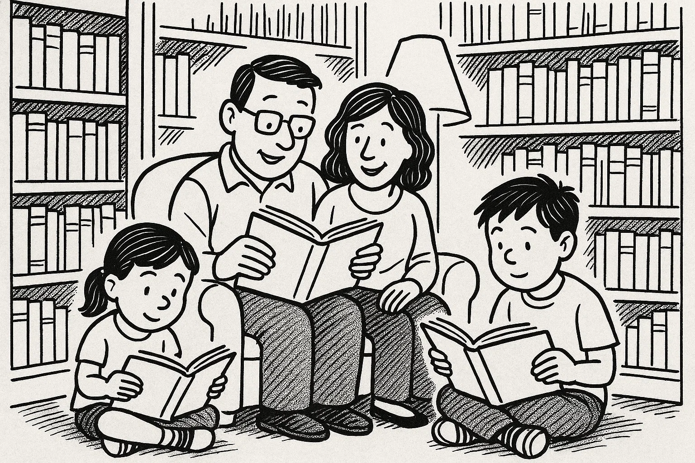
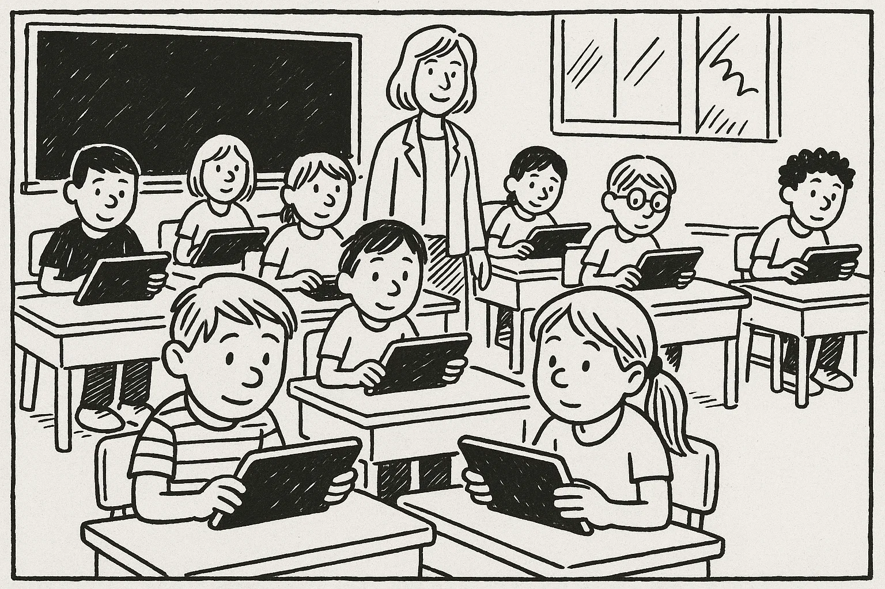
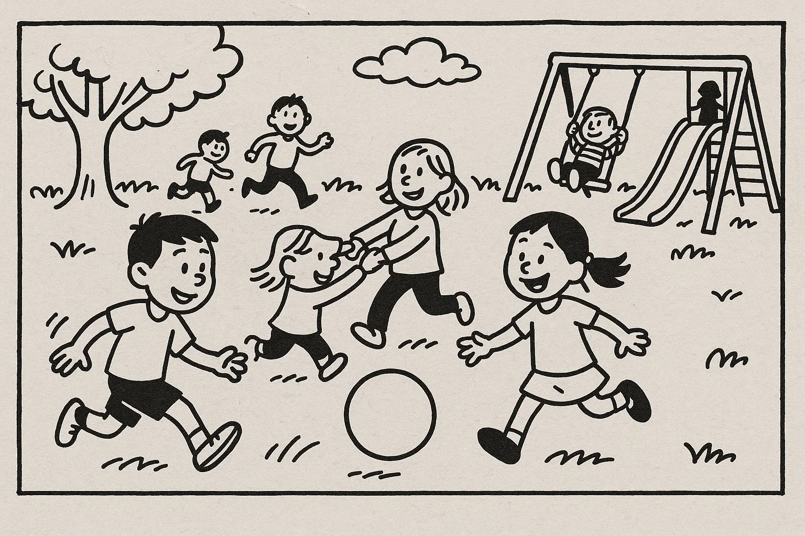
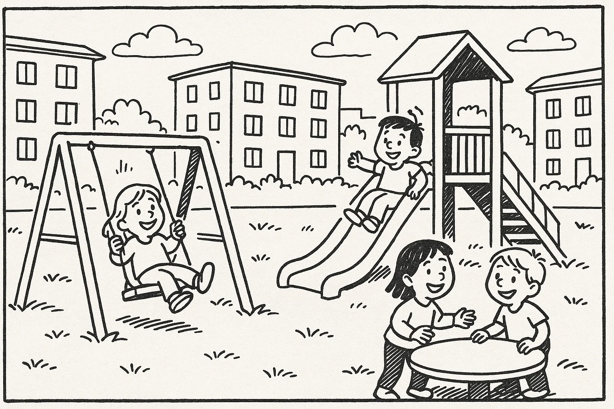

# Prøve i Dansk 2 _Practice Test 2_

  

## Outline

- Læseforståelse (90 minutter)
  - Delprøve 1
  - Delprøve 2
- Skriftlig fremstilling (90 minutter)
- Mundtlig kommunikation (20 minutter)

  Help Den Frie Prøvebank

_This practice test was generated by Den Frie Prøvebank and is unofficial. Den Frie Prøvebank's ability to validate how well its tests match the official tests, in terms of content and structure, is limited. Users should seek guidance from official teaching institutions as to the structure and content of the exams in question._

## Læseforståelse

### Delprøve 1 (30 minutter)

**Ingen hjælpemidler tilladt**

#### Opgave 1

Nedenfor finder du fire opslagstekster (A–D) fra brochurer, pjecer og hjemmesider. I alt er der ca. 1900–2200 ord. Læs dem alle grundigt. Der er seks spørgsmål til teksterne.

**Tekst A: Dit lokale sports- og fritidscenter – et aktivt samlingspunkt**  

Sportscentret “Energi & Bevægelse” i centrum af din kommune er blevet et populært samlingspunkt for borgere i alle aldre. Centret åbnede i 2015 som et samarbejde mellem kommunen og lokale foreninger og er siden blevet udvidet med flere faciliteter. I stueetagen findes et fitnessområde med moderne maskiner, en svømmehal med varmtvandsbassin og en café, der serverer sunde retter og smoothies lavet af lokale råvarer. På første sal er der tre sale, hvor der dagligt holdes hold som gymnastik, dans, pilates og spinning. Der er også et område til børneleg med klatrevæg og trampoliner.  

Centret tilbyder desuden en række kurser og events. Om sommeren arrangeres udendørstræning i parken, og om vinteren er der indendørs klatreworkshops. Seniorer kan deltage i specialhold med fokus på balance og bevægelse, og unge mellem 13 og 17 år kan få gratis adgang til styrketræning efter skole. Alle aktiviteter annonceres i et månedligt program, som kan hentes i receptionen eller på centerets hjemmeside. Hvis du er interesseret i at blive frivillig instruktør, kan du kontakte sportschef Maria Jensen.  

Centret er åbent mandag til torsdag kl. 6.00–22.00, fredag til kl. 20.00 og lørdag kl. 8.00–18.00. Søndag er åbent fra kl. 9.00 til 16.00. Medlemskab koster 450 kr. om måneden for voksne og 250 kr. for studerende og pensionister. Børn under 14 år har gratis adgang i følge med en voksen. Centret har elevator og handicapvenlige omklædningsrum. I skoleferierne tilbydes der særlige familiepakker og svømmeundervisning. For mere information kan man skrive en mail eller besøge kontoret på første sal.

**Tekst B: Byens læsefællesskab – læseklubber og bogsaloner**  

Læsefællesskabet “Bogvenner” er et initiativ fra byens bibliotek, der skal fremme læselyst og skabe socialt samvær gennem bøger. Projektet startede i 2020 og har i dag over 200 medlemmer fordelt på forskellige læseklubber. Hver klub består af 8–10 deltagere, som mødes en gang om måneden for at diskutere en udvalgt bog. Der findes klubber for krimielskere, science fiction, klassikere, biografier samt en gruppe specielt for nye danskere, der ønsker at forbedre deres sprog gennem litteratur. Til hver møde står bibliotekaren klar med spørgsmål og baggrundsinformation om forfatteren.  

Ud over de faste klubber arrangeres der bogsaloner fire gange om året. Til bogsalonerne inviteres forfattere til oplæsninger og dialog. Der serveres kaffe og kage, og arrangementerne er gratis for medlemmer. Man kan også deltage som gæst mod et mindre gebyr på 50 kr. Alle datoer annonceres på bibliotekets hjemmeside og sociale medier. For at blive medlem af “Bogvenner” skal man udfylde en online formular og betale et årligt kontingent på 300 kr., som dækker materialer og arrangementer. Studerende betaler halv pris.  

Biblioteket har åbent mandag til torsdag kl. 10.00–19.00, fredag kl. 10.00–17.00 og lørdag kl. 10.00–14.00. Læsekredsene mødes hovedsageligt om aftenen efter kl. 17. Børn er velkomne til bibliotekets børneafdeling, men læseklubberne er for voksne. Hvis du har spørgsmål, kan du kontakte projektkoordinator Lars Madsen på telefon eller via e‑mail.

**Tekst C: Økologisk torvemarked – direkte fra gården til dit bord**  

Det ugentlige økologiske torvemarked på Torvet i centrum er blevet en fast tradition for madglade borgere. Hver lørdag fra april til oktober fyldes pladsen med boder fra lokale landmænd, gartnerier og små producenter, som sælger frugt, grøntsager, honning, ost, brød og kødprodukter. Torvemarkedet startede i 2012 som et borgerinitiativ for at støtte lokale producenter og reducere transporten af fødevarer. Alle varer på markedet er certificeret økologiske, og mange kommer direkte fra producentens mark samme morgen.  

Markedsdagen begynder kl. 9.00 og slutter kl. 14.00. Der er gratis adgang, og man kan parkere sin cykel i de opstillede stativer. Kontant betaling og MobilePay accepteres. Der arrangeres også demonstrationer af madlavning, hvor kokke fra byens restauranter viser, hvordan man kan bruge sæsonens råvarer i sunde retter. For børn er der en bageworkshop og mulighed for at hilse på gårdens dyr.  

Markedsforeningen tilbyder et medlemskab til 200 kr. om året, som giver medlemmer en stofpose, sæsonopskrifter og invitationer til særlige events som gårdbesøg. For at blive medlem kan man tilmelde sig på foreningens hjemmeside eller direkte ved medlemsboden på markedet. Organisationen drives af frivillige, og man kan melde sig til at hjælpe med opsætning og oprydning. Hvis vejret er dårligt, flyttes markedet til sportshallen ved siden af Torvet. Har du spørgsmål, kan du kontakte formand Kirsten Poulsen.

**Tekst D: Grøn transportdag – din chance for at prøve elbiler og cykler**  

Hver forårsstart inviterer kommunen til “Grøn Transportdag” på rådhuspladsen. Arrangementet har til formål at inspirere borgerne til at vælge klimavenlige transportformer. På dagen kan man gratis prøvekøre elbiler fra forskellige mærker, teste elcykler og høre oplæg om offentlig transport. Der er også stande fra byens cykelklubber, bilforhandlere og teknikere, der forklarer, hvordan man vedligeholder sin cykel eller installerer en ladestation derhjemme.  

“Grøn Transportdag” finder sted den første lørdag i maj fra kl. 10.00 til 16.00. Der er gratis adgang, men til prøveture med elbiler kræves tilmelding og gyldigt kørekort. Tilmeldingen foregår via kommunens hjemmeside og åbner en måned før. Der er et begrænset antal pladser, så det gælder om at være hurtig. Der serveres gratis kaffe og frugt, og børn kan deltage i en tegnekonkurrence om fremtidens transport. Under arrangementet vil en del af centrum være spærret for biltrafik.  

Initiativet startede i 2018 og har siden tiltrukket flere tusinde besøgende hvert år. Kommunen samarbejder med lokale virksomheder og skoler for at gøre arrangementet til en lærerig og festlig dag. En del frivillige hjælper med at guide folk og sørge for sikkerhed på prøveturene. Hvis du ønsker at bidrage som frivillig, kan du udfylde en formular online eller møde op til infomødet to uger før arrangementet. Du kan kontakte eventansvarlig Henrik Pedersen for yderligere oplysninger.

##### Spørgsmål til teksterne

1. Hvad koster et månedligt medlemskab for voksne i sports- og fritidscenteret “Energi & Bevægelse”?  

2. Hvor ofte mødes læseklubberne i “Bogvenner”?  

3. Hvornår finder torvemarkedet sted om lørdagen?  

4. Nævn to fordele, man får som medlem af markedsforeningen.  

5. Hvornår afholdes “Grøn Transportdag”?  

6. Hvad kræves for at prøvekøre en elbil til transportdagen?  

#### Opgave 2

Nedenfor finder du ni korte tekster (A–I), fx annoncer og opslag, med en samlet længde på omkring 375 ord. De enkelte tekster identificeres ved et bogstav. Der er syv sætninger (1–7), som skal matches med teksterne. Sæt kun ét bogstav ved hver sætning.  

**A.** _Hund savnet_ – En sort labrador med rødt halsbånd forsvandt mandag ved byparken. Den lyder navnet Bella. Finder du den, ring venligst til 20 45 67 89. Der gives belønning.  

**B.** _Frisørudlært søges_ – Vores salon i Odense centrum søger en engageret frisør. Stillingen er deltid, 20 timer om ugen, inkl. aftener og lørdage. Send ansøgning senest 30. september til hair@salon.dk.  

**C.** _Gratis haveforedrag_ – Biblioteket inviterer til foredrag om bæredygtigt havearbejde torsdag kl. 18.00. Hør hvordan du dyrker krydderurter på altanen. Der serveres te og kage.  

**D.** _Værelse udlejes_ – Møbleret værelse på 30 m² i Aarhus N. Husleje 3.500 kr. pr. måned inkl. varme. Nær bus og indkøb. Kontakt 51 62 73 84 for fremvisning.  

**E.** _Ring fundet_ – Guld ring med lille hjerte fundet ved busstoppestedet på Hovedgaden. Kan afhentes på politistationen ved fremvisning af ID og beskrivelse.  

**F.** _Barista søges_ – Travl café i Aalborg leder efter smilende barista. 10 timer om ugen, primært morgenvagter. Erfaring med espressomaskiner en fordel. Kontakt via www.cafejob.dk.  

**G.** _Jazzfestival_ – Fredag til søndag afholdes den årlige jazzfestival på torvet. Gratis koncerter fra kl. 14.00 hver dag. Madboder og børneaktiviteter.  

**H.** _IT‑hjælp til seniorer_ – Kommunens borgerservice tilbyder gratis computerhjælp til ældre hver mandag kl. 10–12. Medbring din laptop eller tablet. Tilmelding på telefon 70 80 90 00.  

**I.** _Nyt løbehold_ – Bliv en del af vores løbehold for begyndere. Vi mødes hver tirsdag kl. 18 ved stadion. Alle kan deltage. Tilmelding ikke nødvendig.

**Sætninger:**

_Sæt kun ét bogstav ved hver sætning._

1. Jeg mangler et sted at bo i Aarhus og vil leje et møbleret værelse. _________ 
2. Min guld ring er blevet væk på Hovedgaden. Hvor kan jeg hente den? _________
3. Jeg kan arbejde nogle morgener og har erfaring som barista. _________
4. Jeg vil gerne til gratis koncerter i weekenden og høre jazzmusik. _________
5. Min bedstemor har brug for hjælp til sin tablet. Hvem kan hun kontakte? _________  
6. Jeg savner min sorte hund, der hedder Bella. _________
7. Jeg elsker havearbejde og vil gerne høre et foredrag om krydderurter. _________

### Delprøve 2 (60 minutter)

**Ingen hjælpemidler tilladt**

#### Opgave 3

Læs nedenstående fortælling. I teksten er der fjernet ni ord. Det første manglende ord fungerer som et eksempel. Ordene findes i listen under teksten sammen med fem ekstra ord, der ikke passer.

**Tekst:**  
Ahmed flyttede til en mindre dansk by sidste år for at arbejde som **(1)** ______ chauffør. Han kendte kun få mennesker i området, og hans danske ordforråd var begrænset. I begyndelsen følte han sig **(2)** ______, når han skulle tale med kunderne, men han besluttede at se det som en udfordring. Efter arbejde gik han ofte en tur gennem byen for at lære de lokale at kende. Han opdagede hurtigt et hyggeligt fælleshus, hvor der blev holdt madklub og fodbold om fredagen.  

Folk var imødekommende, og en ældre kvinde inviterede ham til at deltage i deres ugentlige middag. Her delte alle noget mad fra deres hjemland, og Ahmed bidrog med sin mors opskrift på krydret kylling. Fællesskabet gav ham et **(3)** ______, som han havde savnet siden flytningen.  

For at forbedre sit sprog meldte Ahmed sig også til et aftenkursus på **(4)** ______. Læreren var tålmodig og lavede øvelser, der gjorde det sjovt at lære. Han købte en bog, hvor han skrev nye gloser ned, og han brugte sin mobil til at **(5)** ______ med kollegerne. Efter nogle måneder følte han sig mere sikker i hverdagen.  

Ahmed blev også involveret i en lokal fodboldklub. Han trænede med holdet to gange om ugen og lærte samtidig om danske traditioner. I starten var det **(6)** ______ at følge trænerens instruktioner, men holdkammeraterne hjalp ham. Snart begyndte de at grine og lave indforståede jokes sammen.  

Det der betød mest for Ahmed, var, at han følte sig accepteret. Hans bedste ven fra klubben introducerede ham for en gruppe, der arrangerer ture til større byer. På en af turene købte han endelig nye møbler til sin **(7)** ______. Han inviterede gruppen til middag for at sige tak. De var imponerede over hans kogekunst.  

Med tiden udviklede Ahmed et stærkt **(8)** ______ i lokalsamfundet. Han planlægger nu at tage en kort uddannelse for at blive mekaniker, så han kan reparere busserne på værkstedet. Ahmed er glad for sin beslutning og ser frem til sin **(9)** ______ i Danmark.

**Ord til brug (ni passer, fem er distraktorer):**

*Skriv det korrekte ord i hver blank. Ét ord må kun bruges én gang.*

  <ul class="column">
    <li>bus</li>
    <li>skole</li>
    <li>usikker</li>
    <li>telefon</li>
    <li>fællesskab</li>
    <li>sprogskolen</li>
    <li>chatte</li>
  </ul>
  <ul class="column">
    <li>netværk</li>
    <li>kontor</li>
    <li>lejlighed</li>
    <li>fremtid</li>
    <li>madklub</li>
    <li>hobby</li>
    <li>svært</li>
  </ul>

#### Opgave 4

Læs teksten nedenfor. Den består af seks afsnit. I hvert afsnit er der fjernet én sætning. Efter teksten finder du otte sætninger (A–H), hvoraf seks passer i hullerne. To sætninger er distraktorer.

**Tekst:**  

**Afsnit 1**  

Lars var 42 år og arbejdede som grafiker. Han tilbragte mange timer foran computeren hver dag og spiste ofte hurtige måltider uden at tænke på sundheden. En dag under et lægetjek blev han oplyst om, at hans kolesteroltal var forhøjet, og lægen anbefalede ham at ændre livsstil. **(1)** ______  

**Afsnit 2**  

Lars besluttede at begynde i et fitnesscenter. Han meldte sig ind i den lokale hal og fik en personlig træner, der satte ham i gang med et program. **(2)** ______ I starten var han træt og øm, men han mærkede hurtigt, at energien vendte tilbage.  

**Afsnit 3**  

Samtidig ændrede han sin transport til arbejde. I stedet for at køre i bil, begyndte han at cykle de seks kilometer. Regnen og vinden afskrækkede ham ikke; han nød at se naturen langs ruten og hilse på andre cyklister. **(3)** ______  

**Afsnit 4**  

For at spise sundere meldte Lars sig til et kursus i madlavning. Her lærte han at lave retter med grøntsager, fuldkorn og magert kød. Han fik også inspiration til at dyrke sine egne krydderurter på altanen. **(4)** ______ Kursusgruppen mødtes en gang om ugen, og de delte opskrifter og tips.  

**Afsnit 5**  

Udover træning og kost blev fællesskabet vigtigt for Lars. Han engagerede sig i et lokalt fælleshaveprojekt, hvor han sammen med naboer plantede kartofler, salat og jordbær. **(5)** ______ Projektet gav ham nye venner, og de nød at spise det, de selv havde dyrket.  

**Afsnit 6**  

Efter otte måneder følte Lars sig som et nyt menneske. Han havde tabt sig, hans blodtryk var normalt, og han sov bedre om natten. **(6)** ______ Han begyndte at tale til andre om sin rejse og motiverede kolleger til at tage trappen i stedet for elevatoren.

**Sætninger (A–H):**

*Skriv bogstavet for den rigtige sætning ved hver 1 – 6. To sætninger skal ikke bruges.*

<ul class="multiple-choice-answers">
  <li>Lægens ord gjorde ham bevidst om, at han måtte tage sin sundhed alvorligt.</li>
  <li>Han var nervøs i begyndelsen, men træneren fik ham til at føle sig velkommen.</li>
  <li>Før havde han altid taget bilen, fordi det virkede nemmest.</li>
  <li>Det overraskede ham, hvor meget glæde havearbejde gav ham.</li>
  <li>At dyrke sine egne grøntsager gav ham en dybere forståelse for maden.</li>
  <li>Vennerne i projektet inviterede ham på ferie til Sydeuropa.</li>
  <li>Erfaringerne gav ham lyst til at fortsætte de sunde vaner i fremtiden.</li>
  <li>Hans kolleger var imponerede over, at han cyklede i regnvejr.</li>
</ul>

#### Opgave 5

Du skal læse et interview med en person. Teksten består af otte afsnit (A–H). Der er fem spørgsmål til teksten. Sæt bogstavet for det afsnit, der indeholder svaret, ved hvert spørgsmål.

**Tekst:**  

**Afsnit A**  

Morten Jensen er 37 år og arbejder som sygeplejerske på plejehjemmet “Solhjem”. Han bor i en lille by på Fyn med sin partner og deres hund.  

**Afsnit B**  

Efter gymnasiet læste han til sygeplejerske. Han har altid holdt af at arbejde med ældre mennesker og arbejdede en periode på et hospital, før han begyndte på plejehjemmet. Oplevelsen gjorde ham opmærksom på, hvor meget omsorg og tålmodighed betyder.  

**Afsnit C**  

I 2021 startede Morten et projekt på “Solhjem”, hvor beboerne kunne bruge tablets og digitale værktøjer til at holde kontakt med familie og venner samt spille hukommelsesspil. Han skrev et forslag til ledelsen og fik støtte til at købe udstyr.  

**Afsnit D**  

Projektet har nu seks deltagere i teamet: to kolleger fra plejehjemmet og fire frivillige fra byen. De laver digitale fotoalbums, arrangerer videoopkald og hjælper beboerne med at sende e‑mails.  

**Afsnit E**  

En af de største udfordringer er at overbevise både beboere og personale om, at teknologien ikke behøver at være kompliceret. Mange er nervøse for at trykke på “de forkerte” knapper. Morten tager sig tid til at forklare og vise alt i et roligt tempo.  

**Afsnit F**  

Når Morten ikke arbejder, kan han godt lide at lave mad og løbe. Han har gennemført flere halvmaratoner og spiller guitar i et lokalt kor.  

**Afsnit G**  

Mortens inspiration kom fra hans farmor, som altid var nysgerrig efter at lære nye ting. Han dedikerer projektet til hendes minde og håber, at det kan hjælpe andre ældre med at bevare nysgerrigheden.  

**Afsnit H**  

I fremtiden drømmer Morten om at udvide projektet til andre plejehjem i regionen. Han samarbejder med et universitet om at undersøge effekten af digital interaktion for ældre og vil gerne skrive en guide til andre sygeplejersker.

##### Spørgsmål

1. I hvilket afsnit beskrives Mortens fritidsinteresser?  

2. Hvad inspirerede Morten til at starte projektet med tablets og digitale værktøjer?  

3. Hvor mange personer er der i Mortens team?  

4. Hvad er en af de største udfordringer ved projektet?  

5. Hvad håber Morten at gøre i fremtiden med projektet?  

## Skriftlig fremstilling (90 minutter – alle ordbøger tilladt)

### Delprøve 1 – vælg enten 1A eller 1B

**1A.** Du bor i en lejebolig, hvor varmen ofte fungerer dårligt, og radiatoren i stuen er gået i stykker. Skriv en halvformel henvendelse på ca. 150–200 ord til ejendomskontoret, hvor du:

- beskriver problemet med varmen og hvornår det opstod  
- fortæller, hvordan det påvirker din hverdag og eventuelle børn  
- nævner, at du har forsøgt at tale med viceværten eller løse det selv uden held  
- foreslår, hvad ejendomskontoret kan gøre, og hvornår du ønsker en løsning  

**1B.** Din ven har åbnet en gårdbutik uden for byen, der sælger hjemmelavede delikatesser og lokale produkter. Han beder dig om at skrive et opslag til hans hjemmeside, der skal tiltrække nye kunder. Skriv en halvformel tekst på ca. 150–200 ord, hvor du:

- beskriver butikens beliggenhed og omgivelser  
- fortæller om sortimentet og særlige sæsonvarer  
- fremhæver den hyggelige atmosfære og de bæredygtige værdier  
- opfordrer folk til at besøge butikken og dele nyheden  

### Delprøve 2

Du har netop gennemført et forløb i et lokalt motionscenter med en personlig træner. Din træner beder dig om at skrive en kort e‑mail til en person, der overvejer at tilmelde sig samme forløb. Skriv en uformel e‑mail på mindst 100 ord, hvor du:

- hilser pænt og præsenterer dig selv  
- fortæller kort, hvordan forløbet var opbygget (træning, kostvejledning, mødetider)  
- beskriver, hvad du lærte, og hvordan det ændrede din hverdag  
- giver din mening om træneren og gruppestemningen  
- opmuntrer personen til at tilmelde sig og tilbyder at svare på spørgsmål  

_Brug disse sider til at skrive din skriftlige opgave._

## Mundtlig kommunikation (20 minutter for to prøvedeltagere)

### Delprøve 1 (ca. 10 minutter i alt)

Hver prøvedeltager forbereder og holder en præsentation på ca. 1½ minut om et selvvalgt emne fra sin hverdag, fx arbejde, familie, fritidsinteresser, bolig eller en tradition. Efter præsentationen interviewer eksaminator prøvedeltageren i ca. 3½ minut med spørgsmål, der uddyber emnet.  

**Fokus:** Evne til at fortælle sammenhængende om personligt erfarede forhold og at forstå og besvare spørgsmål fra eksaminator.

### Delprøve 2 (ca. 10 minutter i alt)

Der er tre emner (A, B og C) om konkrete hverdagsforhold. Til hvert emne hører to billeder (Billede 1 og Billede 2), som illustrerer en situation. Prøvedeltagerne vælger ét emne. Først interviewer eksaminator hver prøvedeltager enkeltvis om det valgte billede. Derefter følger en samtale mellem de to prøvedeltagere, hvor de taler sammen på baggrund af en case, som eksaminator præsenterer. Eksaminator fungerer som mediator og sørger for, at begge prøvedeltagere kommer til orde.

**Emner og billeder:**

- **Emne A: Biblioteksåbningstider og fællesskab**  

  Byrådet overvejer at reducere bibliotekets åbningstider for at spare penge. Diskutér fordele og ulemper ved denne beslutning, og kom med forslag til, hvordan borgerne kan bevare muligheden for fælles aktiviteter som læseklubber og studierum.

  

  

- **Emne B: Børn og teknologi**  

  Skolebestyrelsen foreslår, at elever fra 1. klasse skal bruge tablets i alle fag. Diskutér fordele og ulemper ved øget brug af teknologi i undervisningen, og kom med ideer til, hvordan man kan sikre balance mellem skærmtid og fysisk aktivitet.

  

  

- **Emne C: Bolig og naboskab**  

  Boligforeningen planlægger at opsætte en ny legeplads i gården. Nogle beboere klager over støj og mindre parkeringsplads, mens andre glæder sig over flere tilbud til børn. Diskutér, hvad det betyder for fællesskab og trivsel, og foreslå løsninger, der tager hensyn til alles behov.

  

  

---

_This practice test was generated by Den Frie Prøvebank and is unofficial. Den Frie Prøvebank's ability to validate how well its tests match the official tests, in terms of content and structure, is limited. Users should seek guidance from official teaching institutions as to the structure and content of the exams in question._
