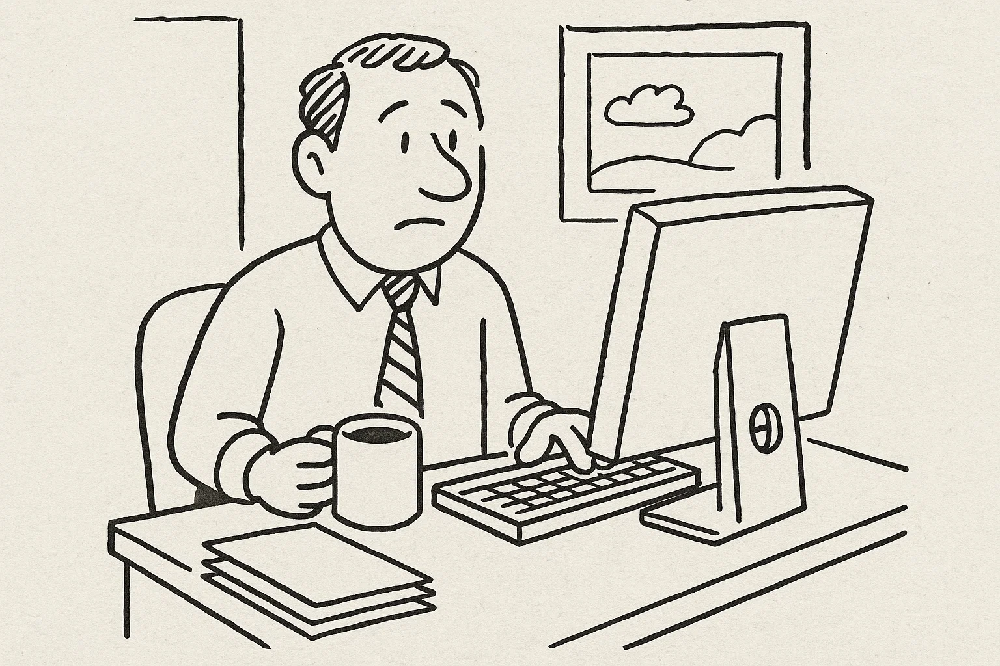
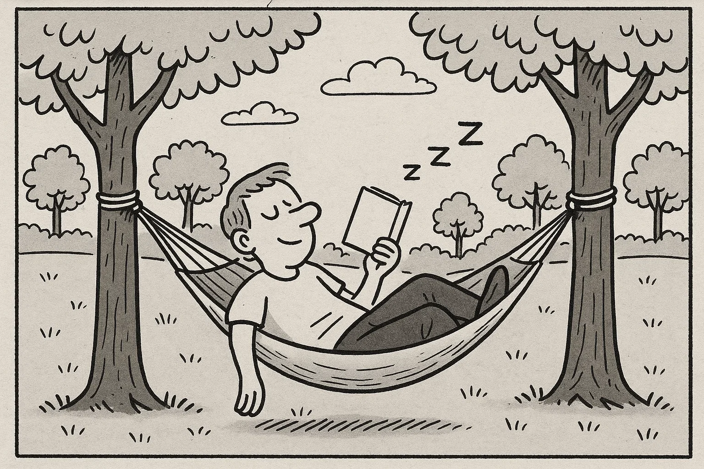
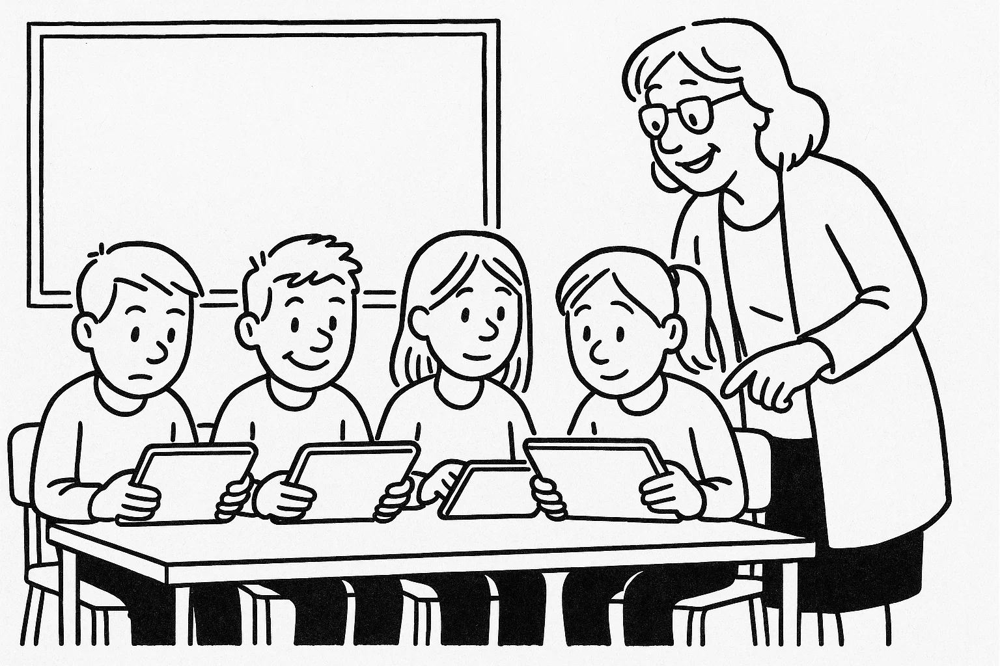
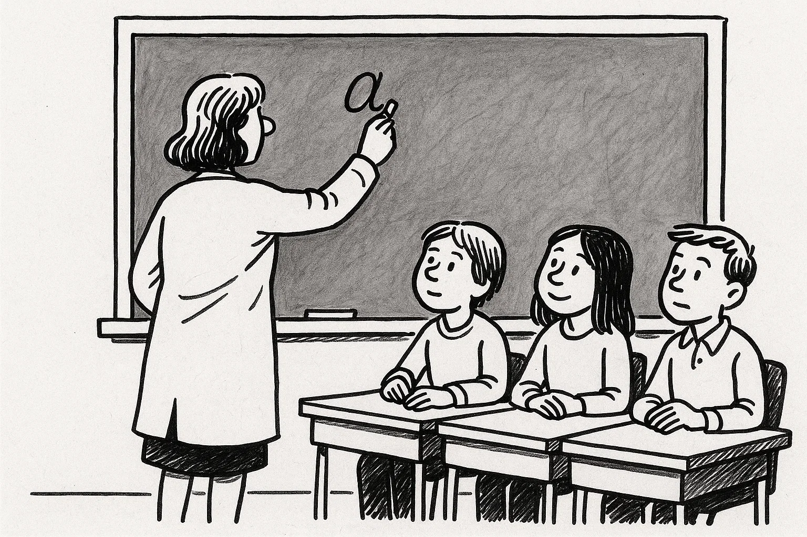
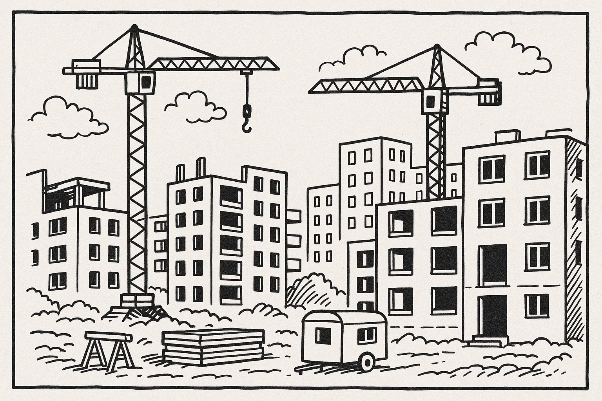
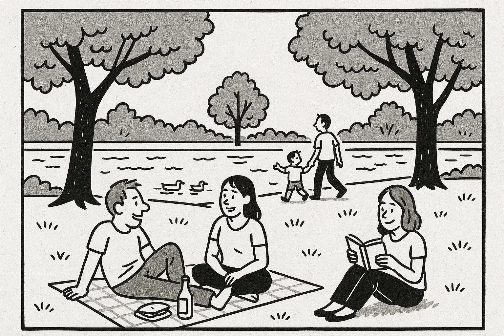

# Prøve i Dansk 2 _Practice Test 3_

  

## Outline

- Læseforståelse (90 minutter)
  - Delprøve 1
  - Delprøve 2
- Skriftlig fremstilling (90 minutter)
- Mundtlig kommunikation (20 minutter)

  Help Den Frie Prøvebank

_This practice test was generated by Den Frie Prøvebank and is unofficial. Den Frie Prøvebank's ability to validate how well its tests match the official tests, in terms of content and structure, is limited. Users should seek guidance from official teaching institutions as to the structure and content of the exams in question._

## Læseforståelse

### Delprøve 1 (30 minutter)

**Ingen hjælpemidler tilladt**

#### Opgave 1

Nedenfor finder du fire opslagstekster (A–D) fra brochurer, pjecer og hjemmesider. I alt er der ca. 2000 ord. Læs dem alle grundigt. Der er seks spørgsmål til teksterne.

**Tekst A: Det lokale bibliotek – mere end bøger**  

Bybiblioteket i din kommune har siden åbningen i 2005 udviklet sig til et levende kulturhus. Biblioteket ligger i en moderne bygning tæt på torvet og blev senest udvidet med en ny læsesal i 2018. På stueetagen finder du en café med lette måltider, et børnehjørne med farverige møbler og et udstillingsområde, hvor lokale kunstnere udstiller deres værker. På første sal er der studierum, et lydstudie og et makerspace, hvor du kan låne værktøj til hobbyprojekter.  

Biblioteket tilbyder også en lang række arrangementer: læsekredse, foredrag, forfatteraftener, filmklubber og workshops i kreativ skrivning. Hver uge afholdes der ”digital hjælp” for seniorer, hvor frivillige vejleder i brug af tablet, MitID og NemID. Åbningstiderne er mandag til torsdag kl. 9.00–19.00, fredag til kl. 17.00 og lørdag til kl. 14.00. Om søndagen er der lukket. Medlemskab er gratis, men et årskort til særlige kurser og værksteder koster 300 kr. og giver rabat på kopier og print. Børn under 16 år skal have en voksen med til kurser, men de kan få deres eget lånerkort med forældres tilladelse. Biblioteket er handicapvenligt med ramper og elevatorer. Har du forslag til nye bøger eller aktiviteter, kan du kontakte bibliotekaren via e‑mail eller besøge informationsskranken.

**Tekst B: Fritidscenter “AktivLiv” – bevægelse for alle**  

Fritidscenteret ”AktivLiv” åbnede i 2015 og er hurtigt blevet et populært sted for borgere i alle aldre. Centret rummer et svømmebassin, en stor fitnesssal, to dansestudier og en klatrevæg. Aktiviteterne spænder fra yoga, pilates og crossfit til familiehold, seniorgymnastik og børnedans. I multisalen spilles der badminton, basketball og indendørs fodbold. Undervisningen varetages af certificerede instruktører, og udstyret vedligeholdes løbende for at sikre kvaliteten.  

Centret er åbent mandag til fredag kl. 6.00–22.00, lørdag kl. 8.00–18.00 og søndag kl. 9.00–16.00. Medlemskab koster 350 kr. om måneden, mens studerende og pensionister betaler 250 kr. Der findes også et klippekort til 10 gange for 400 kr. Hver første mandag i måneden er der åbent hus med gratis prøvetimer. I caféen serveres sunde smoothies, sandwich og dagens salat. Forældre med små børn kan benytte et bemandet legeområde mod et lille gebyr, så de kan træne i fred. Ønsker du at booke hold eller få mere information, kan du besøge hjemmesiden eller ringe til receptionen i åbningstiden.

**Tekst C: Kommunens digitale borgerservice – hjælp til selvbetjening**  

Kommunen har de seneste år satset stort på digitale løsninger. På hjemmesiden kan du melde flytning, søge boligstøtte, bestille pas eller betale dine regninger. Du logger ind med MitID, og alle blanketter findes på både dansk og engelsk. Har du ikke adgang til computer hjemme, kan du låne en i borgerservicecentret eller på biblioteket.  

For borgere, der er uvante med digitale værktøjer, tilbyder kommunen gratis kurser i selvbetjening. Kurserne foregår hver tirsdag kl. 10.00–12.00 og torsdag kl. 16.00–18.00 i bibliotekets kursuslokale. Her lærer du blandt andet at oprette e‑boks, sende sikre beskeder og bruge NemTjek. Tilmelding sker via telefon 12 34 56 78 eller ved personligt fremmøde. Der er også en hotline, der kan kontaktes på hverdage mellem kl. 8.00–20.00, hvor du kan få hjælp til konkrete spørgsmål. Personalet i borgerservice yder stadig fysisk betjening på hverdage kl. 9.00–15.00, men opfordrer alle til at bruge de digitale løsninger, hvis muligt. Har du behov for særlig støtte på grund af handicap, kan du få tilknyttet en IT‑guide gennem kommunens frivilligkorps.

**Tekst D: Foreningen “Grønne Fællesskaber” – gør noget godt for miljøet**  

“Grønne Fællesskaber” er en nonprofitforening, der arbejder for et grønnere lokalsamfund. Foreningen arrangerer affaldsindsamlinger, plantning af træer, oprettelse af byhaver og workshops om bæredygtig livsstil. Hvert forår organiserer de en genbrugsfestival, hvor man kan bytte tøj, reparere små elektroniske apparater og høre oplæg om klimavenlige valg.  

Foreningen finansieres gennem medlemskontingenter og støtte fra kommunen. Medlemskab koster 200 kr. om året, men unge under 18 år og pensionister kan blive medlemmer gratis. Aktiviteterne planlægges af en gruppe frivillige, og nye deltagere er altid velkomne. Vil du være med til at udvikle en byhave eller stå for en affaldsindsamling i din bydel, kan du oprette en profil på foreningens hjemmeside. Herefter bliver du kontaktet af en koordinator, der introducerer dig til de forskellige projekter. Der afholdes stormøder den første onsdag i måneden kl. 19.00 i kulturhuset, hvor man kan komme med idéer. Ud over de praktiske aktiviteter samarbejder foreningen med skoler og lokale virksomheder om at gøre hverdagen mere bæredygtig.

##### Spørgsmål til teksterne

1. Hvad koster et årskort til særlige kurser og værksteder på biblioteket?  

2. Hvornår har Fritidscenteret “AktivLiv” åbent om søndagen?  

3. Hvordan kan borgere tilmelde sig de gratis kurser i digital selvbetjening?  

4. Nævn én aktivitet, som “Grønne Fællesskaber” arrangerer.  

5. Hvad koster et medlemskab af “Grønne Fællesskaber” for pensionister?  

6. Hvor kan du få hjælp, hvis du har brug for en IT‑guide på grund af handicap?  

#### Opgave 2

Nedenfor finder du ni korte tekster (A–I), fx annoncer og opslag, med en samlet længde på omkring 375 ord. De enkelte tekster identificeres ved et bogstav. Der er syv sætninger (1–7), som skal matches med teksterne. Sæt kun ét bogstav ved hver sætning.  

**A.** *Kat fundet* – En sort kat med hvid plet på brystet er fundet ved legepladsen på Øster Allé. Den har ikke halsbånd. Kontakt dyreinternatet på 98 76 54 32 og beskriv katten for at få den hjem.  

**B.** *Frivillige til musikfestival* – Sommerens hyggeligste festival søger hjælpere til bar, entré og oprydning. Vagter á 4 timer, du får madbilletter og gratis adgang til koncerter. Tilmeld dig på www.fest2025.dk.  

**C.** *Lejlighed til leje* – Lys 3‑værelses lejlighed på 70 m² i Aarhus C udlejes fra 1. november. Husleje 6.200 kr./måned + depositum. Rygning og husdyr ikke tilladt. Ring til 45 67 89 10 for fremvisning.  

**D.** *Dyreinternatet søger hjælpere* – Har du lyst til at gøre en forskel for dyr? Vi mangler frivillige til fodring, rengøring og leg med katte og hunde. Vagter 2–3 timer om ugen. Kontakt os på mail: info@dyrehjælp.dk.  

**E.** *Madlavningskursus* – Lær at lave sunde hverdagsretter på 5 mandage kl. 18–20. Pris: 600 kr. for hele kurset inklusive råvarer. Begrænset antal pladser. Tilmelding på telefon 33 11 22 33.  

**F.** *Bil til salg* – Lille rød Toyota fra 2010, kører 120.000 km, sælges for 45.000 kr. Synet og i god stand. Ring til Pia på 21 21 43 43.  

**G.** *Danseworkshop* – Kom til weekendworkshop med latinamerikanske rytmer. Lørdag og søndag kl. 10–16. Pris: 300 kr. inklusiv frokost. Tilmelding på www.dansnu.dk.  

**H.** *City Marathon* – Løb årets citymarathon den 15. juni. Ruter på 5, 10 og 21 km. Frivillige til vandposter søges også. Meld dig som løber eller hjælper på www.marathon2025.dk.  

**I.** *Sprogudveksling* – Er du interesseret i at øve dansk og spansk? Vi mødes hver onsdag kl. 19 på café “La Plaza”. Ingen tilmelding, det er gratis. Tag en bog eller emner med, du vil tale om.

**Sætninger:**

_Sæt kun ét bogstav ved hver sætning._

1. Jeg vil gerne have et sted at bo i Aarhus fra november. _________  
2. Jeg leder efter en billig bil fra 2010. _________  
3. Jeg vil gerne være med til at fodre og lege med dyr i min fritid. _________  
4. Jeg vil øve spansk og dansk sammen med andre – uden at betale for det. _________  
5. Jeg vil lære at lave nye retter om aftenen og betaler for et kursus med råvarer. _________  
6. Jeg vil gerne hjælpe til ved en festival og få gratis koncerter. _________  
7. Jeg vil løbe 10 km til sommer og kunne også tænke mig at give vand til andre løbere. _________  

### Delprøve 2 (60 minutter)

**Ingen hjælpemidler tilladt**

#### Opgave 3

Læs nedenstående fortælling. I teksten er der fjernet ni ord. Ordene findes i listen under teksten sammen med fem ekstra ord, der ikke passer.  

**Tekst:**  
Min kollega Thomas flyttede fra Fyn til København for at starte på universitetet. I starten kendte han ikke nogen i byen og følte sig **(1)** ______. Han fandt hurtigt et værelse i et **(2)** ______ nær campus, hvor han boede med tre andre studerende. De viste ham rundt i byen og inviterede ham med til fællesmiddage. Han meldte sig til en løbeklub for at holde sig i form og møde nye **(3)** ______.  

Efter et par uger begyndte hans studie at blive travlt. Han skulle læse mange sider hver uge og skrive **(4)** ______ opgaver. Det var tit svært at koncentrere sig, når han savnede sin familie derhjemme. Han ringede derfor ofte hjem for at **(5)** ______ med sine forældre og få gode råd.  

Han lærte også at lave nemme retter som pasta med grøntsager og chili con carne. Hans mad **(6)** ______ blev bedre, og han opdagede, hvor hyggeligt det er at lave mad sammen med andre. Efter eksamen fandt han et studiejob som **(7)** ______ på en café, hvor han lærte at betjene kunder og organisere sin tid. Han fik flere nye venner og følte sig efterhånden **(8)** ______ i København.  

I dag er Thomas glad for sin beslutning. Han har **(9)** ______ et lille netværk af mennesker, som han kan dele glæder og udfordringer med, og han har fundet en god balance mellem studier og fritid.

**Ord til brug (ni passer, fem er distraktorer):**

*Noter: Skriv det korrekte ord i hver blank. Ét ord må kun bruges én gang.*

  <ul class="column">
    <li>ensom</li>
    <li>kollegium</li>
    <li>venner</li>
    <li>akademiske</li>
    <li>tale</li>
    <li>smag</li>
    <li>tjener</li>
  </ul>
  <ul class="column">
    <li>hjemme</li>
    <li>opbygget</li>
    <li>biblioteket</li>
    <li>humor</li>
    <li>bøger</li>
    <li>sport</li>
    <li>dyr</li>
  </ul>

#### Opgave 4

Læs teksten nedenfor. Den består af seks afsnit. I hvert afsnit er der fjernet én sætning. Efter teksten finder du otte sætninger (A–H), hvoraf seks passer i hullerne. To sætninger er distraktorer.  

**Tekst:**  

**Afsnit 1**  

Lasse har altid drømt om at åbne sin egen restaurant. Som barn bagte han kager med sin farmor og så madprogrammer i fjernsynet. Da han var færdig med sin studentereksamen, valgte han at tage en erhvervsuddannelse som kok. **(1)** ______  

**Afsnit 2**  

Lasse kom i lære på en travl café i Århus. Her stod han tidligt op for at forberede morgenbuffeten og blev ofte sent, fordi der skulle gøres rent efter lukketid. **(2)** ______ Han lærte vigtigheden af teamwork og hvordan man holder hovedet koldt i spidsbelastninger.  

**Afsnit 3**  

Efter sin læretid rejste Lasse til Italien for at fordybe sig i det italienske køkken. Han arbejdede på et lille familieejet trattoria i Toscana, hvor alt blev lavet fra bunden. **(3)** ______ Han opdagede, hvor meget passion der ligger i håndværket, og han noterede flittigt nye opskrifter.  

**Afsnit 4**  

Da han kom hjem, havde han lyst til at prøve noget anderledes, så han startede en food truck. Hver morgen parkerede han vognen nær en kontorbygning og begyndte at stege bacon, riste brød og hakke grøntsager. **(4)** ______ Erfaringen gav ham mod til at gå videre med sine drømme.  

**Afsnit 5**  

Med tiden fandt Lasse et lille lokale i sit eget kvarter, hvor han kunne åbne en restaurant. Han brugte weekenderne på at male væggene, samle møbler og indrette køkkenet. **(5)** ______ Han valgte en simpel menu med fokus på sæsonens råvarer.  

**Afsnit 6**  

Restauranten åbnede en kølig efterårsaften. De første uger kom der få gæster, men langsomt bredte rygtet sig. **(6)** ______ Han drømmer allerede om at udvide menukortet og ansætte flere unge kokke, der deler hans entusiasme.

**Sætninger (A–H):**

*Skriv bogstavet for den rigtige sætning ved hver 1 – 6. To sætninger skal ikke bruges.*

<ul class="multiple-choice-answers">
  <li>Han brugte flere år på at spare op og planlægge, før han tog skridtet.</li>
  <li>Det var hårdt arbejde, men kollegerne støttede og lærte ham nye teknikker.</li>
  <li>Hver dag lærte han noget nyt om friske råvarer og enkle smage.</li>
  <li>Kunderne elskede hans kreative sandwich og varme suppe, og rygtet spredte sig hurtigt.</li>
  <li>Han fandt det perfekte lille lokale, som han selv malede og indrettede hyggeligt.</li>
  <li>De første måneder var stressende, men efterhånden fandt han en god balance.</li>
  <li>Han blev inspireret af sin bedstemor, som altid lavede traditionelle danske retter.</li>
  <li>Selv om han ikke brød sig om at arbejde i køkkenet, valgte han at fortsætte.</li>
</ul>

#### Opgave 5

Du skal læse et interview med en person. Teksten består af otte afsnit (A–H). Der er fem spørgsmål til teksten. Sæt bogstavet for det afsnit, der indeholder svaret, ved hvert spørgsmål.

**Tekst:**  

**Afsnit A**  

Jens Holm er 29 år og arbejder som sygeplejerske. Han bor i en lejlighed i Odense sammen med sin partner og deres hund og er glad for at have et hjem tæt på skov og by. Jens beskriver sig selv som både omsorgsfuld og eventyrlysten.  

**Afsnit B**  

Efter gymnasiet rejste Jens et år som volontør i Afrika og oplevede, hvor vigtigt sundhedsarbejde er. Denne oplevelse motiverede ham til at uddanne sig til sygeplejerske. Han læste på professionshøjskolen i Svendborg og arbejdede samtidig på et plejehjem for at få praktisk erfaring.  

**Afsnit C**  

Da han var færdiguddannet, fik Jens job på en travl akutafdeling. Her lærte han at holde hovedet koldt i pressede situationer, samarbejde tæt med læger og kolleger og give både patienter og pårørende ro og tryghed.  

**Afsnit D**  

I dag arbejder Jens som projektleder i en international nødhjælpsorganisation, der sender medicinske hold til katastrofeområder. Hans team består af 10 medarbejdere og flere frivillige. Han koordinerer uddannelse, logistik og opfølgning efter missionerne og forsøger at skabe gode rammer for nye ansatte.  

**Afsnit E**  

Et af de største problemer, Jens nævner, er de mange arbejdstimer og de følelsesmæssige belastninger. Han bruger meditation og løb til at holde stress på afstand. Han understreger også vigtigheden af supervision og kollegial sparring for at kunne håndtere de svære situationer.  

**Afsnit F**  

I fritiden spiller Jens guitar, tager på løbeture med hunden og læser spændingsromaner. Han tilbringer også gerne weekender på camping med sin partner og ser dokumentarfilm om andre kulturer.  

**Afsnit G**  

Jens’ mest mindeværdige oplevelse var at rejse til Nepal efter et jordskælv. Her byggede han sammen med lokale frivillige en midlertidig klinik i en lille bjergby. Han fortæller med et smil, at han stadig skriver med nogle af de mennesker, han mødte.  

**Afsnit H**  

Når han ser fremad, overvejer Jens at læse videre inden for global sundhed. Han drømmer om at starte et træningsprogram for unge, der gerne vil arbejde frivilligt i udlandet, så de bedre kan forberede sig på opgaverne.

##### Spørgsmål

1. I hvilket afsnit beskrives Jens’ familie og boligforhold?  

2. Hvad fik Jens til at vælge en uddannelse inden for sundhed?  

3. Hvor arbejder Jens nu, og hvor mange personer har han i sit team?  

4. Hvilke udfordringer nævner Jens i forbindelse med sit arbejde?  

5. Nævn én aktivitet, Jens dyrker i sin fritid.  

## Skriftlig fremstilling (90 minutter – alle ordbøger tilladt)

### Delprøve 1 – vælg enten 1A eller 1B

**1A.** Du arbejder i en mindre virksomhed, hvor kantinen de seneste måneder har serveret usund og ensformig mad. Du ønsker at skrive til kantinechefen for at gøre opmærksom på problemet og foreslå forbedringer. Skriv en halvformel henvendelse på ca. 150–200 ord, hvor du:

- beskriver, hvilken type mad der bliver serveret, og hvorfor den ikke er tilfredsstillende  
- fortæller, hvordan det påvirker dig og dine kolleger i hverdagen  
- nævner, at I tidligere har taget madpakke med som en midlertidig løsning  
- foreslår konkrete ændringer eller initiativer, der kan gøre kantinen sundere og mere varieret  

**1B.** Din ven har åbnet en gårdbutik, der sælger lokale grøntsager, honning og hjemmelavede produkter. Han har bedt dig om at skrive et opslag til byens facebookside for at tiltrække flere kunder. Skriv en halvformel tekst på ca. 150–200 ord, hvor du:

- beskriver gårdbutikkens beliggenhed og hyggelige atmosfære  
- fortæller om udvalget af varer og eventuelle smagsprøver eller særlige tilbud  
- fremhæver, hvorfor det er en fordel at handle lokalt og støtte producenterne  
- opfordrer folk til at besøge butikken og dele opslaget med venner og familie  

### Delprøve 2

Du har for nylig deltaget i et kursus i førstehjælp. Din underviser beder dig om at skrive en e‑mail til en tidligere kursist, som overvejer at tilmelde sig. Skriv en uformel e‑mail på mindst 100 ord, hvor du:

- hilser pænt og præsenterer dig selv  
- fortæller kort om, hvordan kurset var opbygget, og hvad I lavede  
- beskriver, hvad du lærte, og hvordan du kan bruge det i hverdagen  
- giver din mening om underviseren og klassemiljøet  
- opmuntrer kursisten til at tilmelde sig og tilbyd at besvare eventuelle spørgsmål  

_Brug disse sider til at skrive din skriftlige opgave._

## Mundtlig kommunikation (20 minutter for to prøvedeltagere)

### Delprøve 1 (ca. 10 minutter i alt)

Hver prøvedeltager forbereder og holder en præsentation på ca. 1½ minut om et selvvalgt emne fra sin hverdag, fx arbejde, fritidsinteresser, familie, bolig eller en tradition. Efter præsentationen interviewer eksaminator prøvedeltageren i ca. 3½ minut med spørgsmål, der uddyber emnet.  

**Fokus:** Evne til at fortælle sammenhængende om personligt erfarede forhold og at forstå og besvare spørgsmål fra eksaminator.  

### Delprøve 2 (ca. 10 minutter i alt)

Der er tre emner (A, B og C) om konkrete hverdagsforhold. Til hvert emne hører to billeder (Billede 1 og Billede 2), som illustrerer en situation. Prøvedeltagerne vælger ét emne. Først interviewer eksaminator hver prøvedeltager enkeltvis om det valgte billede. Derefter følger en samtale mellem de to prøvedeltagere, hvor de taler sammen på baggrund af en case, som eksaminator præsenterer. Eksaminator fungerer som mediator og sørger for, at begge prøvedeltagere kommer til orde.

**Emner og billeder:**

- **Emne A: Arbejde og fritid**  

Byrådet overvejer at indføre længere arbejdstid i kommunale institutioner for at øge effektiviteten. Diskutér fordele og ulemper ved en længere arbejdsuge, hvordan man kan skabe balance mellem arbejde og fritid, og kom med forslag til, hvordan man kan sikre medarbejdernes trivsel.

- **Emne B: Uddannelse og teknologi**  

Kommunen vil investere i flere digitale værktøjer i folkeskolen, herunder tablets til eleverne og online lektieplatforme. Diskutér fordele og ulemper for både lærere og elever, hvordan teknologi kan støtte læring, og hvilke hensyn der bør tages til børn, der har brug for mere struktur.

- **Emne C: Bolig og nabolag**  

Kommunen planlægger at bygge nye boligblokke i et grønt område tæt på byens sø. Diskutér fordele og ulemper ved at udvide boligudbuddet på bekostning af naturen, og kom med forslag til, hvordan man kan bevare fællesskab og miljø i nye bydele.

---

_This practice test was generated by Den Frie Prøvebank and is unofficial. Den Frie Prøvebank's ability to validate how well its tests match the official tests, in terms of content and structure, is limited. Users should seek guidance from official teaching institutions as to the structure and content of the exams in question._
