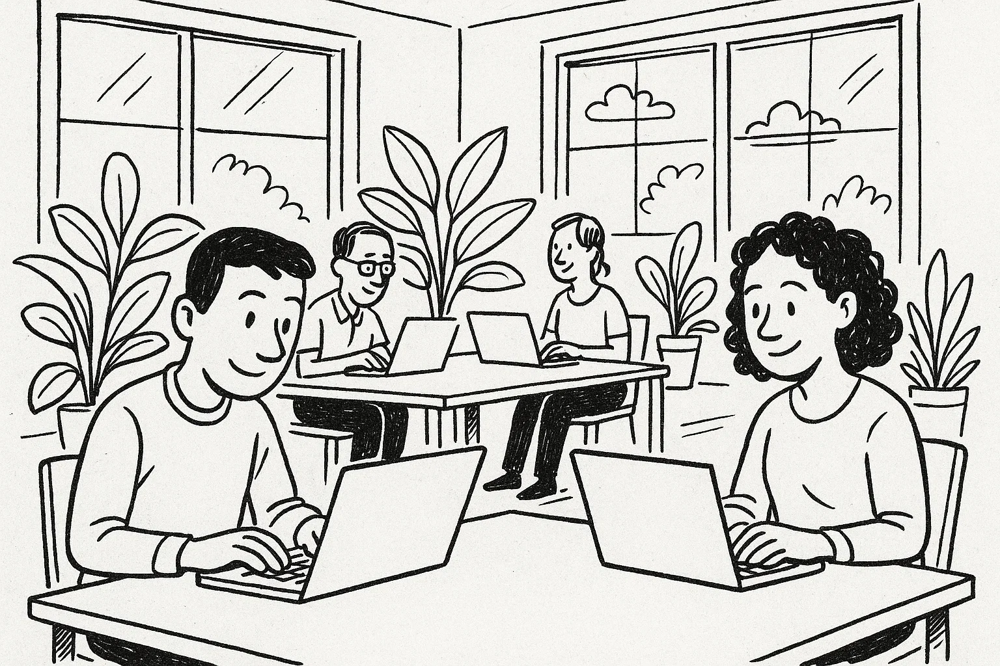
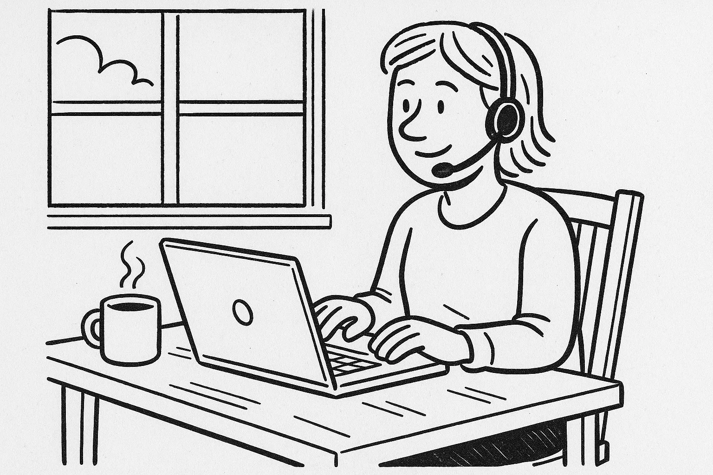
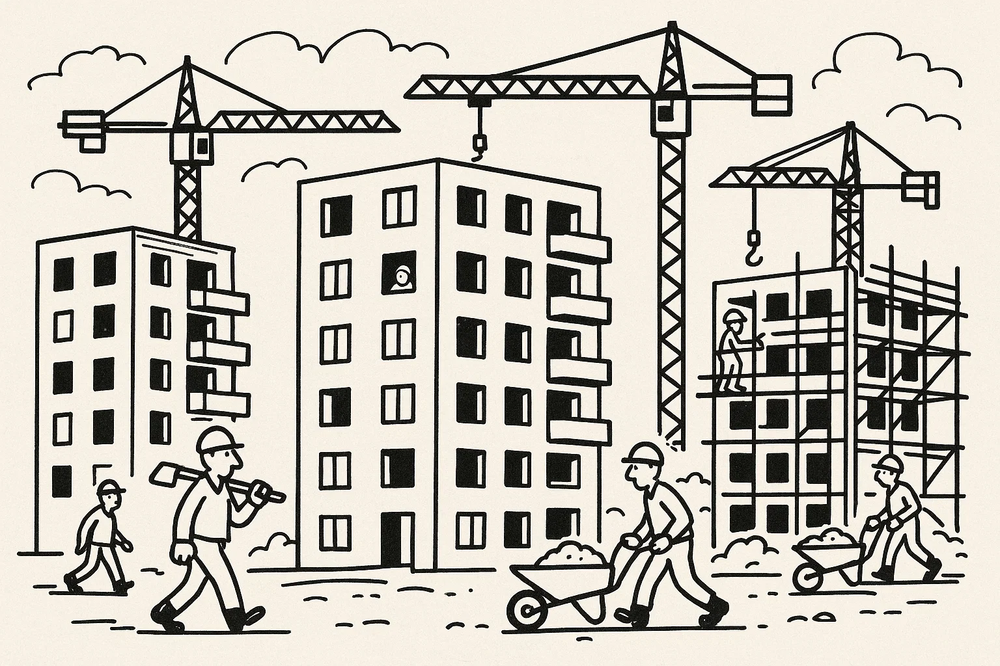
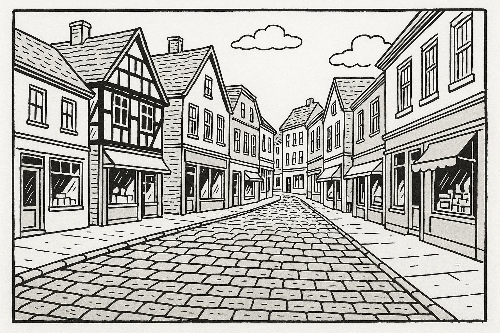
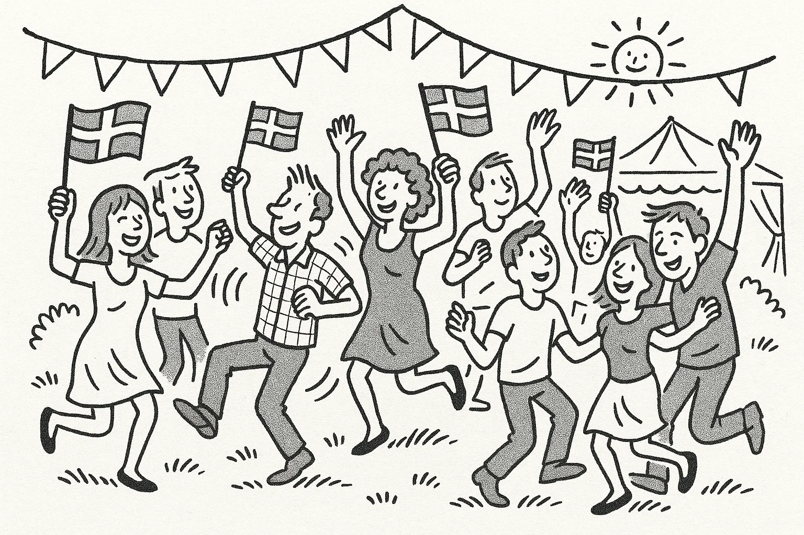
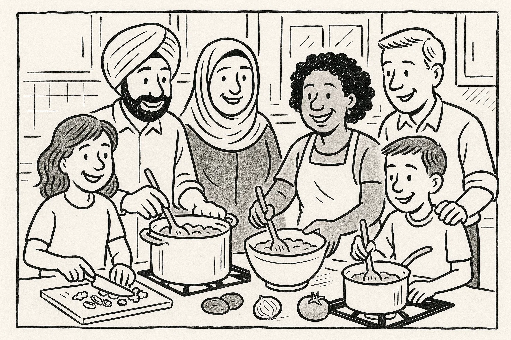

# Prøve i Dansk 2 _Practice Test 4_

  

## Outline

- Læseforståelse (90 minutter)
  - Delprøve 1
  - Delprøve 2
- Skriftlig fremstilling (90 minutter)
- Mundtlig kommunikation (20 minutter)

  Help Den Frie Prøvebank

_This practice test was generated by Den Frie Prøvebank and is unofficial. Den Frie Prøvebank's ability to validate how well its tests match the official tests, in terms of content and structure, is limited. Users should seek guidance from official teaching institutions as to the structure and content of the exams in question._

## Læseforståelse

### Delprøve 1 (30 minutter)

**Ingen hjælpemidler tilladt**

#### Opgave 1

Nedenfor finder du fire opslagstekster (A–D) fra brochurer, pjecer og hjemmesider. I alt er der omkring 2000 ord. Læs dem alle grundigt. Der er seks spørgsmål til teksterne.

**Tekst A: Dit lokale bibliotek – mere end bøger**

Det kommunale bibliotek i centrum af byen blev renoveret for få år siden og er siden blevet et kulturelt samlingspunkt. Biblioteket ligger i en historisk bygning fra 1920, men indvendigt er der lyse læsesale, moderne computere og et særskilt børnehjørne med farverige møbler. Ud over at låne bøger og film kan du deltage i bogklubber, foredrag og kreative workshops. Der tilbydes jævnligt oplæsning for børn, sprogudveksling for udlændinge og kurser i digital selvbetjening. I stueetagen er der en café, der serverer økologisk kaffe, te og lette retter til rimelige priser. Caféen holder åbent mandag til fredag kl. 9.00–16.00.  

Biblioteket er åbent fra kl. 8.30–20.00 mandag til torsdag, fredag til kl. 18.00 og lørdag til kl. 14.00. Søndag er der lukket. Medlemskab koster 300 kr. om året og giver adgang til at reservere materialer online samt rabat på arrangementer. Børn under 14 år er gratis medlemmer, hvis de er tilmeldt sammen med en voksen. For mennesker med nedsat mobilitet er der elevator til alle etager og handicapvenlige toiletter. Har du spørgsmål eller ønsker at arrangere en aktivitet, kan du kontakte bibliotekaren på mail eller besøge informationsskranken på første sal.

**Tekst B: Byens fælleshave – dyrk dine egne grøntsager**

Fælleshaven “Grønne Fingre” ligger på et tidligere industrigrund, som kommunen har omdannet til et grønt område. Her kan beboere i alle aldre dyrke blomster, krydderurter og grøntsager i små højbede. Sæsonen strækker sig fra marts til oktober; i vintermånederne er haven lukket. For et årligt kontingent på 250 kr. får du adgang til et bed, redskur, fælles frøbank og adgang til kurser i økologisk dyrkning. Der arrangeres fælles arbejdsdage og høstfester, hvor medlemmerne deler erfaringer og opskrifter.  

Fælleshaven drives af en frivillig bestyrelse i samarbejde med kommunen. Reglerne er enkle: der må ikke bruges pesticider, man skal holde sit bed rent for ukrudt, og man skal vise hensyn til naboernes afgrøder. Vand findes i opsamlingstanke, der fyldes op med regnvand, og der er en lille kaffevogn, som holder åbent lørdage fra kl. 10.00–12.00. Har du lyst til at være med, kan du skrive dig på ventelisten via hjemmesiden eller møde op til de åbne dage den første søndag i måneden.

**Tekst C: Vinterbadning – sundhed og fællesskab**

Vinterbadeklubben “Fjordens Friske” tilbyder adgang til et lille, opvarmet klubhus ved vandkanten og en badebro, der er åben hele året. Klubben blev grundlagt af en gruppe venner i 2010 og har nu omkring 400 medlemmer. Mange melder sig ind for at styrke immunforsvaret og opleve et energiboost i de kolde måneder. For at blive medlem skal du være fyldt 18 år og betale et kontingent på 600 kr. pr. år. Det inkluderer brug af saunaen, adgang til fællesarrangementer og sikkerhedsinstruktioner.  

Klubben holder åbent fra kl. 6.00–22.00 alle ugens dage. Nye medlemmer skal deltage i en introduktion, hvor de lærer om sikkerhed, isfrit område og opvarmningsteknikker. Om søndagen arrangeres der fælles dyp, hvor man efterfølgende drikker varm te og spiser hjemmebagt kage. Udover vinterbadning arrangerer klubben foredrag om sundhed, yoga på stranden og fælles vandreture. Kontakt klubbens formand for at høre mere.

**Tekst D: Karrierecenter – hjælp til jobsøgning**

Kommunens karrierecenter ligger i rådhuset og hjælper jobsøgende med at komme videre i arbejdslivet. Centret tilbyder CV‑workshops, kurser i jobsamtaleteknik, individuel vejledning og adgang til jobbanker. Tilbuddene er gratis for alle borgere i kommunen, både unge, nyuddannede og voksne, der ønsker at skifte karriere. Man kan også få rådgivning om uddannelsesmuligheder og praktikophold. Centret har åbent mandag–torsdag kl. 9.00–16.00 og fredag kl. 9.00–13.00.  

For at booke en tid til individuel sparring skal du oprette en profil på centrets hjemmeside eller ringe i telefontiden. Jobmesser og virksomhedsbesøg annonceres løbende, og der er særlige arrangementer for udlændinge, hvor der er fokus på danske ansøgningskrav. Der er adgang for kørestolsbrugere via en rampe ved siden af hovedindgangen, og hvis du har behov for tolkning, kan det aftales på forhånd.

##### Spørgsmål til teksterne

1. Hvornår lukker biblioteket normalt om fredagen?  

2. Hvor meget koster et årligt medlemskab af fælleshaven “Grønne Fingre”?  

3. I hvilke måneder er fælleshaven tilgængelig?  

4. Nævn én fordel ved at være medlem af vinterbadeklubben “Fjordens Friske”.  

5. Hvor ligger karrierecentret, og hvad koster det at bruge det?  

6. Hvem kan benytte karrierecentrets tilbud?  

#### Opgave 2

Nedenfor finder du ni korte tekster (A–I), fx annoncer og opslag, med en samlet længde på omkring 375 ord. De enkelte tekster identificeres ved et bogstav. Der er syv sætninger (1–7), som skal matches med teksterne. Sæt kun ét bogstav ved hver sætning.  

**A.** *Savner du din hund?* – En sort Labrador med rød halsbånd er fundet i parken. Den virker tam og venlig. Henvendelse med beskrivelse til tlf. 23 45 67 89.  

**B.** *Frisk fisk direkte fra havnen* – Hver lørdag kl. 8–12 sælger lokale fiskere deres fangst på torvet. Kom tidligt for at få de bedste varer.  

**C.** *Bus 102 omkørsel* – På grund af vejarbejde kører bus 102 ikke til stationen fra 5.–15. oktober. Brug bus 104 eller tog i stedet.  

**D.** *Deltag i strandrensning* – Vi mødes på parkeringspladsen ved stranden søndag kl. 10. Handsker og poser udleveres. Alle aldersgrupper er velkomne.  

**E.** *Børnepasser søges* – Familie i Horsens søger erfaren babysitter til to børn (3 og 5 år) 2–3 aftener om ugen. Send kort ansøgning med referencer til mail: familie@horsens.dk.  

**F.** *Gratis samtalecafé* – Har du lyst til at øve dansk? Kom til samtalecafé på biblioteket tirsdage kl. 17–19. Frivillige hjælper med samtale og spil. Ingen tilmelding.  

**G.** *Computerklub for unge* – Mandage kl. 16–18 tilbyder IT‑foreningen et kursus i programmering og kodning for børn og unge 10–15 år. Deltagelse er gratis, men tilmelding kræves.  

**H.** *Cykelløb for velgørenhed* – Skriv dig op til årets cykelløb lørdag den 12. juni. Distancer fra 20 til 100 km. Overskuddet går til en børneorganisation.  

**I.** *Høstmarked* – Søndag kl. 11–15 afholder menighedsrådet marked med lokale grøntsager, honning og håndværk. Der er kaffe og kage.  

**Sætninger:**

_Sæt kun ét bogstav ved hver sætning._

1. Jeg vil gerne øve mig på dansk i uformelle rammer. _________  
2. Min datter er 12 år og elsker computere. Hvor kan hun lære at programmere? _________  
3. Jeg vil købe friske råvarer søndag formiddag. Hvor skal jeg møde op? _________  
4. Min sorte hund er væk. Hvem efterlyser den? _________  
5. Jeg har lyst til at samle affald ved stranden i weekenden. _________  
6. Min sædvanlige bus kommer ikke til stationen. Hvad foregår der? _________  
7. Jeg har brug for en pålidelig person til at passe mine børn om aftenen. _________  

### Delprøve 2 (60 minutter)

**Ingen hjælpemidler tilladt**

#### Opgave 3

Læs nedenstående fortælling. I teksten er der fjernet ni ord. Ordene findes i listen under teksten sammen med fem ekstra ord, der ikke passer.

**Tekst:**  
Jamal flyttede til Danmark for seks måneder siden. Da han kom, kendte han kun et par mennesker og talte næsten ikke dansk. Han meldte sig hurtigt til en sprogskole, hvor han mødte **(1)** ______ udlændinge, som var i samme situation. I begyndelsen syntes han, at det danske vejr var **(2)** ______ og mørkt, og han savnede sin familie meget. Han brugte derfor mange aftener på at **(3)** ______ med dem på videoopkald.  

Efter et par måneder begyndte han at deltage i aktiviteter i lokalområdet. Han tilmeldte sig en fodboldklub og et madlavningskursus, hvor han fandt et godt **(4)** ______. Hans **(5)** ______ for dansk mad voksede langsomt, især efter at han havde lært at lave smørrebrød og kanelboller. På sprogskolen fik han en god **(6)** ______ med sin lærer, som opmuntrede ham til at øve sig hver dag. Snart turde han tale med naboerne og spørge om hjælp, når noget var **(7)** ______.  

I dag arbejder Jamal som elektrikerlærling. Han synes, det er meningsfuldt at **(8)** ______ for andre mennesker, og han planlægger at tage en uddannelse, når han er færdig. Han er stolt af at have skabt et nyt **(9)** ______ i Danmark og føler sig nu hjemme her.

**Ord til brug (ni passer, fem er distraktorer):**

*Noter: Skriv det korrekte ord i hver blank. Ét ord må kun bruges én gang.*

  <ul class="column">
    <li>andre</li>
    <li>kolde</li>
    <li>ringe</li>
    <li>være</li>
    <li>fællesskab</li>
    <li>smag</li>
    <li>relation</li>
  </ul>
  <ul class="column">
    <li>hjælpe</li>
    <li>svært</li>
    <li>liv</li>
    <li>besøge</li>
    <li>humor</li>
    <li>landsby</li>
    <li>kede</li>
  </ul>

#### Opgave 4

Læs teksten nedenfor. Den består af seks afsnit. I hvert afsnit er der fjernet én sætning. Efter teksten finder du otte sætninger (A–H), hvoraf seks passer i hullerne. To sætninger er distraktorer.

**Tekst:**

**Afsnit 1**  

Martin har aldrig været glad for sport, men en dag så han et løb i fjernsynet og blev inspireret. Han besluttede sig for at gennemføre et maraton, selvom han var i dårlig form. Han læste om træningsplaner og talte med venner, der løber. **(1)** ______

**Afsnit 2**

Martin startede med korte ture rundt om søerne. I begyndelsen var han ofte forpustet og øm. Efter et par uger meldte han sig ind i byens løbeklub, hvor han fandt støtte og motivation. **(2)** ______

**Afsnit 3**

Efter et halvt år kunne Martin løbe længere distancer. Han begyndte at deltage i lokale motionsløb for at øve sig. En morgen gled han på et vådt blad og forstuvede anklen. **(3)** ______ Han kom stærkt tilbage og satte nye mål.

**Afsnit 4**

For at forberede sig til maratonet trænede han også i bakker og skov. Han tog på en træningslejr i Norge sammen med klubben. **(4)** ______ Han lærte at fordele kræfterne og at lytte til sin krop.

**Afsnit 5**

Endelig kom marathondagen. Martin var nervøs men klar. Han lagde ud i et stille tempo og nød den gode stemning blandt løbere og tilskuere. **(5)** ______ I de sidste kilometer var han udmattet, men han gav ikke op.

**Afsnit 6**

Da Martin passerede målstregen, følte han sig euforisk. Han havde bevist over for sig selv, at han kunne gennemføre noget stort. **(6)** ______ Han overvejer nu at hjælpe andre med at finde glæden ved løb.

**Sætninger (A–H):**

*Skriv bogstavet for den rigtige sætning ved hver 1 – 6. To sætninger skal ikke bruges.*

<ul class="multiple-choice-answers">
  <li>Han købte et par gode løbesko og et ur til at måle sin tid.</li>
  <li>Hjemme lavede han en plan med forskellige løberuter i sin by.</li>
  <li>I starten var det hårdt, men han nød fællesskabet i løbeklubben.</li>
  <li>En gang fik han en skade, men fysioterapeuten hjalp ham tilbage på banen.</li>
  <li>Han blev overrasket over de stejle bakker på træningslejren i Norge.</li>
  <li>På selve marathondagen blev han støttet af tilskuere med flag og bannere.</li>
  <li>Efter løbet besluttede han at melde sig som træner for begyndere.</li>
  <li>Han solgte alle sine møbler for at finansiere rejsen.</li>
</ul>

#### Opgave 5

Du skal læse et interview med en person. Teksten består af otte afsnit (A–H). Der er fem spørgsmål til teksten. Sæt bogstavet for det afsnit, der indeholder svaret, ved hvert spørgsmål.

**Tekst:**  

**Afsnit A**  

Morten Holm er 29 år og arbejder som kok. Han står bag cateringfirmaet “Grøn Madglæde”, der hjælper familier og virksomheder med at få sunde og bæredygtige måltider. Morten bor i Århus med sin kæreste og deres hund.

**Afsnit B**  

Efter folkeskolen gik Morten i lære som kok på en lille restaurant. Han elskede at skabe smagsoplevelser, men blev frustreret over mængden af madspild. Han begyndte at eksperimentere med at bruge hele råvarer og læse om økologi.

**Afsnit C**  

I 2019 startede han sin egen virksomhed. De første måneder lavede han alt selv: planlagde menuer, lavede indkøb, tilberedte maden og leverede den på cykel. Mange kunder vidste ikke, at plantebaserede retter kunne være mættende og lækre.

**Afsnit D**  

Virksomheden har nu seks ansatte, hvoraf to er lærlinge. Morten prioriterer at lære de unge om bæredygtigt køkkenhåndværk. Han holder også foredrag på højskoler og deltager i madfestivaler.

**Afsnit E**  

Morten fortæller, at en af de største udfordringer er at finde lokale og økologiske råvarer i vintermånederne. “Priserne stiger, og udvalget er mindre,” forklarer han. Han forsøger at planlægge menuen efter sæson, men kunderne forventer variation hele året.

**Afsnit F**  

Privat lever Morten efter de samme principper, som han promoverer. Han og kæresten har ombygget deres lejlighed med genbrugsmaterialer, spiser primært plantebaseret og sorterer alt affald. De bruger cykel og tog frem for bil og dyrker krydderurter på altanen.

**Afsnit G**  

Når han ikke arbejder, går Morten gerne ture i skoven eller tager på fisketure med sin far. Han spiller guitar i et hobbyband og læser romaner, når han trænger til ro. At være i naturen giver ham ny inspiration.

**Afsnit H**  

Morten drømmer om at udvide sin virksomhed til Sjælland. Han har allerede samarbejde med flere kantiner og håber at udvikle opskriftskasser, som folk kan lave selv hjemme. Han tror, at grøn mad er fremtiden.

##### Spørgsmål

1. I hvilket afsnit beskrives Mortens privatliv?  

2. Hvorfor begyndte Morten at interessere sig for økologi og mindre madspild?  

3. Hvor mange ansatte arbejder der nu i virksomheden “Grøn Madglæde”?  

4. Hvad er en af de største udfordringer i Mortens arbejde?  

5. Hvad laver Morten i sin fritid?  

## Skriftlig fremstilling (90 minutter – alle ordbøger tilladt)

### Delprøve 1 – vælg enten 1A eller 1B

**1A.** Du har et abonnement i dit lokale fitnesscenter. For nylig har centret ændret sine åbningstider, og der er ofte overfyldt i myldretiden. Du ønsker at skrive til centerlederen for at klage og foreslå en løsning. Skriv en halvformel henvendelse på ca. 150–200 ord, hvor du:

- beskriver de nye kortere åbningstider og problematikken med mange mennesker samtidig  
- fortæller, hvordan det påvirker din træning og din motivation  
- nævner, at du har talt med personalet uden at få en konkret løsning  
- foreslår, hvad fitnesscentret kan gøre for at forbedre situationen  

**1B.** Din grundejerforening planlægger en forårsfest for at styrke fællesskabet i kvarteret. Du er blevet bedt om at skrive et opslag til kommunens hjemmeside, som skal tiltrække deltagere og frivillige. Skriv en halvformel tekst på ca. 150–200 ord, hvor du:

- beskriver dato, tidspunkt og sted for festen  
- fortæller om programmet: musik, lege for børn, loppemarked eller madboder  
- fremhæver den hyggelige atmosfære og muligheden for at møde naboer  
- opfordrer folk til at deltage, medbringe kager eller hjælpe til, og mind dem om at dele opslaget  

### Delprøve 2

Du har netop afsluttet et madlavningskursus. Din underviser sender dig en e‑mail, hvor hun beder dig om at skrive et kort brev til en tidligere kursist, som overvejer at starte på kurset. Skriv en uformel e‑mail på mindst 100 ord, hvor du:

- hilser pænt og præsenterer dig selv  
- beskriver, hvordan kurset var opbygget (teori og praktiske sessioner)  
- fortæller, hvad du lærte, og hvordan du bruger det i hverdagen  
- giver din mening om underviseren og stemningen på holdet  
- opmuntrer kursisten til at tilmelde sig og tilbyder at besvare spørgsmål  

_Brug disse sider til at skrive din skriftlige opgave._

## Mundtlig kommunikation (20 minutter for to prøvedeltagere)

### Delprøve 1 (ca. 10 minutter i alt)

Hver prøvedeltager forbereder og holder en præsentation på ca. 1½ minut om et selvvalgt emne fra sin hverdag, fx arbejde, fritidsinteresser, familie, bolig eller en tradition. Efter præsentationen interviewer eksaminator prøvedeltageren i ca. 3½ minut med spørgsmål, der uddyber emnet.

**Fokus:** Evne til at fortælle sammenhængende om personligt erfarede forhold og at forstå og besvare spørgsmål fra eksaminator.

### Delprøve 2 (ca. 10 minutter i alt)

Der er tre emner (A, B og C) om konkrete hverdagsforhold. Til hvert emne hører to billeder (Billede 1 og Billede 2), som illustrerer en situation. Prøvedeltagerne vælger ét emne. Først interviewer eksaminator hver prøvedeltager enkeltvis om det valgte billede. Derefter følger en samtale mellem de to prøvedeltagere, hvor de taler sammen på baggrund af en case, som eksaminator præsenterer. Eksaminator fungerer som mediator og sørger for, at begge prøvedeltagere kommer til orde.

**Emner og billeder:**

- **Emne A: Arbejdsliv og digitalisering**  

Kommunen overvejer at støtte flere hjemmearbejdspladser og fælleskontorer for at reducere pendling. Diskutér fordele og ulemper ved at arbejde hjemme eller i et åbent kontor for både medarbejdere og arbejdsgivere, og kom med forslag til, hvordan man kan sikre socialt fællesskab og trivsel.

- **Emne B: Byudvikling og bolig**  

Byrådet vil bygge nye højhuse i udkanten af centrum for at skabe flere boliger. Samtidig skal der tages hensyn til historiske bygninger og grønne områder. Diskutér fordele og ulemper for miljøet, beboere og lokale butikker, og kom med forslag til, hvordan man kan kombinere moderne byggeri med respekt for kulturarv.

- **Emne C: Kulturelle traditioner og integration**  

Kommunen ønsker at kombinere lokale festivaler med internationale traditioner for at styrke integrationen. Diskutér, hvilke fordele kulturelt samvær kan have for fællesskabet, og hvilke udfordringer der kan opstå. Kom med forslag til, hvordan man kan planlægge en fest, der respekterer forskellige kulturer og skaber plads til alle.

---

_This practice test was generated by Den Frie Prøvebank and is unofficial. Den Frie Prøvebank's ability to validate how well its tests match the official tests, in terms of content and structure, is limited. Users should seek guidance from official teaching institutions as to the structure and content of the exams in question._
