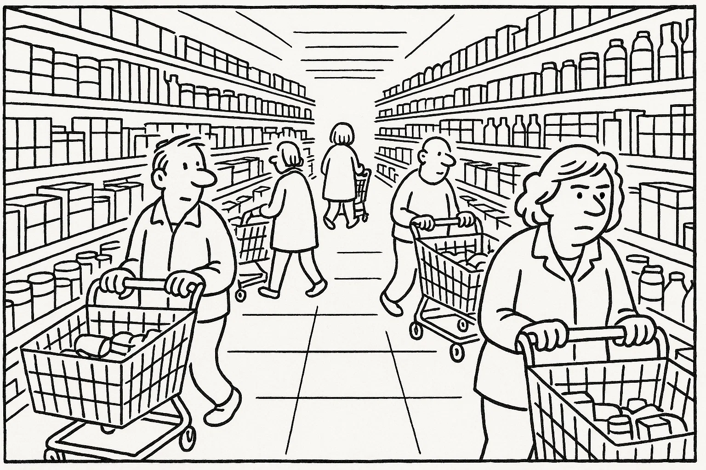
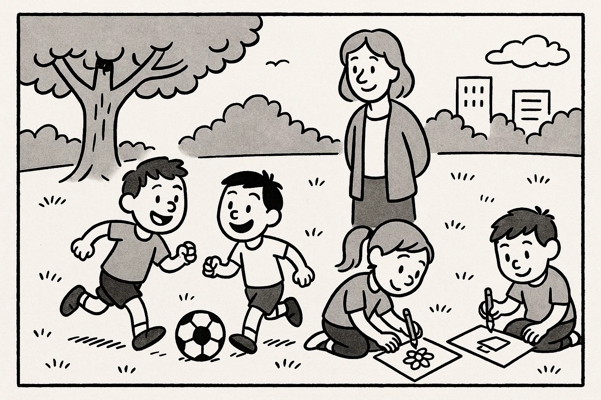

# Prøve i Dansk 2 _Practice Test 5_

  

## Outline

- Læseforståelse (90 minutter)
  - Delprøve 1
  - Delprøve 2
- Skriftlig fremstilling (90 minutter)
- Mundtlig kommunikation (20 minutter)

  Help Den Frie Prøvebank

_This practice test was generated by Den Frie Prøvebank and is unofficial. Den Frie Prøvebank's ability to validate how well its tests match the official tests, in terms of content and structure, is limited. Users should seek guidance from official teaching institutions as to the structure and content of the exams in question._

## Læseforståelse

### Delprøve 1 (30 minutter)

**Ingen hjælpemidler tilladt**

#### Opgave 1

Nedenfor finder du fire opslagstekster (A–D) fra brochurer, pjecer og hjemmesider. Læs dem alle grundigt. Der er seks spørgsmål til teksterne.

**Tekst A: Det nye idrætscenter – et aktivt samlingspunkt**  

Idrætscentret “EnergiHuset” åbnede i 2003 og har siden udviklet sig til et populært mødested for alle, der vil dyrke motion eller mødes socialt. I den nyrenoverede bygning finder du en stor sportshal, to fitnessrum, en svømmehal og en sauna. Svømmehallen er åben fra kl. 6.00 til 20.00 alle hverdage, mens hallen lukker kl. 22.00. I weekenden er der familie­svømning fra kl. 9.00–15.00.  

Centret tilbyder holdtræning som badminton, zumba, holdspinning og børnerytmik. Udenfor er der en løbebane og et udendørs fitnessområde, der kan benyttes gratis. Et årskort koster 1.200 kr., mens månedskort kan købes for 150 kr. Pensionister og studerende får rabat, og børn under 14 år har gratis adgang i følge med en voksen. Idrætscentret drives i samarbejde med frivillige, som står for caféen og hjælper ved arrangementer. Har du forslag til nye aktiviteter, kan du henvende dig til centerlederen eller skrive via hjemmesiden.  

**Tekst B: Åben læringscafé – øv dansk i hyggelige rammer**  

“Det åbne laboratorium” i lokalbibliotekets mødelokale giver voksne udlændinge mulighed for at øve dansk i et afslappet miljø. Frivillige med dansk som modersmål leder samtalerne om hverdag, arbejde, kultur og aktuelle emner. Gruppen mødes hver onsdag og fredag kl. 16.30–18.30, og der kræves ingen tilmelding. Du dukker bare op, og der er kaffe, te og småkager.  

Deltagerne bliver inddelt i små grupper, så alle kommer til orde. Du kan medbringe aviser, fotos eller emner, du gerne vil diskutere. Det er gratis at deltage, og børn er velkomne, men der er ingen børnepasning. Målet er at skabe et trygt og hyggeligt sted, hvor man kan forbedre sproget og lære nye mennesker at kende. Har du spørgsmål eller ønsker at melde dig som frivillig, kan du kontakte bibliotekaren på telefon eller via hjemmesiden.  

**Tekst C: Grøn transport i hverdagen – gør din rejse bæredygtig**  

På kommunens klimahjemmeside findes en guide med ideer til at reducere transportens klimaaftryk. Guiden anbefaler, at man cykler eller går kortere ture i stedet for at tage bilen. Hvis man bor længere væk, kan man kombinere cykel og bus eller tog. Kommunen tilbyder gratis cykelservice på torvet den første lørdag i måneden og rabat på månedskort til busserne.  

Et andet fokus er samkørsel: Ved at dele bilen med naboer eller kolleger kan man spare brændstof og mindske trafik. Der er også information om elbiler, ladestationer og tilskud til dem, der ønsker at skifte fra benzin til el. Endelig opfordres der til at planlægge indkøb og ærinder, så man undgår unødige ture. På hjemmesiden finder du beregningsværktøjer, der viser, hvor meget CO₂ du kan spare ved små ændringer i hverdagen.  

**Tekst D: Mentorprogrammet “Unge på vej” – giv din tid videre**  

Kommunens mentorprogram “Unge på vej” matcher unge mellem 13 og 18 år, som mangler støtte, med voksne frivillige. Som mentor mødes du med en ung en gang om ugen i cirka to timer for at snakke om skole, fritid og fremtid. Målet er at skabe trygge relationer, give støtte til lektier og inspirere til uddannelse eller job.  

Alle mentorer deltager i et introduktionskursus, hvor de lærer om unge menneskers trivsel og kommunikation. Man forpligter sig i mindst et år og skal fremvise børneattest. Udgifter til fælles aktiviteter som cafébesøg eller biograf dækkes af programmet. Tilmelding sker via kommunens frivilligportal, og du kan også få rådgivning ved at møde op på frivilligcenterets åbningstider mandag kl. 15.00–17.00.

##### Spørgsmål til teksterne

1. Hvor meget koster et årskort til idrætscentret “EnergiHuset”?  

2. Hvornår kan man komme til familie­svømning i svømmehallen?  

3. Hvilke dage mødes deltagerne i læringscaféen “Det åbne laboratorium”?  

4. Nævn ét råd om bæredygtig transport fra kommunens guide.  

5. Hvor ofte skal en mentor mødes med den unge i mentorprogrammet “Unge på vej”?  

6. Hvad kræves der, før man kan blive godkendt som mentor?  

#### Opgave 2

Nedenfor finder du ni korte tekster (A–I), fx annoncer og opslag. De enkelte tekster identificeres ved et bogstav. Der er syv sætninger (1–7), som skal matches med teksterne. Sæt kun ét bogstav ved hver sætning.

**A.** *Fodboldtræner søges* – Vores lokale U10‑hold mangler en frivillig træner. Træning foregår tirsdag og torsdag kl. 17.00–18.30. Erfaring er en fordel, men ikke et krav. Ring til 41 25 78 63.  

**B.** *Sommerkoncert* – Gratis koncert fredag kl. 19.00 på torvet. Kom og hør lokale bands under åben himmel. Medbring tæppe og picnickurv. Alle er velkomne.  

**C.** *Nøgler fundet* – Et bundt nøgler med en blå nøglering er fundet ved busstoppestedet på Stationstorvet. Kan afhentes i servicecentret mellem kl. 9.00–15.00.  

**D.** *Loppemarked* – Reservér en stand til søndagens loppemarked i hallen. Pris: 50 kr. pr. stand. Tilmeld dig på www.markedet.dk eller ring 56 78 34 12.  

**E.** *Fællesspisning* – Kom til fællesspisning mandag kl. 18.00 i forsamlingshuset. Medbring en ret til buffeten; drikkevarer sælges. Arrangementet er gratis.  

**F.** *Vikar søges til butik* – Lille butik søger deltidsvikar ca. 20 timer om ugen, primært eftermiddag og weekend. Send ansøgning senest 10. oktober til butik@handel.dk.  

**G.** *Gratis cykelservice* – Kommunen tilbyder gratis eftersyn af cykler lørdag kl. 9.00–12.00 på torvet. Få tjekket bremser og lygter, mens du venter. Ingen tilmelding nødvendig.  

**H.** *Strikkeklub* – Kan du lide at strikke? Mød andre entusiaster den anden onsdag i hver måned kl. 19.00 i kulturhuset. Medbring eget garn og pinde. Gratis deltagelse.  

**I.** *Tandlægepraktik* – Moderne klinik søger tandlægeassistent på fuld tid. Erfaring foretrækkes. Send CV og ansøgning til klinik@smil.dk.

**Sætninger:**

_Sæt kun ét bogstav ved hver sætning._

1. Jeg er på udkig efter et deltidsjob i en butik med ansøgning inden 10. oktober. _________  
2. Mine nøgler blev fundet ved et busstoppested – hvem kontakter jeg? _________  
3. Jeg vil gerne høre gratis musik under åben himmel fredag. _________  
4. Jeg elsker håndarbejde og vil møde andre, der strikker. _________  
5. Jeg vil gerne vide, hvad det koster at leje en bod til loppemarkedet på søndag. _________  
6. Min cykel trænger til et eftersyn; hvor kan jeg få det gratis lørdag? _________  
7. Jeg vil være frivillig træner for et børnefodboldhold; hvornår træner de? _________  

### Delprøve 2 (60 minutter)

**Ingen hjælpemidler tilladt**

#### Opgave 3

Læs nedenstående fortælling. I teksten er der fjernet ni ord. Ordene findes i listen under teksten sammen med fem ekstra ord, der ikke passer.

**Tekst:**  
Ahmed flyttede til Danmark for to år siden. I starten var alt nyt, og han kendte ingen i byen. Han begyndte på en danskuddannelse og mødte andre **(1)** ______ udlændinge. Vejret virkede meget **(2)** ______ om vinteren, og han savnede solen fra sit hjemland. Han ringede ofte til sin familie for at **(3)** ______ med dem.  

Snart fandt han et frivilligt arbejde i **(4)** ______, hvor han hjalp børn med at spille fodbold. Der lærte han nye **(5)** ______ og forbedrede sin danske udtale. Hans **(6)** ______ for dansk mad voksede også, især efter at have smagt smørrebrød og kanelsnegle. Han udviklede en god **(7)** ______ til sin lærer, som motiverede ham til at fortsætte, selv når det var **(8)** ______. I dag føler han sig **(9)** ______ i lokalsamfundet og har lyst til at hjælpe andre nytilflyttede.

**Ord til brug (ni passer, fem er distraktorer):**

_Noter: Skriv det korrekte ord i hver blank. Ét ord må kun bruges én gang._

  <ul class="column">
    <li>nytilflyttede</li>
    <li>kolde</li>
    <li>ringe</li>
    <li>sportsklubben</li>
    <li>venner</li>
    <li>relation</li>
    <li>aktiv</li>
  </ul>
  <ul class="column">
    <li>kammeratskab</li>
    <li>plan</li>
    <li>smag</li>
    <li>samfund</li>
    <li>svært</li>
    <li>træne</li>
    <li>værdier</li>
  </ul>

#### Opgave 4

Læs teksten nedenfor. Den består af seks afsnit. I hvert afsnit er der fjernet én sætning. Efter teksten finder du otte sætninger (A–H), hvoraf seks passer i hullerne. To sætninger er distraktorer.

**Tekst:**  

**Afsnit 1**  

Jesper havde altid elsket at bage. Som barn stod han ved siden af sin bedstemor i køkkenet og duftede til kagerne. Som voksen arbejdede han som mekaniker, men drømmen om eget bageri blev stærkere hvert år. **(1)** ______  

**Afsnit 2**  

Han fandt en lille butik på en stille gade og gik i gang med at renovere den. I begyndelsen måtte han stå op før solen for at ælte dej og bage brød. **(2)** ______  

**Afsnit 3**  

Efterhånden som rygtet spredte sig, kom der flere kunder, og Jesper begyndte at udvide sortimentet med kager og croissanter. **(3)** ______ Hans mor hjalp ham ofte i weekenderne, og venner kiggede forbi med gode idéer.  

**Afsnit 4**  

Jesper deltog på lokale markeder og tilbød brød lavet med økologiske råvarer. Hans rugbrød blev kåret til byens bedste. **(4)** ______  

**Afsnit 5**  

Efter nogle år overvejede han at åbne endnu en butik i nabobyen. Han vidste dog, at en større forretning ville kræve mere personale og mindre tid i bageriet. **(5)** ______  

**Afsnit 6**  

Når Jesper nu ser tilbage, føler han sig stolt over at have forfulgt sin passion. Han har også begyndt at arrangere bagekurser for børn og voksne i weekenden. **(6)** ______ Han håber at inspirere andre til at følge deres drømme.

**Sætninger (A–H):**

_Skriv bogstavet for den rigtige sætning ved hver 1 – 6. To sætninger skal ikke bruges._

<ul class="multiple-choice-answers">
  <li>Han sparede op og tog et kursus i iværksætteri.</li>
  <li>Det var hårdt arbejde, men snart begyndte folk at tale om hans gode boller.</li>
  <li>Til sidst ansatte han sin første lærling til at hjælpe med de mange ordrer.</li>
  <li>Han samarbejdede med lokale landmænd for at få frisk mel og økologisk smør.</li>
  <li>Han tøvede, fordi han ikke ville miste den nære kontakt til kunderne.</li>
  <li>Han nød at undervise børn i at bage i sin fritid.</li>
  <li>I barndommen hjalp han sin bedstemor med at samle æg til kagerne.</li>
  <li>Han havde altid drømt om at rejse verden rundt.</li>
</ul>

#### Opgave 5

Du skal læse et interview med en person. Teksten består af otte afsnit (A–H). Der er fem spørgsmål til teksten. Sæt bogstavet for det afsnit, der indeholder svaret, ved hvert spørgsmål.

**Tekst:**  

**Afsnit A**  

Mikkel Jensen er 29 år og arbejder som paramediciner. Han bor i et rækkehus i forstaden sammen med sin kæreste og deres lille søn på tre.  

**Afsnit B**  

Efter gymnasiet begyndte Mikkel at læse til sygeplejerske. Han har altid ønsket at hjælpe andre, og under studiet fandt han ud af, at arbejdet i en ambulance tiltalte ham.  

**Afsnit C**  

I dag er han ansat ved den regionale ambulancetjeneste. Vagterne kan være lange og uforudsigelige, men han elsker adrenalinen og følelsen af at gøre en forskel i akutte situationer.  

**Afsnit D**  

For nylig har Mikkel taget efteruddannelse i psykisk førstehjælp. Han mener, det er vigtigt at kunne støtte pårørende og patienter også mentalt i pressede situationer.  

**Afsnit E**  

En af de største udfordringer i hans job er at håndtere de følelser, som følger med. “Nogle dage er meget tunge,” siger han. “Jeg løber en tur eller taler med mine kolleger for at bearbejde indtrykkene.”  

**Afsnit F**  

Når han ikke er på arbejde, nyder Mikkel at spille guitar, løbe i skoven og læse krimier. Han og familien tager også gerne på camping i weekenderne.  

**Afsnit G**  

Mikkel bruger også tid på at undervise unge i førstehjælp i det lokale ungdomshus. Han håber at inspirere flere til at lære livreddende teknikker.  

**Afsnit H**  

På længere sigt drømmer Mikkel om at starte et program, der rekrutterer flere paramedicinere, og måske at rejse et år med sin familie for at opleve verden.

##### Spørgsmål

1. I hvilket afsnit beskrives Mikkels familieliv?  

2. Hvorfor valgte Mikkel at arbejde som paramediciner?  

3. Hvad er en af de største udfordringer i Mikkels arbejde?  

4. Hvad laver Mikkel i sin fritid?  

5. Hvad drømmer Mikkel om at gøre i fremtiden?  

## Skriftlig fremstilling (90 minutter – alle ordbøger tilladt)

### Delprøve 1 – vælg enten 1A eller 1B

**1A.** Du pendler hver dag med bussen til arbejde. De seneste måneder er busserne ofte forsinkede eller kommer slet ikke, især om morgenen. Du ønsker at klage til transportselskabet og foreslå en løsning. Skriv en halvformel henvendelse på ca. 150–200 ord, hvor du:

- beskriver problemet med bussernes forsinkelser og tidspunktet på dagen  
- fortæller, hvordan det påvirker dig og andre passagerer  
- nævner, at du har forsøgt at tale med chaufføren uden resultat  
- foreslår, hvad transportselskabet kan gøre for at løse problemet  

**1B.** Din nabo har åbnet en lille genbrugsbutik med tøj og møbler og beder dig om at skrive et opslag til deres hjemmeside, der skal tiltrække nye kunder. Skriv en halvformel tekst på ca. 150–200 ord, hvor du:

- beskriver butikkens beliggenhed og indretning  
- fortæller om udvalget af varer og særlige tilbud  
- fremhæver atmosfæren og serviceniveauet  
- opfordrer folk til at komme forbi og dele opslaget  

### Delprøve 2

Du har netop afsluttet et madlavningskursus. Din underviser sender dig en e‑mail, hvor hun beder dig om at skrive et kort brev til en kommende kursist, som overvejer at starte på kurset. Skriv en uformel e‑mail på mindst 100 ord, hvor du:

- hilser pænt og præsenterer dig selv  
- fortæller kort om, hvordan kurset var opbygget  
- beskriver, hvad du lærte, og hvordan du brugte det i hverdagen  
- giver din mening om underviseren og gruppedynamikken  
- opmuntrer kursisten til at tilmelde sig og tilbyder at besvare spørgsmål  

_Brug disse sider til at skrive din skriftlige opgave._

## Mundtlig kommunikation (20 minutter for to prøvedeltagere)

### Delprøve 1 (ca. 10 minutter i alt)

Hver prøvedeltager forbereder og holder en præsentation på ca. 1½ minut om et selvvalgt emne fra sin hverdag, fx arbejde, fritidsinteresser, familie, bolig eller en tradition. Efter præsentationen interviewer eksaminator prøvedeltageren i ca. 3½ minut med spørgsmål, der uddyber emnet.  

**Fokus:** Evne til at fortælle sammenhængende om personligt erfarede forhold og at forstå og besvare spørgsmål fra eksaminator.

### Delprøve 2 (ca. 10 minutter i alt)

Der er tre emner (A, B og C) om konkrete hverdagsforhold. Til hvert emne hører to billeder (Billede 1 og Billede 2), som illustrerer en situation. Prøvedeltagerne vælger ét emne. Først interviewer eksaminator hver prøvedeltager enkeltvis om det valgte billede. Derefter følger en samtale mellem de to prøvedeltagere, hvor de taler sammen på baggrund af en case, som eksaminator præsenterer. Eksaminator fungerer som mediator og sørger for, at begge prøvedeltagere kommer til orde.

**Emner og billeder:**

- **Emne A: Arbejdsliv og hjemmearbejde**  

Mange virksomheder overvejer at lade medarbejderne arbejde hjemme flere dage om ugen. Diskutér fordele og ulemper for produktivitet, arbejdsmiljø og socialt samvær, og kom med forslag til, hvordan man kan sikre god trivsel og samarbejde, når nogle arbejder hjemme, og andre møder fysisk.  

- **Emne B: Lokale markeder og fødevarekvalitet**  

Kommunen overvejer at bygge et stort supermarked uden for byen, hvilket kan påvirke de eksisterende torvedage og gårdbutikker. Diskutér fordele og ulemper for forbrugere, lokale producenter og miljøet, og kom med idéer til, hvordan man kan støtte både lokale markeder og tilgængelighed til dagligvarer.  

- **Emne C: Skærmtid for børn**  

Efter skoletid tilbringer mange børn tid foran skærme. Kommunen ønsker at begrænse skærmtiden i SFO'er og klubber og i stedet fremme fysisk aktivitet og kreative projekter. Diskutér fordele og ulemper ved digital underholdning versus udendørs lege, og kom med forslag til, hvordan man kan finde en balance mellem skærm og leg.  

---

_This practice test was generated by Den Frie Prøvebank and is unofficial. Den Frie Prøvebank's ability to validate how well its tests match the official tests, in terms of content and structure, is limited. Users should seek guidance from official teaching institutions as to the structure and content of the exams in question._
