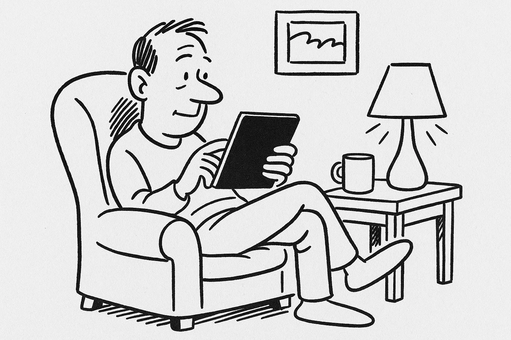
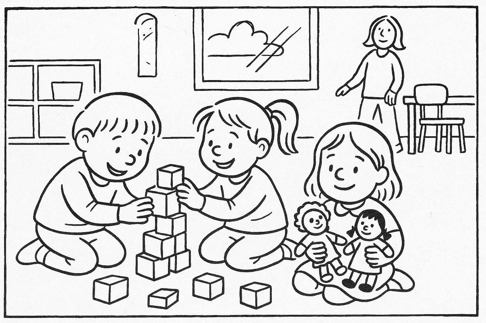
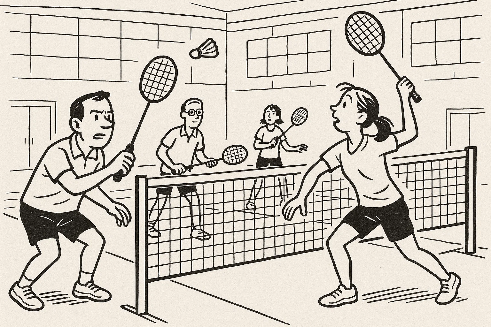

# Prøve i Dansk 2 _Practice Test 6_

  

## Outline

- Læseforståelse (90 minutter)
  - Delprøve 1
  - Delprøve 2
- Skriftlig fremstilling (90 minutter)
- Mundtlig kommunikation (20 minutter)

  Help Den Frie Prøvebank

_Denne øveprøve er udarbejdet af Den Frie Prøvebank og er uofficiel. Den Frie Prøvebank har begrænset mulighed for at validere, hvor godt prøven matcher de officielle prøver med hensyn til indhold og struktur. Brugere bør søge vejledning hos officielle uddannelsesinstitutioner om eksamensform og -indhold._

## Læseforståelse

### Delprøve 1 (30 minutter)

**Ingen hjælpemidler tilladt**

#### Opgave 1

Nedenfor finder du fire opslagstekster (A–D) fra brochurer, pjecer og hjemmesider. I alt er der omkring 2.000 ord. Læs dem alle grundigt. Der er seks spørgsmål til teksterne.

**Tekst A: Din kommunes kultur- og fritidscenter “Liv & Bevægelse” – et sted for alle**  

I hjertet af byen ligger kultur- og fritidscenteret “Liv & Bevægelse”, som siden åbningen i 2005 har været samlingssted for borgere i alle aldre. Huset er blevet udvidet flere gange og rummer i dag et moderne fitnesscenter med nye maskiner, et svømmebassin, sauna, en lys café samt flere sale til forskellige aktiviteter. I stueetagen finder du et åbent træningsområde og en 25‑meters pool, hvor der tilbydes svømmeundervisning for børn og aquafitness for voksne. På første sal er der sale til yoga, dans, badminton og bordtennis, samt et legeområde til de mindste, hvor børnene kan tegne, læse eller bygge med klodser, mens forældrene træner.  

Centret tilbyder et bredt program af kurser og hold: crossfit om morgenen, pilates i frokostpausen, zumba efter arbejde, seniormotion om formiddagen og familieaktiviteter i weekenden. Alle hold ledes af uddannede instruktører, og der er plads til både begyndere og øvede. Hvis du vil træne på egen hånd, kan du bruge det veludstyrede fitnessrum med løbebånd, vægte og spinningcykler.  

Kultur‑ og fritidscenteret er åbent fra kl. 7.00–22.00 mandag til torsdag, fredag til kl. 20.00, lørdag til kl. 18.00 og søndag til kl. 16.00. På helligdage er der lukket. Medlemskab koster 600 kr. for et halvt år og giver ubegrænset adgang til alle faciliteter og hold. Dagsbillet koster 60 kr. Rabatter gives til studerende og pensionister, der betaler halv pris, mens børn under 12 år har gratis adgang i følge med en voksen. Medlemskortet fungerer også som nøgle til garderober og skabe.  

“Liv & Bevægelse” drives af kommunen i samarbejde med en frivillig forening. Ønsker du at støtte centret, kan du melde dig som frivillig og hjælpe til ved arrangementer, receptionen eller børneområdet. Centret er handicapvenligt med elevator til alle etager og omklædningsrum med hæve‑sænkebænke. Har du forslag til nye hold eller vil du bidrage som frivillig, kan du besøge kontoret på 1. sal eller skrive til info@livebevaegelse.dk.

**Tekst B: Sprog‑ og kulturcaféen “Dansk Sammen”**  

Vil du øve dansk i uformelle rammer og samtidig lære nye mennesker at kende? Sprog‑ og kulturcaféen “Dansk Sammen” er et gratis tilbud til voksne udlændinge og danskere, der ønsker at mødes og samtale. Caféen ligger på 2. sal i byens hovedbibliotek og har åbent hver onsdag kl. 18.00–20.00 og lørdag kl. 10.00–12.00. Her mødes deltagere i små grupper på 4‑6 personer, hvor frivillige samtaleværter styrer en snak om hverdagsliv, arbejde, kultur, mad, nyheder og alt andet, der interesserer jer.  

Der er ingen tilmelding; du dukker bare op, og der serveres kaffe, te og småkager. Man behøver ikke forberede sig, men er velkommen til at medbringe aviser, billeder, opskrifter, musik eller andre ting, der kan starte en samtale. Har du børn med, findes der et legehjørne med bøger og legetøj, men der tilbydes ikke decideret pasning. Formålet er at skabe et trygt og hyggeligt rum, hvor du kan øve sproget, udvide dit netværk og lære om det danske samfund.  

Frivillige værter kommer til caféen fordi de brænder for sprog og kultur. Hvis du vil være frivillig, skal du deltage i et introduktionsmøde og forpligte dig til at møde én gang om ugen. Du kan kontakte bibliotekaren på telefon 70 20 30 40 eller via hjemmesiden www.dansksammen.dk for mere information.

**Tekst C: Din guide til affaldssortering og genbrug – gør en forskel i hverdagen**  

På kommunens hjemmeside findes en udførlig guide til affaldssortering og genbrug. Guiden forklarer, at korrekt sortering kan reducere mængden af restaffald med op til 50 %. Når du sorterer dit affald, er det vigtigt at skille plastik, metal, glas, papir, pap, madaffald, farligt affald og restaffald. Plastemballage og metaldåser skal tømmes og skylles, før de lægges i hver sin beholder. Glas og flasker afleveres i glascontaineren, mens papir og pap skal foldes eller rives i mindre stykker for at spare plads. Bioaffald som frugt‑ og grøntsagsrester lægges i den grønne spand, og haveaffald kan afleveres på genbrugspladsen. Batterier, elpærer, maling og kemikalier er farligt affald og må ikke komme i husholdningsaffaldet; de skal afleveres på genbrugsstationen eller i de røde bokse ved supermarkeder.  

Ud over at sortere affald opfordrer guiden til at reducere forbruget. Tænk over dine indkøb, vælg produkter med mindre emballage, og medbring genanvendelige poser og flasker. Overvej at reparere eller genbruge ting, før du smider dem ud. Kommunen tilbyder “Byttemarked” en gang om måneden, hvor du kan aflevere brugte ting og finde noget nyt gratis. Du kan også låne værktøj i “Tingbiblioteket” og dele haveredskaber med dine naboer.  

Har du spørgsmål om affaldssortering eller brug for en ekstra beholder, kan du kontakte kommunens miljøafdeling på telefon 80 12 34 56. Du kan også downloade appen “Mit Affald”, der minder dig om tømmedage og giver adgang til sorteringsregler. Guiden slutter med kontaktinformationer og link til kort over nærmeste genbrugsstationer.

**Tekst D: Frivilligcenteret “Hjælpende Hænder” – gør en forskel i dit lokalområde**  

“Hjælpende Hænder” er kommunens frivilligcenter, der matcher borgere med projekter, hvor der er brug for en ekstra hånd. På platformen kan du vælge imellem mange forskellige aktiviteter: besøgsven for ældre i plejeboliger, lektiehjælper for skolebørn, læsehjælper på biblioteket, træner for et ungdomsfodboldhold, naturplejer i grønne områder eller hjælper i en genbrugsbutik. Frivilligt arbejde giver mulighed for at møde andre mennesker, udvikle nye kompetencer og styrke dit netværk.  

Du bestemmer selv, hvor meget tid du vil bruge. Mange engagerer sig omkring to timer om ugen, men alt fra en gang om måneden til flere gange om ugen er velkomment. Som frivillig får du gratis introduktion og kurser, og du er dækket af en frivilligforsikring. For at komme i gang skal du oprette en profil på hjemmesiden www.hjaelpendehaender.dk og vælge det projekt, der interesserer dig. En koordinator kontakter dig og arrangerer et introduktionsmøde, hvor du bliver klædt på til opgaven.  

Frivilligcenteret afholder også informationsaftener den første tirsdag i måneden kl. 17.00–19.00 på rådhuset, hvor du kan høre mere om mulighederne og møde andre frivillige. Har du spørgsmål, kan du kontakte frivilligcenteret på mail info@hjaelpendehaender.dk eller besøge kontoret i kulturhuset tirsdag og torsdag kl. 14.00–16.00.

##### Spørgsmål til teksterne

1. Hvilke åbningstider har “Liv & Bevægelse” om søndagen?  

2. Hvor meget koster et medlemskab i “Liv & Bevægelse” for et halvt år?  

3. Hvornår mødes sprog‑ og kulturcaféen “Dansk Sammen”?  

4. Nævn én ting, som deltagere kan medbringe til “Dansk Sammen” for at starte en samtale.  

5. Hvor mange procent kan du reducere dit restaffald med ved korrekt sortering, ifølge affaldsguiden?  

6. Hvor mange timer om ugen forventes man som minimum at bruge som frivillig via “Hjælpende Hænder”?  

#### Opgave 2

Nedenfor finder du ni korte tekster (A–I), fx annoncer og opslag, med en samlet længde på omkring 375 ord. De enkelte tekster identificeres ved et bogstav. Der er syv sætninger (1–7), som skal matches med teksterne. Sæt kun ét bogstav ved hver sætning.  

**A.** *Hund savnet* – En lille sort terrier forsvandt fra Sankt Hans gade i sidste uge. Den har rødt halsbånd og lyder navnet Buster. Hvis du har set den, kontakt da ejeren på 21 22 23 24.  

**B.** *Gratis foredrag* – Tirsdag kl. 19 afholder rådhuset et foredrag om lokalhistorie. Historikeren Anna Madsen fortæller om byens udvikling. Alle er velkomne, og tilmelding er ikke nødvendig.  

**C.** *Byfest i parken* – Lørdag kl. 10–18 inviteres alle til byfest med musik, madboder og aktiviteter for børn. Entréen er gratis, så tag et tæppe med og nyd dagen i solen.  

**D.** *Sygeplejerske søges* – Plejecentret i Helsingør søger en erfaren sygeplejerske til nattevagt. Stillingen er 28 timer om ugen. Ansøgning sendes senest 1. maj til plejecenter@helsingor.dk.  

**E.** *Nøgle fundet* – Et nøglebundt med tre nøgler og en blå nøglering er fundet foran supermarkedet. Henvend dig i kundeservice med beskrivelse og ID.  

**F.** *Vejarbejde* – Vejen mellem Hillerød og Allerød bliver asfalteret fra mandag. Strækningen er spærret kl. 22.00–06.00 de næste fem dage. Følg skiltningen til omkørsel.  

**G.** *Spisehus søger personale* – Hyggelig restaurant i Randers søger en smilende tjener. Arbejdstid cirka 20 timer om ugen, hovedsageligt aften og weekend. Erfaring er en fordel.  

**H.** *Musikundervisning* – Lær at spille guitar! Begynderhold starter 1. juni hver mandag kl. 18–19 på musikskolen. Du skal have egen guitar. Pris: 60 kr. pr. gang.  

**I.** *Løbeklub* – Har du lyst til at træne op til et 10‑kilometers løb? Meld dig ind i vores løbeklub. Vi mødes onsdag kl. 17 ved stadion. Gratis prøvetime. Alle er velkomne.

**Sætninger:**

_Sæt kun ét bogstav ved hver sætning._

1. Jeg ønsker et deltidsjob i restauration i Randers. _________  
2. Hvor lang tid varer vejarbejdet mellem Hillerød og Allerød, og hvornår er der spærret? _________  
3. Jeg har mistet mine nøgler foran supermarkedet. Hvem kan jeg kontakte? _________  
4. Jeg vil begynde til guitarundervisning og skal huske at medbringe noget. _________  
5. Jeg vil gerne til byfesten i weekenden. Skal jeg betale for at deltage? _________  
6. Jeg er uddannet sygeplejerske og leder efter et nattevagtsjob. _________  
7. Jeg vil gerne løbe sammen med andre og træne til et 10‑kilometers løb. _________  

### Delprøve 2 (60 minutter)

**Ingen hjælpemidler tilladt**

#### Opgave 3

Læs nedenstående fortælling. I teksten er der fjernet ni ord. Ordene findes i listen under teksten sammen med fem ekstra ord, der ikke passer.

**Tekst:**  
Min kollega Jonas flyttede til København sidste år. Da han kom, kendte han ingen og talte kun lidt dansk. Han tilmeldte sig hurtigt et *aftenhold*, hvor han mødte mange **(1)** ______ mennesker, der ligesom ham gerne ville lære sproget. I begyndelsen syntes han, at vejret var meget **(2)** ______, og han savnede sin familie. Han brugte derfor mange aftener på at **(3)** ______ med dem over video for at høre nyt hjemmefra.  

Efter et par måneder begyndte han at engagere sig i **(4)** ______. Han meldte sig ind i en sportsklub og blev frivillig i et suppekøkken. Hans **(5)** ______ for dansk kultur voksede, især efter at han havde lært at lave smørrebrød og brunsviger. På kurset fik han et varmt **(6)** ______ med sin lærer, som opmuntrede ham til at øve sig hver dag. Snart turde han tale med folk i supermarkedet og spørge om hjælp, når noget var **(7)** ______.  

I dag arbejder Jonas i en børnehave. Han elsker at **(8)** ______ af børnene, og han planlægger at tage en uddannelse inden for pædagogik. Han er stolt af at have skabt et stærkt **(9)** ______ i Danmark og føler sig nu hjemme her.

**Ord til brug (ni passer, fem er distraktorer):**

*Noter: Skriv det korrekte ord i hver blank. Ét ord må kun bruges én gang.*

  <ul class="column">
    <li>venlige</li>
    <li>koldt</li>
    <li>ringe</li>
    <li>lokalsamfundet</li>
    <li>forståelse</li>
    <li>venskab</li>
    <li>svært</li>
  </ul>
  <ul class="column">
    <li>tage sig</li>
    <li>netværk</li>
    <li>humor</li>
    <li>læse</li>
    <li>sygepleje</li>
    <li>motion</li>
    <li>kage</li>
  </ul>

#### Opgave 4

Læs teksten nedenfor. Den består af seks afsnit. I hvert afsnit er der fjernet én sætning. Efter teksten finder du otte sætninger (A–H), hvoraf seks passer i hullerne. To sætninger er distraktorer.

**Tekst:**  

**Afsnit 1**  

Morten har altid elsket at lave mad. Som barn læste han kogebøger og drømte om at blive kok. Da han fyldte 24, sagde han sit job som kontorassistent op for at følge sin passion. **(1)** ______  

**Afsnit 2**  

Han begyndte på en anerkendt kokkeskole i Aarhus. Dagene var lange, og han var ofte træt efter at have stået i køkkenet fra morgen til aften. Han skar sig i fingrene flere gange og lavede fejl, men han gav aldrig op. **(2)** ______  

**Afsnit 3**  

Efter uddannelsen fik Morten plads i et travlt restaurantkøkken i København. Her lærte han at arbejde hurtigt, koordinere med kollegerne og holde ro i stressede situationer. **(3)** ______ Han blev gode venner med de andre kokke og nød at eksperimentere i deres fritid.

**Afsnit 4**  

For at udvide sin horisont rejste Morten til Italien i tre måneder. Han arbejdede på en familierestaurant i Toscana, hvor han lærte at lave frisk pasta og risotto fra bunden. **(4)** ______ Han brugte weekenderne på at besøge små landsbyer og tale med lokale producenter.

**Afsnit 5**  

Tilbage i Danmark åbnede han en lille foodtruck, hvor han solgte italienske sandwiches med nordiske råvarer. Gæsterne satte pris på kombinationen af tradition og innovation. **(5)** ______ Morten sparer nu op til at åbne sin egen restaurant.

**Afsnit 6**  

Flere år senere gjorde han drømmen til virkelighed. Restauranten blev en succes, og han ser frem til fremtidige udfordringer. **(6)** ______ Han håber en dag at udgive sin egen kogebog og inspirere andre til at forfølge deres drømme.

**Sætninger (A–H):**

*Skriv bogstavet for den rigtige sætning ved hver 1 – 6. To sætninger skal ikke bruges.*

<ul class="multiple-choice-answers">
  <li>Som ung hjalp han sin bedstemor med at bage hver weekend.</li>
  <li>Han havde sparet op i flere år for at betale skoleafgiften.</li>
  <li>Lærerne var strenge, men han fik lov til at prøve mange teknikker.</li>
  <li>Tiden i køkkenet var hektisk, men han nød spændingen.</li>
  <li>Han blev betaget af de friske råvarer på de lokale markeder.</li>
  <li>Kundernes ros gav ham selvtillid til at fortsætte.</li>
  <li>Hans venner ville hellere spise ude end at støtte hans madlavning.</li>
  <li>Erfaringen fra udlandet hjalp ham med at forme sin egen menu.</li>
</ul>

#### Opgave 5

Du skal læse et interview med en person. Teksten består af otte afsnit (A–H). Der er fem spørgsmål til teksten. Sæt bogstavet for det afsnit, der indeholder svaret, ved hvert spørgsmål.

**Tekst:**  

**Afsnit A**  

Sanne Pedersen er 29 år og står bag firmaet “Digitale Hjælpere”, der hjælper ældre borgere med at bruge smartphones, tablets og computere. Hun bor i en lejlighed i Aalborg med sin kæreste og deres lille datter, og hun elsker at gå ture langs fjorden.

**Afsnit B**  

Efter gymnasiet uddannede Sanne sig til it‑supporter. Hun opdagede, hvor svært det var for hendes egne bedsteforældre at bestille tid hos lægen eller bruge netbank. Hun læste artikler om digital inklusion og besluttede at gøre noget for at hjælpe.

**Afsnit C**  

I 2020 startede hun virksomheden “Digitale Hjælpere”. I starten arbejdede hun alene og cyklede ud til kunderne med sin laptop i en rygsæk. Hun underviste ældre i at sende e‑mails, bruge MitID og downloade apps, og hun oplevede, at mange var lettede over, at nogen havde tålmodighed til at forklare.

**Afsnit D**  

Virksomheden har nu seks ansatte, heraf to studerende. Sanne prioriterer at give unge en mulighed for at få erfaring, og hun samarbejder med jobcentre om at ansætte ledige. Hver uge holder hun workshops på biblioteker, hvor alle kan komme og stille spørgsmål.

**Afsnit E**  

Sanne fortæller, at en af de største udfordringer er at overvinde den frygt, mange ældre har for at trykke på det forkerte. “De er bange for at gøre noget galt, så vi arbejder meget med tryghed og gentager tingene langsomt,” siger hun. Hun forsøger at skabe små succesoplevelser, som giver mod til at prøve mere.

**Afsnit F**  

Hun bruger også selv digitale løsninger i hverdagen: familien handler ind via en app og holder videomøder med bedsteforældrene. Samtidig sætter de af til “skærmfri aftener”, hvor de læser bøger eller spiller brætspil. “Det handler om balance,” understreger hun.

**Afsnit G**  

Når Sanne ikke arbejder, dyrker hun yoga, løber langs havnen og læser krimier. Hun synger i et kor og laver ofte mad fra forskellige kulturer. Hun hører også podcasts om iværksætteri og lytter til lydbøger på cykelturene til kunderne.

**Afsnit H**  

Sanne drømmer om at udvide sin virksomhed til mindre landsbyer, hvor der ikke er så mange digitale tilbud. Hun samarbejder allerede med biblioteker i Nordjylland og håber at kunne udvikle mobile kurser, der kan komme ud til ældre, som bor langt fra byerne.

##### Spørgsmål

1. I hvilket afsnit beskrives Sannes familieliv?  

2. Hvorfor begyndte Sanne at interessere sig for at hjælpe ældre med digitale løsninger?  

3. Hvor mange ansatte har “Digitale Hjælpere” nu?  

4. Hvad er en af de største udfordringer i Sannes arbejde?  

5. Hvad laver Sanne i sin fritid?  

## Skriftlig fremstilling (90 minutter – alle ordbøger tilladt)

### Delprøve 1 – vælg enten 1A eller 1B

**1A.** Du bruger dagligt den lokale bus til arbejde. De seneste måneder har busserne ofte været forsinkede eller helt aflyst, især om morgenen og om eftermiddagen. Du ønsker at klage til transportselskabet og foreslå en løsning. Skriv en halvformel henvendelse på ca. 150–200 ord, hvor du:

- beskriver problemet med de gentagne forsinkelser og aflysninger og nævner tidspunktet på dagen  
- fortæller, hvordan det påvirker dig og eventuelt din familie eller dit arbejde  
- nævner, at du har forsøgt at kontakte chaufføren eller kundeservice uden resultat  
- foreslår, hvad transportselskabet kan gøre for at forbedre situationen (fx bedre information, justering af køreplan eller kompensation)  

**1B.** Din forening arrangerer et velgørenhedsløb for at samle penge ind til børn og unge i kommunen. Du har lovet at skrive et opslag til foreningens hjemmeside, der skal tiltrække deltagere. Skriv en halvformel tekst på ca. 150–200 ord, hvor du:

- beskriver løbets dato, rute og startsted  
- forklarer formålet med arrangementet og hvad pengene går til  
- fortæller om deltagergebyret og hvad man får for pengene (fx T‑shirt, forfriskninger)  
- opfordrer folk til at tilmelde sig, dele opslaget og invitere venner og familie  

### Delprøve 2

Du har netop afsluttet et frivilligt arbejde på et plejecenter. Koordinatoren beder dig om at skrive en kort e‑mail til en person, der overvejer at blive frivillig. Skriv en uformel e‑mail på mindst 100 ord, hvor du:

- hilser pænt og præsenterer dig selv  
- fortæller kort om, hvilke opgaver du havde som frivillig (fx samtaler, servering af kaffe, læsning)  
- beskriver, hvad du lærte, og hvordan det påvirkede dig personligt  
- giver din mening om medarbejderne og atmosfæren på plejecentret  
- opmuntrer den nye frivillige til at tilmelde sig og tilbyder at besvare spørgsmål  

_Brug disse sider til at skrive din skriftlige opgave._

## Mundtlig kommunikation (20 minutter for to prøvedeltagere)

### Delprøve 1 (ca. 10 minutter i alt)

Hver prøvedeltager forbereder og holder en præsentation på ca. 1½ minut om et selvvalgt emne fra sin hverdag, fx arbejde, fritidsinteresser, familie, bolig eller en tradition. Efter præsentationen interviewer eksaminator prøvedeltageren i ca. 3½ minut med spørgsmål, der uddyber emnet.  

**Fokus:** Evne til at fortælle sammenhængende om personligt erfarede forhold og at forstå og besvare spørgsmål fra eksaminator.  

### Delprøve 2 (ca. 10 minutter i alt)

Der er tre emner (A, B og C) om konkrete hverdagsforhold. Til hvert emne hører to billeder (Billede 1 og Billede 2), som illustrerer en situation. Prøvedeltagerne vælger ét emne. Først interviewer eksaminator hver prøvedeltager enkeltvis om det valgte billede. Derefter følger en samtale mellem de to prøvedeltagere, hvor de taler sammen på baggrund af en case, som eksaminator præsenterer. Eksaminator fungerer som mediator og sørger for, at begge prøvedeltagere kommer til orde.

**Emner og billeder:**

- **Emne A: Biblioteker og digitalisering**  

Byrådet overvejer at reducere åbningstiderne i de fysiske biblioteker for at investere mere i digitale tilbud. Diskutér fordele og ulemper for borgerne, og kom med forslag til, hvordan man kan sikre adgang til bøger og viden for alle, også dem der ikke er fortrolige med teknologi.

- **Emne B: Børnepasning og arbejdsliv**  

Kommunen overvejer at forkorte åbningstiderne i daginstitutionerne for at spare penge. Diskutér konsekvenserne for børnefamilier og arbejdsgivere, og foreslå løsninger, der balancerer budget og behov, fx fleksible arbejdstider eller alternative pasningsmuligheder.

- **Emne C: Motion og byrum**  

Kommunen vil lukke en sportshal for at bygge butikker og parkeringspladser. Diskutér, hvad det betyder for sundhed og fællesskab, og foreslå alternative løsninger, der giver plads til både handel og motion.

---

_Denne øveprøve er udarbejdet af Den Frie Prøvebank og er uofficiel. Den Frie Prøvebank har begrænset mulighed for at validere, hvor godt prøven matcher de officielle prøver med hensyn til indhold og struktur. Brugere bør søge vejledning hos officielle uddannelsesinstitutioner om eksamensform og -indhold._
