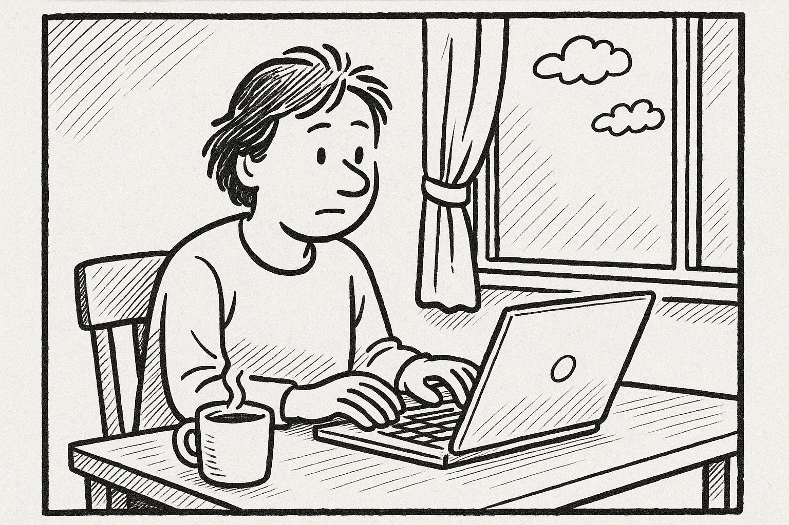
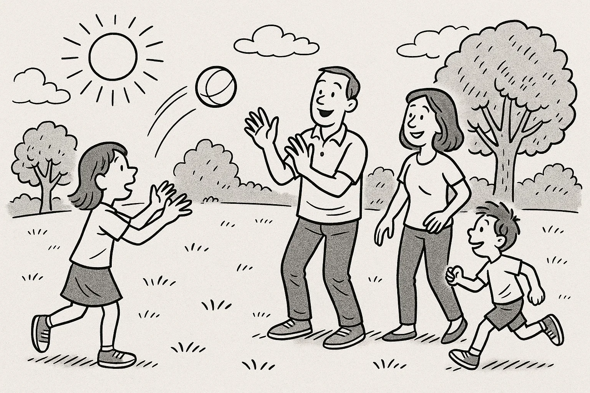
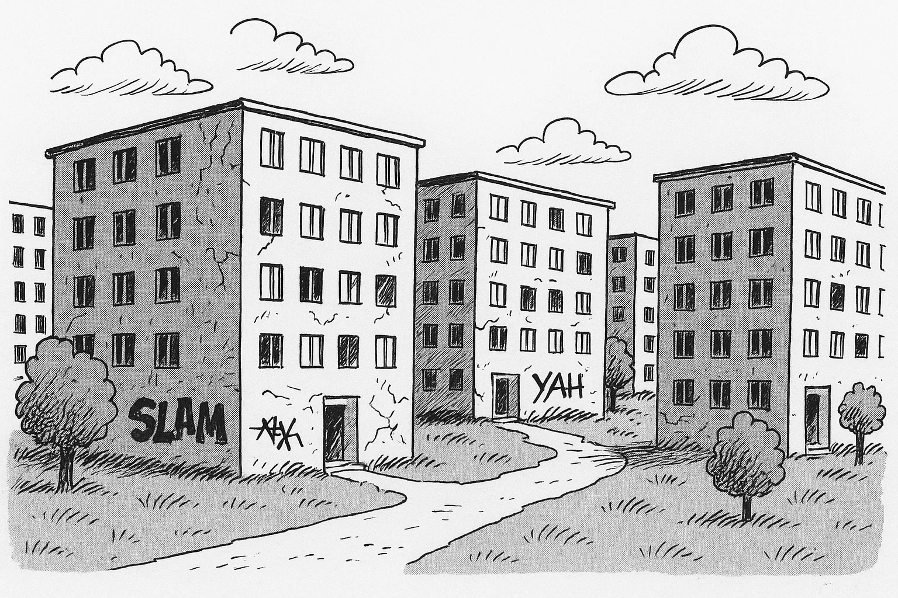
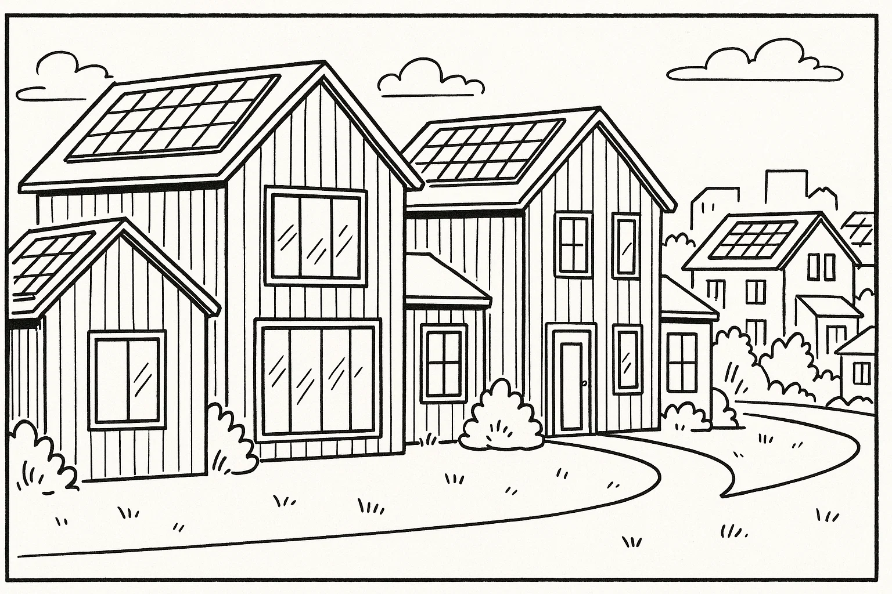
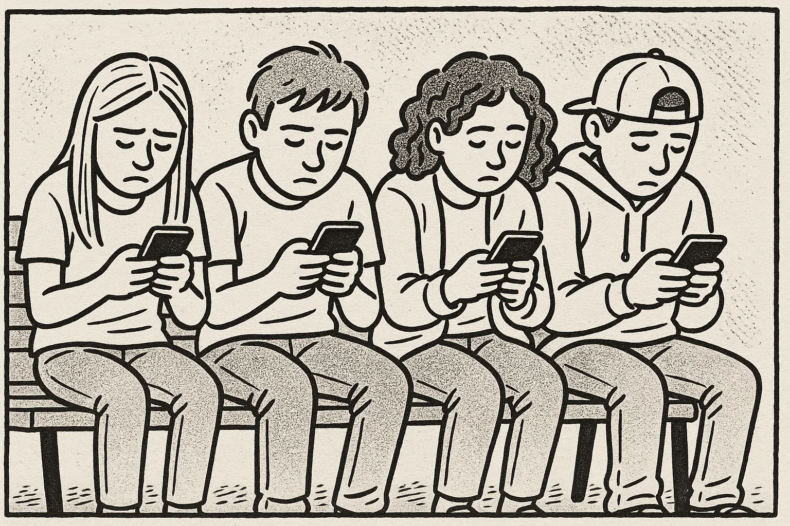
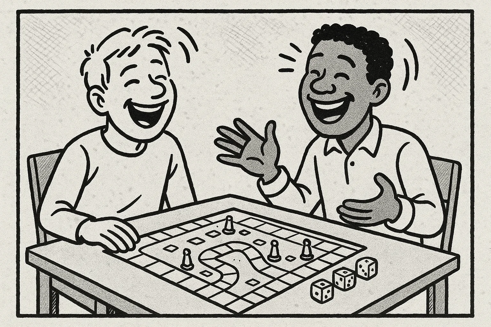

# Prøve i Dansk 2 _Practice Test 7_

  

## Outline

- Læseforståelse (90 minutter)
  - Delprøve 1
  - Delprøve 2
- Skriftlig fremstilling (90 minutter)
- Mundtlig kommunikation (20 minutter)

  Help Den Frie Prøvebank

_Denne øveprøve er udarbejdet af Den Frie Prøvebank og er uofficiel. Den Frie Prøvebank har begrænsede muligheder for at vurdere, hvor godt dens prøver matcher de officielle prøver med hensyn til indhold og struktur. Brugere bør søge vejledning hos officielle undervisningsinstitutioner om prøvernes opbygning og indhold._

## Læseforståelse

### Delprøve 1 (30 minutter)

**Ingen hjælpemidler tilladt**

#### Opgave 1

Nedenfor finder du fire opslagstekster (A–D) fra brochurer, pjecer og hjemmesider. I alt er der ca. 2000 ord. Læs dem alle grundigt. Der er seks spørgsmål til teksterne.

**Tekst A: Dit lokale bibliotek – mere end bøger**

Biblioteket i bymidten har i mange år været et samlingssted for borgerne. Det gamle murstenshus fra 1930'erne blev renoveret i 2010 og huser nu både et traditionelt bibliotek og et aktivt medborgerhus. I stueetagen finder du den store bogsamling med tusindvis af titler inden for skønlitteratur, fagbøger og børnebøger. Bibliotekarerne hjælper gerne med at finde præcis det, du leder efter, og der er computerhjørner med fri internetadgang. I hjørnerne står bløde lænestole, hvor man kan fordybe sig med en avis eller en god roman, mens børnene kan bygge med klodser i “Børnehulen”.

På første sal ligger et kreativt værksted, hvor du kan lære at sy, strikke eller arbejde med 3D‑printere. Hver måned arrangeres der læsekredse, filmklub og foredrag om aktuelle emner. En gang om ugen holder en lokal historiker et oplæg om byens fortid, og flere foreninger bruger salen til møder. Biblioteket har også et digitalt univers, hvor du kan downloade e‑bøger, lydbøger og magasiner. Alt dette er gratis, hvis du er registreret låner.

Åbningstiderne er mandag til torsdag kl. 10.00–19.00, fredag kl. 10.00–17.00 og lørdag kl. 10.00–14.00. Søndag er der lukket. Har du brug for hjælp til at søge på nettet eller bruge din smartphone, kan du bestille tid hos it‑caféens frivillige, som står klar tirsdag og torsdag formiddag. Hvis du gerne vil engagere dig, kan du melde dig ind i bibliotekets venneforening; kontingentet er 200 kr. om året og støtter nye aktiviteter.

**Tekst B: Ud i naturen – foreningen “Ud i det blå”**

Foreningen “Ud i det blå” blev grundlagt af nogle naturinteresserede venner i 1995 og har siden vokset sig stor. Foreningen organiserer vandreture, kajakroning, fugleture og weekendture i hele landet. Om sommeren arrangeres der også overnatningsture i shelter med bålmad og historie­fortælling. Formålet er at skabe fællesskab om oplevelser i det fri og give folk viden om planter, dyr og bæredygtig færden i naturen.

Medlemskab koster 350 kr. om året for voksne og 150 kr. for børn under 18. Familier kan købe et samlet medlemskab for 700 kr. Der er mulighed for at låne udstyr som telt, sovepose og kajak gratis, hvis du melder dig i god tid. De fleste aktiviteter annonceres i foreningens nyhedsbrev, som udsendes hver måned. Tilmelding foregår via hjemmesiden, hvor du også kan se sværhedsgrad og forventet tidsforbrug for hver tur.

Foreningen drives af frivillige, men hyrer af og til guider til særlige ture, fx en svampetur med en biolog eller en stjernekiggeraften med en astronom. Har du selv lyst til at stå for en tur, hjælper bestyrelsen dig gerne med planlægningen. Som noget nyt tilbyder “Ud i det blå” også et naturforløb for nytilkomne danskere, hvor man kombinerer friluftsliv med sprogtræning.

**Tekst C: Sund mad på budget – kursus i hverdagskøkkenet**

Kommunens sundhedscenter tilbyder et kursus i sund madlavning for familier og singler, som ønsker inspiration til billige og sunde retter. Kurset løber over fire aftener og finder sted i skolekøkkenet på den lokale folkeskole. Hver gang starter med teori om næringsstoffer, portionsstørrelser og energiforbrug. Derefter går deltagerne i små grupper i gang med at tilberede retter som grøntsagssuppe, fuldkornspizza, salater med bælgfrugter og sunde snacks. De får tips til at undgå madspild ved at planlægge ugens måltider, gemme rester og bruge sæsonens råvarer.

Underviseren er ernæringsassistent og deler opskrifter, der kan tilpasses smag og allergier. På kurset lærer man også, hvordan man kan spare strøm og vand i køkkenet: at bruge låg på gryden, fylde opvaskemaskinen helt og slukke for komfuret et par minutter før maden er færdig. Prisen er 500 kr. pr. deltager, inklusiv råvarer. For personer med lav indkomst er der mulighed for at få et tilskud. Tilmelding sker efter først‑til‑mølle-princippet, og der er højst 15 deltagere pr. hold.

Deltagerne får en kogebog med hjem efter endt forløb, og der oprettes en Facebook‑gruppe, hvor man kan dele opskrifter og erfaringer. Kurset henvender sig til alle, uanset om man er ny i køkkenet eller har mange års erfaring. Flere tidligere deltagere fortæller, at de efter kurset har ændret deres vaner og sparer penge på dagligvarebudgettet.

**Tekst D: Mentorprogram for unge flygtninge – gør en forskel**

Organisationen “Venlige Voksne” søger nye mentorer til deres mentorprogram for unge flygtninge mellem 15 og 25 år. Mange af de unge er kommet alene til Danmark og har brug for støtte til at finde sig til rette i skolen, fritiden og arbejdsmarkedet. Som mentor mødes du med en ung en gang om ugen eller hver anden uge i et halvt år. I mødes fx på biblioteket, går en tur, laver lektier sammen eller deltager i foreninger, alt efter hvad den unge har behov for og lyst til.

Før man bliver mentor, deltager man i et todages kursus, hvor man lærer om kulturmøder, traumer, grænser og pædagogiske redskaber. Kurset afholdes tre gange om året og er gratis. Programmet sørger for matches mellem mentorer og mentees ud fra interesser og sprog, så der er gode chancer for, at relationen bliver stærk. Mentorforløbet afsluttes med en fælles udflugt, hvor alle mentorer og unge mødes og fejrer deres oplevelser.

For at blive mentor skal man være over 25 år, have lyst til at engagere sig og kunne afsætte ca. to timer om ugen. Der ydes ikke løn, men som mentor får du oplevelser, netværk og mulighed for at gøre en forskel i et ungt menneskes liv. Hvis du vil vide mere, kan du læse om programmet på organisationens hjemmeside eller tilmelde dig et informationsmøde, der holdes den første tirsdag i hver måned kl. 18.00 i foreningens lokaler.

##### Spørgsmål til teksterne

1. Hvad koster det om året at være medlem af bibliotekets venneforening?  

2. Hvilke to slags aktiviteter kan man forvente på de ture, “Ud i det blå” arrangerer?  

3. Hvor og hvornår foregår kurset i sund madlavning?  

4. Nævn ét råd fra kurset til at spare strøm eller vand i køkkenet.  

5. Hvor gammelt skal man mindst være for at blive mentor hos “Venlige Voksne”?  

6. Hvad er formålet med mentorprogrammets fælles udflugt?  

#### Opgave 2

Nedenfor finder du ni korte tekster (A–I), fx annoncer og opslag, med en samlet længde på omkring 375 ord. De enkelte tekster identificeres ved et bogstav. Der er syv sætninger (1–7), som skal matches med teksterne. Sæt kun ét bogstav ved hver sætning.

**A.** *Sælges: Brugt sofa* – Grå hjørnesofa i god stand, 240 cm lang. Har plads til fem personer. Pris 1.200 kr. Skal afhentes på tredje sal uden elevator. Kontakt: 22 33 44 55 efter kl. 17.00.

**B.** *Frivillig søges* – Ældrecenteret “Solhaven” mangler en, som kan spille klaver for beboerne tirsdag eftermiddag kl. 15–16. Du behøver ikke være professionel, blot have lyst til at glæde andre. Ring til aktivitetskoordinatoren på 98 76 54 32.

**C.** *Familieløb i skoven* – Søndag den 12. juni kl. 10.00 inviterer løbeklubben til 5 km familieløb i bakkerne. Der er medaljer til alle børn og kaffe til de voksne. Tilmeld jer på www.løbeklubben.dk senest den 5. juni.

**D.** *Lejlighed søges* – Ung studerende leder efter en 1‑værelses lejlighed i Aarhus centrum fra 1. oktober. Budget maks. 5.000 kr. pr. måned. Ingen husdyr. Skriv til: lejlighed@email.com.

**E.** *Yoga i parken* – Gratis yoga for alle aldre i byparken hver lørdag kl. 9–10 i juli måned. Medbring egen måtte og vand. Underviseren guider på dansk og engelsk. Aflyses ved regn.

**F.** *Find din cykel* – En blå damecykel med kurv er fundet ved stationen. Der er ingen lås og ingen lys. Henvend dig i billetsalget med beskrivelse for at få den tilbage.

**G.** *Førstehjælpskursus* – Lær at give hjertemassage og bruge en hjertestarter. Kurset varer fire timer og finder sted den 20. maj kl. 17–21 på Røde Kors’ kontor. Pris 250 kr. Tilmelding nødvendig via hjemmesiden.

**H.** *Cafémedarbejder søges* – Kaffebaren “Bønnen” søger en smilende person over 18 år til 20 timer om ugen, primært eftermiddage og weekender. Erfaring er en fordel. Send ansøgning senest den 30. april til job@bønnen.dk.

**I.** *Læsekreds* – Kan du lide at diskutere bøger? Vi mødes den første torsdag i måneden kl. 19.00 i kulturhuset. Første bog denne sæson er “Sommerens Hemmeligheder”. Alle er velkomne. Tilmelding ikke nødvendig.

**Sætninger:**

_Sæt kun ét bogstav ved hver sætning._

1. Jeg vil gerne deltage i et løb med hele familien i juni. _________  
2. Jeg leder efter et deltidsjob i en café og er over 18 år. _________  
3. Jeg har fundet en blå cykel ved stationen. Hvor skal jeg henvende mig? _________  
4. Min bedstemor ville elske at høre musik på plejehjemmet. _________  
5. Jeg mangler en sofa, der kan rumme flere personer. _________  
6. Jeg vil lære førstehjælp en aften i maj. _________  
7. Jeg vil dyrke yoga udendørs, men vil ikke betale noget. _________  

### Delprøve 2 (60 minutter)

**Ingen hjælpemidler tilladt**

#### Opgave 3

Læs nedenstående fortælling. I teksten er der fjernet ni ord. Ordene findes i listen under teksten sammen med fem ekstra ord, der ikke passer.

**Tekst:**  
Min nabo Hasan begyndte at arbejde som buschauffør for to år siden. Han var nervøs, fordi han ikke kendte **(1)** ______ passagerer og var bange for at køre forkert. I den første uge stod han op **(2)** ______ for at forberede sig og læse ruteplanerne. Han øvede sig på at **(3)** ______ bussen gennem trafikken og holde øje med tiden. Kollegernes **(4)** ______ var afgørende; de delte deres erfaringer og viste ham smarte genveje. Efter et par måneder følte han sig mere sikker, og arbejdet blev en daglig **(5)** ______. Han lærte at håndtere stress og tage tingene **(6)** ______, selv når der var mange mennesker. Han udviklede et stærkt **(7)** ______ blandt chaufførerne, som støttede hinanden. Nu nyder han sit job og ser hver dag som en ny **(8)** ______. Han bruger sine **(9)** ______ til at hjælpe nye kolleger, der starter i virksomheden.

**Ord til brug (ni passer, fem er distraktorer):**

_Noter: Skriv det korrekte ord i hver blank. Ét ord må kun bruges én gang._

  <ul class="column">
    <li>nye</li>
    <li>tidligt</li>
    <li>træne</li>
    <li>støtte</li>
    <li>rutine</li>
    <li>roligt</li>
    <li>fællesskab</li>
  </ul>
  <ul class="column">
    <li>netværk</li>
    <li>udfordring</li>
    <li>kolleger</li>
    <li>erfaringer</li>
    <li>svært</li>
    <li>energi</li>
    <li>plan</li>
  </ul>

#### Opgave 4

Læs teksten nedenfor. Den består af seks afsnit. I hvert afsnit er der fjernet én sætning. Efter teksten finder du otte sætninger (A–H), hvoraf seks passer i hullerne. To sætninger er distraktorer.

**Tekst:**  

**Afsnit 1**  

Thomas har altid været fascineret af mad. Som barn hjalp han sin mor i køkkenet og lugtede til krydderier, mens hun lavede gryderetter og kager. Han elskede at se familiens begejstring, når et måltid lykkedes. Da han var 12, begyndte han at samle på opskriftsbøger og lavede sin første tre-retters menu. **(1)** ______  

**Afsnit 2**

Efter gymnasiet søgte han ind på en anerkendt kokkeskole. Her lærte han teknikker som at filetere fisk, bage brød og balancere smag. Han brugte sine weekender i skolens køkken og hjalp de ældre elever med at forberede til eksamen. **(2)** ______ Uddannelsen førte ham efterfølgende til Frankrig, hvor han arbejdede på en lille bistro og lærte om klassiske saucer og vin.

**Afsnit 3**

Efter nogle år i Frankrig pakkede han rygsækken og rejste til Italien. Han boede på en lille gård i Toscana, hvor han hjalp med at høste druer og lave pasta fra bunden. **(3)** ______ At opleve, hvordan mad binder familier sammen, gav ham en ny respekt for enkle råvarer og sæsonens rytme.

**Afsnit 4**

Da Thomas var 30, vendte han hjem til Danmark. Han åbnede et lille spisested i sin hjemby med fokus på lokale råvarer og håndværk. Han stod selv i køkkenet, mens hans søster servicerede gæsterne. **(4)** ______ Han gik til lokale markeder, talte med bønder og byggede langsomt et netværk op. Efter et år begyndte folk fra nabobyerne at komme for at smage hans mad.

**Afsnit 5**

Ud over restauranten startede Thomas en gratis kokkeskole for børn hver lørdag. Han troede på, at hvis børn lærer at lave mad tidligt, bliver de mere nysgerrige og spiser sundere. **(5)** ______ Han opmuntrede dem til at stille spørgsmål og smage på alt, også det de troede, de ikke kunne lide.

**Afsnit 6**

Efter ti års arbejde skrev Thomas sin egen kogebog fyldt med historier og opskrifter fra hans rejser. Han begyndte at holde foredrag om bæredygtighed og madkultur og rejste igen ud i verden for at hente inspiration. **(6)** ______ Han mener, at mad er et fælles sprog, der kan bringe mennesker tættere på hinanden.

**Sætninger (A–H):**

_Skriv bogstavet for den rigtige sætning ved hver 1 – 6. To sætninger skal ikke bruges._

<ul class="multiple-choice-answers">
  <li>Hans bedstemor lærte ham at bage småkager på regnfulde dage.</li>
  <li>Om aftenen læste han kogebøger og øvede sig i at skære grøntsager med præcision.</li>
  <li>De lokale var stolte af deres opskrifter, og han skrev dem ned i sin notesbog.</li>
  <li>I begyndelsen var det svært at tiltrække kunder, men mund-til-mund anbefalinger hjalp.</li>
  <li>Det glædede ham at se børnenes smil, når de smagte på de retter, de selv havde lavet.</li>
  <li>Han håber, at hans opskrifter vil inspirere andre til at eksperimentere i køkkenet.</li>
  <li>Han havde altid haft en interesse for landbrugets historie.</li>
  <li>Når han havde fri, sejlede han ofte kajak på fjorden.</li>
</ul>

#### Opgave 5

Du skal læse et interview med en person. Teksten består af otte afsnit (A–H). Der er fem spørgsmål til teksten. Sæt bogstavet for det afsnit, der indeholder svaret, ved hvert spørgsmål.

**Tekst:**  

**Afsnit A**  

Mikkel Nielsen er 40 år og arbejder som underviser i digital dannelse på en højskole. Han bor i en lille by i Sydjylland sammen med sin kone og to børn på seks og otte år. Hjemme har han en stor køkkenhave, hvor familien dyrker grøntsager, og i weekenden går de ofte ture i skoven.

**Afsnit B**  

Efter studentereksamen læste Mikkel datalogi, men fandt hurtigt ud af, at han savnede kontakten med mennesker. Han begyndte at hjælpe naboer og slægtninge med at bruge computere og blev overrasket over, hvor mange voksne der følte sig usikre på internettet. Det tændte en gnist i ham, og han besluttede at kombinere sin interesse for teknologi med undervisning.

**Afsnit C**  

I 2019 startede han projektet “Digital Hverdag”. Til at begynde med kørte han rundt med sin laptop og underviste borgere på biblioteket i at sende e‑mail, bruge borger.dk og bestille medicin online. Efterspørgslen voksede hurtigt, og han lejede et lokale på kulturhuset, hvor han holdt kurser hver tirsdag og torsdag. Han lægger vægt på, at undervisningen foregår i et roligt tempo, og at alle spørgsmål er velkomne.

**Afsnit D**  

Projektet har nu ti frivillige undervisere, heraf tre unge gymnasieelever, der hjælper med de tekniske spørgsmål. Sammen underviser de omkring 30 deltagere om ugen. Mikkel koordinerer holdene, arrangerer workshops og søger midler til materialer. Han prioriterer at give unge en chance for at bruge deres viden og få erfaring.

**Afsnit E**  

“En af de største udfordringer er at skaffe finansiering,” fortæller Mikkel. Han bruger meget tid på at søge fonde og overbevise kommunen om, at digital dannelse er vigtig for alle generationer. Nogle gange kan det også være svært at motivere dem, der har oplevet fejl eller svindel online, men Mikkel insisterer på, at tryghed på nettet er en fælles opgave.

**Afsnit F**  

Når Mikkel ikke arbejder, renoverer han familiens gamle hus med genbrugsmaterialer. Han træner det lokale fodboldhold, som hans søn spiller på, og elsker at vandre i Nationalparken i weekenden. Han læser også gerne krimier og brætspil med vennerne.

**Afsnit G**  

Mikkel drømmer om at udvide “Digital Hverdag” til nabobyerne. Han er i kontakt med aftenskoler og foreninger og håber at skabe et netværk af digitale mentorer på landsplan. Han taler også om at skrive en bog med gode råd til digitale begyndere.

**Afsnit H**  

“Jeg lærer mindst lige så meget af deltagerne, som de lærer af mig,” smiler Mikkel. Han mener, at teknologi kan bringe mennesker sammen på tværs af alder og baggrund. Han håber, at de, han underviser, får mod til at udforske nye digitale muligheder og dele deres viden videre.

##### Spørgsmål

1. I hvilket afsnit beskrives Mikkels familieliv?  

2. Hvad fik Mikkel til at starte med at undervise andre i digitale færdigheder?  

3. Hvor mange frivillige undervisere arbejder der nu i projektet “Digital Hverdag”?  

4. Hvad er en af de største udfordringer, Mikkel nævner i sit arbejde?  

5. Hvad laver Mikkel i sin fritid?  

## Skriftlig fremstilling (90 minutter – alle ordbøger tilladt)

### Delprøve 1 – vælg enten 1A eller 1B

**1A.** Din lokale buslinje er for nylig blevet omlagt, og nu kører der færre busser. Du vil skrive til trafikselskabet for at klage over den nye køreplan og foreslå forbedringer. Skriv en halvformel henvendelse på ca. 150–200 ord, hvor du:

- beskriver, hvordan den nye køreplan påvirker din hverdag  
- fortæller, hvor lang ventetid der nu er, og hvem der påvirkes  
- nævner, at mange passagerer deler din frustration  
- foreslår, hvad trafikselskabet kan gøre for at gøre linjen bedre  

**1B.** Din nabo har startet et lille byttebibliotek i jeres gård og har bedt dig om at skrive et opslag til boligforeningens nyhedsbrev for at få flere beboere til at bruge det. Skriv en halvformel tekst på ca. 150–200 ord, hvor du:

- beskriver, hvor byttebiblioteket står, og hvordan det fungerer  
- fortæller, hvilke typer bøger der findes, og hvordan man kan bidrage  
- fremhæver fordelene ved at dele bøger og møde naboer  
- opfordrer beboerne til at donere, låne og passe på biblioteket  

### Delprøve 2

Du har netop gennemført et førstehjælpskursus. Din underviser sender dig en e‑mail, hvor hun beder dig om at skrive en kort e‑mail til en nabo, der overvejer at deltage på kurset. Skriv en uformel e‑mail på mindst 100 ord, hvor du:

- hilser pænt og præsenterer dig selv  
- fortæller kort om, hvordan kurset var opbygget  
- beskriver, hvad du lærte, og hvordan du bruger det i hverdagen  
- giver din mening om instruktøren og stemningen  
- opmuntrer naboen til at tilmelde sig og tilbyder at besvare spørgsmål  

_Brug disse sider til at skrive din skriftlige opgave._

## Mundtlig kommunikation (20 minutter for to prøvedeltagere)

### Delprøve 1 (ca. 10 minutter i alt)

Hver prøvedeltager forbereder og holder en præsentation på ca. 1½ minut om et selvvalgt emne fra sin hverdag, fx arbejde, fritidsinteresser, familie, bolig eller en tradition. Efter præsentationen interviewer eksaminator prøvedeltageren i ca. 3½ minut med spørgsmål, der uddyber emnet.

**Fokus:** Evne til at fortælle sammenhængende om personligt erfarede forhold og at forstå og besvare spørgsmål fra eksaminator.

### Delprøve 2 (ca. 10 minutter i alt)

Der er tre emner (A, B og C) om konkrete hverdagsforhold. Til hvert emne hører to billeder (Billede 1 og Billede 2), som illustrerer en situation. Prøvedeltagerne vælger ét emne. Først interviewer eksaminator hver prøvedeltager enkeltvis om det valgte billede. Derefter følger en samtale mellem de to prøvedeltagere, hvor de taler sammen på baggrund af en case, som eksaminator præsenterer. Eksaminator fungerer som mediator og sørger for, at begge prøvedeltagere kommer til orde.

**Emner og billeder:**

- **Emne A: Arbejdsliv og fritid**  

Mange virksomheder tilbyder nu fleksible arbejdstider og mulighed for at arbejde hjemme. Diskutér fordele og ulemper ved at arbejde hjemme versus at være på kontoret: Hvordan påvirker det familieliv, produktivitet og fritidsaktiviteter? Kom med forslag til, hvordan man kan finde en god balance.

- **Emne B: Bolig og bæredygtighed**  

Kommunen overvejer at rive gamle boligblokke ned for at bygge moderne energivenlige rækkehuse med solceller og fælles haver. Diskutér fordele og ulemper ved at erstatte gamle boliger med nye: Hvad betyder det for miljø, fællesskab, husleje og byens historie? Foreslå måder, hvorpå man kan bevare kulturarv og samtidig tænke grønt.

- **Emne C: Teknologi og sociale relationer**  

En lokal skole vil indføre en mobilfri politk i skoletiden og i stedet tilbyde brætspil og kreative værksteder i pauserne. Diskutér fordele og ulemper ved at begrænse elevernes brug af smartphones: Hvordan påvirker det deres sociale relationer, koncentration og trivsel? Kom med forslag til, hvordan man kan bruge teknologi på en sund måde.

---

_Denne øveprøve er udarbejdet af Den Frie Prøvebank og er uofficiel. Den Frie Prøvebank har begrænsede muligheder for at vurdere, hvor godt dens prøver matcher de officielle prøver med hensyn til indhold og struktur. Brugere bør søge vejledning hos officielle undervisningsinstitutioner om prøvernes opbygning og indhold._
