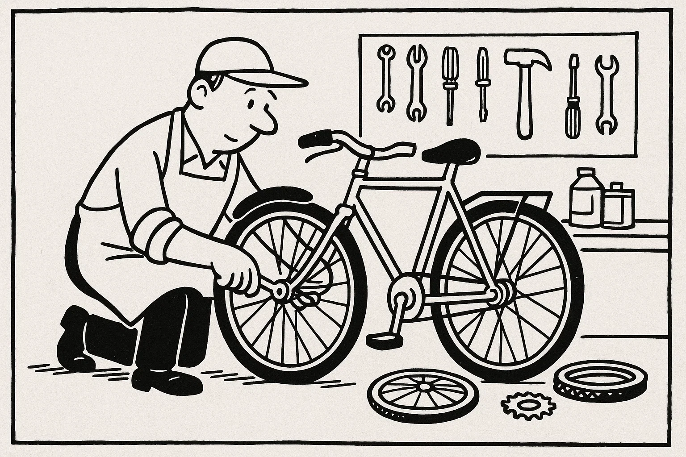

# Prøve i Dansk 2 _Practice Test 8_

  

## Outline

- Læseforståelse (90 minutter)
  - Delprøve 1
  - Delprøve 2
- Skriftlig fremstilling (90 minutter)
- Mundtlig kommunikation (20 minutter)

  Help Den Frie Prøvebank

_This practice test was generated by Den Frie Prøvebank and is unofficial. Den Frie Prøvebank's ability to validate how well its tests match the official tests, in terms of content and structure, is limited. Users should seek guidance from official teaching institutions as to the structure and content of the exams in question._

## Læseforståelse

### Delprøve 1 (30 minutter)

**Ingen hjælpemidler tilladt**

#### Opgave 1

Nedenfor finder du fire opslagstekster (A–D) fra brochurer, pjecer og hjemmesider. I alt er der ca. 2000 ord. Læs dem alle grundigt. Der er seks spørgsmål til teksterne.

**Tekst A: Mælkevejens Bibliotek – mere end bare bøger**  

Mælkevejens Bibliotek ligger i hjertet af bydelen og har siden åbningen i 2005 udviklet sig til et levende mødested for børn, unge og voksne. I stueetagen findes en lys og rummelig café med fairtrade‑kaffe, hjemmebag og en lille scene, hvor lokale musikere kan optræde om fredagen. Der er et legeområde, hvor de mindste kan lytte til historier og bygge med klodser, mens forældrene sludrer over en kop kaffe. På første sal ligger et moderne bibliotek med mere end 35.000 titler, herunder e‑bøger og lydbøger. Der er også flere stille arbejdspladser og et multimedierum, hvor man kan redigere film eller optage podcasts.  

Biblioteket tilbyder et bredt program af aktiviteter: skriveworkshops, makerspace‑kurser, foredrag og børneteater. Hver lørdag formiddag er der højtlæsning for børn, og hver onsdag aften mødes den lokale læsekreds. I skolernes ferier arrangeres kreative værksteder, hvor man kan prøve at lave papir, eksperimentere med 3D‑print eller tegne manga. Der er altid gratis adgang til arrangementerne, men tilmelding er nødvendig for kurser med begrænset plads.  

Åbningstiderne er lange, så man kan komme før eller efter arbejde: mandag til torsdag kl. 8.00–20.00, fredag kl. 8.00–18.00, lørdag kl. 10.00–16.00 og søndag kl. 12.00–16.00. Medlemskab er gratis for børn under 14 år, mens et voksenmedlemskab koster 300 kr. om året og giver adgang til at låne spil, musik og film samt rabat på betalte events. Alle etager er handicapvenlige med elevatorer og brede døre. Har du idéer til nye aktiviteter eller ønsker du at blive frivillig, kan du kontakte bibliotekslederen via hjemmesiden eller møde op på informationsskrankens 2. sal.

**Tekst B: Karrierehjørnet – et netværk for jobsøgende**  

Karrierehjørnet er et gratis tilbud til udlændinge og danskere, der søger arbejde eller ønsker at skifte branche. Caféen drives af kommunen og frivillige fagfolk og holder til i Kulturhusets lokaler. To gange om ugen, mandag og onsdag kl. 16.00–18.00, kan du få hjælp til at skrive CV, opbygge en LinkedIn‑profil, træne jobinterview og lære om danske arbejdskultur. Der kræves ingen tilmelding – du møder bare op og tager dit CV med på en USB‑nøgle eller print. Kaffen er gratis, og samtalerne foregår i små grupper, så alle får tid og ro.  

Udover de faste møder er der en månedlig workshop den første torsdag i måneden kl. 17.30, hvor en specialist holder oplæg om emner som netværk, lønforhandling eller alternative karriereveje. Deltagerne kan stille spørgsmål og dele erfaringer. Karrierehjørnet tilbyder også et mentorprogram, hvor erfarne medarbejdere matcher med jobsøgende for et forløb på seks måneder. Programmet kræver en kort ansøgning og et interview for at sikre et godt match.  

Karrierehjørnet samarbejder med Jobcentret og lokale virksomheder. De annoncerer ledige stillinger på opslagstavlen og arrangerer hvert kvartal en jobmesse, hvor man kan møde arbejdsgivere ansigt til ansigt. Hvis du har en idé til et oplæg eller vil melde dig som frivillig mentor, kan du kontakte koordinatoren via hjemmesiden. Alle aktiviteter er gratis, og tilbuddet henvender sig til folk i alle aldre og baggrunde.

**Tekst C: Spar vand i hverdagen – små ændringer gør en forskel**  

Danskerne bruger i gennemsnit 106 liter vand om dagen, men der er mange muligheder for at reducere forbruget uden at gå på kompromis med komforten. Ifølge Vandstyrelsens guide kan man spare op til 50 liter om dagen ved blot at tage kortere brusebade: et fem minutters bad i stedet for ti minutters kan spare cirka 50 liter. Ved at installere vandbesparende brusehoveder og perlatorer på haner reduceres vandmængden yderligere uden at trykket føles lavere. Lækager i toiletter og vandhaner kan koste mange liter om dagen – tjek derfor jævnligt for dryp og få utætheder repareret hurtigt.  

Køkkenet er et andet sted med potentiale: vask grøntsager i en balje i stedet for under rindende vand, fyld opvaskemaskinen helt, og vælg økonomiprogrammet. Undgå at skylle tallerkener af, hvis de ikke er fedtede, men skrab dem i stedet rene med en spatel. Brug regnvand til blomsterkasser, og giv haven vand tidligt om morgenen eller sent om aftenen, så mindre fordampes.  

I mange kommuner kan du få tilskud til at installere regnvandstank eller gråvandssystemer. Informationsmøder holdes jævnligt på rådhuset, hvor eksperter forklarer om tekniske løsninger, lovgivning og mulige besparelser. Små vaner i hverdagen, som at slukke for vandet mens man børster tænder eller vælge en energibesparende opvaskemaskine, gør en forskel for både miljøet og økonomien. Husk at lære børnene at spare på vandet – fremtidens generationer vil takke dig.

**Tekst D: Mentornet – frivillige mentorer til unge flygtninge**  

Foreningen Mentornet matcher voksne frivillige med unge flygtninge i alderen 15–25 år. Formålet er at give de unge et netværk, støtte i hverdagen og bedre muligheder for at fuldføre uddannelse og finde arbejde. Som mentor mødes man med sin mentee mindst to timer om ugen, oftest efter skole eller om aftenen. Indholdet kan være lektiehjælp, samtaler om uddannelsessystemet, hjælp til at skrive ansøgninger, øve dansk eller blot at lave mad sammen og tale om det nye land. Mentorrollen varer typisk et halvt år, og der er løbende mulighed for forlængelse, hvis begge parter ønsker det.  

Inden man starter, deltager man i et obligatorisk introduktionskursus, hvor man lærer om kulturelle forskelle, traumer og grænser. Der er også mulighed for supervision undervejs, hvor man kan dele erfaringer med andre mentorer og få sparring fra en professionsuddannet koordinator. Alle frivillige er dækket af en forsikring, og udgifter til offentligt transport refunderes.  

Mentornet arrangerer månedlige sociale events som fodboldkampe, fællesspisning og museumsbesøg, så mentees kan møde andre unge og øve det danske sprog. For at blive mentor skal man være mindst 20 år, have en ren straffeattest og kunne afsætte tid regelmæssigt. Ansøgning foregår via hjemmesiden, hvor man også kan læse historier fra tidligere mentorer og mentees. Har du spørgsmål, kan du ringe til kontoret tirsdag mellem kl. 10.00 og 14.00.

##### Spørgsmål til teksterne

1. Hvornår lukker Mælkevejens Bibliotek om søndagen?  

2. Hvor meget koster et voksenmedlemskab af Mælkevejens Bibliotek om året?  

3. På hvilke dage og tidspunkter mødes Karrierehjørnet?  

4. Hvor mange liter vand kan man spare ved at tage et fem minutters bad i stedet for et ti minutters bad?  

5. Hvad er minimumstiden, en mentor skal afsætte pr. uge i Mentornet-programmet?  

6. Hvilken aldersgruppe hjælper Mentornet mentorprogrammet?  

#### Opgave 2

Nedenfor finder du ni korte tekster (A–I), fx annoncer og opslag, med en samlet længde på omkring 375 ord. De enkelte tekster identificeres ved et bogstav. Der er syv sætninger (1–7), som skal matches med teksterne. Sæt kun ét bogstav ved hver sætning.  

**A.** *Bofællesskab søger beboer* – Vi har et ledigt værelse i vores hyggelige bofællesskab i Roskilde fra 1. oktober. Lejligheden er 120 m² med fælles køkken og have. Husleje 4.800 kr./måned plus forbrug. Vi søger en rolig person uden husdyr, der vil deltage i fælles madlavning hver torsdag. Kontakt: bo@fællesskab.dk.  

**B.** *Gratis foredrag* – “Vejr og klimaforandringer” med meteorolog Mette Jensen på biblioteket på fredag kl. 19.00. Alle er velkomne, og der serveres kaffe og te. Ingen tilmelding.  

**C.** *Sommermarked* – Kom til stort udendørs marked på torvet lørdag kl. 10–17. Stand koster 100 kr. Sælg dine brugte ting eller find gode tilbud. Musik, madboder og aktiviteter for børn hele dagen.  

**D.** *Bager søges* – Vi søger en erfaren bager til vores morgenbageri i Aarhus. Stillingen er fuld tid med start snarest. Du skal kunne arbejde tidligt om morgenen. Ansøg senest 20. september via mail.  

**E.** *Hund fundet* – En brun labrador med rødt halsbånd er fundet i parken ved søen. Henvend dig på dyreinternatet med beskrivelse og ID.  

**F.** *Busrute ændret* – Linie 25 kører fra mandag om via Stationsvej og standser ikke længere ved Rådhuspladsen. Se nye tider på www.citybus.dk.  

**G.** *Barista til café* – Smilende deltidsmedarbejder søges til lille kaffebar i Aalborg. Arbejdstid 15 timer om ugen, primært eftermiddag og weekend. Erfaring med kundeservice er en fordel.  

**H.** *Selvforsvarskursus* – Lær grundlæggende selvforsvar hver tirsdag kl. 18–19.30 i sportscenteret. Pris: 60 kr. pr. gang. Medbring træningstøj.  

**I.** *Strikkeklub* – Elsker du håndarbejde? Vi mødes hver anden torsdag kl. 19 hjemme hos skiftende medlemmer for at strikke og hygge. Tilmeld dig på biblioteket.  

**Sætninger:**

_Sæt kun ét bogstav ved hver sætning._

1. Jeg vil gerne vide, hvornår sommermarkedet slutter. _________  
2. Jeg leder efter et deltidsjob i en café. _________  
3. Jeg skal leje en stand til 100 kr. _________  
4. Min hund er væk. Hvor skal jeg henvende mig? _________  
5. Jeg søger en plads i et bofællesskab uden husdyr. _________  
6. Jeg vil høre et gratis foredrag om vejret. _________  
7. Jeg vil gerne strikke sammen med andre. _________  

### Delprøve 2 (60 minutter)

**Ingen hjælpemidler tilladt**

#### Opgave 3

Læs nedenstående fortælling. I teksten er der fjernet ni ord. Ordene findes i listen under teksten sammen med fem ekstra ord, der ikke passer.  

**Tekst:**  
Min ven Ahmed flyttede til Danmark for at studere. Da han kom, kendte han ingen **(1)** ______ i byen og var nervøs for at begynde på universitetet. Vejret var **(2)** ______ om vinteren, og han savnede solen fra sit hjemland. Han begyndte at **(3)** ______ med sine forældre hver aften for at føle sig mindre alene.  

Snart lærte han at cykle rundt i **(4)** ______ og opdagede de smukke parker. Han fandt også en lille **(5)** ______, der solgte hans yndlingsretter, hvilket gjorde ham glad. På studiet fik han en god **(6)** ______ med sin danske tutor, som hjalp ham med at forstå lektierne.  

Efter et par måneder blev han mere **(7)** ______ og meldte sig til en frivillig gruppe. Der fik han nye venner og **(8)** ______ for lokal kultur. Nu føler han sig hjemme og planlægger at **(9)** ______ i Danmark efter sin uddannelse.

**Ord til brug (ni passer, fem er distraktorer):**

_Noter: Skriv det korrekte ord i hver blank. Ét ord må kun bruges én gang._

  <ul class="column">
    <li>kolde</li>
    <li>ringe</li>
    <li>relation</li>
    <li>modig</li>
    <li>kærlighed</li>
    <li>unge</li>
    <li>bo</li>
  </ul>
  <ul class="column">
    <li>byen</li>
    <li>kiosk</li>
    <li>interesse</li>
    <li>venner</li>
    <li>triste</li>
    <li>kommunikere</li>
    <li>naboer</li>
  </ul>

#### Opgave 4

Læs teksten nedenfor. Den består af seks afsnit. I hvert afsnit er der fjernet én sætning. Efter teksten finder du otte sætninger (A–H), hvoraf seks passer i hullerne. To sætninger er distraktorer.  

**Tekst:**  

**Afsnit 1**  

Emil har altid elsket duften af friskbagt brød. Som ung lærling tilbragte han timer i bageriets varme og drømte om at åbne sit eget sted. Da han fyldte 30, besluttede han at tage springet og sige sit sikre job op. **(1)** ______  

**Afsnit 2**  

Han fandt et lille lokale i byens gamle kvarter, malede væggene lyseblå og købte brugt udstyr. Venner og familie hjalp med at flytte tunge ovne ind og indrette med træborde og gamle lamper. **(2)** ______ Emil ville gerne skabe et sted, hvor kunderne kunne føle sig hjemme og følge med i bagningen.  

**Afsnit 3**  

De første måneder var hårde. Han stod op kl. 4 hver morgen for at ælte dej og forme baguetter, mens byen stadig sov. Kunderne begyndte langsomt at finde vej, trukket af duften af kanel og kaffe. **(3)** ______ På travle dage måtte han lægge ekstra timer i arbejdet, men han klagede aldrig.  

**Afsnit 4**  

Bæredygtighed var vigtigt for Emil. Han brugte økologiske råvarer og købte korn fra lokale bønder. Han sørgede for, at intet gik til spilde. **(4)** ______ Han installerede også solceller på taget, så bageriet kunne producere en del af sin egen energi.  

**Afsnit 5**  

Efter et år deltog Emil i en konkurrence om byens bedste brød. Han var nervøs, men bagte hele natten for at præsentere sit mest perfekte rugbrød. **(5)** ______ Præmien bestod af nye maskiner, som gjorde arbejdet lettere, og omtalen skaffede ham endnu flere kunder.  

**Afsnit 6**  

I dag har bageriet tre ansatte og åbner snart en filial i nabobyen. Emil bruger sin fritid på at undervise unge i bagning og fortælle dem om at følge deres passion. **(6)** ______ Han håber, at hans historie kan inspirere andre til at tro på deres drømme og skabe noget eget.

**Sætninger (A–H):**

*Skriv bogstavet for den rigtige sætning ved hver 1 – 6. To sætninger skal ikke bruges.*

<ul class="multiple-choice-answers">
  <li>Han havde sparet op i flere år for at få råd til udstyr og husleje.</li>
  <li>Hans venner hjalp med at male væggene og indrette det lille lokale.</li>
  <li>Det var hårdt at stå op kl. 4 hver morgen, men kunderne satte pris på de varme rundstykker.</li>
  <li>Han solgte også kaffe, så de forbipasserende kunne tage en kop med på arbejde.</li>
  <li>Emil donerede brød, som ikke blev solgt, til det lokale herberg.</li>
  <li>Han blev overrasket, da han vandt førsteprisen for bedste rugbrød i en konkurrence.</li>
  <li>Historien om hans succes inspirerede andre unge til at følge deres drømme.</li>
  <li>Selv når der var stille i butikken, øvede han sig på nye opskrifter og teknikker.</li>
</ul>

#### Opgave 5

Du skal læse et interview med en person. Teksten består af otte afsnit (A–H). Der er fem spørgsmål til teksten. Sæt bogstavet for det afsnit, der indeholder svaret, ved hvert spørgsmål.

**Tekst:**  

**Afsnit A**  

Maja Sørensen er 29 år og leder firmaet “Grønt Fællesskab”, der hjælper familier med at anlægge små køkkenhaver i byen. Hun bor i en lejlighed i Odense med sin kæreste og deres hund, og hun bruger ofte aftenerne på at passe planterne på altanen.  

**Afsnit B**  

Maja læste egentlig farmaci, men efter et år på universitetet følte hun sig fanget i laboratoriet. Hun meldte sig som frivillig i et lokalområde, der plantede træer på skoler, og hun opdagede, at hun brændte for bæredygtighed og fællesskab. Denne oplevelse fik hende til at skifte studie og fokusere på miljø.  

**Afsnit C**  

I 2019 grundlagde hun “Grønt Fællesskab”. De første måneder arbejdede hun fra sin stue og kørte rundt i en gammel bil for at besøge kunder. Hun mødte modstand fra dem, der troede, at køkkenhaver var for bøvlede i byen, men hun viste dem, hvordan man kan dyrke grøntsager i kasser og på altaner.  

**Afsnit D**  

I dag har firmaet fem ansatte, heraf to praktikanter. Maja prioriterer at ansætte unge med forskellige baggrunde og giver dem mulighed for at lære om projektledelse, marketing og botanik. Hun holder ofte oplæg på skoler og deltager i messer for at inspirere flere til at dyrke egne planter.  

**Afsnit E**  

En af de største udfordringer er at overbevise travle familier om at finde tid til at passe en have. “Mange tror, at det tager for lang tid, men selv 15 minutter om dagen gør en forskel,” siger hun. Hun prøver at forklare fordelene ved frisk mad, fællesskab og læring for børn.  

**Afsnit F**  

Maja praktiserer, hvad hun prædiker. Hjemme sorterede hun affald længe før, det blev almindeligt, og hun cykler til arbejde hver dag. Når hun ikke arbejder, går hun ture med sin hund, laver yoga eller læser bøger om natur. Hun elsker også at bage brød til vennerne.  

**Afsnit G**  

Fremtiden ser grøn ud: Maja planlægger at udvide virksomheden til andre regioner i Norden og udvikle en app, hvor brugerne kan dele tips og følge hinandens haver. Hun samarbejder allerede med organisationer i Sverige og Finland og håber at skabe et netværk på tværs af landegrænser.  

**Afsnit H**  

Maja siger, at det bedste ved hendes arbejde er at se børn plukke deres første gulerod og være stolte. Hun bliver også glad, når familier, der ikke kendte hinanden, begynder at udveksle opskrifter og frø. “Det handler ikke kun om planter,” siger hun, “men om relationer og livsglæde.”

##### Spørgsmål

1. I hvilket afsnit beskrives Majas familieliv?  

2. Hvad fik Maja til at skifte fra farmaci til miljøarbejde?  

3. Hvor mange personer arbejder der nu i “Grønt Fællesskab”?  

4. Hvad er en af de største udfordringer i Majas arbejde?  

5. Hvad laver Maja i sin fritid?  

## Skriftlig fremstilling (90 minutter – alle ordbøger tilladt)

### Delprøve 1 – vælg enten 1A eller 1B

**1A.** Du pendler hver dag med bus til arbejde, men den seneste måned har busserne været forsinkede og overfyldte. Du ønsker at klage til transportselskabet og foreslå en løsning. Skriv en halvformel henvendelse på ca. 150–200 ord, hvor du:

- beskriver de gentagne forsinkelser og overfyldte busser og tidspunktet på dagen  
- fortæller, hvordan det påvirker dig og eventuelt din arbejdsgiver  
- nævner, at du har henvendt dig til chaufføren uden resultat  
- foreslår, hvad transportselskabet kan gøre for at forbedre situationen (f.eks. flere afgange eller større busser)  

**1B.** Din veninde har åbnet en lille secondhand‑tøjboutique i din by og beder dig om at skrive et opslag til hendes hjemmeside, der skal tiltrække nye kunder. Skriv en halvformel tekst på ca. 150–200 ord, hvor du:

- beskriver butikslokation og den hyggelige indretning  
- fortæller om udvalg af tøj, accessories og fokus på bæredygtighed  
- fremhæver atmosfæren, den venlige betjening og eventuelle særlige tilbud  
- opfordrer folk til at besøge butikken og dele opslaget med venner  

### Delprøve 2

Du har netop afsluttet et madlavningskursus. Din underviser sender dig en e‑mail, hvor hun beder dig om at skrive et kort brev til en tidligere kursist, som overvejer at starte på kurset. Skriv en uformel e‑mail på mindst 100 ord, hvor du:

- hilser pænt og præsenterer dig selv  
- fortæller kort om, hvordan kurset var opbygget (teori, praksis, opgaver)  
- beskriver, hvad du lærte, og hvordan du bruger det i din hverdag  
- giver din mening om læreren og stemningen på holdet  
- opmuntrer kursisten til at tilmelde sig og tilbyder at besvare spørgsmål  

_Brug disse sider til at skrive din skriftlige opgave._

## Mundtlig kommunikation (20 minutter for to prøvedeltagere)

### Delprøve 1 (ca. 10 minutter i alt)

Hver prøvedeltager forbereder og holder en præsentation på ca. 1½ minut om et selvvalgt emne fra sin hverdag, fx arbejde, fritidsinteresser, familie, bolig eller en tradition. Efter præsentationen interviewer eksaminator prøvedeltageren i ca. 3½ minut med spørgsmål, der uddyber emnet.  

**Fokus:** Evne til at fortælle sammenhængende om personligt erfarede forhold og at forstå og besvare spørgsmål fra eksaminator.  

### Delprøve 2 (ca. 10 minutter i alt)

Der er tre emner (A, B og C) om konkrete hverdagsforhold. Til hvert emne hører to billeder (Billede 1 og Billede 2), som illustrerer en situation. Prøvedeltagerne vælger ét emne. Først interviewer eksaminator hver prøvedeltager enkeltvis om det valgte billede. Derefter følger en samtale mellem de to prøvedeltagere, hvor de taler sammen på baggrund af en case, som eksaminator præsenterer. Eksaminator fungerer som mediator og sørger for, at begge prøvedeltagere kommer til orde.

**Emner og billeder:**

- **Emne A: Digitalt fællesskab og sociale medier**  

Kommunen overvejer at etablere et offentligt “digitalt mødested” med kurser i digital dannelse og fælles aktiviteter online. Diskutér fordele og ulemper, herunder muligheder for at bekæmpe ensomhed og de risici, der er ved skærmtid. Kom med forslag til, hvordan man skaber et sundt onlinefællesskab for både unge og ældre.

- **Emne B: Genbrug og cirkulær økonomi**  

Byrådet vil åbne et nyt genbrugscenter og opfordrer borgerne til at bytte og reparere i stedet for at købe nyt. Diskutér fordele og ulemper for miljø og lokale butikker, samt hvordan man kan gøre genbrug attraktivt for flere aldersgrupper. Kom med idéer til workshops eller samarbejder, der kan fremme en cirkulær tankegang.

- **Emne C: Natur og mental sundhed**  

Kommunen diskuterer at anlægge en stor byskov tæt på centrum for at forbedre borgernes mentale sundhed. Diskutér, hvad grønne områder betyder for trivsel, og hvordan man kan sikre både biodiversitet og rekreative muligheder. Kom med forslag til aktiviteter og initiativer, der kan få flere til at bruge naturen i hverdagen.

---

_This practice test was generated by Den Frie Prøvebank and is unofficial. Den Frie Prøvebank's ability to validate how well its tests match the official tests, in terms of content and structure, is limited. Users should seek guidance from official teaching institutions as to the structure and content of the exams in question._
