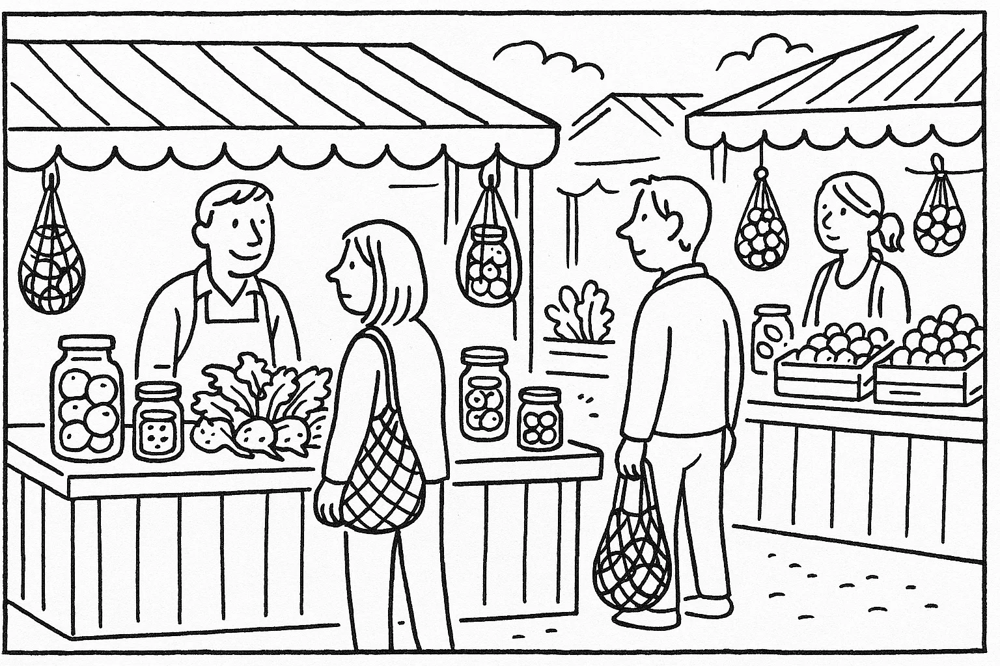
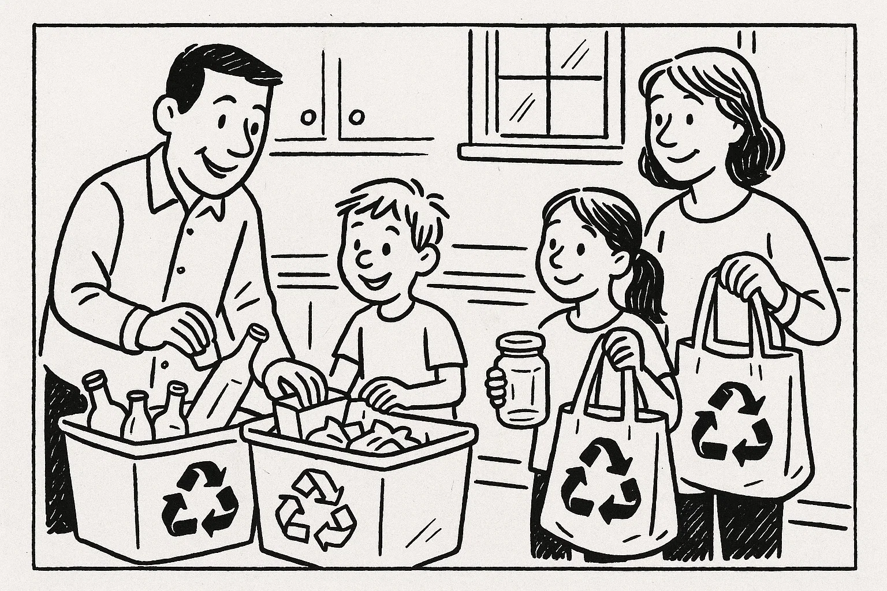
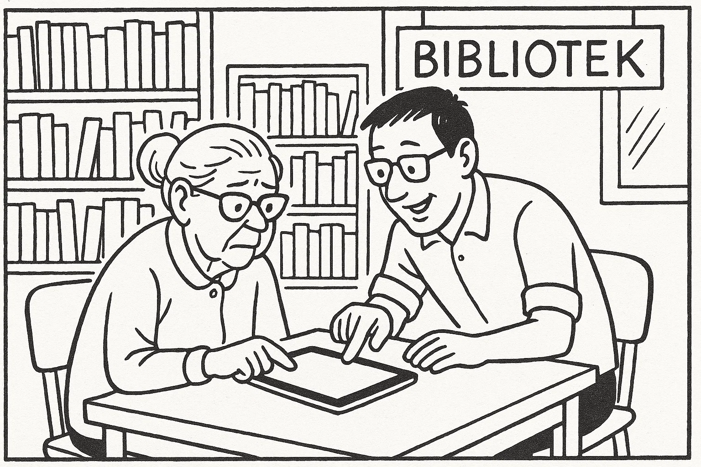
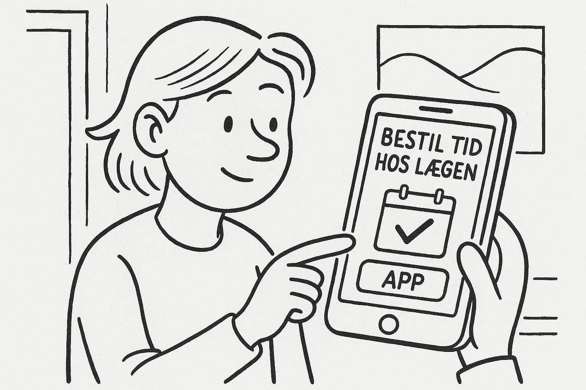
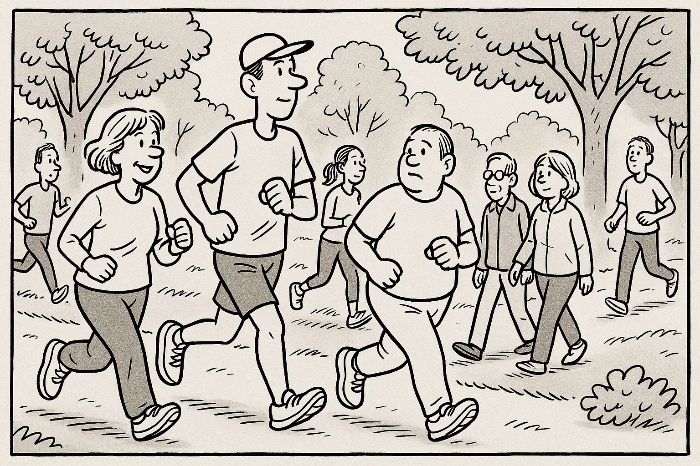
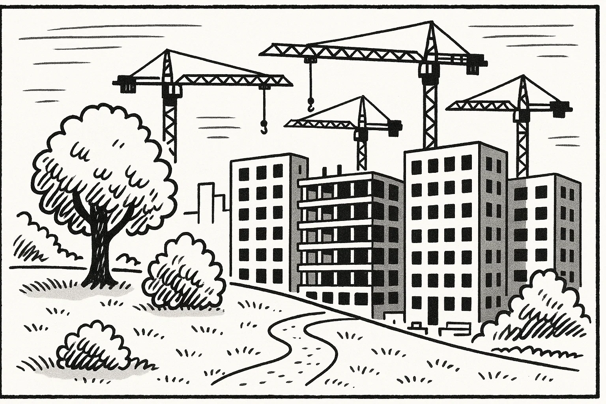

# Prøve i Dansk 2 _Practice Test 9_

  

## Outline

- Læseforståelse (90 minutter)
  - Delprøve 1
  - Delprøve 2
- Skriftlig fremstilling (90 minutter)
- Mundtlig kommunikation (20 minutter)

  Help Den Frie Prøvebank

_Denne prøve er udarbejdet af Den Frie Prøvebank og er uofficiel. Den Frie Prøvebank kan ikke garantere, at dens opgaver matcher de officielle prøver fuldstændigt. Søg vejledning hos officielle undervisningsinstitutioner for at få mere information om prøvens struktur og indhold._

## Læseforståelse

### Delprøve 1 (30 minutter)

**Ingen hjælpemidler tilladt**

#### Opgave 1

Nedenfor finder du fire opslagstekster (A–D) fra brochurer, pjecer og hjemmesider. I alt er der ca. 2000 ord. Læs dem alle grundigt. Der er seks spørgsmål til teksterne.

**Tekst A: Det Grønne Torv – et bæredygtigt mødested i din by**  

Det Grønne Torv er et nyt samlingspunkt i centrum af kommunen, hvor borgere kan mødes og lære om bæredygtighed. Huset slog dørene op i 2004 i en tidligere fabrikshal, som er renoveret med genbrugsmaterialer og solceller på taget. På stueetagen ligger en café, der serverer vegetariske og veganske retter lavet af lokale råvarer, samt en lille nul‑affald‑butik med økologiske produkter, sæber uden emballage og et udvalg af sæsonens frugt og grønt. Caféen er bemandet af frivillige kokke, der eksperimenterer med rester fra fødevarebanker for at reducere spild.  

På første sal finder du et “bibliotek for ting”, hvor du kan låne værktøj, køkkenudstyr, telte og cykelanhængere i stedet for at købe nyt. Ved siden af ligger et reparationsværksted med symaskiner, skruenøgler og loddekolber, hvor frivillige hjælper med at reparere tøj, elektronik og møbler. Hver uge arrangeres workshops: fermentering af kål, hjemmelavet kosmetik, kompostering på altanen, cykelreparation og upcycling af gamle møbler. Et stort drivhus i baggården fungerer som undervisningshave for skoleklasser, og der er højbede, som medlemmer kan dyrke krydderurter i.  

Huset er åbent fra kl. 9.00–20.00 mandag til torsdag, fredag til kl. 18.00, lørdag til kl. 16.00 og søndag fra kl. 10.00–14.00. Alle arrangementer annonceres i et månedligt program, som kan hentes i foyeren eller på hjemmesiden. Medlemskab koster 450 kr. om året og giver rabat på kurser og gratis lån af værktøj. Børn under 15 år har gratis adgang sammen med en voksen. Huset drives af en forening i samarbejde med kommunen og mere end 100 frivillige. Har du forslag til nye aktiviteter eller ønsker du at blive frivillig, kan du kontakte koordinatoren på mail eller besøge kontoret på anden sal om tirsdagen mellem kl. 14.00–17.00.

**Tekst B: Filmklub – lær dansk gennem film**  

Filmklubben “Dansk på Lærredet” er et gratis tilbud til voksne udlændinge og danskere, der elsker film og vil øve sproget på en sjov måde. Klubben holder til på hovedbibliotekets tredje sal, hvor der er en lille biografsal med behagelige sæder og et stort lærred. Hver onsdag kl. 17.30–20.30 vises en dansk spillefilm med undertekster, og efter filmen er der tid til samtale og diskussion i små grupper. De frivillige værter indleder med et kort oplæg om temaet i filmen, og bagefter stiller de spørgsmål til handlingen og karaktererne, så alle kan øve sig i at udtrykke sig.  

Der serveres kaffe, te og vand i pausen, og deltagerne er velkomne til at medbringe snacks eller hjemmebag til at dele med de andre. Du behøver ikke at tilmelde dig på forhånd – du dukker bare op. Filmprogrammet offentliggøres en måned i forvejen på bibliotekets hjemmeside og på klubbens Facebook‑side, så du kan se, hvilke film der bliver vist. To gange om året arrangeres der et weekendseminar, hvor man ser tre film over to dage og får besøg af en gæst – en skuespiller, instruktør eller filmanmelder – der fortæller om sit arbejde. Klubben samarbejder med sprogskolen, som opfordrer sine kursister til at komme og lytte til ægte dialog. Der er ingen aldersgrænse, men filmene er typisk for voksne. Der er elevator til salen og handicapvenlige toiletter.

**Tekst C: Affaldssortering og kompost – sådan gør du derhjemme**  

Hvis du vil være mere bæredygtig i hverdagen, er affaldssortering et godt sted at starte. Kommunens miljøafdeling har udarbejdet en guide til, hvordan du reducerer restaffaldet og omdanner organiske rester til næringsrig kompost. Guiden forklarer, at en gennemsnitlig familie kan mindske sit restaffald med op til 40 %, hvis mad- og haveaffald sorteres separat. Den anbefaler at anskaffe en godkendt kompostbeholder til haven eller en køkkenkompost, hvor du kan lægge grøntsagsskræller, kaffegrums, æggeskaller og visne blomster.  

Når du sorterer, er det vigtigt at bruge tydeligt mærkede beholdere til plastik, metal, glas, papir og pap. Skyl emballage ren for madrester og tryk luft ud af plastikposer, før du smider dem i. Kartoner fra juice og mælk skal til kartonbeholderen, mens ødelagte glas og porcelæn skal på genbrugspladsen. Farligt affald som batterier, kemikalier og elektronik skal afleveres i særlige containere på genbrugsstationen. Papkasser bør foldes sammen for at spare plads, og aviser skal bundtes, så de ikke blæser væk.  

Guiden fortæller også, at det er en fordel at vende sin kompost en gang om ugen for at tilføre ilt. Efter seks til ni måneder er komposten omdannet til muld, som kan bruges i bede og krukker. På kommunens hjemmeside kan du finde en kalender over gratis kurser i affaldssortering og kompostering, hvor du kan stille spørgsmål til eksperter. Der er også en app, der minder dig om afhentningsdage for de forskellige beholdere. Endelig opfordres borgerne til at dele billeder af deres kompostprojekter på sociale medier for at inspirere andre.

**Tekst D: Nabohjælp – styrk fællesskabet i dit lokalområde**  

“Nabohjælp” er en platform, der bringer folk i lokalsamfundet sammen for at hjælpe hinanden med praktiske opgaver og sociale aktiviteter. Ideen opstod, da en gruppe beboere i 2016 ville skabe mere tryghed og kontakt i området. På hjemmesiden kan du oprette en profil og vælge, hvilke typer opgaver du ønsker at hjælpe med: handle ind for ældre, gå tur med naboens hund, hente børn i børnehave, passe blomsterne for nogen på ferie eller besøge en ensom pensionist. Der er også mulighed for at starte initiativer som fælles havedage, byttebibliotek eller loppemarked.  

Når du tilmelder dig, bliver du inviteret til et introduktionsmøde den første mandag i måneden kl. 18.00 i medborgerhuset. Her får du information om forsikring, tavshedspligt og de etiske retningslinjer for frivillige. En koordinator hjælper dig med at finde de opgaver, der passer bedst til dine interesser og din tidsplan. Du bestemmer selv, hvor meget tid du vil bruge, men de fleste bidrager omkring to timer om ugen. Som frivillig er du dækket af en særlig forsikring, og du kan få bevis på dit engagement, som kan bruges i forbindelse med jobsøgning.  

Platformen har en aktiv Facebook‑gruppe, hvor medlemmerne deler erfaringer og efterlyser hjælp til konkrete ting. Der arrangeres også månedlige sociale arrangementer som fælles picnics, brætspilsaftener og foredrag om naboskab. Projektet støttes af kommunen, men drives primært af beboernes engagement. Hvis du har spørgsmål eller ønsker at starte et nyt projekt, kan du skrive til info@nabohjælp.dk eller ringe til frivilligcenteret på hverdage mellem kl. 9.00–13.00.

##### Spørgsmål til teksterne

1. Hvad koster et års medlemskab af Det Grønne Torv?  

2. Hvornår er caféen i Det Grønne Torv åben om søndagen?  

3. Hvilket tidspunkt mødes filmklubben “Dansk på Lærredet” om onsdagen?  

4. Nævn én ting, som deltagerne kan medbringe til filmklubben, hvis de vil dele med andre.  

5. Hvilke to materialer skal skylles og sorteres ifølge guiden til affaldssortering, før de smides ud?  

6. Hvor mange timer om ugen bruger de fleste frivillige i “Nabohjælp” på deres opgaver?  

#### Opgave 2

Nedenfor finder du ni korte tekster (A–I), fx annoncer og opslag, med en samlet længde på omkring 375 ord. De enkelte tekster identificeres ved et bogstav. Der er syv sætninger (1–7), som skal matches med teksterne. Sæt kun ét bogstav ved hver sætning.

**A.** *Boghjørnet søger medlemmer* – Brænder du for litteratur? Vores læsekreds mødes hver anden onsdag kl. 19.00 i Kulturhuset. Vi læser én bog pr. måned og diskuterer over kaffe og kage. Deltagelse koster 50 kr. pr. møde til forplejning.  

**B.** *Kat fundet* – En gråstribet hunkat med rød halsbånd er fundet i parken ved Søvej. Den er meget kælen og har ingen chip. Kontakt Dyrlægen på tlf. 22 33 44 55 med beskrivelse for at hente den.  

**C.** *Brugt bil til salg* – Ældre, men velholdt stationcar (årg. 2010) sælges for 30.000 kr. Bilen har kørt 180.000 km og er nysynet. Ring på tlf. 50 60 70 80 for mere info.  

**D.** *Digitalt kursus* – Har du brug for hjælp til e‑Boks og NemID? Hver torsdag kl. 10–12 tilbyder biblioteket gratis undervisning for ældre. Medbring din tablet eller bærbare computer. Tilmelding i informationen.  

**E.** *Serveringsmedarbejder søges* – Restaurant “Havnegrillen” i Holbæk søger en smilende tjener til 20 timer om ugen. Erfaring med kundeservice er en fordel. Send ansøgning til job@havnegrillen.dk senest 1. oktober.  

**F.** *Garagesalg* – Søndag den 10. oktober kl. 9–14 holder vi stort garagesalg på Møllevej 5. Kom og gør et kup! Der er legetøj, bøger, køkkenudstyr og tøj i alle størrelser. Kontant og MobilePay modtages.  

**G.** *Gratis sprogtræning* – Mød andre udlændinge og tal dansk! Vores samtalegruppe mødes hver mandag kl. 17–18 i kantinen på sprogskolen. Ingen tilmelding. Vi byder på te og småkager.  

**H.** *Fælleshave søger frivillige* – Vil du dyrke grøntsager og møde nye mennesker? Fælleshaven bag Rådhuset mangler hænder til at luge, vande og høste. Vi mødes hver tirsdag kl. 16–18. Skriv til have@kommunen.dk.  

**I.** *Svømmehal lukket* – Byens svømmehal holder lukket fra 1. november til 15. november pga. renovering af omklædningsrummene. Vi åbner igen mandag den 16. november. Vi beklager ulejligheden.

**Sætninger:**

_Sæt kun ét bogstav ved hver sætning._

1. Jeg vil gerne hjælpe med at passe planter og høste grøntsager. _________  
2. Jeg leder efter et deltidsjob som tjener i Holbæk. _________  
3. Jeg mangler hjælp til at forstå e‑Boks og NemID. _________  
4. Jeg vil vide, hvornår svømmehallen åbner igen efter renoveringen. _________  
5. Jeg vil være med i en læsegruppe og diskutere bøger. _________  
6. Jeg skal aflevere en kælende hunkat, der har et rødt halsbånd. _________  
7. Jeg vil købe en billig brugt stationcar. _________  

### Delprøve 2 (60 minutter)

**Ingen hjælpemidler tilladt**

#### Opgave 3

Læs nedenstående fortælling. I teksten er der fjernet ni ord. Ordene findes i listen under teksten sammen med fem ekstra ord, der ikke passer.

**Tekst:**  
Mahmoud ankom til Danmark en kold vinterdag. Han forlod sit hjemland for at starte på en ny uddannelse og lære et nyt sprog. I begyndelsen boede han hos sin **(1)** ______ familie i Aarhus, som introducerede ham til danske traditioner og hjalp ham med at købe en cykel. På universitetet mødte han mange **(2)** ______ studerende fra hele verden. Det første halve år syntes han, at sproget var **(3)** ______ at udtale, og han havde svært ved at forstå, når folk talte hurtigt.  

For at forbedre sine færdigheder begyndte han at **(4)** ______ med lokale gennem en sprogudvekslingsapp. Han deltog også i en løbeklub i nærområdet, hvor han fandt et godt **(5)** ______ og lærte byen at kende. Hans forkærlighed for dansk mad **(6)** ______ langsomt, især efter at han havde smagt smørrebrød og flæskesteg. Da foråret kom, fik han et deltidsjob i et supermarked og begyndte at **(7)** ______ for sin egen lejlighed.  

Efter to år havde Mahmoud afsluttet sine studier med gode karakterer. Han valgte at blive i Danmark, fordi han **(8)** ______ den åbne kultur og de mange muligheder. Han meldte sig som frivillig i en forening, der hjælper nye indvandrere, så han kunne **(9)** ______ sine erfaringer og give noget tilbage.

**Ord til brug (ni passer, fem er distraktorer):**

*Noter: Skriv det korrekte ord i hver blank. Ét ord må kun bruges én gang.*

  <ul class="column">
    <li>savede</li>
    <li>venlige</li>
    <li>netværk</li>
    <li>varmt</li>
    <li>delt</li>
    <li>dele</li>
    <li>støtte</li>
  </ul>
  <ul class="column">
    <li>modne</li>
    <li>svært</li>
    <li>holde</li>
    <li>udtale</li>
    <li>satte</li>
    <li>sparre</li>
    <li>elsker</li>
  </ul>

#### Opgave 4

Læs teksten nedenfor. Den består af seks afsnit. I hvert afsnit er der fjernet én sætning. Efter teksten finder du otte sætninger (A–H), hvoraf seks passer i hullerne. To sætninger er distraktorer.

**Tekst:**  

**Afsnit 1**  

Mette havde altid været nysgerrig efter at lære nye færdigheder. Hun arbejdede som sygeplejerske på en travl afdeling, men i fritiden længtes hun efter at skabe noget med sine hænder. Da hun så en annonce for et keramikhold i det lokale kulturhus, meldte hun sig til uden at kende nogen. **(1)** ______  

**Afsnit 2**  

På første kursusaften blev deltagerne budt velkommen af en erfaren kunstner, som talte varmt om lerets muligheder. Mette var nervøs og frygtede, at hun ingen talent havde. **(2)** ______ 

**Afsnit 3**

Efterhånden som ugerne gik, opdagede hun, at keramik handlede mere om tålmodighed end perfektion. Hun lærte at dreje små skåle og kopper og at reparere fejl med rolig hånd. **(3)** ______ Mellem øvelserne udvekslede kursisterne historier om deres hverdag og knyttede tætte bånd.

**Afsnit 4**

En dag inviterede læreren holdet til at besøge hans atelier uden for byen. Der stod hylder fulde af farverige vaser og skulpturer, som alle bar præg af hans livslange kærlighed til håndværket. **(4)** ______ For Mette var besøget en øjenåbner, der inspirerede hende til at eksperimentere mere og turde lave sine egne designs.

**Afsnit 5**

Da kurset sluttede efter tre måneder, overraskede Mette sig selv ved at arrangere en lille udstilling i kulturhusets foyer. Hun inviterede kolleger, venner og familie til at se hendes arbejde. **(5)** ______ Folk kom, beundrede hendes små værker og opfordrede hende til at fortsætte.

**Afsnit 6**

Keramikken blev en vigtig del af Mettes liv. Hun fandt ro ved drejeskiven efter lange vagter og begyndte endda at sælge sine ting på lokale markeder. **(6)** ______ Hun drømte om at kombinere sit arbejde som sygeplejerske med kunstterapi, så patienter kunne få glæde af at skabe noget.

**Sætninger (A–H):**

*Skriv bogstavet for den rigtige sætning ved hver 1 – 6. To sætninger skal ikke bruges.*

<ul class="multiple-choice-answers">
  <li>Hun stillede sig på et hjørne af lokalet og betragtede i det skjulte de andre, før hun gik hen til en ledig plads.</li>
  <li>Læreren viste dem sit gamle værktøj og fortalte om glasureksperimenter, der var gået galt.</li>
  <li>På vej hjem den første aften kunne hun ikke lade være med at grine over sin nervøsitet.</li>
  <li>Hun bemærkede, at hendes fingre var konstant dækket af ler, men det gjorde hende ikke noget.</li>
  <li>Det overraskede hende, hvor hurtigt hun følte sig som en del af fællesskabet.</li>
  <li>Hun var vant til at arbejde med præcision og procedurer, så det var uvant at give slip.</li>
  <li>Efter udstillingen besluttede hun at holde en pause og fokusere på sin familie.</li>
  <li>Hun fik ros af læreren for sin indsats, og det gav hende selvtillid til at prøve noget nyt.</li>
</ul>

#### Opgave 5

Du skal læse et interview med en person. Teksten består af otte afsnit (A–H). Der er fem spørgsmål til teksten. Sæt bogstavet for det afsnit, der indeholder svaret, ved hvert spørgsmål.

**Tekst:**  

**Afsnit A**  

Jakob Møller er 45 år og arbejder som projektleder i en NGO, der udvikler digitale læringsplatforme for ældre. Han bor i Aalborg med sin hustru og to teenagedøtre og bruger en stor del af sin fritid på at træne maratonløb.  

**Afsnit B**  

Efter at have studeret datalogi arbejdede Jakob i mange år i en IT‑virksomhed. Han elskede teknologien, men følte, at noget manglede. En dag meldte han sig som frivillig til at undervise ældre i brug af tablets på det lokale bibliotek.  

**Afsnit C**

Oplevelsen med de ældre ændrede hans karriere. Han indså, at der var stort behov for hjælp til digital inklusion og brugervenlige løsninger. I 2016 tog han springet og grundlagde en organisation, der udvikler apps og kurser til pensionister.  

**Afsnit D**  

Organisationen har nu 12 ansatte, hvoraf fire er ældre, der selv er blevet superbrugere. Jakob mener, at deres input er afgørende for designet. Han fortæller, at han tager på turné i hele landet for at præsentere projekterne og samle feedback.  

**Afsnit E**  

En stor udfordring er ifølge Jakob at overbevise sponsorer og det offentlige om, at digitale færdigheder for ældre er en vigtig investering. “Mange tror, at det kun handler om underholdning, men for ældre kan det betyde adgang til læge, bank og familien,” siger han.  

**Afsnit F**  

Jakob har indrettet sit eget hjem som et testlaboratorium. Når hans mor kommer forbi, får hun lov at afprøve prototyperne. “Hun er min hårdeste kritiker,” griner han. I fritiden slapper Jakob af ved at løbe lange ture i skoven eller bage surdejsbrød.  

**Afsnit G**  

Når han ikke arbejder eller træner, lytter Jakob til podcasts om social innovation. Han har også startet en blog, hvor han deler tips og tricks til at lære teknologi i et roligt tempo. Bloggen har fået mange følger blandt både unge og ældre.  

**Afsnit H**  

Jakob drømmer om at samarbejde med skoler, så unge kan undervise ældre i teknologi. Han håber, at det kan skabe forståelse mellem generationer og give de unge indsigt i, hvordan man tilpasser formidlingen. “Vi lærer alle noget, når vi lytter til hinanden,” slutter han.

##### Spørgsmål

1. I hvilket afsnit beskrives Jakobs familie og fritidsinteresser?  

2. Hvorfor besluttede Jakob sig for at stifte sin organisation?  

3. Hvor mange ansatte arbejder der nu i Jakobs organisation?  

4. Hvad ser Jakob som en stor udfordring i sit arbejde?  

5. Hvad gør Jakob i sin fritid for at slappe af?  

## Skriftlig fremstilling (90 minutter – alle ordbøger tilladt)

### Delprøve 1 – vælg enten 1A eller 1B

**1A.** Du bor i et lille parcelhuskvarter. Den seneste tid har kommunen besluttet at fælde gamle træer for at anlægge flere parkeringspladser. Du er bekymret for naturen og ønsker at skrive en halvformel henvendelse til kommunen på ca. 150–200 ord, hvor du:

- forklarer, hvilke træer der skal fældes og hvorfor de er vigtige for kvarteret  
- beskriver, hvordan det påvirker dig og dine naboer at miste grønne områder  
- nævner, at du har talt med andre beboere, som deler din bekymring  
- foreslår alternative løsninger til at skabe parkeringspladser uden at ødelægge naturen  

**1B.** Din lokale idrætsforening vil starte et nyt svømmehold for børn og beder dig skrive et opslag til foreningens hjemmeside for at tiltrække medlemmer. Skriv en halvformel tekst på ca. 150–200 ord, hvor du:

- beskriver svømmehallens faciliteter og undervisningens form  
- fortæller om holdets tidspunkter og aldersgrupper  
- fremhæver underviserens erfaring og sikkerheden under træningen  
- opfordrer forældre til at melde deres børn til og dele informationen med andre  

### Delprøve 2

Du har lige været til en lokal musikfestival med en ven. En veninde, der overvejer at tage med næste år, skriver til dig for at høre, hvordan det var. Skriv en uformel e‑mail på mindst 100 ord, hvor du:

- hilser pænt og præsenterer dig selv, hvis nødvendigt  
- fortæller kort om festivalens opbygning og stemning  
- beskriver, hvad du oplevede, f.eks. koncerter, mad og aktiviteter  
- giver din mening om billetpriserne og faciliteterne  
- opmuntrer veninden til at deltage næste år og tilbyder at svare på spørgsmål  

_Brug disse sider til at skrive din skriftlige opgave._

## Mundtlig kommunikation (20 minutter for to prøvedeltagere)

### Delprøve 1 (ca. 10 minutter i alt)

Hver prøvedeltager forbereder og holder en præsentation på ca. 1½ minut om et selvvalgt emne fra sin hverdag, fx arbejde, fritidsinteresser, familie, bolig eller en dansk tradition. Efter præsentationen interviewer eksaminator prøvedeltageren i ca. 3½ minut med spørgsmål, der uddyber emnet.

**Fokus:** Evne til at fortælle sammenhængende om personlige erfaringer og forstå og besvare spørgsmål fra eksaminator.

### Delprøve 2 (ca. 10 minutter i alt)

Der er tre emner (A, B og C) om konkrete hverdagsforhold. Til hvert emne hører to billeder (Billede 1 og Billede 2), som illustrerer en situation. Prøvedeltagerne vælger ét emne. Først interviewer eksaminator hver prøvedeltager enkeltvis om det valgte billede. Derefter følger en samtale mellem de to prøvedeltagere, hvor de taler sammen på baggrund af en case, som eksaminator præsenterer. Eksaminator fungerer som mediator og sørger for, at begge prøvedeltagere kommer til orde.

**Emner og billeder:**

- **Emne A: Forbrug og bæredygtighed**  

Kommunen overvejer at begrænse engangsplastik på markeder og i butikker. Diskutér fordele og ulemper ved dette forslag, og kom med idéer til, hvordan man kan fremme genbrug og reducere affald uden at skabe problemer for handlende og forbrugere.

- **Emne B: Digitalisering og fællesskab**  

Byens borgerservice vil indføre flere digitale løsninger, så man bestiller pas, læge og boligtilbud via apps. Diskutér, hvordan dette påvirker ældre og mennesker uden digitale færdigheder, og foreslå måder at støtte dem, så alle kan deltage i samfundet.

- **Emne C: Byliv og natur**  

Kommunen planlægger at bygge nye boligblokke på et grønt område, hvor folk ofte går ture og dyrker sport. Diskutér, hvad det betyder for sundhed og fællesskab, og foreslå alternative steder til byggeriet eller måder at bevare grønne rum på.

---

_Denne prøve er udarbejdet af Den Frie Prøvebank og er uofficiel. Den Frie Prøvebank kan ikke garantere, at dens opgaver matcher de officielle prøver fuldstændigt. Søg vejledning hos officielle undervisningsinstitutioner for at få mere information om prøvens struktur og indhold._
