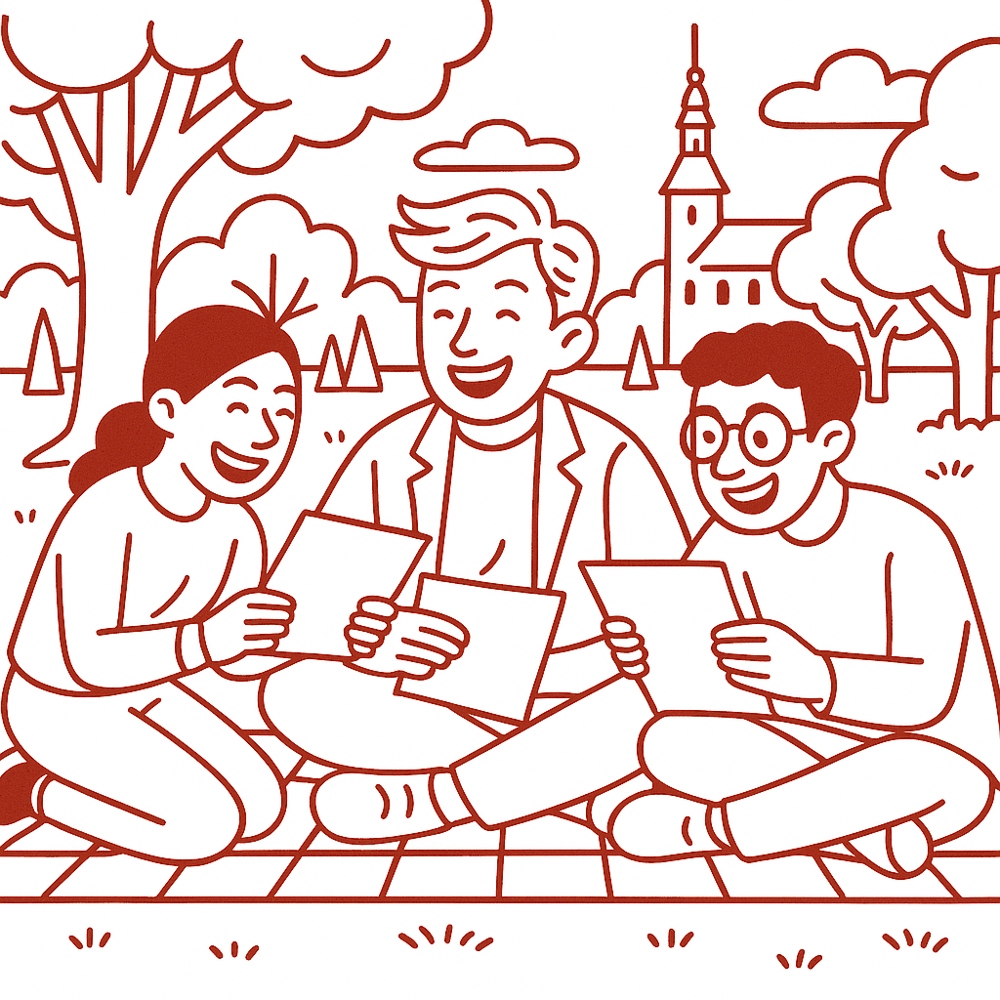

# Prøve i Dansk 3 _Practice Test 10_

  

## Outline

- Læseforståelse (90 minutter)
  - Delprøve 1
  - Delprøve 2A
  - Delprøve 2B
  - Delprøve 3
- Skriftlig fremstilling (2,5 timer)
- Mundtlig kommunikation (20 minutter)

  Help Den Frie Prøvebank

_This practice test was generated by Den Frie Prøvebank and is unofficial. Den Frie Prøvebank's ability to validate how well its tests match the official tests, in terms of content and structure, is limited. Users should seek guidance from official teaching institutions as to the structure and content of the exams in question._

## Læseforståelse

### Delprøve 1: Informerende tekster (25 minutter)

Læs tekstsamlingen nedenfor. Der er fire korte, informerende tekster (A–D). Efter tekstsamlingen finder du 15 spørgsmål til teksterne. Skriv dine svar kort og præcist. Du må gerne bruge stikord. Ingen hjælpemidler er tilladt.

#### Tekst A – Den nye bypark

Aalborg Kommune har besluttet at anlægge en ny bypark på et tidligere industriområde tæt ved havnen. Parken bliver i alt 50 000 kvadratmeter med en snoet gangsti på tre kilometer og små søer. Målet med parken er at skabe mere grønt i byen og give beboerne et sted at gå, løbe og slappe af. Budgettet for projektet er 30 millioner kroner, og arbejdet forventes færdigt i juni 2027. Der skal plantes omkring 500 nye træer, og lokale skoler involveres i plantningen. Under byggearbejdet vil nogle veje være midlertidigt lukkede, men kommunen oplyser, at trafikken omlægges for at minimere generne.

#### Tekst B – Frivilligt arbejde i Danmark

Frivilligt arbejde er udbredt i Danmark. En rapport fra Center for Frivilligt Socialt Arbejde anslår, at cirka 1,3 million mennesker udfører frivilligt arbejde hvert år. Det svarer til omkring 40 procent af den voksne befolkning. De fleste engagerer sig i sportsklubber, kulturelle arrangementer og sociale projekter. Mange unge deltager også: knap 80 procent af de 15‑25‑årige har prøvet at være frivillige. Medlemskabet i foreningerne koster som regel mellem 200 og 500 kroner om året, men en del foreninger giver rabatter til studerende. Staten og kommunerne yder støtte via tilskudspuljer og ved at stille lokaler til rådighed, så frivillige kan mødes og samarbejde om aktiviteterne.

#### Tekst C – Digitale sundhedsydelser

Digitale sundhedsydelser vinder frem i Danmark. Flere regioner har indført telemedicin, hvor patienter taler med lægen via video eller chat. Ifølge Sundhedsstyrelsen bruger omkring 70 procent af de praktiserende læger nu telekonsultationer til en del af deres patienter. Man anslår, at op til 40 procent af konsultationerne kan klares online, hvilket sparer både tid og transport. Sundhedsapps giver borgere mulighed for selv at registrere blodtryk, motion og søvn. Formålet med disse løsninger er at gøre det lettere at følge sin egen sundhed og forebygge sygdomme. Nogle regioner tilbyder også økonomisk incitament: borgere, der vælger digital opfølgning efter hospitalsbesøg, kan få en rabat på brugerbetalingen på 50 kroner.

#### Tekst D – Rejsekort og fremtidens tog

Det landsdækkende Rejsekort-system blev indført i 2011 og samler betaling for tog, bus og metro på ét kort. Rejsekortet findes både som fysisk plastkort og som digital app. Transportministeriet har besluttet, at papirbilletter skal udfases, og fra januar 2025 vil billetter kun kunne købes digitalt eller på Rejsekort. Der er dog mulighed for fritagelse for ældre og personer med handicap. Ifølge trafikselskaberne registreres der årligt omkring 200 millioner rejser med Rejsekort. Pendlerkort, der giver 20 procent rabat til daglige pendlere, kan tilknyttes både appen og det fysiske kort. For at få rabatten skal man rejse mindst 30 gange om måneden på den samme strækning.

#### Spørgsmål til tekstsamlingen:

1. Hvor stor bliver den nye bypark i Aalborg?

2. Hvornår forventes parken at stå færdig?

3. Hvad er budgettet for anlægningen af parken?

4. Hvor lang er gangstien i parken planlagt til at være?

5. Hvor mange træer skal der plantes ifølge planen?

6. Hvor mange personer udfører frivilligt arbejde hvert år i Danmark?

7. Hvor stor en procentdel af befolkningen laver frivilligt arbejde?

8. Hvad koster de fleste medlemskaber i frivillige foreninger om året?

9. Hvad er formålet med sundhedsapps ifølge teksten?

10. Hvor mange procent af konsultationerne kan klares online?

11. Hvad får borgere i rabat, hvis de vælger digital opfølgning efter hospitalsbesøg?

12. Hvornår blev Rejsekort-systemet indført?

13. Hvornår udfases papirbilletter helt?

14. Hvor mange rejser registreres årligt med Rejsekort?

15. Hvad kræves for at få pendlerkort-rabat?

### Delprøve 2A (Del af 65 minutter samlet for 2A, 2B og 3)

Læs nedenstående tekst. Besvar derefter spørgsmålene ved at vælge det rigtige svar (A, B eller C). Spørgsmålene står i kronologisk orden i forhold til teksten.

#### Tekst – Museer og deres rolle

Danske museer har gennemgået en stor forandring de seneste årtier. De fungerer i dag ikke kun som steder, hvor man ser på genstande bag glas, men også som aktive kulturhuse med workshops, foredrag og børneaktiviteter. Ifølge en undersøgelse fra Kulturministeriet har museerne tilsammen over 15 millioner besøg om året, hvilket betyder, at mange danskere kommer i et museum flere gange årligt. Tendensen viser, at museerne tiltrækker både børn, unge og voksne.

Mange museer tilbyder oplevelser, der henvender sig til sanserne. Man kan for eksempel selv prøve historiske klædedragter eller deltage i madlavningskurser med gamle opskrifter. Digitale udstillinger gør det muligt at se kunstværker i 3D eller at gå på virtuel rundtur. Nogle mener, at denne udvikling er positiv, fordi den gør kulturarven mere tilgængelig, mens andre kritiserer, at museerne bliver for kommercielle og fjerner fokus fra fordybelse.

Forskere i kulturformidling peger på, at museernes fremtid afhænger af balancen mellem oplevelse og formidling. Hvis museerne kan skabe rammer, hvor publikum både lærer og underholdes, vil de forblive relevante. Men hvis kommercielle tilbud overtager, risikerer man, at museernes grundlæggende mission som formidler af viden forsvinder.

#### Spørgsmål til teksten:

_Sæt en cirkel om det rigtige svar._

1. Hvad viser undersøgelsen fra Kulturministeriet?
<ul class="multiple-choice-answers">
1. At museerne mister mange besøgende hvert år.  
2. At museerne tilsammen har millioner af besøg om året.  
3. At kun børn besøger museerne regelmæssigt.
</ul>

2. Hvad mener nogle kritikere om museernes udvikling?
<ul class="multiple-choice-answers">
1. At museerne bør have endnu flere digitale effekter.  
2. At kommercielle tiltag kan gå ud over fordybelsen.  
3. At museerne helt skal droppe workshops og foredrag.
</ul>

3. Hvad peger forskerne på som afgørende for museernes fremtid?
<ul class="multiple-choice-answers">
1. At museerne bør fjerne alle interaktive oplevelser.  
2. At museerne skal finde en balance mellem oplevelse og formidling.  
3. At museerne udelukkende skal fokusere på underholdning.
</ul>

### Delprøve 2B (Del af 65 minutter samlet for 2A, 2B og 3)

#### Tekst med fjernede afsnit: Klimavenlig transport

_Sæt bogstavet for den rigtige sætning i hvert felt._

**Indledning**

Flere danske byer har store ambitioner om at reducere CO₂‑udledning fra transportsektoren. Biler fylder stadig meget i gadebilledet, men kommuner investerer i cykelstier, elbusser og grønne initiativer. For at forstå, hvordan vi kan nå vores mål, er det vigtigt at se på udfordringer og muligheder ved klimavenlig transport.

**(1)** ________

Et af de vigtigste tiltag er at gøre kollektiv transport mere attraktiv. Hvis busser og tog kører oftere, til tiden og til en overkommelig pris, er der større sandsynlighed for, at bilister lader bilen stå. Flere byer tester gratis billetter i myldretiden og kombinerer bus og cykel.

**(2)** ________

Elbiler har fået stor opmærksomhed som et klimavenligt alternativ til benzinbiler. Salget er steget markant, men nogle eksperter påpeger, at elbilens batteri også udleder CO₂ under produktionen. Derfor bør den grønne omstilling suppleres med generel transportreduktion.

**(3)** ________

Cykelordninger med lånecykler findes i næsten alle større danske byer. Når cykler er lette at låne og aflevere, vælger flere denne sunde transportform. Det kræver dog god infrastruktur og tydelige regler, så cyklerne ikke efterlades alle mulige steder.

**(4)** ________

Mange borgere er dog stadig tilbageholdende over for at ændre vaner. For nogle er bilen et symbol på frihed, mens andre ikke oplever, at offentlig transport fungerer godt nok. En del familier mener også, at det er for dyrt at købe en elbil, selv med statstilskud.

**(5)** ________

Afslutningsvis kan klimavenlig transport kun lykkes, hvis befolkningen oplever fordelene. Politikerne skal sørge for både økonomiske incitamenter og velfungerende alternativer. Når den grønne omstilling føles som et praktisk valg snarere end et offer, bliver flere villige til at omlægge deres transportvaner.

#### Fjernede afsnit (vælg det rigtige for hver position):

_Bemærk at to afsnit skal ikke bruges._

<ul class="multiple-choice-answers">

<li>Forskning viser, at transportsektoren står for næsten en fjerdedel af Danmarks samlede CO₂‑udledning. Hvis danskerne vælger bus, tog og cykel frem for bilen, kan det mærkes på klimaregnskabet.</li>
<li>I nogle byer er farven på de nye elbusser blå, så de skiller sig ud i trafikken og gør det nemmere for passagererne at genkende dem.</li>
<li>Mange danskere savner mere information om, hvordan man oplader en elbil, og hvor der findes ladestandere. Uvisheden gør nogle nervøse for at løbe tør for strøm på længere ture.</li>
<li>Nogle virksomheder har indført ordninger, hvor ansatte får betalt et månedligt cykelleasing‑beløb. Det motiverer medarbejdere til at vælge cyklen til og fra arbejde.</li>
<li>Internationale modeeksperter spår, at grønne nuancer vil dominere de kommende sæsoner og inspirere til en mere bæredygtig livsstil.</li>
<li>Derudover bør vi se på, hvordan transportvaner påvirker bylivet. Når færre biler fylder gaderne, bliver der mere plads til grønne områder og leg for børn.</li>
<li>Turister i Danmark bliver ofte overraskede over, hvor nemt det er at køre på cykel i byerne, men de klager samtidig over manglen på offentlige toiletter langs cykelruterne.</li>

</ul>

### Delprøve 3 (Del af 65 minutter samlet for 2A, 2B og 3)

Læs følgende tekst. I teksten er otte ord eller udtryk fjernet og markeret med (1)–(8). Til hvert markeret sted er der fire svarmuligheder (A–D). Sæt ét kryds pr. spørgsmål. Der er kun ét korrekt svar.

#### Tekst: Fjernundervisning for voksne

Flere og flere voksne deltager i fjernundervisning. Nogle vælger onlinekurser for at dygtiggøre sig, mens andre skifter branche gennem fjernstudier. Det kan være fleksibelt og praktisk, men det kræver også disciplin. Deltagerne savner ofte den _(1)_ ______ kontakt, man får i et klasseværelse, og derfor opretter mange kurser virtuelle studiegrupper.

En fordel ved fjernundervisning er, at man kan tilpasse undervisningen til sin egen tidsplan. Det gør det lettere at _(2)_ ______ arbejde, familie og uddannelse. Men lærerens rolle ændrer sig: underviseren skal støtte deltagerne digitalt og sørge for, at de _(3)_ ______ opgaverne og ikke mister motivationen.

Fysiske rammer er også vigtige. Et godt _(4)_ ______ med ergonomisk stol og skærm kan forhindre smerter i ryg og nakke. Eksperter anbefaler små pauser og regelmæssig _(5)_ ______ for at holde koncentrationen. Desuden bør deltagerne sikre en stabil internetforbindelse, så teknikken ikke skaber frustration.

Ikke alle trives med fjernundervisning. Nogle føler sig _(6)_ ______ foran skærmen og savner følelsen af fællesskab. Andre bliver mere _(7)_ ______, når de kan styre tempoet selv. I sidste ende handler det om at finde en _(8)_ ______ balance mellem selvstændighed og støtte.

##### Valgmuligheder:

<table class="horizontal-multiple-choice">
  <tbody>
    <tr>
      <td><strong>1</strong></td>
      <td><strong>a.</strong> sociale</td>
      <td><strong>b.</strong> økonomiske</td>
      <td><strong>c.</strong> juridiske</td>
      <td><strong>d.</strong> tekniske</td>
    </tr>
    <tr>
      <td><strong>2</strong></td>
      <td><strong>a.</strong> afbryde</td>
      <td><strong>b.</strong> balancere</td>
      <td><strong>c.</strong> forbyde</td>
      <td><strong>d.</strong> ignorere</td>
    </tr>
    <tr>
      <td><strong>3</strong></td>
      <td><strong>a.</strong> fuldfører</td>
      <td><strong>b.</strong> forkorter</td>
      <td><strong>c.</strong> forlænger</td>
      <td><strong>d.</strong> forhandler</td>
    </tr>
    <tr>
      <td><strong>4</strong></td>
      <td><strong>a.</strong> køkken</td>
      <td><strong>b.</strong> arbejdsområde</td>
      <td><strong>c.</strong> kantine</td>
      <td><strong>d.</strong> trappeopgang</td>
    </tr>
    <tr>
      <td><strong>5</strong></td>
      <td><strong>a.</strong> motion</td>
      <td><strong>b.</strong> overspringshandling</td>
      <td><strong>c.</strong> økonomi</td>
      <td><strong>d.</strong> shopping</td>
    </tr>
    <tr>
      <td><strong>6</strong></td>
      <td><strong>a.</strong> engagerede</td>
      <td><strong>b.</strong> ensomme</td>
      <td><strong>c.</strong> begejstrede</td>
      <td><strong>d.</strong> entusiastiske</td>
    </tr>
    <tr>
      <td><strong>7</strong></td>
      <td><strong>a.</strong> frustrerede</td>
      <td><strong>b.</strong> inspirerede</td>
      <td><strong>c.</strong> passive</td>
      <td><strong>d.</strong> forvirrede</td>
    </tr>
    <tr>
      <td><strong>8</strong></td>
      <td><strong>a.</strong> fleksibel</td>
      <td><strong>b.</strong> simpel</td>
      <td><strong>c.</strong> tilfældig</td>
      <td><strong>d.</strong> hurtig</td>
    </tr>
  </tbody>
</table>

## Skriftlig fremstilling (90 minutter)

_Alle ordbøger er tilladt._

### Delprøve 1: Uformel e-mail

Du har fået en e-mail fra din ven **Katrine**, som skriver:

> **Hej!**
>
> Jeg håber, at du har det godt. Jeg er lige begyndt på et nyt studie i en by langt fra min familie, og det føles meget overvældende. Jeg kender ingen endnu, og opgaverne på universitetet tager mere tid, end jeg troede. Har du nogensinde skullet starte et helt nyt kapitel? Og hvordan finder du balancen mellem studie og fritid? Jeg savner vores snakke.  
>
> **Mange hilsner, Katrine**

Skriv en e-mail til Katrine, hvor du svarer på hendes spørgsmål. Husk at:

- skrive en personlig mail,
- fortælle om dine egne erfaringer,
- beskrive og forklare, hvordan du håndterer lignende situationer,
- stille et eller to spørgsmål til Katrine om hendes nye liv.

Din tekst skal være på **mindst 200 ord**.

_Brug disse sider til at skrive din skriftlige opgave._

### Delprøve 2: Opgave om alment og samfundsmæssigt emne

Vælg **enten opgave A** eller **opgave B**. Din tekst skal være på **mindst 200 ord**. Brug de tre punkter under den valgte opgave som udgangspunkt for din besvarelse. Du skal ikke skrive om den opgave, du ikke vælger.  

#### Opgave A – Sund livsstil og motion

Mange danskere taler om at leve sundt og være aktive. Det diskuteres, hvorvidt man bør dyrke motion hver dag, og om det er realistisk i en travl hverdag.

- Beskriv, hvad undersøgelser viser om danskernes motionsvaner.
- Fortæl om mulige årsager til, at nogle dyrker meget motion, mens andre ikke gør.
- Diskuter fordele og ulemper ved en aktiv livsstil (fx sundhed, tidsforbrug, sociale aspekter, risiko for skader).

#### Opgave B – At have kæledyr eller ikke

Flere familier overvejer, om de skal anskaffe sig et kæledyr. Nogle mener, at dyr giver glæde og fællesskab, mens andre ser det som en begrænsning.

- Fortæl om dine egne erfaringer med at have kæledyr eller at leve uden.
- Kommentér følgende to udsagn:  
  1. “Et kæledyr giver mere ansvar end frihed.”  
  2. “Liv uden kæledyr er friere, men også mere ensomt.”
- Diskuter fordele og ulemper ved at have kæledyr (fx selskab, tid, omkostninger, fleksibilitet).

_Brug disse sider til at skrive din skriftlige opgave._

## Mundtlig kommunikation (20 minutter inkl. votering)

Prøven består af to dele og varer i alt ca. 10 minutter. Der er ingen hjælpemidler.

### Delprøve 1: Forberedt præsentation

En uge før mundtlig eksamen får du udleveret et emne fra dit sprogcenter. Til eksamen skal du:

1. Holde en **præsentation på cirka 2 minutter** om emnet. Emnet handler om en samfundsmæssig problematik. Du skal organisere din præsentation og gøre den sammenhængende.
2. Besvare opklarende spørgsmål fra eksaminator. Eksaminator vil bede dig om at forklare, uddybe og begrunde dine synspunkter samt tage stilling til aspekter, der knytter sig til emnet.

Eksempler på emner kan være:

- **Genbrug og affaldssortering** – Hvordan kan vi reducere mængden af affald, og hvilke initiativer virker bedst?
- **Elbiler i Danmark** – Hvad er fordelene og udfordringerne ved at skifte fra benzin til el?
- **Unge og økonomi** – Hvordan lærer unge at håndtere penge, og hvilken rolle spiller økonomisk undervisning?

### Delprøve 2: Uforberedt samtale

Du trækker et emne blandt tre mulige lige inden delprøven. Emnet handler om en samfundsmæssig problematik, som du ikke kender på forhånd. Du skal:

1. Lytte opmærksomt til eksaminators første spørgsmål, som handler om et konkret aspekt af emnet. Svar så præcist som muligt, og uddyb dit svar, når eksaminator spørger ind.
2. Besvare eksaminators andet spørgsmål, som er mere overordnet, og forklare eller begrunde dine synspunkter. Der kan også komme opfølgende spørgsmål, hvor du skal uddybe dine svar.

Mulige emner til lodtrækningen kunne være:

- **Arbejde hjemmefra** – Hvordan påvirker det arbejdsliv og familieliv, og hvilke fordele og ulemper ser du?
- **Kulturel mangfoldighed** – Hvad betyder mangfoldighed for samfundet, og hvordan kan den styrkes?
- **Offentlig transport** – Hvordan kan vi gøre offentlig transport mere attraktiv og bæredygtig?

---

_This practice test was generated by Den Frie Prøvebank and is unofficial. Den Frie Prøvebank's ability to validate how well its tests match the official tests, in terms of content and structure, is limited. Users should seek guidance from official teaching institutions as to the structure and content of the exams in question._
