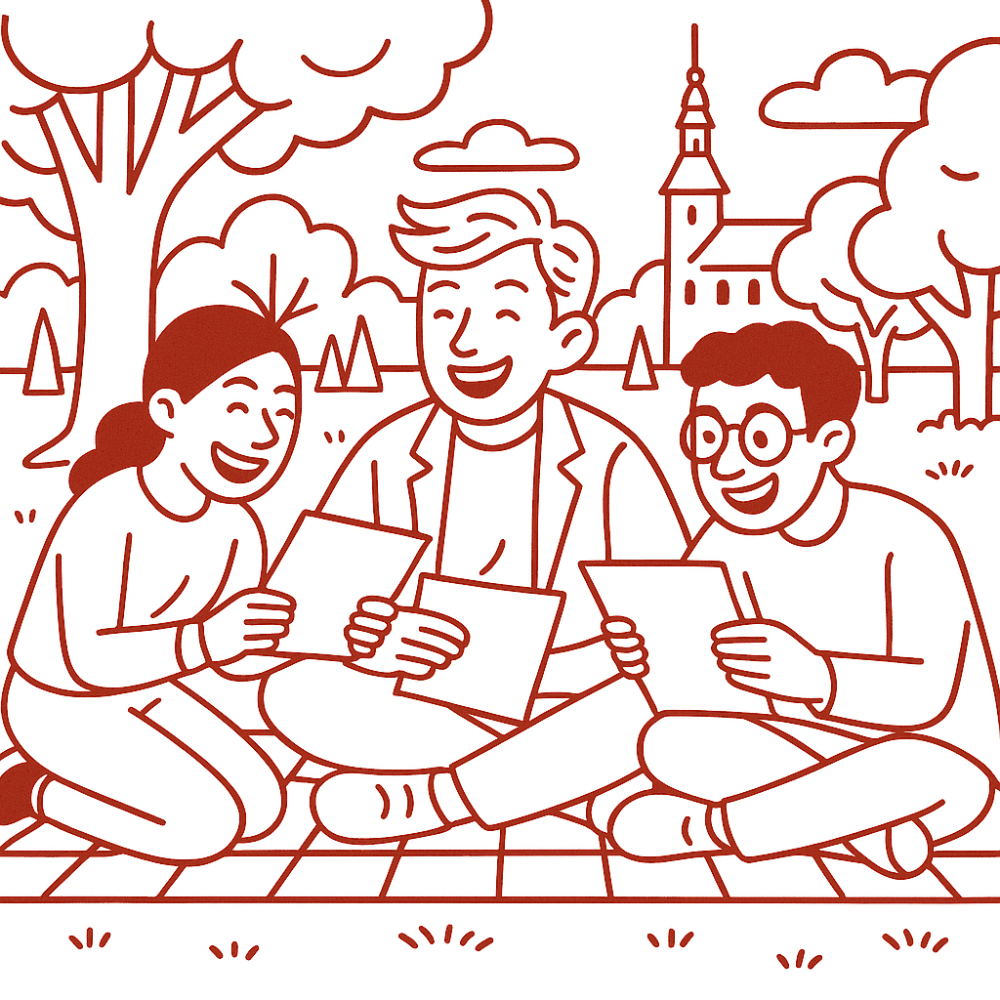

# Prøve i Dansk 3 _Practice Test 5_

  

## Outline

- Læseforståelse (90 minutter)
  - Delprøve 1
  - Delprøve 2A
  - Delprøve 2B
  - Delprøve 3
- Skriftlig fremstilling (2,5 timer)
- Mundtlig kommunikation (20 minutter)

  Help Den Frie Prøvebank

_This practice test was generated by Den Frie Prøvebank and is unofficial. Den Frie Prøvebank's ability to validate how well its tests match the official tests, in terms of content and structure, is limited. Users should seek guidance from official teaching institutions as to the structure and content of the exams in question._

## Læseforståelse

### Delprøve 1: Informerende tekster (25 minutter)

Læs tekstsamlingen nedenfor. Der er fire korte, informerende tekster (A–D). Efter tekstsamlingen finder du 15 spørgsmål til teksterne. Skriv dine svar kort og præcist. Du må gerne bruge stikord. Ingen hjælpemidler er tilladt.

#### Tekst A – Den nye letbane i Odense

Odense Kommune har igangsat en ny letbane, som skal forbinde bydelene Tarup og Munkebo. Den nye strækning bliver 12 kilometer lang og får 15 stoppesteder, hvoraf flere ligger ved uddannelsesinstitutioner og boligområder. Projektet har et budget på 1,3 milliarder kroner og forventes afsluttet og taget i brug i oktober 2025. Ifølge kommunens beregninger vil omkring 35 000 passagerer benytte den nye letbane dagligt, når den åbner. Under anlægsarbejdet vil der være omkørsel i flere bydele, og borgere opfordres til at følge skiltene.

#### Tekst B – Frivilligt arbejde i sundhedssektoren

I Danmark udfører mange mennesker frivilligt arbejde inden for sundhedssektoren. Ifølge Center for Frivilligt Socialt Arbejde er cirka 1,5 million danskere engageret i frivillige aktiviteter, hvilket svarer til omkring 35 procent af befolkningen. De frivillige bruger i gennemsnit tre timer om ugen på aktiviteter som besøgstjenester, støtte til pårørende og hjælp ved hospitalernes caféer. Formålet er at skabe nærvær og aflaste personalet, men også at give de frivillige en følelse af fællesskab. Organisationerne tilbyder kurser, så alle kan blive klædt på til opgaven.

#### Tekst C – Kampen mod madspild i supermarkeder

Danskernes fokus på at reducere madspild er de seneste år blevet styrket. Hvert år smides omkring 700 000 ton spiselige fødevarer ud i Danmark, men siden 2018 er mængden faldet med 12 procent. Flere supermarkedskæder tilbyder nu rabatter på 20 til 50 procent på varer med kort holdbarhed, og appen Too Good To Go gør det muligt at købe overskudsvarer fra restauranter og butikker til en lav pris. En undersøgelse fra 2023 viser, at 25 procent af husholdningerne regelmæssigt bruger sådanne apps, og at initiativerne tilsammen har reddet over 6 millioner måltider. For at øge bevidstheden kører organisationen Stop Spild Af Mad kampagner i skoler og på sociale medier.

#### Tekst D – Digital lægekonsultation

Digitalisering har også ramt sundhedsvæsenet. Siden 2019 er det blevet mere almindeligt med digitale lægekonsultationer via video eller sikre beskeder. I 2023 blev der gennemført omkring 1 million e‑konsultationer, og 15 procent af befolkningen har ifølge Sundhedsdatastyrelsen brugt en digital lægeplatform. Fordelen er, at man kan få råd uden at forlade hjemmet, men ældre borgere kan opleve, at teknologien er svær. Regionerne tilbyder derfor kurser på biblioteker og borgerservicecentre, hvor man kan få hjælp til at oprette sig og booke tider. I 2025 lanceres en samlet e‑sundhedsløsning, som skal samle journaler, medicinbestilling og konsultation på én platform.

#### Spørgsmål til tekstsamlingen:

1. Hvor lang bliver den nye letbane i Odense?  

2. Hvornår forventes letbanen at åbne?  

3. Hvad er budgettet for projektet?  

4. Hvor mange passagerer forventes at bruge den dagligt?  

5. Hvilke bydele forbinder den nye letbane?  

6. Hvor mange danskere udfører frivilligt arbejde ifølge Center for Frivilligt Socialt Arbejde?  

7. Hvilken procentdel af befolkningen svarer det til?  

8. Hvor lang tid bruger de frivillige i gennemsnit hver uge?  

9. Hvad er formålet med det frivillige arbejde?  

10. Hvor mange ton spiselige fødevarer spildes årligt i Danmark?  

11. Hvilken rabat tilbyder supermarkeder på varer med kort holdbarhed?  

12. Hvor stor en andel af husholdningerne bruger apps som Too Good To Go?  

13. Hvor mange e‑konsultationer blev gennemført i 2023?  

14. Hvor stor en del af befolkningen har brugt digitale lægeplatforme?  

15. Hvilket tiltag skal hjælpe ældre med digitale konsultationer?  

### Delprøve 2A (Del af 65 minutter samlet for 2A, 2B og 3)

Læs nedenstående tekst. Besvar derefter spørgsmålene ved at vælge det rigtige svar (1, 2 eller 3). Spørgsmålene står i kronologisk orden i forhold til teksten.

#### Tekst – Fire dages arbejdsuge

De seneste år har flere danske virksomheder eksperimenteret med en fire dages arbejdsuge. Ideen er, at medarbejderne arbejder færre dage, men med fuld løn, mod at de til gengæld er mere produktive og motiverede. Erfaringer fra et pilotprojekt i 2023 viser, at sygefraværet faldt med 20 procent, og at medarbejdernes tilfredshed steg markant. Direktøren for et IT‑firma i Aalborg fortæller, at både kunder og omsætning er fastholdt på trods af den kortere arbejdsuge.

Flere medarbejdere fremhæver, at de ekstra fridage giver tid til familie, fritidsinteresser og restitution. En far til to små børn siger i en artikel i Politiken, at han for første gang føler, at han kan nå alt det, der gør ham glad. Undersøgelser fra Arbejderbevægelsens Erhvervsråd peger dog på, at modellen ikke passer til alle brancher. I nogle produktionsvirksomheder har man været nødt til at ansætte ekstra personale for at dække vagter, hvilket øger omkostningerne.

Kritikere mener også, at en fire dages uge kan skabe stress, fordi arbejdsopgaverne skal løses på kortere tid. De advarer mod en “intensiv arbejdstid”, hvor medarbejderne løber hurtigere og ikke holder pauser. Derudover påpeger nogle eksperter, at fleksibilitet – snarere end et fast antal arbejdsdage – er det, der i fremtiden vil tiltrække og fastholde dygtige medarbejdere.

Alligevel fortsætter flere kommuner og virksomheder med at afprøve modellen. Både eksperter og fagforeninger efterlyser mere forskning, før der træffes beslutninger på nationalt plan. Indtil da må det være op til den enkelte arbejdsplads at finde den balance, der giver mening for medarbejderne.

#### Spørgsmål til teksten:

_Sæt en cirkel om det rigtige svar._

1. Hvad viste pilotprojektet fra 2023?
<ul class="multiple-choice-answers">
  <li>1. At sygefraværet steg og omsætningen faldt.</li>
  <li>2. At medarbejdernes tilfredshed steg, og sygefraværet faldt.</li>
  <li>3. At kunderne mistede tilliden til virksomhederne.</li>
</ul>

2. Hvilken bekymring fremhæver kritikere?
<ul class="multiple-choice-answers">
  <li>1. At fire dages ugen kan gøre arbejdstiden mere intens og stressende.</li>
  <li>2. At medarbejderne får for meget fritid og keder sig.</li>
  <li>3. At virksomhederne bliver nødt til at øge antallet af møder.</li>
</ul>

3. Hvad peger eksperter på som vigtigt for fremtidens arbejdsmarked?
<ul class="multiple-choice-answers">
  <li>1. At alle skal arbejde præcis 30 timer om ugen.</li>
  <li>2. At fleksibilitet er vigtigere end et bestemt antal arbejdsdage.</li>
  <li>3. At man altid arbejder hjemmefra.</li>
</ul>

### Delprøve 2B (Del af 65 minutter samlet for 2A, 2B og 3)

#### Tekst med fjernede afsnit: Grønne ferievaner

_Sæt bogstavet for den rigtige sætning i hvert felt._

**Indledning**

I de senere år er “grønne ferievaner” gået fra at være et nichefænomen til noget, mange rejsende tager alvorligt. Flere danskere overvejer nu, hvordan deres ferievalg påvirker miljøet og lokalbefolkningen. Men hvad indebærer bæredygtig turisme, og hvordan kan man træffe valg, der gør en forskel?

**(1)** ________

Valget af transportmiddel er centralt. Mange rejsende overvejer nu at tage toget eller bussen, selv om rejsetiden bliver længere.

**(2)** ________

Når man når frem, betyder det også noget, hvor og hvordan man bor. Nogle foretrækker camping eller leje gennem lokale portaler, mens andre vælger hoteller med miljømærker.

**(3)** ________

Prisen spiller dog ind. Bæredygtige løsninger kan være dyrere, og derfor søger nogle efter alternativer, der passer til budgettet.

**(4)** ________

Der er også udfordringer. Ikke alle har råd til at rejse grønt, og nogle virksomheder bruger ord som “grøn” og “klimavenlig” uden at have dokumentation. Det skaber risiko for greenwashing.

**(5)** ________

Afslutningsvis handler bæredygtige ferievaner ikke om at være perfekt. Små ændringer i vaner kan allerede gøre en forskel og inspirere andre til at følge efter.

#### Fjernede afsnit (vælg det rigtige for hver position):

_Bemærk at to afsnit skal ikke bruges._

<ul class="multiple-choice-answers">
  <li>Forskere peger på, at korte flyrejser udleder mere per passager end togrejser, og at en tur til Sydeuropa kan have samme klimaaftryk som et års pendling i bil.</li>
  <li>Flere rejsebureauer tilbyder nu pakkerejser, hvor transport foregår med tog, og hvor måltiderne er baseret på lokale råvarer.</li>
  <li>Mange rejsende ønsker at se de mest berømte seværdigheder, men overser ofte mindre besøgte områder, der kan give dybere kulturmøder.</li>
  <li>Et stigende antal hoteller har miljømærker, der stiller krav om vandbesparelse, affaldssortering og brug af vedvarende energi.</li>
  <li>Selvom bæredygtige valg nogle gange er dyrere, viser undersøgelser, at rejsende er villige til at betale lidt mere for at mindske deres negative påvirkning.</li>
  <li>Det er blevet populært at tage selfies på toppen af bjerge, men mange glemmer at tjekke vejret først, hvilket kan være farligt.</li>
  <li>Hvis man pakker let og undgår engangsprodukter, reducerer man både bagagevægt og affald på destinationen.</li>
</ul>

### Delprøve 3 (Del af 65 minutter samlet for 2A, 2B og 3)

Læs følgende tekst. I teksten er otte ord eller udtryk fjernet og markeret med (1)–(8). Til hvert markeret sted er der fire svarmuligheder (A–D). Sæt ét kryds pr. spørgsmål. Der er kun ét korrekt svar.

#### Tekst: Sunde vaner og motion

De seneste år har der været stor fokus på daglig motion og sunde vaner blandt danskerne. Flere arbejdspladser tilbyder gratis træning eller organiserer fælles løbeture. Forskning viser, at regelmæssig _(1)_ ______ aktivitet ikke kun styrker kroppen, men også kan forbedre koncentrationen og reducere stress.

For at få motion ind i en travl hverdag kan små ændringer gøre en stor forskel. Mange vælger at cykle til arbejde eller stå af bussen nogle _(2)_ ______ før. Andre sætter en alarm som påmindelse om at lave _(3)_ ______ øvelser ved skrivebordet. Det er vigtigt, at man finder aktiviteter, der er _(4)_ ______ og passer til ens niveau, så man undgår skader og fastholder motivationen.

Sundhedseksperter anbefaler også at kombinere motion med gode kostvaner. Det betyder blandt andet, at man spiser varieret og får _(5)_ ______ nok søvn. En _(6)_ ______ balance mellem arbejde, fritid og hvile kan være afgørende for at føle sig godt tilpas. Mens nogle foretrækker at _(7)_ ______ sig selv med højintensiv træning, trives andre bedre med yoga eller lange gåture i naturen. Uanset hvad handler det om at finde en _(8)_ ______ rytme, der gør motion til en naturlig del af livet.

##### Valgmuligheder:

<table class="horizontal-multiple-choice">
  <tbody>
    <tr>
      <td><strong>1</strong></td>
      <td><strong>a.</strong> fysisk</td>
      <td><strong>b.</strong> juridisk</td>
      <td><strong>c.</strong> teknisk</td>
      <td><strong>d.</strong> økonomisk</td>
    </tr>
    <tr>
      <td><strong>2</strong></td>
      <td><strong>a.</strong> stationer</td>
      <td><strong>b.</strong> minutter</td>
      <td><strong>c.</strong> byer</td>
      <td><strong>d.</strong> dage</td>
    </tr>
    <tr>
      <td><strong>3</strong></td>
      <td><strong>a.</strong> dyre</td>
      <td><strong>b.</strong> lette</td>
      <td><strong>c.</strong> farlige</td>
      <td><strong>d.</strong> vanskelige</td>
    </tr>
    <tr>
      <td><strong>4</strong></td>
      <td><strong>a.</strong> tilfældige</td>
      <td><strong>b.</strong> tilpassede</td>
      <td><strong>c.</strong> forkerte</td>
      <td><strong>d.</strong> pludselige</td>
    </tr>
    <tr>
      <td><strong>5</strong></td>
      <td><strong>a.</strong> tilstrækkelig</td>
      <td><strong>b.</strong> økonomisk</td>
      <td><strong>c.</strong> festlig</td>
      <td><strong>d.</strong> ulovlig</td>
    </tr>
    <tr>
      <td><strong>6</strong></td>
      <td><strong>a.</strong> sund</td>
      <td><strong>b.</strong> midlertidig</td>
      <td><strong>c.</strong> kritisk</td>
      <td><strong>d.</strong> hård</td>
    </tr>
    <tr>
      <td><strong>7</strong></td>
      <td><strong>a.</strong> presse</td>
      <td><strong>b.</strong> kede</td>
      <td><strong>c.</strong> gemme</td>
      <td><strong>d.</strong> miste</td>
    </tr>
    <tr>
      <td><strong>8</strong></td>
      <td><strong>a.</strong> regelmæssig</td>
      <td><strong>b.</strong> rodet</td>
      <td><strong>c.</strong> spontan</td>
      <td><strong>d.</strong> besværlig</td>
    </tr>
  </tbody>
</table>

## Skriftlig fremstilling (2,5 timer)

_Alle ordbøger er tilladt._

### Delprøve 1: Uformel e-mail

Du har fået en e-mail fra din ven **Anna**, som skriver:

> **Hej!**
>
> Jeg håber, du har det godt. Jeg har netop besluttet mig for at begynde at studere igen ved siden af mit fuldtidsjob, og jeg er lidt nervøs for, hvordan jeg skal få det hele til at hænge sammen. Har du nogensinde prøvet at tage en uddannelse, mens du arbejdede? Og hvordan organiserer du din tid, så du både kan arbejde, lære og stadig have et socialt liv?  
>
> **Mange hilsner, Anna**

Skriv en e-mail til Anna, hvor du svarer på hendes spørgsmål. Husk at:

- skrive en personlig mail,
- fortælle om dine egne erfaringer,
- beskrive og forklare, hvordan du håndterer lignende situationer,
- stille et eller to spørgsmål til Anna om hendes nye liv og studier.

Din tekst skal være på **mindst 200 ord**.

_Brug disse sider til at skrive din skriftlige opgave._

### Delprøve 2: Opgave om alment og samfundsmæssigt emne

Vælg **enten opgave A** eller **opgave B**. Din tekst skal være på **mindst 200 ord**. Brug de tre punkter under den valgte opgave som udgangspunkt for din besvarelse. Du skal ikke skrive om den opgave, du ikke vælger.

#### Opgave A – Kunstig intelligens i hverdagen

Kunstig intelligens (AI) bliver stadig mere synlig i hverdagen. Det debatteres, om det er en hjælp eller en udfordring.

- Beskriv, hvad undersøgelser viser om danskernes brug af AI i hverdagen.
- Fortæl om mulige årsager til, at AI‑teknologier bliver mere udbredte.
- Diskuter fordele og ulemper ved AI (fx effektivitet, privatliv, arbejdspladser).

#### Opgave B – At rejse i Danmark eller i udlandet

Nogle mennesker holder ferie i Danmark, mens andre foretrækker at rejse til udlandet.

- Fortæl om dine egne erfaringer med at holde ferie i Danmark eller i udlandet.
- Kommentér følgende to udsagn:  
  1. “En ferie i Danmark giver den bedste forståelse for landets kultur.”  
  2. “Rejser til udlandet udvider ens horisonter mere end noget andet.”
- Diskuter fordele og ulemper ved at holde ferie hjemme i landet versus at tage til udlandet (fx klima, økonomi, oplevelser, bæredygtighed).

_Brug disse sider til at skrive din skriftlige opgave._

## Mundtlig kommunikation (20 minutter inkl. votering)

Prøven består af to dele og varer i alt ca. 10 minutter. Der er ingen hjælpemidler.

### Delprøve 1: Forberedt præsentation

En uge før mundtlig eksamen får du udleveret et emne fra dit sprogcenter. Til eksamen skal du:

1. Holde en **præsentation på cirka 2 minutter** om emnet. Emnet handler om en samfundsmæssig problematik. Du skal organisere din præsentation og gøre den sammenhængende.
2. Besvare opklarende spørgsmål fra eksaminator. Eksaminator vil bede dig om at forklare, uddybe og begrunde dine synspunkter samt tage stilling til aspekter, der knytter sig til emnet.

Eksempler på emner kan være:

- **Fremtidens arbejdsmarked** – Hvilke kompetencer bliver efterspurgte, når teknologi ændrer job?
- **Byudvikling og grønne områder** – Hvordan kan man skabe plads til både boliger og natur i byerne?

### Delprøve 2: Uforberedt samtale

Du trækker et emne blandt tre mulige lige inden delprøven. Emnet handler om en samfundsmæssig problematik, som du ikke kender på forhånd. Du skal:

1. Lytte opmærksomt til eksaminators første spørgsmål, som handler om et konkret aspekt af emnet. Svar så præcist som muligt, og uddyb dit svar, når eksaminator spørger ind.
2. Besvare eksaminators andet spørgsmål, som er mere overordnet, og forklare eller begrunde dine synspunkter. Der kan også komme opfølgende spørgsmål, hvor du skal uddybe dine svar.

Mulige emner til lodtrækningen kunne være:

- **Unges mentale helbred** – Hvorfor stiger antallet af unge med stress og angst?
- **Delingsøkonomi** – Hvordan påvirker platformsøkonomi måden, vi arbejder og forbruger på?
- **Elbiler og transport** – Hvordan kan vi gøre transportsektoren grønnere, og hvad betyder det for samfundet?

---

_This practice test was generated by Den Frie Prøvebank and is unofficial. Den Frie Prøvebank's ability to validate how well its tests match the official tests, in terms of content and structure, is limited. Users should seek guidance from official teaching institutions as to the structure and content of the exams in question._
