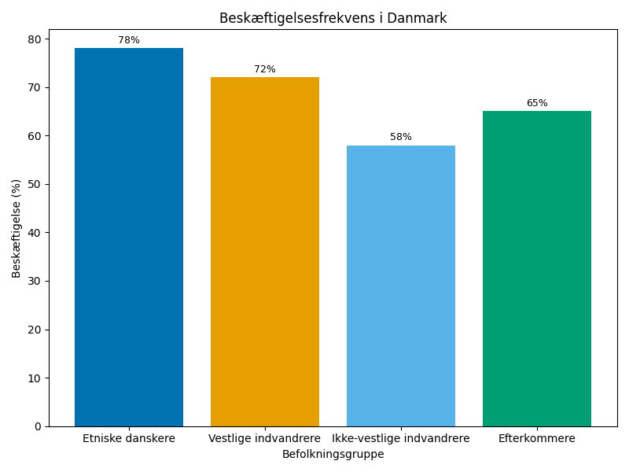
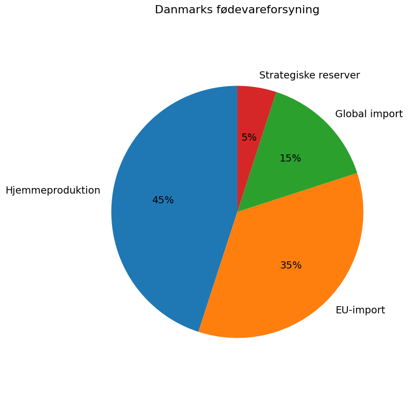
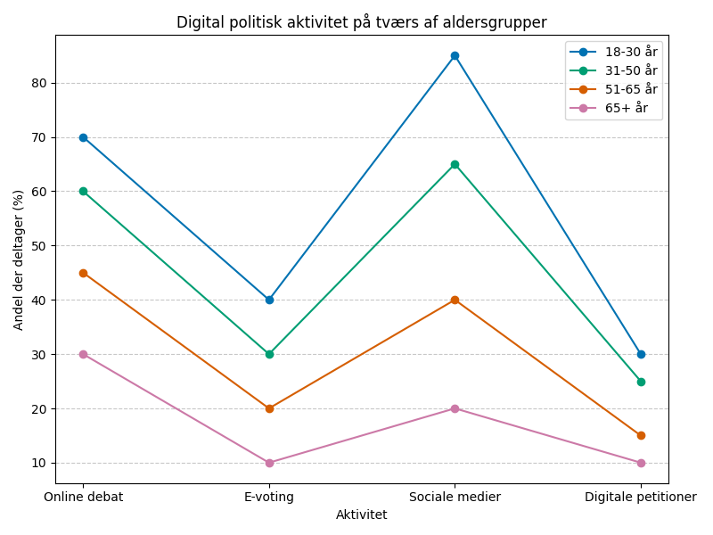

# Studieprøven _Practice Test 10_

  

## Outline

- Læseforståelse (90 minutter)
  - Delprøve 1
  - Delprøve 2A
  - Delprøve 2B
  - Delprøve 3
- Skriftlig fremstilling (3 timer)
- Mundtlig kommunikation (30 minutter)

  Help Den Frie Prøvebank

_This practice test was generated by Den Frie Prøvebank and is unofficial. Den Frie Prøvebank's ability to validate how well its tests match the official tests, in terms of content and structure, is limited. Users should seek guidance from official teaching institutions as to the structure and content of the exams in question._

## Læseforståelse

### Delprøve 1 (25 minutter)
**Ingen hjælpemidler tilladt**

#### Tekstsamling: Integration og mangfoldighed i det danske samfund

**Tekst A: Arbejdsmarkedsintegration**

65 % af indvandrere fra ikke‑vestlige lande er i beskæftigelse efter 7 år i Danmark sammenlignet med 80 % for hele befolkningen. Sprogets betydning viser sig ved, at kun 42 % af indvandrere uden dansk sprogkompetence finder arbejde inden for 3 år. Erhvervsuddannelser med mentorordninger har en succesrate på 78 % for integration. Etnisk entreprenørskab vokser med 15 % årligt og skaber 25.000 arbejdspladser. Diskriminering på arbejdsmarkedet dokumenteres ved, at ansøgere med "danske" navne kaldes til samtale 35 % oftere.

**Tekst B: Uddannelse og sociale forhold**

Børn af indvandrere klarer sig bedre i uddannelsessystemet end tidligere. 28% tager videregående uddannelse sammenlignet med 35% for befolkningen generelt. Uddannelsesmigration fra landsbyer til byer påvirker 55% af unge med indvandrerbaggrund. Frafaldsraten på erhvervsuddannelser er 45% for tosprogede elever mod 32% generelt. Modersmålsundervisning tilbydes på 30 sprog til 18.000 børn årligt. Lektiecaféer og mentorprogrammer når 12.000 børn i udsatte områder.

**Tekst C: Bolig og byudvikling**

Ghettolisten omfatter 13 boligområder med over 50 % ikke‑vestlige beboere og sociale problemer. Boligselskaber skal sprede almene boliger med maksimum 40 % i samme område fra 2030. Parallelsamfund bekæmpes gennem krav om blandet bebyggelse og sociale programmer. Byfornyelse investerer 8 milliarder kroner i problemområder over ti år. Det private boligmarked viser segregeringsmønstre, hvor 62 % af indvandrer koncentreres i bestemte bydele.

**Tekst D: Sprog og kulturel integration**

Dansk som andetsprog undervises til 85.000 voksne årligt gennem sprogcentre. Digitale sprogløsninger anvendes af 45% af kursister med forbedrede læringsresultater. Tosprogede børn udfordres af akademisk dansk selvom de taler hverdagsdansk flydende. Kulturel bevidsthed fokuserer på danske værdier som demokrati, ligestilling og ytringsfrihed. Religiøse organisationer samarbejder med kommuner om integrationsaktiviteter for 15.000 familier.

**Tekst E: Politisk deltagelse og medborgerskab**

Kommunale valgrettigheder for udlændinge efter 3 år bruges af 35% af berettigede. Dansk statsborgerskab søges af 22.000 personer årligt med 85% approval-rate. Borgerinddragelse i lokalområder øges gennem områdeløft og fælles aktiviteter. Politisk repræsentation af minoriteter i kommunalvalg steg til 8% i 2024. NGO'er og foreninger faciliterer demokratisk deltagelse for 30.000 borgere med udenlandsk baggrund årligt.

#### Spørgsmål til tekstsamlingen:

1. Hvor mange procent af indvandrere fra ikke-vestlige lande er i beskæftigelse efter 7 år?

2. Hvor mange procent af indvandrere uden dansk sprogkompetence finder arbejde inden for 3 år?

3. Hvor mange procent succesrate har erhvervsuddannelser med mentorordninger?

4. Med hvor mange procent vokser etnisk entreprenørskab årligt?

5. Hvor mange procent oftere kaldes ansøgere med "danske" navne til samtale?

6. Hvor mange procent af børn af indvandrere tager videregående uddannelse?

7. Hvad er frafaldsprocenten blandt tosprogede elever på erhvervsuddannelser?

8. På hvor mange sprog tilbydes modersmålsundervisning?

9. Hvor mange børn når lektiecaféer og mentorprogrammer i udsatte områder?

10. Hvor mange boligområder omfatter ghettolisten?

11. Hvor stor en andel almene boliger må der maksimalt være i et område fra 2030?

12. Hvor mange milliarder kroner investeres i byfornyelse over ti år?

13. Hvor mange voksne undervises i dansk som andetsprog årligt?

14. Hvor mange procent af kursister anvender digitale sprogløsninger?

15. Hvor mange personer søger dansk statsborgerskab årligt?

### Delprøve 2A (Del af 65 minutter samlet for 2A, 2B og 3)

#### Tekst med fjernede afsnit: Fødevaresikkerhed og globale forsyningskæder

_Sæt bogstavet for den rigtige sætning i hvert felt._

COVID-19-pandemien og Ukraine-krigen har afsløret sårbarheder i de globale fødevareforsyningskæder. Danmark, som mange andre lande, må genoverveje sin afhængighed af internationale markeder og styrke den lokale fødevareproduktion.

**(1)** ________

Danske supermarkeder importerer 75% af deres frugt og grøntsager, hvilket gør forsyningerne sårbare over for transportforstyrrelser og klimaforandringer. Prisstigninger på basale fødevarer rammer især lavindkomstfamilier hårdt.

**(2)** ________

Landbrugsproduktion skal balancere mellem eksport og national forsyningssikkerhed. Danmark eksporterer 70% af sin svineproduktion, mens landet importerer fjerkræ og oksekød. Denne specialisering optimerer effektivitet, men skaber afhængigheder.

**(3)** ________

Klimaforandringer truer global fødevareproduktion gennem tørke, oversvømmelser og ekstreme vejrbegivenheder. Afgrødefejl i store produktionsområder kan skabe internationale fødevarekriser med dramatiske prisstigninger.

**(4)** ________

Teknologiske løsninger som vertikale landbrug og cellekultiveret kød kan revolutionere fødevareproduktionen. Disse teknologier er dog stadig dyre og kræver massive investeringer for at blive kommercielt levedygtige.

**(5)** ________

Politiske beslutninger må balancere mellem fri handel og national sikkerhed. Strategiske fødevarereserver og diversificerede forsyningskæder koster mere på kort sigt, men skaber robusthed mod fremtidige kriser.

#### Fjernede afsnit (vælg det rigtige for hver position):

1. Afsnit 1
<ul class="multiple-choice-answers">
1. Internationale handelskrige og eksportrestriktioner kan skabe kunstig fødevaremangel, selvom der globalt er tilstrækkelig produktion til alle.
2. Geopolitiske spændinger påvirker fødevarehandel betydeligt. Ruslands invasion af Ukraine afbrød korneksport og skabte global fødevarekrise.
3. Energipriser har direkte påvirkning på fødevareproduktion gennem gødning, transport og forarbejdning. Høje energiomkostninger øger fødevarepriserne.
</ul>

2. Afsnit 2
<ul class="multiple-choice-answers">
1. Økologisk landbrug reducerer udbytter, men forbedrer jordkvalitet og biodiversitet. Balancen mellem kvantitet og bæredygtighed bliver kritisk.
2. Lokalproduktion kan styrke fødevaresikkerhed, men reducerer sortiment og øger omkostninger. Forbrugerne må acceptere sæsonvariation og højere priser.
3. Fødevarespild udgør 30% af global produktion og bør prioriteres i bæredygtighedsstrategier. Bedre logistik og forbrugervaner kan øge effektiv udnyttelse.
</ul>

3. Afsnit 3
<ul class="multiple-choice-answers">
1. Internationale organisationer som FAO og WTO arbejder på at koordinere global fødevaresikkerhed, men nationale interesser komplicerer samarbejdet.
2. Ekstreme vejrbegivenheder bliver hyppigere og mere intense. Landbruget må tilpasse sig gennem klimaresistente afgrøder og vandingsteknologi.
3. Pesticid- og antibiotikaresistens truer fremtidig fødevareproduktion. Alternative produktionsmetoder skal udvikles for at opretholde udbytter.
</ul>

4. Afsnit 4
<ul class="multiple-choice-answers">
1. Investering i foodtech‑startups eksploderer, da risikokapital satser på disruptive løsninger til traditionelle landbrugsproblemstillinger.
2. Forskning i genmodificerede afgrøder kan skabe klimaresistente varianter med højere næringsindhold, men møder modstand fra forbrugere og miljøorganisationer.
3. Præcisionslandbrug bruger sensorer, droner og AI til at optimere gødnings- og vandingsforbrug, hvilket øger udbyttet og reducerer miljøpåvirkningen.
</ul>

5. Afsnit 5
<ul class="multiple-choice-answers">
1. Internationale aftaler om fødevaresikkerhed skal styrkes for at forhindre eksportrestriktioner under kriser. Global solidaritet bliver afgørende.
2. Fremtiden kræver hybride løsninger, der kombinerer global effektivitet med lokal robusthed. Ingen lande kan være fuldstændig selvforsynende.
3. Forbrugervaner må ændres mod mindre ressourcekrævende diæter. Reduceret kødkonsumption kan frigøre landbrugsjord til direkte human fødevareproduktion.
</ul>

### Delprøve 2B (Del af 65 minutter samlet for 2A, 2B og 3)

#### Tekst: Digitalisering af det offentlige Danmark

Danmark er foregangsland inden for digitalisering af offentlige services. Borgere og virksomheder kan tilgå langt de fleste offentlige ydelser online, hvilket har øget effektiviteten og reduceret omkostningerne betydeligt.

NemID og nu MitID har revolutioneret digital identifikation. Over 99% af danske borgere har digital signatur, hvilket gør Danmark til verdensførende på dette område. Borger.dk samler alle offentlige services ét sted, og borgerne kan håndtere alt fra skatteindberetning til sygesikring online.

Digitale løsninger har moderniseret sundhedsvæsenet. Elektroniske patientjournaler giver læger øjeblikkelig adgang til patientdata på tværs af hospitaler og praksis. Telemedicin eksploderede under COVID-19 og fortsætter med at vokse. Borgere kan booke lægetider, se prøvesvar og kommunikere med sundhedspersonale gennem apps.

Automatisering har transformeret sagsbehandling. Rutineopgaver som udbetaling af dagpenge og børnepenge håndteres nu automatisk uden human indgriben. Dette frigør ressourcer til mere komplekse opgaver og reducerer ventetider betydeligt.

Udfordringer opstår med digital eksklusion. Ældre borgere og sårbare grupper kan have svært ved at navigere i digitale systemer. Sprog og tekniske færdigheder bliver barrierer for lige adgang til offentlige services. Biblioteker og borgerservice-centre fungerer som hjælpestationer.

Cybersikkerhed bliver en kritisk udfordring. Offentlige IT-systemer er attraktive mål for hackere og fremmede magter. Persondata og kritisk infrastruktur skal beskyttes mod sofistikerede angreb. Backup-systemer og beredskabsplaner bliver vitale.

EU's regulering påvirker dansk digitalisering betydeligt. GDPR, Digital Services Act og andre direktiver sætter rammer for databehandling og teknologibrug. Balance mellem innovation og beskyttelse kræver konstant justering af politikker.

Kunstig intelligens introduceres gradvist i offentlig administration. Chatbots besvarer borgerhenvendelser, mens algoritmer hjælper med sagsbehandling. Transparens og algoritmisk bias bliver vigtige diskussioner for demokratisk legitimitet.

#### Spørgsmål til teksten:

_Sæt en cirkel om det rigtige svar._

1. Hvor stor en andel af danske borgere har digital signatur ifølge teksten?
<ul class="multiple-choice-answers">
1. Omkring 85% af borgerne
2. Over 99% af borgerne
3. Cirka 75% af borgerne
</ul>

2. Hvilke områder nævnes som eksempler på sundhedsvæsenets digitalisering?
<ul class="multiple-choice-answers">
1. Kun elektroniske patientjournaler
2. Elektroniske patientjournaler, telemedicin og apps til kommunikation
3. Primært telemedicin og online booking
</ul>

3. Hvad karakteriserer automatiseringen af sagsbehandling?
<ul class="multiple-choice-answers">
1. Den er begrænset til simple opgaver uden praktisk betydning
2. Rutineopgaver håndteres automatisk og frigør ressourcer til komplekse opgaver
3. Den erstatter alle menneskelige medarbejdere i det offentlige
</ul>

4. Hvilke grupper identificeres som udfordrede af digital eksklusion?
<ul class="multiple-choice-answers">
1. Primært unge borgere uden teknisk erfaring
2. Ældre borgere og sårbare grupper med sprog- og tekniske barrierer
3. Kun borgere uden internetadgang
</ul>

5. Hvilke teknologier introduceres gradvist i offentlig administration?
<ul class="multiple-choice-answers">
1. Udelukkende traditionelle IT-systemer
2. Kunstig intelligens inklusive chatbots og algoritmer til sagsbehandling
3. Kun manuelle processer og papirbaseret administration
</ul>

### Delprøve 3 (Del af 65 minutter samlet for 2A, 2B og 3)

#### Tekst med fjernede ord: Turisme og bæredygtig udvikling i Danmark

Danmarks turismesektor __(1)__ ______ for 4% af BNP og beskæftiger 180.000 personer, men væksten skaber __(2)__ ______ for miljø og lokalsamfund. Overtourisme i København og populære destinationer __(3)__ ______ infrastrukturen og påvirker borgernes hverdag.

Internationale turister __(4)__ ______ primært fra Tyskland, Sverige og Norge, men fjernmarkeder som USA og Asien vokser hurtigt. Flytrafikken __(5)__ ______ turismens CO2-aftryk betydeligt og konflikter med klimamålsætninger.

Cruise-turisme __(6)__ ______ kontroversielle miljøpåvirkninger i københavnske havneområder. Store skibe udleder __(7)__ ______ og belaster afløbssystemer, mens passagererne kun opholder sig kortvarigt.

Naturbaseret turisme __(8)__ ______ muligheder for bæredygtig indtjening i rurale områder. Nationalparker og __(9)__ ______ attraktioner kan styrke lokaløkonomier, men kræver balancering med naturbeskyttelse.

Digitalisering __(10)__ ______ turismebranchens markedsføring og bookingsystemer. Online platforme og apps forbedrer turistoplevelser, men koncentrerer også magt hos internationale tech-giganter.

#### Valgmuligheder:

<table class="horizontal-multiple-choice">
  <tbody>
    <tr>
      <td><strong>1</strong></td>
      <td><strong>a.</strong> betaler</td>
      <td><strong>b.</strong> står</td>
      <td><strong>c.</strong> koster</td>
      <td><strong>d.</strong> udgør</td>
    </tr>
    <tr>
      <td><strong>2</strong></td>
      <td><strong>a.</strong> muligheder</td>
      <td><strong>b.</strong> fordele</td>
      <td><strong>c.</strong> udfordringer</td>
      <td><strong>d.</strong> gevinster</td>
    </tr>
    <tr>
      <td><strong>3</strong></td>
      <td><strong>a.</strong> styrker</td>
      <td><strong>b.</strong> belaster</td>
      <td><strong>c.</strong> forbedrer</td>
      <td><strong>d.</strong> udvikler</td>
    </tr>
    <tr>
      <td><strong>4</strong></td>
      <td><strong>a.</strong> kommer</td>
      <td><strong>b.</strong> rejser</td>
      <td><strong>c.</strong> flytter</td>
      <td><strong>d.</strong> arbejder</td>
    </tr>
    <tr>
      <td><strong>5</strong></td>
      <td><strong>a.</strong> reducerer</td>
      <td><strong>b.</strong> øger</td>
      <td><strong>c.</strong> eliminerer</td>
      <td><strong>d.</strong> stabiliserer</td>
    </tr>
    <tr>
      <td><strong>6</strong></td>
      <td><strong>a.</strong> løser</td>
      <td><strong>b.</strong> undgår</td>
      <td><strong>c.</strong> skaber</td>
      <td><strong>d.</strong> forhindrer</td>
    </tr>
    <tr>
      <td><strong>7</strong></td>
      <td><strong>a.</strong> renere luft</td>
      <td><strong>b.</strong> forurening</td>
      <td><strong>c.</strong> energi</td>
      <td><strong>d.</strong> lyd</td>
    </tr>
    <tr>
      <td><strong>8</strong></td>
      <td><strong>a.</strong> eliminerer</td>
      <td><strong>b.</strong> begrænser</td>
      <td><strong>c.</strong> tilbyder</td>
      <td><strong>d.</strong> forhindrer</td>
    </tr>
    <tr>
      <td><strong>9</strong></td>
      <td><strong>a.</strong> kunstige</td>
      <td><strong>b.</strong> moderne</td>
      <td><strong>c.</strong> naturlige</td>
      <td><strong>d.</strong> teknologiske</td>
    </tr>
    <tr>
      <td><strong>10</strong></td>
      <td><strong>a.</strong> begrænser</td>
      <td><strong>b.</strong> forhindrer</td>
      <td><strong>c.</strong> forværrer</td>
      <td><strong>d.</strong> transformerer</td>
    </tr>
  </tbody>
</table>

## Skriftlig fremstilling (3 timer)
**Alle ordbøger er tilladt**

### Vælg én af følgende tre opgaver:

#### Opgave 1: Integration og arbejdsmarkedet

**Grafik:** 

**Manchet:** Trods målrettede indsatser eksisterer der fortsat betydelige forskelle i beskæftigelse mellem forskellige befolkningsgrupper. Dette skaber både økonomiske udfordringer og sociale spændinger i det danske samfund.

**Opgave:** Skriv en sammenhængende tekst på minimum 400 ord, hvor du:
- Analyserer beskæftigelsesforskellene vist i grafikken
- Diskuterer årsager til variationerne mellem grupperne
- Vurderer konsekvenserne for samfundet og de berørte grupper
- Foreslår konkrete tiltag til at forbedre arbejdsmarkedsintegration

#### Opgave 2: Fødevaresikkerhed og selvforsyning

**Grafik:** 

**Manchet:** Globale kriser har afsløret sårbarheder i fødevareforsyningskæder. Danmark overvejer at styrke selvforsyning og reducere afhængigheden af internationale markeder, men dette rejser spørgsmål om omkostninger og effektivitet.

**Opgave:** Skriv en sammenhængende tekst på minimum 400 ord, hvor du:
- Præsenterer Danmarks fødevareforsyningssituation fra grafikken
- Analyserer fordele og ulemper ved øget selvforsyning
- Diskuterer sikkerhedsmæssige og økonomiske aspekter
- Argumenterer for en optimal balance mellem import og hjemmeproduktion

#### Opgave 3: Digital deltagelse og demokrati

**Grafik:** 

**Manchet:** Politisk deltagelse flytter i stigende grad online, men dette skaber nye former for ulighed og udfordringer for demokratisk legitimitet. Ikke alle borgere har samme adgang til eller færdigheder i digital politisk kommunikation.

**Opgave:** Skriv en sammenhængende tekst på minimum 400 ord, hvor du:
- Redegør for mønstrene i digital politisk deltagelse fra grafikken
- Analyserer fordele og risici ved digitalisering af demokratiet
- Diskuterer digital eksklusion og demokratisk lighed
- Vurderer fremtidens demokratiske processer i den digitale tidsalder

_Brug disse sider til at skrive din skriftlige opgave._

## Mundtlig kommunikation (30 minutter inkl. votering)

### Opgaveark med tre emner til forberedelse:

#### Emne 1: Mangfoldighed og national sammenhørighed

**Stikord til inspiration:**
- Kulturel integration og bevarelse af traditioner
- Sprogpolitik og flersprogethed
- Religiøs diversitet og sekulære værdier
- Identitetspolitik og fælles værdier
- Generationskonflikter og tilpasning
- Medierepræsentation og stereotyper
- Uddannelse og kulturel forståelse
- International migration og lokale samfund

#### Emne 2: Bæredygtig turisme og lokalsamfund

**Stikord til inspiration:**
- Overtourisme og miljøpåvirkning
- Økonomiske gevinster versus sociale omkostninger
- Infrastruktur og kapacitetsbegrænsninger
- Naturbeskyttelse og adgang
- Kulturbevarelse og kommercialisering
- Transport og CO2-aftryk
- Digitale platforme og markedsmagt
- Regulering og bæredygtighedscertificering

#### Emne 3: Teknologi og social lighed

**Stikord til inspiration:**
- Digital kløft og adgang til teknologi
- Automatisering og jobfordeling
- Online-uddannelse og læringsudenhed
- Privatliv og overvågning
- Algoritmisk bias og diskrimination
- Tech-giganter og markedsmagt
- Innovation og inklusion
- Fremtidens arbejdsmarked og færdigheder

### Prøveforløb:

1. **Lodtrækning:** Vælg ét af de tre forberedte emner
2. **Præsentation (5 minutter):** Struktureret gennemgang af det valgte emne
3. **Interview (15 minutter):** Uddybende samtale med eksaminator baseret på præsentationen
4. **Votering og karaktergivning (10 minutter)**

### Bedømmelseskriterier:

- **Sproglig korrekthed:** Grammatik, ordforråd og udtale
- **Kommunikativ kompetence:** Evne til at formidle budskaber klart
- **Indholdsrigdom:** Faglig dybde og nuanceret forståelse
- **Struktur:** Logisk opbygning og sammenhæng
- **Interaktion:** Evne til dialog og respons på spørgsmål

---

_This practice test was generated by Den Frie Prøvebank and is unofficial. Den Frie Prøvebank's ability to validate how well its tests match the official tests, in terms of content and structure, is limited. Users should seek guidance from official teaching institutions as to the structure and content of the exams in question._
