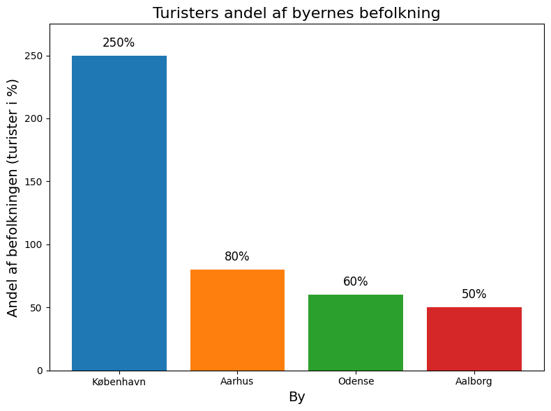
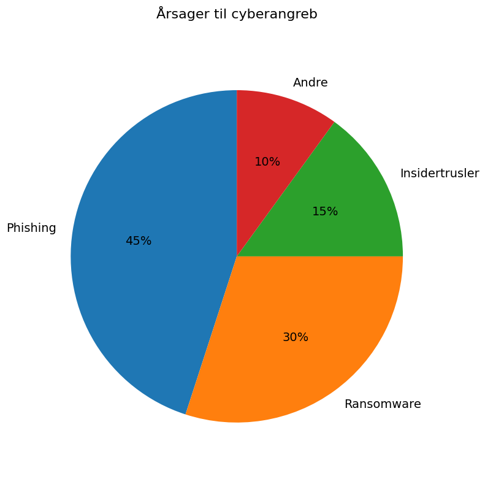

# Studieprøven _Practice Test 11_

  

## Outline

- Læseforståelse (90 minutter)
  - Delprøve 1
  - Delprøve 2A
  - Delprøve 2B
  - Delprøve 3
- Skriftlig fremstilling (3 timer)
- Mundtlig kommunikation (30 minutter)

  Help Den Frie Prøvebank

_This practice test was generated by Den Frie Prøvebank and is unofficial. Den Frie Prøvebank's ability to validate how well its tests match the official tests, in terms of content and structure, is limited. Users should seek guidance from official teaching institutions as to the structure and content of the exams in question._

## Læseforståelse

### Delprøve 1 (25 minutter)
**Ingen hjælpemidler tilladt**

#### Tekstsamling: Turisme og oplevelsesøkonomi i Danmark

**Tekst A: København som turistmagnet**

København har oplevet en turistboom med 12,8 millioner besøgende i 2024 – en stigning på 40 % over fem år. Hotelpriserne er steget med 45 %, og byen har nu 25.000 Airbnb‑udlejninger. Lufthavnens passagertal nåede 30 millioner om året, mens rundtur på kanalerne har øget antallet af bådture til 3 millioner. Transportpresset gør, at 68 % af københavnerne ønsker regulering af turismen.

**Tekst B: Naturturisme og nationalparker**

Vadehavet modtager 2,3 millioner besøgende om året. Nationalpark Mols Bjerge har 350.000 gæster, mens vandreture på Gendarmstien er steget med 120 % på tre år. 65 % af de besøgende rejser med egen bil, men regeringens plan er at øge offentlig transport til nationalparker. Naturturismen genererer 4 milliarder kroner i indtægter og 6.000 arbejdspladser.

**Tekst C: Kulturturisme og museer**

Den Lille Havfrue tiltrækker 1,8 millioner turister årligt. Louisiana Museum har 750.000 besøgende, mens ARoS i Aarhus har 600.000. Kronborg Slot og Frederiksborg Slot har tilsammen 900.000 besøgende. Kulturturisme udgør 12 % af den samlede turistomsætning, men entréindtægter dækker kun 20 % af museernes udgifter. 75 % af museernes indtjening kommer fra caféer, butikker og donationer.

**Tekst D: Forretningsrejser og konferencer**

Bella Centeret huser 400 konferencer årligt, herunder 10 internationale kongresser. Gennemsnitsforbruget per forretningsrejsende er 5.800 kroner om dagen. Hoteller oplever 70 % belægning i konferencemånederne. Forretningsrejser genererer 25 % af hotelomsætningen. Virtuelle konferencer udgør stadig 30 % af markedet, men forventes at falde til 15 % inden 2026.

**Tekst E: Regional turisme og byer uden for hovedstaden**

Nordjylland har øget turismen med 22 %, især i Skagen og Aalborg. Fyn vokser med 18 % i turisme, drevet af Odense som H. C. Andersens fødeby. Vestkystens sommerhusudlejning er steget med 35 %, mens Lolland-Falster oplever 15 % vækst. Regionerne investerer 1,2 milliarder kroner i turismeudvikling. 80 % af de regionale turister er danske, men forventningen er flere udenlandske gæster.

#### Spørgsmål til tekstsamlingen:

1. Hvor mange turister besøgte København i 2024?

2. Hvilken procentdel af københavnerne ønsker turismen reguleret?

3. Hvor mange besøgende modtager Vadehavet årligt?

4. Hvor stor en andel af museernes udgifter dækkes af entréindtægter?

5. Hvor mange internationale kongresser afholdes årligt i Bella Centeret?

6. Hvad er gennemsnitsforbruget per forretningsrejsende pr. dag?

7. Hvad udgør kulturturismen af den totale turistomsætning?

8. Hvor stor en andel af museernes indtjening kommer fra caféer, butikker og donationer?

9. Hvad er forventningen til virtuelle konferencer inden 2026?

10. Hvor mange nationalparker nævnes i tekst B?

11. Med hvor mange procent er vandreture på Gendarmstien steget?

12. Hvor stor vækst har sommerhusudlejningen på Vestkysten?

13. Hvor meget investerer regionerne i turismeudvikling?

14. Hvor stor en procentdel af regionale turister er danske?

15. Hvilke byer uden for hovedstaden nævnes med vækst?

### Delprøve 2A (35 minutter)

#### Tekst: Digital sikkerhed i Danmark

Danmarks digitale samfund gør landet særligt sårbart over for cybertrusler. Med 98 % af befolkningen online og omfattende digitalisering af offentlige services står både borgere, virksomheder og kritisk infrastruktur over for stigende sikkerhedsrisici.

**(1)** ________

Ransomware-angreb på danske virksomheder er steget med 340 % siden 2020. Særligt mindre virksomheder mangler ressourcer til it-sikkerhed og bliver lette mål for kriminelle. Gennemsnitsskaden per angreb beløber sig til 2,8 millioner kroner inklusiv produktionstab og systemgendannelse.

**(2)** ________

Kritisk infrastruktur som energiselskaber, hospitaler og transportvirksomheder målrettes af sofistikerede internationale hackergrupper. Angreb på TDC's netværk i 2023 påvirkede 1,2 millioner kunder og afslørede sårbarheder i teleinfrastrukturen.

**(3)** ________

Borgere udsættes for identitetstyveri, phishing og svindeloperationer gennem sociale medier og e-mail. Særligt ældre danskere falder for bedragerier, med økonomiske tab på 850 millioner kroner årligt. Falske bankwebsites og investeringssvindel spreder sig hurtigt.

**(4)** ________

Center for Cybersikkerhed samarbejder med internationale partnere om at identificere og neutralisere trusler. Informationsdeling mellem EU-lande og NATO-allierede styrker det kollektive cyberforsvar, men lovgivningsmæssige forskelle komplicerer samarbejdet.

**(5)** ________

Fremtidens cybersikkerhed kræver massive investeringer i både teknologi og uddannelse. Kunstig intelligens kan både styrke forsvaret og skabe nye angrebsmuligheder, hvilket nødvendiggør konstant innovation og tilpasning.

1. Afsnit 1  
<ul class="multiple-choice-answers">
1. Globalt øges trusler fra statsstøttede hackergrupper, der bruger avancerede teknikker til at ramme energisektoren.
2. Cybersikkerhed kræver øget brugeruddannelse, så danskere lærer at genkende phishing og svindel.
3. Offentlige og private organisationer planlægger nye datacentre placeret i sikre bunkeranlæg.
</ul>

2. Afsnit 2:
<ul class="multiple-choice-answers"> 
1. 70 % af danske virksomheder mangler forsikringsdækning mod cyberangreb.
2. Identitetstyveri bliver stadig mere avanceret. Kriminelle udgiver sig for at være banker og myndigheder.
3. Tilsynsmyndighederne skal intensivere kontrol med kryptovalutaer.
</ul>

3. Afsnit 3
<ul class="multiple-choice-answers">
1. Både offentlige myndigheder og virksomheder mangler hænder; der er 3.000 ubesatte stillinger i it-sikkerhed.
2. Det danske internetkabelnetværk opgraderes for at modstå fysiske angreb.  
3. Små og mellemstore virksomheder investerer i avancerede firewall-løsninger til 80.000 kroner stykket.
</ul>

4. Afsnit 4
<ul class="multiple-choice-answers">
1. EU's NIS2-direktiv kræver højere standarder for digital sikkerhed.  
2. Fremtidens cybertrusler vil komme fra kvantecomputere, der kan bryde traditionel kryptering.  
3. De fleste cyberangreb begås stadig af enkeltpersoner med simple værktøjer.
</ul>

5. Afsnit 5 
<ul class="multiple-choice-answers">
1. Udnyttelse af kunstig intelligens kan både styrke og undergrave sikkerheden.  
2. Kriminelle grupper investerer i automatiserede malware-programmer til masseangreb.  
3. Underbemanding i politiets cyberenheder forsinker opklaringen af sager.
</ul>

### Delprøve 2B (Del af 65 minutter samlet for 2A, 2B og 3)

#### Tekst: Bæredygtig turisme og overtourism

Danmark modtager 15,8 millioner internationale turister årligt, som bidrager med 156 milliarder kroner til økonomien og skaber 165 000 arbejdspladser. Turismevækst giver økonomiske fordele, men skaber også miljøpres og påvirkninger på lokalsamfund, især i populære destinationer som København og kystområder.

Overturisme manifesterer sig gennem overfyldte attraktioner, boligmangel og stigende leveomkostninger for beboere i turistrige kvarterer. Venedig‑syndromet rammer historiske bycentre, når korttidsudlejninger erstatter permanente boliger, og lokale virksomheder primært henvender sig til turister frem for beboere.

Krydstogtturisme genererer betydelige indtægter, men skaber også store miljøpåvirkninger gennem luftforurening, affaldsbortskaffelse og trængsel i vandvejene. København modtager 890 000 krydstogtpassagerer årligt, hvilket skaber koncentrerede besøgsvolumener, som belaster infrastrukturen og de offentlige tjenester i højsæsonen.

Bæredygtige turismeinitiativer fokuserer på at reducere det miljømæssige fodaftryk gennem kulstofneutrale overnatningssteder, lokal madforsyning og affaldsreducerende programmer. Miljømærkningsordninger hjælper turister med at identificere ansvarlige muligheder, men udbredelsen er fortsat begrænset sammenlignet med konventionelle turismeprodukter.

Destinationsledelsesstrategier forsøger at fordele turiststrømme mere jævnt på tværs af regioner og sæsoner gennem markedsføringskampagner, der promoverer mindre kendte attraktioner og rejser uden for højsæsonen. Udvikling af landturisme giver alternative destinationer, som reducerer presset på overfyldte byområder.

Digital teknologi muliggør bedre styring af besøgsstrømme gennem realtidskapacitetsmonitorering, forudgående bookingsystemer og dynamisk prissætning, som opmuntrer til besøg i mindre travle perioder. Mobilapps giver information om alternative attraktioner, når populære steder når kapacitetsgrænserne.

Det bliver en udfordring at bevare kulturel autenticitet, når turistkrav former lokale tilbud, og traditionelle praksisser bliver opført snarere end levet. Balancen mellem økonomiske gevinster og kulturbevarelse kræver omhyggelig planlægning og inddragelse af lokalsamfundet i beslutninger om turismeudvikling.

Klimaforandringer påvirker turismemønstre, idet stigende temperaturer gør nordlige destinationer mere attraktive, mens traditionelle sommerdestinationer bliver mindre behagelige. Stigende havniveau truer kystnær turismeinfrastruktur, og stranderosion reducerer de rekreative muligheder i sårbare områder.

Internationalt samarbejde hjælper med at håndtere grænseoverskridende turismepåvirkninger og udvikler fælles standarder for bæredygtig praksis. EU‑initiativer fremmer grønne turismekorridorer og støtter lokalsamfund i at håndtere turismepres, samtidig med at de bevarer de økonomiske gevinster fra besøgendes forbrug.

#### Spørgsmål til teksten:

_Sæt en cirkel om det rigtige svar._
1. Hvor mange millioner internationale turister modtager Danmark årligt ifølge teksten?
<ul class="multiple-choice-answers">
1. 13,2 millioner med voksende asiatiske markeder
2. 15,8 millioner som bidrager med 156 milliarder kroner
3. 18,4 millioner primært fra nabolande
</ul>
2. Hvor mange krydstogtpassagerer modtager København årligt?
<ul class="multiple-choice-answers">
1. 650 000 passagerer gennem flere terminaler
2. 890 000 passagerer, som belaster infrastrukturen i højsæsonen
3. 1,2 millioner passagerer med miljøpåvirkninger
</ul>
3. Hvilke bæredygtige turismeinitiativer nævnes i teksten?
<ul class="multiple-choice-answers">
1. Kun kulstofneutrale overnatningssteder og grundlæggende affaldsreduktion
2. Kulstofneutrale overnatningssteder, lokal madforsyning, affaldsreduktion og miljømærkningsordninger
3. Primært internationale certificeringsprogrammer uden lokal implementering
</ul>
4. Hvordan hjælper digital teknologi med at styre besøgsstrømme?
<ul class="multiple-choice-answers">
1. Realtidskapacitetsmonitorering, forudgående bookingsystemer, dynamisk prissætning og mobilapps
2. Kun grundlæggende bookingsystemer og enkle mobilapplikationer
3. Avancerede AI‑systemer uden realtidsmonitoreringskapaciteter
</ul>
5. Hvilke klimaændringspåvirkninger på turisme nævnes?
<ul class="multiple-choice-answers">
1. Kun stigende temperaturer, der gør nordlige destinationer mere attraktive
2. Stigende temperaturer, nordlig destinationsattraktivitet, havvandsstigning og stranderosion
3. Primært økonomiske påvirkninger uden miljøovervejelser
</ul>

### Delprøve 3 (Del af 65 minutter samlet for 2A, 2B og 3)

#### Tekst med fjernede ord: Fremtidens byer og byplanlægning

Danske byer __(1)__ ______ betydelige forandringer som svar på klimaforandringer, befolkningstilvækst og ændrede livsstilspræferencer. Smart‑city‑teknologier __(2)__ ______ nye muligheder for effektiv ressourceforvaltning og forbedret livskvalitet.

Urban fortætning __(3)__ ______ boligmanglen gennem vertikal udvikling og bygninger med blandet anvendelse, som kombinerer bolig, handel og kontor. Denne tilgang __(4)__ ______ effektiviteten af den offentlige transport og reducerer byspredning.

Grøn infrastruktur __(5)__ ______ regnvandshåndtering og skaber rekreative områder som byskove og lommeparker i hele bykvarterer. Disse løsninger __(6)__ ______ både miljømæssige fordele og sociale samlingssteder for beboere.

Digitale sensorer __(7)__ ______ data i realtid om luftkvalitet, trafikstrømme og energiforbrug, som gør det muligt at tilpasse bystyringssystemer. Disse oplysninger __(8)__ ______ mere responsive offentlige tjenester og bedre ressourceallokering.

Borgerinddragelse __(9)__ ______ afgørende for succesfuld byplanlægning, da beboerne besidder lokal viden og skal leve med udviklingsbeslutningerne. Platforme for borgerinddragelse __(10)__ ______ input fra forskellige befolkningsgrupper gennem planlægningsprocessen.

#### Valgmuligheder:

<table class="horizontal-multiple-choice">
  <tbody>
    <tr>
      <td><strong>1</strong></td><td><strong>a.</strong> gennemgår</td><td><strong>b.</strong> undergår</td><td><strong>c.</strong> erfarer</td><td><strong>d.</strong> oplever</td>
    </tr>
    <tr>
      <td><strong>2</strong></td><td><strong>a.</strong> skaber</td><td><strong>b.</strong> leverer</td><td><strong>c.</strong> tilbyder</td><td><strong>d.</strong> giver</td>
    </tr>
    <tr>
      <td><strong>3</strong></td><td><strong>a.</strong> adresserer</td><td><strong>b.</strong> takler</td><td><strong>c.</strong> løser</td><td><strong>d.</strong> behandler</td>
    </tr>
    <tr>
      <td><strong>4</strong></td><td><strong>a.</strong> støtter</td><td><strong>b.</strong> understøtter</td><td><strong>c.</strong> fremmer</td><td><strong>d.</strong> hjælper</td>
    </tr>
    <tr>
      <td><strong>5</strong></td><td><strong>a.</strong> forvalter</td><td><strong>b.</strong> håndterer</td><td><strong>c.</strong> administrerer</td><td><strong>d.</strong> styrer</td>
    </tr>
    <tr>
      <td><strong>6</strong></td><td><strong>a.</strong> tilbyder</td><td><strong>b.</strong> giver</td><td><strong>c.</strong> leverer</td><td><strong>d.</strong> skaber</td>
    </tr>
    <tr>
      <td><strong>7</strong></td><td><strong>a.</strong> indsamler</td><td><strong>b.</strong> samler</td><td><strong>c.</strong> opsamler</td><td><strong>d.</strong> indhenter</td>
    </tr>
    <tr>
      <td><strong>8</strong></td><td><strong>a.</strong> muliggør</td><td><strong>b.</strong> bevirker</td><td><strong>c.</strong> tillader</td><td><strong>d.</strong> skaber</td>
    </tr>
    <tr>
      <td><strong>9</strong></td><td><strong>a.</strong> er</td><td><strong>b.</strong> bliver</td><td><strong>c.</strong> forbliver</td><td><strong>d.</strong> vedbliver</td>
    </tr>
    <tr>
      <td><strong>10</strong></td><td><strong>a.</strong> faciliterer</td><td><strong>b.</strong> letter</td><td><strong>c.</strong> muliggør</td><td><strong>d.</strong> hjælper</td>
    </tr>
  </tbody>
</table>

## Skriftlig fremstilling (3 timer)
**Alle ordbøger er tilladt.**

### Vælg én af følgende tre opgaver:

#### Opgave 1: Overtourism i danske byer

**Grafik:** 

**Manchet:** Overtourism i danske storbyer skaber stigende pres på infrastruktur, boligmarked og livskvalitet for lokale beboere.  

**Opgave:** Skriv en sammenhængende tekst på minimum 400 ord, hvor du analyserer dataene, diskuterer konsekvenserne, vurderer fordele og ulemper og foreslår løsninger.

#### Opgave 2: Cybersikkerhed i den offentlige sektor

**Grafik:** 

**Manchet:** Den digitale offentlige sektor er sårbar. Større cyberangreb har lammet hospitals-it og kommunale services.  

**Opgave:** Skriv en sammenhængende tekst på minimum 400 ord, hvor du redegør for årsagerne, diskuterer sårbarhederne, vurderer lovgivningen og foreslår konkrete tiltag.

#### Opgave 3: Familiestrukturer i moderne Danmark

**Grafik:** 

**Manchet:** Familiemønstrene i Danmark bliver mere mangfoldige. Det udfordrer politik, sociale normer og traditioner.  

**Opgave:** Skriv en sammenhængende tekst på minimum 400 ord, hvor du analyserer grafikken, diskuterer årsagerne til nye strukturer, vurderer konsekvenserne for børn og samfund og foreslår politiske tiltag.

_Brug disse sider til at skrive din skriftlige opgave._

## Mundtlig kommunikation (30 minutter inkl. votering)

### Opgaveark med tre emner til forberedelse:

#### Emne 1: Bæredygtig turisme og naturbeskyttelse

**Stikord til inspiration:**
- Økoturisme og ansvarlig rejseadfærd
- Balance mellem økonomiske gevinster og miljøpåvirkning
- Beskyttelse af biodiversitet og økosystemer
- Lokalsamfundets inddragelse og fordele
- Regulering og certificering af bæredygtige rejser
- Klimaaftryk fra transport og indkvartering
- Uddannelsesinitiativer for turister og operatører
- Kulturarv vs. kommercialisering

#### Emne 2: Digital sikkerhed og overvågning

**Stikord til inspiration:**
- Persondatabeskyttelse og GDPR
- Cybertrusler og forebyggelse af hacking
- Statens overvågning og borgerrettigheder
- Kryptografi og anonymiseringsteknologier
- Sociale mediers rolle i overvågning
- Algoritmiske bias og automatiserede systemer
- International lovgivning og standarder
- Borgernes digitale bevidsthed og ansvar

#### Emne 3: Moderne familieformer og identitet

**Stikord til inspiration:**
- Samkønsfamilier, regnbuefamilier og soloforældre
- Bonusfamilier og delt forældreskab
- Køn og rollefordeling i hjemmet
- Fertilitetsbehandling, adoption og surrogati
- Juridiske rettigheder og social accept
- Arbejdsliv, barsel og familieliv
- Identitetsudvikling hos børn i forskellige familieformer
- Kulturforskelle og multikulturelle familier

### Prøveforløb:

1. **Lodtrækning:** Vælg ét af de tre forberedte emner
2. **Præsentation (5 minutter):** Struktureret fremlæggelse af emnet med fokus på hovedpunkter og egne perspektiver
3. **Interview (15 minutter):** Uddybende samtale med eksaminator, hvor emnet belyses fra flere vinkler
4. **Votering og karaktergivning (10 minutter)**

### Bedømmelseskriterier:

- **Sproglig korrekthed:** Grammatik, ordforråd og udtale
- **Kommunikativ kompetence:** Evne til at formidle budskaber klart
- **Indholdsrigdom:** Faglig dybde og nuanceret forståelse
- **Struktur:** Logisk opbygning og sammenhæng
- **Interaktion:** Evne til dialog og respons på spørgsmål

---

_This practice test was generated by Den Frie Prøvebank and is unofficial. Den Frie Prøvebank's ability to validate how well its tests match the official tests, in terms of content and structure, is limited. Users should seek guidance from official teaching institutions as to the structure and content of the exams in question._
