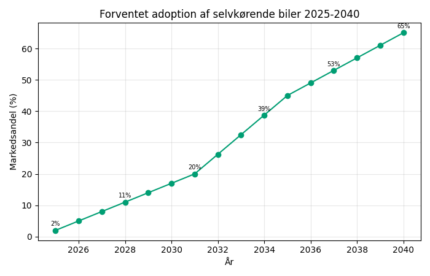
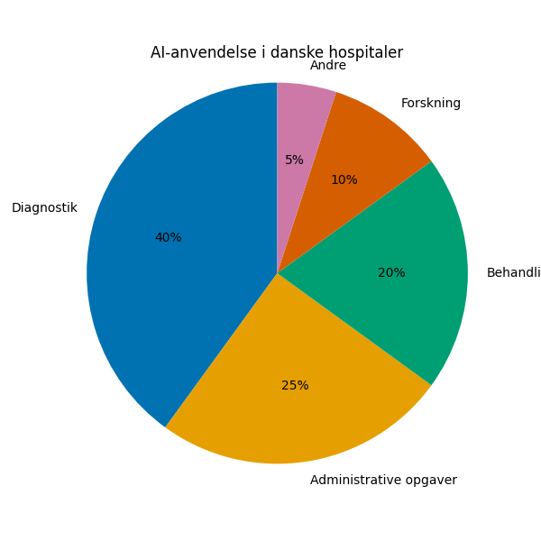
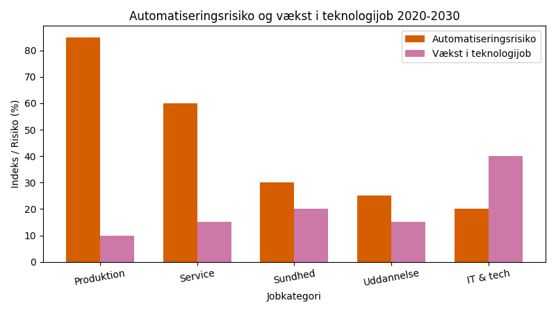

# Studieprøven _Practice Test 12_

  

## Outline

- Læseforståelse (90 minutter)
  - Delprøve 1
  - Delprøve 2A
  - Delprøve 2B
  - Delprøve 3
- Skriftlig fremstilling (3 timer)
- Mundtlig kommunikation (30 minutter)

  Help Den Frie Prøvebank

_This practice test was generated by Den Frie Prøvebank and is unofficial. Den Frie Prøvebank's ability to validate how well its tests match the official tests, in terms of content and structure, is limited. Users should seek guidance from official teaching institutions as to the structure and content of the exams in question._

## Læseforståelse

### Delprøve 1 (25 minutter)
**Ingen hjælpemidler tilladt**

#### Tekstsamling: Mobilitet og transport i fremtidens Danmark

**Tekst A: Elektrificering af transportsektoren**
Salget af elbiler nåede 42% af alle nye biler i 2024, en stigning fra 8% i 2020. Danmark har 28.000 offentlige ladestandere og planer om 100.000 inden 2030. Batteriteknologi forbedres med 12% årligt, mens priserne falder med 8%. Elbusser udgør nu 65% af offentlig transport i større byer. Elektriske lastbiler testes på 15 ruter mellem danske byer med lovende resultater for langdistancetransport.

**Tekst B: Cykeltransport og urban mobilitet**
Danmarks cykelstier strækker sig over 12.400 km nationalt med 400 km i København alene. 35 % af alle arbejdsrejser foregår på cykel i hovedstadsområdet. Elcykler er vokset med 85 % siden 2020 og udgør nu 28 % af alle cykelkøb. Supercykelstier forbinder forstæder med bycentre og reducerer pendlingstiden med 25 %. Investeringer i cykelinfrastruktur når 3,2 milliarder kroner over fem år.

**Tekst C: Offentlig transport og jernbaner**
DSB transporterer 285 millioner passagerer årligt med 94% punktlighed. Nye elektriske tog reducerer energiforbrug med 30% sammenlignet med dieseltog. Metro-udvidelsen til Sydhavn og Nordhavn skaber 17 nye stationer og forventes at betjene 140.000 daglige passagerer. Regionaltog elektrificeres med 85% af strækninger kørende på grøn strøm. Letbaner i Aarhus og Odense transporterer sammenlagt 45.000 passagerer dagligt.

**Tekst D: Autonome køretøjer og fremtidens teknologi**
Selvkørende busser testes i fem danske byer med 95 % operationel effektivitet. Danske virksomheder som Autonomous Mobility udvikler software til autonome køretøjer med potentiale for global eksport. Vehicle‑to‑grid‑teknologi lader elbiler fungere som mobile batterier i elnettet. Delebilsordninger vokser med 35 % årligt og reducerer behovet for privat bilejerskab. Smart trafikstyring via kunstig intelligens optimerer trafikflowet og reducerer køretiden med 18 %.

**Tekst E: Internationale forbindelser og logistik**
Øresundsbroen transporterer 68 millioner passagerer og 8,5 millioner køretøjer årligt. Færgeforbindelser til Norge, Sverige og Tyskland håndterer 25 millioner passagerer med en stigende andel af elbiler. Københavns Lufthavn gennemførte 29,8 millioner passagerer i 2024 og investerer 12 milliarder kroner i udvidelse. Godstransport via jernbane stiger med 22 % som følge af CO₂‑afgifter på lastbiler. Malmö‑København‑jernbaneforbindelsen udvides til dobbeltspor og reducerer rejsetiden til 28 minutter.

#### Spørgsmål til tekstsamlingen:

1. Hvor mange procent af alle nye biler var elbiler i 2024?

2. Hvor mange offentlige ladestandere har Danmark?

3. Med hvor mange procent forbedres batteriteknologi årligt?

4. Hvor mange procent af offentlig transport i større byer udgør elbusser?

5. Hvor mange km cykelstier strækker sig nationalt?

6. Hvor mange procent af alle arbejdsrejser foregår på cykel i hovedstadsområdet?

7. Med hvor mange procent er elcykler vokset siden 2020?

8. Med hvor mange procent reducerer supercykelstier pendlingstiden?

9. Hvor mange millioner passagerer transporterer DSB årligt?

10. Med hvor mange procent reducerer nye elektriske tog energiforbruget?

11. Hvor mange nye stationer skaber Metro-udvidelsen?

12. Hvor mange procent af regionaltog-strækninger kører på grøn strøm?

13. I hvor mange danske byer testes selvkørende busser?

14. Med hvor mange procent vokser delebilsordninger årligt?

15. Hvor mange millioner passagerer gennemførte Københavns Lufthavn i 2024?

### Delprøve 2A (Del af 65 minutter samlet for 2A, 2B og 3)

#### Tekst med fjernede afsnit: Kunstig intelligens i det danske sundhedssystem

_Sæt bogstavet for den rigtige sætning i hvert felt._

Kunstig intelligens revolutionerer det danske sundhedssystem ved at forbedre diagnostik, optimere behandlinger og effektivisere administrative processer. Teknologien lover at løse mange af de udfordringer, som demografiske ændringer og ressourcemangel skaber.

**(1)** ________

AI-diagnostik anvendes nu på 78% af danske hospitaler til billedanalyse af røntgen, CT- og MR-scanninger. Systemerne kan identificere tumorer, knoglebrud og hjerneblødninger med 97% nøjagtighed, ofte hurtigere end erfarne radiologer. Dette reducerer ventetider betydeligt.

**(2)** ________

Personaliseret medicin udvikles ved hjælp af AI-analyse af patientdata, genetisk information og behandlingshistorik. Algoritmer kan forudsige, hvilke mediciner der virker bedst for specifikke patienter, hvilket reducerer bivirkninger og forbedrer helbredelseschancer.

**(3)** ________

Administrative opgaver automatiseres gennem intelligent dokumenthåndtering og patientjournalsystemer. AI kan skrive udskrivningsbreve, planlægge operationer og koordinere behandlingsforløb, hvilket frigør tid til patientpleje for sundhedspersonalet.

**(4)** ________

Etiske dilemmaer opstår omkring algoritmeransvar, databeskyttelse og ligebehandling. Hvis AI-systemer begår fejl i diagnostik eller behandlingsanbef, er det uklart, hvem der er ansvarlig. GDPR komplicerer brug af helbredsdata til AI-træning.

**(5)** ________

Fremtiden vil bringe endnu mere integration af AI i sundhedssystemet. Forudsigende analyser kan forudsige epidemier og allokere ressourcer optimalt, mens robotter assisterer ved komplekse operationer og rehabiliteringsforløb.

#### Fjernede afsnit (vælg det rigtige for hver position):

1. Afsnit 1
<ul class="multiple-choice-answers">
1. COVID-19 pandemien accelererede implementeringen af AI-værktøjer markant, da behovet for hurtig diagnostik og ressourceoptimering blev kritisk.
2. Danske tech-virksomheder som Corti og Brain+ udvikler AI-løsninger specifikt til sundhedssektoren og eksporterer teknologien internationalt.
3. Investeringer i sundhedsdata-infrastruktur når 8,5 milliarder kroner over fem år for at understøtte AI-implementering på tværs af regioner.
</ul>

2. Afsnit 2
<ul class="multiple-choice-answers">
1. Machine learning-algoritmer analyserer store mængder forskningsdata for at identificere nye behandlingsmuligheder og accelerere medicinudvikling betydeligt.
2. Telemedicin kombineret med AI gør det muligt for patienter i yderområder at modtage specialistbehandling uden fysisk transport til store hospitaler.
3. Lægemiddeludviklingsprocesser forkortes fra 10‑15 år til 3‑5 år gennem AI‑simuleringer af molekylære interaktioner og data fra kliniske forsøg.
</ul>

3. Afsnit 3
<ul class="multiple-choice-answers">
1. Bærbar teknologi og sundhedsapps indsamler kontinuerligt data om patienters vitale funktioner, søvnmønstre og aktivitetsniveauer til AI‑analyse.
2. Træning i virtuel virkelighed for kirurger kombineret med AI‑feedback forbedrer operative færdigheder og reducerer risikoen for komplikationer under indgreb.
3. Chatbots og virtuelle assistenter håndterer 60% af rutinehenvendelser fra patienter og fungerer som første kontaktpunkt for sundhedssystemet.
</ul>

4. Afsnit 4
<ul class="multiple-choice-answers">
1. Bias i AI-algoritmer kan diskriminere mod specifikke befolkningsgrupper, hvis træningsdata ikke repræsenterer mangfoldigheden i patientpopulationen.
2. Hackere målretter AI-systemer i sundhedssektoren for at manipulere diagnostik eller stjæle sensitive helbredsdata fra tusindvis af patienter.
3. Sundhedspersonale udtrykker bekymring for tab af færdigheder og klinisk intuition, da afhængigheden af AI‑beslutningsstøtte øges.
</ul>

5. Afsnit 5
<ul class="multiple-choice-answers">
1. International standardisering af AI-systemer i sundhedsvæsenet bliver afgørende for at sikre kompatibilitet og videndeling mellem lande.
2. Kvanteberegning vil revolutionere AI‑kapaciteter inden for sundhed ved at muliggøre analyse af molekylære simuleringer i realtid.
3. Regulering af AI i sundhedssektoren balancerer mellem innovation og patientsikkerhed gennem nye certificeringsprocesser og lovgivningsmæssige rammer.
</ul>---

### Delprøve 2B (Del af 65 minutter samlet for 2A, 2B og 3)

#### Tekst: Fremtidens arbejdsliv og automatisering

Den teknologiske revolution omformer fundamentalt det danske arbejdsmarked. Automatisering, kunstig intelligens og robotteknologi eliminerer nogle jobkategorier, mens de skaber nye muligheder og kompetencekrav for arbejdsstyrken.

Produktionsarbejde automatiseres i accelererende tempo. Danske fabrikker implementerer industrirobotter og AI-styrede systemer, der kan udføre komplekse opgaver med højere præcision end mennesker. Fødevareindustri, bilindustri og logistikcentre reducerer medarbejderstaben med 30-40%, mens produktiviteten stiger markant.

Serviceerhverv oplever ligeledes transformation. Kassefunktioner erstattes af selvbetjening og mobile betalingsløsninger. Chatbots håndterer kundeservice, mens algoritmer overtager regnskab og dataanalyse. Banker lukker filialer og erstatter rådgivere med digitale platforme.

Nye jobkategorier opstår inden for teknologi og menneskelig interaktion. Dataanalyse, cybersikkerhed og AI‑programmering oplever eksploderende efterspørgsel. Samtidig vokser behovet for terapeuter, kreative fagfolk og specialister i menneske‑computer‑interaktion, da automatisering frigør ressourcer til mere menneskelige funktioner.

Uddannelsessystemet tilpasser sig de hastige forandringer. Universiteter og erhvervsskoler udvikler modulære programmer, der kan opdateres kontinuerligt. Livslang læring bliver normen frem for undtagelsen, da kompetencer forældes hurtigere end nogensinde tidligere.

Den danske flexicurity‑model bliver udfordret af teknologisk disruption. Arbejdsløshedsforsikring og omskolingsprogrammer må tilpasses hyppigere jobskifte og kortere ansættelsesperioder. Gig‑økonomien udfordrer traditionelle ansættelsesforhold og det sociale sikkerhedsnet.

Geografiske forskelle forstærkes af automatiseringen. Storbyerne tiltrækker højteknologiske jobs og kreative erhverv, mens industriområder i yderområder oplever jobflugt. Dette skaber udfordringer for regional balance og social sammenhængskraft.

Politiske løsninger diskuteres intensivt. Forslag om borgerløn, reduceret arbejdstid og roboskat skal håndtere automatiseringens samfundsmæssige konsekvenser. Debatten centrerer sig om, hvordan teknologiens produktivitetsgevinster skal fordeles i samfundet.

#### Spørgsmål til teksten:

_Sæt en cirkel om det rigtige svar._

1. Med hvor mange procent reducerer automatiserede fabrikker medarbejderstaben ifølge teksten?
<ul class="multiple-choice-answers">
1. 20-30% mens produktiviteten stagnerer
2. 30-40% mens produktiviteten stiger markant
3. 40-50% mens produktiviteten falder
</ul>

2. Hvilke nye jobkategorier opstår ifølge teksten?
<ul class="multiple-choice-answers">
1. Primært fysiske arbejde og produktionsjobs
2. Dataanalyse, cybersikkerhed og AI-programmering samt terapeuter og kreative fagfolk
3. Kun tekniske programmer og ingeniørarbejde
</ul>

3. Hvordan tilpasser uddannelsessystemet sig forandringerne?
<ul class="multiple-choice-answers">
1. Ved at fokusere udelukkende på traditionelle uddannelser
2. Ved at udvikle modulære programmer og fremme livslang læring
3. Ved at reducere optaget på tekniske uddannelser
</ul>

4. Hvad udfordrer den danske flexicurity-model?
<ul class="multiple-choice-answers">
1. Manglende interesse for arbejdsløshedsforsikring
2. Hyppigere jobskifte, kortere ansættelser og gig-økonomi
3. For mange stabile job og lav arbejdsløshed
</ul>

5. Hvilke politiske løsninger diskuteres for at håndtere automatiseringens konsekvenser?
<ul class="multiple-choice-answers">
1. Forbud mod kunstig intelligens og robotter
2. Borgerløn, reduceret arbejdstid og roboskat
3. Øget privatisering af alle offentlige services
</ul>

---

### Delprøve 3 (Del af 65 minutter samlet for 2A, 2B og 3)

#### Tekst med fjernede ord: Danmarks bæredygtige transportstrategi

Transportsektoren står for 28% af Danmarks samlede CO2-udslip og __(1)__ ______ afgørende for at nå klimamålene inden 2030. Regeringen har __(2)__ ______ en ambitiøs strategi for grøn omstilling af al transport.

Elektrificering af personbiler __(3)__ ______ gennem skatteincitamenter og investeringer i ladeinfrastruktur. Målet er 1 million elbiler på vejene inden 2030, hvilket __(4)__ ______ massive udbygning af hurtigladere langs motorveje og i byområder.

Offentlig transport __(5)__ ______ også omfattende modernisering. Alle busser i større byer skal være elektriske inden 2030, mens __(6)__ ______ ruter elektrificeres for at eliminere dieseltog fra det danske jernbanenet.

Godstransport udgør den største __(7)__ ______ for grøn omstilling. Tunge lastbiler kører lange afstande og kræver __(8)__ ______ batteriteknologi eller alternative brændstoffer som hydrogen. Danmark investerer i __(9)__ ______ af hydrogen-infrastruktur langs hovedveje.

Internationale samarbejder __(10)__ ______ Danmarks muligheder for at påvirke transportudviklingen i nabolandene og skabe regionale løsninger for grænseoverskridende transport.

#### Valgmuligheder:

<table class="horizontal-multiple-choice">
  <tbody>
    <tr>
      <td><strong>1</strong></td>
      <td><strong>a.</strong> bliver</td>
      <td><strong>b.</strong> er</td>
      <td><strong>c.</strong> forbliver</td>
      <td><strong>d.</strong> udvikles</td>
    </tr>
    <tr>
      <td><strong>2</strong></td>
      <td><strong>a.</strong> udarbejdet</td>
      <td><strong>b.</strong> foreslået</td>
      <td><strong>c.</strong> planlagt</td>
      <td><strong>d.</strong> implementeret</td>
    </tr>
    <tr>
      <td><strong>3</strong></td>
      <td><strong>a.</strong> støttes</td>
      <td><strong>b.</strong> fremmes</td>
      <td><strong>c.</strong> udvikles</td>
      <td><strong>d.</strong> accelereres</td>
    </tr>
    <tr>
      <td><strong>4</strong></td>
      <td><strong>a.</strong> kræver</td>
      <td><strong>b.</strong> nødvendiggør</td>
      <td><strong>c.</strong> forudsætter</td>
      <td><strong>d.</strong> indebærer</td>
    </tr>
    <tr>
      <td><strong>5</strong></td>
      <td><strong>a.</strong> undergår</td>
      <td><strong>b.</strong> oplever</td>
      <td><strong>c.</strong> gennemgår</td>
      <td><strong>d.</strong> modtager</td>
    </tr>
    <tr>
      <td><strong>6</strong></td>
      <td><strong>a.</strong> jernbane</td>
      <td><strong>b.</strong> regional</td>
      <td><strong>c.</strong> fjern</td>
      <td><strong>d.</strong> internationale</td>
    </tr>
    <tr>
      <td><strong>7</strong></td>
      <td><strong>a.</strong> opgave</td>
      <td><strong>b.</strong> udfordring</td>
      <td><strong>c.</strong> problem</td>
      <td><strong>d.</strong> barriere</td>
    </tr>
    <tr>
      <td><strong>8</strong></td>
      <td><strong>a.</strong> avanceret</td>
      <td><strong>b.</strong> forbedret</td>
      <td><strong>c.</strong> ny</td>
      <td><strong>d.</strong> øget</td>
    </tr>
    <tr>
      <td><strong>9</strong></td>
      <td><strong>a.</strong> opførelse</td>
      <td><strong>b.</strong> etablering</td>
      <td><strong>c.</strong> udvikling</td>
      <td><strong>d.</strong> udbredelse</td>
    </tr>
    <tr>
      <td><strong>10</strong></td>
      <td><strong>a.</strong> styrker</td>
      <td><strong>b.</strong> øger</td>
      <td><strong>c.</strong> forbedrer</td>
      <td><strong>d.</strong> udvider</td>
    </tr>
  </tbody>
</table>

## Skriftlig fremstilling (3 timer)
**Alle ordbøger er tilladt**

### Vælg én af følgende tre opgaver:

#### Opgave 1: Autonome køretøjer og samfundsforandring

**Grafik:** 

**Manchet:** Selvkørende biler kan revolutionere transport og byplanlægning, men rejser spørgsmål om sikkerhed, etik og arbejdspladser. Danmark forbereder sig på omfattende samfundsændringer, når autonome køretøjer bliver almindelige i hverdagen.

**Opgave:** Skriv en sammenhængende tekst på minimum 400 ord, hvor du:
- Analyserer den forventede udvikling i autonome køretøjer fra grafikken
- Diskuterer potentielle fordele for trafiksikkerhed og miljø
- Vurderer udfordringer for lovgivning og etiske dilemmaer
- Argumenterer for Danmarks strategi for implementeringen af teknologien

#### Opgave 2: AI i sundhedssystemet

**Grafik:** 

**Manchet:** Kunstig intelligens implementeres hurtigt i det danske sundhedssystem for at øge effektiviteten og forbedre patientbehandling. Men teknologien rejser også spørgsmål om databeskyttelse, ansvar og den menneskelige dimension i sundhedspleje.

**Opgave:** Skriv en sammenhængende tekst på minimum 400 ord, hvor du:
- Præsenterer AI-anvendelse i sundhedssektoren fra grafikken
- Analyserer fordele for patienter og sundhedspersonale
- Diskuterer etiske og praktiske udfordringer
- Vurderer balancen mellem teknologi og menneskelig omsorg

#### Opgave 3: Fremtidens arbejdsmarked og automatisering

**Grafik:** 

**Manchet:** Automatisering forandrer det danske arbejdsmarked radikalt. Mens traditionelle job forsvinder, opstår nye muligheder inden for teknologi og kreative erhverv. Uddannelsessystemet og velfærdsstaten må tilpasse sig disse fundamentale ændringer.

**Opgave:** Skriv en sammenhængende tekst på minimum 400 ord, hvor du:
- Redegør for arbejdsmarkedsudviklingen vist i grafikken
- Analyserer konsekvenser for forskellige uddannelses- og aldersgrupper
- Diskuterer udfordringer for det sociale sikkerhedsnet
- Foreslår politikker for at hjælpe arbejdstagere gennem omstillingen

_Brug disse sider til at skrive din skriftlige opgave._

## Mundtlig kommunikation (30 minutter inkl. votering)

### Opgaveark med tre emner til forberedelse:

#### Emne 1: Grøn omstilling i landbruget

**Stikord til inspiration:**
- Økologisk landbrug og regenerativ dyrkning
- Reduceret brug af pesticider og kunstgødning
- Teknologisk innovation som præcisionslandbrug og droner
- Klimaneutrale gårde og reduktion af drivhusgasudledning
- Biodiversitet, naturbeskyttelse og jordforbedring
- Forbrugeradfærd, bæredygtige fødevarer og lokale markeder
- Politiske initiativer, EU-landbrugspolitik og støtteordninger
- Balancen mellem eksport, selvforsyning og global konkurrence

#### Emne 2: Byudvikling og sociale rum

**Stikord til inspiration:**
- Bæredygtig arkitektur og energirenovering
- Offentlige grønne områder og rekreative arealer
- Gentrificering og sociale forskelle i byer
- Effektiv offentlig transport og byplanlægning
- Boligpriser, boligpolitik og sociale boliger
- Deltagelse af borgere i planlægning og byfornyelse
- Smart city-teknologi og digital infrastruktur
- Kulturtilbud, caféliv og sociale mødesteder

#### Emne 3: Kunst og kultur i digital tidsalder

**Stikord til inspiration:**
- Streaming, podcasts og digital distribution af kunst
- Digital kunst, NFT’er og nye kunstformer
- Virtuelle museer, koncerter og digitale oplevelser
- Ophavsret, copyright og kunstneres indkomst
- Publikums engagement via sociale medier og interaktivitet
- Finansiering, crowdfunding og støtteordninger til kunst
- Global konkurrence og adgang til internationalt marked
- Kulturarv, identitet og bevaring i et digitalt univers

### Prøveforløb:

1. **Lodtrækning:** Vælg ét af de tre forberedte emner
2. **Præsentation (5 minutter):** Struktureret gennemgang af det valgte emne
3. **Interview (15 minutter):** Uddybende samtale med eksaminator baseret på præsentationen
4. **Votering og karaktergivning (10 minutter)**

### Bedømmelseskriterier:

- **Sproglig korrekthed:** Grammatik, ordforråd og udtale
- **Kommunikativ kompetence:** Evne til at formidle budskaber klart
- **Indholdsrigdom:** Faglig dybde og nuanceret forståelse
- **Struktur:** Logisk opbygning og sammenhæng
- **Interaktion:** Evne til dialog og respons på spørgsmål

---

_This practice test was generated by Den Frie Prøvebank and is unofficial. Den Frie Prøvebank's ability to validate how well its tests match the official tests, in terms of content and structure, is limited. Users should seek guidance from official teaching institutions as to the structure and content of the exams in question._