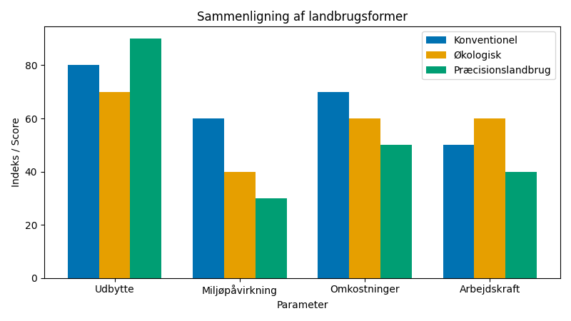
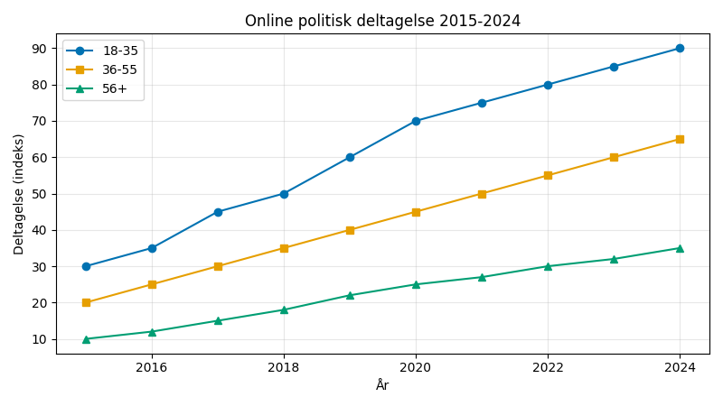

# Studieprøven _Practice Test 13_

  

## Outline

- Læseforståelse (90 minutter)
  - Delprøve 1
  - Delprøve 2A
  - Delprøve 2B
  - Delprøve 3
- Skriftlig fremstilling (3 timer)
- Mundtlig kommunikation (30 minutter)

  Help Den Frie Prøvebank

_This practice test was generated by Den Frie Prøvebank and is unofficial. Den Frie Prøvebank's ability to validate how well its tests match the official tests, in terms of content and structure, is limited. Users should seek guidance from official teaching institutions as to the structure and content of the exams in question._

## Læseforståelse

### Delprøve 1 (25 minutter)
**Ingen hjælpemidler tilladt**

#### Tekstsamling: Klima og miljø i Danmark

**Tekst A: Vedvarende energi og grøn omstilling**

Danmark producerer 134 % af sit elforbrug fra vindkraft på vindrige dage og eksporterer overskydende strøm til nabolande. Offshore vindparker udgør 84 % af vindkapaciteten med 2.300 turbiner i dansk farvand. Solenergi er vokset med 340 % siden 2020 og dækker nu 18 % af elproduktionen. Biogas fra landbrugsaffald forsyner 25 % af naturgasforbruget. Danmarks CO₂‑udslip er faldet med 42 % siden 1990 trods 38 % økonomisk vækst.

**Tekst B: Cirkulær økonomi og affaldshåndtering**

92 % af danskernes husholdningsaffald genanvendes eller forbrændes til energi med kun 8 % til deponi. Genbrugscentre modtager 2,1 millioner ton affald årligt med 76 % genanvendelsesrate. Plastaffald sorteres i 12 kategorier, og genbrug af plastik er steget til 69 % mod EU-gennemsnittet på 41 %. Byggeaffald udgør 34 % af det samlede affald og genbruges i 89 % af tilfældene. Madspild er reduceret med 25 % gennem kampagner mod madspild og app‑løsninger.

**Tekst C: Biodiversitet og naturbevarelse**

Danmarks skovarealer dækker 15,2 % af landets areal, og der plantes 45 millioner træer årligt. Vådområder genetableres på 12.400 hektar for at forbedre vandkvaliteten og biodiversiteten. Nationale naturparker beskytter 8,7 % af landets areal med 340 truede arter under særlig beskyttelse. Økologiske landbrugsarealer udgør 13,4 % af det samlede dyrkningsareal og vokser med 7 % årligt. Bier og andre bestøvere støttes gennem 8.200 km blomsterrabatter langs veje.

**Tekst D: Vandmiljø og havbeskyttelse**

Vandkvaliteten i danske vandløb er forbedret med 45 % siden 2010 gennem reduktion af kvælstofbelastningen fra landbruget. Marine beskyttede områder dækker 16 % af danske farvande med forbud mod bundtrawling i 35 % af disse zoner. Mikroplast i havmiljøet reduceres gennem forbud mod engangsplastik og forbedrede rensningsprocesser. Kvælstof i grundvandet er faldet med 28 % som følge af præcisionslandbrug og miljøvenlige gødningsmetoder. Østersøens iltindhold forbedres gennem koordinerede indsatser med Baltic Sea Action Plan.

**Tekst E: Klimatilpasning og ekstremvejr**

Skybrudsbassiner i danske byer kan håndtere 47 mm regn på 30 minutter og beskytter 890.000 indbyggere mod oversvømmelser. Diger og kystbeskyttelse forstærkes langs 8.700 km kyst som forberedelse til 65 cm havvandsstigning inden 2100. Varmeøer i byerne bekæmpes med 12 % flere grønne tage og 340 km nye træplantninger langs gaderne. Forsikringsskader fra ekstremvejr er steget til 3,8 milliarder kroner årligt. Klimatilpasningsplaner implementeres i 95 % af danske kommuner.

#### Spørgsmål til tekstsamlingen:

1. Hvor mange procent af sit elforbrug producerer Danmark fra vindkraft på vindrige dage?

2. Hvor mange procent af vindkapaciteten udgør offshore vindparker?

3. Med hvor mange procent er solenergi vokset siden 2020?

4. Hvor mange procent af naturgasforbruget forsyner biogas fra landbrugsaffald?

5. Med hvor mange procent er Danmarks CO2-udslip faldet siden 1990?

6. Hvor mange procent af danskernes husholdningsaffald genanvendes eller forbrændes til energi?

7. Hvor mange millioner tons affald modtager genbrugscentre årligt?

8. Til hvor mange procent er genbrug af plastik steget?

9. Hvor mange procent af det samlede affald udgør byggeaffald?

10. Med hvor mange procent er madspildet reduceret?

11. Hvor mange procent af landets område dækker Danmarks skovarealer?

12. Hvor mange millioner træer plantes årligt?

13. På hvor mange hektarer genetableres vådområder?

14. Hvor mange procent af landets areal beskytter nationale naturparker?

15. Hvor mange km blomsterrabatter findes langs veje til støtte for bestøvere?

### Delprøve 2A (Del af 65 minutter samlet for 2A, 2B og 3)

#### Tekst med fjernede afsnit: Digitalisering og demokrati i Danmark

_Sæt bogstavet for den rigtige sætning i hvert felt._

Digital teknologi transformerer grundlæggende den måde, demokratiet fungerer på i Danmark. E-demokrati, digital deltagelse og online politisk kommunikation skaber nye muligheder for borgernes indflydelse, men rejser også bekymringer om misinformation og polarisering.

**(1)** ________

Borger.dk og andre digitale platforme giver borgerne adgang til offentlige tjenester og information hele døgnet. 89 % af alle henvendelser til det offentlige foregår nu digitalt, hvilket effektiviserer administrationen og reducerer ventetiderne betydeligt.

**(2)** ________

Sociale medier påvirker i stigende grad den politiske kommunikation og valgkampe. Facebook, Instagram og TikTok bruges af politikere til direkte kontakt med vælgerne, men algoritmer kan skabe ekkokamre og forstærke politisk polarisering.

**(3)** ________

Digital deltagelse via online konsultationer og borgerpaneler involverer flere borgere i beslutningsprocesser. Apps til lokalpolitik og digitale borgermøder gør det nemmere for travle familier og yngre generationer at deltage i demokratiet.

**(4)** ________

Cybersikkerhed bliver kritisk for demokratiets integritet. Hackerangreb på valgsystemer og politiske partier truer troværdigheden, mens udenlandsk indblanding gennem onlinekampagner kan påvirke valgresultater.

**(5)** ________

Fremtidens digitale demokrati kræver balance mellem innovation og tradition. Blockchain-teknologi kunne sikre transparente valg, mens AI kan hjælpe borgere med at navigere politiske informationer og beslutninger.

#### Fjernede afsnit (vælg det rigtige for hver position):

1. Afsnit 1
<ul class="multiple-choice-answers"> 
1. Den offentlige sektor ligger i front med digitaliserede services, så kontakt med myndighederne foregår hovedsageligt online. 
2. Derfor har staten investeret i digitale identifikationsløsninger som NemID og MitID, som giver sikker adgang til offentlige systemer.
3. Denne udvikling har betydet, at borgerkontakt og selvbetjening i høj grad er flyttet til internettet frem for fysiske skranker.
</ul>

2. Afsnit 2
<ul class="multiple-choice-answers">
1. Den politiske debat foregår ikke længere kun i traditionelle medier, men i stigende grad på sociale platforme.
2. Derfor er digitale kampagner og målrettede annoncer blevet en fast del af valgkampen i Danmark. 
3. Det har ændret de strategier, partierne bruger, når de vil nå ud til potentielle vælgere.
</ul>

3. Afsnit 3
<ul class="multiple-choice-answers">
1. Nye digitale værktøjer giver borgerne mulighed for at deltage aktivt i udformningen af politik gennem høringer og afstemninger online.
2. Flere kommuner bruger i dag apps og webportaler til borgerbudgetter og digitale høringssvar.
3. Det giver en mere åben og tilgængelig demokratisk proces, hvor flere stemmer bliver hørt.
</ul>

4. Afsnit 4
<ul class="multiple-choice-answers">
1. Men den øgede digitalisering medfører også nye sikkerhedstrusler, som kan svække tilliden til systemerne.
2. Når mere af demokratiet flytter online, bliver beskyttelse af data og valgprocesser helt afgørende.
3. Digitale systemer kan nemlig udnyttes af både kriminelle og statslige aktører, hvis de ikke er ordentligt beskyttet.
</ul>

5. Afsnit 5
<ul class="multiple-choice-answers"> 
1. Samtidig kræver det, at borgere og myndigheder udvikler stærke digitale kompetencer og etiske retningslinjer.
2. Det er nødvendigt at overveje nøje, hvordan nye teknologier implementeres, så de styrker og ikke svækker demokratiet.
3. En fremtidig digital infrastruktur må derfor designes med fokus på gennemsigtighed, ansvarlighed og borgerinddragelse.
</ul>

### Delprøve 2B (Del af 65 minutter samlet for 2A, 2B og 3)

#### Tekst: Fødevaresikkerhed og bæredygtigt landbrug

Danmarks landbrug står over for fundamentale udfordringer med at sikre fødevareforsyningen til en voksende global befolkning, samtidig med at reducere miljøpåvirkningen og beskytte biodiversiteten.

Klimaforandringer påvirker afgrødernes vækst og produktiviteten markant. Stigende temperaturer og ændrede nedbørsmønstre tvinger landmændene til at tilpasse afgrødevalg og dyrkningsmetoder. Tørkeperioder reducerer udbyttet, mens ekstrem nedbør ødelægger afgrøder og udvasker næringsstoffer fra jorden.

Intensivt landbrug har øget produktiviteten betydeligt gennem gødning, pesticider og mekanisering, men har en miljømæssig pris. Kvælstof og fosfor fra landbruget forurener vandløb og grundvand, mens ensidige monokulturer reducerer biodiversiteten drastisk.

Økologisk landbrug tilbyder miljøvenlige alternativer med reduceret kemikaliebrug og forbedret jordens sundhed. Udbytterne er dog 20–25 % lavere end i konventionelt landbrug, hvilket rejser spørgsmål om den globale fødevareforsyning med økologiske metoder alene.

Præcisionslandbrug revolutionerer landbruget gennem GPS‑styring, droner og sensorer. Teknologien optimerer fordelingen af gødning og vanding, reducerer kemikalieforbruget og maksimerer udbyttet pr. hektar. Kunstig intelligens analyserer jordforhold og vejrdata for at guide beslutninger.

Vertikalt landbrug og kontrollerede miljøer repræsenterer landbrugets fremtid i byområder. Hydro‑ og aeroponiske systemer producerer afgrøder året rundt uden pesticider og med 95 % mindre vandforbrug end traditionelle metoder.

Alternative proteinkilder som insekter, alger og plantebaserede kødsubstitutter udvikles for at reducere kødproduktionens klimaaftryk. Laboratoriedyrket kød loves at kombinere traditionel smag med miljømæssig bæredygtighed.

Globale handelskæder gør lokale fødevaresystemer sårbare over for eksterne chok. COVID‑19 og geopolitiske konflikter har demonstreret behovet for mere selvforsyning og robuste fødevaresystemer på nationalt niveau.

#### Spørgsmål til teksten:

_Sæt en cirkel om det rigtige svar._

1. Hvordan påvirker klimaforandringer landbruget ifølge teksten?
<ul class="multiple-choice-answers">
1. Kun gennem positive effekter på afgrøder
2. Gennem stigende temperaturer, ændrede nedbørsmønstre, tørke og ekstrem nedbør
3. Ved at eliminere behovet for gødning helt
</ul>

2. Hvad er miljøkonsekvenserne af intensivt landbrug?
<ul class="multiple-choice-answers">
1. Forbedret biodiversitet og renere vand
2. Kvælstof- og fosforforurening samt reduceret biodiversitet
3. Ingen negative miljøpåvirkninger
</ul>

3. Hvor mange procent lavere udbytte har økologisk landbrug?
<ul class="multiple-choice-answers">
1. 10-15% lavere udbytte
2. 20-25% lavere udbytte
3. 30-40% lavere udbytte
</ul>

4. Hvordan revolutionerer præcisionslandbrug landbruget?
<ul class="multiple-choice-answers">
1. Ved at erstatte alle landmænd med robotter
2. Gennem GPS‑styring, droner, sensorer og AI‑analyse
3. Ved at eliminere behovet for teknologi
</ul>

5. Hvad karakteriserer vertikalt landbrug?
<ul class="multiple-choice-answers">
1. Traditionelle jordbaserede metoder i skyskrabere
2. Hydro‑ og aeroponiske systemer med 95 % mindre vandforbrug
3. Kun anvendelse af genmodificerede afgrøder
</ul>

### Delprøve 3 (Del af 65 minutter samlet for 2A, 2B og 3)

#### Tekst med fjernede ord: Danmarks grønne energiomstilling

Danmarks ambitiøse mål om klimaneutralitet inden 2030 __(1)__ ______ en fundamental transformation af energisystemet. Regeringen har __(2)__ ______ massive investeringer i vedvarende energi og grøn teknologi.

Vindkraft __(3)__ ______ rygraden i Danmarks energiforsyning med både onshore og offshore parker. Planerne __(4)__ ______ en fordobling af vindkapaciteten inden 2030 gennem konstruktion af __(5)__ ______ havvindparker i Nordsøen og Kattegat.

Solenergi __(6)__ ______ hurtigt som supplement til vindkraft, særligt på tage af private boliger og kommercielle bygninger. Batteriteknologi __(7)__ ______ samtidig for at lagre overskydende energi til perioder __(8)__ ______ lav vind og sol.

Energieffektivitet __(9)__ ______ gennem bygningsrenovering og smart grid‑teknologi. Varmepumper __(10)__ ______ oliefyr og gaskedler i hastigt tempo for at elektrificere opvarmning i både private hjem og fjernvarmecentraler.

#### Valgmuligheder:

<table class="horizontal-multiple-choice">
  <tbody>
    <tr>
      <td><strong>1</strong></td>
      <td><strong>a.</strong> kræver</td>
      <td><strong>b.</strong> nødvendiggør</td>
      <td><strong>c.</strong> forudsætter</td>
      <td><strong>d.</strong> indebærer</td>
    </tr>
    <tr>
      <td><strong>2</strong></td>
      <td><strong>a.</strong> planlagt</td>
      <td><strong>b.</strong> vedtaget</td>
      <td><strong>c.</strong> foreslået</td>
      <td><strong>d.</strong> budgetteret</td>
    </tr>
    <tr>
      <td><strong>3</strong></td>
      <td><strong>a.</strong> udgør</td>
      <td><strong>b.</strong> forbliver</td>
      <td><strong>c.</strong> bliver</td>
      <td><strong>d.</strong> udvikles</td>
    </tr>
    <tr>
      <td><strong>4</strong></td>
      <td><strong>a.</strong> omfatter</td>
      <td><strong>b.</strong> inkluderer</td>
      <td><strong>c.</strong> indeholder</td>
      <td><strong>d.</strong> involverer</td>
    </tr>
    <tr>
      <td><strong>5</strong></td>
      <td><strong>a.</strong> yderligere</td>
      <td><strong>b.</strong> nye</td>
      <td><strong>c.</strong> større</td>
      <td><strong>d.</strong> avancerede</td>
    </tr>
    <tr>
      <td><strong>6</strong></td>
      <td><strong>a.</strong> ekspanderer</td>
      <td><strong>b.</strong> udvikles</td>
      <td><strong>c.</strong> vokser</td>
      <td><strong>d.</strong> stiger</td>
    </tr>
    <tr>
      <td><strong>7</strong></td>
      <td><strong>a.</strong> forbedres</td>
      <td><strong>b.</strong> udvikles</td>
      <td><strong>c.</strong> avanceres</td>
      <td><strong>d.</strong> optimeres</td>
    </tr>
    <tr>
      <td><strong>8</strong></td>
      <td><strong>a.</strong> med</td>
      <td><strong>b.</strong> under</td>
      <td><strong>c.</strong> for</td>
      <td><strong>d.</strong> ved</td>
    </tr>
    <tr>
      <td><strong>9</strong></td>
      <td><strong>a.</strong> prioriteres</td>
      <td><strong>b.</strong> fremmes</td>
      <td><strong>c.</strong> styrkes</td>
      <td><strong>d.</strong> implementeres</td>
    </tr>
    <tr>
      <td><strong>10</strong></td>
      <td><strong>a.</strong> erstatter</td>
      <td><strong>b.</strong> udskifter</td>
      <td><strong>c.</strong> substituerer</td>
      <td><strong>d.</strong> fortrænger</td>
    </tr>
  </tbody>
</table>

## Skriftlig fremstilling (3 timer)
**Alle ordbøger er tilladt**

### Vælg én af følgende tre opgaver:

#### Opgave 1: Klimaforandringer og tilpasning

**Grafik:** 

**Manchet:** Danmark oplever flere ekstremvejrhændelser som følge af klimaforandringer. Myndighederne investerer massivt i klimatilpasning, men borgerne og virksomhederne må også tage ansvar for forberedelse til fremtidens vejr.

**Opgave:** Skriv en sammenhængende tekst på minimum 400 ord, hvor du:
- Analyserer udviklingen i ekstremvejr og klimainvesteringer fra grafikken
- Diskuterer effektiviteten af forskellige klimatilpasningstiltag
- Vurderer balancen mellem forebyggelse og reaktive løsninger
- Argumenterer for borgernes rolle i klimatilpasning

#### Opgave 2: Bæredygtigt landbrug og fødevaresikkerhed

**Grafik:** 

**Manchet:** Danmarks landbrug skal balancere produktivitet med miljøhensyn for at sikre fødevareforsyningen uden at ødelægge naturen. Nye teknologier og dyrkningsmetoder kan være løsningen, men kræver store investeringer.

**Opgave:** Skriv en sammenhængende tekst på minimum 400 ord, hvor du:
- Redegør for forskellene mellem landbrugsformerne fra grafikken
- Analyserer udfordringerne ved overgang til bæredygtigt landbrug
- Diskuterer teknologiens rolle i fremtidens fødevareforsyning
- Vurderer politiske tiltag for at støtte grøn omstilling

#### Opgave 3: Digitalt demokrati og borgerdeltagelse

**Grafik:** 

**Manchet:** Digitale platforme ændrer den måde, danskerne deltager i politik på. Især yngre generationer engagerer sig online, men digital kløft og misinformation udfordrer demokratisk deltagelse på tværs af befolkningen.

**Opgave:** Skriv en sammenhængende tekst på minimum 400 ord, hvor du:
- Præsenterer udviklingen i digital politisk deltagelse fra grafikken
- Analyserer fordele og risici ved digitalisering af demokratiet
- Diskuterer generationelle forskelle i politisk engagement
- Foreslår løsninger til at sikre et inkluderende digitalt demokrati

_Brug disse sider til at skrive din skriftlige opgave._

## Mundtlig kommunikation (30 minutter inkl. votering)

### Opgaveark med tre emner til forberedelse:

#### Emne 1: Klimaforandringer og miljø

**Stikord til inspiration:**
    - Global opvarmning og ekstremvejr
    - Vedvarende energi og CO₂-reduktion
    - Cirkulær økonomi og affaldshåndtering
    - Biodiversitet og naturbevarelse
    - Klimatilpasning og infrastruktur
    - Internationalt klimasamarbejde
    - Grøn omstilling af industrien
    - Individuel versus kollektiv klimaindsats

#### Emne 2: Fødevaresystemer og landbrug

**Stikord til inspiration:**
    - Bæredygtigt landbrug og økologi
    - Fødevaresikkerhed og global sult
    - Teknologi i landbruget
    - Kødproduktion og alternative proteiner
    - Lokale kontra globale fødevarekæder
    - Madspild og forbrugsadfærd
    - Pesticider og sundhed
    - Klimaaftryk fra fødevarer

#### Emne 3: Digital teknologi og samfund

**Stikord til inspiration:**
    - Demokrati og online deltagelse
    - Sociale medier og politisk kommunikation
    - Privatliv og dataindsamling
    - Digital kløft og ulighed
    - Misinformation og faktatjek
    - Cybersikkerhed og demokrati
    - E-governance og offentlige tjenester
    - Teknologiregulering og etik

### Prøveforløb:

1. **Lodtrækning:** Vælg ét af de tre forberedte emner
2. **Præsentation (5 minutter):** Struktureret gennemgang af det valgte emne
3. **Interview (15 minutter):** Uddybende samtale med eksaminator baseret på præsentationen
4. **Votering og karaktergivning (10 minutter)**

### Bedømmelseskriterier:

- **Sproglig korrekthed:** Grammatik, ordforråd og udtale
- **Kommunikativ kompetence:** Evne til at formidle budskaber klart
- **Indholdsrigdom:** Faglig dybde og nuanceret forståelse
- **Struktur:** Logisk opbygning og sammenhæng
- **Interaktion:** Evne til dialog og respons på spørgsmål

---

_This practice test was generated by Den Frie Prøvebank and is unofficial. Den Frie Prøvebank's ability to validate how well its tests match the official tests, in terms of content and structure, is limited. Users should seek guidance from official teaching institutions as to the structure and content of the exams in question._
