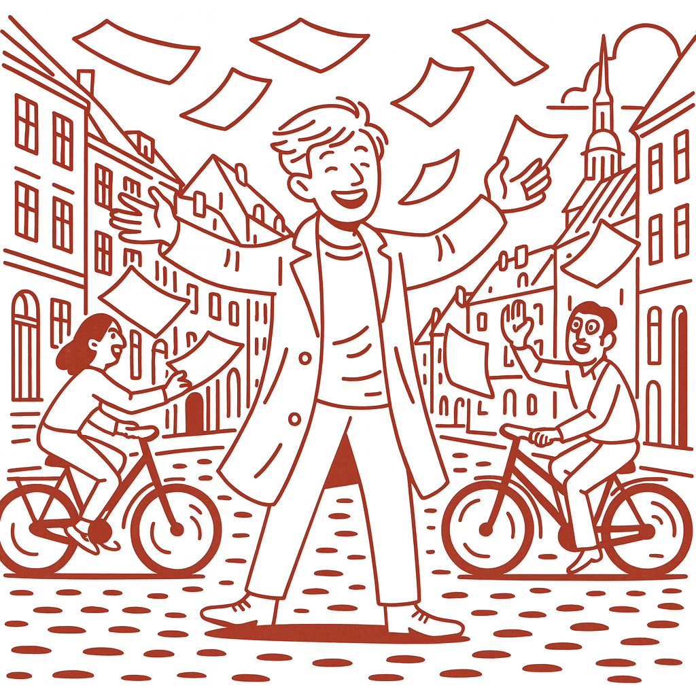

# Studieprøven _Practice Test 14_

  

## Outline

- Læseforståelse (90 minutter)
  - Delprøve 1
  - Delprøve 2A
  - Delprøve 2B
  - Delprøve 3
- Skriftlig fremstilling (3 timer)
- Mundtlig kommunikation (30 minutter)

  Help Den Frie Prøvebank

_This practice test was generated by Den Frie Prøvebank and is unofficial. Den Frie Prøvebank's ability to validate how well its tests match the official tests, in terms of content and structure, is limited. Users should seek guidance from official teaching institutions as to the structure and content of the exams in question._

## Læseforståelse

### Delprøve 1 (25 minutter)
**Ingen hjælpemidler tilladt**

#### Tekstsamling: Uddannelse og kompetenceudvikling i Danmark

**Tekst A: Folkeskolen og grunduddannelse**

Danmarks folkeskole omfatter 1.385 skoler med 623.000 elever og har en gennemsnitlig klassestørrelse på 20,4 elever. 95% af børn starter i børnehave før skolestart, hvilket forbedrer skoleparathed betydeligt. Specialundervisning tilbydes til 12,8% af eleverne, mens 73% af niendeklasseselever fortsætter direkte til ungdomsuddannelse. Frafald fra grundskolen er reduceret til 1,2% gennem tidlig indsats og mentorordninger. Digitale læremidler anvendes i 89% af undervisningen.

**Tekst B: Gymnasiale uddannelser og erhvervsuddannelser**

STX, HHX og HTX uddannelserne har sammenlagt 158.000 elever med 89% gennemførelsesprocent på normeret tid. Erhvervsuddannelser tæller 115.000 elever fordelt på 104 forskellige uddannelser med 68% gennemførelsesprocent. Gymnasieelever bruger 37 timer ugentligt på skolearbejde inklusive lektier, mens erhvervsskoleeleverne bruger 35 timer. 82% af gymnasieelever fortsætter til videregående uddannelse inden for to år.

**Tekst C: Videregående uddannelser og universiteter**

Danmarks otte universiteter har 144.000 studerende med 76% gennemførelsesprocent på kandidatuddannelser. Professionsbacheloruddannelser som sygeplejerske, lærer og pædagog har 89.000 studerende med 84% gennemførelsesprocent. International mobilitet omfatter 34.000 danske studerende på studieophold i udlandet og 45.000 internationale studerende i Danmark. STEM-uddannelser (Science, Technology, Engineering, Mathematics) vælges af 28% af universitetsstuderende.

**Tekst D: Voksenuddannelse og livslang læring**

Arbejdsmarkedsuddannelser (AMU) gennemføres af 245.000 personer årligt med 340 forskellige kursustyper. Voksen- og efteruddannelse omfatter 78.000 deltagere på VUC og 156.000 på erhvervsakademier og UC-institutioner. 67% af 25-64-årige danskere deltager i formal eller informal uddannelse årligt, hvilket er højest i EU. Efter- og videreuddannelse finansieres med 8,4 milliarder kroner årligt af det offentlige og private virksomheder.

**Tekst E: Fremtidens kompetencer og digital læring**

Kodning og programmering undervises nu i 78 % af danske folkeskoler som led i teknologiforståelse. Kunstig intelligens integreres i undervisningen på 65 % af gymnasier og erhvervsskoler som værktøj til personaliseret læring. Online- og hybridundervisning er implementeret på 92 % af videregående uddannelser efter erfaringerne fra COVID‑19. Digital dannelse er blevet obligatorisk på alle uddannelsesniveauer. Mikrouddannelser og certificeringsprogrammer vokser med 145 % årligt som respons på hurtige teknologiske forandringer.

#### Spørgsmål til tekstsamlingen:

1. Hvor mange folkeskoler findes der i Danmark?

2. Hvor mange elever har Danmarks folkeskole?

3. Hvad er den gennemsnitlige klassestørrelse i folkeskolen?

4. Hvor mange procent af børn starter i børnehave før skolestart?

5. Til hvor mange procent af eleverne tilbydes specialundervisning?

6. Hvor mange procent af niendeklasseselever fortsætter direkte til ungdomsuddannelse?

7. Hvor mange elever har STX, HHX og HTX sammenlagt?

8. Hvor stor en procentdel af eleverne gennemfører gymnasiale uddannelser på normeret tid?

9. Hvor mange elever tæller erhvervsuddannelser?

10. Hvor mange timer ugentligt bruger gymnasieelever på skolearbejde?

11. Hvor mange studerende har Danmarks otte universiteter?

12. Hvor stor en procentdel af studerende gennemfører kandidatuddannelser?

13. Hvor mange danske studerende er på studieophold i udlandet?

14. Hvor mange internationale studerende studerer i Danmark?

15. Hvor mange personer gennemfører arbejdsmarkedsuddannelser årligt?

### Delprøve 2A (Del af 65 minutter samlet for 2A, 2B og 3)

#### Tekst med fjernede afsnit: Mental sundhed blandt unge danskere

_Sæt bogstavet for den rigtige sætning i hvert felt._

Mental sundhed blandt danske unge er blevet en af de største samfundsudfordringer. Stress, angst og depression rammer flere unge end nogensinde før, og uddannelses- og sundhedssystemet kæmper for at følge med den stigende efterspørgsel efter hjælp.

**(1)** ________

Gymnasieelever rapporterer rekordhøje stressniveauer med 67% der oplever daglig stress i forbindelse med skolearbejde og karakterjagt. Præstationspres og konkurrence om uddannelsespladser skaber en kultur, hvor unges selvværd måles på akademiske resultater.

**(2)** ________

Sociale medier forværrer problemet gennem konstant sammenligning og frygten for at gå glip af noget (FOMO). Instagram, Snapchat og TikTok skaber urealistiske forventninger til livet og udseendet, særligt blandt teenagepiger hvor kropsdysmorfisk lidelse er stigende.

**(3)** ________

COVID‑19‑pandemien havde katastrofale konsekvenser for unges mentale sundhed gennem isolation, aflysning af sociale aktiviteter og øget skærmtid. Genopretningen er langsom, og mange unge kæmper stadig med angst omkring social interaktion.

**(4)** ________

Tidlig intervention og forebyggelse prioriteres gennem skolepsykologer, kammeratstøtteprogrammer og mindfulness i undervisningen. Førstehjælp til mental sundhed gives til lærere og forældre for at genkende faresignaler hos unge.

**(5)** ________

Fremtiden kræver systemiske forandringer i uddannelseskulturen og øget finansiering til mentale sundhedstjenester. Balancen mellem ambitioner og trivsel må genfindes for at sikre en generation af psykisk sunde unge danskere.

#### Fjernede afsnit (vælg det rigtige for hver position):

1. Afsnit 1
<ul class="multiple-choice-answers">
1. Antallet af unge danskere med psykiatriske diagnoser er steget med 89 % på ti år, og ventelisterne til børne- og ungdomspsykiatrien er nu op til seks måneder.
2. International forskning viser lignende tendenser i vestlige lande, hvor danske unge ikke er unikke i at opleve mentale udfordringer i rekordhøj grad.
3. Genetiske faktorer spiller en mindre rolle end tidligere antaget, mens miljømæssige og sociale faktorer dominerer udviklingen af mentale sundhedsproblemer.
</ul>

2. Afsnit 2
<ul class="multiple-choice-answers">
1. Karaktersystemet og rangering af skoler skaber unødvendig konkurrence og sammenligning mellem elever, hvilket øger stress og reducerer samarbejdslæring.
2. Helikopterforældre og overskedulering af unges fritid efterlader begrænset tid til fri leg og udvikling af selvstændig problemløsning.
3. Akademisk pres kombineret med konkurrence om optagelse på videregående uddannelser driver mange unge til perfektionisme og frygt for at fejle gennem deres formative år.
</ul>

3. Afsnit 3
<ul class="multiple-choice-answers">
1. Digital detox‑programmer og skærmfrie zoner implementeres i skoler for at reducere afhængighed af sociale medier og forbedre ansigt-til-ansigt sociale færdigheder.
2. Kendte personers arbejde for mental sundhed gennem influencere og musikere normaliserer samtaler om psykologisk trivsel blandt unge.
3. Algoritmer på sociale platforme designes for at maksimere engagementstiden, hvilket ofte betyder at fremme kontroversielt eller følelsesmæssigt udløsende indhold for unge.
</ul>

4. Afsnit 4
<ul class="multiple-choice-answers">
1. Nedlukninger og hjemmeundervisning forstyrrede vigtige sociale udviklingsmilepæle, især i overgangen mellem barndom og ungdom.
2. Øgede familiekonflikter under pandemiens isolation intensiverede eksisterende sårbarheder og skabte nye traumer for mange unge.
3. Onlineundervisning afslørede uddannelsesmæssige uligheder og den digitale kløft, hvor socialt og økonomisk udsatte unge led uforholdsmæssigt meget under skolelukninger.
</ul>

5. Afsnit 5
<ul class="multiple-choice-answers">
1. Viden om mental sundhed skal integreres som obligatorisk fag på alle uddannelsesniveauer for at afstigmatisere og fremme tidlig hjælp‑søgende adfærd.
2. Ungdomsledede mental‑sundhedsinitiativer og kammeratstøttenetværk viser lovende resultater med at skabe relaterbare og tilgængelige støttesystemer for unge.
3. Investering i lokale mentale sundhedscentre og unge‑specifikke tjenester skal prioriteres over hospitalsbaserede behandlingsmodeller for bæredygtige løsninger.
</ul>

### Delprøve 2B (Del af 65 minutter samlet for 2A, 2B og 3)

#### Tekst: Boligmarked og social ulighed

Det danske boligmarked oplever fundamentale forandringer, der påvirker social mobilitet og geografisk ulighed mellem regioner. Prisstigninger, begrænsede byggetilladelser og demografiske forskydninger skaber nye udfordringer for unge og lavindkomstgrupper.

Boligpriserne i København og Aarhus er steget med 180% siden 2010, langt over lønudviklingen på 45% i samme periode. En gennemsnitlig lejlighed i København koster nu 8,2 årsindkomster for en almindelig familie, sammenlignet med 4,1 årsindkomster i 2010.

Førstegangskøbere står over for uoverstigelige barrierer til boligejerskab. Kravet om 20 % udbetaling betyder, at unge skal spare 800 000 kroner op for en gennemsnitsbolig i hovedstadsområdet. Bankrestriktioner og høje renter forværrer situationen.

Det sociale boligbyggeri kan ikke følge med efterspørgslen med 180 000 familier på venteliste nationalt. Byggeriet af almene boliger er faldet med 40 % siden 2015 på grund af finansieringsproblemer og NIMBY‑modstand i velhavende kvarterer.

Udlejningsmarkedet domineres af institutionelle investorer og internationale kapitalfonde, der presser priserne op og reducerer tilgængeligheden for danske familier. Korttidsudlejning via Airbnb fjerner yderligere boliger fra den permanente boligmasse.

Geografisk ulighed intensiveres, da job koncentrerer sig i større byer med høje boligpriser, mens mindre byer oplever befolkningstilbagegang og faldende ejendomsværdier. Dette skaber en ond cirkel af reducerede serviceudbud og økonomisk stagnation.

Overførsel af formue mellem generationer bliver afgørende for unge danskeres boligchancer. Forældre med ejendomme kan hjælpe deres børn med udbetalinger, mens andre bliver permanent udelukket fra boligejerskab.

Regeringen foreslår reguleringsændringer, herunder et øget boligudbud, huslejekontrol og afgifter på udenlandske købere. Kritikere argumenterer for mere fundamentale markedsreformer og udbygning af det offentlige boligbyggeri som bæredygtige løsninger.

#### Spørgsmål til teksten:

_Sæt en cirkel om det rigtige svar._

1. Med hvor mange procent er boligpriserne steget i København og Aarhus siden 2010?
<ul class="multiple-choice-answers">
1. 120% mens lønudviklingen var 30%
2. 180% mens lønudviklingen var 45%
3. 220% mens lønudviklingen var 60%
</ul>

2. Hvor mange årsindkomster koster en gennemsnitlig lejlighed i København nu?
<ul class="multiple-choice-answers">
1. 6,8 årsindkomster sammenlignet med 3,2 i 2010
2. 8,2 årsindkomster sammenlignet med 4,1 i 2010
3. 9,5 årsindkomster sammenlignet med 5,1 i 2010
</ul>

3. Hvor meget skal unge spare op for en gennemsnitsbolig i hovedstadsområdet?
<ul class="multiple-choice-answers">
1. 600 000 kroner for en 15 % udbetaling
2. 800 000 kroner for en 20 % udbetaling
3. 1 000 000 kroner for en 25 % udbetaling
</ul>

4. Hvor mange familier er på venteliste til sociale boliger nationalt?
<ul class="multiple-choice-answers">
1. 120.000 familier med 30% fald i byggeri
2. 180.000 familier med 40% fald i byggeri
3. 240.000 familier med 50% fald i byggeri
</ul>

5. Hvilke faktorer påvirker det geografiske inequality ifølge teksten?
<ul class="multiple-choice-answers">
1. Kun klimaforandringer og miljømæssige faktorer
2. Jobkoncentration i større byer med høje boligpriser versus befolkningstilbagegang i mindre byer
3. International migration og kulturelle forskelle
</ul>

### Delprøve 3 (Del af 65 minutter samlet for 2A, 2B og 3)

#### Tekst med fjernede ord: Danmarks uddannelsespolitik og social mobilitet

Uddannelse betragtes som __(1)__ ______ til social mobilitet i Danmark, men systemet står over for udfordringer med at __(2)__ ______ lige muligheder for alle børn uanset social baggrund.

Socioøkonomiske forskelle __(3)__ ______ allerede i børnehaven, hvor børn fra akademikerfamilier udvikler __(4)__ ______ ordforråd og kognitive færdigheder end børn fra mindre privilegerede hjem.

Folkeskolen __(5)__ ______ at reducere disse forskelle gennem differentieret undervisning og __(6)__ ______ støtte til elever med særlige behov. Dog viser internationale test, at gaps __(7)__ ______ at bestå gennem hele skoleforløbet.

Ungdomsuddannelser __(8)__ ______ forskellige mønstre for social reproduktion. Gymnasiale uddannelser tiltrækker primært middelklasse- og overklasseelever, mens erhvervsuddannelser __(9)__ ______ flere arbejderklasseelever med praktisk orientering.

Videregående uddannelser __(10)__ ______ social mobilitet for nogle, men deltagelsesrater varierer betydeligt efter forældres uddannelsesbaggrund og indkomstniveauer.

#### Valgmuligheder:

<table class="horizontal-multiple-choice">
  <tbody>
    <tr>
      <td><strong>1</strong></td>
      <td><strong>a.</strong> nøglen</td>
      <td><strong>b.</strong> vejen</td>
      <td><strong>c.</strong> midlet</td>
      <td><strong>d.</strong> løsningen</td>
    </tr>
    <tr>
      <td><strong>2</strong></td>
      <td><strong>a.</strong> skabe</td>
      <td><strong>b.</strong> sikre</td>
      <td><strong>c.</strong> garantere</td>
      <td><strong>d.</strong> etablere</td>
    </tr>
    <tr>
      <td><strong>3</strong></td>
      <td><strong>a.</strong> opstår</td>
      <td><strong>b.</strong> udvikles</td>
      <td><strong>c.</strong> manifesterer</td>
      <td><strong>d.</strong> viser</td>
    </tr>
    <tr>
      <td><strong>4</strong></td>
      <td><strong>a.</strong> bedre</td>
      <td><strong>b.</strong> større</td>
      <td><strong>c.</strong> stærkere</td>
      <td><strong>d.</strong> højere</td>
    </tr>
    <tr>
      <td><strong>5</strong></td>
      <td><strong>a.</strong> forsøger</td>
      <td><strong>b.</strong> arbejder</td>
      <td><strong>c.</strong> stræber</td>
      <td><strong>d.</strong> målsætter</td>
    </tr>
    <tr>
      <td><strong>6</strong></td>
      <td><strong>a.</strong> særlig</td>
      <td><strong>b.</strong> individuel</td>
      <td><strong>c.</strong> personlig</td>
      <td><strong>d.</strong> specialiseret</td>
    </tr>
    <tr>
      <td><strong>7</strong></td>
      <td><strong>a.</strong> fortsætter</td>
      <td><strong>b.</strong> persisterer</td>
      <td><strong>c.</strong> vedbliver</td>
      <td><strong>d.</strong> forbliver</td>
    </tr>
    <tr>
      <td><strong>8</strong></td>
      <td><strong>a.</strong> afspejler</td>
      <td><strong>b.</strong> demonstrerer</td>
      <td><strong>c.</strong> viser</td>
      <td><strong>d.</strong> indikerer</td>
    </tr>
    <tr>
      <td><strong>9</strong></td>
      <td><strong>a.</strong> involverer</td>
      <td><strong>b.</strong> omfatter</td>
      <td><strong>c.</strong> inkluderer</td>
      <td><strong>d.</strong> modtager</td>
    </tr>
    <tr>
      <td><strong>10</strong></td>
      <td><strong>a.</strong> muliggør</td>
      <td><strong>b.</strong> faciliterer</td>
      <td><strong>c.</strong> tilbyder</td>
      <td><strong>d.</strong> skaber</td>
    </tr>
  </tbody>
</table>

## Skriftlig fremstilling (3 timer)

**Alle ordbøger er tilladt**

### Vælg én af følgende tre opgaver:

#### Opgave 1: Uddannelse og social mobilitet

**Grafik:** 

**Manchet:** Danske børns uddannelsesmuligheder påvirkes stadig stærkt af forældrenes baggrund trods et gratis uddannelsessystem. Social arv i uddannelse udfordrer idealet om lige muligheder for alle og kræver politiske tiltag.

**Opgave:** Skriv en sammenhængende tekst på minimum 400 ord, hvor du:
- Analyserer sammenhængen mellem forældres baggrund og børns uddannelse fra grafikken
- Diskuterer årsager til vedvarende social arv i uddannelse
- Vurderer effektiviteten af eksisterende tiltag for at bryde sociale mønstre
- Foreslår politikker for at øge social mobilitet gennem uddannelse

#### Opgave 2: Mental sundhed blandt unge

**Grafik:** 

**Manchet:** Flere unge danskere end nogensinde før kæmper med mental sundhed og stress. Præstationspres, sociale medier og COVID‑19 har skabt en krise, som kræver hurtig handling fra samfundet.

**Opgave:** Skriv en sammenhængende tekst på minimum 400 ord, hvor du:
- Redegør for udviklingen i unges mental sundhed fra grafikken
- Analyserer årsager til stigningen i psykiske problemer
- Diskuterer konsekvenser for uddannelsessystem og arbejdsmarked
- Argumenterer for konkrete løsninger til forbedring af unges trivsel

#### Opgave 3: Boligmarked og generationel ulighed

**Grafik:** 

**Manchet:** Stigende boligpriser skaber generationel ulighed, hvor unge danskere i stigende grad udelukkes fra boligejerskab. Dette påvirker livsplanlægning, familiedannelse og økonomisk sikkerhed for kommende generationer.

**Opgave:** Skriv en sammenhængende tekst på minimum 400 ord, hvor du:
- Præsenterer de generationelle forskelle i boligejerskab fra grafikken
- Analyserer konsekvenser af boligkrisen for samfundet
- Diskuterer årsager til de stigende boligpriser
- Vurderer forskellige politiske løsningsforslag til boligmarkedet

_Brug disse sider til at skrive din skriftlige opgave._

## Mundtlig kommunikation (30 minutter inkl. votering)

### Opgaveark med tre emner til forberedelse:

#### Emne 1: Uddannelse og fremtidens kompetencer

**Stikord til inspiration:**
- Traditionel vs. digital læring
- STEM vs. humanistiske fag
- Praktisk vs. teoretisk uddannelse
- Livslang læring og kompetenceudvikling
- International konkurrence og kvalitet
- Social ulighed i uddannelse
- Lærermangel og profession
- Kompetencegab og arbejdsmarkedets behov

#### Emne 2: Unges mentale sundhed og trivsel

**Stikord til inspiration:**
- Stress og præstationspres
- Sociale medier og selvbillede
- COVID‑19 og social isolation
- Støttesystemer og terapi
- Forebyggelse vs. behandling
- Familiedynamik og forældreskab
- Skolemiljø og akademisk pres
- Stigma og hjælp‑søgende adfærd

#### Emne 3: Boligmarked og social mobilitet

**Stikord til inspiration:**
- Boligejerskab vs. lejebolig
- Generationel formue og arv
- Byliv vs. landliv
- Boligoverkommelighed og politik
- Investeringsejendomme og spekulation
- Socialt boligbyggeri og markedsbaserede løsninger
- Geografisk mobilitet og jobmuligheder
- Familiedannelse og livsplanlægning

### Prøveforløb:

1. **Lodtrækning:** Vælg ét af de tre forberedte emner
2. **Præsentation (5 minutter):** Struktureret gennemgang af det valgte emne
3. **Interview (15 minutter):** Uddybende samtale med eksaminator baseret på præsentationen
4. **Votering og karaktergivning (10 minutter)**

### Bedømmelseskriterier:

- **Sproglig korrekthed:** Grammatik, ordforråd og udtale
- **Kommunikativ kompetence:** Evne til at formidle budskaber klart
- **Indholdsrigdom:** Faglig dybde og nuanceret forståelse
- **Struktur:** Logisk opbygning og sammenhæng
- **Interaktion:** Evne til dialog og respons på spørgsmål

---

_This practice test was generated by Den Frie Prøvebank and is unofficial. Den Frie Prøvebank's ability to validate how well its tests match the official tests, in terms of content and structure, is limited. Users should seek guidance from official teaching institutions as to the structure and content of the exams in question._
