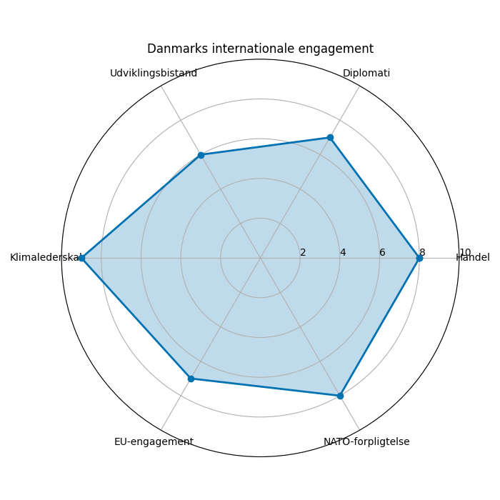
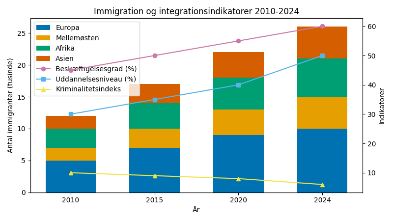
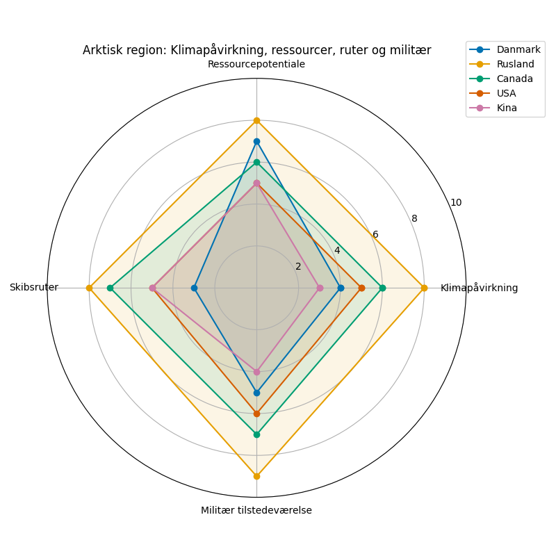

# Studieprøven _Practice Test 15_

  

## Outline

- Læseforståelse (90 minutter)
  - Delprøve 1
  - Delprøve 2A
  - Delprøve 2B
  - Delprøve 3
- Skriftlig fremstilling (3 timer)
- Mundtlig kommunikation (30 minutter)

  Help Den Frie Prøvebank

_This practice test was generated by Den Frie Prøvebank and is unofficial. Den Frie Prøvebank's ability to validate how well its tests match the official tests, in terms of content and structure, is limited. Users should seek guidance from official teaching institutions as to the structure and content of the exams in question._

## Læseforståelse

### Delprøve 1 (25 minutter)
**Ingen hjælpemidler tilladt**

#### Tekstsamling: Globalisering og Danmarks internationale rolle

**Tekst A: Danmarks internationale handel og økonomi**

Danmarks eksportværdi udgjorde 1.247 milliarder kroner i 2024 med Tyskland (16,8 %), Sverige (11,2 %) og Norge (8,9 %) som største handelspartnere. Importen beløb sig til 1.134 milliarder kroner, hvilket gav et handelsoverskud på 113 milliarder kroner. Medicinalindustrien står for 28 % af eksporten med Novo Nordisk og Lundbeck som globale frontløbere. Skibsfart og maritime tjenester bidrager med 142 milliarder kroner til BNP og beskæftiger 97.000 personer. Danmark er verdens femte største eksportør af vindmøller.

**Tekst B: EU-medlemskab og europæisk integration**

Danmark har været medlem af EU siden 1973 og betaler 17,8 milliarder kroner årligt i kontingent, mens landet modtager 12,4 milliarder kroner tilbage. 78 % af Danmarks eksport går til andre EU-lande, og 71 % af importen kommer fra EU. Danske medlemmer af Europa-Parlamentet udgør 14 af 705 medlemmer. Arbejdskraft fra andre EU-lande udgør 8,7 % af Danmarks arbejdsstyrke, primært fra Polen (34 %), Tyskland (18 %) og Sverige (12 %). Den frie bevægelighed for personer har resulteret i, at 67.000 danske statsborgere er bosat i andre EU-lande.

**Tekst C: NATO og international sikkerhed**

Danmark var blandt de stiftende medlemmer af NATO i 1949 og bruger 2,4 % af BNP på forsvar. Danske styrker have deltaget i 47 internationale missioner siden 1990 med aktuelt 1.200 soldater udstationeret globalt. Forsvarsbudgettet er 46 milliarder kroner med planer om at øge til 2,5 % af BNP. Center for Cybersikkerhed overvåger 8.500 cybertrusler dagligt mod dansk infrastruktur. Danmark står for 18 % af Grønlands forsvarsbudget og har suverænitet over 95 % af de arktiske sejlruter.

**Tekst D: Udviklingsbistand og global bæredygtighed**

Danmarks udviklingsbistand udgør 0,70 % af BNI og placerer landet blandt de fem største donorer globalt. 11,8 milliarder kroner kanaliseres årligt til 26 partnerlande med fokus på klima, sundhed og uddannelse. Danida støtter 340 projekter i Afrika, Asien og Latinamerika med særlig prioritet til kvinders rettigheder og demokratisk styring. Det danske nødhjælpsteam har reageret på 89 humanitære kriser siden 2010. 67 % af danskerne støtter det nuværende niveau af udviklingsbistand.

**Tekst E: Immigration og multikulturel integration**

Danmark har 694.000 indvandrere og efterkommere, svarende til 11,9 % af befolkningen. 45 % kommer fra ikke‑vestlige lande med Tyrkiet (67.000), Polen (42.000) og Syrien (38.000) som største grupper. Integrationsprogrammer omfatter tre års sprogundervisning, og 156.000 personer er på integrationsprogram. Beskæftigelsesgraden for ikke‑vestlige indvandrere er 58 % sammenlignet med 78 % for etniske danskere. Naturalisering kræver ni års ophold og bestået statsborgerskabsprøve med en succesrate på 87 %.

#### Spørgsmål til tekstsamlingen:

1. Hvad udgjorde Danmarks eksportværdi i 2024?

2. Hvad var Danmarks handelsoverskud?

3. Hvor mange procent af eksporten står medicinalindustrien for?

4. Hvor mange personer beskæftiger skibsfart og maritime tjenester?

5. Hvor mange milliarder kroner betaler Danmark årligt i EU-kontingent?

6. Hvor mange milliarder kroner modtager Danmark tilbage fra EU?

7. Hvor mange procent af Danmarks eksport går til EU-lande?

8. Hvor mange danske medlemmer af Europa-Parlamentet er der?

9. Hvor mange procent af Danmarks arbejdsstyrke udgør arbejdskraft fra andre EU-lande?

10. Hvor mange procent af BNP bruger Danmark på forsvar?

11. I hvor mange internationale missioner har danske styrker deltaget siden 1990?

12. Hvor mange soldater har Danmark aktuelt udstationeret globalt?

13. Hvor mange procent af BNI udgør Danmarks udviklingsbistand?

14. Hvor mange partnerlande modtager dansk udviklingsbistand?

15. Hvor mange indvandrere og efterkommere har Danmark?

### Delprøve 2A (Del af 65 minutter samlet for 2A, 2B og 3)

#### Tekst med fjernede afsnit: Danmarks arktiske strategi og Grønland

_Sæt bogstavet for den rigtige sætning i hvert felt._

Danmarks position som arktisk nation giver landet unikke muligheder og forpligtelser i en verden, hvor klimaforandringer åbner nye handelsveje og ressourcer i det arktiske område. Rigsfællesskabet med Grønland og Færøerne er centralt i denne strategi.

**(1)** ________

Grønlands ismasse smelter med 280 milliarder tons is årligt, hvilket åbner nye muligheder for minedrift og sejlruter. Nordvestpassagen kan reducere transporttiden mellem Europa og Asien med 40 %, hvilket gør ruterne økonomisk attraktive for international handel.

**(2)** ________

Den geopolitiske konkurrence intensiveres, da USA, Rusland og Kina udvider deres arktiske tilstedeværelse. Kinas selvbetegnelse som nær‑arktisk stat og massive investeringer i Grønlands infrastruktur skaber bekymringer om suverænitet og strategisk autonomi for Danmark.

**(3)** ________

Klimaforandringer påvirker grønlandske samfund gennem forstyrrelse af traditionel jagt og kysterosion. Oprindelige folks rettigheder og bæredygtig udvikling skal balanceres med økonomiske muligheder fra ressourceudvinding og øget tilgængelighed.

**(4)** ________

Videnskabelig forskning etablerer Danmark som førende autoritet inden for arktiske klimastudier. Københavns Universitet og Danmarks Meteorologiske Institut producerer afgørende data til globale klimamodeller og politiske anbefalinger i Arktisk Råd.

**(5)** ________

Fremtidige udfordringer kræver en omhyggelig afvejning af økonomiske interesser, miljøbeskyttelse og oprindelige folks rettigheder. Danmarks arktiske strategi må navigere mellem international konkurrence og ansvarlig forvaltning af et af verdens mest skrøbelige økosystemer.

#### Fjernede afsnit (vælg det rigtige for hver position):

1. Afsnit 1
<ul class="multiple-choice-answers">
1. Rigsfællesskabet med Grønland og Færøerne giver Danmark suverænitet over 2,2 millioner kvadratkilometer arktisk territorium og en vigtig strategisk placering.
2. Historiske koloniale relationer mellem Danmark og Grønland komplicerer moderne styringsstrukturer og skaber løbende politiske spændinger omkring selvstyre.
3. Økonomisk udvikling på Grønland afhænger i høj grad af danske tilskud på 4,6 milliarder kroner årligt, hvilket skaber afhængighedsforhold.
</ul>

2. Afsnit 2
<ul class="multiple-choice-answers">
1. Sjældne jordarter, oliereserver og fiskerettigheder i de arktiske regioner repræsenterer milliarder af kroner i potentielle indtægter for Grønland og Danmark.
2. Rederier som Mærsk og MSC planlægger massive investeringer i arktisk egnede skibe for at udnytte tilgængeligheden af de nye sejlruter.
3. Turismepotentialet stiger betydeligt, i takt med at isens tilbagetrækning gør tidligere utilgængelige områder tilgængelige for krydstogtskibe og oplevelsesturisme.
</ul>

3. Afsnit 3
<ul class="multiple-choice-answers">
1. USA's militære tilstedeværelse på Grønland gennem Thule Air Base giver sikkerhed mod russisk ekspansion, men begrænser dansk kontrol over territoriet.
2. EU's stigende interesse i arktiske ressourcer skaber potentielle konflikter med NATO‑prioriteter og bilaterale dansk‑amerikanske aftaler.
3. Kinas silkevejsinitiativ omfatter forslag til en arktisk silkevej, som truer Vestens kontrol over de arktiske sejlruter og ressourcer.
</ul>

4. Afsnit 4
<ul class="multiple-choice-answers">
1. Bevarelsen af det grønlandske sprog og kulturelle traditioner er under pres fra øget international tilstedeværelse og økonomisk udvikling.
2. Traditionelle jagtpraksisser bliver stadig sværere, da dyrenes migrationsmønstre ændres, og isforholdene bliver uforudsigelige for jægerne.
3. Unge migrerer fra små samfund til Nuuk og Danmark i takt med, at klimaforandringer gør traditionelle leveveje uholdbare over tid.
</ul>

5. Afsnit 5
<ul class="multiple-choice-answers">
1. Internationalt samarbejde i Arktisk Råd muliggør fredelig løsning af territoriale konflikter og bæredygtig ressourceforvaltning gennem multilaterale aftaler.
2. Danmarks Polarinstitut og Arktisk Forskningscenter tilbyder afgørende videnskabelig infrastruktur til internationalt samarbejde om klimaforskningsprojekter.
3. Teknologiudvikling inden for vedvarende energi og bæredygtig infrastruktur kunne gøre Grønland til et forbillede for arktiske udviklingsprojekter.
</ul>

### Delprøve 2B (Del af 65 minutter samlet for 2A, 2B og 3)

#### Tekst: Migration og integration i det moderne Danmark

Danmarks migrationspolitik har udviklet sig dramatisk over de seneste årtier som et svar på øget global mobilitet og skiftende demografiske mønstre. Balancen mellem humanitære forpligtelser og social samhørighed udfordrer traditionelle tilgange til multikulturalisme.

Tilstrømningen af flygtninge toppede under migrantkrisen i 2015 med 21.000 asylansøgere, primært fra Syrien, Afghanistan og Somalia. Den politiske reaktion var hurtig med grænsekontrol, reducerede ydelser og kontroversiel lovgivning, herunder konfiskation af smykker fra asylansøgere.

Integrationsresultater varierer betydeligt mellem forskellige indvandrergrupper. Indvandrere fra EU‑lande som Polen og Tyskland integreres økonomisk hurtigt med høje beskæftigelsesrater og hurtig sprogtilegnelse. Ikke‑vestlige indvandrere står over for større udfordringer med lavere beskæftigelse, større uddannelsesgab og højere kriminalitetsrater.

Ghettoisering i visse boligområder skaber parallelsamfund med høje koncentrationer af indvandrere, lave indkomster og begrænset interaktion med det øvrige danske samfund. Regeringen identificerer 29 "hårde ghettoer", som kræver indgriben gennem blandede boligpolitikker og målrettede investeringer.

Kravene til dansk sprogkundskab er blevet strammet betydeligt med obligatoriske sprogtest for statsborgerskab, permanent opholdstilladelse og sociale ydelser. Kritikere hævder, at kravene er diskriminerende, mens tilhængere mener, at de fremmer integration og fælles kulturelle værdier.

Diskrimination på arbejdsmarkedet er fortsat en væsentlig hindring for indvandrere med udenlandsk klingende navne, der modtager 32 % færre indkaldelser til jobsamtaler. Anerkendelsen af udenlandske kvalifikationer er bureaukratisk og tidskrævende, hvilket tvinger kvalificerede fagfolk til lavt kvalificeret arbejde.

Efterkommere af indvandrere oplever ofte identitetskonflikter mellem traditionelle familieværdier og danske kulturelle normer. Deres uddannelsesniveau er generelt højere end deres forældres, men social mobilitet forbliver begrænset i visse miljøer.

Politiske partier afspejler en stigende polarisering omkring immigrationspolitikken. Danmark Demokraterne og Socialistisk Folkeparti repræsenterer modsatte poler, mens de større partier forsøger at navigere mellem humanitære hensyn og vælgernes ønsker om en begrænset indvandring.

#### Spørgsmål til teksten:

_Sæt en cirkel om det rigtige svar._

1. Hvor mange asylansøgere nåede Danmark under migrantkrisen i 2015?
<ul class="multiple-choice-answers">
1. 15.000 asylansøgere primært fra lande i Mellemøsten
2. 21.000 asylansøgere primært fra Syrien, Afghanistan og Somalia
3. 27.000 asylansøgere fra forskellige afrikanske lande
</ul>

2. Hvor mange "hårde ghettoer" identificerer regeringen?
<ul class="multiple-choice-answers">
1. 22 ghettoer, der kræver øjeblikkelig indgriben
2. 29 ghettoer, der kræver indgriben gennem politikker
3. 35 ghettoer under regeringens overvågning
</ul>

3. Hvor mange procent færre indkaldelser modtager personer med udenlandsk klingende navne?
<ul class="multiple-choice-answers">
1. 25 % færre indkaldelser til jobsamtaler
2. 32 % færre indkaldelser til jobsamtaler
3. 40 % færre indkaldelser til jobsamtaler
</ul>

4. Hvilke udfordringer står ikke‑vestlige indvandrere over for ifølge teksten?
<ul class="multiple-choice-answers">
1. Kun sprogbarrierer og boligproblemer
2. Lavere beskæftigelse, uddannelsesgab og højere kriminalitet
3. Kun diskrimination fra arbejdsgivere og myndigheder
</ul>

5. Hvordan karakteriserer teksten efterkommere af indvandreres oplevelser?
<ul class="multiple-choice-answers">
1. Fuld assimilation uden identitetskonflikter
2. Identitetskonflikter mellem familieværdier og danske normer samt begrænset social mobilitet
3. Højere kriminalitet og uddannelsesmæssig fiasko
</ul>

### Delprøve 3 (Del af 65 minutter samlet for 2A, 2B og 3)

#### Tekst med fjernede ord: Danmarks rolle i global klimapolitik

Danmark __(1)__ ______ en foregangsrolle i international klimapolitik og __(2)__ ______ ambitiøse mål for CO₂‑reduktion som inspiration for andre lande.

Klimatopmødet i København i 2009 __(3)__ ______ Danmarks position som klimadiplomatisk centrum, selv om forhandlingerne ikke __(4)__ ______ de forventede resultater på globalt niveau.

Danmarks erfaring med vindenergi og vedvarende teknologi __(5)__ ______ landet til at eksportere både teknologi og ekspertise til udviklingslande, der __(6)__ ______ hjælp til grøn omstilling.

EU's klimalederskab __(7)__ ______ gennem dansk fortalervirksomhed for ambitiøse reduktionsmål og støtte til Green Deal‑initiativet, som __(8)__ ______ fundamentalt vil omdanne europæisk industri.

Internationale klimafinansieringsforpligtelser __(9)__ ______ Danmarks omdømme som en pålidelig partner for udviklingslande, der kæmper med __(10)__ ______ udfordringer og tilpasningsomkostninger.

#### Valgmuligheder:

<table class="horizontal-multiple-choice">
  <tbody>
    <tr>
  <td><strong>1</strong></td>
  <td><strong>a.</strong> deltager</td>
  <td><strong>b.</strong> indtager</td>
  <td><strong>c.</strong> påtager</td>
  <td><strong>d.</strong> erhverver</td>
    </tr>
    <tr>
  <td><strong>2</strong></td>
  <td><strong>a.</strong> opstiller</td>
  <td><strong>b.</strong> etablerer</td>
  <td><strong>c.</strong> fastlægger</td>
  <td><strong>d.</strong> implementerer</td>
    </tr>
    <tr>
  <td><strong>3</strong></td>
  <td><strong>a.</strong> styrkede</td>
  <td><strong>b.</strong> befæstede</td>
  <td><strong>c.</strong> konsoliderede</td>
  <td><strong>d.</strong> etablerede</td>
    </tr>
    <tr>
  <td><strong>4</strong></td>
  <td><strong>a.</strong> opnåede</td>
  <td><strong>b.</strong> leverede</td>
  <td><strong>c.</strong> realiserede</td>
  <td><strong>d.</strong> gennemførte</td>
    </tr>
    <tr>
  <td><strong>5</strong></td>
  <td><strong>a.</strong> muliggør</td>
  <td><strong>b.</strong> sætter</td>
  <td><strong>c.</strong> gør</td>
  <td><strong>d.</strong> lader</td>
    </tr>
    <tr>
  <td><strong>6</strong></td>
  <td><strong>a.</strong> søger</td>
  <td><strong>b.</strong> kræver</td>
  <td><strong>c.</strong> ønsker</td>
  <td><strong>d.</strong> efterspørger</td>
    </tr>
    <tr>
  <td><strong>7</strong></td>
  <td><strong>a.</strong> styrkes</td>
  <td><strong>b.</strong> fremmes</td>
  <td><strong>c.</strong> støttes</td>
  <td><strong>d.</strong> udvikles</td>
    </tr>
    <tr>
  <td><strong>8</strong></td>
  <td><strong>a.</strong> skal</td>
  <td><strong>b.</strong> kan</td>
  <td><strong>c.</strong> vil</td>
  <td><strong>d.</strong> må</td>
    </tr>
    <tr>
  <td><strong>9</strong></td>
  <td><strong>a.</strong> forbedrer</td>
  <td><strong>b.</strong> styrker</td>
  <td><strong>c.</strong> øger</td>
  <td><strong>d.</strong> udvider</td>
    </tr>
    <tr>
  <td><strong>10</strong></td>
  <td><strong>a.</strong> miljømæssige</td>
  <td><strong>b.</strong> klimatiske</td>
  <td><strong>c.</strong> økologiske</td>
  <td><strong>d.</strong> bæredygtige</td>
    </tr>
  </tbody>
</table>

## Skriftlig fremstilling (3 timer)
**Alle ordbøger er tilladt**

### Vælg én af følgende tre opgaver:

#### Opgave 1: Danmarks internationale rolle og globalisering

**Grafik:** 

**Manchet:** Som et lille land i en globaliseret verden må Danmark strategisk prioritere sine internationale indsatser. Landets størrelse kompenseres gennem klogt diplomati, specialiseret ekspertise og multilateralt engagement.

**Opgave:** Skriv en sammenhængende tekst på minimum 400 ord, hvor du:
- Analyserer Danmarks styrker og udfordringer på baggrund af grafikken  
- Diskuterer balancen mellem nationale interesser og internationale forpligtelser
- Vurderer effektiviteten af dansk udenrigspolitik i en multipolær verden
- Argumenterer for Danmarks fremtidige prioriteter på den internationale scene

#### Opgave 2: Migration og integration udfordringer

**Grafik:** 

**Manchet:** Danmarks migrationserfaring afspejler globale mobilitetstendenser og skaber integrationsudfordringer, som kræver nuancerede politiske svar. Balancen mellem åbenhed og social samhørighed er afgørende for samfundets fremtid.

**Opgave:** Skriv en sammenhængende tekst på minimum 400 ord, hvor du:
- Redegør for migrationsmønstre og integrationsresultater på baggrund af grafikken
- Analyserer faktorer, som påvirker en vellykket integration for forskellige grupper  
- Diskuterer dilemmaer mellem humanitære forpligtelser og politiske realiteter
- Foreslår afbalancerede tilgange til fremtidens migrations- og integrationspolitik

#### Opgave 3: Arktis og geopolitisk konkurrence

**Grafik:** 

**Manchet:** Klimaforandringer forvandler den arktiske region til en ny frontlinje for geopolitisk konkurrence. Danmarks position gennem Grønland placerer landet centralt i denne strategiske arena med både muligheder og udfordringer.

**Opgave:** Skriv en sammenhængende tekst på minimum 400 ord, hvor du:
- Præsenterer udviklingen i Arktis og den strategiske betydning på baggrund af grafikken
- Analyserer Danmarks muligheder og sårbarheder i den arktiske region
- Diskuterer de modstridende interesser mellem miljøbeskyttelse og økonomisk udvikling  
- Vurderer Danmarks strategi for at navigere i Arktis' geopolitiske landskab

_Brug disse sider til at skrive din skriftlige opgave._

## Mundtlig kommunikation (30 minutter inkl. votering)

### Opgaveark med tre emner til forberedelse:

#### Emne 1: Danmark i verden og globalisering

**Stikord til inspiration:**
- International handel og økonomisk afhængighed
- Fordele og udfordringer ved EU‑medlemskab  
- NATO‑forpligtelser og sikkerhedspolitik
- Udviklingsbistand og globalt ansvar
- Klimadiplomati og miljømæssigt lederskab
- Kulturel eksport og blød magt
- Immigrationspolitik og multikulturalisme
- Småstaters fordele og begrænsninger

#### Emne 2: Migration og kulturel mangfoldighed

**Stikord til inspiration:**
- Integrationsmodeller og assimilationsmodeller
- Sprogkrav og kulturelle værdier
- Økonomiske fordele og sociale omkostninger
- Flygtningeansvar og humanitære forpligtelser
- Udfordringer og muligheder for anden generation  
- Diskrimination og lige muligheder
- Parallelsamfund og social samhørighed
- Politisk polarisering og offentlig opinion

#### Emne 3: Arktis og fremtidens udfordringer

**Stikord til inspiration:**
- Klimaforandringens påvirkning og muligheder
- Ressourceudvinding og miljøbeskyttelse
- Geopolitisk konkurrence og suverænitet
- Oprindelige folks rettigheder og kulturel bevaring  
- Økonomisk udvikling og bæredygtighed
- Internationalt samarbejde og territoriale stridigheder
- Sejlruter og strategisk betydning
- Forskningssamarbejde og videnskabelig diplomati

### Prøveforløb:

1. **Lodtrækning:** Vælg ét af de tre forberedte emner
2. **Præsentation (5 minutter):** Struktureret gennemgang af det valgte emne
3. **Interview (15 minutter):** Uddybende samtale med eksaminator baseret på præsentationen
4. **Votering og karaktergivning (10 minutter)**

### Bedømmelseskriterier:

- **Sproglig korrekthed:** Grammatik, ordforråd og udtale
- **Kommunikativ kompetence:** Evne til at formidle budskaber klart
- **Indholdsrigdom:** Faglig dybde og nuanceret forståelse
- **Struktur:** Logisk opbygning og sammenhæng
- **Interaktion:** Evne til dialog og respons på spørgsmål

---

_This practice test was generated by Den Frie Prøvebank and is unofficial. Den Frie Prøvebank's ability to validate how well its tests match the official tests, in terms of content and structure, is limited. Users should seek guidance from official teaching institutions as to the structure and content of the exams in question._
