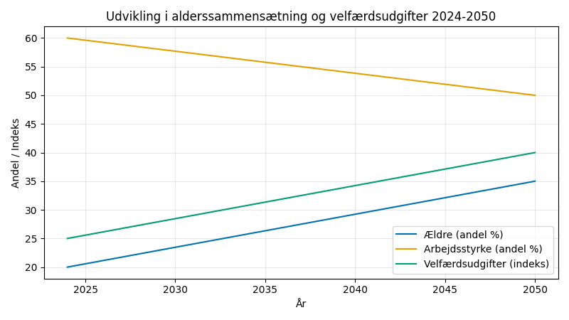
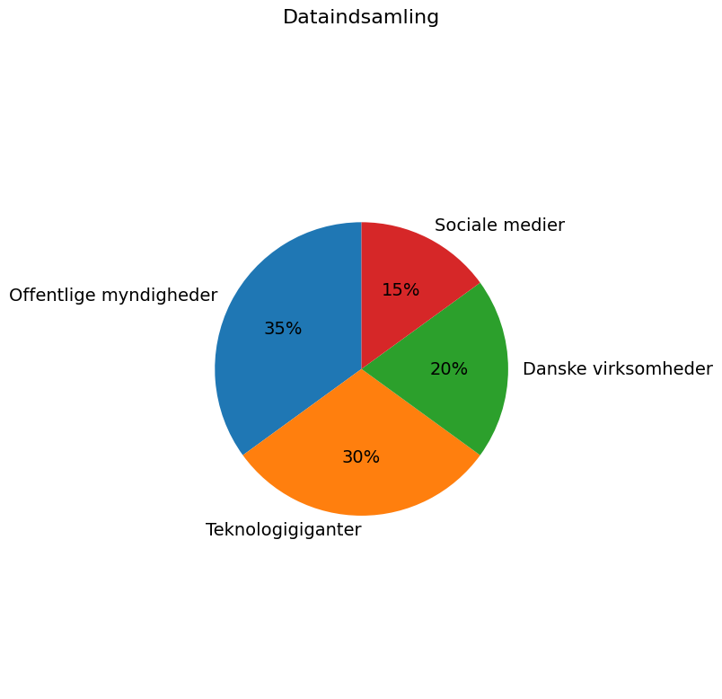

# Studieprøven _Practice Test 16_

  

## Outline

- Læseforståelse (90 minutter)
  - Delprøve 1
  - Delprøve 2A
  - Delprøve 2B
  - Delprøve 3
- Skriftlig fremstilling (3 timer)
- Mundtlig kommunikation (30 minutter)

  Help Den Frie Prøvebank

_This practice test was generated by Den Frie Prøvebank and is unofficial. Den Frie Prøvebank's ability to validate how well its tests match the official tests, in terms of content and structure, is limited. Users should seek guidance from official teaching institutions as to the structure and content of the exams in question._

## Læseforståelse

### Delprøve 1 (25 minutter)
**Ingen hjælpemidler tilladt**

#### Tekstsamling: Teknologi og arbejdsliv i Danmark

**Tekst A: Kunstig intelligens på danske arbejdspladser**

56 % af danske virksomheder har implementeret AI‑løsninger i 2024, en stigning fra 23 % i 2020. Chatbots håndterer nu 78 % af henvendelserne til kundeservice i finanssektoren. Novo Nordisk bruger AI til at accelerere lægemiddeludviklingen med forskning, der forløber 35 % hurtigere. 142.000 job forventes at blive påvirket af AI inden 2030, hvoraf 67 % vil kræve opkvalificering. McKinsey vurderer, at AI kan øge den danske produktivitet med 18 % over det næste årti.

**Tekst B: Fjernarbejde og hybride arbejdsformer**

48 % af danske kontorarbejdere arbejder mindst tre dage hjemmefra om ugen. Virksomhederne har reduceret deres kontorarealer med 35 % siden 2020 og sparer derved 12 milliarder kroner årligt. Microsoft Teams og Slack bruges af 89 % af virksomhederne til virtuelt samarbejde. Produktiviteten er steget med 23 % for fjernarbejdere, men social isolation påvirker 34 % negativt. Balancen mellem arbejde og privatliv er forbedret med 28 % blandt medarbejdere i hybride ordninger.

**Tekst C: Automatisering i produktionsindustrien**

Danske fabrikker har installeret 8.400 industrirobotter siden 2020, hvilket placerer Danmark som nummer syv globalt målt på robot‑tæthed. Fødevareindustrien automatiserer 73 % af produktionslinjerne for at øge hygiejne og effektivitet. Mærsk automatiserer containerterminaler med selvkørende kraner og AI‑styrede logistiksystemer. Antallet af medarbejdere i produktionen er faldet med 15 %, men lønningerne er steget med 22 % for specialiserede teknikere.

**Tekst D: Digital kompetenceudvikling**

85 % af danske arbejdstagere deltager i digital efteruddannelse hvert år. Coursera og LinkedIn Learning bruges af 2,1 millioner danskere til onlinekurser. Virksomheder investerer 6,8 milliarder kroner i medarbejderudvikling, hvor 67 % fokuserer på tekniske færdigheder. Coding bootcamps har en jobplaceringsrate på 95 % og gennemsnitslønninger på 520.000 kroner. Medarbejdere over 55 år udgør 28 % af deltagerne i digital efteruddannelse.

**Tekst E: Platformøkonomi og gig‑arbejde**

134.000 danskere arbejder på digitale platforme som Uber, Wolt og Upwork mindst ti timer om ugen. Gig‑økonomien vokser med 45 % årligt og bidrager med 23 milliarder kroner til BNP. Freelancere tjener gennemsnitligt 387.000 kroner årligt, men mangler sociale sikkerhedsydelser. EU's direktiv om platformsarbejde påvirker 78 % af de danske platformarbejdere med krav om anerkendelse som ansatte. Skattemyndighederne har registreret 67 % flere selvstændige siden 2020.

#### Spørgsmål til tekstsamlingen:

1. Hvor mange procent af danske virksomheder har implementeret AI‑løsninger i 2024?

2. Hvor mange procent af henvendelser til kundeservice håndteres af chatbots i finanssektoren?

3. Med hvor mange procent hurtigere forskning bruger Novo Nordisk AI til lægemiddeludvikling?

4. Hvor mange job forventes at blive påvirket af AI inden 2030?

5. Med hvor mange procent kan AI øge den danske produktivitet over det næste årti?

6. Hvor mange procent af danske kontorarbejdere arbejder mindst tre dage hjemmefra om ugen?

7. Med hvor mange procent har virksomheder reduceret kontorarealer siden 2020?

8. Hvor mange milliarder kroner sparer virksomheder årligt ved at reducere kontorarealer?

9. Med hvor mange procent er produktiviteten steget for fjernarbejdere?

10. Hvor mange industrirobotter har danske fabrikker installeret siden 2020?

11. Hvor mange procent af produktionslinjerne automatiserer fødevareindustrien?

12. Med hvor mange procent er antallet af medarbejdere i produktionen faldet?

13. Hvor mange procent af danske arbejdstagere deltager i digital efteruddannelse hvert år?

14. Hvor mange milliarder kroner investerer virksomheder i medarbejderudvikling?

15. Hvor mange danskere arbejder på digitale platforme mindst ti timer om ugen?

### Delprøve 2A (del af 65 minutter samlet for 2A, 2B og 3)

#### Tekst med fjernede afsnit: Demografiske udfordringer og indvandring

_Sæt bogstavet for den rigtige sætning i hvert felt._

Danmarks demografiske profil ændrer sig markant med en aldrende befolkning og stigende indvandring. Disse tendenser skaber både udfordringer og muligheder for velfærdsstaten og det danske samfund som helhed.

**(1)** ________

Fertilitetsraten er faldet til 1,67 børn per kvinde, langt under reproduktionsniveauet på 2,1. Danske kvinder får børn senere, med en gennemsnitsalder på 30,1 år for første barn. Dette skaber pres på sundhedssystemet og reducerer arbejdsstyrken på længere sigt.

**(2)** ________

Arbejdsindvandring fra EU‑lande, særligt Polen og Rumænien, udfylder manglen på arbejdskraft i byggeri, landbrug og service. Højtuddannede indvandrere fra Indien og USA tiltrækkes til teknologisektoren og forskningen med særlige visumordninger.

**(3)** ________

Alderssammensætningen ændrer sig dramatisk, så 25 % af befolkningen vil være over 65 år inden 2040. Pensionsudgifterne vil stige med 67 % over de næste to årtier, mens antallet af bidragydere per pensionist falder fra 3,2 til 2,1.

**(4)** ________

Integration af ikke‑vestlige indvandrere forbliver udfordrende med lavere beskæftigelsesfrekvenser og uddannelsesmæssige præstationsforskelle. Anden generations indvandrere klarer sig bedre, men sociale problemer koncentreres i specifikke geografiske områder.

**(5)** ________

Politiske løsninger omfatter forhøjet pensionsalder, øget indvandring og familieforøgende tiltag. Balancen mellem økonomiske nødvendigheder og social sammenhængskraft bliver central i fremtidens demografiske strategi.

#### Fjernede afsnit (vælg det rigtige for hver position):

1. Afsnit 1
<ul class="multiple-choice-answers">
1. Et af de tydeligste tegn på forandringen er det faldende fødselstal, som ikke længere kan opretholde befolkningens størrelse.
2. En del af forklaringen ligger i ændrede familieprioriteter og længere uddannelsesforløb, som udsætter tidspunktet for at få børn.
3. Denne udvikling betyder, at den naturlige befolkningstilvækst er på vej mod nul, medmindre indvandringen kompenserer.
</ul>

2. Afsnit 2 
<ul class="multiple-choice-answers">
1. Manglen på arbejdskraft i visse sektorer har gjort Danmark afhængigt af udenlandske medarbejdere for at opretholde væksten.
2. Samtidig søger virksomheder efter talent internationalt for at dække efterspørgslen på specialiserede kompetencer.
3. Dermed bliver indvandring ikke kun et socialt spørgsmål, men også en strategisk ressource for dansk økonomi.
</ul>

3. Afsnit 3 
<ul class="multiple-choice-answers">
1. Den stigende levealder og de lave fødselstal betyder, at Danmark står over for en markant aldring af befolkningen.
2. Udviklingen skaber store udfordringer for velfærdsstaten, der skal finansiere pensioner og sundhedsydelser til flere ældre.
3. Det forstærker presset på de offentlige kasser, da flere borgere trækker sig tilbage fra arbejdsmarkedet end der kommer ind.
</ul>

4. Afsnit 4 
<ul class="multiple-choice-answers">
1. Udover de økonomiske aspekter er integration af indvandrere en vigtig faktor for sammenhængskraften.
2. Integrationspolitikken har dog ikke altid kunnet følge med den demografiske udvikling, og der er stadig tydelige forskelle mellem grupper. 
3. Manglende integration på arbejdsmarkedet og i skolen skaber sociale skel, der kræver målrettede indsatser.
</ul>

5. Afsnit 5 
<ul class="multiple-choice-answers">
1. Derfor diskuteres der i dag, hvordan Danmark bedst kan tilpasse sin politik til de nye demografiske realiteter.
2. Løsningerne er komplekse og involverer både reformer af velfærdssystemet og indvandringspolitikken.
3. På trods af udfordringerne er der politisk enighed om, at en langsigtet tilgang er nødvendig for at sikre velfærdsstatens bæredygtighed.
</ul>

### Delprøve 2B (del af 65 minutter samlet for 2A, 2B og 3)

#### Tekst: Digitalt privatliv og overvågning i det digitale Danmark

Digitaliseringen af det danske samfund har skabt hidtil usete muligheder for både effektivitet og overvågning. Balancen mellem bekvemmelighed og privatliv bliver stadig mere relevant, efterhånden som borgerne navigerer mellem digitale tjenester og personlig autonomi.

Offentlige myndigheder indsamler enorme mængder data gennem digitale tjenester, sundhedsregistre og skattesystemer. Borger.dk, e‑Boks og sundhed.dk centraliserer persondata for administrativ effektivitet, men skaber også omfattende profiler over borgernes aktiviteter og præferencer.

Erhvervslivets dataindsamling gennem smartphones, sociale medier og onlineshopping genererer detaljerede adfærdsprofiler. Google, Facebook og danske virksomheder som Trustpilot og Just Eat sporer brugerne på tværs af platforme med henblik på målrettet reklame og optimering af tjenester.

GDPR‑lovgivningen giver borgerne ret til indsigt i, berigtigelse af og sletning af deres data, men håndhævelsen er begrænset. Danske virksomheder investerer 3,8 milliarder kroner om året i at overholde reglerne, mens datalæk stadig forekommer regelmæssigt trods regulering.

Teknologisk overvågning udvides med ansigtsgenkendelse, lokationssporing og biometrisk identifikation. Politiet bruger tv‑overvågningsnetværk og automatisk nummerpladegenkendelse til kriminalitetsforebyggelse, mens private virksomheder implementerer lignende teknologier til sikkerhedsformål.

Internationalt datasamarbejde gennem EU‑samarbejde og efterretningspartnerskaber komplicerer den nationale suverænitet over persondata. Danske borgeres oplysninger deles med udenlandske myndigheder og virksomheder uden transparente kontrolmekanismer.

Generationsforskelle præger holdningerne til privatliv: Yngre danskere er mere villige til at bytte personlige oplysninger for bekvemmelighed og tilpassede tjenester, mens ældre generationer udviser større skepsis over for digital overvågning og dataindsamling.

Fremtidige teknologier som tingenes internet, smarte byer og kunstig intelligens vil intensivere mulighederne for dataindsamling. Samfundet må udvikle nye rammer for at beskytte det individuelle privatliv og samtidig bevare fordelene ved digital innovation.

#### Spørgsmål til teksten:

_Sæt en cirkel om det rigtige svar._

1. Hvilke offentlige platforme centraliserer persondata ifølge teksten?
<ul class="multiple-choice-answers">
1. Kun Borger.dk og e‑Boks til administrative formål  
2. Borger.dk, e‑Boks og sundhed.dk for administrativ effektivitet  
3. Primært skattesystemer og sundhedsregistre
</ul>

2. Hvor meget investerer danske virksomheder årligt i at overholde GDPR?
<ul class="multiple-choice-answers">
1. 2,4 milliarder kroner med perfekt implementering  
2. 3,8 milliarder kroner, men datalæk forekommer stadig  
3. 5,2 milliarder kroner med fuld databeskyttelse
</ul>

3. Hvilke overvågningsteknologier bruger politiet ifølge teksten?
<ul class="multiple-choice-answers">
1. Kun traditionelle tv‑kameraer til kriminalitetsbekæmpelse  
2. Tv‑overvågningsnetværk og automatisk nummerpladegenkendelse  
3. Primært biometrisk identifikation og ansigtsgenkendelse
</ul>

4. Hvordan påvirker internationalt datasamarbejde den nationale suverænitet over persondata?
<ul class="multiple-choice-answers">
1. Det styrker kontrollen over persondata  
2. Det komplicerer den nationale suverænitet over persondata  
3. Det har ingen påvirkning på databeskyttelsen
</ul>

5. Hvilke generationsforskelle nævnes i teksten om holdninger til privatliv?
<ul class="multiple-choice-answers">
1. Alle generationer har identiske holdninger til privatliv  
2. Yngre er mere villige til at dele oplysninger for bekvemmelighed, mens ældre er mere skeptiske  
3. Kun ældre generationer bruger digitale tjenester
</ul>

### Delprøve 3 (del af 65 minutter samlet for 2A, 2B og 3)

#### Tekst med fjernede ord: Innovation og entreprenørskab i Danmark

Danmarks __(1)__ ______ som innovationsnation bygger på en stærk tradition for teknologisk __(2)__ ______ og iværksætterkultur. Landet rangerer __(3)__ ______ globalt på innovationsindeks takket være høje investeringer i forskning og udvikling og et __(4)__ ______ økosystem for startups.

Danske virksomheder __(5)__ ______ 3,1 % af BNP i forskning og udvikling, hvilket placerer landet blandt de __(6)__ ______ fem i verden. Teknologisektoren vokser med 15 % årligt og __(7)__ ______ nu 8,3 % af den samlede beskæftigelse.

Start‑up‑miljøet __(8)__ ______ af acceleratorprogrammer, venturekapital og statslige støtteordninger. Copenhagen Fintech og Rainmaking __(9)__ ______ internationale investorer til danske innovationshubs.

Samarbejdet mellem universiteter og industri __(10)__ ______ vidensoverførsel og kommerciel anvendelse af forskning. Denne partnerskabsmodel har skabt adskillige succesfulde teknologivirksomheder og patenter.

#### Valgmuligheder:

<table class="horizontal-multiple-choice">
  <tbody>
    <tr>
      <td><strong>1</strong></td>
      <td><strong>a.</strong> omdømme</td>
      <td><strong>b.</strong> position</td>
      <td><strong>c.</strong> status</td>
      <td><strong>d.</strong> rolle</td>
    </tr>
    <tr>
      <td><strong>2</strong></td>
      <td><strong>a.</strong> udvikling</td>
      <td><strong>b.</strong> innovation</td>
      <td><strong>c.</strong> forskning</td>
      <td><strong>d.</strong> fremskridt</td>
    </tr>
    <tr>
      <td><strong>3</strong></td>
      <td><strong>a.</strong> højt</td>
      <td><strong>b.</strong> godt</td>
      <td><strong>c.</strong> stærkt</td>
      <td><strong>d.</strong> betydeligt</td>
    </tr>
    <tr>
      <td><strong>4</strong></td>
      <td><strong>a.</strong> dynamisk</td>
      <td><strong>b.</strong> stærkt</td>
      <td><strong>c.</strong> aktivt</td>
      <td><strong>d.</strong> robust</td>
    </tr>
    <tr>
      <td><strong>5</strong></td>
      <td><strong>a.</strong> bruger</td>
      <td><strong>b.</strong> investerer</td>
      <td><strong>c.</strong> anvender</td>
      <td><strong>d.</strong> dedikerer</td>
    </tr>
    <tr>
      <td><strong>6</strong></td>
      <td><strong>a.</strong> øverste</td>
      <td><strong>b.</strong> første</td>
      <td><strong>c.</strong> bedste</td>
      <td><strong>d.</strong> højeste</td>
    </tr>
    <tr>
      <td><strong>7</strong></td>
      <td><strong>a.</strong> repræsenterer</td>
      <td><strong>b.</strong> udgør</td>
      <td><strong>c.</strong> dækker</td>
      <td><strong>d.</strong> omfatter</td>
    </tr>
    <tr>
      <td><strong>8</strong></td>
      <td><strong>a.</strong> støttes</td>
      <td><strong>b.</strong> understøttes</td>
      <td><strong>c.</strong> fremmes</td>
      <td><strong>d.</strong> udvikles</td>
    </tr>
    <tr>
      <td><strong>9</strong></td>
      <td><strong>a.</strong> tiltrækker</td>
      <td><strong>b.</strong> inviterer</td>
      <td><strong>c.</strong> lokker</td>
      <td><strong>d.</strong> henter</td>
    </tr>
    <tr>
      <td><strong>10</strong></td>
      <td><strong>a.</strong> faciliterer</td>
      <td><strong>b.</strong> muliggør</td>
      <td><strong>c.</strong> støtter</td>
      <td><strong>d.</strong> fremmer</td>
    </tr>
  </tbody>
</table>

## Skriftlig fremstilling (3 timer)
**Alle ordbøger er tilladt**

### Vælg én af følgende tre opgaver:

#### Opgave 1: Kunstig intelligens og jobmarkedet

**Grafik:** 

**Manchet:** Kunstig intelligens transformerer det danske arbejdsmarked fundamentalt. Mens mange traditionelle job automatiseres væk, opstår der nye muligheder inden for AI‑udvikling og menneske‑maskine‑interaktion. Samfundet må forberede sig på massive omstillinger.

**Opgave:** Skriv en sammenhængende tekst på minimum 400 ord, hvor du:
- Analyserer AI’s påvirkning på jobkategorierne fra grafikken
- Diskuterer konsekvenser for forskellige uddannelses- og aldersgrupper
- Vurderer samfundets forberedelse på teknologisk disruption
- Foreslår strategier for at hjælpe arbejdstagere gennem omstillingen

#### Opgave 2: Demografiske forandringer og velfærd

**Grafik:** 

**Manchet:** Danmarks befolkning ældes hurtigere end forventet, mens fertilitetsraten forbliver lav. Dette skaber pres på velfærdsstaten og kræver en grundlæggende omtænkning af pensioner, sundhedsydelser og immigrationspolitik.

**Opgave:** Skriv en sammenhængende tekst på minimum 400 ord, hvor du:
- Præsenterer de demografiske tendenser fra grafikken
- Analyserer udfordringerne for velfærdsstaten
- Diskuterer indvandringens rolle i den demografiske balance
- Argumenterer for bæredygtige løsninger på de demografiske problemer

#### Opgave 3: Digitalt privatliv og overvågning

**Grafik:** 

**Manchet:** Danske borgere eksponeres for omfattende dataindsamling fra både offentlige og private aktører. Balancen mellem bekvemmelighed og privatliv udfordres af stigende digital overvågning og manglende gennemsigtighed omkring brugen af data.

**Opgave:** Skriv en sammenhængende tekst på minimum 400 ord, hvor du:
- Redegør for dataindsamlingens omfang fra grafikken
- Analyserer risici og gevinster ved digital overvågning
- Diskuterer borgernes rettigheder og ansvar
- Vurderer lovgivningsmæssige rammer og beskyttelsen af privatliv

_Brug disse sider til at skrive din skriftlige opgave._

## Mundtlig kommunikation (30 minutter inkl. votering)

### Opgaveark med tre emner til forberedelse:

#### Emne 1: Teknologi og arbejdsliv

**Stikord til inspiration:**
- Kunstig intelligens og automatisering
- Fjernarbejde og hybride løsninger
- Digitale kompetencer og livslang læring
- Gig‑økonomi og platformsarbejde
- Balance mellem arbejde og privatliv og produktivitet
- Generationsforskelle i brug af teknologi
- Jobtryghed og karriereskift
- Innovation og iværksætteri

#### Emne 2: Demografiske udfordringer

**Stikord til inspiration:**
- Aldrende befolkning og pensionssystemer
- Indvandring og integration
- Fertilitetsrater og familiepolitik
- Affolkning af landdistrikter og urbanisering
- Sundhedsudgifter og ældrepleje
- Solidaritet mellem generationer
- Mangel på arbejdskraft
- Kulturel mangfoldighed og social sammenhængskraft

#### Emne 3: Digitalt privatliv og sikkerhed

**Stikord til inspiration:**
- Dataindsamling og overvågning
- GDPR og lovgivningsmæssige rammer
- Teknologigiganter og markedsdominans
- Cybersikkerhed og digitale trusler
- Generationsholdninger til privatliv
- Regeringens gennemsigtighed og ansvarlighed
- Biometrisk identifikation og ansigtsgenkendelse
- Fremtidens teknologier og etiske overvejelser

### Prøveforløb:

1. **Lodtrækning:** Du vælger ét af de tre forberedte emner.
2. **Præsentation (5 minutter):** En struktureret gennemgang af det valgte emne.
3. **Interview (15 minutter):** En uddybende samtale med eksaminator baseret på præsentationen.
4. **Votering og karaktergivning (10 minutter).**

### Bedømmelseskriterier:

- **Sproglig korrekthed:** Grammatik, ordforråd og udtale.
- **Kommunikativ kompetence:** Evnen til at formidle budskaber klart.
- **Indholdsrigdom:** Faglig dybde og nuanceret forståelse.
- **Struktur:** Logisk opbygning og sammenhæng.
- **Interaktion:** Evnen til dialog og respons på spørgsmål.

---

*Dette er en prøvetest baseret på den officielle struktur for Studieprøven. For aktuelle testdatoer og registreringsinformation kontaktes de relevante danske uddannelsesinstitutioner.*
