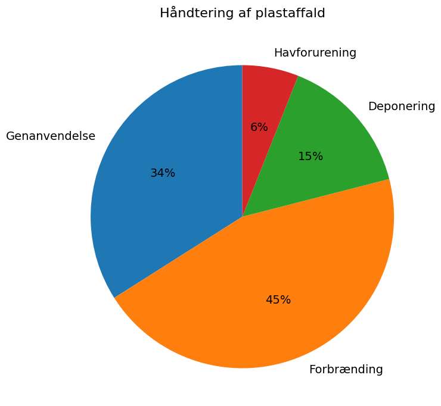

# Studieprøven _Practice Test 18_

  

## Outline

- Læseforståelse (90 minutter)
  - Delprøve 1
  - Delprøve 2A
  - Delprøve 2B
  - Delprøve 3
- Skriftlig fremstilling (3 timer)
- Mundtlig kommunikation (30 minutter)

  Help Den Frie Prøvebank

_This practice test was generated by Den Frie Prøvebank and is unofficial. Den Frie Prøvebank's ability to validate how well its tests match the official tests, in terms of content and structure, is limited. Users should seek guidance from official teaching institutions as to the structure and content of the exams in question._

## Læseforståelse

### Delprøve 1 (25 minutter)
**Ingen hjælpemidler tilladt**

#### Tekstsamling: Energi og miljø i en foranderlig verden

**Tekst A: Vedvarende energi og grøn omstilling**

Danmark producerede 89 % af sin elektricitet fra vedvarende kilder i 2024, primært vindkraft (67 %) og biomasse (22 %). Offshore‑vindparker genererer nu 6.200 MW, hvilket er nok til at forsyne 8 millioner husstande. Solenergi er vokset eksplosivt med 2.300 MW installeret kapacitet, en stigning på 285 % siden 2020. Power‑to‑X‑teknologi konverterer overskydende vindenergi til grøn brint og andre syntetiske brændstoffer. Danmarks energieksport nåede 145 TWh i 2024, hvilket indbragte 67 milliarder kroner.

**Tekst B: Energieffektivitet i bygninger**

Danske bygninger står for 39 % af det totale energiforbrug, men intensive renoveringsprogrammer reducerer dette støt. 340.000 boliger er blevet renoveret siden 2020 med støtte på 18 milliarder kroner fra det offentlige. Varmepumper installeres i 75.000 boliger årligt og erstatter olie‑ og gasfyr. Smart home‑teknologi optimerer energiforbruget med gennemsnitlige besparelser på 23 %. Passivhuse og næsten nul‑energibygninger udgør nu 34 % af alle nybyggerier.

**Tekst C: Transport og mobilitet**

Elektriske køretøjer udgør 47 % af alle nybilsalg i 2024, støttet af 28.000 offentlige ladestandere. Elektriske busser opererer i 67 % af den danske offentlige transport med planer om 100 % elektrificering inden 2027. Cykling tegner sig for 28 % af alle urbane transporter i København og Aarhus. Brintlastbiler testes på 15 ruter som alternativ til diesel til tung transport. E‑fuels produceret fra dansk vedvarende energi kan dekarbonisere skibsfart og luftfart.

**Tekst D: Industri og produktion**

Dansk industri har reduceret CO₂‑udslip med 34 % siden 2010 gennem energieffektivitet og brændselskifte. Cement‑ og stålindustrien investerer 12 milliarder kroner i CO₂‑fangst og brintbaserede produktionsprocesser. Datacentre i Danmark drives af 100 % vedvarende energi og giver overskudsvarme til fjernvarmenetværket. Principper for cirkulær økonomi implementeres i 78 % af produktionsvirksomheder. Industrisymbioseprojekter deler affaldsvarme og materialer mellem virksomheder.

**Tekst E: Internationalt samarbejde og eksport**

Danmark leder 34 internationale klimaprojekter i udviklingslande med fokus på udrulning af vedvarende energi. Danske virksomheder som Vestas, Ørsted og Danfoss eksporterer grøn teknologi for 234 milliarder kroner årligt. Platformen State of Green promoverer dansk miljøteknologi til globale markeder. Grøn udviklingsfinansiering når 89 milliarder kroner, hvoraf 23 % går til klimatilpasning. Carbon Border Adjustment Mechanism beskytter danske virksomheders grønne investeringer mod urimelig konkurrence.

#### Spørgsmål til tekstsamlingen:

1. Hvor mange procent af sin elektricitet producerede Danmark fra vedvarende kilder i 2024?

2. Hvor mange procent af elektricitet kom fra vindkraft?

3. Hvor mange MW offshore vindkraft genereres der?

4. Hvor mange MW solenergi er der installeret kapacitet af?

5. Med hvor mange procent er solenergi vokset siden 2020?

6. Hvor mange TWh energieksport nåede Danmark i 2024?

7. Hvor mange procent af det totale energiforbrug står danske bygninger for?

8. Hvor mange boliger er blevet renoveret siden 2020?

9. Hvor mange milliarder kroner i offentlig støtte er givet til renoveringer?

10. I hvor mange boliger installeres varmepumper årligt?

11. Hvor mange procent af nybilsalg udgør elektriske køretøjer i 2024?

12. Hvor mange offentlige ladestandere findes der?

13. I hvor mange procent af dansk offentlig transport opererer elektriske busser?

14. Hvor mange procent af alle urbane transporter udgør cykling i København og Aarhus?

15. På hvor mange ruter testes brintlastbiler?

### Delprøve 2A (Del af 65 minutter samlet for 2A, 2B og 3)

#### Tekst med fjernede afsnit: Fremtidens arbejdsmarked og automatisering

_Sæt bogstavet for den rigtige sætning i hvert felt._

Teknologisk udvikling forandrer grundlæggende strukturen af det danske arbejdsmarked. Automatisering, kunstig intelligens og robotter skaber både muligheder og udfordringer for arbejdstagere på tværs af alle sektorer og uddannelsesniveauer.

**(1)** ________

Produktion og fremstilling oplever den mest omfattende automatisering med industrielle robotter, der udfører stadigt mere komplekse opgaver. Traditionelle samlebåndsarbejdere omskoles til robotoperatører og vedligeholdelsesteknikere, men den samlede beskæftigelse i sektoren falder alligevel støt.

**(2)** ________

Servicesektoren automatiseres gennem chatbots, selvbetjeningskiosker og AI‑drevne kundesupportsystemer. Detailhandel, hotel‑ og restaurationsbranchen og grundlæggende administrative stillinger står over for betydelige forstyrrelser, efterhånden som teknologiske løsninger bliver mere sofistikerede og omkostningseffektive.

**(3)** ________

Nye jobkategorier opstår inden for teknologisk udvikling, dataanalyse og samarbejde mellem mennesker og kunstig intelligens. Disse roller kræver andre kompetencer og ofte et højere uddannelsesniveau, hvilket kan udelukke arbejdstagere uden teknologisk forståelse eller ressourcer til omskoling.

**(4)** ________

Uddannelsessystemet tilpasser sig gennem fokus på STEM‑fag, digital kompetence og livslang læring. Traditionel erhvervsuddannelse udvikler sig til at inkludere robotteknologi og AI‑ledelse, men overgangsperioden skaber usikkerhed for både studerende og undervisere.

**(5)** ________

Samfundsmæssige konsekvenser omfatter risiko for øget ulighed, behov for sociale sikkerhedsnet og en revurdering af arbejdets rolle i menneskelig identitet. Nogle økonomer går ind for universel basisindkomst, mens andre promoverer jobgarantiprogrammer som svar på teknologisk arbejdsløshed.

#### Fjernede afsnit (vælg det rigtige for hver position):

1. Afsnit 1
<ul class="multiple-choice-answers">
1. COVID-19-pandemien accelererede automatiseringen, da virksomheder søgte at reducere afhængigheden af menneskelige medarbejdere, der var udsatte for sygdom og nedlukninger.
2. Små og mellemstore virksomheder mangler ofte ressourcer til at investere i dyr automatiseringsteknologi, hvilket skaber konkurrenceulemper i forhold til større virksomheder.
3. Fagforeninger arbejder i stigende grad for at beskytte arbejdstagere gennem overenskomster, der regulerer tempoet og omfanget af automatisering.
</ul>

2. Afsnit 2
<ul class="multiple-choice-answers">
1. Produktionsjob flytter til lande med lavere lønomkostninger, hvilket tvinger danske fabrikker til at konkurrere gennem automatisering og produktion med højere værditilvækst.
2. Kvalitetskontrol og præcisionsfremstilling drager betydeligt fordel af automatiske systemer, som reducerer fejl og forbedrer produktkonsistensen.
3. Faglærte håndværk som VVS, elektrikerarbejde og byggeri viser sig mere resistente over for automatisering på grund af opgavernes kompleksitet og variation.
</ul>

3. Afsnit 3
<ul class="multiple-choice-answers">
1. Finansielle tjenester tager kunstig intelligens i brug til at opdage svindel, kreditvurdering og investeringsstyring, hvilket reducerer behovet for traditionelle bank‑ og forsikringsmedarbejdere.
2. Sundhedssektoren bevarer en stærk menneskelig dimension, fordi patientpleje kræver empati og komplekse beslutninger, som nuværende AI ikke effektivt kan efterligne.
3. Transportsektoren står over for en fuldstændig transformation gennem autonome køretøjer, der truer job for lastbilchauffører, taxachauffører og bude.
</ul>

4. Afsnit 4
<ul class="multiple-choice-answers">
1. Universiteter udvikler nye tværfaglige programmer, der kombinerer teknologi med humaniora for at forberede de studerende på hybride karrierer i en automatiseret arbejdsplads.
2. Virksomheders efteruddannelsesprogrammer fokuserer på at udvikle færdigheder, der supplerer automatiseringen i stedet for at konkurrere med teknologiske kapaciteter.
3. Ældre arbejdstagere står over for de største udfordringer i at tilpasse sig teknologiske forandringer og kan have behov for intensiv støtte til karriereovergange.
</ul>

5. Afsnit 5
<ul class="multiple-choice-answers">
1. Politiske debatter intensiveres om regeringens rolle i at styre den teknologiske overgang og beskytte fortrængte arbejdstagere gennem sociale politikker.
2. International koordinering bliver nødvendig, eftersom automatisering påvirker globale arbejdsmarkeder og kan føre til handelskonflikter om teknologiske fordele.
3. Etiske rammer for udviklingen af automatisering prioriterer menneskelig velfærd og sikrer, at teknologiske fremskridt kommer samfundet bredt til gode i stedet for at koncentrere velstand.
</ul>

### Delprøve 2B (Del af 65 minutter samlet for 2A, 2B og 3)

#### Tekst: Plastik og miljøudfordringer

Plastforurening har udviklet sig til en af de mest presserende globale miljøudfordringer. Danmark arbejder på omfattende løsninger, som balancerer den praktiske nytte af plastmaterialer med det presserende behov for miljøbeskyttelse.

Engangsplast dominerer affaldet i havmiljøer, hvor marine dyr forveksler plastaffald med føde, hvilket resulterer i død og ødelæggelse af økosystemer. Mikroplast trænger ind i fødekæder og ophobes i menneskers kroppe med ukendte langsigtede sundhedskonsekvenser.

Genbrugssystemerne i Danmark opnår en genanvendelsesrate på 34 % for plastemballage, men mange produkter er fortsat teknisk udfordrende at genanvende effektivt. Forurening, blandede materialer og utilstrækkelig sorteringsinfrastruktur begrænser effektiviteten af de nuværende genbrugsprocesser.

Biologisk nedbrydelige alternativer vinder hurtigt frem, hvor virksomheder udvikler plastsubstitutter fra landbrugsaffald, tang og andre organiske materialer. Disse innovationer koster ofte betydeligt mere end konventionel plast og kan have funktionsbegrænsninger til visse anvendelser.

Cirkulære økonomi‑tilgange understreger reduktion af plastforbruget gennem genanvendelig emballage, refill‑systemer og produktdesign, som prioriterer holdbarhed frem for engangsanvendelse. Virksomheder eksperimenterer med pantordninger og lukkede kredsløbssystemer.

Adfærdsændring blandt forbrugere viser sig at være afgørende, eftersom individuelle valg samlet set har en enorm miljøpåvirkning. Oplysningskampagner fremmer bevidsthed om konsekvenserne af plastforurening og opmuntrer til mere bæredygtige forbrugsvaner.

Regeringsregulering indfører plastafgifter, forbud mod specifikke engangsartikler og udvidet producentansvar, som gør producenterne ansvarlige for de miljømæssige omkostninger gennem hele produktets livscyklus. Industriens modstand fokuserer på økonomiske konsekvenser og teknologiske gennemførlighedsudfordringer.

Internationalt samarbejde bliver afgørende, eftersom plastforurening krydser grænser via havstrømme og atmosfærisk transport. Globale traktater og standarder hjælper med at koordinere tiltag, men håndhævelsesmekanismerne er begrænsede i mange regioner.

Innovation accelererer gennem forskning i plastnedbrydende enzymer, kemisk genanvendelse og udvikling af alternative materialer. Disse banebrydende teknologier giver håb for at løse plastkrisen, men kræver betydelige investeringer og tid for at blive opskaleret.

#### Spørgsmål til teksten:

_Sæt en cirkel om det rigtige svar._

1. Hvad er hovedproblemerne med plastaffald i havmiljøer?
<ul class="multiple-choice-answers">
1. Kun æstetisk forurening uden biologisk påvirkning
2. Marine dyr forveksler affald med føde, hvilket forårsager død og ødelægger økosystemer
3. Primært økonomiske omkostninger for fiskeriet
</ul>

2. Hvad er Danmarks genanvendelsesrate for plastemballage?
<ul class="multiple-choice-answers">
1. 28 % med planer om forbedring
2. 34 %, men med tekniske udfordringer
3. 45 % gennem avanceret teknologi
</ul>

3. Hvad er hovedudfordringerne ved biologisk nedbrydelige alternativer?
<ul class="multiple-choice-answers">
1. Kun godkendelsesprocesser fra myndighederne
2. Betydeligt højere omkostninger og potentielle funktionsbegrænsninger
3. Mangel på forbrugernes interesse og markedsefterspørgsel
</ul>

4. Hvilke reguleringstiltag nævner teksten?
<ul class="multiple-choice-answers">
1. Kun frivillige branchevejledninger
2. Plastafgifter, forbud mod engangsartikler og ordninger for producentansvar
3. Primært internationale handelsrestriktioner
</ul>

5. Hvorfor er internationalt samarbejde afgørende ifølge teksten?
<ul class="multiple-choice-answers">
1. Kun for at dele teknologiske innovationer
2. Fordi plastforurening krydser grænser gennem hav‑ og atmosfærisk transport
3. Primært af hensyn til økonomisk konkurrence
</ul>

### Delprøve 3 (Del af 65 minutter samlet for 2A, 2B og 3)

#### Tekst med fjernede ord: Dansk arkitektur og byplanlægning

Dansk arkitektur __(1)__ ______ international anerkendelse for sin innovative tilgang til bæredygtigt design og beboelige byrum. København __(2)__ ______ ofte som model for andre byer, der søger at balancere tæthed med livskvalitet.

Moderne dansk arkitektur __(3)__ ______ funktionalitet med æstetisk skønhed gennem rene linjer, naturlige materialer og integration med det omgivende landskab. Arkitekter som Bjarke Ingels og Dorte Mandrup __(4)__ ______ global anerkendelse for deres kreative løsninger på komplekse byudfordringer.

Bæredygtige byggetraditioner __(5)__ ______ stadig vigtigere, da klimahensyn driver efterspørgslen efter energieffektive og miljøansvarlige byggemetoder. Grønne tage, passiv opvarmning og vedvarende energisystemer __(6)__ ______ standardfunktioner i nye projekter.

Byplanlægning prioriterer __(7)__ ______ transport, blandet anvendelse og grønne områder, som forbedrer beboernes livskvalitet. Cykelinfrastrukturen __(8)__ ______ sømløst integreret med offentlig transport for at skabe omfattende mobilitetsnetværk.

Bevaring af historiske bygninger __(9)__ ______ med moderne udvikling gennem omhyggelig, adaptiv genanvendelse og kontekstuelt design, som respekterer kulturarven, mens den opfylder __(10)__ ______ behov.

#### Valgmuligheder:

<table class="horizontal-multiple-choice">
  <tbody>
    <tr>
      <td><strong>1</strong></td>
      <td><strong>a.</strong> opnår</td>
      <td><strong>b.</strong> modtager</td>
      <td><strong>c.</strong> høster</td>
      <td><strong>d.</strong> vinder</td>
    </tr>
    <tr>
      <td><strong>2</strong></td>
      <td><strong>a.</strong> tjener</td>
      <td><strong>b.</strong> fungerer</td>
      <td><strong>c.</strong> optræder</td>
      <td><strong>d.</strong> opererer</td>
    </tr>
    <tr>
      <td><strong>3</strong></td>
      <td><strong>a.</strong> kombinerer</td>
      <td><strong>b.</strong> fusionerer</td>
      <td><strong>c.</strong> blander</td>
      <td><strong>d.</strong> forbinder</td>
    </tr>
    <tr>
      <td><strong>4</strong></td>
      <td><strong>a.</strong> opnår</td>
      <td><strong>b.</strong> modtager</td>
      <td><strong>c.</strong> erhverver</td>
      <td><strong>d.</strong> tilkæmper sig</td>
    </tr>
    <tr>
      <td><strong>5</strong></td>
      <td><strong>a.</strong> bliver</td>
      <td><strong>b.</strong> bliver til</td>
      <td><strong>c.</strong> vokser</td>
      <td><strong>d.</strong> udvikler sig</td>
    </tr>
    <tr>
      <td><strong>6</strong></td>
      <td><strong>a.</strong> bliver</td>
      <td><strong>b.</strong> er</td>
      <td><strong>c.</strong> repræsenterer</td>
      <td><strong>d.</strong> udgør</td>
    </tr>
    <tr>
      <td><strong>7</strong></td>
      <td><strong>a.</strong> bæredygtig</td>
      <td><strong>b.</strong> miljøvenlig</td>
      <td><strong>c.</strong> grøn</td>
      <td><strong>d.</strong> økologisk</td>
    </tr>
    <tr>
      <td><strong>8</strong></td>
      <td><strong>a.</strong> er</td>
      <td><strong>b.</strong> bliver</td>
      <td><strong>c.</strong> integreres</td>
      <td><strong>d.</strong> forbinder</td>
    </tr>
    <tr>
      <td><strong>9</strong></td>
      <td><strong>a.</strong> balancerer</td>
      <td><strong>b.</strong> kombinerer</td>
      <td><strong>c.</strong> harmonerer</td>
      <td><strong>d.</strong> koordinerer</td>
    </tr>
    <tr>
      <td><strong>10</strong></td>
      <td><strong>a.</strong> moderne</td>
      <td><strong>b.</strong> nutidig</td>
      <td><strong>c.</strong> aktuel</td>
      <td><strong>d.</strong> nutidens</td>
    </tr>
  </tbody>
</table>

## Skriftlig fremstilling (3 timer)
**Alle ordbøger er tilladt**

### Vælg én af følgende tre opgaver:

#### Opgave 1: Grøn energi og samfundsomstilling

**Grafik:** 

**Manchet:** Danmarks aggressive grønne energiomstilling skaber økonomiske muligheder, men kræver massive investeringer og social tilpasning. Succesen afhænger af at balancere miljømål med økonomiske realiteter og sikre en retfærdig omstilling for alle borgere.

**Opgave:** Skriv en sammenhængende tekst på minimum 400 ord, hvor du:
- analyserer fremskridtene inden for vedvarende energi og de økonomiske virkninger fra grafikken
- diskuterer udfordringer og muligheder i den grønne omstilling
- vurderer de sociale og økonomiske konsekvenser for forskellige grupper
- argumenterer for optimale strategier til en bæredygtig energifremtid

#### Opgave 2: Automatisering og fremtidens arbejde

**Grafik:** 

**Manchet:** Teknologisk automatisering omformer det danske arbejdsmarked hurtigt, eliminerer traditionelle roller og skaber samtidig nye muligheder. Samfundet må forberede sig gennem uddannelse, opkvalificering og social støtte for at hjælpe arbejdstagere med at navigere i denne omstilling.

**Opgave:** Skriv en sammenhængende tekst på minimum 400 ord, hvor du:
- præsenterer automatiseringens indvirkning på jobkategorier fra grafikken
- analyserer konsekvenserne for forskellige grupper af arbejdstagere og kompetenceniveauer
- diskuterer uddannelses- og træningsbehov for den fremtidige arbejdsstyrke
- foreslår politiske tiltag til at håndtere teknologisk arbejdsløshed

#### Opgave 3: Plastik og miljøbeskyttelse

**Grafik:** 

**Manchet:** Plastforurening truer marine økosystemer og menneskers sundhed globalt. Danmark søger omfattende løsninger gennem forbedret genanvendelse, alternative materialer og ændret forbrugeradfærd, men fremskridt kræver koordineret international handling.

**Opgave:** Skriv en sammenhængende tekst på minimum 400 ord, hvor du:
- redegør for mønstrene i håndtering af plastaffald fra grafikken
- analyserer de miljømæssige og sundhedsmæssige konsekvenser af plastforurening
- diskuterer alternative materialer og løsninger inden for cirkulær økonomi
- vurderer effektiviteten af forskellige politiske tilgange

_Brug disse sider til at skrive din skriftlige opgave._

## Mundtlig kommunikation (30 minutter inkl. votering)

### Opgaveark med tre emner til forberedelse:

#### Emne 1: Grøn energi og klimapolitik

**Stikord til inspiration:**
- Udrulning af vedvarende energi og integration i elnettet
- Økonomiske omkostninger og fordele ved den grønne omstilling
- Energisikkerhed og internationale afhængigheder
- Teknologisk innovation og eksportmuligheder
- Indvirkning på forbrugerpriser og energifattigdom
- Landdistrikters vs. byers grønne energiproduktion
- EU’s klimapolitik og national suverænitet
- Retfærdig omstilling for ansatte i den fossile brændstofindustri

#### Emne 2: Teknologisk automatisering og arbejde

**Stikord til inspiration:**
- Jobtab og forældelse af kompetencer
- Nye teknologijob og karrieremuligheder
- Uddannelsessystemets tilpasning og livslang læring
- Social ulighed og den digitale kløft
- Universel basisindkomst vs. jobgarantiprogrammer
- Samarbejde mellem mennesker og kunstig intelligens på arbejdspladsen
- Etiske overvejelser i implementeringen af automatisering
- International konkurrence og teknologisk lederskab

#### Emne 3: Miljøbeskyttelse og bæredygtighed

**Stikord til inspiration:**
- Plastforurening og sundheden i marine økosystemer
- Cirkulær økonomi og strategier til reduktion af affald
- Forbrugeransvar og adfærdsændring
- Virksomheders miljøansvarlighed
- Statslig regulering vs. markedsbaserede løsninger
- Internationalt miljøsamarbejde
- Innovation i bæredygtige materialer
- Økonomisk vækst vs. miljøbeskyttelse

### Prøveforløb:

1. **Lodtrækning:** Vælg ét af de tre forberedte emner
2. **Præsentation (5 minutter):** Struktureret gennemgang af det valgte emne
3. **Interview (15 minutter):** Uddybende samtale med eksaminator baseret på præsentationen
4. **Votering og karaktergivning (10 minutter)**

### Bedømmelseskriterier:

- **Sproglig korrekthed:** Grammatik, ordforråd og udtale
- **Kommunikativ kompetence:** Evne til at formidle budskaber klart
- **Indholdsrigdom:** Faglig dybde og nuanceret forståelse
- **Struktur:** Logisk opbygning og sammenhæng
- **Interaktion:** Evne til dialog og respons på spørgsmål

---

_This practice test was generated by Den Frie Prøvebank and is unofficial. Den Frie Prøvebank's ability to validate how well its tests match the official tests, in terms of content and structure, is limited. Users should seek guidance from official teaching institutions as to the structure and content of the exams in question._
