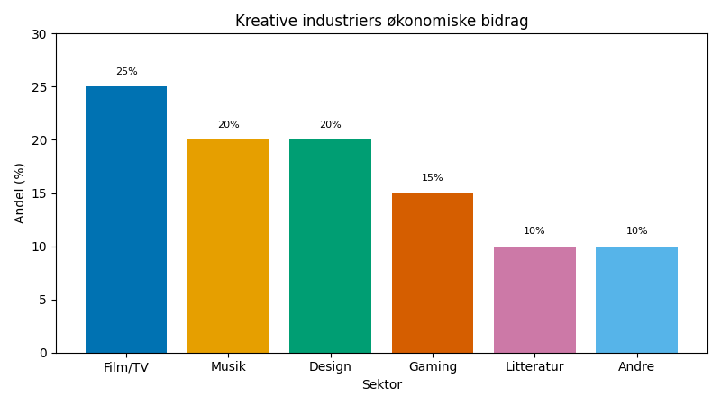
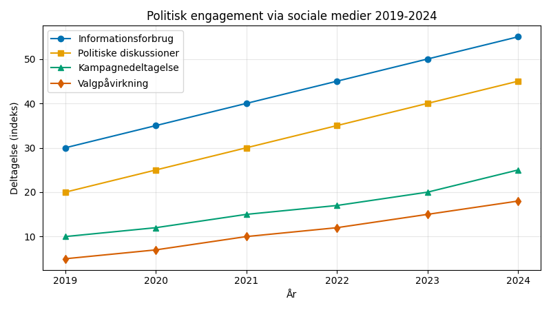
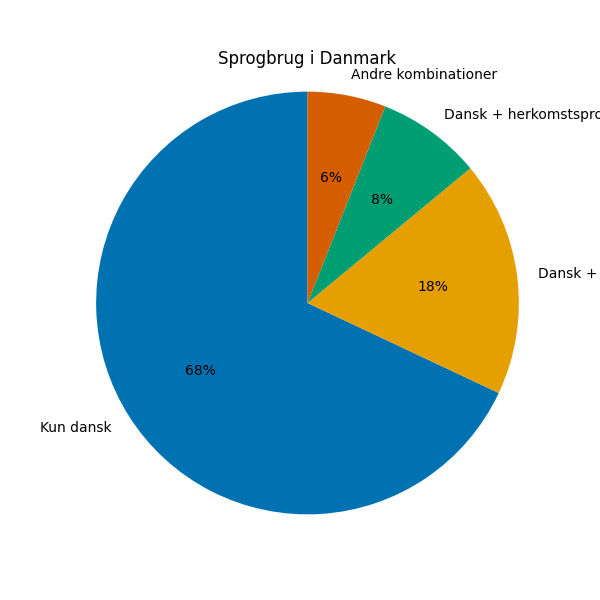

# Studieprøven _Practice Test 19_

  

## Outline

- Læseforståelse (90 minutter)
  - Delprøve 1
  - Delprøve 2A
  - Delprøve 2B
  - Delprøve 3
- Skriftlig fremstilling (3 timer)
- Mundtlig kommunikation (30 minutter)

  Help Den Frie Prøvebank

_This practice test was generated by Den Frie Prøvebank and is unofficial. Den Frie Prøvebank's ability to validate how well its tests match the official tests, in terms of content and structure, is limited. Users should seek guidance from official teaching institutions as to the structure and content of the exams in question._

## Læseforståelse

### Delprøve 1 (25 minutter)
**Ingen hjælpemidler tilladt**

#### Tekstsamling: Kultur og kreative erhverv i Danmark

**Tekst A: Film- og tv‑produktion**

Dansk film- og tv-industri omsætter for 8,7 milliarder kroner årligt og beskæftiger 23 000 personer direkte. Netflix investerer 1,2 milliarder kroner i danske produktioner over tre år, mens HBO Nordic producerer 15 originale serier. Internationale streamingtjenester har skabt 4 500 nye job siden 2020. Dogme 95-bevægelsen påvirker stadig international filmæstetik. Det Danske Filminstitut støtter 340 produktioner årligt med 890 millioner kroner. Koproduktioner med Sverige og Norge udgør 28 % af alle danske film.

**Tekst B: Musik og scenekunst**

Danmarks musikeksport når 2,3 milliarder kroner med kunstnere som MØ, Lukas Graham og Volbeat som internationale succeshistorier. Roskilde Festival tiltrækker 130 000 gæster årligt og genererer 890 millioner kroner i økonomisk aktivitet. Det Kongelige Teater og Opera modtager 1,2 millioner besøgende årligt med 67 % danske og 33 % internationale gæster. Spotify identificerer Danmark som nr. 3 globalt i musikstreaming per indbygger. Musikproducer-uddannelser på Rytmisk Musikkonservatorium uddanner talenter til den globale industri.

**Tekst C: Litteratur og forlagsvirksomhed**

Danske forfattere sælger 12 millioner bøger årligt på globale markeder, med krimigenren som førende eksportprodukt. Jussi Adler-Olsen og Stieg Larsson-effekten skaber Nordic Noir‑brandet. Boghandlerne omsætter for 3,4 milliarder kroner, mens e‑bogssalget udgør 23 % af markedet. 450 oversættere arbejder med dansk litteratur til 67 sprog. Writers' Room‑programmer støtter nye forfattere med 45 millioner kroner årligt. Copenhagen Literature Festival tiltrækker 85 000 deltagere.

**Tekst D: Design og anvendte kunstarter**

Dansk designindustri eksporterer for 67 milliarder kroner årligt med møbler, arkitektur og produktdesign som førende sektorer. IKEA‑effekten populariserer skandinavisk designæstetik globalt. Designskolerne i København og Kolding uddanner 2 300 studerende årligt. Designmuseum Danmark modtager 234 000 besøgende og promoverer dansk designarv. 3D‑print og digital fabrikation revolutionerer traditionelle håndværksindustrier. Bæredygtige designprincipper integreres i 89 % af designvirksomheder.

**Tekst E: Gaming og digital underholdning**

Danmarks gamingindustri vokser med 34 % årligt og omsætter for 4,5 milliarder kroner. Unity Technologies, IO Interactive og Playdead skaber globale gamingsucceser. Esport‑events tiltrækker 890 000 online seere og 45 000 tilskuere på stedet. VR‑ og AR‑applikationer udvikles til uddannelses‑, trænings- og underholdningssektorerne. Copenhagen Game Collective støtter indieudviklere med coworking‑pladser og finansiering. Uddannelsesprogrammer inden for gaming uddanner 1 200 kandidater årligt til den internationale industri.

#### Spørgsmål til tekstsamlingen:

1. For hvor mange milliarder kroner omsætter dansk film- og tv-industri årligt?

2. Hvor mange personer beskæftiger film- og tv-industrien direkte?

3. Hvor mange milliarder kroner investerer Netflix i danske produktioner over tre år?

4. Hvor mange originale serier producerer HBO Nordic?

5. Hvor mange nye job har internationale streamingtjenester skabt siden 2020?

6. Hvor mange produktioner støtter Det Danske Filminstitut årligt?

7. For hvor mange milliarder kroner når Danmarks musikeksport?

8. Hvor mange gæster tiltrækker Roskilde Festival årligt?

9. Hvor mange millioner kroner genererer Roskilde Festival i økonomisk aktivitet?

10. Hvor mange besøgende modtager Det Kongelige Teater og Opera årligt?

11. Hvor mange millioner bøger sælger danske forfattere årligt på globale markeder?

12. For hvor mange milliarder kroner omsætter boghandlerne?

13. Hvor mange procent af markedet udgør e‑bogssalget?

14. For hvor mange milliarder kroner eksporterer dansk designindustri årligt?

15. Med hvor mange procent vokser Danmarks gamingindustri årligt?

### Delprøve 2A (Del af 65 minutter samlet for 2A, 2B og 3)

#### Tekst med fjernede afsnit: Sociale medier og demokrati

_Sæt bogstavet for den rigtige sætning i hvert felt._

Sociale medier har fundamentalt forandret den politiske kommunikation og den demokratiske deltagelse i Danmark. Disse platforme skaber nye muligheder for borgerengagement, men rejser også alvorlige bekymringer omkring misinformation og polarisering.

**(1)** ________

Politiske partier investerer massivt i kampagner på sociale medier med målrettet reklame, som når specifikke vælgersegmenter. Facebook- og Instagram-annoncer koster danske politikere 67 millioner kroner under valgkampene, men reguleringen af politisk reklame er stadig begrænset.

**(2)** ________

Misinformation spredes hurtigt gennem sociale netværk og undergraver den offentlige tillid til demokratiske institutioner. Falske oplysninger om vacciner, valgets integritet og klimaforandringer når millioner af danskere dagligt gennem virale delingsmekanismer.

**(3)** ________

Ekko-kamre og algoritmestyret indholdskuratering fører til øget politisk polarisering, fordi borgerne primært møder information, der bekræfter deres eksisterende overbevisninger. Dette reducerer eksponeringen for forskellige politiske synspunkter.

**(4)** ________

Unge vælgere er i stigende grad afhængige af sociale medier for politisk information, men undervisningen i mediekompetencer i skolerne er utilstrækkelig til at hjælpe eleverne med kritisk at vurdere onlinemedier og genkende manipulationsteknikker.

**(5)** ________

Demokratiets robusthed kræver nye tilgange til regulering af sociale medier, som balancerer ytringsfrihed med beskyttelse mod skadeligt indhold. Internationalt samarbejde bliver essentielt, fordi sociale medieplatforme opererer på tværs af landegrænser.

#### Fjernede afsnit (vælg det rigtige for hver position):

1. Afsnit 1
<ul class="multiple-choice-answers">
1. COVID-19-pandemien demonstrerede, hvordan sociale medier både kan facilitere kommunikation om folkesundhed og sprede farlig misinformation om vacciner og behandlinger.
2. Traditionelle medier kæmper for at fastholde publikums engagement, eftersom sociale medieplatforme tager en stigende del af borgernes opmærksomhed og annonceindtægter.
3. Danske politikere på tværs af partier bruger sociale medier som omkostningseffektive redskaber til direkte kommunikation med vælgere uden traditionelle mediemellemmænd.
</ul>

2. Afsnit 2
<ul class="multiple-choice-answers">
1. Mikromålretning gør det muligt at tilpasse politiske budskaber til individuelle vælgere baseret på omfattende personlige dataprofiler, som indsamles gennem onlinesporing.
2. Udenlandsk indblanding i danske valg foregår gennem manipulationskampagner på sociale medier, som er designet til at påvirke vælgeradfærd og underminere demokratiets legitimitet.
3. Krav om gennemsigtighed for politisk reklame på sociale medier halter efter traditionelle medier, hvilket skaber huller i ansvarligheden i overvågningen af kampagnefinansiering.
</ul>

3. Afsnit 3
<ul class="multiple-choice-answers">
1. Faktatjekorganisationer arbejder for at bekæmpe misinformation, men deres indsats når ofte ikke de samme publikummer som dem, der oprindeligt bliver udsat for falske oplysninger.
2. Statssponsorerede desinformationskampagner retter sig mod danske brugere af sociale medier med sofistikerede psykologiske operationer, der er designet til at så splid og underminere den sociale sammenhængskraft.
3. Konspirationsteorier blomstrer i sociale mediemiljøer, hvor bekræftelsesbias og algoritmisk forstærkning understøtter ekstreme synspunkter og anti‑establishment‑holdninger.
</ul>

4. Afsnit 4
<ul class="multiple-choice-answers">
1. Digitale indfødte vokser op med sociale medier, men mangler ofte de kritiske tænkeevner, der er nødvendige for at vurdere troværdigheden af online politisk information.
2. Sociale medieplatforme eksperimenterer med forskellige tilgange til indholdsmoderation, men politisk indhold udgør særlige udfordringer for automatiske detekteringssystemer.
3. Gruppetryk via sociale medier påvirker politiske holdninger stærkt blandt unge vælgere, som er afhængige af venner og influencers for vejledning om komplekse spørgsmål.
</ul>

5. Afsnit 5
<ul class="multiple-choice-answers">
1. EU's lovgivningsrammer som Digital Services Act forsøger at tackle reguleringen af sociale medier, men implementeringsudfordringerne er betydelige på tværs af medlemsstaterne.
2. Platformenes ansvarsmekanismer skal udvikle sig for at håndtere unikke trusler mod demokratisk diskurs, samtidig med at de grundlæggende rettigheder til ytringsfrihed og politisk debat bevares.
3. Offentlige-private partnerskaber mellem regeringer og sociale medievirksomheder kunne udvikle bedre løsninger til at beskytte den demokratiske integritet uden at kvæle legitim politisk kommunikation.
</ul>

### Delprøve 2B (Del af 65 minutter samlet for 2A, 2B og 3)

#### Tekst: Sprogpolitik og flersprogede samfund

Danmarks sproglige landskab undergår betydelige forandringer, eftersom globalisering og immigration skaber stadig mere flersprogede samfund. Sprogpolitiske beslutninger påvirker social integration, økonomiske muligheder og kulturel identitet for både indvandrere og etniske danskere.

Engelsk dominerer som internationalt kommunikationssprog i erhvervsliv, uddannelse og teknologisektoren. Mange danske universiteter tilbyder uddannelser udelukkende på engelsk for at tiltrække internationale studerende og undervisere. Omkring 67 % af danskerne taler engelsk flydende, hvilket fremmer internationalt samarbejde men vækker bekymring om det danske sprogs vitalitet.

Indvandrersprog som arabisk, tyrkisk og polsk tales af hundredtusinder af beboere og skaber levende flersprogede miljøer, især i byområder. Andengenerationsindvandrere udvikler ofte komplekse sproglige repertoire, som inkluderer modersmål, dansk og engelsk.

Uddannelsesmæssige sprogpolitikker forsøger at balancere integrationsbehov med bevarelse af sproglig mangfoldighed. Dansk som andetsprog (DSA) programmer betjener 89 000 elever årligt, men ressourcefordeling og undervisningskvalitet varierer betydeligt på tværs af kommuner.

Sprogpraksis på arbejdspladsen afspejler økonomiske nødvendigheder, idet internationale virksomheder i stigende grad opererer på engelsk, mens jobs i servicebranchen typisk kræver danskkundskaber. Sprogbarrierer begrænser beskæftigelsesmulighederne for nogle indvandrere og skaber segmentering på arbejdsmarkedet.

Kulturelle bekymringer omkring sprogforandring manifesterer sig i politiske debatter om national identitet og sproglig autenticitet. Nogle politikere går ind for stærkere krav til dansk sprog i uddannelse og i forbindelse med statsborgerskab som et middel til at bevare kulturarven.

Teknologi påvirker sprogbrug gennem oversættelses‑apps, stemmegenkendelsessystemer og kunstig intelligens, som kan formidle tværsproglig kommunikation. Disse værktøjer reducerer barrierer for daglig interaktion, men kan også mindske motivationen for traditionel sprogindlæring.

Rammerne for sproglige menneskerettigheder fremhæver individers ret til at bruge deres modersmål i private sammenhænge, mens de tilegner sig majoritetssproget for at kunne deltage i samfundet. At balancere disse principper kræver nuancerede politiske tilgange, der undgår både assimilations- og segregeringsekstremer.

Fremtidig sprogplanlægning må tage højde for de demografiske realiteter med øget sproglig diversitet, samtidig med at den opretholder social sammenhængskraft og fælles kommunikationsmuligheder på tværs af forskellige befolkningsgrupper i det danske samfund.

#### Spørgsmål til teksten:

_Sæt en cirkel om det rigtige svar._

1. Hvor mange procent af danskerne taler engelsk flydende ifølge teksten?
<ul class="multiple-choice-answers">
1. 58 %, som primært letter international forretning
2. 67 %, som letter samarbejde men vækker bekymring for sprogets vitalitet
3. 74 %, med ingen indvirkning på dansk sprogbrug
</ul>

2. Hvor mange elever deltager årligt i Dansk som andetsprog-programmer?
<ul class="multiple-choice-answers">
1. 76 000 elever ved kommunale programmer
2. 89 000 elever men med varieret kvalitet
3. 95 000 elever gennem et standardiseret pensum
</ul>

3. Hvilke udfordringer ved arbejdssproget nævnes i teksten?
<ul class="multiple-choice-answers">
1. Kun internationale virksomheder, der kun kræver engelsk
2. Engelsk i internationale virksomheder, dansk i servicebranchen, sprogbarrierer begrænser beskæftigelsen
3. Udelukkende dansk på tværs af alle sektorer
</ul>

4. Hvilke teknologiske værktøjer påvirker sprogbrug ifølge teksten?
<ul class="multiple-choice-answers">
1. Kun traditionelle ordbøger og grammatiske ressourcer
2. Oversættelses‑apps, stemmegenkendelse og kunstig intelligens, som formidler kommunikation
3. Primært undervisningssoftware i formelle læringsmiljøer
</ul>

5. Hvad fremhæver rammerne for sproglige menneskerettigheder?
<ul class="multiple-choice-answers">
1. Fuldstændig assimilering til majoritetssproget udelukkende
2. Retten til at bruge modersmålet, mens man tilegner sig majoritetssproget
3. Separate sproglige fællesskaber uden integrationskrav
</ul>

### Delprøve 3 (Del af 65 minutter samlet for 2A, 2B og 3)

#### Tekst med fjernede ord: Kunstens rolle i samfundet

Kunst og kreative erhverv __(1)__ ______ i stigende grad vigtige roller i moderne samfund gennem økonomisk bidrag, social sammenhængskraft og kulturelt udtryk. Danmark __(2)__ ______ betydelige offentlige investeringer i kunst og kultur som anerkendelse af deres samfundsmæssige værdi.

De kreative industrier __(3)__ ______ 4,8 % af den samlede beskæftigelse og bidrager med 156 milliarder kroner årligt til økonomien. Dette __(4)__ ______ omfatter traditionelle kunstformer som musik og litteratur samt nyere sektorer som gaming og digitale medier.

Kulturel deltagelse __(5)__ ______ social integration og fællesskab, især i mangfoldige bykvarterer. Kunstprojekter og kulturfestivaler __(6)__ ______ folk fra forskellige baggrunde og skaber fælles oplevelser, der overskrider sproglige og etniske grænser.

Offentlig finansiering til kunsten __(7)__ ______ debatter om prioritering af ressourcer og måling af kulturel værdi. Kritikere __(8)__ ______ om skatteydernes penge bør støtte aktiviteter, der primært gavner uddannede eliter, mens tilhængere fremhæver bredere sociale fordele.

Digitale teknologier __(9)__ ______ nye muligheder for kunstnerisk skaben og distribution, som udfordrer traditionelle gatekeepere og demokratiserer adgangen til kreative værktøjer. Sociale medieplatforme __(10)__ ______ kunstnere at nå et globalt publikum direkte.

#### Valgmuligheder:

<table class="horizontal-multiple-choice">
  <tbody>
    <tr>
      <td><strong>1</strong></td>
      <td><strong>a.</strong> spiller</td>
      <td><strong>b.</strong> indtager</td>
      <td><strong>c.</strong> har</td>
      <td><strong>d.</strong> tager</td>
    </tr>
    <tr>
      <td><strong>2</strong></td>
      <td><strong>a.</strong> giver</td>
      <td><strong>b.</strong> yder</td>
      <td><strong>c.</strong> leverer</td>
      <td><strong>d.</strong> tilbyder</td>
    </tr>
    <tr>
      <td><strong>3</strong></td>
      <td><strong>a.</strong> repræsenterer</td>
      <td><strong>b.</strong> omfatter</td>
      <td><strong>c.</strong> leverer</td>
      <td><strong>d.</strong> skaber</td>
    </tr>
    <tr>
      <td><strong>4</strong></td>
      <td><strong>a.</strong> område</td>
      <td><strong>b.</strong> sektor</td>
      <td><strong>c.</strong> felt</td>
      <td><strong>d.</strong> industri</td>
    </tr>
    <tr>
      <td><strong>5</strong></td>
      <td><strong>a.</strong> fremmer</td>
      <td><strong>b.</strong> støtter</td>
      <td><strong>c.</strong> promoverer</td>
      <td><strong>d.</strong> øger</td>
    </tr>
    <tr>
      <td><strong>6</strong></td>
      <td><strong>a.</strong> samler</td>
      <td><strong>b.</strong> forener</td>
      <td><strong>c.</strong> bringer sammen</td>
      <td><strong>d.</strong> kombinerer</td>
    </tr>
    <tr>
      <td><strong>7</strong></td>
      <td><strong>a.</strong> skaber</td>
      <td><strong>b.</strong> genererer</td>
      <td><strong>c.</strong> fremkalder</td>
      <td><strong>d.</strong> forårsager</td>
    </tr>
    <tr>
      <td><strong>8</strong></td>
      <td><strong>a.</strong> spørger</td>
      <td><strong>b.</strong> tvivler</td>
      <td><strong>c.</strong> stiller spørgsmålstegn ved</td>
      <td><strong>d.</strong> overvejer</td>
    </tr>
    <tr>
      <td><strong>9</strong></td>
      <td><strong>a.</strong> giver</td>
      <td><strong>b.</strong> skaber</td>
      <td><strong>c.</strong> tilbyder</td>
      <td><strong>d.</strong> muliggør</td>
    </tr>
    <tr>
      <td><strong>10</strong></td>
      <td><strong>a.</strong> sætter</td>
      <td><strong>b.</strong> muliggør</td>
      <td><strong>c.</strong> gør det muligt for</td>
      <td><strong>d.</strong> hjælper</td>
    </tr>
  </tbody>
</table>

## Skriftlig fremstilling (3 timer)
**Alle ordbøger er tilladt**

### Vælg én af følgende tre opgaver:

#### Opgave 1: Kreative erhverv og økonomisk udvikling

**Grafik:** 

**Manchet:** Kreative erhverv bidrager betydeligt til dansk økonomi og internationalt omdømme. Succes kræver en balance mellem kunstnerisk integritet og kommerciel levedygtighed, understøttet af både offentlig finansiering og markedsmekanismer.

**Opgave:** Skriv en sammenhængende tekst på minimum 400 ord, hvor du:
- Analyserer de kreative industriers økonomiske struktur ud fra grafikken
- Diskuterer forholdet mellem kunst, kultur og økonomisk udvikling
- Vurderer rollerne af offentlig støtte versus private investeringer
- Argumenterer for strategier til at styrke den kreative økonomi

#### Opgave 2: Sociale medier og demokratisk deltagelse

**Grafik:** 

**Manchet:** Sociale medier omformer, hvordan danskere deltager i den politiske proces, og skaber både muligheder og trusler for demokratisk styring. Regulering af platforme og digital dannelse bliver afgørende for at beskytte demokratiets integritet.

**Opgave:** Skriv en sammenhængende tekst på minimum 400 ord, hvor du:
- Præsenterer tendenser for politisk engagement ud fra grafikken
- Analyserer både positive og negative effekter på demokratiet
- Diskuterer misinformation, polarisering og ekkokammer‑effekter
- Foreslår løsninger for en sund demokratisk debat online

#### Opgave 3: Sprog og multikulturel integration

**Grafik:** 

**Manchet:** Danmark bliver stadig mere flersproget gennem immigration og globalisering. Sprogpolitikker skal balancere integrationskrav med kulturel mangfoldighed og støtte både social sammenhængskraft og sproglige rettigheder.

**Opgave:** Skriv en sammenhængende tekst på minimum 400 ord, hvor du:
- Redegør for mønstre i sproglig diversitet ud fra grafikken
- Analyserer udfordringer og muligheder i et flersproget samfund
- Diskuterer uddannelsespolitik og sprogkrav på arbejdspladsen
- Vurderer tilgange til bæredygtig sprogplanlægning

_Brug disse sider til at skrive din skriftlige opgave._

---

## Mundtlig kommunikation (30 minutter inkl. votering)

### Opgaveark med tre emner til forberedelse:

#### Emne 1: Kunst og kulturel værdi

**Stikord til inspiration:**
- Offentlig støtte til kunst og markedets økonomi
- Kulturel mangfoldighed og national identitet
- Kreative industrier og økonomisk udvikling
- Digital transformation i kunstnerisk skabelse
- Tilgængelighed og demokratisering af kultur
- Kunstnernes arbejdsvilkår og ophavsret
- Kulturundervisning og æstetisk forståelse
- International kulturel udveksling og soft power

#### Emne 2: Medier og demokrati

**Stikord til inspiration:**
- Sociale medier og politisk kommunikation
- Misinformation og faktatjek
- Ekko‑kamre og politisk polarisering
- Digital dannelse og medieundervisning
- Regulering af platforme og ytringsfrihed
- Traditionelle kontra digitale mediers indflydelse
- Udenlandsk indblanding og valgets integritet
- Unges politiske engagement online

#### Emne 3: Flersprogede samfund

**Stikord til inspiration:**
- Bevarelse og tab af modersmål
- Integration gennem sprogindlæring
- Flersprogethed på arbejdspladsen og økonomiske muligheder
- Uddannelses- og sprogpolitik
- Kulturel identitet og sproglige rettigheder
- Teknologi og oversættelsestjenester
- Generationelle forskelle i sprogbrug
- Bekymringer for det nationale sprogs vitalitet

### Prøveforløb:

1. **Lodtrækning:** Vælg ét af de tre forberedte emner
2. **Præsentation (5 minutter):** Struktureret gennemgang af det valgte emne
3. **Interview (15 minutter):** Uddybende samtale med eksaminator baseret på præsentationen
4. **Votering og karaktergivning (10 minutter)**

### Bedømmelseskriterier:

- **Sproglig korrekthed:** Grammatik, ordforråd og udtale
- **Kommunikativ kompetence:** Evne til at formidle budskaber klart
- **Indholdsrigdom:** Faglig dybde og nuanceret forståelse
- **Struktur:** Logisk opbygning og sammenhæng
- **Interaktion:** Evne til dialog og respons på spørgsmål

---

_This practice test was generated by Den Frie Prøvebank and is unofficial. Den Frie Prøvebank's ability to validate how well its tests match the official tests, in terms of content and structure, is limited. Users should seek guidance from official teaching institutions as to the structure and content of the exams in question._
