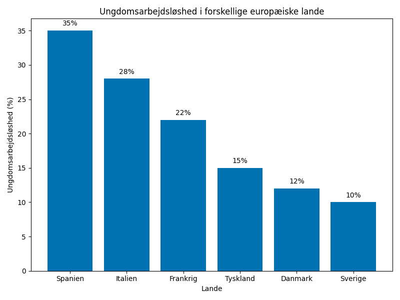
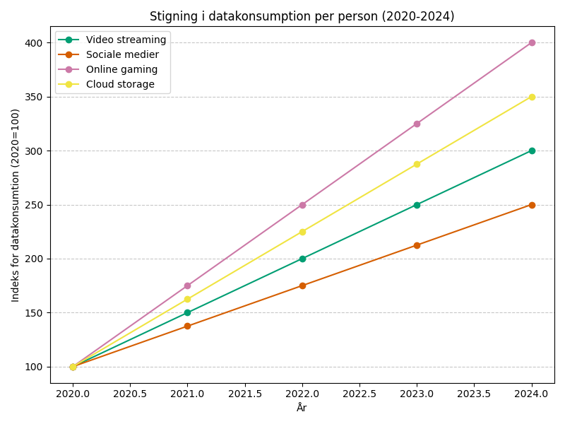
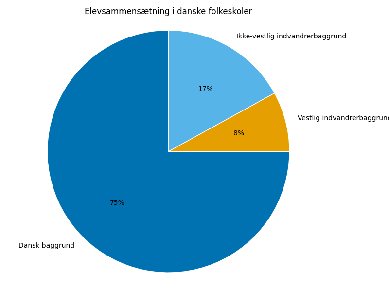

# Studieprøven _Practice Test 2_

  

## Outline

- Læseforståelse (90 minutter)
  - Delprøve 1
  - Delprøve 2A
  - Delprøve 2B
  - Delprøve 3
- Skriftlig fremstilling (3 timer)
- Mundtlig kommunikation (30 minutter)

  Help Den Frie Prøvebank

_This practice test was generated by Den Frie Prøvebank and is unofficial. Den Frie Prøvebank's ability to validate how well its tests match the official tests, in terms of content and structure, is limited. Users should seek guidance from official teaching institutions as to the structure and content of the exams in question._

## Læseforståelse

### Delprøve 1 (25 minutter)
**Ingen hjælpemidler tilladt**

#### Tekstsamling: Innovation og teknologi i Danmark

**Tekst A: Dansk sundhedsteknologi**
Danmark er en global leder inden for sundhedsteknologi og medicinalindustri. Novo Nordisk producerer 50% af verdens insulin og har investeret 18 milliarder kroner i forskning siden 2020. Danske hospitaler bruger AI til diagnosticering, hvilket har reduceret fejldiagnoser med 25%. Telemedicin er blevet udbredt - 40% af konsultationer foregår nu digitalt. Branchen beskæftiger 80.000 personer og eksporterer for 200 milliarder kroner årligt.

**Tekst B: Fintech-revolutionen**
Danmarks digitale betalingssystemer er blandt verdens mest avancerede. 85% af alle transaktioner foregår kontantløst. MobilePay har 4,2 millioner aktive brugere og behandler 1 milliard transaktioner årligt. Danske banker investerer massivt i blockchain-teknologi og kryptovaluta. Finanssektoren har skabt 15.000 nye tech-job siden 2019.

**Tekst C: Grøn shipping-teknologi**
Maersk leder udviklingen af klimaneutral shipping. Virksomheden har bestilt 19 metanol-drevne containerskibe til levering i 2025-2027. Danske værfter specialiserer sig i vindmølle-installationsskibe og har 70% af det globale marked. Shipping-industrien investerer 50 milliarder kroner i grønne teknologier de næste fem år.

**Tekst D: Robotik og automation**
Universal Robots fra Odense har skabt det globale marked for kollaborative robotter. Virksomheden har solgt over 50.000 robotter på verdensplan. Danske fødevarevirksomheder har automatiseret 60% af deres produktionslinjer. Robotteknologi har øget produktiviteten med 35% i fremstillingsindustrien. Danish Technological Institute uddanner 2.000 teknikere i robotik årligt.

**Tekst E: Gaming og digital underholdning**
IO Interactive, skaberne af Hitman-serien, beskæftiger 400 medarbejdere i København. Den danske gaming-industri omsætter for 8 milliarder kroner årligt og vokser med 15% om året. Copenhagen Game Collective har produceret 50 indie-spil siden 2018. Filmens Hus i København er blevet et center for VR-produktion med 25 virksomheder.

#### Spørgsmål til tekstsamlingen:

1. Hvor stor en andel af verdens insulin producerer Novo Nordisk?

2. Hvor mange milliarder kroner har Novo Nordisk investeret i forskning siden 2020?

3. Med hvor mange procent har AI reduceret fejldiagnoser på danske hospitaler?

4. Hvor mange procent af konsultationer foregår nu digitalt?

5. Hvor mange millioner aktive brugere har MobilePay?

6. Hvor mange transaktioner behandler MobilePay årligt?

7. Hvor mange nye tech-job har finanssektoren skabt siden 2019?

8. Hvor mange metanol-drevne containerskibe har Maersk bestilt?

9. Hvor stor en andel af det globale marked for vindmølle-installationsskibe har danske værfter?

10. Hvor mange milliarder kroner investerer shipping-industrien i grønne teknologier?

11. Hvor mange robotter har Universal Robots solgt på verdensplan?

12. Med hvor mange procent har robotteknologi øget produktiviteten i fremstillingsindustrien?

13. Hvor mange medarbejdere beskæftiger IO Interactive?

14. Med hvor mange procent vokser den danske gaming-industri årligt?

15. Hvor mange indie-spil har Copenhagen Game Collective produceret siden 2018?

### Delprøve 2A (Del af 65 minutter samlet for 2A, 2B og 3)

#### Tekst med fjernede afsnit: Klimatilpasning i danske byer

_Sæt bogstavet for den rigtige sætning i hvert felt._

Danske byer står over for stigende udfordringer fra klimaforandringer. Hyppigere ekstremvejr, stigende havniveau og længere tørkeperioder kræver omfattende tilpasninger af den urbane infrastruktur.

**(1)** ________

København har udviklet en omfattende plan for håndtering af skybrud. Byen investerer 16 milliarder kroner i nye kloaksystemer og blå-grønne infrastrukturer. Parker og pladser designes til at fungere som midlertidige vandreservoirer under kraftige regnskyl.

**(2)** ________

Aarhus har implementeret innovative løsninger som permeable belægninger og regnvandshaver. Byen har reduceret oversvømmelsesrisikoen med 40% gennem strategisk byplanlægning. Lokale virksomheder udvikler nye materialer til klimaresistent byggeri.

**(3)** ________

Aalborg fokuserer på kystsikring og havniveaustigning. Byen bygger nye diger og etablerer naturbaserede kystbeskyttelser med klitplantninger og vådområder. Havnearealerne ombygges til at kunne håndtere højere vandstande.

**(4)** ________

Odense har prioriteret grønne tage og facader som del af klimatilpasningen. 30% af byens tage er nu dækket af vegetation, hvilket reducerer temperaturen og håndterer regnvand. Byen har også etableret urbane skove til CO2-binding.

**(5)** ________

Internationale eksperter roser danske byers innovative tilgang til klimatilpasning. FN's klimapanel fremhæver Danmark som foregangsland. Danske løsninger eksporteres nu til byer i hele verden og skaber nye forretningsmuligheder.

#### Fjernede afsnit (vælg det rigtige for hver position):

1. Afsnit 1
<ul class="multiple-choice-answers">
<li>Klimaforandringerne manifesterer sig allerede tydeligt i danske byer. Temperaturer stiger hurtigere i urbane områder end på landet på grund af varmeø-effekten, og dette skaber sundhedsmæssige udfordringer for borgerne.</li>
<li>Forskere forudser, at situationen vil forværres betydeligt de kommende årtier. Nedbørsmængderne vil blive mere uforudsigelige, og ekstremvejr vil optræde hyppigere og med større intensitet end tidligere.</li>
<li>Kommunerne har længe undervurderet omfanget af klimaudfordringerne. Først i de seneste år er der kommet reel politisk vilje til at investere de nødvendige ressourcer i forebyggende tiltag.</li>
</ul>

2. Afsnit 2
<ul class="multiple-choice-answers">
<li>Borgerne spiller en central rolle i klimatilpasningen. Mange københavnere har etableret regnvandstanke og permeable indkørsler på deres private ejendomme for at reducere belastningen på kloaksystemerne.</li>
<li>Teknologiske innovationer driver udviklingen frem. Sensorer og dataanalyse gør det muligt at forudsige og håndtere vejrbegivenheder mere effektivt end nogensinde før.</li>
<li>Samarbejdet med private aktører er afgørende for succesen. Byggevirksomheder og arkitekter udvikler nye standarder for klimaresistent construction, som gradvist implementeres i hele branchen.</li>
</ul>

3. Afsnit 3
<ul class="multiple-choice-answers">
<li>Finansieringen af klimatilpasning er en stor udfordring. Projekterne kræver enorme investeringer, som mange kommuner har svært ved at rejse uden statslig støtte og EU-midler.</li>
<li>Borgerne er generelt positive over for de grønne tiltag. Meningsmålinger viser, at 75% af aarhusianerne støtter investeringerne i klimatilpasning, selv om det betyder højere skatter.</li>
<li>Erhvervslivet ser klimatilpasning som en vækstmulighed. Lokale virksomheder har specialiseret sig i udvikling og produktion af klimateknologi, hvilket skaber arbejdspladser og eksportindtægter.</li>
</ul>

4. Afsnit 4
<ul class="multiple-choice-answers">
<li>Andre danske byer følger nu Aalborgs eksempel med naturbaserede løsninger. Esbjerg og Vejle har iværksat lignende projekter for at beskytte sig mod stigende havniveau.</li>
<li>EU har valgt Aalborg som pilotby for nye klimatilpasningsstrategier. Erfaringerne fra projektet skal bruges til at udvikle retningslinjer for andre europæiske kystbyer.</li>
<li>Klimaforandringerne skaber også økonomiske muligheder for Aalborg. Byen tiltrækker grønne investeringer og maritime virksomheder, der specialiserer sig i offshore vindenergi.</li>
</ul>

5. Afsnit 5
<ul class="multiple-choice-answers">
<li>Fremtiden kræver endnu mere ambitiøse tiltag. Danske byer arbejder på at blive CO2-negative inden 2040 gennem avancerede teknologier som carbon capture og lagring.</li>
<li>Den grønne omstilling har sociale konsekvenser, som kræver opmærksomhed. Det er vigtigt at sikre, at klimatilpasning ikke øger uligheden mellem forskellige kvarterer og befolkningsgrupper.</li>
<li>Succesen skaber forpligtelser over for andre lande. Danmark skal nu hjælpe udviklingslande med at implementere lignende løsninger og dele viden om bæredygtig byudvikling.</li>
</ul>

### Delprøve 2B (Del af 65 minutter samlet for 2A, 2B og 3)

#### Tekst: Fremtidens velfærdsstat i Danmark

Den danske velfærdsmodel står over for grundlæggende udfordringer, der vil kræve omfattende reformer i de kommende årtier. Den demografiske udvikling med en aldrende befolkning presser økonomien, mens globalisering og teknologisk udvikling ændrer arbejdsmarkedets karakter.

Befolkningens alderssammensætning udvikler sig dramatisk. I 2040 vil der være 1,5 millioner danskere over 67 år sammenlignet med 1 million i dag. Samtidig falder antallet af personer i den erhvervsaktive alder. Dette betyder, at færre arbejdende skal finansiere velfærd til flere pensionister og skaber et grundlæggende problem for skattefinansiering af de offentlige ydelser.

Automatisering og kunstig intelligens ændrer arbejdsmarkedet fundamentalt. Mange traditionelle job forsvinder, mens der opstår behov for nye kompetencer. Det kræver massive investeringer i uddannelse og omskoling. Samtidig kan teknologien også forbedre effektiviteten i den offentlige sektor og reducere omkostningerne til administration og service.

Globaliseringen skaber både muligheder og trusler for velfærdsstaten. International konkurrence presser danske virksomheder til at være mere produktive, men skaber også et pres for at sænke skatter og sociale ydelser. EU's regler begrænser Danmarks muligheder for at føre en selvstændig socialpolitik, mens migration fra andre EU-lande kan belaste de sociale systemer.

Klimaforandringerne vil kræve enorme investeringer i grøn omstilling, som konkurrerer med velfærdsinvesteringer om de offentlige ressourcer. Samtidig kan klimatilpasning og grøn teknologi skabe nye arbejdspladser og eksportmuligheder, der styrker den økonomiske base for velfærdsstaten.

Borgernes forventninger til velfærdsstaten ændrer sig også. Yngre generationer ønsker mere fleksible og personaliserede offentlige services, mens ældre generationer prioriterer stabilitet og tryghed. Teknologiske muligheder skaber forventninger om hurtigere og mere effektiv service, hvilket kræver digitalisering af den offentlige sektor.

Politiske løsninger må balancere disse forskellige hensyn. Nogle foreslår højere pensionsalder og lavere offentlige ydelser, mens andre ønsker øgede skatter på høje indkomster og formuer. Teknologioptimister peger på, at automatisering kan reducere behovet for menneskelig arbejdskraft i både private og offentlige sektorer.

#### Spørgsmål til teksten:

_Sæt en cirkel om det rigtige svar._

1. Hvor mange danskere over 67 år forventes der at være i 2040?
<ul class="multiple-choice-answers">
1. 1 million</li>
2. 1,5 millioner</li>
3. 2 millioner</li>
</ul>

2. Hvad er det grundlæggende problem med den demografiske udvikling for velfærdsstaten?
<ul class="multiple-choice-answers">
1. For mange unge mennesker uddanner sig ikke</li>
2. Færre arbejdende skal finansiere velfærd til flere pensionister</li>
3. Indvandring belaster de sociale systemer</li>
</ul>

3. Hvordan kan teknologien potentielt hjælpe velfærdsstaten ifølge teksten?
<ul class="multiple-choice-answers">
1. Ved at skabe flere traditionelle arbejdspladser</li>
2. Ved at forbedre effektiviteten i den offentlige sektor</li>
3. Ved at reducere behovet for uddannelse</li>
</ul>

4. Hvilken udfordring skaber globaliseringen for den danske velfærdsmodel?
<ul class="multiple-choice-answers">
1. Pres for at sænke skatter og sociale ydelser på grund af international konkurrence</li>
2. Større efterspørgsel efter danske produkter</li>
3. Mindre behov for internationale samarbejder</li>
</ul>

5. Hvad karakteriserer forskellen mellem generationernes forventninger til velfærdsstaten?
<ul class="multiple-choice-answers">
1. Ældre ønsker digitalisering, yngre ønsker stabilitet</li>
2. Alle generationer ønsker det samme</li>
3. Yngre ønsker fleksible services, ældre prioriterer stabilitet</li>
</ul>

### Delprøve 3 (Del af 65 minutter samlet for 2A, 2B og 3)

#### Tekst med fjernede ord: Den danske fødevareindustris globale ambitioner

Danmarks fødevareindustri har __(1)__ ______ sig fra en primært hjemmemarkedsorienteret sektor til en __(2)__ ______ eksportvirksomhed. I dag eksporterer Danmark fødevarer for over 170 milliarder kroner årligt til markeder __(3)__ ______ hele verden.

Danske virksomheder som Arla, Danish Crown og Carlsberg har __(4)__ ______ globale brands og investerer massivt i internationale ekspansionsstrategier. Arla har __(5)__ ______ på markeder i Asien og Mellemøsten, hvor efterspørgslen efter højkvalitets mejeriprodukter vokser __(6)__ ______.

Kvalitet og bæredygtighed er blevet centrale __(7)__ ______ i danske fødevarevirksomheders markedsføring. Forbrugere internationalt __(8)__ ______ danske produkter med høje standarder for dyrevelfærd, miljøhensyn og fødevaresikkerhed. Dette giver danske virksomheder en __(9)__ ______ position på premium-segmenterne.

Innovation driver også væksten. Danske virksomheder __(10)__ ______ nye produkter som plantebaserede alternativer, funktionelle fødevarer og personaliseret ernæring, der møder moderne forbrugertendenser.

#### Valgmuligheder:

<table class="horizontal-multiple-choice">
  <tbody>
    <tr>
      <td><strong>1</strong></td>
      <td><strong>a.</strong> ændret</td>
      <td><strong>b.</strong> udviklet</td>
      <td><strong>c.</strong> flyttet</td>
      <td><strong>d.</strong> transformeret</td>
    </tr>
    <tr>
      <td><strong>2</strong></td>
      <td><strong>a.</strong> stor</td>
      <td><strong>b.</strong> global</td>
      <td><strong>c.</strong> vigtig</td>
      <td><strong>d.</strong> moderne</td>
    </tr>
    <tr>
      <td><strong>3</strong></td>
      <td><strong>a.</strong> i</td>
      <td><strong>b.</strong> over</td>
      <td><strong>c.</strong> på</td>
      <td><strong>d.</strong> gennem</td>
    </tr>
    <tr>
      <td><strong>4</strong></td>
      <td><strong>a.</strong> skabt</td>
      <td><strong>b.</strong> købt</td>
      <td><strong>c.</strong> udviklet</td>
      <td><strong>d.</strong> designet</td>
    </tr>
    <tr>
      <td><strong>5</strong></td>
      <td><strong>a.</strong> investeret</td>
      <td><strong>b.</strong> etableret</td>
      <td><strong>c.</strong> ekspanderet</td>
      <td><strong>d.</strong> fokuseret</td>
    </tr>
    <tr>
      <td><strong>6</strong></td>
      <td><strong>a.</strong> hurtigt</td>
      <td><strong>b.</strong> langsomt</td>
      <td><strong>c.</strong> stabilt</td>
      <td><strong>d.</strong> forsigtigt</td>
    </tr>
    <tr>
      <td><strong>7</strong></td>
      <td><strong>a.</strong> værdier</td>
      <td><strong>b.</strong> elementer</td>
      <td><strong>c.</strong> faktorer</td>
      <td><strong>d.</strong> områder</td>
    </tr>
    <tr>
      <td><strong>8</strong></td>
      <td><strong>a.</strong> forbinder</td>
      <td><strong>b.</strong> sammenligner</td>
      <td><strong>c.</strong> vurderer</td>
      <td><strong>d.</strong> køber</td>
    </tr>
    <tr>
      <td><strong>9</strong></td>
      <td><strong>a.</strong> bedre</td>
      <td><strong>b.</strong> stærk</td>
      <td><strong>c.</strong> unik</td>
      <td><strong>d.</strong> særlig</td>
    </tr>
    <tr>
      <td><strong>10</strong></td>
      <td><strong>a.</strong> lancer</td>
      <td><strong>b.</strong> udvikler</td>
      <td><strong>c.</strong> producerer</td>
      <td><strong>d.</strong> markedsfører</td>
    </tr>
  </tbody>
</table>

## Skriftlig fremstilling (3 timer)
**Alle ordbøger er tilladt**

### Vælg én af følgende tre opgaver:

#### Opgave 1: Arbejdsløshed blandt unge i Europa

**Grafik:** 

**Manchet:** Ungdomsarbejdsløshed er et voksende problem i mange europæiske lande. Unge mennesker mellem 16-24 år har ofte svært ved at finde deres første job, hvilket kan få langsigtede konsekvenser for deres karriere og økonomiske situation.

**Opgave:** Skriv en sammenhængende tekst på minimum 400 ord, hvor du:
- Analyserer og præsenterer data fra grafikken
- Diskuterer mulige årsager til forskelle mellem landene
- Vurderer konsekvenserne af høj ungdomsarbejdsløshed
- Foreslår tiltag til at reducere problemet

#### Opgave 2: Digitalt forbrug og miljøpåvirkning

**Grafik:** 

**Manchet:** Vores digitale livsstil forbruger stadig mere energi. Hver gang vi streamer film, deler billeder eller spiller online, bidrager vi til CO2-udslip fra datacentre og netværksinfrastruktur, som mange ikke er bevidste om.

**Opgave:** Skriv en sammenhængende tekst på minimum 400 ord, hvor du:
- Redegør for udviklingen vist i grafikken
- Forklarer sammenhængen mellem digitalt forbrug og miljøpåvirkning
- Diskuterer ansvarsfordelingen mellem individer og virksomheder
- Argumenterer for konkrete løsninger til at reducere digitaliseringens klimaaftryk

#### Opgave 3: Kulturel diversitet i danske skoler

**Grafik:** 

**Manchet:** Danmarks skoler bliver stadig mere multikulturelle. Denne udvikling skaber både muligheder for kulturel læring og udfordringer for undervisningen, da lærere skal håndtere sproglige barrierer og forskellige kulturelle baggrunde.

**Opgave:** Skriv en sammenhængende tekst på minimum 400 ord, hvor du:
- Beskriver den kulturelle sammensætning vist i grafikken
- Analyserer fordele og udfordringer ved kulturel diversitet i skolen
- Diskuterer betydningen for elevernes læring og sociale udvikling
- Vurderer forskellige strategier for at optimere det multikulturelle klasserum

_Brug disse sider til at skrive din skriftlige opgave._

## Mundtlig kommunikation (30 minutter inkl. votering)

### Opgaveark med tre emner til forberedelse:

#### Emne 1: Fremtidens arbejdsliv og work-life balance

**Stikord til inspiration:**
- Fjernarbejde og hjemmekontor
- Firedings arbejdsuge og fleksible timer
- Automatisering og jobsikkerhed
- Stress og mental sundhed på arbejdspladsen
- Livslang læring og kompetenceudvikling
- Generationskonflikter på arbejdsmarkedet
- Ligestilling og forældreorlov
- Gig-economy og freelance-arbejde

#### Emne 2: Social medier og demokrati

**Stikord til inspiration:**
- Misinformation og fake news
- Polarisering af politiske meninger
- Digitale valgtilkendegivelser og kampagner
- Privatliv og overvågning
- Ungdom og politisk engagement
- Internationale påvirkningskampagner
- Regulering af tech-giganter
- Ytringsfriheden online

#### Emne 3: Bæredygtig turisme i Danmark

**Stikord til inspiration:**
- Overtourisme i populære destinationer
- Klimaaftryk fra transportmidler
- Lokale samfund og turistøkonomi
- Naturbevarelse og adgang til naturen
- Kulturel autenticitet og kommercialisering
- Certificering og miljømærkning
- Alternative turismeformer og slow travel
- Post-corona rejsevaner

### Prøveforløb:

1. **Lodtrækning:** Vælg ét af de tre forberedte emner
2. **Præsentation (5 minutter):** Struktureret gennemgang af det valgte emne
3. **Interview (15 minutter):** Uddybende samtale med eksaminator baseret på præsentationen
4. **Votering og karaktergivning (10 minutter)**

### Bedømmelseskriterier:

- **Sproglig korrekthed:** Grammatik, ordforråd og udtale
- **Kommunikativ kompetence:** Evne til at formidle budskaber klart
- **Indholdsrigdom:** Faglig dybde og nuanceret forståelse
- **Struktur:** Logisk opbygning og sammenhæng
- **Interaktion:** Evne til dialog og respons på spørgsmål

---

_This practice test was generated by Den Frie Prøvebank and is unofficial. Den Frie Prøvebank's ability to validate how well its tests match the official tests, in terms of content and structure, is limited. Users should seek guidance from official teaching institutions as to the structure and content of the exams in question._
