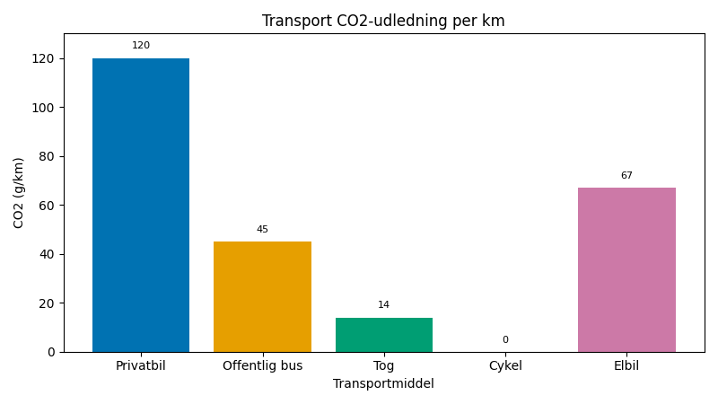
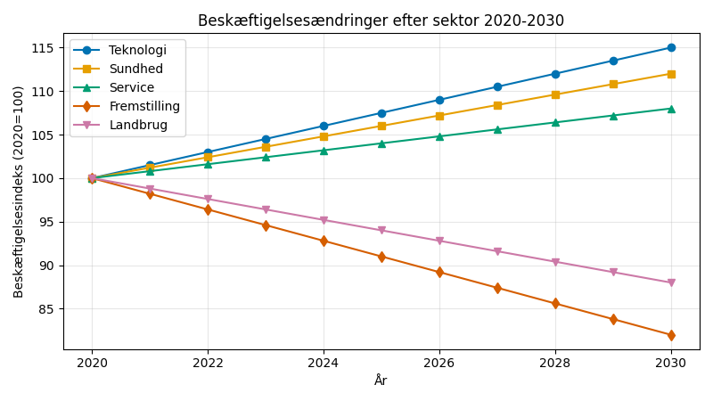
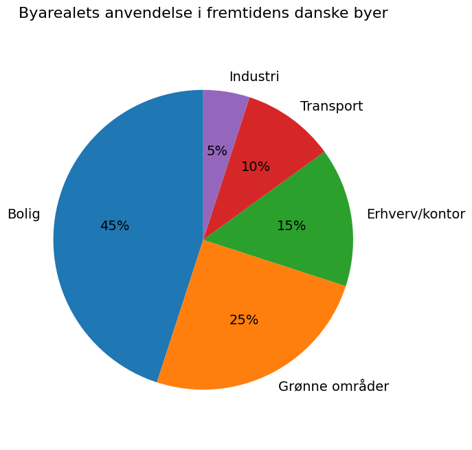

# Studieprøven _Practice Test 20_

  

## Outline

- Læseforståelse (90 minutter)
  - Delprøve 1
  - Delprøve 2A
  - Delprøve 2B
  - Delprøve 3
- Skriftlig fremstilling (3 timer)
- Mundtlig kommunikation (30 minutter)

  Help Den Frie Prøvebank

_This practice test was generated by Den Frie Prøvebank and is unofficial. Den Frie Prøvebank's ability to validate how well its tests match the official tests, in terms of content and structure, is limited. Users should seek guidance from official teaching institutions as to the structure and content of the exams in question._

## Læseforståelse

### Delprøve 1 (25 minutter)
**Ingen hjælpemidler tilladt**

#### Tekstsamling: Transport og mobilitet i fremtidens Danmark

**Tekst A: Offentlig transport og infrastruktur**

DSB kører 3,400 tog dagligt med 380 000 passagerer, mens 45 % af københavnerne cykler til arbejde. Metro Cityringen kostede 23,4 milliarder kroner og transporterer 600 000 passagerer dagligt. Regionaltog elektrificeres for at opnå 87 % fossilfri drift inden 2030. Københavns målsætning er CO₂‑neutral transport i 2025. Letbanen i Aarhus kører med 2,8 millioner passagerer årligt siden åbningen. 156 nye S‑tog købes for 14,6 milliarder kroner over otte år.

**Tekst B: Bilisme og vejinfrastruktur**

Danmarks 2,7 millioner biler kører 56 milliarder kilometer årligt og producerer 12,3 millioner ton CO₂. Elbiler udgør 32 % af nybilsalget med 89 000 registreret i 2023. 4 500 offentlige ladestationer etableres hvert år, men rækkeviddeangst påvirker 67 % af potentielle elbilkøbere. Vedligeholdelsen af vejnettet koster 8,9 milliarder kroner årligt. Road pricing diskuteres for København med en beregnet trafikreduktion på 15 %. Selvkørende køretøjer testes på 67 kilometer kontrollerede motorvejsstrækninger.

**Tekst C: Luftfart og internationale forbindelser**

Københavns Lufthavn betjener 30,3 millioner passagerer årligt til 347 destinationer verden over. SAS flyver 2 300 ruter om ugen fra København med en belægningsgrad på 67 %. Bæredygtigt flybrændstof udgør kun 3 % af det samlede forbrug, mens internationale luftfartsaftaler sigter mod CO₂‑neutralitet i 2050. Forretningsrejser er faldet med 34 % efter COVID, da digitale møder erstatter fysiske møder. Dronetransport til levering testes for last‑mile‑logistik i landdistrikter. Regionale lufthavne i Aalborg og Billund opretholder den internationale forbindelse.

**Tekst D: Cykeltransport og mikromobilitet**

Der er registreret 4,2 millioner cykler i Danmark, og der findes 894 kilometer cykelstier alene i København. Elcykler udgør 47 % af cykelsalget med voksende popularitet blandt ældre og pendlere på længere afstande. Delebike‑systemer fungerer i 23 byer med 12 000 tilgængelige cykler. Ladcykler erstatter 23 % af de urbane varebiler af miljøhensyn. Vintercykling opretholdes gennem saltfri snerydning på den dedikerede cykelinfrastruktur. En hastighedsgrænse på 25 km/t for elcykler sikrer trafiksikkerheden.

**Tekst E: Digital transformation og mobility-as-a-service**

Rejsekortet behandler 890 millioner transaktioner årligt på tværs af flere transportformer. Mobilapps integrerer offentlig transport, delebil‑tjenester og samkørselstjenester i samlede platforme. Data i realtid forbedrer ruteplanlægningen og reducerer den gennemsnitlige ventetid med 23 %. Dynamisk prissætning for offentlig transport testes i myldretider for at styre efterspørgslen. GPS‑sporing på busser opnår 94 % rettidighed. Pilotprojekter med selvkørende shuttlebusser kører på universitetscampusser og hospitalsområder.

#### Spørgsmål til tekstsamlingen:

1. Hvor mange tog kører DSB dagligt?

2. Hvor mange passagerer transporterer DSB dagligt?

3. Hvor mange procent af københavnere bruger cykel til arbejde?

4. Hvor mange milliarder kroner kostede Metro Cityringen?

5. Hvor mange passagerer transporterer Metro Cityringen dagligt?

6. Hvor mange procent fossilfri drift målsættes for regionaltog inden 2030?

7. Hvor mange passagerer kører letbanen i Aarhus årligt?

8. Hvor mange millioner biler er der i Danmark?

9. Hvor mange milliarder kilometer kører danske biler årligt?

10. Hvor mange millioner ton CO₂ producerer danske biler?

11. Hvor mange procent af nybilsalget udgør elbiler?

12. Hvor mange elbiler blev registreret i 2023?

13. Hvor mange offentlige ladestationer installeres årligt?

14. Hvor mange millioner passagerer betjener Københavns Lufthavn årligt?

15. Hvor mange destinationer betjener Københavns Lufthavn verden over?

### Delprøve 2A (Del af 65 minutter samlet for 2A, 2B og 3)

#### Tekst med fjernede afsnit: Fremtidens arbejdsmarked

_Sæt bogstavet for den rigtige sætning i hvert felt._

Automatisering og kunstig intelligens forandrer fundamentalt arbejdets natur i Danmark. Disse teknologiske udviklinger skaber både muligheder for innovation og udfordringer for medarbejdere, hvis job bliver automatiseret.

**(1)** ________

Efter‑ og videreuddannelsesprogrammer bliver essentielle, da arbejdstagere må tilpasse sig nye teknologier og ændrede jobkrav. Arbejdsgivere investerer 23 milliarder kroner årligt i medarbejderuddannelse, men der er fortsat kompetencegab i de tekniske sektorer.

**(2)** ________

Platformøkonomien vokser hurtigt, da gig‑arbejde via apps og digitale platforme giver fleksible beskæftigelsesmuligheder, men uden de traditionelle medarbejderfordele og den jobsikkerhed, der kendetegner standardansættelsesforhold.

**(3)** ________

Udbredelsen af fjernarbejde accelererede efter COVID‑19‑pandemien, med 67 % af vidensarbejdere, der opretholder hybride tidsplaner, som kombinerer hjemmearbejde og kontorarbejde. Dette ændrer bosætningsmønstre og byplanlægningsprioriteter.

**(4)** ________

Den grønne omstilling skaber nye jobmuligheder inden for vedvarende energi, energieffektivitet og miljøteknologiske sektorer, men kræver omfattende omskoling af arbejdsstyrken fra traditionelle industrier.

**(5)** ________

De sociale beskyttelsessystemer skal udvikles for at imødekomme de skiftende ansættelsesmønstre og sikre økonomisk tryghed for arbejdstagere på et stadigt mere fleksibelt og usikkert arbejdsmarked gennem hele karrieren.

#### Fjernede afsnit (vælg det rigtige for hver position):

1. Afsnit 1
<ul class="multiple-choice-answers">
1. Fremstillingsjobs forsvinder, fordi robotter og automatiserede systemer erstatter menneskelige arbejdere på samlebånd og i rutineprægede produktionsprocesser.
2. Kunstig intelligens forstærker menneskelige evner snarere end fuldstændigt at erstatte arbejdere, hvilket skaber nye hybride roller, som kombinerer menneskelig dømmekraft med maskinernes effektivitet.
3. Beskæftigelsen i servicesektoren vokser, fordi personlig omsorg, kreativitet og komplekse problemløsningsopgaver fortsat er svære for maskiner at automatisere helt.
</ul>

2. Afsnit 2
<ul class="multiple-choice-answers">
1. Digitale færdigheder bliver grundlæggende, da stort set alle jobs kræver et vist niveau af computerfærdigheder og teknologisk kompetence for at udføre basale opgaver.
2. Livslang læring forvandles fra frivillig personlig udvikling til et obligatorisk krav for at bevare beskæftigelsesegnethed i et hurtigt forandrende teknologisk landskab.
3. Universiteter og erhvervsskoler omdesigner læreplanerne for at fremhæve tilpasningsevne og kritisk tænkning frem for specifikke tekniske færdigheder, som hurtigt bliver forældede.
</ul>

3. Afsnit 3
<ul class="multiple-choice-answers">
1. Gig‑økonomien tilbyder hidtil uset fleksibilitet for arbejdstagere, som kan vælge deres arbejdstider og arbejdsordninger efter personlige præferencer og livsomstændigheder.
2. Fagforeninger har svært ved at organisere platformarbejdere, da de traditionelle kollektive forhandlingsstrukturer ikke tager højde for spredte ansættelsesforhold på tværs af digitale platforme.
3. Skattesystemerne kræver opdatering, da platformarbejde udfordrer de traditionelle skel mellem ansatte og selvstændige med hensyn til skatteopkrævning.
</ul>

4. Afsnit 4
<ul class="multiple-choice-answers">
1. Byernes ejendomsmarkeder tilpasser sig, efterhånden som efterspørgslen efter kontorplads falder, mens forstæder og landdistrikter oplever øget efterspørgsel efter boliger fra fjernarbejdere.
2. Balancen mellem arbejde og fritid forbedres, fordi medarbejdere undgår pendlingstid og bedre kan integrere familiemæssige forpligtelser med professionelle opgaver gennem fleksible ordninger.
3. Problemer med digital ulighed opstår, da fjernarbejde kræver pålidelig internetadgang og passende teknologi, som ikke alle arbejdere har råd til eller lige adgang til.
</ul>

5. Afsnit 5
<ul class="multiple-choice-answers">
1. Den vedvarende energisektor skaber 45 000 nye job inden for vindkraft, solenergiinstallation og energilagringsteknologier, hvilket opvejer jobtabene i fossilbrændstofindustrien.
2. Principperne for cirkulær økonomi genererer beskæftigelse inden for affaldsreduktion, genbrugsinnovation og bæredygtigt produktdesign, efterhånden som traditionelle lineære produktionsmodeller bliver forældede.
3. Arbejdet med miljøgenopretning udvides, da klimatilpasning og forureningsoprydning kræver menneskelige arbejdere til komplekse vurderings‑ og genopretningsprojekter.
</ul>

### Delprøve 2B (Del af 65 minutter samlet for 2A, 2B og 3)

#### Tekst: Bæredygtig turisme og overtourism

Danmark modtager 15,8 millioner internationale turister årligt, som bidrager med 156 milliarder kroner til økonomien og skaber 165 000 arbejdspladser. Turismevækst giver økonomiske fordele, men skaber også miljøpres og påvirkninger på lokalsamfund, især i populære destinationer som København og kystområder.

Overturisme manifesterer sig gennem overfyldte attraktioner, boligmangel og stigende leveomkostninger for beboere i turistrige kvarterer. Venedig‑syndromet rammer historiske bycentre, når korttidsudlejninger erstatter permanente boliger, og lokale virksomheder primært henvender sig til turister frem for beboere.

Krydstogtturisme genererer betydelige indtægter, men skaber også store miljøpåvirkninger gennem luftforurening, affaldsbortskaffelse og trængsel i vandvejene. København modtager 890 000 krydstogtpassagerer årligt, hvilket skaber koncentrerede besøgsvolumener, som belaster infrastrukturen og de offentlige tjenester i højsæsonen.

Bæredygtige turismeinitiativer fokuserer på at reducere det miljømæssige fodaftryk gennem kulstofneutrale overnatningssteder, lokal madforsyning og affaldsreducerende programmer. Miljømærkningsordninger hjælper turister med at identificere ansvarlige muligheder, men udbredelsen er fortsat begrænset sammenlignet med konventionelle turismeprodukter.

Destinationsledelsesstrategier forsøger at fordele turiststrømme mere jævnt på tværs af regioner og sæsoner gennem markedsføringskampagner, der promoverer mindre kendte attraktioner og rejser uden for højsæsonen. Udvikling af landturisme giver alternative destinationer, som reducerer presset på overfyldte byområder.

Digital teknologi muliggør bedre styring af besøgsstrømme gennem realtidskapacitetsmonitorering, forudgående bookingsystemer og dynamisk prissætning, som opmuntrer til besøg i mindre travle perioder. Mobilapps giver information om alternative attraktioner, når populære steder når kapacitetsgrænserne.

Det bliver en udfordring at bevare kulturel autenticitet, når turistkrav former lokale tilbud, og traditionelle praksisser bliver opført snarere end levet. Balancen mellem økonomiske gevinster og kulturbevarelse kræver omhyggelig planlægning og inddragelse af lokalsamfundet i beslutninger om turismeudvikling.

Klimaforandringer påvirker turismemønstre, idet stigende temperaturer gør nordlige destinationer mere attraktive, mens traditionelle sommerdestinationer bliver mindre behagelige. Stigende havniveau truer kystnær turismeinfrastruktur, og stranderosion reducerer de rekreative muligheder i sårbare områder.

Internationalt samarbejde hjælper med at håndtere grænseoverskridende turismepåvirkninger og udvikler fælles standarder for bæredygtig praksis. EU‑initiativer fremmer grønne turismekorridorer og støtter lokalsamfund i at håndtere turismepres, samtidig med at de bevarer de økonomiske gevinster fra besøgendes forbrug.

#### Spørgsmål til teksten:

_Sæt en cirkel om det rigtige svar._

1. Hvor mange millioner internationale turister modtager Danmark årligt ifølge teksten?
<ul class="multiple-choice-answers">
1. 13,2 millioner med voksende asiatiske markeder
2. 15,8 millioner som bidrager med 156 milliarder kroner
3. 18,4 millioner primært fra nabolande
</ul>

2. Hvor mange krydstogtpassagerer modtager København årligt?
<ul class="multiple-choice-answers">
1. 650 000 passagerer gennem flere terminaler
2. 890 000 passagerer, som belaster infrastrukturen i højsæsonen
3. 1,2 millioner passagerer med miljøpåvirkninger
</ul>

3. Hvilke bæredygtige turismeinitiativer nævnes i teksten?
<ul class="multiple-choice-answers">
1. Kun kulstofneutrale overnatningssteder og grundlæggende affaldsreduktion
2. Kulstofneutrale overnatningssteder, lokal madforsyning, affaldsreduktion og miljømærkningsordninger
3. Primært internationale certificeringsprogrammer uden lokal implementering
</ul>

4. Hvordan hjælper digital teknologi med at styre besøgsstrømme?
<ul class="multiple-choice-answers">
1. Realtidskapacitetsmonitorering, forudgående bookingsystemer, dynamisk prissætning og mobilapps
2. Kun grundlæggende bookingsystemer og enkle mobilapplikationer
3. Avancerede AI‑systemer uden realtidsmonitoreringskapaciteter
</ul>

5. Hvilke klimaændringspåvirkninger på turisme nævnes?
<ul class="multiple-choice-answers">
1. Kun stigende temperaturer, der gør nordlige destinationer mere attraktive
2. Stigende temperaturer, nordlig destinationsattraktivitet, havvandsstigning og stranderosion
3. Primært økonomiske påvirkninger uden miljøovervejelser
</ul>

### Delprøve 3 (Del af 65 minutter samlet for 2A, 2B og 3)

#### Tekst med fjernede ord: Fremtidens byer og byplanlægning

Danske byer __(1)__ ______ betydelige forandringer som svar på klimaforandringer, befolkningstilvækst og ændrede livsstilspræferencer. Smart‑city‑teknologier __(2)__ ______ nye muligheder for effektiv ressourceforvaltning og forbedret livskvalitet.

Urban fortætning __(3)__ ______ boligmanglen gennem vertikal udvikling og bygninger med blandet anvendelse, som kombinerer bolig, handel og kontor. Denne tilgang __(4)__ ______ effektiviteten af den offentlige transport og reducerer byspredning.

Grøn infrastruktur __(5)__ ______ regnvandshåndtering og skaber rekreative områder som byskove og lommeparker i hele bykvarterer. Disse løsninger __(6)__ ______ både miljømæssige fordele og sociale samlingssteder for beboere.

Digitale sensorer __(7)__ ______ data i realtid om luftkvalitet, trafikstrømme og energiforbrug, som gør det muligt at tilpasse bystyringssystemer. Disse oplysninger __(8)__ ______ mere responsive offentlige tjenester og bedre ressourceallokering.

Borgerinddragelse __(9)__ ______ afgørende for succesfuld byplanlægning, da beboerne besidder lokal viden og skal leve med udviklingsbeslutningerne. Platforme for borgerinddragelse __(10)__ ______ input fra forskellige befolkningsgrupper gennem planlægningsprocessen.

#### Valgmuligheder:

<table class="horizontal-multiple-choice">
  <tbody>
    <tr>
      <td><strong>1</strong></td>
      <td><strong>a.</strong> gennemgår</td>
      <td><strong>b.</strong> undergår</td>
      <td><strong>c.</strong> erfarer</td>
      <td><strong>d.</strong> oplever</td>
    </tr>
    <tr>
      <td><strong>2</strong></td>
      <td><strong>a.</strong> skaber</td>
      <td><strong>b.</strong> leverer</td>
      <td><strong>c.</strong> tilbyder</td>
      <td><strong>d.</strong> giver</td>
    </tr>
    <tr>
      <td><strong>3</strong></td>
      <td><strong>a.</strong> adresserer</td>
      <td><strong>b.</strong> takler</td>
      <td><strong>c.</strong> løser</td>
      <td><strong>d.</strong> behandler</td>
    </tr>
    <tr>
      <td><strong>4</strong></td>
      <td><strong>a.</strong> støtter</td>
      <td><strong>b.</strong> understøtter</td>
      <td><strong>c.</strong> fremmer</td>
      <td><strong>d.</strong> hjælper</td>
    </tr>
    <tr>
      <td><strong>5</strong></td>
      <td><strong>a.</strong> forvalter</td>
      <td><strong>b.</strong> håndterer</td>
      <td><strong>c.</strong> administrerer</td>
      <td><strong>d.</strong> styrer</td>
    </tr>
    <tr>
      <td><strong>6</strong></td>
      <td><strong>a.</strong> tilbyder</td>
      <td><strong>b.</strong> giver</td>
      <td><strong>c.</strong> leverer</td>
      <td><strong>d.</strong> skaber</td>
    </tr>
    <tr>
      <td><strong>7</strong></td>
      <td><strong>a.</strong> indsamler</td>
      <td><strong>b.</strong> samler</td>
      <td><strong>c.</strong> opsamler</td>
      <td><strong>d.</strong> indhenter</td>
    </tr>
    <tr>
      <td><strong>8</strong></td>
      <td><strong>a.</strong> muliggør</td>
      <td><strong>b.</strong> bevirker</td>
      <td><strong>c.</strong> tillader</td>
      <td><strong>d.</strong> skaber</td>
    </tr>
    <tr>
      <td><strong>9</strong></td>
      <td><strong>a.</strong> er</td>
      <td><strong>b.</strong> bliver</td>
      <td><strong>c.</strong> forbliver</td>
      <td><strong>d.</strong> vedbliver</td>
    </tr>
    <tr>
      <td><strong>10</strong></td>
      <td><strong>a.</strong> faciliterer</td>
      <td><strong>b.</strong> letter</td>
      <td><strong>c.</strong> muliggør</td>
      <td><strong>d.</strong> hjælper</td>
    </tr>
  </tbody>
</table>

## Skriftlig fremstilling (3 timer)
**Alle ordbøger er tilladt**

### Vælg én af følgende tre opgaver:

#### Opgave 1: Transport og miljøpåvirkning

**Grafik:** 

**Manchet:** Transport står for en betydelig del af Danmarks CO₂‑udslip. Overgangen til bæredygtige transportformer kræver investeringer i infrastruktur, teknologi og ændrede adfærdsmønstre blandt borgerne.

**Opgave:** Skriv en sammenhængende tekst på minimum 400 ord, hvor du:
- Analysér CO₂‑udledningsmønstrene fra de forskellige transportformer i grafikken
- Diskutér barrierer og muligheder for overgangen til bæredygtig mobilitet
- Vurdér rollen af offentlig regulering versus ændring i individuel adfærd
- Argumentér for strategier til at reducere transportens miljøpåvirkning

#### Opgave 2: Arbejdsmarked og teknologisk forandring

**Grafik:** 

**Manchet:** Automatisering og digitalisering forandrer danske arbejdspladser hurtigt. Succes i overgangen kræver koordinerede indsatser mellem uddannelsesinstitutioner, arbejdsgivere og myndigheder for at støtte arbejdstagerne gennem den økonomiske omstilling.

**Opgave:** Skriv en sammenhængende tekst på minimum 400 ord, hvor du:
- Præsenter beskæftigelsesprognoserne fra grafikken
- Analysér årsagerne til og konsekvenserne af de sektorspecifikke ændringer i beskæftigelsen
- Diskutér behovet for omskoling og uddannelsespolitiske reaktioner
- Foreslå metoder til at håndtere automatiseringens sociale konsekvenser

#### Opgave 3: Byers udvikling og bæredygtighed

**Grafik:** 

**Manchet:** Danske byer vokser og fortættes for at rumme befolkningstilvæksten og klimamålene. Byplanlægningen skal balancere boligbehov, miljømæssig bæredygtighed og beboernes livskvalitet.

**Opgave:** Skriv en sammenhængende tekst på minimum 400 ord, hvor du:
- Redegør for fordelingen af byarealet ifølge grafikken
- Analysér udfordringer og muligheder i bæredygtig byudvikling
- Diskutér smart‑city‑teknologier og borgerdeltagelse
- Vurdér tilgange til at skabe levende og miljøansvarlige byer

_Brug disse sider til at skrive din skriftlige opgave._

## Mundtlig kommunikation (30 minutter inkl. votering)

### Opgaveark med tre emner til forberedelse:

#### Emne 1: Transport og mobilitet

**Stikord til inspiration:**
- Bæredygtige transportformer og miljøpåvirkning
- Investering i offentlig transport og tilgængelighed
- Elbiler og ladeinfrastruktur
- Cykelkultur og byplanlægning
- Selvkørende køretøjer og trafiksikkerhed
- Ændring af rejseadfærd og politiske incitamenter
- Mobilitetsløsninger i landdistrikter kontra byområder
- International godstransport og global tilslutning

#### Emne 2: Fremtidens arbejde

**Stikord til inspiration:**
- Automatisering og bekymringer om jobtab
- Omskoling og krav om livslang læring
- Platformøkonomi og fleksibilitet i gig‑arbejde
- Fjernarbejde og byudviklingsmønstre
- Grønne job og overgangen til en bæredygtig økonomi
- Social beskyttelse på et arbejdsmarked i forandring
- Digitale færdigheder og teknologisk kunnen
- Balancen mellem arbejde og fritid i fleksible ansættelser

#### Emne 3: Bæredygtige byer

**Stikord til inspiration:**
- Smart‑city‑teknologier og privatlivsbekymringer
- Byfortætning og boligoverkommelighed
- Grøn infrastruktur og klimatilpasning
- Offentlig deltagelse i byplanlægning
- Håndtering af turisme og indvirkning på lokalsamfund
- Energieffektivitet i bymiljøer
- Social retfærdighed i bæredygtig udvikling
- Regional balance og land‑til‑by‑migration

### Prøveforløb:

1. **Lodtrækning:** Vælg ét af de tre forberedte emner
2. **Præsentation (5 minutter):** Struktureret gennemgang af det valgte emne
3. **Interview (15 minutter):** Uddybende samtale med eksaminator baseret på præsentationen
4. **Votering og karaktergivning (10 minutter)**

### Bedømmelseskriterier:

- **Sproglig korrekthed:** Grammatik, ordforråd og udtale
- **Kommunikativ kompetence:** Evne til at formidle budskaber klart
- **Indholdsrigdom:** Faglig dybde og nuanceret forståelse
- **Struktur:** Logisk opbygning og sammenhæng
- **Interaktion:** Evne til dialog og respons på spørgsmål

---

_This practice test was generated by Den Frie Prøvebank and is unofficial. Den Frie Prøvebank's ability to validate how well its tests match the official tests, in terms of content and structure, is limited. Users should seek guidance from official teaching institutions as to the structure and content of the exams in question._
