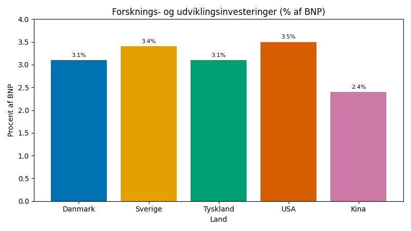
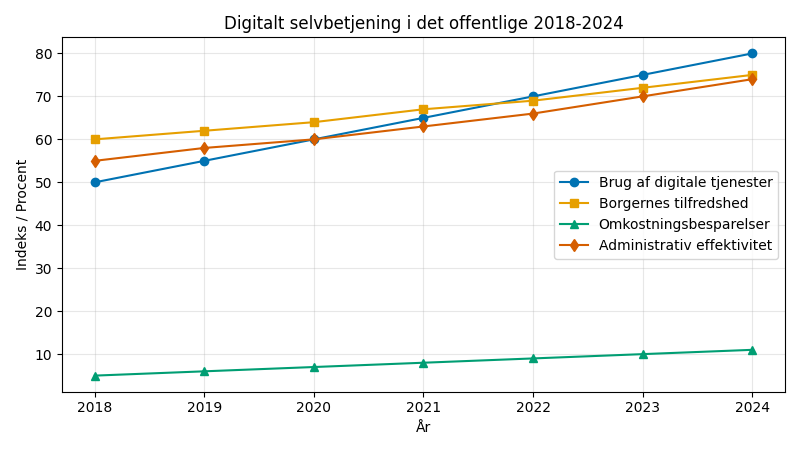

# Studieprøven _Practice Test 21_

  

## Outline

- Læseforståelse (90 minutter)
  - Delprøve 1
  - Delprøve 2A
  - Delprøve 2B
  - Delprøve 3
- Skriftlig fremstilling (3 timer)
- Mundtlig kommunikation (30 minutter)

  Help Den Frie Prøvebank

_This practice test was generated by Den Frie Prøvebank and is unofficial. Den Frie Prøvebank's ability to validate how well its tests match the official tests, in terms of content and structure, is limited. Users should seek guidance from official teaching institutions as to the structure and content of the exams in question._

## Læseforståelse

### Delprøve 1 (25 minutter)
**Ingen hjælpemidler tilladt**

#### Tekstsamling: Innovation og entreprenørskab i Danmark

**Tekst A: Startup‑økosystemet i Danmark**

København rangerer som nr. 6 globalt for startup‑økosystemet med over 2 400 tech‑startups registreret i 2024. Venturekapitalinvesteringer nåede 34 milliarder kroner, en stigning på 67 % siden 2020. Enhjørningevirksomheder som Zendesk og Unity skaber internationale succeshistorier. Acceleratorprogrammer som Techstars og Startupbootcamp støtter 340 nye virksomheder årligt. Danmarks digitale infrastruktur rangerer som nr. 2 globalt og tiltrækker internationale teknologitalenter.

**Tekst B: Forskning og udvikling i danske virksomheder**

Danske virksomheder investerer 3,2 % af BNP i forskning og udvikling, hvilket placerer landet som nr. 4 i OECD. Novo Nordisk bruger 23 milliarder kroner årligt på lægemiddelforskning med 145 projekter i udvikling. Maersk investerer 12 milliarder kroner i grøn skibsfartsteknologi og alternative brændstoffer. Ørsted har udviklet verdens største portefølje af havvindmølleparker med 8 900 MW installeret kapacitet. Patentansøgninger fra danske virksomheder er steget med 78 % siden 2020.

**Tekst C: Digitale platforme og e‑handel**

Den danske e‑handelsomsætning nåede 156 milliarder kroner i 2024 med 89 % af danskerne som aktive online‑shoppere. Just Eat Takeaway dominerer madudbringning med en markedsandel på 67 % og 2,8 millioner aktive brugere om måneden. Trustpilot faciliterer 145 millioner anmeldelser årligt og opererer i 67 lande. Fintech‑sektoren vokser med 45 % årligt med mobile betalingsløsninger som MobilePay, der bruges af 4,2 millioner danskere. Blockchain og kryptovalutaanvendelsen når 23 % af befolkningen.

**Tekst D: Grøn teknologi og cleantech‑innovation**

Danmarks cleantech‑eksport udgør 234 milliarder kroner årligt med vindenergi som den førende sektor. Vestas har installeret 156 000 vindturbiner globalt og beskæftiger 29 000 personer globalt. Danfoss udvikler energieffektive løsninger, der sparer 67 millioner ton CO₂ årligt globalt. Grøn brint‑teknologi testes i 23 projekter med potentiale for 890 000 ton årlig produktion. Startups inden for cirkulær økonomi tiltrækker 8,9 milliarder kroner i finansiering med fokus på affaldsreduktion og bæredygtige materialer.

**Tekst E: Innovation inden for sundhedsteknologi**

Medtech‑sektoren omsætter for 89 milliarder kroner med 67 % til eksport på globale markeder. Coloplast udvikler medicinske apparater til 2,3 millioner patienter globalt og investerer 2,1 milliarder kroner i forskning og udvikling årligt. Digitale sundheds‑startups som Corti og Brain+ bruger kunstig intelligens til at forbedre diagnostik og patientresultater. Biobank Danmark indsamler data fra 890 000 borgere til forskning i personaliseret medicin. Telemedicinske platforme bruges af 78 % af danske hospitaler og reducerer patienttransport med 45 %.

#### Spørgsmål til tekstsamlingen:

1. Hvor rangerer København globalt for startup‑økosystemet?

2. Hvor mange tech‑startups er registreret i Danmark i 2024?

3. Hvor mange milliarder kroner nåede venturekapitalinvesteringerne?

4. Med hvor mange procent er venturekapitalinvesteringerne steget siden 2020?

5. Hvor mange nye virksomheder støtter acceleratorprogrammer årligt?

6. Hvor mange procent af BNP investerer danske virksomheder i forskning og udvikling?

7. Hvor mange milliarder kroner bruger Novo Nordisk årligt på forskning?

8. Hvor mange projekter har Novo Nordisk i udvikling?

9. Hvor stor en installeret kapacitet (MW) har Ørsted i havvindmølleparker?

10. Med hvor mange procent er patentansøgningerne steget siden 2020?

11. Hvor mange milliarder kroner nåede den danske e‑handelsomsætning i 2024?

12. Hvor mange procent af danskerne er aktive online‑shoppere?

13. Hvor stor en markedsandel har Just Eat Takeaway?

14. Hvor mange millioner aktive brugere har Just Eat om måneden?

15. Hvor mange milliarder kroner udgør Danmarks cleantech‑eksport årligt?

### Delprøve 2A (Del af 65 minutter samlet for 2A, 2B og 3)

#### Tekst med fjernede afsnit: Bæredygtig mad og fødevareproduktion

_Sæt bogstavet for den rigtige sætning i hvert felt._

Danmarks fødevareindustri gennemgår en omfattende transformation mod bæredygtighed. Klimaforandringer, forbrugerefterspørgsmål og internationale reguleringer driver innovation på tværs af hele værdikæden fra jord til bord.

**(1)** ________

Plantebaserede alternativer oplever eksplosiv vækst med danske virksomheder som Naturli' og Simple Feast som pionerer. Køderstatninger har vundet 23 % markedsandel på kun tre år, drevet af både miljøhensyn og sundhedsbevidste forbrugere.

**(2)** ________

Økologisk landbrug omfatter nu 13,4 % af det samlede dyrkningsareal, men møder udfordringer med lavere udbytte og højere produktionsomkostninger. Forbrugerne betaler højere priser, men væksten er langsommere end de politiske målsætninger.

**(3)** ________

Præcisionslandbrug revolutionerer traditionelt landbrug gennem GPS‑styring, droner og sensorer. Kunstig intelligens analyserer jordforholdene og optimerer gødningsfordelingen, hvilket reducerer miljøpåvirkningen og øger udbyttet pr. hektar.

**(4)** ________

Alternative proteiner som insekter, alger og laboratoriedyrket kød udvikles som løsninger på fremtidens proteinbehov. Danske forskere og startups eksperimenterer med innovative produktionsmetoder.

**(5)** ________

Regeringens klimaplan kræver 70 % CO₂‑reduktion inden 2030, hvilket nødvendiggør fundamentale ændringer i både produktion og forbrug. Balancen mellem miljøhensyn og fødevaresikkerhed bliver central i fremtidige politiske beslutninger.

#### Fjernede afsnit (vælg det rigtige for hver position):

1. Afsnit 1
<ul class="multiple-choice-answers">
1. Madspild udgør 32 % af husholdningernes samlede fødevareindkøb og koster danske familier gennemsnitligt 8 400 kroner årligt i kasserede produkter.
2. Kødindustriens miljøpåvirkning står for 67 % af landbrugets samlede CO₂‑udslip, hvilket skaber pres for at reducere omfanget af animalsk produktion.
3. EU's ”Farm to Fork”-strategi fastsætter ambitiøse mål for pesticidreduktion og økologisk landbrug, som påvirker danske landmænds produktionsmetoder.
</ul>

2. Afsnit 2
<ul class="multiple-choice-answers">
1. Supermarkedskæder som Coop og Netto investerer massivt i plantebaserede produktlinjer for at imødekomme skiftende forbrugerpræferencer og miljøbevidsthed.
2. Eksporten af danske kødprodukter møder stigende modstand på internationale markeder, hvor importlande indfører CO₂‑tariffer på animalske produkter.
3. Markedsføring af klimavenlige fødevarer kræver nye certificeringssystemer og mærkningsstandarder for at guide forbrugere mod bæredygtige valg.
</ul>

3. Afsnit 3
<ul class="multiple-choice-answers">
1. Danske landmænd modtager EU‑subsidier til omstilling til økologisk drift, men bureaukratiske processer og certificeringskrav skaber administrative byrder.
2. Biodiversiteten på landbrugsarealer forbedres gennem økologiske metoder, men global fødevaresikkerhed kræver balance mellem miljøhensyn og produktivitet.
3. Bylandbrug og lodret landbrug testes i danske byer som supplement til traditionel fødevareproduktion og for at reducere transportudledninger.
</ul>

4. Afsnit 4
<ul class="multiple-choice-answers">
1. Datadrevet landbrug muliggør overvågning i realtid af afgrøders sundhed og optimeret ressourceallokering baseret på vejrprognoser og jordforhold.
2. Robotter og automatiserede systemer revolutionerer høst og markstyring, hvilket reducerer arbejdskraftomkostningerne og øger præcisionen i landbrugsdriften.
3. Klimaresistente afgrødesorter udvikles gennem avancerede avlsteknikker og genetisk modificering for at tilpasse sig ændrede temperaturer og nedbørsmønstre.
</ul>

5. Afsnit 5
<ul class="multiple-choice-answers">
1. Laboratoriedyrket kødteknologi lover at revolutionere proteinproduktionen uden traditionel husdyrdrift og dens tilknyttede miljøpåvirkninger.
2. Insektfarme etableres i Danmark for bæredygtig proteinproduktion med betydeligt lavere ressourcekrav end konventionel animalsk produktion.
3. Tangdyrkning udvides som en kulstofnegativ fødekilde og bæredygtig ingrediens til både menneskelig konsum og foder.
</ul>

### Delprøve 2B (Del af 65 minutter samlet for 2A, 2B og 3)

#### Tekst: Digitalisering af det offentlige Danmark

Danmarks offentlige sektor er blandt verdens mest digitaliserede, med 96 % af borgerne, der bruger digitale tjenester regelmæssigt. Overgangen fra papirbaserede processer til sømløse digitale platforme har revolutioneret borgeroplevelsen og den administrative effektivitet.

Borger.dk fungerer som den centrale portal for alle offentlige tjenester med 5,8 millioner registrerede brugere og 245 millioner årlige login. Platformen integrerer kommunale, regionale og statslige tjenester gennem en samlet digital identitetsverifikation og tværinstitutionel datadeling.

E‑Boks erstatter traditionel post for 98 % af danskerne og håndterer 890 millioner digitale dokumenter årligt. Systemet reducerer de administrative omkostninger med 3,4 milliarder kroner om året og eliminerer papirspild fra myndighedskommunikation.

Digitale velfærdssystemer automatiserer beregningen af ydelser og udbetalinger gennem algoritmer med kunstig intelligens, som analyserer borgerdata for at vurdere berettigelse i realtid. Maskinlæring opdager mønstre af svindel og sikrer korrekt fordeling af sociale ydelser.

Sundhedsplatformen centraliserer patientjournaler og giver sundhedspersonale adgang til en omfattende medicinsk historie på tværs af institutioner. Integration af telemedicin muliggør fjernkonsultationer og reducerer behovet for hospitalsbesøg til rutineundersøgelser.

NemID og MitID giver robust autentifikation til digitale tjenester og beskytter følsomme personoplysninger mod uautoriseret adgang. Multifaktorautentifikation og biometrisk verifikation sikrer sikker digital identitetsstyring.

Der findes stadig udfordringer med digitalt skel for ældre borgere og indvandrergrupper, som kan mangle teknologiske færdigheder eller sproglige kompetencer, der er nødvendige for effektiv brug af digitale tjenester. Særlige støtteprogrammer adresserer disse tilgængelighedsbarrierer.

#### Spørgsmål til teksten:

_Sæt en cirkel om det rigtige svar._

1. Hvor stor en andel af borgerne bruger digitale offentlige tjenester regelmæssigt ifølge teksten?  
<ul class="multiple-choice-answers">
1. 89 % med voksende udbredelse blandt ældre  
2. 96 %, som placerer Danmark blandt verdens mest digitaliserede lande  
3. 78 % primært koncentreret i byområder
</ul>

2. Hvor mange millioner registrerede brugere har Borger.dk?
<ul class="multiple-choice-answers">  
1. 4,2 millioner brugere med stigende mobiladgang  
2. 5,8 millioner brugere og 245 millioner årlige login  
3. 6,7 millioner brugere på tværs af alle demografiske grupper
</ul>

3. Hvor stor en andel af danskerne bruger E‑Boks som digital erstatning for post?  
<ul class="multiple-choice-answers">
1. 94 % af befolkningen med begrænset landdistriktsadgang  
2. 98 % og håndterer 890 millioner dokumenter årligt  
3. 85 % primært koncentreret blandt yngre demografier
</ul>

4. Hvordan fungerer de digitale velfærdssystemer ifølge teksten?  
<ul class="multiple-choice-answers">
1. Manuel behandling med begrænset automationskapacitet  
2. AI‑algoritmer analyserer borgerdata for at vurdere berettigelse i realtid og opdage svindel  
3. Basale digitale formularer uden avancerede analysefunktioner
</ul>

5. Hvilke udfordringer nævnes i relation til det digitale skel?  
<ul class="multiple-choice-answers">
1. Kun tekniske infrastrukturbegrænsninger i fjerntliggende områder  
2. Ældre borgere og indvandrergrupper med teknologiske og sproglige barrierer  
3. Primært økonomiske faktorer, der forhindrer digital adgang
</ul>

### Delprøve 3 (Del af 65 minutter samlet for 2A, 2B og 3)

#### Tekst med fjernede ord: Innovation og forskningssamarbejde

Danmark __(1)__ ______ som global frontløber inden for innovation og forskningssamarbejde. Landet investerer 3,1 % af BNP i forskning og udvikling, hvilket __(2)__ ______ blandt de højeste niveauer i verden.

Universiteter og private virksomheder __(3)__ ______ tætte partnerskaber gennem samarbejdende forskningscentre og innovationshubs. Disse partnerskaber __(4)__ ______ vidensdeling og accelererer kommercialisering af videnskabelige opdagelser.

Internationalt samarbejde __(5)__ ______ gennem EU's Horizon Europe‑program og bilaterale aftaler med ledende forskningsnationer. Danske forskere __(6)__ ______ i 23 % af alle EU‑forskningsprojekter og leder flere flagsskibsinitiativer.

Triple helix‑modellen __(7)__ ______ samarbejde mellem universiteter, erhvervslivet og regeringen for at maksimere innovationspotentialet. Offentligt‑private partnerskaber __(8)__ ______ finansiering og deling af ekspertise til komplekse forskningsudfordringer.

Digital transformation __(9)__ ______ nye muligheder for virtuelt samarbejde og datadeling på tværs af geografiske grænser. Cloud computing og AI‑værktøjer __(10)__ ______ forskere i at analysere store datasæt og fremskynde opdagelsesprocesser.

#### Valgmuligheder:

<table class="horizontal-multiple-choice">
  <tbody>
    <tr>
      <td><strong>1</strong></td>
      <td><strong>a.</strong> fungerer</td>
      <td><strong>b.</strong> opstår</td>
      <td><strong>c.</strong> placerer</td>
      <td><strong>d.</strong> udvikler</td>
    </tr>
    <tr>
      <td><strong>2</strong></td>
      <td><strong>a.</strong> repræsenterer</td>
      <td><strong>b.</strong> skaber</td>
      <td><strong>c.</strong> udgør</td>
      <td><strong>d.</strong> demonstrerer</td>
    </tr>
    <tr>
      <td><strong>3</strong></td>
      <td><strong>a.</strong> udvikler</td>
      <td><strong>b.</strong> skaber</td>
      <td><strong>c.</strong> bygger</td>
      <td><strong>d.</strong> etablerer</td>
    </tr>
    <tr>
      <td><strong>4</strong></td>
      <td><strong>a.</strong> fremmer</td>
      <td><strong>b.</strong> sikrer</td>
      <td><strong>c.</strong> understøtter</td>
      <td><strong>d.</strong> muliggør</td>
    </tr>
    <tr>
      <td><strong>5</strong></td>
      <td><strong>a.</strong> styrkes</td>
      <td><strong>b.</strong> udvikles</td>
      <td><strong>c.</strong> faciliteres</td>
      <td><strong>d.</strong> forbedres</td>
    </tr>
    <tr>
      <td><strong>6</strong></td>
      <td><strong>a.</strong> deltager</td>
      <td><strong>b.</strong> engagerer</td>
      <td><strong>c.</strong> involveres</td>
      <td><strong>d.</strong> bidrager</td>
    </tr>
    <tr>
      <td><strong>7</strong></td>
      <td><strong>a.</strong> fremmer</td>
      <td><strong>b.</strong> faciliterer</td>
      <td><strong>c.</strong> understøtter</td>
      <td><strong>d.</strong> muliggør</td>
    </tr>
    <tr>
      <td><strong>8</strong></td>
      <td><strong>a.</strong> kombinerer</td>
      <td><strong>b.</strong> integrerer</td>
      <td><strong>c.</strong> sammenfører</td>
      <td><strong>d.</strong> forener</td>
    </tr>
    <tr>
      <td><strong>9</strong></td>
      <td><strong>a.</strong> skaber</td>
      <td><strong>b.</strong> åbner</td>
      <td><strong>c.</strong> genererer</td>
      <td><strong>d.</strong> producerer</td>
    </tr>
    <tr>
      <td><strong>10</strong></td>
      <td><strong>a.</strong> hjælper</td>
      <td><strong>b.</strong> støtter</td>
      <td><strong>c.</strong> muliggør</td>
      <td><strong>d.</strong> faciliterer</td>
    </tr>
  </tbody>
</table>

## Skriftlig fremstilling (3 timer)
**Alle ordbøger er tilladt**

### Vælg én af følgende tre opgaver:

#### Opgave 1: Innovation og konkurrenceevne

**Grafik:** 

**Manchet:** Danmarks position som innovationsnation afhænger af vedvarende investeringer i forskning og udvikling. Den internationale konkurrence intensiveres, efterhånden som flere lande prioriterer tech‑sektoren og vidensøkonomien.

**Opgave:** Skriv en sammenhængende tekst på minimum 400 ord, hvor du:
- Analyserer Danmarks position i forhold til de andre lande i grafikken
- Diskuterer de faktorer, der driver innovation og konkurrenceevnen
- Vurderer udfordringer og muligheder for dansk innovation
- Argumenterer for strategier til at bevare konkurrencefordelen

#### Opgave 2: Digitalisering og demokrati

**Grafik:** 

**Manchet:** Digitaliseringen af det offentlige har forbedret servicekvaliteten og effektiviteten, men rejser også spørgsmål om privatliv, digitalt skel og demokratisk ansvarlighed i automatiserede beslutningsprocesser.

**Opgave:** Skriv en sammenhængende tekst på minimum 400 ord, hvor du:
- Præsenterer udviklingstendenserne fra grafikken
- Analysér fordele og udfordringer ved den digitale forvaltning
- Diskuterer implikationer for demokratisk styring og borgerrettigheder
- Foreslår metoder til at balancere effektivitet med ansvarlighed

#### Opgave 3: Bæredygtig fødevareproduktion

**Grafik:** 

**Manchet:** Fødevareproduktionens miljøaftryk driver debatten om kostændringer og bæredygtigt landbrug. Forbrugerpræferencer, sundhedshensyn og klimamål skaber komplekse afvejninger i omstillingen af fødevaresystemet.

**Opgave:** Skriv en sammenhængende tekst på minimum 400 ord, hvor du:
- Redegør for miljøpåvirkningsmønstrene fra grafikken
- Analysér de faktorer, der driver ændringer i madforbruget
- Diskuter udfordringerne ved overgangen til bæredygtige fødevaresystemer
- Vurder politikker og initiativer til fremme af bæredygtig ernæring

_Brug disse sider til at skrive din skriftlige opgave._

## Mundtlig kommunikation (30 minutter inkl. votering)

### Opgaveark med tre emner til forberedelse:

#### Emne 1: Innovation og erhvervsudvikling

**Stikord til inspiration:**
- Startup‑økosystemer og venturekapital
- Investeringer i forskning og udvikling
- Samarbejde mellem universiteter og erhvervsliv
- Digital transformation og teknologiadoption
- International konkurrenceevne
- Intellektuelle rettigheder og patenter
- Tiltrækning og fastholdelse af talenter
- Offentlig støtte og regulering

#### Emne 2: Digitalt samfund og borgerskab

**Stikord til inspiration:**
- Digitale offentlige tjenester og effektivitet
- Privatliv og databeskyttelse
- Digitalt skel og tilgængelighed
- Cybersikkerhed og online sikkerhed
- E‑demokrati og digital deltagelse
- Teknologiaftag blandt forskellige aldersgrupper
- Digital dannelse og uddannelse
- Fremtidens digitale medborgerskab

#### Emne 3: Bæredygtig fødevareproduktion

**Stikord til inspiration:**
- Klimaaftryk fra forskellige fødekilder
- Plantebaserede alternativer og kostændringer
- Bæredygtigt landbrug og økologisk dyrkning
- Madaffald og cirkulær økonomi
- Global fødevaresikkerhed og lokal produktion
- Forbrugeradfærd og markedstendenser
- Politiske tiltag og internationale aftaler
- Innovation inden for fødevareteknologi

### Prøveforløb:

1. **Lodtrækning:** Vælg ét af de tre forberedte emner  
2. **Præsentation (5 minutter):** Struktureret gennemgang af det valgte emne  
3. **Interview (15 minutter):** Uddybende samtale med eksaminator baseret på præsentationen  
4. **Votering og karaktergivning (10 minutter)**

### Bedømmelseskriterier:

- **Sproglig korrekthed:** Grammatik, ordforråd og udtale
- **Kommunikativ kompetence:** Evne til at formidle budskaber klart
- **Indholdsrigdom:** Faglig dybde og nuanceret forståelse
- **Struktur:** Logisk opbygning og sammenhæng
- **Interaktion:** Evne til dialog og respons på spørgsmål

---

_This practice test was generated by Den Frie Prøvebank and is unofficial. Den Frie Prøvebank's ability to validate how well its tests match the official tests, in terms of content and structure, is limited. Users should seek guidance from official teaching institutions as to the structure and content of the exams in question._
