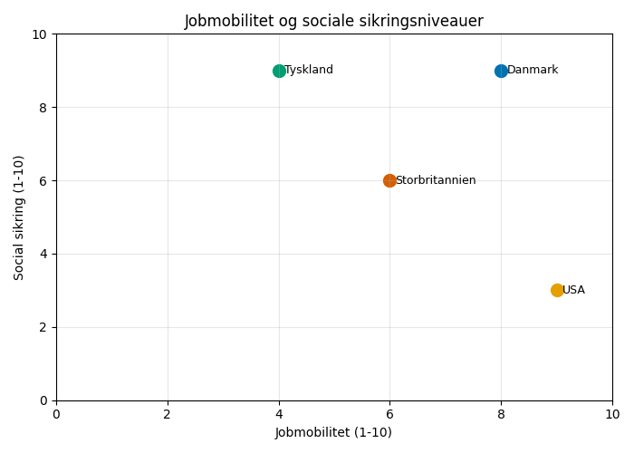
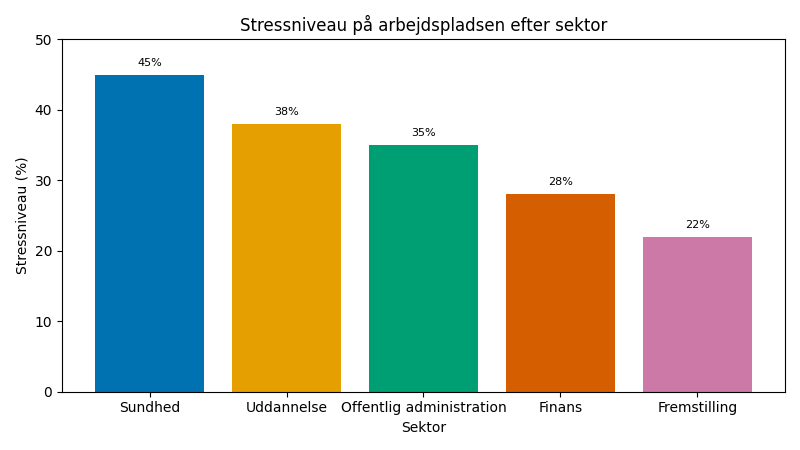
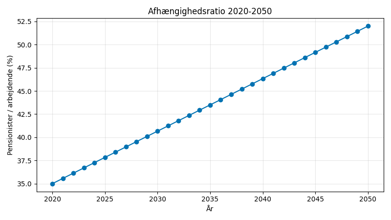

# Studieprøven _Practice Test 22_

  

## Outline

- Læseforståelse (90 minutter)
  - Delprøve 1
  - Delprøve 2A
  - Delprøve 2B
  - Delprøve 3
- Skriftlig fremstilling (3 timer)
- Mundtlig kommunikation (30 minutter)

  Help Den Frie Prøvebank

_This practice test was generated by Den Frie Prøvebank and is unofficial. Den Frie Prøvebank's ability to validate how well its tests match the official tests, in terms of content and structure, is limited. Users should seek guidance from official teaching institutions as to the structure and content of the exams in question._

## Læseforståelse

### Delprøve 1 (25 minutter)
**Ingen hjælpemidler tilladt**

#### Tekstsamling: Arbejdsliv og social tryghed i Danmark

**Tekst A: Den danske flexicurity-model**

Danmarks arbejdsmarkedsmodel kombinerer fleksible ansættelsesforhold med stærke sociale sikkerhedsydelser. 67 % af arbejdstagerne skifter job mindst én gang hver femte år, hvilket er højest i EU. Dagpengesystemet dækker 90 % af den tidligere indkomst i op til to år for kvalificerede arbejdstagere. Jobrotationsprogrammer involverer 156.000 deltagere årligt og forbedrer beskæftigelsesegnetheden. A-kasserne har 2,1 millioner medlemmer og spiller en central rolle i både indkomstbeskyttelse og jobmatching.

**Tekst B: Arbejdstidsreduktion og work-life balance**

Den gennemsnitlige arbejdsuge i Danmark er 37 timer med seks ugers årlig ferie som standard. 78 % af danske medarbejdere rapporterer en god work-life balance sammenlignet med EU-gennemsnittet på 52 %. Fleksible arbejdsordninger bruges af 84 % af vidensarbejdere, hvor hybridmodeller dominerer. Forældreorloven omfatter 52 uger, som kan deles mellem forældrene og støtter ligestillingen på arbejdsmarkedet. Stressrelateret sygefravær koster samfundet 34 milliarder kroner årligt.

**Tekst C: Fagforeninger og kollektive forhandlinger**

84 % af danske lønmodtagere er dækket af kollektive overenskomster, selv om kun 67 % er fagforeningsmedlemmer. Lønforhandlinger foregår hvert tredje år gennem koordinerede forhandlinger mellem arbejdsgiverforeninger og fagforbund. Mindstelønnen fastsættes gennem kollektive overenskomster og varierer mellem sektorer i stedet for ved lovgivning. Strejkeaktiviteten er historisk lav med kun 12 strejkedage per 1000 ansatte årligt. Industrielt demokrati manifesterer sig gennem medarbejderrepræsentation i virksomheders bestyrelser.

**Tekst D: Pension og ældreforsørgelse**

Det danske pensionssystem kombinerer offentlige pensioner, arbejdsmarkedspensioner og private opsparinger gennem en trestrenget model. ATP-ordningen dækker alle arbejdstagere og udbetaler et supplement til den grundlæggende folkepension. Arbejdsmarkedspensionerne omfatter 4,2 millioner danskere med gennemsnitlige bidragssatser på 12‑15 % af lønnen. Private pensionsaktiver udgør 234 % af BNP og gør Danmark til en global frontløber på pensionsområdet. Pensionsalderen stiger gradvist til 67 år og knyttes til øget levealder.

**Tekst E: Integration på arbejdsmarkedet**

Beskæftigelsesfrekvensen for ikke‑vestlige indvandrere er 58 % sammenlignet med 78 % for etniske danskere. Integrationsprogrammer kombinerer sprogundervisning med jobforberedelse og mentorordninger på arbejdspladsen. 145.000 personer deltager årligt i arbejdsrettede sprogkurser. Diskrimination på arbejdsmarkedet påvirker 34 % af etniske minoriteter ifølge undersøgelser. Positive tiltag i den offentlige sektor skal øge mangfoldigheden og skabe rollemodeller for private arbejdsgivere.

#### Spørgsmål til tekstsamlingen:

1. Hvor mange procent af arbejdstagerne skifter job mindst én gang hver femte år?

2. Hvor mange procent af den tidligere indkomst dækker dagpengesystemet?

3. I hvor mange år kan dagpengesystemet maksimalt dække?

4. Hvor mange deltagere involverer jobrotationsprogrammer årligt?

5. Hvor mange timer er den gennemsnitlige arbejdsuge i Danmark?

6. Hvor mange ugers årlig ferie er standard i Danmark?

7. Hvor mange procent af danske medarbejdere rapporterer en god work-life balance?

8. Hvor mange procent af vidensarbejdere bruger fleksible arbejdsordninger?

9. Hvor mange ugers forældreorlov omfatter systemet?

10. Hvor mange milliarder kroner koster stressrelateret sygefravær samfundet årligt?

11. Hvor mange procent af danske lønmodtagere er dækket af kollektive overenskomster?

12. Hvor mange procent er fagforeningsmedlemmer?

13. Hvor ofte foregår lønforhandlinger?

14. Hvor mange strejkedage er der per 1000 ansatte årligt?

15. Hvor mange procent af BNP udgør private pensionsaktiver?

### Delprøve 2A (del af 65 minutter samlet for 2A, 2B og 3)

#### Tekst med fjernede afsnit: Fremtidens pensionssystem

_Sæt bogstavet for den rigtige sætning i hvert felt._

Danmarks pensionssystem står over for en fundamental omstrukturering som følge af demografiske ændringer og ændrede arbejdsmønstre. En aldrende befolkning og lavere fødselstal skaber pres på både offentlige finanser og private pensionsordninger.

**(1)** ________

Efterlønsordningen reformeres med højere pensionsalder og reducerede ydelser for at tilskynde til længere arbejdsliv. Politiske partier debatterer balancen mellem finansiel bæredygtighed og tilstrækkelig indkomstsikkerhed for nuværende lønmodtagere.

**(2)** ________

Private pensionsordninger forvalter stigende formuer men møder kritik for høje gebyrer og komplekse produktstrukturer. Konsolidering i pensionsbranchen reducerer antallet af udbydere men øger markedskoncentrationen blandt få store aktører.

**(3)** ________

Arbejdere i gig‑økonomien og platformansatte mangler ofte adgang til arbejdsmarkedspensioner som traditionelle ansatte. Der udvikles nye bærbare pensionsløsninger for at lukke hullerne i dækningen på et arbejdsmarked i forandring.

**(4)** ________

Klimaforandringer påvirker pensionsfondsinvesteringer gennem fysiske risici og overgangsrisici forbundet med fossile aktiver. ESG‑investeringer bliver mainstream, når pensionsfonde frasælger højkulstofindustrier og prioriterer bæredygtige afkast.

**(5)** ________

International koordinering af pensionspolitikker bliver vigtigere, efterhånden som arbejdsmobiliteten øges og karrierer strækker sig over flere lande. Bilaterale aftaler gør det lettere at overføre pensioner og forhindre dobbeltbeskatning.

#### Fjernede afsnit (vælg det rigtige for hver position):

1. Afsnit 1
<ul class="multiple-choice-answers">
1. Forventet levealder i Danmark er steget til 81 år for mænd og 84 år for kvinder, hvilket øger pensionsudgifterne og kræver længere arbejdsliv.  
2. Fertiliteten er faldet til 1,7 børn per kvinde, betydeligt under reproduktionsniveauet på 2,1, hvilket truer den fremtidige arbejdsstyrke og skattebase.  
3. Indvandring kan delvist imødegå de demografiske udfordringer, men integration på arbejdsmarkedet og pensionsbidragsmønstre varierer betydeligt mellem forskellige grupper.
</ul>

2. Afsnit 2
<ul class="multiple-choice-answers">
1. Opinionsundersøgelser viser opbakning til gradvist at hæve pensionsalderen, hvis pensionsniveauet kan opretholdes gennem forbedrede ydelser og bedre sundhedspleje.  
2. Tidlige pensionsordninger bliver stadig dyrere, efterhånden som flere benytter muligheden for at forlade arbejdsstyrken før den almindelige pensionsalder på trods af længere levetid.  
3. Arbejdsmarkedspensioner blev oprindeligt udviklet som supplement til de offentlige pensioner, men er blevet den primære pensionsindkomst for mange privatansatte.
</ul>

3. Afsnit 3
<ul class="multiple-choice-answers">
1. Forvaltningsgebyrer for pensionsfonde i Danmark er blandt EU's laveste på i gennemsnit 0,6 % om året, men gennemsigtigheden omkring omkostningsstrukturer er fortsat begrænset for individuelle opsparere.  
2. Digitale platforme og robo‑rådgivere forstyrrer den traditionelle pensionsrådgivning og ‑forvaltning, hvilket potentielt reducerer omkostningerne, men også skaber nye risici for mindre erfarne investorer.  
3. Konsolidering mellem pensionsudbydere skaber stordriftsfordele, men reducerer konkurrencen og kan føre til højere gebyrer og mindre innovation i produktudviklingen.
</ul>

4. Afsnit 4
<ul class="multiple-choice-answers">
1. Freelancere og selvstændige skal selv arrangere pensionsopsparing uden arbejdsgiverbidrag, hvilket ofte resulterer i utilstrækkelig forberedelse til pension sammenlignet med traditionelle lønmodtagere.  
2. Platformøkonomien udfordrer de traditionelle ansættelsesklassifikationer, der afgør pensionsberettigelse, og skaber reguleringsmæssig usikkerhed og dækningshuller for nye former for arbejde.  
3. Bærbare pensionskonti giver arbejdstagere mulighed for at opretholde en stabil pensionsopsparing på tværs af flere arbejdsgivere og karriereskift uden at miste optjente rettigheder.
</ul>

5. Afsnit 5
<ul class="multiple-choice-answers">
1. Vurdering af klimarisici bliver obligatorisk for pensionsfonde, da ekstreme vejrhændelser og politiske ændringer påvirker de langsigtede investeringsafkast og fondenes stabilitet.  
2. Frasalg af fossile energiselskaber accelererer, efterhånden som pensionsfonde reagerer på både reguleringspres og medlemmers ønsker om bæredygtige investeringer.  
3. Grønne obligationer og investeringer i bæredygtig infrastruktur giver pensionsfonde mulighed for en positiv miljøpåvirkning, samtidig med at de genererer stabile langsigtede afkast.
</ul>

### Delprøve 2B (del af 65 minutter samlet for 2A, 2B og 3)

#### Tekst: Mental sundhed på arbejdspladsen

Mental sundhed på arbejdspladsen har udviklet sig til et afgørende forretningsanliggende i Danmark, idet arbejdsgivere anerkender forbindelsen mellem medarbejdernes trivsel og produktivitet. Stress, angst og depression påvirker et stigende antal arbejdstagere på tværs af alle sektorer og jobniveauer.

Arbejdsrelateret stress påvirker 34 % af danske ansatte med de højeste rater i sundhedssektoren, undervisningssektoren og den offentlige administration. Årsagerne omfatter for stort arbejdspres, urealistiske deadlines, dårlige ledelsespraksisser og utilstrækkelige ressourcer til at udføre arbejdet.

Udbrændthed viser sig gennem følelsesmæssig udmattelse, depersonalisering og en reduceret følelse af personlig opnåelse. Langvarigt sygefravær på grund af mentale helbredsproblemer koster danske arbejdsgivere 23 milliarder kroner om året gennem tabt produktivitet og udgifter til vikarer.

Indsatser på arbejdspladsen fokuserer på stressforebyggelse gennem forbedret lederuddannelse, vurdering af arbejdsmængden og organisationsudviklingsprogrammer. Medarbejderstøtteordninger tilbyder fortrolig rådgivning og støtte til ansatte med mentale udfordringer.

Stigmaet omkring mentale problemer aftager gradvist, i takt med at oplysningskampagner og ledelsesengagement skaber mere åbne arbejdspladskulturer. Medarbejdere er i stigende grad villige til at tale om mentale udfordringer med deres ledere og søge professionel hjælp, når det er nødvendigt.

Fleksible arbejdsordninger, mindfulness‑programmer og trivselstiltag demonstrerer arbejdsgivernes engagement i at fremme mental sundhed. Forskning viser, at investering i mental sundhed på arbejdspladsen giver et positivt afkast gennem reduceret sygefravær og forbedret præstation.

#### Spørgsmål til teksten:

_Sæt en cirkel om det rigtige svar._

1. Hvor mange procent af danske ansatte påvirkes af arbejdsrelateret stress ifølge teksten?  
<ul class="multiple-choice-answers">
1. 28 % koncentreret primært i højstressede sektorer  
2. 34 % med de højeste rater i sundhedssektoren, undervisningssektoren og den offentlige administration  
3. 41 % fordelt ligeligt på tværs af alle sektorer
</ul>

2. Hvilke årsager til arbejdsrelateret stress nævnes i teksten?  
<ul class="multiple-choice-answers">
1. Kun for stort arbejdspres og urealistiske deadlines  
2. For stort arbejdspres, urealistiske deadlines, dårlig ledelse og utilstrækkelige ressourcer  
3. Primært interpersonelle konflikter og diskrimination på arbejdspladsen
</ul>

3. Hvor mange milliarder kroner koster sygefravær på grund af mentale helbredsproblemer arbejdsgiverne årligt?  
<ul class="multiple-choice-answers">
1. 18 milliarder gennem rent produktivitetstab  
2. 23 milliarder gennem tabt produktivitet og udgifter til vikarer  
3. 29 milliarder inklusive sundheds- og sociale omkostninger
</ul>

4. Hvad nævnes som tiltag på arbejdspladsen til stressforebyggelse?  
<ul class="multiple-choice-answers">
1. Forbedret lederuddannelse, vurdering af arbejdsmængden og organisationsudvikling  
2. Kun medarbejderstøtteordninger og rådgivning  
3. Primært lønforhøjelser og ekstra ferietid
</ul>

5. Hvilke arbejdsgiverinitiativer viser engagement i mental sundhed?  
<ul class="multiple-choice-answers">
1. Fleksible arbejdsordninger, mindfulness‑programmer og trivselstiltag  
2. Kun traditionelle sundhedsfordele og sygefraværspolitikker  
3. Udelukkende eksterne rådgivningsydelser og henvisninger
</ul>

### Delprøve 3 (del af 65 minutter samlet for 2A, 2B og 3)

#### Tekst med fjernede ord: Fremtidens uddannelsessystem

Danmarks uddannelsessystem __(1)__ ______ sig til hurtigt skiftende krav fra arbejdsmarkedet og teknologiske omvæltninger. Traditionelle uddannelsesforløb må __(2)__ ______ for at forberede studerende til karrierer, der endnu ikke findes.

Livslang læring __(3)__ ______ fra valgfri personlig udvikling til et essentielt krav for at fastholde en karriere. Arbejdstagere må løbende __(4)__ ______ deres kompetencer, efterhånden som teknologiske fremskridt accelererer jobomdannelser i alle brancher.

Universiteterne __(5)__ ______ tværfaglige programmer, der kombinerer tekniske færdigheder med kritisk tænkning og kreativitet. Humanistiske fag __(6)__ ______ stigende værdi, da menneskelige kompetencer supplerer kunstig intelligens og automatisering.

Erhvervsuddannelserne __(7)__ ______ integration af nye teknologier som virtual reality og simulation. Studerende kan __(8)__ ______ komplekse procedurer i trygge omgivelser, før de anvender dem i praksis på arbejdspladser.

Digitale kompetencebeviser og mikrocertificeringer __(9)__ ______ traditionelle gradsstrukturer og giver mulighed for mere fleksible karriereforløb. Arbejdsgivere __(10)__ ______ i stigende grad specifikke kompetencer frem for brede uddannelsesbaggrunde, når de ansætter.

#### Valgmuligheder:

<table class="horizontal-multiple-choice">
  <tbody>
    <tr>
      <td><strong>1</strong></td>
      <td><strong>a.</strong> tilpasser</td>
      <td><strong>b.</strong> ændrer</td>
      <td><strong>c.</strong> udvikler</td>
      <td><strong>d.</strong> reformerer</td>
    </tr>
    <tr>
      <td><strong>2</strong></td>
      <td><strong>a.</strong> reformeres</td>
      <td><strong>b.</strong> moderniseres</td>
      <td><strong>c.</strong> transformeres</td>
      <td><strong>d.</strong> udvikles</td>
    </tr>
    <tr>
      <td><strong>3</strong></td>
      <td><strong>a.</strong> udvikler</td>
      <td><strong>b.</strong> transformation</td>
      <td><strong>c.</strong> skifter</td>
      <td><strong>d.</strong> udvikler sig</td>
    </tr>
    <tr>
      <td><strong>4</strong></td>
      <td><strong>a.</strong> opdatere</td>
      <td><strong>b.</strong> udvikle</td>
      <td><strong>c.</strong> forbedre</td>
      <td><strong>d.</strong> opgradere</td>
    </tr>
    <tr>
      <td><strong>5</strong></td>
      <td><strong>a.</strong> introducerer</td>
      <td><strong>b.</strong> udvikler</td>
      <td><strong>c.</strong> skaber</td>
      <td><strong>d.</strong> etablerer</td>
    </tr>
    <tr>
      <td><strong>6</strong></td>
      <td><strong>a.</strong> vinder</td>
      <td><strong>b.</strong> bevarer</td>
      <td><strong>c.</strong> opnår</td>
      <td><strong>d.</strong> modtager</td>
    </tr>
    <tr>
      <td><strong>7</strong></td>
      <td><strong>a.</strong> inkorporerer</td>
      <td><strong>b.</strong> integrerer</td>
      <td><strong>c.</strong> inkluderer</td>
      <td><strong>d.</strong> kombinerer</td>
    </tr>
    <tr>
      <td><strong>8</strong></td>
      <td><strong>a.</strong> øve</td>
      <td><strong>b.</strong> træne</td>
      <td><strong>c.</strong> studere</td>
      <td><strong>d.</strong> afprøve</td>
    </tr>
    <tr>
      <td><strong>9</strong></td>
      <td><strong>a.</strong> udfordrer</td>
      <td><strong>b.</strong> supplerer</td>
      <td><strong>c.</strong> erstatter</td>
      <td><strong>d.</strong> konkurrerer</td>
    </tr>
    <tr>
      <td><strong>10</strong></td>
      <td><strong>a.</strong> prioriterer</td>
      <td><strong>b.</strong> vægtlægger</td>
      <td><strong>c.</strong> foretrækker</td>
      <td><strong>d.</strong> værdsætter</td>
    </tr>
  </tbody>
</table>

## Skriftlig fremstilling (3 timer)
**Alle ordbøger er tilladt**

### Vælg én af følgende tre opgaver:

#### Opgave 1: Flexicurity og arbejdsmarkedets fremtid

**Grafik:** 

**Manchet:** Danmarks flexicurity-model balancerer arbejdsmarkedsfleksibilitet med social tryghed, men teknologiske forandringer og globalisering skaber nye udfordringer for bæredygtig beskæftigelse og tilstrækkelig social beskyttelse.

**Opgave:** Skriv en sammenhængende tekst på minimum 400 ord, hvor du:
- Analyserer Danmarks position i forhold til de andre lande i grafikken
- Diskuterer fordele og udfordringer ved flexicurity-modellen
- Vurderer, hvordan teknologiske forandringer påvirker arbejdsmarkedets dynamik
- Argumenterer for tilpasninger af flexicurity-systemet i fremtiden

#### Opgave 2: Mental sundhed og arbejdsliv

**Grafik:** 

**Manchet:** Mental sundhed på arbejdspladsen får stigende opmærksomhed, da stress og udbrændthed påvirker produktiviteten og medarbejdernes trivsel. Investering i støtte til mental sundhed kan forbedre både menneskers velbefindende og økonomiske resultater.

**Opgave:** Skriv en sammenhængende tekst på minimum 400 ord, hvor du:
- Præsenterer stressmønstre på tværs af sektorer i grafikken
- Analyserer årsager og konsekvenser af mentale sundhedsproblemer på arbejdspladsen
- Diskuterer effektive indsatser og støttesystemer
- Foreslår omfattende tilgange til at fremme mental sundhed på arbejdspladsen

#### Opgave 3: Pensionssystemets bæredygtighed

**Grafik:** 

**Manchet:** Demografiske ændringer truer pensionssystemets bæredygtighed, da færre arbejdstagere skal forsørge flere pensionister. Reformerne må balancere finansiel ansvarlighed med tilstrækkelig pensionssikkerhed for nuværende og kommende generationer.

**Opgave:** Skriv en sammenhængende tekst på minimum 400 ord, hvor du:
- Redegør for de demografiske tendenser fra grafikken
- Analyserer udfordringerne for pensionssystemets bæredygtighed
- Diskuterer mulige reformer og politiske løsninger
- Vurderer afvejningerne mellem forskellige tilgange til pensionsreformer

_Brug disse sider til at skrive din skriftlige opgave._

## Mundtlig kommunikation (30 minutter inkl. votering)

### Opgaveark med tre emner til forberedelse:

#### Emne 1: Arbejdsmarkedets transformation

**Stikord til inspiration:**
- Flexicurity-modellen og social tryghed
- Teknologiske forandringer og jobfortrængning
- Kompetenceudvikling og livslang læring
- Arbejdsmarkedsmobilitet og karriereskift
- Kollektive forhandlinger og fagforeninger
- Work-life balance og medarbejdernes trivsel
- Fremtidens arbejde og ansættelsesforhold
- International konkurrenceevne og arbejdsomkostninger

#### Emne 2: Mental sundhed i moderne samfund

**Stikord til inspiration:**
- Stress på arbejdspladsen og forebyggelse af udbrændthed
- Sociale medier og digitalt pres
- Adgang til sundhedsydelser og behandlingsmuligheder
- Nedbrydelse af stigma og oplysningskampagner
- Forebyggelse og tidlig indsats
- Fællesskabsstøtte og sociale netværk
- Livsstilsfaktorer og mental trivsel
- Politik for mental sundhed og ressourcer

#### Emne 3: Pension og demografiske udfordringer

**Stikord til inspiration:**
- Aldrende befolkning og forsørgerforhold
- Pensionssystemets bæredygtighed og reformer
- Pensionsplanlægning og finansiel forståelse
- Mellemgenrationel retfærdighed og byrdefordeling
- Indvandring og fornyelse af arbejdsstyrken
- Sundhedsudgifter og ældrepleje
- Aktiv aldring og længere arbejdsliv
- International koordinering af pensioner

### Prøveforløb:

1. **Lodtrækning:** Vælg ét af de tre forberedte emner  
2. **Præsentation (5 minutter):** Struktureret gennemgang af det valgte emne  
3. **Interview (15 minutter):** Uddybende samtale med eksaminator baseret på præsentationen  
4. **Votering og karaktergivning (10 minutter)**

### Bedømmelseskriterier:

- **Sproglig korrekthed:** Grammatik, ordforråd og udtale
- **Kommunikativ kompetence:** Evne til at formidle budskaber klart
- **Indholdsrigdom:** Faglig dybde og nuanceret forståelse
- **Struktur:** Logisk opbygning og sammenhæng
- **Interaktion:** Evne til dialog og respons på spørgsmål

---

_This practice test was generated by Den Frie Prøvebank and is unofficial. Den Frie Prøvebank's ability to validate how well its tests match the official tests, in terms of content and structure, is limited. Users should seek guidance from official teaching institutions as to the structure and content of the exams in question._
