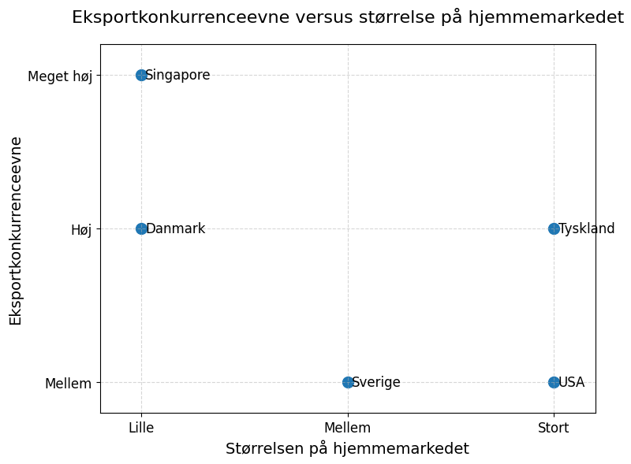
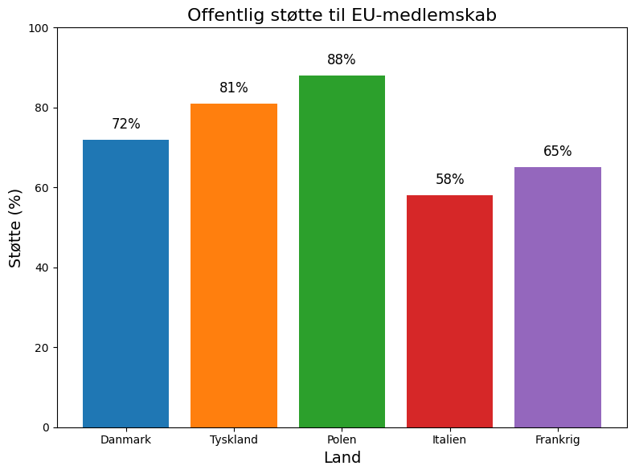
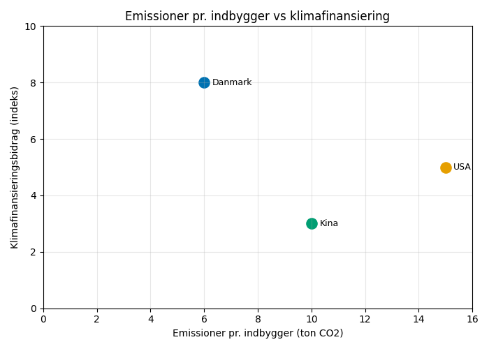

# Studieprøven _Practice Test 23_

  

## Outline

- Læseforståelse (90 minutter)
  - Delprøve 1
  - Delprøve 2A
  - Delprøve 2B
  - Delprøve 3
- Skriftlig fremstilling (3 timer)
- Mundtlig kommunikation (30 minutter)

  Help Den Frie Prøvebank

_This practice test was generated by Den Frie Prøvebank and is unofficial. Den Frie Prøvebank's ability to validate how well its tests match the official tests, in terms of content and structure, is limited. Users should seek guidance from official teaching institutions as to the structure and content of the exams in question._

## Læseforståelse

### Delprøve 1 (25 minutter)
**Ingen hjælpemidler er tilladt**

#### Tekstsamling: Globalisering og Danmarks internationale position

**Tekst A: Danmarks handelsrelationer og eksport**

Danmark eksporterer for 1.578 milliarder kroner årligt med Tyskland (18,2 %), Sverige (11,7 %) og Norge (8,4 %) som de største handelspartnere. Medicinalindustrien udgør 32 % af eksporten med Novo Nordisk som dominerende aktør. Shipping og maritime services bidrager med 198 milliarder kroner til eksportindtjeningen. Eksport af grøn teknologi er vokset til 267 milliarder kroner siden 2020. Danmarks handelsoverskud nåede 187 milliarder kroner i 2024, det højeste niveau siden 2008.

**Tekst B: EU-medlemskab og europæisk integration**

Danmark har været EU-medlem i 51 år og bidrager med 19,4 milliarder kroner årligt til EU-budgettet. 76 % af Danmarks udenrigshandel sker med EU-lande, hvilket viser en dyb økonomisk integration. Den frie bevægelighed for arbejdskraft har resulteret i 234.000 EU-borgere bosat i Danmark. Danske EU-parlamentarikere udgør 14 af 705 medlemmer og spiller en aktiv rolle i klima- og digitalpolitik. Fire danske EU-forbehold inden for forsvar, retlige anliggender, euroen og unionsborgerskab begrænser Danmarks deltagelse på visse politikområder.

**Tekst C: NATO og forsvarspolitik**

Danmarks forsvarsbudget udgør 2,41 % af BNP og overstiger NATOs målsætning på 2 %. Danske styrker har udsendt 89.000 soldater i internationale missioner siden 1990. Nuværende udsendelser omfatter 1.890 soldater i 12 forskellige operationer globalt. Indkøbet af F‑35-kampfly koster 134 milliarder kroner over programmets levetid. Arktisk suverænitet bliver stadig vigtigere, efterhånden som klimaforandringer åbner nye sejlruter og adgang til ressourcer i Grønland.

**Tekst D: Udviklingsbistand og internationalt samarbejde**

Danmarks udviklingsbistand udgør 0,71 % af BNI og placerer landet som den femtestørste donor globalt. 14,2 milliarder kroner kanaliseres årligt til 23 partnerlande med fokus på klimatilpasning. Danish Emergency Response Team har reageret på 127 humanitære kriser siden 2010. Danida Business Finance faciliterer private investeringer i udviklingslande med tilsagn om 8,9 milliarder kroner. Klimafinansiering udgør 34 % af den samlede udviklingsbistand og støtter overgangen til vedvarende energi.

**Tekst E: Immigration og globale migrationstrends**

Danmark modtager 28.000 indvandrere årligt, med 45 % fra EU-lande og 34 % via familiesammenføring. Asylansøgninger nåede 4.200 i 2024, væsentligt lavere end toppen i 2015 på 21.000. Integrationsresultater varierer mellem forskellige nationalitetsgrupper med forskelle i uddannelse og beskæftigelse. Danmarks pointbaserede system for kvalificeret immigration tiltrækker årligt 12.000 fagfolk. Emigrationen af danske borgere udgør 23.000 personer om året, primært til andre nordiske lande og Nordamerika.

#### Spørgsmål til tekstsamlingen:

1. For hvor mange milliarder kroner eksporterer Danmark årligt?

2. Hvor mange procent af eksporten udgør medicinalindustrien?

3. Hvor mange milliarder kroner bidrager shipping og maritime services med til eksportindtjeningen?

4. Hvor mange milliarder kroner er eksporten af grøn teknologi vokset til siden 2020?

5. Hvor mange milliarder kroner nåede Danmarks handelsoverskud i 2024?

6. Hvor mange år har Danmark været medlem af EU?

7. Med hvor mange milliarder kroner bidrager Danmark årligt til EU-budgettet?

8. Hvor stor en del af Danmarks udenrigshandel sker med EU-lande?

9. Hvor mange EU-borgere er bosat i Danmark?

10. Hvor mange procent af BNP udgør Danmarks forsvarsbudget?

11. Hvor mange soldater har danske styrker udsendt i internationale missioner siden 1990?

12. Hvor mange soldater omfatter de nuværende udsendelser?

13. Hvor mange milliarder kroner koster indkøbet af F‑35-kampfly over programmets levetid?

14. Hvor mange procent af BNI udgør Danmarks udviklingsbistand?

15. Hvor mange milliarder kroner kanaliseres der årligt til partnerlandene?

### Delprøve 2A (del af 65 minutter samlet for 2A, 2B og 3)

#### Tekst med fjernede afsnit: Brexit og Danmarks EU-strategi

_Sæt bogstavet for den rigtige sætning i hvert felt._

Brexit har fundamentalt forandret dynamikken i Den Europæiske Union og påvirket Danmarks strategiske position som EU-medlem. Storbritanniens exit skaber både udfordringer og muligheder for de tilbageværende medlemsstater.

**(1)** ________

Økonomiske konsekvenser omfatter reducerede bidrag til EU-budgettet, som andre medlemsstater må kompensere for. Danmarks netto-bidrag til EU stiger, da et af de rigeste medlemslande må bære en større finanspolitisk byrde.

**(2)** ________

Finanssektoren i London mister EU's pasningsrettigheder, hvilket skaber muligheder for København og andre europæiske finanscentre til at tiltrække virksomheder og talent, der flytter fra Storbritannien.

**(3)** ________

Handelsrelationer skal genforhandles, når Storbritannien bliver et tredjeland i forhold til EU. Nye toldprocedurer og regulatoriske barrierer komplicerer den hidtil uhindrede handel mellem Storbritannien og Danmark.

**(4)** ________

Den institutionelle balance i EU ændres, eftersom Storbritanniens liberale markedspolitik og skepsis over for dybere integration ikke længere påvirker EU's beslutningsprocesser og strategiske retning.

**(5)** ________

Sikkerhedssamarbejdet fortsætter gennem NATO‑rammen, men mister en EU‑dimension. Efterretningsdeling og koordination i kampen mod terrorisme må udvikle nye mekanismer uden for EU's strukturer.

#### Fjernede afsnit (vælg det rigtige for hver position):

1. Afsnit 1
<ul class="multiple-choice-answers">
1. Danmarks fire EU‑forbehold bliver i stigende grad isolerede, efterhånden som andre medlemsstater uddyber integrationen på områder, hvor Danmark står uden for fælles politikker.
2. Brexit‑forhandlingerne viste kompleksiteten ved at forlade EU og styrkede den danske støtte til EU‑medlemskab trods lejlighedsvise politiske spændinger.
3. Europæisk solidaritet under COVID‑19‑pandemien stod i kontrast til Storbritanniens uafhængige respons og fremhævede fordelene ved koordineret EU‑indsats.
</ul>

2. Afsnit 2
<ul class="multiple-choice-answers">
1. Danmarks bidrag til EU‑budgettet stiger fra 19,4 milliarder til anslået 22,1 milliarder kroner årligt for at kompensere for de tabte britiske betalinger.
2. Landbrugstilskuddene under den fælles landbrugspolitik må omfordeles mellem de tilbageværende medlemmer, hvilket påvirker danske landmænd og lokalsamfund i landdistrikterne betydeligt.
3. EU's genopretningsfond efter pandemien kræver større danske bidrag, men giver også adgang til lavrentefinansiering af investeringer i den grønne omstilling.
</ul>

3. Afsnit 3
<ul class="multiple-choice-answers">
1. Copenhagen Finance Center markedsfører sig som et alternativ til London for EU's finansielle tjenester med en engelsktalende arbejdsstyrke og et stærkt regulatorisk rammeværk.
2. Danske medicinalvirksomheder drager fordel af, at EU's lægemiddelagentur flytter fra London til Amsterdam, hvilket giver lettere adgang til regulatoriske godkendelsesprocesser.
3. Porten i København konkurrerer om britisk godstrafik, da virksomheder søger EU‑baserede logistiske løsninger for at undgå grænsekomplikationer efter Brexit.
</ul>

4. Afsnit 4
<ul class="multiple-choice-answers">
1. Danske eksportører står over for øget papirarbejde og forsinkelser, når de sender varer til Storbritannien, hvilket især rammer fødevarer med kort holdbarhed.
2. Just‑in‑time forsyningskæder mellem Danmark og Storbritannien lider under forstyrrelser på grund af nye toldkontroller og krav om regulatorisk overholdelse.
3. Turismen mellem Danmark og Storbritannien falder på grund af øgede rejseformaliteter og afskaffelsen af den automatiske ret til ophold.
</ul>

5. Afsnit 5
<ul class="multiple-choice-answers">
1. Det fransk‑tyske lederskab i EU bliver mere udtalt uden den britiske modvægt, hvilket potentielt reducerer indflydelsen for mindre medlemsstater som Danmark.
2. Europa-Parlamentet mister britiske medlemmer, som ofte lå på linje med danske positioner om det indre marked og handelens liberalisering.
3. EU's beslutningsprocesser accelererer uden britiske blokerende mindretal på initiativer om dybere integration på forskellige politikområder.
</ul>

### Delprøve 2B (del af 65 minutter samlet for 2A, 2B og 3)

#### Tekst: Danmarks rolle i globalt klimadiplomati

Danmark har etableret sig som en indflydelsesrig klimaforkæmper på den internationale scene gennem ambitiøse nationale politikker og aktiv diplomatisk indsats. Landet bruger sin moralske autoritet fra tidlig klimaindsats til at fremme globalt samarbejde om reduktion af udledninger.

Klimatopmødet i København i 2009 gav Danmark en platform for klimalederskab, men viste også udfordringerne ved multilaterale forhandlinger om komplekse miljøspørgsmål. Begivenheden viste de danske evner til at være vært for internationale konferencer, men understregede vanskelighederne ved at opnå bindende globale aftaler.

Grøn diplomati bliver et centralt element i dansk udenrigspolitik, da landet eksporterer teknologi og ekspertise inden for vedvarende energi til udviklingslande. Klimahensyn påvirker i stigende grad handelsrelationer og udviklingssamarbejdsprogrammer i forskellige regioner.

Ratificeringen af Paris‑aftalen styrkede Danmarks engagement i internationalt klimasamarbejde og giver en ramme for koordineret indsats blandt de deltagende lande. Danmark bidrager med teknisk ekspertise og finansiering til implementeringsstøtte i partnerlande.

Nordisk samarbejde om klima udnytter fælles værdier og lignende økonomiske strukturer til at øge den regionale indflydelse i internationale forhandlinger. Fælles nordiske positioner har ofte større vægt end individuelle landes positioner i EU og globale fora.

Forpligtelserne til klimafinansiering kræver betydelige danske ressourcer til støtte for udviklingslandes indsats for at begrænse og tilpasse sig klimaforandringer. Balancen mellem nationale klimainvesteringer og internationale forpligtelser skaber budgetmæssigt pres på regeringens prioriteringer.

Fremtidens klimadiplomati må adressere voksende geopolitiske spændinger over konsekvenserne af energiomstillingen og konkurrencen om kritiske materialer, der er nødvendige for teknologier til vedvarende energi og batteriproduktion.

#### Spørgsmål til teksten:

_Sæt en cirkel om det rigtige svar._

1. Hvad etablerede klimatopmødet i København i 2009 ifølge teksten?  
<ul class="multiple-choice-answers">
1. Bindende globale aftaler om emissionsreduktioner  
2. En platform for klimalederskab, men fremhævede forhandlingsvanskeligheder  
3. En succesfuld international klimaaftale med alle lande som deltagere  
</ul>  

2. Hvordan bliver klimahensyn ifølge teksten mere og mere indflydelsesrige? 
<ul class="multiple-choice-answers"> 
1. Klimaet påvirker handelsrelationer og udviklingssamarbejdsprogrammer  
2. Kun gennem implementering af nationale politikker og regulering  
3. Primært gennem koordinering på EU-niveau uden bilaterale konsekvenser
</ul>  

3. Hvad giver Paris‑aftalen ifølge teksten?  
<ul class="multiple-choice-answers">
1. En ramme for koordineret indsats med dansk teknisk ekspertise og finansiering  
2. Kun bindende emissionsmål uden implementeringsstøtte  
3. Begrænsede samarbejdsmekanismer, der udelukkende er fokuseret på udviklede lande 
</ul>   

4. Hvilken fordel har nordisk samarbejde om klima?  
<ul class="multiple-choice-answers">
1. Fælles nordiske positioner vejer tungere end individuelle positioner  
2. Kun fælles teknologisk udvikling uden diplomatisk koordinering  
3. Udelukkende fokuseret på regionale spørgsmål uden global indflydelse  
</ul>  

5. Hvilke fremtidige udfordringer nævnes for klimadiplomatiet?  
<ul class="multiple-choice-answers">
1. Voksende geopolitiske spændinger over energiomstillingen og konkurrencen om kritiske materialer  
2. Kun indenlandsk modstand mod internationale klimaforpligtelser  
3. Udelukkende økonomiske begrænsninger uden geopolitiske hensyn  
</ul>  

### Delprøve 3 (del af 65 minutter samlet for 2A, 2B og 3)

#### Tekst med fjernede ord: International migration og integration

Globale migrationsmønstre __(1)__ ______ det danske samfund gennem øget diversitet og multikulturalisme. Økonomiske muligheder, politisk ustabilitet og klimaforandringer __(2)__ ______ migrationsstrømme, som påvirker både oprindelses- og destinationslande.

Skilled migration __(3)__ ______ en konkurrencefordel for Danmark, da internationalt talent bidrager til innovation og økonomisk vækst. Højt kvalificerede immigranter __(4)__ ______ ofte succesfuldt i techsektoren og de professionelle tjenesteydelser.

Familiesammenføring __(5)__ ______ den største kategori af lovlig immigration til Danmark. Ægtefælle og børn af danske statsborgere eller permanente beboere __(6)__ ______ ret til ophold, men skal opfylde visse krav.

Asylansøgere __(7)__ ______ international beskyttelse mod forfølgelse og vold. Behandlingen af asylansøgninger kræver en __(8)__ ______ vurdering af troværdighed og beskyttelsesbehov i henhold til internationale konventioner.

Integrationsudfordringer __(9)__ ______ sprogbarrierer, anerkendelse af uddannelseskvalifikationer og adgang til arbejdsmarkedet. En vellykket integration __(10)__ ______ omfattende støttesystemer og inkluderende politikker.

#### Valgmuligheder:

<table class="horizontal-multiple-choice">
  <tbody>
    <tr>
      <td><strong>1</strong></td>
      <td><strong>a.</strong> påvirker</td>
      <td><strong>b.</strong> forandrer</td>
      <td><strong>c.</strong> transformerer</td>
      <td><strong>d.</strong> former</td>
    </tr>
    <tr>
      <td><strong>2</strong></td>
      <td><strong>a.</strong> driver</td>
      <td><strong>b.</strong> skaber</td>
      <td><strong>c.</strong> influerer</td>
      <td><strong>d.</strong> påvirker</td>
    </tr>
    <tr>
      <td><strong>3</strong></td>
      <td><strong>a.</strong> giver</td>
      <td><strong>b.</strong> tilbyder</td>
      <td><strong>c.</strong> skaber</td>
      <td><strong>d.</strong> genererer</td>
    </tr>
    <tr>
      <td><strong>4</strong></td>
      <td><strong>a.</strong> integrerer</td>
      <td><strong>b.</strong> integreres</td>
      <td><strong>c.</strong> lykkes</td>
      <td><strong>d.</strong> klarer sig</td>
    </tr>
    <tr>
      <td><strong>5</strong></td>
      <td><strong>a.</strong> udgør</td>
      <td><strong>b.</strong> repræsenterer</td>
      <td><strong>c.</strong> omfatter</td>
      <td><strong>d.</strong> konstituerer</td>
    </tr>
    <tr>
      <td><strong>6</strong></td>
      <td><strong>a.</strong> har</td>
      <td><strong>b.</strong> har ret til</td>
      <td><strong>c.</strong> nyder</td>
      <td><strong>d.</strong> besidder</td>
    </tr>
    <tr>
      <td><strong>7</strong></td>
      <td><strong>a.</strong> søger</td>
      <td><strong>b.</strong> ansøger</td>
      <td><strong>c.</strong> anmoder</td>
      <td><strong>d.</strong> beder</td>
    </tr>
    <tr>
      <td><strong>8</strong></td>
      <td><strong>a.</strong> omhyggelig</td>
      <td><strong>b.</strong> grundig</td>
      <td><strong>c.</strong> detaljeret</td>
      <td><strong>d.</strong> nøje</td>
    </tr>
    <tr>
      <td><strong>9</strong></td>
      <td><strong>a.</strong> omfatter</td>
      <td><strong>b.</strong> inkluderer</td>
      <td><strong>c.</strong> indebærer</td>
      <td><strong>d.</strong> involverer</td>
    </tr>
    <tr>
      <td><strong>10</strong></td>
      <td><strong>a.</strong> kræver</td>
      <td><strong>b.</strong> nødvendiggør</td>
      <td><strong>c.</strong> fordrer</td>
      <td><strong>d.</strong> forudsætter</td>
    </tr>
  </tbody>
</table>

## Skriftlig fremstilling (3 timer)
**Alle ordbøger er tilladt**

### Vælg én af følgende tre opgaver:

#### Opgave 1: Danmarks position i den globale økonomi

**Grafik:** 

**Manchet:** Små åbne økonomier som Danmark er afhængige af international handel og adgang til globale markeder. Konkurrenceevne kræver konstant innovation og tilpasning til skiftende globale økonomiske forhold.

**Opgave:** Skriv en sammenhængende tekst på mindst 400 ord, hvor du:
- analyserer Danmarks position i forhold til de andre lande fra grafikken
- diskuterer fordelene og udfordringerne for små åbne økonomier
- vurderer, hvordan globaliseringen påvirker Danmarks konkurrenceevne
- argumenterer for strategier til at bevare Danmarks internationale position

#### Opgave 2: EU‑integration og national suverænitet

**Grafik:** 

**Manchet:** EU‑integration balancerer mellem dybere samarbejde og bevarelse af national autonomi. Den offentlige opbakning til EU‑medlemskab varierer mellem landene afhængigt af de opfattede fordele og omkostninger ved europæisk integration.

**Opgave:** Skriv en sammenhængende tekst på mindst 400 ord, hvor du:
- præsenterer mønstrene i den offentlige opbakning fra grafikken
- analyserer de faktorer, der påvirker holdningerne til EU‑integration
- diskuterer spændingen mellem europæisk samarbejde og national suverænitet
- foreslår tilgange til at balancere integration med demokratisk ansvarlighed

#### Opgave 3: Klimadiplomati og internationalt samarbejde

**Grafik:** 

**Manchet:** Internationalt klimasamarbejde kræver en balance mellem emissionsreduktioner og finansiel støtte til udviklingslande. Lederskab i klimaindsatsen omfatter både nationale forpligtelser og international solidaritet.

**Opgave:** Skriv en sammenhængende tekst på mindst 400 ord, hvor du:
- redegør for mønstrene i emissioner og finansiering fra grafikken
- analyserer udfordringerne i internationale klimaforhandlinger
- diskuterer principper for en retfærdig byrdefordeling mellem landene
- vurderer effektiviteten af de nuværende tilgange til klimadiplomati

_Brug disse sider til at skrive din skriftlige opgave._

## Mundtlig kommunikation (30 minutter inkl. votering)

### Opgaveark med tre emner til forberedelse:

#### Emne 1: Danmarks internationale rolle

**Stikord til inspiration:**
- EU‑medlemskab og europæisk integration
- NATO‑samarbejde og forsvarspolitik
- International handel og økonomiske relationer
- Udviklingsbistand og humanitær hjælp
- Klimadiplomati og miljølederskab
- Arktisk strategi og Grønland
- Kultur- og værdidiplomati og soft power
- International migration og global mobilitet

#### Emne 2: Globalisering og økonomisk konkurrence

**Stikord til inspiration:**
- Eksportkonkurrenceevne og innovation
- Integration af forsyningskæder og afhængigheder
- Udenlandske direkte investeringer og multinationale virksomheder
- Teknologioverførsel og vidensøkonomi
- Digital transformation og globale markeder
- Handelsaftaler og internationale standarder
- Økonomisk sikkerhed og strategisk autonomi
- Strategier for små stater i den globale økonomi

#### Emne 3: Migration og multikulturelt samfund

**Stikord til inspiration:**
- Indvandringspolitikker og integrationsprogrammer
- Kulturel mangfoldighed og social sammenhængskraft
- Arbejdsmigration og kompetencetilpasning
- Flygtningebeskyttelse og humanitære forpligtelser
- Sprogindlæring og civilt engagement
- Diskrimination og lige muligheder
- Transnationale forbindelser og diaspora‑fællesskaber
- Migrationens indvirkning på velfærdsstaten

### Prøveforløb:

1. **Lodtrækning:** Vælg ét af de tre forberedte emner  
2. **Præsentation (5 minutter):** Struktureret gennemgang af det valgte emne  
3. **Interview (15 minutter):** Uddybende samtale med eksaminator baseret på præsentationen  
4. **Votering og karaktergivning (10 minutter)**

### Bedømmelseskriterier:

- **Sproglig korrekthed:** Grammatik, ordforråd og udtale  
- **Kommunikativ kompetence:** Evne til at formidle budskaber klart  
- **Indholdsrigdom:** Faglig dybde og nuanceret forståelse  
- **Struktur:** Logisk opbygning og sammenhæng  
- **Interaktion:** Evne til dialog og respons på spørgsmål  

---

_This practice test was generated by Den Frie Prøvebank and is unofficial. Den Frie Prøvebank's ability to validate how well its tests match the official tests, in terms of content and structure, is limited. Users should seek guidance from official teaching institutions as to the structure and content of the exams in question._
