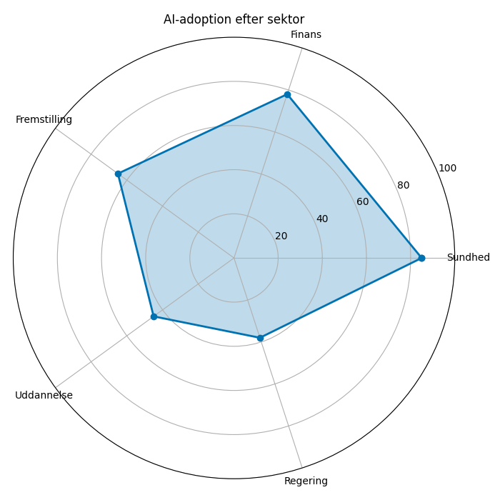
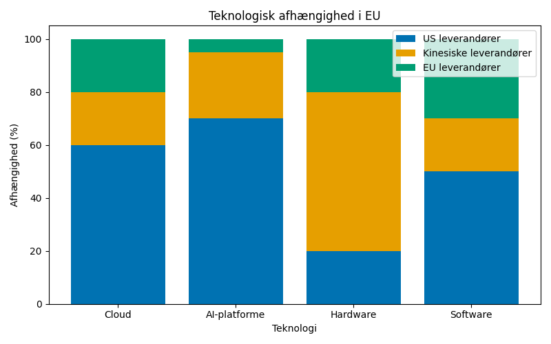

# Studieprøven _Practice Test 24_

  

## Outline

- Læseforståelse (90 minutter)
  - Delprøve 1
  - Delprøve 2A
  - Delprøve 2B
  - Delprøve 3
- Skriftlig fremstilling (3 timer)
- Mundtlig kommunikation (30 minutter)

  Help Den Frie Prøvebank

_This practice test was generated by Den Frie Prøvebank and is unofficial. Den Frie Prøvebank's ability to validate how well its tests match the official tests, in terms of content and structure, is limited. Users should seek guidance from official teaching institutions as to the structure and content of the exams in question._

## Læseforståelse

### Delprøve 1 (25 minutter)
**Ingen hjælpemidler tilladt**

#### Tekstsamling: Teknologi og samfundsudvikling i Danmark

**Tekst A: Kunstig intelligens og automatisering**

Danmarks AI-strategi involverer 2,8 milliarder kroner i offentlige investeringer over fem år. 67% af danske virksomheder planlægger AI-implementering inden 2027 med fokus på dataanalyse og kundeservice. Automatisering påvirker 342.000 job inden 2030, men skaber samtidig 198.000 nye stillinger inden for teknologi og services. Danmarks Digital Hub tiltrækker 89 internationale AI-virksomheder med skatteincitamenter og adgang til talent. Etiske komitéer etableret på alle universiteter overvåger AI-forskning og sikrer ansvarlig udvikling.

**Tekst B: Cybersikkerhed og digital forsvar**
Danmarks Cyber- og Informationssikkerhedsagentur rapporterer 12.400 cyberangreb på kritisk infrastruktur årligt. Statssponsorerede hackergrupper målretter 78% af angrebene mod energi-, finans- og telekommunikationssektorerne. Cybersikkerhedsbudgettet er tredoblet til 4,7 milliarder kroner siden 2020. Offentligt-private partnerskaber involverer 234 virksomheder i informationsdeling og trusselsanalyse. Cybersikkerhedsuddannelser uddanner 2.300 specialister årligt for at imødegå mangel på kompetencer.

**Tekst C: Blockchain og digitale valutas**
Danmarks Nationalbank undersøger en digital centralbankvaluta (CBDC) med et pilotprojekt, der involverer 45.000 testbrugere. Kryptovaluta-anvendelsen når 28% af befolkningen med primært fokus på investering frem for transaktioner. Blockchain-anvendelser i den offentlige sektor omfatter digital identitet, ejendomsregistre og sundhedsdata. Energiforbruget fra kryptomining bekymrer miljømyndighederne, eftersom driften forbruger 340 GWh årligt. Reguleringen balancerer fremme af innovation med forbrugerbeskyttelse og finansiel stabilitet.

**Tekst D: Internet of Things og smart cities**
København implementerer smart city-teknologier med 145.000 forbundne enheder, der overvåger trafik, luftkvalitet og energiforbrug. IoT-sensorer i fjernvarmesystemer optimerer energidistributionen og reducerer spild med 23 %. Intelligente trafiklys tilpasser signalerne baseret på realtidsdata om trængsel og prioriterer den kollektive trafik. Bekymringer om privatliv i forbindelse med masseovervågning fører til strenge databeskyttelsesprotokoller og borgerbaserede tilsynskomitéer. 5G-netværksdækning når 89 % af byområderne og muliggør højhastigheds-IoT-forbindelser.

**Tekst E: Quantum computing og fremtidens teknologi**
Danmarks Quantum Innovation Center investerer 890 millioner kroner i kvanteforskning over det næste årti. IBM og Google har etableret kvantumlaboratorier på Danmarks Tekniske Universitet med fokus på kryptografi og optimeringsproblemer. Konsekvenserne af kvanteoverlegenhed for cybersikkerhed kræver udvikling af kvante-resistente krypteringsalgoritmer. Kommercielle kvanteapplikationer forventes omkring 2030 inden for lægemiddeludvikling, finansiel modellering og klimasimulering. Internationalt samarbejde med EU's Quantum Flagship-program sikrer dansk deltagelse i det globale kapløb om kvanteteknologi.

#### Spørgsmål til tekstsamlingen:

1. Hvor mange milliarder kroner involverer Danmarks AI-strategi over fem år?

2. Hvor mange procent af danske virksomheder planlægger AI-implementation inden 2027?

3. Hvor mange job påvirker automatisering inden 2030?

4. Hvor mange nye stillinger skaber automatisering inden 2030?

5. Hvor mange internationale AI-virksomheder tiltrækker Danmarks Digital Hub?

6. Hvor mange cyberangreb rapporterer Danmarks cybersikkerhedsagentur årligt?

7. Hvor mange procent af angreb målretter statssponsorerede hacker-grupper?

8. Hvor mange milliarder kroner udgør cybersikkerhed-budgettet?

9. Hvor mange virksomheder involverer public-private partnerships?

10. Hvor mange specialists uddanner cyber education programs årligt?

11. Hvor mange test-users involverer CBDC pilot project?

12. Hvor mange procent af befolkningen har cryptocurrency adoption nået?

13. Hvor mange GWh forbruger crypto mining operations annually?

14. Hvor mange connected devices implementerer København?

15. Med hvor mange procent reducerer IoT sensors i district heating waste?

### Delprøve 2A (Del af 65 minutter samlet for 2A, 2B og 3)

#### Tekst med fjernede afsnit: Digital infrastruktur og teknologisk suverænitet

_Sæt bogstavet for den rigtige sætning i hvert felt._

Udviklingen af Danmarks digitale infrastruktur står over for strategiske valg mellem teknologiske fremskridt og opretholdelse af national autonomi over kritiske systemer. Geopolitiske spændinger omkring teknologiafhængigheder fremhæver vigtigheden af at sikre digital suverænitet.

**(1)** ________

Udrulningen af 5G-netværk indebærer komplekse beslutninger om udstyrsleverandører og sikkerhedsmæssige hensyn. Kinesiske virksomheder som Huawei tilbyder omkostningseffektive løsninger, men rejser bekymring om potentielle sikkerhedssårbarheder og udenlandsk kontrol.

**(2)** ________

Cloud computing-tjenester leveres i stigende grad af amerikanske teknologigiganter som Amazon, Google og Microsoft. Bekymringer om datasuverænitet opstår, når følsomme statslige og borgerrelaterede data lagres på udenlandske servere underlagt fremmed jurisdiktion.

**(3)** ________

Undersøkabelsystemer transporterer 99% af den internationale internettrafik, men forbliver sårbare over for både fysiske angreb og udenlandsk overvågning. Danmark deltager i beskyttelsen af kritisk undersøisk infrastruktur gennem internationalt samarbejde.

**(4)** ________

Udviklingen af kunstig intelligens afhænger i høj grad af adgang til store datamængder og computerkraft. Europæiske initiativer forsøger at skabe alternativer til amerikanske og kinesiske AI-platforme for at bevare teknologisk uafhængighed.

**(5)** ________

Mangel på digitale kompetencer begrænser Danmarks teknologiske autonomi, eftersom afhængighed af udenlandske it-arbejdere skaber sikkerhedsrisici og reducerer den nationale innovationskapacitet. Uddannelses- og træningsprogrammer adresserer disse arbejdsstyrkeudfordringer.

#### Fjernede afsnit (vælg det rigtige for hver position):

1. Afsnit 1
<ul class="multiple-choice-answers">
1. EU's initiativ for digital suverænitet har til formål at reducere Europas afhængighed af ikke-EU-teknologileverandører ved at støtte national innovation og skabe strategisk autonomi
2. Beskyttelse af kritisk infrastruktur kræver robuste cybersikkerhedsforanstaltninger og redundante systemer for at sikre kontinuitet under potentielle cyberangreb eller udenlandsk indblanding.
3. Investering i nationale teknologivirksomheder modtager statslig støtte gennem skatteincitamenter og forskningsmidler for at opbygge konkurrencedygtige alternativer til udenlandske løsninger.
</ul>

2. Afsnit 2
<ul class="multiple-choice-answers">
1. Sikkerhedsmyndigheder foretager grundig vurdering af udenlandske teknologileverandører før implementering i kritisk infrastruktur for at vurdere potentielle risici og sårbarheder.
2. Alternative leverandører fra betroede partnere som Sydkorea eller Japan giver muligheder for at diversificere teknologiafhængigheder samtidig med opretholdelse af sikkerhedsstandarder.
3. Offentlige indkøbspolitikker prioriterer leverandører fra allierede lande og udelukker udbydere fra nationer, der anses for sikkerhedsrisici i projekter for kritisk infrastruktur.
</ul>

3. Afsnit 3
<ul class="multiple-choice-answers">
1. Europæiske cloududbydere som OVHcloud og Deutsche Telekom tilbyder alternativer til amerikanske hyperscalers for organisationer, der er bekymrede for datasuverænitet og compliance.
2. Strenge krav om datalokalisering påbyder, at visse kategorier af følsomme data skal forblive inden for nationale grænser eller EU-jurisdiktion af sikkerhedshensyn.
3. Statlige kontrakter specificerer krav til cloudtjenester, herunder dataplacering, krypteringsstandarder og revisionsrettigheder for at sikre overensstemmelse med suverænitetsprincipper.
</ul>

4. Afsnit 4
<ul class="multiple-choice-answers">
1. NATO-samarbejde om beskyttelse af undersøiske kabler omfatter efterretningsdeling og koordinerede reaktioner på trusler mod kritisk kommunikationsinfrastruktur.
2. Investering i redundante internetforbindelser gennem flere undersøiske kabler reducerer sårbarheden over for enkeltstående fejlpunkter i international konnektivitet.
3. Nationale internetknudepunkter og content delivery-netværk reducerer afhængigheden af international trafikdirigering og forbedrer netværksrobustheden under afbrydelser.
</ul>

5. Afsnit 5
<ul class="multiple-choice-answers">
1. Europæiske AI-initiativer som Gaia-X og European High Performance Computing Joint Undertaking udvikler alternativer til amerikanske og kinesiske platforme for kunstig intelligens.
2. Forskningssamarbejder mellem europæiske universiteter og virksomheder accelererer AI-udviklingen, mens intellektuelle rettigheder forbliver under europæisk kontrol.
3. Regler om dataportabilitet gør det muligt for organisationer at migrere fra udenlandske AI-platforme til europæiske alternativer uden at miste adgang til deres information.
</ul>

### Delprøve 2B (Del af 65 minutter samlet for 2A, 2B og 3)

#### Tekst: Samfundets digitale transformation

Danmarks overgang til et digitalt samfund accelererer gennem omfattende e-government-initiativer og udbredt teknologianvendelse. Digitale først-tilgange omformer, hvordan borgere interagerer med offentlige tjenester og deltager i demokratiske processer.

Digitale identitetssystemer muliggør problemfri adgang til onlinetjenester gennem sikre autentifikationsmekanismer. MitID erstattede det ældre NemID-system med forbedrede sikkerhedsfunktioner og et mobil-først design, der fremmer brugeradoption på tværs af alle aldersgrupper.

E-government-platforme samler flere tjenestetilbud i samlede digitale oplevelser. Borgere kan udføre komplekse administrative opgaver online, fra selvangivelser til virksomhedsregistreringer, uden at besøge fysiske kontorer eller navigere i bureaukratiske procedurer.

Digitalt demokrati eksperimenterer med onlineafstemninger, borgerhøringer og crowdsourcet politikudvikling. Teknologi muliggør bredere deltagelse i politiske processer, men rejser også bekymringer om digitale skel og manipulation.

Automatisering af rutinemæssige offentlige funktioner reducerer den administrative byrde og forbedrer serviceeffektiviteten. AI-systemer behandler ansøgninger, vurderer berettigelse til ydelser og opdager svig automatisk, hvilket frigør menneskelige medarbejdere til mere komplekse opgaver.

Beskyttelse af privatliv bliver stadig mere udfordrende, efterhånden som digitale systemer genererer enorme datasæt om borgernes adfærd og præferencer. At balancere serviceforbedringer med privatlivsrettigheder kræver omhyggelig regulering og tilsyn.

Digital eksklusion påvirker sårbare grupper som ældre, personer med handicap eller borgere med lav indkomst, der kan mangle adgang til teknologi eller de digitale færdigheder, der er nødvendige for fuld deltagelse i det digitale samfund.

#### Spørgsmål til teksten:

_Sæt en cirkel om det rigtige svar._

1. Hvad erstattede det ældre NemID-system ifølge teksten?
<ul class="multiple-choice-answers">
1. Grundlæggende digital autentifikation med begrænsede sikkerhedsfunktioner
2. MitID med forbedrede sikkerhedsfunktioner og mobil-først design
3. Europæisk digital identitetsstandard med grænseoverskridende kompatibilitet
</ul>

2. Hvilke tjenester kan borgere gennemføre online ifølge teksten?
<ul class="multiple-choice-answers">
1. Kun grundlæggende informationsforespørgsler og simple formularindsendelser
2. Kompleks administrative opgaver fra selvangivelser til virksomhedsregistreringer
3. Begrænsede tjenester, der udelukker følsomme finansielle eller juridiske transaktioner
</ul>

3. Hvad muliggør eksperimenter med digitalt demokrati ifølge teksten?
<ul class="multiple-choice-answers">
1. Onlineafstemninger, borgerhøringer og crowdsourcet politikudvikling
2. Kun traditionelle valgsystemer med digital resultatrapportering
3. Sociale medier-engagement uden formel demokratisk integration
</ul>

4. Hvordan påvirker automatisering offentlige funktioner ifølge teksten?
<ul class="multiple-choice-answers">
1. AI-systemer behandler ansøgninger, vurderer berettigelse og opdager svig automatisk
2. Kun grundlæggende dataindtastningsopgaver uden komplekse beslutningskapaciteter
3. Begrænset automatisering fokuseret udelukkende på forespørgsler i borgerservice
</ul>

5. Hvilken udfordring nævnes i forbindelse med transformationen til et digitalt samfund?
<ul class="multiple-choice-answers">
1. Digital eksklusion, der rammer sårbare grupper uden adgang til teknologi eller færdigheder
2. Kun begrænsninger i teknisk infrastruktur i landdistrikter
3. Udelukkende cybersikkerhedsbekymringer uden sociale hensyn
</ul>

### Delprøve 3 (Del af 65 minutter samlet for 2A, 2B og 3)

#### Tekst med fjernede ord: Fremtidens arbejdsplads

Teknologi __(1)__ ______ grundlæggende hvordan og hvor mennesker arbejder i det moderne samfund. Fjernarbejde, kunstig intelligens og automatisering __(2)__ ______ traditionelle ansættelsesforhold og arbejdspladsdynamikker på tværs af alle sektorer.

Hybride arbejdsmodeller __(3)__ ______ fleksibilitet for medarbejdere til at balancere professionelle ansvar med personlige forpligtelser. Virksomheder __(4)__ ______ behovet for kontorareal, mens produktiviteten ofte __(5)__ ______ gennem forbedret balance mellem arbejde og privatliv.

Digitale samarbejdsværktøjer __(6)__ ______ problemfri kommunikation mellem teammedlemmer uanset geografisk placering. Videokonferencer, projektstyringsplatforme og cloudlagring __(7)__ ______ distribuerede teams til at fungere effektivt.

Kunstig intelligens __(8)__ ______ rutineopgaver og gør det muligt for menneskelige medarbejdere at fokusere på kreative og strategiske aktiviteter. Maskinlæringsalgoritmer __(9)__ ______ dataanalyse, kundebetjening og administrative processer automatisk.

Kontinuerlig læring bliver essentiel, eftersom teknologiske ændringer __(10)__ ______ jobkrav hurtigt. Medarbejdere skal regelmæssigt opdatere deres færdigheder for at forblive konkurrencedygtige på et arbejdsmarked i udvikling.

#### Valgmuligheder:

<table class="horizontal-multiple-choice">
  <tbody>
    <tr>
      <td><strong>1</strong></td>
      <td><strong>a.</strong> forandrer</td>
      <td><strong>b.</strong> påvirker</td>
      <td><strong>c.</strong> transformerer</td>
      <td><strong>d.</strong> revolutionerer</td>
    </tr>
    <tr>
      <td><strong>2</strong></td>
      <td><strong>a.</strong> udfordrer</td>
      <td><strong>b.</strong> påvirker</td>
      <td><strong>c.</strong> forandrer</td>
      <td><strong>d.</strong> omformer</td>
    </tr>
    <tr>
      <td><strong>3</strong></td>
      <td><strong>a.</strong> tilbyder</td>
      <td><strong>b.</strong> leverer</td>
      <td><strong>c.</strong> skaber</td>
      <td><strong>d.</strong> muliggør</td>
    </tr>
    <tr>
      <td><strong>4</strong></td>
      <td><strong>a.</strong> reducerer</td>
      <td><strong>b.</strong> mindsker</td>
      <td><strong>c.</strong> minimerer</td>
      <td><strong>d.</strong> nedsætter</td>
    </tr>
    <tr>
      <td><strong>5</strong></td>
      <td><strong>a.</strong> forbedres</td>
      <td><strong>b.</strong> øges</td>
      <td><strong>c.</strong> stiger</td>
      <td><strong>d.</strong> bliver bedre</td>
    </tr>
    <tr>
      <td><strong>6</strong></td>
      <td><strong>a.</strong> muliggør</td>
      <td><strong>b.</strong> gør det muligt</td>
      <td><strong>c.</strong> faciliterer</td>
      <td><strong>d.</strong> understøtter</td>
    </tr>
    <tr>
      <td><strong>7</strong></td>
      <td><strong>a.</strong> hjælper</td>
      <td><strong>b.</strong> tillader</td>
      <td><strong>c.</strong> muliggør</td>
      <td><strong>d.</strong> understøtter</td>
    </tr>
    <tr>
      <td><strong>8</strong></td>
      <td><strong>a.</strong> automatiserer</td>
      <td><strong>b.</strong> behandles</td>
      <td><strong>c.</strong> håndterer</td>
      <td><strong>d.</strong> styrer</td>
    </tr>
    <tr>
      <td><strong>9</strong></td>
      <td><strong>a.</strong> udfører</td>
      <td><strong>b.</strong> præsterer</td>
      <td><strong>c.</strong> gennemfører</td>
      <td><strong>d.</strong> eksekverer</td>
    </tr>
    <tr>
      <td><strong>10</strong></td>
      <td><strong>a.</strong> forandrer</td>
      <td><strong>b.</strong> ændrer</td>
      <td><strong>c.</strong> påvirker</td>
      <td><strong>d.</strong> indvirker på</td>
    </tr>
  </tbody>
</table>

## Skriftlig fremstilling (3 timer)
**Alle ordbøger er tilladt**

### Vælg én af følgende tre opgaver:

#### Opgave 1: Kunstig intelligens og samfundsmæssig påvirkning

**Grafik:** 

**Manchet:** Anvendelsen af kunstig intelligens varierer betydeligt mellem forskellige sektorer i samfundet. Sundhedsvæsenet og finansområdet går forrest i implementeringen, mens uddannelses- og offentlige sektorer halter bagefter, hvilket skaber potentiale for både innovation og ulighed.

**Opgave:** Skriv en sammenhængende tekst på minimum 400 ord, hvor du:
- Analyserer mønstre for AI-anvendelse på tværs af sektorer ud fra grafikken
- Diskuterer faktorer, der fremmer eller hæmmer AI-implementering
- Vurderer samfundsmæssige gevinster og risici ved udbredt AI-anvendelse
- Argumenterer for afbalancerede tilgange til AI-integration i samfundet

#### Opgave 2: Digital suverænitet og teknologisk uafhængighed

**Grafik:** 

**Manchet:** Europas teknologiske afhængighed af amerikanske og kinesiske virksomheder vækker bekymring om digital suverænitet og strategisk autonomi. Opbygning af nationale teknologiske kapaciteter bliver afgørende for økonomisk sikkerhed og politisk uafhængighed.

**Opgave:** Skriv en sammenhængende tekst på minimum 400 ord, hvor du:
- Præsenterer mønstre for teknologiafhængighed ud fra grafikken
- Analyserer konsekvenserne af udenlandsk teknologi-afhængighed
- Diskuterer strategier til at opbygge teknologisk suverænitet
- Foreslår politikker til at balancere åbenhed med sikkerhedshensyn

#### Opgave 3: Digitalisering og social inklusion

**Grafik:** 

**Manchet:** Digital transformation skaber betydelige forskelle i samfundet, da forskellige demografiske grupper har varierende niveauer af teknologiske færdigheder og adgang. At sikre inklusiv digitalisering kræver målrettede indsatser og støttesystemer.

**Opgave:** Skriv en sammenhængende tekst på minimum 400 ord, hvor du:
- Redegør for forskelle i digitale færdigheder ud fra grafikken
- Analyserer årsager og konsekvenser af digitale skel
- Diskuterer tilgange til at fremme digital inklusion
- Vurderer effektiviteten af nuværende politikker og programmer

_Brug disse sider til at skrive din skriftlige opgave._

---

## Mundtlig kommunikation (30 minutter inkl. votering)

### Opgaveark med tre emner til forberedelse:

#### Emne 1: Kunstig intelligens og samfund

**Stikord til inspiration:**
- AI-anvendelse på tværs af forskellige sektorer
- Automatisering og påvirkning af arbejdsmarkedet
- Etik og ansvarlig AI-udvikling
- Bekymringer om privatliv og overvågning
- Innovation og økonomisk konkurrenceevne
- Regulering og styringsrammer
- Muligheder for samarbejde mellem mennesker og AI
- Fremtidige samfundsforandringer

#### Emne 2: Cybersikkerhed og digitalt forsvar

**Stikord til inspiration:**
- Beskyttelse af kritisk infrastruktur
- Statsstøttede cyberangreb
- Offentligt-privat sikkerhedssamarbejde
- Digital suverænitet og uafhængighed
- Afvejning mellem privatliv og sikkerhed
- Internationalt samarbejde om cybersikkerhed
- Mangel på cybersikkerhedskompetencer og uddannelse
- Fremvoksende teknologiske trusler

#### Emne 3: Digital transformation og arbejdspladsen

**Stikord til inspiration:**
- Fjernarbejde og hybride modeller
- Digitale samarbejdsværktøjer
- Kompetenceudvikling og omskoling
- Automatisering og jobforskydning
- Forbedringer i balance mellem arbejde og privatliv
- Bekymringer om digitale skel
- Fremtidens arbejdspladsteknologier
- Sociale implikationer af teknologisk forandring

### Prøveforløb:

1. **Lodtrækning:** Vælg ét af de tre forberedte emner
2. **Præsentation (5 minutter):** Struktureret gennemgang af det valgte emne
3. **Interview (15 minutter):** Uddybende samtale med eksaminator baseret på præsentationen
4. **Votering og karaktergivning (10 minutter)**

### Bedømmelseskriterier:

- **Sproglig korrekthed:** Grammatik, ordforråd og udtale
- **Kommunikativ kompetence:** Evne til at formidle budskaber klart
- **Indholdsrigdom:** Faglig dybde og nuanceret forståelse
- **Struktur:** Logisk opbygning og sammenhæng
- **Interaktion:** Evne til dialog og respons på spørgsmål

---

_This practice test was generated by Den Frie Prøvebank and is unofficial. Den Frie Prøvebank's ability to validate how well its tests match the official tests, in terms of content and structure, is limited. Users should seek guidance from official teaching institutions as to the structure and content of the exams in question._
