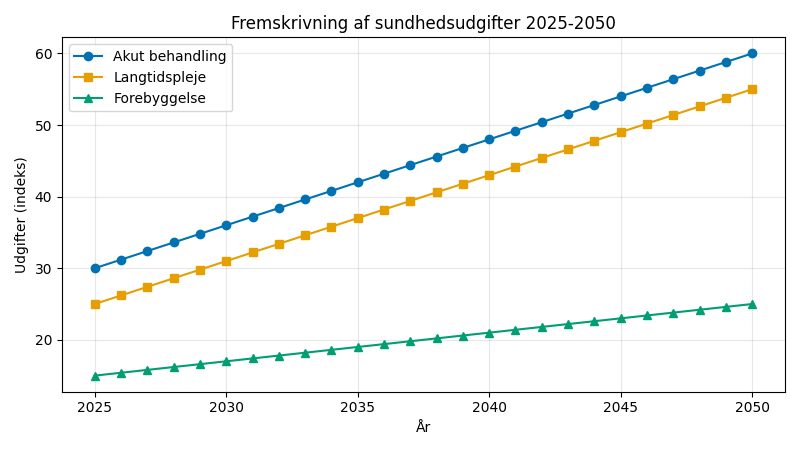
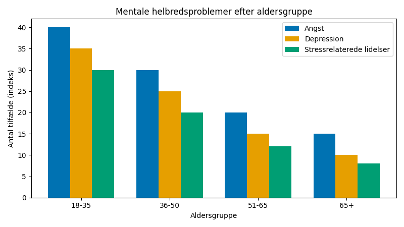
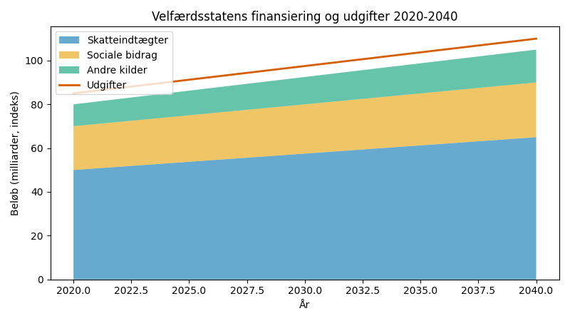

# Studieprøven _Practice Test 25_

  

## Outline

- Læseforståelse (90 minutter)
  - Delprøve 1
  - Delprøve 2A
  - Delprøve 2B
  - Delprøve 3
- Skriftlig fremstilling (3 timer)
- Mundtlig kommunikation (30 minutter)

  Help Den Frie Prøvebank

_This practice test was generated by Den Frie Prøvebank and is unofficial. Den Frie Prøvebank's ability to validate how well its tests match the official tests, in terms of content and structure, is limited. Users should seek guidance from official teaching institutions as to the structure and content of the exams in question._

## Læseforståelse

### Delprøve 1 (25 minutter)
**Ingen hjælpemidler tilladt**

#### Tekstsamling: Sundhed og velfærd i det moderne Danmark

**Tekst A: Fremtidens sundhedssystem**

Danmarks sundhedsudgifter udgør 17,8 % af BNP og vokser med 4,2 % årligt på grund af demografiske ændringer. Telemedicin bruges i 89 % af opfølgningskonsultationer og reducerer patienternes transportbehov med 67 %. Robotkirurgi anvendes i 45 % af de komplekse operationer med reduceret genopretningstid og forbedret præcision. AI‑diagnostik implementeres på 78 % af danske hospitaler til billedanalyse og tidlig sygdomsopsporing. Personaliseret medicin baseret på genetisk profilering afprøves på 34 000 patienter årligt.

**Tekst B: Mental sundhed og psykosocial støtte**

Mentale sundhedsproblemer påvirker 23 % af danske voksne årligt, med angst og depression som hovedårsager. Ventetiderne til psykiatrisk behandling er reduceret til 4,2 måneder gennem kapacitetsudvidelse og digitale terapimuligheder. Mentale sundhedsprogrammer på arbejdspladsen implementeres i 67 % af danske virksomheder og reducerer sygefraværet med 28 %. Psykologhjælp for unge tiltrækker 145 000 deltagere årligt gennem skolebaserede og fællesskabsprogrammer. Selvmordsforebyggende hotlines håndterer 89 000 opkald om året med krisestøtte tilgængelig døgnet rundt.

**Tekst C: Forebyggelse og sundhedsfremme**

Vaccinationsdækningen for børnesygdomme når 97,8 % og sikrer flokimmunitet mod smitsomme sygdomme. Screeningsprogrammer for kræftopsporing omfatter 2,8 millioner deltagere årligt og identificerer sygdomme i tidlige behandlingsbare stadier. Tobaksforbruget er faldet til 11,2 % af befolkningen gennem omfattende forebyggelseskampagner og lovgivningsmæssige tiltag. Andelen af overvægtige er stabiliseret på 17,4 % blandt voksne gennem folkesundhedsinitiativer og livsstilsinterventioner. Fysisk aktivitetsniveau er øget, så 73 % af voksne opfylder WHO's anbefalinger for motion.

**Tekst D: Ældreomsorg og demografiske udfordringer**

Danmarks 1,34 millioner borgere over 65 år forventes at stige til 1,78 millioner inden 2035. Hjemmeplejen betjener 234 000 ældre og sparer 12 milliarder kroner årligt sammenlignet med institutionspleje. Teknologibaseret pleje som overvågningsudstyr og alarmenheder anvendes af 156 000 ældre borgere. Demens rammer 89 000 danskere, og specialiserede plejeinstitutioner huser 23 000 patienter, der kræver intensiv støtte. Tværgenerationelle programmer kombinerer børnepasning og ældrepleje på 45 institutioner landet over.

**Tekst E: Sundhedsinnovation og digital sundhed**

Digitale sundhedsstartups tiltrækker 4,7 milliarder kroner i venturekapital årligt. Bærbare sundhedsenheder bruges af 2,1 millioner danskere til kontinuerlig overvågning af vitale tegn og aktivitetsniveauer. Elektroniske patientjournaler er integreret hos alle sundhedsudbydere og muliggør problemfri informationsdeling mellem forskellige medicinske specialister. Sundhedsapps bruges af 78 % af smartphone‑brugere til aktivitetsregistrering, medicinpåmindelser og adgang til sundhedsoplysninger. Biobank Danmark samler genetiske data fra 890 000 deltagere til forskning i personaliseret medicin.

#### Spørgsmål til tekstsamlingen:

1. Hvor mange procent af BNP udgør Danmarks sundhedsudgifter?

2. Med hvor mange procent vokser sundhedsudgifterne årligt?

3. I hvor mange procent af opfølgningskonsultationerne bruges telemedicin?

4. Med hvor mange procent reducerer telemedicin patienternes transportbehov?

5. I hvor mange procent af de komplekse operationer anvendes robotkirurgi?

6. På hvor mange procent af danske hospitaler implementeres AI‑diagnostik?

7. Hvor mange patienter deltager årligt i piloten for personaliseret medicin?

8. Hvor mange procent af danske voksne påvirkes af mentale sundhedsproblemer årligt?

9. Til hvor mange måneder er ventetiderne til psykiatrisk behandling reduceret?

10. I hvor mange procent af danske virksomheder implementeres mentale sundhedsprogrammer på arbejdspladsen?

11. Hvor mange deltagere tiltrækker psykologhjælp for unge årligt?

12. Hvor stor en procentdel udgør vaccinationsdækningen mod børnesygdomme?

13. Hvor mange millioner deltagere omfatter de årlige screeningsprogrammer for kræft?

14. Til hvor mange procent af befolkningen er tobaksforbruget faldet?

15. Hvor mange millioner borgere over 65 år er der i Danmark?

### Delprøve 2A (del af 65 minutter samlet for 2A, 2B og 3)

#### Tekst med fjernede afsnit: Velfærdsstatens fremtid

_Sæt bogstavet for den rigtige sætning i hvert felt._

Danmarks velfærdsmodel står over for grundlæggende udfordringer fra demografisk omstilling, teknologiske forandringer og pres fra globaliseringen. Traditionelle antagelser om arbejde, beskatning og social forsørgelse må genovervejes for at sikre en bæredygtig velfærd.

**(1)** ________

Finansieringen af velfærden bliver stadig vanskeligere, i takt med at færre borgere i den erhvervsaktive alder skal forsørge en voksende ældre befolkning. Skattegrundlaget udhules både af demografiske ændringer og af globalisering, der muliggør skatteunddragelse gennem internationale konstruktioner.

**(2)** ________

Forslag om borgerløn får politisk opmærksomhed som en mulig løsning på teknologisk arbejdsløshed og udfordringer i den platformbaserede økonomi. Pilotprogrammer afprøver borgerlønsordningens virkninger på arbejdsmotivation og sociale resultater.

**(3)** ________

Sundhedsudgifterne stiger på grund af nye dyre behandlinger og en aldrende befolkning, der har behov for intensiv pleje. Teknologien lover effektiviseringsgevinster, men driver også udgifterne op gennem avancerede medicinske procedurer og diagnostisk udstyr.

**(4)** ________

Immigrationsmønstre påvirker velfærdens holdbarhed, idet immigranter både bidrager til og modtager ydelser fra de sociale systemer. Integrationssucces afgør, om immigration styrker eller belaster velfærdsstatens finanser.

**(5)** ________

International koordination af velfærdspolitikker bliver nødvendig, når arbejdskraftens mobilitet og økonomisk integration gør de nationale systemer indbyrdes afhængige. EU's sociale søjle‑initiativer harmoniserer minimumsstandarder.

#### Fjernede afsnit (vælg det rigtige for hver position):

1. Afsnit 1
<ul class="multiple-choice-answers">
1. Forsørgerkvoten i Danmark vil stige fra nuværende 35 % til forventede 58 % i 2050, når babyboom‑generationen når pensionsalderen.
2. Automatisering truer traditionelle ansættelsesforhold, efterhånden som teknologisk fortrængning accelererer, og der kræves nye tilgange til indkomstsikring og social beskyttelse.
3. Udgifter til klimatilpasning anslås til 67 milliarder kroner om året i 2030 og konkurrerer med traditionelle velfærdsprioriteringer om begrænsede offentlige ressourcer.
</ul>

2. Afsnit 2
<ul class="multiple-choice-answers">
1. Selskabsskattekonkurrence mellem EU‑medlemsstater reducerer de offentlige indtægter, der er til rådighed for velfærdsudgifter, i takt med at virksomheder flytter til lande med lavere skatter.
2. Multinationale strategier til overskudsflytning muliggjort af den digitale økonomi gør det muligt for virksomheder at undgå beskatning i de lande, hvor den egentlige økonomiske aktivitet og værdiskabelse finder sted.
3. Progressiv beskatning møder grænser, når højtlønnede og kapital kan flytte internationalt, hvilket begrænser de nationale skattesystemers omfordelende kapacitet.
</ul>

3. Afsnit 3
<ul class="multiple-choice-answers">
1. Det finske UBI‑forsøg viste beskedne effekter på beskæftigelsen, men reducerede bureaukratiet og forbedrede den mentale sundhed hos deltagere, der modtog ubetinget basisindkomst.
2. Danske fagforeninger udtrykker skepsis over for borgerløn som en potentiel trussel mod kollektive forhandlingsrettigheder og traditionelle lønfastsættelsesmekanismer.
3. Ledere i teknologisektoren går ind for borgerløn som et nødvendigt svar på AI‑drevet jobfortrængning og den ændrede karakter af arbejde i den digitale økonomi.
</ul>

4. Afsnit 4
<ul class="multiple-choice-answers">
1. Præcisionsmedicin og genterapi tilbyder revolutionerende behandlingsmuligheder, men koster millioner af kroner pr. patient til sjældne sygdomme og komplekse lidelser.
2. Administrativ digitalisering reducerer sundhedssektorens bureaukratiomkostninger, men kræver betydelige indledende investeringer i teknologiinfrastruktur og personaleuddannelse.
3. Forebyggelsesprogrammer giver langsigtede besparelser ved at undgå dyre behandlingsomkostninger, men kræver vedvarende politisk engagement og investeringer over flere årtier.
</ul>

5. Afsnit 5
<ul class="multiple-choice-answers">
1. Højtuddannede immigranter bidrager mere i skatter, end de modtager i velfærdsydelser, og giver dermed et positivt nettobidrag til den danske velfærdsstat.
2. Programmer til integration af flygtninge koster anslået 89 000 kroner per person årligt i de første år, men giver positive afkast gennem vellykket beskæftigelsesintegration.
3. EU's fri bevægelighed muliggør velfærdsshopping, når borgere søger mere generøse ydelser i andre medlemslande end i deres oprindelseslande.
</ul>

### Delprøve 2B (del af 65 minutter samlet for 2A, 2B og 3)

#### Tekst: Livsstilssygdomme og forebyggelse

Danmarks sundhedssystem fokuserer i stigende grad på at forebygge livsstilssygdomme gennem omfattende folkesundhedsindsatser. Ikke‑smitsomme sygdomme såsom diabetes, hjerte‑kar‑sygdomme og kræft står for 89 % af dødsfald og 78 % af sundhedsudgifter.

Kostmønstre bidrager væsentligt til sygdomsbyrden, idet forbruget af forarbejdede fødevarer og sukkerindtaget ligger over de anbefalede niveauer hos størstedelen af befolkningen. Alkoholforbruget forbliver højt, idet 16 % af voksne regelmæssigt overskrider de sikre grænser.

Fysisk inaktivitet påvirker 27 % af danske voksne, som ikke lever op til WHO's motionsanbefalinger. Stillestående arbejdsmiljøer og skærmbaserede fritidsaktiviteter bidrager til faldende konditionsniveauer i alle aldersgrupper.

Tobaksbrug fortsætter trods årtiers kampagner mod rygning; 11,2 % af voksne er faste rygere, og e‑cigaretter bliver populære blandt unge. Eksponering for passiv rygning berører sårbare grupper, herunder børn og gravide.

Miljømæssige faktorer, herunder luftforurening, støj og kemikalieeksponering, bidrager til udvikling af kroniske sygdomme. Byområder mangler ofte grønne områder til rekreation og udsætter beboerne for trafikrelaterede forurenende stoffer.

Sociale determinanter for sundhed, såsom indkomstulighed, uddannelsesniveau og kvarterets karakteristika, er stærke indikatorer for helbredsresultater. Sundhedsforskelle består mellem forskellige socioøkonomiske grupper trods universel adgang til sundhedsvæsenet.

Forebyggelsesstrategier skal tackle flere risikofaktorer samtidigt gennem integrerede tilgange, der kombinerer individuel adfærdsændring med miljømæssige forbedringer og politiske indgreb på befolkningsniveau.

#### Spørgsmål til teksten:

_Sæt en cirkel om det rigtige svar._

1. Hvor mange procent af dødsfaldene er ikke‑smitsomme sygdomme ansvarlige for ifølge teksten?
<ul class="multiple-choice-answers">
1. 82 % koncentreret primært blandt ældre  
2. 89 % og udgør 78 % af sundhedsudgifterne  
3. 94 % med stigende forekomst blandt yngre demografier
</ul>

2. Hvilke kostfaktorer nævnes som medvirkende til sygdomsbyrden?
<ul class="multiple-choice-answers">
1. Forbrug af forarbejdede fødevarer og sukkerindtag, der overskrider de anbefalede niveauer  
2. Kun utilstrækkeligt indtag af frugt og grøntsager  
3. Udelukkende vitaminmangel og ernæringsmæssige ubalancer
</ul>

3. Hvor mange procent af danske voksne lever ikke op til WHO's motionsanbefalinger?
<ul class="multiple-choice-answers">
1. 21 % primært blandt bybefolkningen  
2. 27 % som ikke lever op til motionsanbefalingerne  
3. 34 % koncentreret blandt de ældre aldersgrupper
</ul>

4. Hvad nævnes om tobaksforbruget i teksten?
<ul class="multiple-choice-answers">
1. 11,2 % af voksne er faste rygere, og e‑cigaretter bliver populære blandt unge  
2. Faldende rygerprocent på tværs af alle demografier uden specifik statistik  
3. Kun traditionel rygning uden omtale af nye tobaksprodukter
</ul>

5. Hvilken tilgang til forebyggelsesstrategier foreslås i teksten?
<ul class="multiple-choice-answers">
1. Integrerede tilgange, der kombinerer individuel adfærdsændring med miljømæssige forbedringer og politiske indgreb  
2. Udelukkende individuelt ansvar for livsstilsvalg  
3. Kun medicinsk behandling efter sygdomsudbrud
</ul>

### Delprøve 3 (del af 65 minutter samlet for 2A, 2B og 3)

#### Tekst med fjernede ord: Sundhedsteknologi og personaliseret medicin

Teknologiske fremskridt __(1)__ ______ sundhedslevering gennem præcisionsdiagnostik og målrettede behandlinger. Personlig medicin __(2)__ ______ de traditionelle standardbehandlinger med individualiseret terapi baseret på genetiske profiler.

Genetiske tests __(3)__ ______ personer til at forstå deres disposition for visse sygdomme og træffe informerede livsstilsvalg. Farmakogenomik __(4)__ ______ hvordan patienter reagerer på forskellige mediciner baseret på deres genetiske sammensætning.

Kunstig intelligens __(5)__ ______ store datasæt for at identificere mønstre og forudsige sundhedsresultater mere præcist end traditionelle metoder. Maskinlæringsalgoritmer __(6)__ ______ kontinuerligt af nye data for at forbedre diagnostisk nøjagtighed.

Bærbare enheder __(7)__ ______ kontinuerlig overvågning af vitale tegn og muliggør tidlig påvisning af sundhedsproblemer. Indsamling af realtidsdata __(8)__ ______ sundhedspersonale til at gribe ind proaktivt frem for reaktivt.

Digitale terapier __(9)__ ______ traditionelle lægemidler for visse tilstande gennem app‑baserede indgreb og adfærdsændringer. Disse løsninger __(10)__ ______ tilgængelige og omkostningseffektive behandlingsmuligheder for patienter.

#### Valgmuligheder:

<table class="horizontal-multiple-choice">
  <tbody>
    <tr>
      <td><strong>1</strong></td>
      <td><strong>a.</strong> transformerer</td>
      <td><strong>b.</strong> forbedrer</td>
      <td><strong>c.</strong> påvirker</td>
      <td><strong>d.</strong> revolutionerer</td>
    </tr>
    <tr>
      <td><strong>2</strong></td>
      <td><strong>a.</strong> erstatter</td>
      <td><strong>b.</strong> udfordrer</td>
      <td><strong>c.</strong> forbedrer</td>
      <td><strong>d.</strong> supplerer</td>
    </tr>
    <tr>
      <td><strong>3</strong></td>
      <td><strong>a.</strong> hjælper</td>
      <td><strong>b.</strong> gør det muligt</td>
      <td><strong>c.</strong> støtter</td>
      <td><strong>d.</strong> letter</td>
    </tr>
    <tr>
      <td><strong>4</strong></td>
      <td><strong>a.</strong> forudsiger</td>
      <td><strong>b.</strong> bestemmer</td>
      <td><strong>c.</strong> analyserer</td>
      <td><strong>d.</strong> undersøger</td>
    </tr>
    <tr>
      <td><strong>5</strong></td>
      <td><strong>a.</strong> analyserer</td>
      <td><strong>b.</strong> bearbejder</td>
      <td><strong>c.</strong> studerer</td>
      <td><strong>d.</strong> gennemgår</td>
    </tr>
    <tr>
      <td><strong>6</strong></td>
      <td><strong>a.</strong> udvikles</td>
      <td><strong>b.</strong> forbedres</td>
      <td><strong>c.</strong> tilpasser</td>
      <td><strong>d.</strong> lærer</td>
    </tr>
    <tr>
      <td><strong>7</strong></td>
      <td><strong>a.</strong> muliggør</td>
      <td><strong>b.</strong> letter</td>
      <td><strong>c.</strong> støtter</td>
      <td><strong>d.</strong> fremmer</td>
    </tr>
    <tr>
      <td><strong>8</strong></td>
      <td><strong>a.</strong> hjælper</td>
      <td><strong>b.</strong> gør det muligt</td>
      <td><strong>c.</strong> støtter</td>
      <td><strong>d.</strong> letter</td>
    </tr>
    <tr>
      <td><strong>9</strong></td>
      <td><strong>a.</strong> supplerer</td>
      <td><strong>b.</strong> erstatter</td>
      <td><strong>c.</strong> forbedrer</td>
      <td><strong>d.</strong> udfordrer</td>
    </tr>
    <tr>
      <td><strong>10</strong></td>
      <td><strong>a.</strong> tilbyder</td>
      <td><strong>b.</strong> stiller til rådighed</td>
      <td><strong>c.</strong> skaber</td>
      <td><strong>d.</strong> udvikler</td>
    </tr>
  </tbody>
</table>

## Skriftlig fremstilling (3 timer)
**Alle ordbøger er tilladt**

### Vælg én af følgende tre opgaver:

#### Opgave 1: Demografiske udfordringer og sundhedssystemet

**Grafik:** 

**Manchet:** En aldrende befolkning driver stigningen i sundhedsudgifterne på tværs af alle kategorier, men investering i forebyggelse og tidlig indsats kan reducere behovet for langtidspleje og akutte behandlinger.

**Opgave:** Skriv en sammenhængende tekst på mindst 400 ord, hvor du:
- analyserer sundhedsudgiftsprojektionerne fra grafikken  
- diskuterer de demografiske udfordringer for sundhedsvæsenets bæredygtighed  
- vurderer effektiviteten af forebyggelse versus behandlingsstrategier  
- argumenterer for balancerede tilgange til fordeling af sundhedsressourcer

#### Opgave 2: Mental sundhed og det moderne samfund

**Grafik:** 

**Manchet:** Mentale sundhedsudfordringer rammer særligt de yngre generationer på grund af sociale mediers pres, økonomisk usikkerhed og ændrede sociale strukturer. Omfattende indsatser kræver både individuel støtte og samfundsmæssige ændringer.

**Opgave:** Skriv en sammenhængende tekst på mindst 400 ord, hvor du:
- præsenterer mønstrene for mental sundhed på tværs af aldersgrupper ud fra grafikken  
- analyserer de faktorer, der bidrager til mentale sundhedsudfordringer  
- diskuterer interventionsstrategier og støttesystemer  
- foreslår samfundsbaserede tilgange til fremme af mental sundhed

#### Opgave 3: Velfærdsstatens finansiering og bæredygtighed

**Grafik:** 

**Manchet:** Velfærdsstatens finansiering står over for bæredygtighedsudfordringer, da demografiske ændringer øger udgifterne, mens skattegrundlaget stagnerer. Nye finansieringsmodeller eller justeringer af ydelser kan blive nødvendige.

**Opgave:** Skriv en sammenhængende tekst på mindst 400 ord, hvor du:
- redegør for finansieringstendenser og bæredygtighedsudfordringer ud fra grafikken  
- analyserer årsagerne til velfærdsstatens økonomiske pres  
- diskuterer mulige løsninger for bæredygtig velfærd  
- vurderer afvejningerne mellem forskellige reformtilgange

_Brug disse sider til at skrive din skriftlige opgave._

---

## Mundtlig kommunikation (30 minutter inkl. votering)

### Opgaveark med tre emner til forberedelse:

#### Emne 1: Fremtidens sundhedssystem

**Stikord til inspiration:**
- demografiske udfordringer og en aldrende befolkning  
- teknologisk integration og digital sundhed  
- forebyggelses‑ versus behandlingsstrategier  
- sundhedsvæsenets arbejdsstyrke og professionelle roller  
- omkostningskontrol og ressourceallokering  
- patientinddragelse og egenomsorg  
- sundhedsuligheder og adgangsproblemer  
- internationalt sundhedssamarbejde

#### Emne 2: Mental sundhed i samfundet

**Stikord til inspiration:**
- moderne stressfaktorer og livsstilsfaktorer  
- sociale medier og digitalt pres  
- mentale sundhedsprogrammer på arbejdspladsen  
- unge og mentale sundhedsudfordringer  
- stigmareduktion og bevidsthed  
- tilgængelighed og adgang til behandling  
- lokale støttesystemer  
- forebyggelse og tidlig indsats

#### Emne 3: Velfærdsstatens fremtid

**Stikord til inspiration:**
- demografisk omstilling og forsørgerkvotienter  
- finansieringens bæredygtighed og skattepolitik  
- teknologiens indvirkning på beskæftigelsen  
- forslag om borgerløn  
- immigration og velfærdsstaten  
- international konkurrence om velfærd  
- intergenerationel retfærdighed  
- strategier for tilpasning af velfærdsstaten

### Prøveforløb:

1. **Lodtrækning:** Vælg ét af de tre forberedte emner
2. **Præsentation (5 minutter):** Struktureret gennemgang af det valgte emne
3. **Interview (15 minutter):** Uddybende samtale med eksaminator baseret på præsentationen
4. **Votering og karaktergivning (10 minutter)**

### Bedømmelseskriterier:

- **Sproglig korrekthed:** grammatik, ordforråd og udtale  
- **Kommunikativ kompetence:** evne til at formidle budskaber klart  
- **Indholdsrigdom:** faglig dybde og nuanceret forståelse  
- **Struktur:** logisk opbygning og sammenhæng  
- **Interaktion:** evne til dialog og respons på spørgsmål  

---

_This practice test was generated by Den Frie Prøvebank and is unofficial. Den Frie Prøvebank's ability to validate how well its tests match the official tests, in terms of content and structure, is limited. Users should seek guidance from official teaching institutions as to the structure and content of the exams in question._
