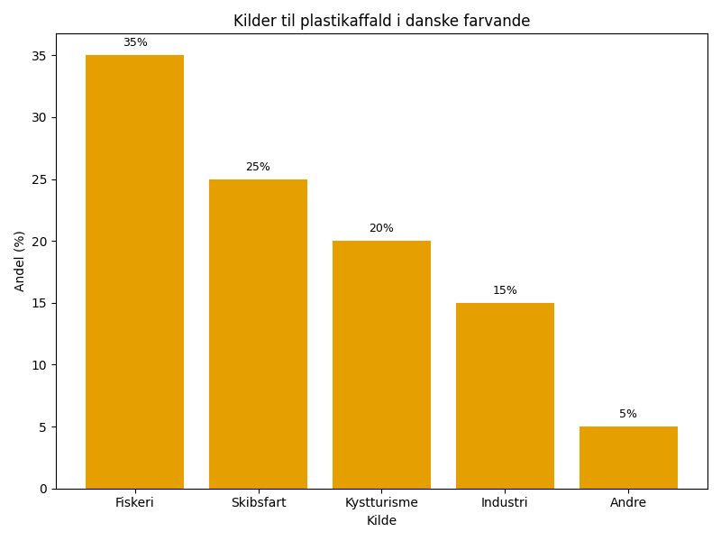
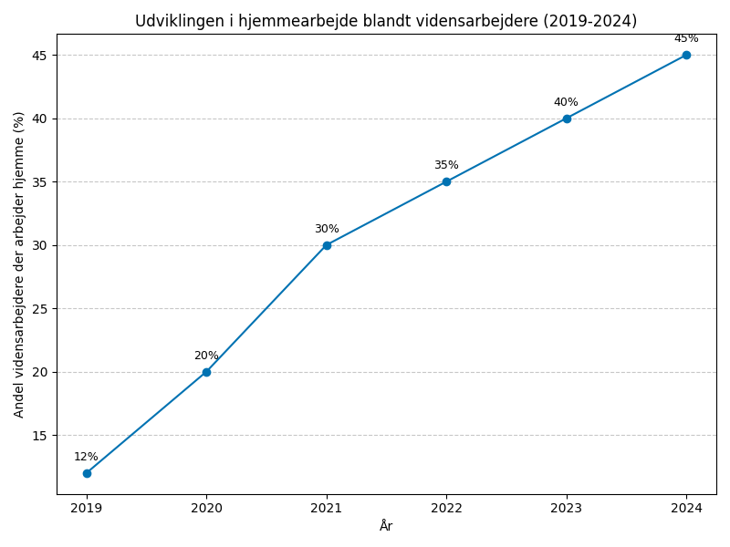
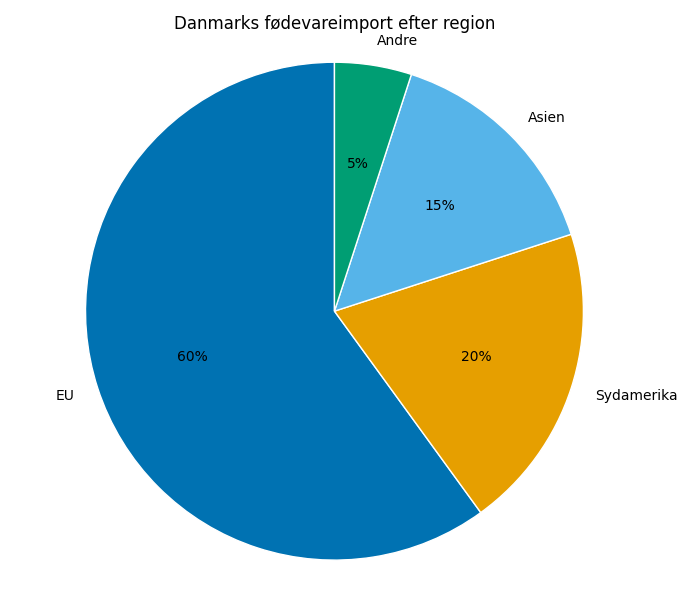

# Studieprøven _Practice Test 4_

  

## Outline

- Læseforståelse (90 minutter)
  - Delprøve 1
  - Delprøve 2A
  - Delprøve 2B
  - Delprøve 3
- Skriftlig fremstilling (3 timer)
- Mundtlig kommunikation (30 minutter)

  Help Den Frie Prøvebank

_This practice test was generated by Den Frie Prøvebank and is unofficial. Den Frie Prøvebank's ability to validate how well its tests match the official tests, in terms of content and structure, is limited. Users should seek guidance from official teaching institutions as to the structure and content of the exams in question._

## Læseforståelse

### Delprøve 1 (25 minutter)
**Ingen hjælpemidler tilladt**

#### Tekstsamling: Digital transformation i det danske samfund

**Tekst A: Digital forvaltning og digitaliseringen af det offentlige**
Danmark er førende inden for digital forvaltning. 95% af alle borgerkontakter til det offentlige sker nu digitalt gennem borger.dk og virk.dk. Digital Post blev obligatorisk i 2014 og har sparet staten 2,3 milliarder kroner årligt. MitID erstattede NemID i 2021 og bruges nu af 5,8 millioner danskere. Automatisering af sagsbehandling har reduceret gennemsnitlige behandlingstider med 40% siden 2020.

**Tekst B: Digitalisering i sundhedssektoren**
Telemedicin er blevet standard i dansk sundhedsvæsen. 65% af alle lægebesøg foregår nu som videokonsultationer. Sundhedsplatformen samler patientdata fra alle hospitaler og giver læger adgang til komplette journaler på tværs af regioner. Kunstig intelligens hjælper med diagnosticering - AI kan nu opdage lungekræft på røntgenbilleder med 94% nøjagtighed. Robotassisteret kirurgi anvendes på 15% af alle operationer.

**Tekst C: Digital uddannelse og e-learning**
Alle danske gymnasier har 1:1 computer-programmer, hvor hver elev har sin egen bærbare computer. 85% af undervisningsmaterialer er nu digitale. Universiteter tilbyder 200+ online kurser, og 30% af alle universitetsstuderende tager mindst ét online-fag. Virtual reality bruges til træning af kirurger og ingeniører. Adaptive læringssystemer tilpasser indholdet til hver studerendes niveau automatisk.

**Tekst D: Digitalt arbejdsliv og fjernarbejde**
Corona-pandemien accelererede fjernarbejde – 55 % af danske vidensarbejdere arbejder nu hjemmefra mindst to dage ugentligt. Digitale mødeplatforme som Teams og Zoom bruges af 90 % af alle virksomheder. Cloud-baserede systemer gør det muligt at arbejde fra hvor som helst. gig-economy platforme som Just Eat og Uber beskæftiger 120.000 danskere som freelancere.

**Tekst E: Cybersikkerhed og digitalt borgerskab**
Cyberangreb mod danske virksomheder er steget med 150 % siden 2020. Ransomware‑angreb koster dansk erhvervsliv 8 milliarder kroner årligt. Center for Cybersikkerhed registrerer 50.000 sikkerhedshændelser om måneden. Digitale kompetencekurser er blevet obligatoriske for alle offentligt ansatte. 78 % af danskere bruger to‑faktor‑godkendelse på deres vigtigste konti.

#### Spørgsmål til tekstsamlingen:

1. Hvor mange procent af borgerkontakter til det offentlige sker digitalt?

2. Hvor mange milliarder kroner sparer Digital Post staten årligt?

3. Hvor mange danskere bruger MitID?

4. Med hvor mange procent er behandlingstider reduceret siden 2020?

5. Hvor mange procent af lægebesøg foregår som videokonsultationer?

6. Med hvor høj nøjagtighed kan AI opdage lungekræft på røntgenbilleder?

7. På hvor mange procent af operationer anvendes robotassisteret kirurgi?

8. Hvor mange procent af undervisningsmaterialer er digitale?

9. Hvor mange online kurser tilbyder universiteter?

10. Hvor mange procent af universitetsstuderende tager mindst ét online-fag?

11. Hvor mange procent af danske vidensarbejdere arbejder hjemmefra mindst to dage ugentligt?

12. Hvor mange danskere beskæftiges som freelancere på gig-economy platforme?

13. Med hvor mange procent er cyberangreb steget siden 2020?

14. Hvor mange milliarder koster ransomware-angreb dansk erhvervsliv årligt?

15. Hvor mange procent af danskere bruger to‑faktor‑godkendelse?

### Delprøve 2A (Del af 65 minutter samlet for 2A, 2B og 3)

#### Tekst med fjernede afsnit: Fremtidens energisystem i Danmark

_Sæt bogstavet for den rigtige sætning i hvert felt._

Danmark står på tærsklen til en energirevolution, der vil transformere hele samfundet. Overgangen til 100% vedvarende energi inden 2030 kræver massive investeringer og teknologiske gennembrud på flere områder samtidigt.

**(1)** ________

Vindenergi udgør allerede rygraden i det danske energisystem. Offshore vindparker som Horns Rev og Anholt producerer strøm til millioner af husstande. De nye gigantiske vindmøller til havs kan generere op til 15 MW hver og fungere selv under ekstreme vejrforhold.

**(2)** ________

Energilagring er blevet en kritisk udfordring, da vind og sol ikke altid er tilgængelige. Batteriteknologi udvikles hurtigt, men Danmark satser også på power-to-X teknologi, hvor overskudsstrøm omdannes til hydrogen eller andre brændstoffer, der kan opbevares længe.

**(3)** ________

Sektorkobling bliver central for at maksimere effektiviteten. Varme, transport og elektricitet integreres i ét sammenhængende system. Varmepumper erstatter oliefyr, elbiler fungerer som mobile batterier, og fjernvarme udnyttes til energilagring.

**(4)** ________

Internationale samarbejder er uundværlige for den grønne omstilling. Danmarks energi-ø i Nordsøen vil levere strøm til flere europæiske lande gennem nye søkabler. EU's Green Deal skaber fælles standarder og finansiering til grønne projekter.

**(5)** ________

Borgernes rolle i energisystemet ændres fundamentalt. Fra passive forbrugere bliver de aktive prosumere, der både producerer og forbruger energi. Intelligente styringssystemer optimerer automatisk energiforbrug baseret på priser og tilgængelighed.

#### Fjernede afsnit (vælg det rigtige for hver position):

1. Afsnit 1
<ul class="multiple-choice-answers">
1. Klimamålene kræver en tredobling af vindkapaciteten inden 2030. Eksisterende vindmøller skal opgraderes, og nye områder til havs skal udbygges samtidig med, at støjgener til naboer minimeres.
2. Økonomien i den grønne omstilling er kolossal. Samlede investeringer anslås til 350 milliarder kroner over de næste ti år, finansieret gennem en kombination af offentlige midler og private investorer.
3. Teknologisk innovation driver udviklingen fremad. Danske virksomheder som Vestas og Ørsted er globale pionerer, der eksporterer grøn teknologi til markeder verden over og skaber betydelige eksportindtægter.
</ul>

2. Afsnit 2
<ul class="multiple-choice-answers">
1. Solenergi spiller en stadig vigtigere rolle trods Danmarks nordlige beliggenhed. Solceller bliver billigere og mere effektive, og private hustage samt store solfarms bidrager til den samlede energiproduktion.
2. Bioenergi fra landbrugsaffald og madaffald udgør en stabil energikilde. Biogasanlæg producerer både varme og strøm, mens de samtidig reducerer udslip af metan fra organisk affald.
3. Geotermisk energi undersøges som supplement til vindkraft. Dybe boringer kan udnytte jordens naturlige varme til både el- og varmeproduktion, særligt i byområder med stort energiforbrug.
</ul>

3. Afsnit 3
<ul class="multiple-choice-answers">
1. Smart grid‑teknologi gør det muligt at balancere udbud og efterspørgsel i realtid. Intelligent software forudsiger energiforbrug og justerer produktionen automatisk for at undgå overbelastning af nettet.
2. Pumpe‑lagringsanlæg under udvikling kan lagre energi ved at pumpe vand op i højbeholdere, når der er overskud, og generere strøm igen ved at lade vandet løbe ned gennem turbiner.
3. Compressed air energy storage (CAES) testes som alternativ til batterier. Overskudsenergi komprimerer luft i underjordiske huler, der senere kan frigive energi gennem ekspansion og turbiner.
</ul>

4. Afsnit 4
<ul class="multiple-choice-answers">
1. Transportsektor gennemgår en elektrificering uden fortilfælde. Ladestationer installeres massivt, og tunge køretøjer som lastbiler og busser overgår til brint-brændselsceller for længere rækkevidde.
2. Industrien tilpasser produktionsprocesser til variabel energitilgængelighed. Energiintensive industrier som datafabrikker og stålproduktion skedulerer aktiviteter efter, hvornår grøn strøm er billigst og mest tilgængelig.
3. Byggeri integrerer energisystemer allerede i designfasen. Nye bygninger skal være CO2-negative over deres levetid, hvilket betyder, at de producerer mere energi end de forbruger.
</ul>

5. Afsnit 5
<ul class="multiple-choice-answers">
1. Udfordringerne er komplekse og indbyrdes afhængige. Nettets stabilitet, forsyningssikkerhed og miljøhensyn skal balanceres, mens økonomien holdes konkurrencedygtig på det globale marked.
2. Jobmarkedet transformeres med tusindvis af nye grønne arbejdspladser. Samtidig skal traditionelle energiarbejdere omskoles til nye teknologier, hvilket kræver omfattende efteruddannelsesprogrammer.
3. Forskning og udvikling intensiveres inden for energiteknologi. Universiteter og private virksomheder samarbejder om at løse tekniske udfordringer og udvikle næste generation af grønne løsninger.
</ul>

### Delprøve 2B (Del af 65 minutter samlet for 2A, 2B og 3)

#### Tekst: Boligmarkedet i danske byer under pres

Danmarks boligmarked gennemgår den største transformation i moderne tid. Stigende priser, demografiske forskydninger og ændrede boligbehov skaber udfordringer for både købere og byggebranchen, mens politikere søger efter løsninger på den eskalerende boligkrise.

Prisudviklingen har ramt særligt hårdt i de største byer. I København er gennemsnitsprisen på ejerlejligheder steget til 6,2 millioner kroner, hvilket betyder, at en typisk familie skal bruge mere end 40% af deres indkomst på boligudgifter. Unge førstegangskøbere presses ud af markedet, da de ikke kan samle den nødvendige udbetaling eller kvalificere sig til de krævede lån.

Udbuddet af nye boliger halter langt efter efterspørgslen. Kommunale byggetilladelser tager op til to år at få, og mangel på håndværkere forsinker byggeprojekter yderligere. Samtidig blokerer eksisterende beboere ofte for nye byggeprojekter i deres nabolag, bekymrede for støj, trafik og ændringer i områdets karakter.

Lejemarkedet er blevet lige så udfordrende som ejermarkedet. Almene boliger har ventelister på over ti år i de populære områder, mens private udlejere kræver astronomiske huslejer. Mange unge er tvunget til at bo på kollegier eller dele lejligheder langt ind i tyverne, hvilket påvirker deres muligheder for at etablere familier og opbygge formue.

Geografiske forskelle skaber social opdeling. Velhavende familier koncentreres i de centrale bydele og forstæder med gode skoler og transport, mens lavindkomstgrupper henvises til perifere områder med færre muligheder. Dette underminerer den sociale sammenhængskraft og mobilitet, som har været kendetegnende for det danske samfund.

Politiske løsningsforslag spænder vidt. Nogle foreslår skattemæssige indgreb som grundskyld på boligværdi eller begrænsninger på spekulation. Andre ønsker liberalisering af byggelovgivningen og færre regulativer for at øge udbuddet. Diskussionen om sociale boliger og almene byggeri intensiveres, men finansieringen forbliver problematisk.

Teknologiske løsninger undersøges som supplement til traditionelt byggeri. Modulært byggeri, 3D-printede huse og prefabrikerede elementer kan potentielt reducere byggetider og omkostninger. Dog kræver disse metoder ændringer i byggelovgivningen og accept fra både branchen og forbrugerne.

#### Spørgsmål til teksten:

_Sæt en cirkel om det rigtige svar._

1. Hvad er gennemsnitsprisen på ejerlejligheder i København ifølge teksten?
<ul class="multiple-choice-answers">
1. 4,8 millioner kroner
2. 6,2 millioner kroner
3. 7,5 millioner kroner
</ul>

2. Hvor stor en andel af indkomsten bruger en typisk familie på boligudgifter i København?
<ul class="multiple-choice-answers">
1. Mere end 30%
2. Mere end 40%
3. Mere end 50%
</ul>

3. Hvor lang tid tager det at få kommunale byggetilladelser?
<ul class="multiple-choice-answers">
1. Op til ét år
2. Op til to år
3. Op til tre år
</ul>

4. Hvor lange er ventelisterne til almene boliger i populære områder?
<ul class="multiple-choice-answers">
1. Over fem år
2. Over ti år
3. Over femten år
</ul>

5. Hvilke teknologiske løsninger nævnes som mulige alternativer til traditionelt byggeri?
<ul class="multiple-choice-answers">
1. Smart home-teknologi og energibesparende materialer
2. Modulært byggeri, 3D-printede huse og prefabrikerede elementer
3. Robotbyggeri og automatiserede konstruktionsprocesser
</ul>

### Delprøve 3 (Del af 65 minutter samlet for 2A, 2B og 3)

#### Tekst med fjernede ord: Bæredygtig turisme i Danmark

Danmark __(1)__ ______ sig som destination for miljøbevidste turister, der søger autentiske oplevelser uden at skade naturen. Landet har __(2)__ ______ en strategi for bæredygtig turisme, der balancerer økonomiske fordele med miljøbeskyttelse.

Cykeltourisme er blevet en __(3)__ ______ turistattraktion. Med over 12.000 kilometer cykelruter tiltrækker Danmark millioner af internationale cyklister årligt. Denne form for turisme __(4)__ ______ minimale miljøpåvirkninger, mens den understøtter lokale økonomier i mindre byer og landområder.

Naturtourisme __(5)__ ______ også stigende popularitet. Nationalparker som Thy og Skjoldungernes Land tilbyder guidede ture, hvor turister kan lære om dansk flora og fauna. Strict regulering __(6)__ ______ at disse områder bevares for fremtidige generationer, mens de stadig kan opleves ansvarligt.

Hotelbranchen har __(7)__ ______ omfattende grønne initiativer. Mange hoteller har opnået miljøcertificeringer, reduceret energiforbrug og elimineret engangsplastik. Gæster __(8)__ ______ aktivt i bæredygtighedsindsatser gennem programmer for genanvendelse og vandbesparelse.

Køkkenet spiller en central __(9)__ ______ i bæredygtig turisme. Restauranter markedsfører nu lokalt producerede råvarer og sæsonbaserede menuer, der reducerer transportemissioner og __(10)__ ______ den danske madkultur. Michelinrestauranter som Noma har sat internationale standarder for bæredygtig gastronomi.

#### Valgmuligheder:

<table class="horizontal-multiple-choice">
  <tbody>
    <tr>
      <td><strong>1</strong></td>
      <td><strong>a.</strong> udvikler</td>
      <td><strong>b.</strong> positionerer</td>
      <td><strong>c.</strong> markedsfører</td>
      <td><strong>d.</strong> præsenterer</td>
    </tr>
    <tr>
      <td><strong>2</strong></td>
      <td><strong>a.</strong> implementeret</td>
      <td><strong>b.</strong> foreslået</td>
      <td><strong>c.</strong> overvejet</td>
      <td><strong>d.</strong> udviklet</td>
    </tr>
    <tr>
      <td><strong>3</strong></td>
      <td><strong>a.</strong> populær</td>
      <td><strong>b.</strong> vigtig</td>
      <td><strong>c.</strong> central</td>
      <td><strong>d.</strong> betydelig</td>
    </tr>
    <tr>
      <td><strong>4</strong></td>
      <td><strong>a.</strong> medfører</td>
      <td><strong>b.</strong> skaber</td>
      <td><strong>c.</strong> har</td>
      <td><strong>d.</strong> indebærer</td>
    </tr>
    <tr>
      <td><strong>5</strong></td>
      <td><strong>a.</strong> opnår</td>
      <td><strong>b.</strong> vinder</td>
      <td><strong>c.</strong> får</td>
      <td><strong>d.</strong> oplever</td>
    </tr>
    <tr>
      <td><strong>6</strong></td>
      <td><strong>a.</strong> garanterer</td>
      <td><strong>b.</strong> sikrer</td>
      <td><strong>c.</strong> forpligter</td>
      <td><strong>d.</strong> kræver</td>
    </tr>
    <tr>
      <td><strong>7</strong></td>
      <td><strong>a.</strong> introduceret</td>
      <td><strong>b.</strong> planlagt</td>
      <td><strong>c.</strong> implementeret</td>
      <td><strong>d.</strong> foreslået</td>
    </tr>
    <tr>
      <td><strong>8</strong></td>
      <td><strong>a.</strong> deltager</td>
      <td><strong>b.</strong> bidrager</td>
      <td><strong>c.</strong> involveres</td>
      <td><strong>d.</strong> engageres</td>
    </tr>
    <tr>
      <td><strong>9</strong></td>
      <td><strong>a.</strong> funktion</td>
      <td><strong>b.</strong> rolle</td>
      <td><strong>c.</strong> position</td>
      <td><strong>d.</strong> betydning</td>
    </tr>
    <tr>
      <td><strong>10</strong></td>
      <td><strong>a.</strong> fremmer</td>
      <td><strong>b.</strong> støtter</td>
      <td><strong>c.</strong> udvikler</td>
      <td><strong>d.</strong> bevarer</td>
    </tr>
  </tbody>
</table>

## Skriftlig fremstilling (3 timer)
**Alle ordbøger er tilladt**

### Vælg én af følgende tre opgaver:

#### Opgave 1: Plastikforurening i danske farvande

**Grafik:** 

**Manchet:** Plastikforurening truer det marine økosystem omkring Danmark. Mikroplastik findes nu i alle fisk fanget i danske farvande, og større plastikgenstande skader havdyr og ødelægger havbunden langs kysterne.

**Opgave:** Skriv en sammenhængende tekst på minimum 400 ord, hvor du:
- Analyserer fordelingen af plastikkilder vist i grafikken
- Diskuterer konsekvenserne af plastikforurening for marine økosystemer
- Vurderer de økonomiske og miljømæssige omkostninger
- Foreslår konkrete løsninger til at reducere plastikforurening

#### Opgave 2: Fjernarbejde og arbejdslivets fremtid

**Grafik:** 

**Manchet:** Corona‑pandemien revolutionerede danske arbejdspladser permanent. Fjernarbejde er gået fra at være en sjældenhed til at være normen for mange, hvilket påvirker alt fra bytrafik til boligpriser og social sammenhængskraft.

**Opgave:** Skriv en sammenhængende tekst på minimum 400 ord, hvor du:
 - Præsenterer udviklingen i hjemmearbejde fra grafikken
 - Analyserer årsagerne til fjernarbejdets popularitet
 - Diskuterer både positive og negative konsekvenser for samfundet
 - Argumenterer for, hvordan arbejdslivet bør organiseres fremover

#### Opgave 3: Fødevaresikkerhed og selvforsyning

**Grafik:** 

**Manchet:** Danmarks afhængighed af fødevareimport er blevet et sikkerhedspolitisk spørgsmål. Krigen i Ukraine og klimaforandringer har vist, hvor sårbart det globale fødevaresystem er, hvilket rejser spørgsmål om dansk selvforsyning.

**Opgave:** Skriv en sammenhængende tekst på minimum 400 ord, hvor du:
- Redegør for Danmarks importmønster baseret på grafikken
- Analyserer risikoen ved høj afhængighed af fødevareimport
- Diskuterer mulighederne for øget dansk selvforsyning
- Vurderer balancen mellem økonomi, sikkerhed og miljøhensyn

_Brug disse sider til at skrive din skriftlige opgave._

---

## Mundtlig kommunikation (30 minutter inkl. votering)

### Opgaveark med tre emner til forberedelse:

#### Emne 1: Kunstig intelligens og privatliv

**Stikord til inspiration:**
- Dataindsamling og overvågning
- Ansigtsgenkendelsesteknologi
- Personlighedsprofiler og målrettet reklame
- Lovgivning og GDPR-regulering
- Transparens i algoritmer
- Ret til at blive glemt
- International sammenligning
- Teknologiske løsninger og kryptering

#### Emne 2: Cirkulær økonomi i praksis

**Stikord til inspiration:**
- Genbrug og reparationskulturer
- Deleøkonomi og fælleseje
- Industrielle symbioser og affaldshåndtering
- Forbrugeradfærd og livsstilsændringer
- Regeringspolitik og incitamenter
- Innovation og nye forretningsmodeller
- Globale værdikæder og lokal produktion
- Økonomiske og miljømæssige gevinster

#### Emne 3: Danmarks rolle i international politik

**Stikord til inspiration:**
- EU-medlemskab og suverænitet
- NATO og forsvarspolitik
- Udviklingsbistands og humanitær indsats
- Klimadiplomati og grøn eksport
- Handelspolitik og globalisering
- Arktisk politik og Grønland
- FN og internationale organisationer
- Småstatsstrategier og soft power

### Prøveforløb:

1. **Lodtrækning:** Vælg ét af de tre forberedte emner
2. **Præsentation (5 minutter):** Struktureret gennemgang af det valgte emne
3. **Interview (15 minutter):** Uddybende samtale med eksaminator baseret på præsentationen
4. **Votering og karaktergivning (10 minutter)**

### Bedømmelseskriterier:

- **Sproglig korrekthed:** Grammatik, ordforråd og udtale
- **Kommunikativ kompetence:** Evne til at formidle budskaber klart
- **Indholdsrigdom:** Faglig dybde og nuanceret forståelse
- **Struktur:** Logisk opbygning og sammenhæng
- **Interaktion:** Evne til dialog og respons på spørgsmål

---

_This practice test was generated by Den Frie Prøvebank and is unofficial. Den Frie Prøvebank's ability to validate how well its tests match the official tests, in terms of content and structure, is limited. Users should seek guidance from official teaching institutions as to the structure and content of the exams in question._
