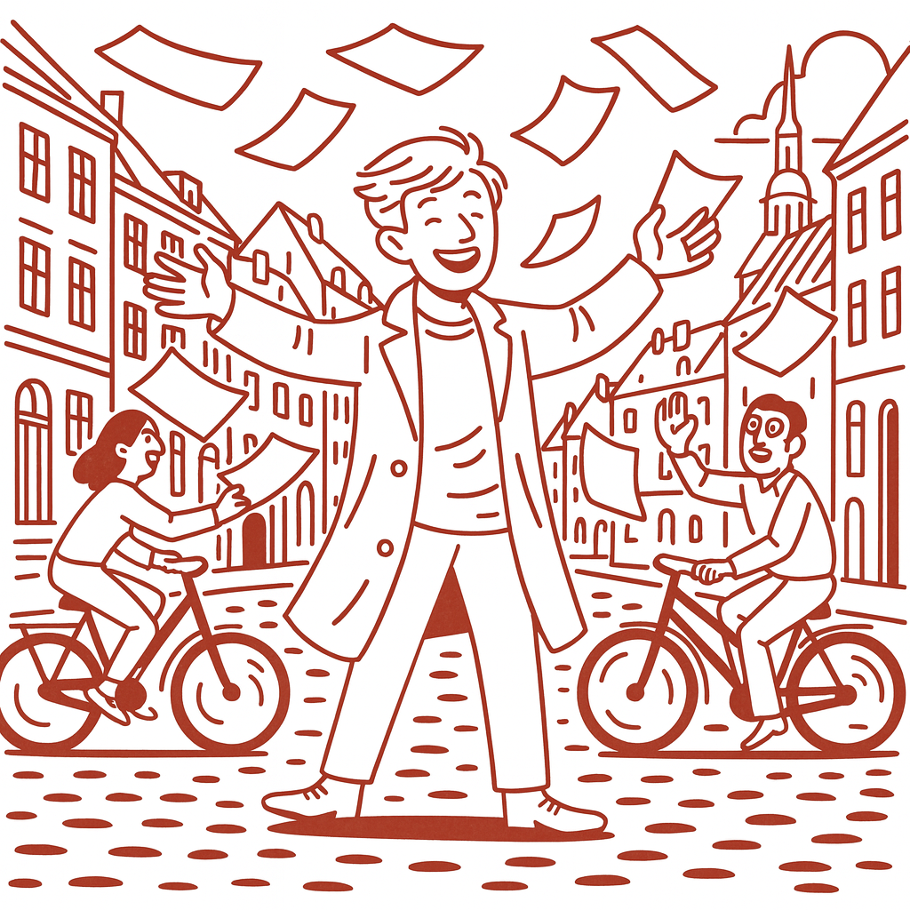
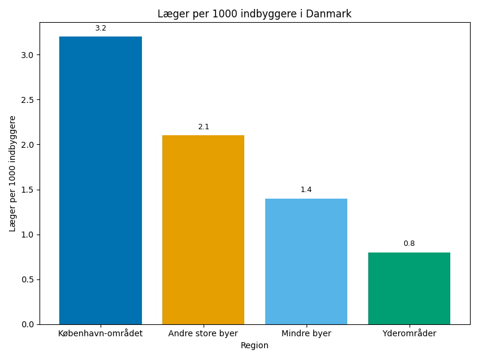
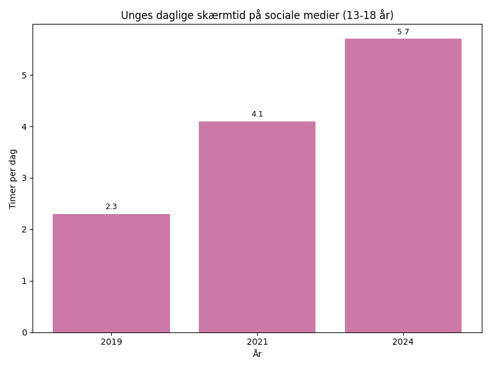
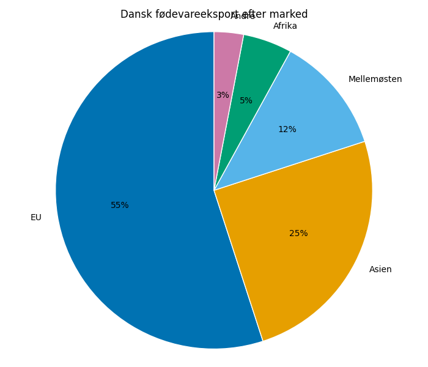

# Studieprøven _Practice Test 5_

  

## Outline

- Læseforståelse (90 minutter)
  - Delprøve 1
  - Delprøve 2A
  - Delprøve 2B
  - Delprøve 3
- Skriftlig fremstilling (3 timer)
- Mundtlig kommunikation (30 minutter)

  Help Den Frie Prøvebank

_This practice test was generated by Den Frie Prøvebank and is unofficial. Den Frie Prøvebank's ability to validate how well its tests match the official tests, in terms of content and structure, is limited. Users should seek guidance from official teaching institutions as to the structure and content of the exams in question._

## Læseforståelse

### Delprøve 1 (25 minutter)
**Ingen hjælpemidler tilladt**

#### Tekstsamling: Velfærdsstaten under forandring

**Tekst A: Sundhedssektorens udfordringer**
Danmarks sundhedssystem står over for store udfordringer. Ventelisterne til ikke-akutte behandlinger er steget til 18 uger i gennemsnit. 23% af sygeplejerskestillinger på hospitaler er ubesatte. Privatisering af visse behandlinger har reduceret presset – 35% af alle hofteoperationer udføres nu i private klinikker. Telemedicin anvendes i 70% af kontrolbesøg. Udgifterne til medicin er steget med 45% siden 2020.

**Tekst B: Uddannelsessystemets nye realiteter**
Folkeskolerne oplever faldende præstationer i læsning og matematik. 12% af elever starter i gymnasiet uden at mestre grundlæggende færdigheder. Lærermangel påvirker 40% af skoler, især i nordlige og vestlige egne. Antallet af private skoler er vokset til 17% af alle grundskoler. Digitale læremidler udgør nu 85% af undervisningsmaterialer, men skaber nye uligheder mellem socioøkonomiske grupper.

**Tekst C: Ældreplejen i krise**
Demografiske ændringer presser ældreplejen. Antallet af borgere over 80 år fordobles inden 2040. 60% af plejehjem har personalemangel. Hjemmepleje dækker nu 75% af alle ældre med behov for hjælp. Ventetiden til plejehjemsplads er steget til 14 måneder. Teknologiske løsninger som overvågning og robotassistenter implementeres for at kompensere for personalemangel.

**Tekst D: Arbejdsmarkedspolitik og integration**
Beskæftigelsesfrekvensen blandt ikke-vestlige indvandrere er 67%, sammenlignet med 79% for etniske danskere. 25.000 personer er i aktiveringsforløb gennem jobcentrene. Uddannelsesloftet påvirker 15.000 familier årligt. Kontanthjælpsmodtagere skal arbejde mindst 37 timer ugentligt for at modtage fuld ydelse. Integrationsprogrammer har 78% gennemførselsrate.

**Tekst E: Økonomisk bæredygtighed og fremtidssikring**
Den offentlige gæld udgør 42% af BNP. Skatteprocenten for toptreskat er 55,9%. Velfærdsudgifter konsumerer 28% af statsbudgettet. Folketrygden vil være underskudsgivende fra 2035 uden reformer. Automatisering truer 2,1 millioner arbejdspladser inden 2040. Den grønne omstilling kræver investeringer på 850 milliarder kroner over 15 år.

#### Spørgsmål til tekstsamlingen:

1. Hvor mange uger er ventelisterne til ikke-akutte behandlinger steget til?

2. Hvor mange procent af sygeplejerskestillinger på hospitaler er ubesatte?

3. Hvor mange procent af hofteoperationer udføres i private klinikker?

4. Med hvor mange procent er udgifterne til medicin steget siden 2020?

5. Hvor mange procent af elever starter i gymnasiet uden grundlæggende færdigheder?

6. Hvor mange procent af skoler påvirkes af lærermangel?

7. Hvor mange procent af grundskoler er private?

8. Hvornår fordobles antallet af borgere over 80 år?

9. Hvor mange procent af plejehjem har personalemangel?

10. Hvor mange måneder er ventetiden til plejehjemsplads steget til?

11. Hvor høj er beskæftigelsesfrekvensen blandt ikke-vestlige indvandrere?

12. Hvor mange familier påvirkes af uddannelsesloftet årligt?

13. Hvor mange procent af BNP udgør den offentlige gæld?

14. Hvornår vil Folketrygden være underskudsgivende uden reformer?

15. Hvor mange millioner arbejdspladser truer automatisering inden 2040?

### Delprøve 2A (Del af 65 minutter samlet for 2A, 2B og 3)

#### Tekst med fjernede afsnit: Klimaforandringernes påvirkning af Danmark

_Sæt bogstavet for den rigtige sætning i hvert felt._

Danmark mærker allerede konsekvenserne af globale klimaforandringer. Stigende temperaturer, ændrede nedbørsmønstre og hyppigere ekstremvejr påvirker alle aspekter af det danske samfund og kræver omfattende tilpasning.

**(1)** ________

Landbruget oplever dramatiske forandringer. Tørkeperioder ødelægger afgrøder, mens voldsomme regnvejr forårsager oversvømmelser på marker. Landmænd må investere i vandingssystemer og klimaresistente afgrødesorter. Vinproduktion blomstrer nu i det danske klima, mens traditionelle kornafgrøder kæmper.

**(2)** ________

Byerne står over for særlige udfordringer med håndtering af ekstrem nedbør. Københavns kloaksystem kan ikke klare de massive vandmængder, der falder ved skybrud. Blå-grønne løsninger som regnbede og permeable belægninger implementeres for at absorbere overfladevand.

**(3)** ________

Energisystemet må tilpasse sig mere uforudsigelige vejrforhold. Vindmøller producerer mindre strøm under ekstreme vejrforhold, mens solpaneler påvirkes af øget skydække. Smart grid-teknologi udvikles for at balancere produktion og forbrug under variable betingelser.

**(4)** ________

Biodiversiteten påvirkes markant af klimaændringerne. Danske arter forflyttes nordpå, mens sydlige arter invaderer økosystemerne. Skovene lider under tørke og storme, hvilket påvirker naturens evne til CO₂-optagelse og biodiversitetsbevarelse.

**(5)** ________

Internationale samarbejder bliver afgørende for Danmarks klimatilpasning. EU's klimaambitioner og globale aftaler som Paris-overenskomsten former nationale strategier, mens teknologisk innovation og vidensdeling på tværs af grænser accelererer.

#### Fjernede afsnit (vælg det rigtige for hver position):

1. Afsnit 1
<ul class="multiple-choice-answers">
1. Havniveaustigningen truer Danmarks 7.314 kilometer lange kystlinje. Lavtliggende områder som Lolland og dele af Vestjylland risikerer oversvømmelse, hvilket kan tvinge tusindvis til at flytte fra deres hjem.
2. Temperaturstigningen i Danmark har været 1,8 grader siden førindustriel tid, hvilket er højere end det globale gennemsnit. Varmerekorder sættes hvert år, og vintre bliver kortere og mildere.
3. Økonomiske omkostninger ved klimaforandringer anslås til 100 milliarder kroner årligt. Forsikringsselskaber registrerer stigende skader fra storme, oversvømmelser og andre ekstremvejr-begivenheder.
</ul>

2. Afsnit 2
<ul class="multiple-choice-answers">
1. Fødevaresikkerheden påvirkes af ustabile høstudbytter. Import af basiske fødevarer som korn og soja fra klimaramte områder bliver dyrere og mindre pålidelig, hvilket driver fødevarepriserne op.
2. Fiskeriet oplever, at traditionelle fiskearter som torsk og sild migrerer nordpå, mens nye sydlige arter som blåmusling og havaborre etablerer sig i danske farvande og ændrer marine økosystemer.
3. Turismebranchen kan både vinde og tabe på klimaforandringer. Mildere somre tiltrækker flere turister til Danmark, men vinterferie til ski-destinationer bliver mere usikre på grund af mindre sne.
</ul>

3. Afsnit 3
<ul class="multiple-choice-answers">
1. Sundhedssystemet forbereder sig på nye klimarelaterede sygdomme. Varmebølger øger risikoen for dehydrering og hjerteproblemer, mens fugtigere klima favoriserer spredning af smitsomme sygdomme.
2. Transportinfrastrukturen lider under ekstremvejr. Togforsinkelser på grund af storme stiger, mens asfaltveje smelter under ekstreme temperaturer og broer påvirkes af termisk udvidelse.
3. Vandforsyningen møder nye udfordringer med både oversvømmelser og tørke. Grundvandet forurenes af saltvandsindtrængning ved kysten, mens regnvandssystemer overbelastes under skybrud.
</ul>

4. Afsnit 4
<ul class="multiple-choice-answers">
1. Erhvervslivet tilpasser sig gradvist til klimavirkeligheden. Produktionsvirksomheder investerer i klimaanlæg og backup-systemer, mens nye grønne industrigrene som vindenergi og klimateknologi vokser hurtigt.
2. Forsikringsbranchen omstrukturerer sig på grund af stigende klimarisici. Præmier for ejendoms- og landbrugsforsikringer stiger, mens tidligere lavrisiko-områder nu klassificeres som højrisiko-zoner.
3. Byggeindustrien udvikler nye standarder for klimaresistent byggeri. Fundamenter skal kunne klare større grundvandsudsving, tage skal modstå kraftigere storme, og materialer tilpasses høj luftfugtighed.
</ul>

5. Afsnit 5
<ul class="multiple-choice-answers">
1. Politiske prioriteter omformes af klimapresset. Partier på tværs af spektret anerkender nødvendigheden af ambitiøse klimatiltag, selvom der er uenighed om metoder og tempoet i omstillingen.
2. Fremtidens Danmark kræver fundamental systemtænkning. Klimatilpasning integreres i alt fra byplanlægning til uddannelse, da samfundet indstiller sig på permanent forandring som den nye normal.
3. Forskning og udvikling intensiveres med fokus på klimaresistente løsninger. Universiteter og private virksomheder samarbejder om at udvikle teknologier, der kan hjælpe Danmark med at trives trods klimaforandringer.
</ul>

### Delprøve 2B (Del af 65 minutter samlet for 2A, 2B og 3)

#### Tekst: Digitaliseringens indvirkning på dansk demokrati

Digitaliseringen transformerer fundamentalt, hvordan demokratiet fungerer i Danmark. Sociale medier, online debat og digitale valgprocesser skaber både nye muligheder for borgerdeltagelse og alvorlige trusler mod demokratiske institutioner.

Politisk kommunikation er blevet radikalt anderledes. Politikere når direkte ud til borgerne gennem Facebook, Twitter og Instagram uden journalistisk formidling. Dette giver mere transparent adgang til politiske holdninger, men åbner også for misinformation og polarisering. Algoritmer bestemmer, hvilke politiske budskaber borgerne ser, hvilket kan skabe informationsbobler.

Valgkampagner drives nu primært online med sofistikeret målretning af vælgergrupper. Persondata bruges til at skræddersy politiske beskeder til specifikke demografiske grupper. Dette øger effektiviteten af politisk kommunikation, men rejser spørgsmål om privatliv og manipulation af vælgeradfærd.

Borgerdeltagelse er blevet mere tilgængelig gennem digitale platforme. Borgerforslag.dk giver alle mulighed for at foreslå lovændringer direkte til Folketinget. Online høringer og digitale borgermøder øger deltagelsen, særligt blandt yngre borgere. Dog ekskluderer den digitale kløft mellem generationer og socioøkonomiske grupper nogle borgere fra demokratiske processer.

Falske nyheder og desinformation spredes hurtigere end nogensinde før. Udenlandske aktører kan påvirke danske valg gennem koordinerede kampagner på sociale medier. Faktacheck-organisationer kæmper for at holde trit med den konstante strøm af misinformation, men deres rækkevidde er begrænset sammenlignet med virale løgne.

Den demokratiske debat polariseres af sociale mediers algoritmer, der favoriserer ekstreme holdninger og konfrontation frem for nuanceret diskussion. Politikere tilskyndes til at tage skarpere standpunkter for at generere engagement online, hvilket underminerer kompromissets kunst, som er central for det danske demokrati.

Databeskyttelse og digitalt privatliv bliver centrale politiske spørgsmål. Borgernes tillid til, at deres personlige data ikke misbruges politisk, er fundamental for demokratiets legitimitet. GDPR-lovgivning beskytter borgerne delvist, men teknologisk udvikling overhaler ofte regelværket.

#### Spørgsmål til teksten:

_Sæt en cirkel om det rigtige svar._
1. Hvordan har digitaliseringen ændret politisk kommunikation ifølge teksten?  
<ul class="multiple-choice-answers">
1. Politikere kommunikerer kun gennem traditionelle medier  
2. Politikere når direkte ud til borgerne uden journalistisk formidling  
3. Al politisk kommunikation foregår gennem offentlige tv-stationer
</ul>

2. Hvad bruges persondata til i moderne valgkampagner?  
<ul class="multiple-choice-answers">
1. At registrere alle borgeres stemmeadfærd elektronisk  
2. At skræddersy politiske beskeder til specifikke vælgergrupper  
3. At forhindre udenlandsk indblanding i valg
</ul>

3. Hvordan påvirker digitale platforme borgerdeltagelse? 
<ul class="multiple-choice-answers"> 
1. De øger deltagelsen, særligt blandt yngre borgere  
2. De reducerer borgerdeltagelse på tværs af alle aldersgrupper  
3. De har ingen målbar effekt på demokratisk deltagelse
</ul>

4. Hvad er en hovedudfordring ved falske nyheder ifølge teksten?  
<ul class="multiple-choice-answers">
1. De kan kun spredes gennem trykte medier  
2. De spredes hurtigere end faktacheck kan følge med  
3. De påvirker kun ældre borgeres holdninger
</ul>

5. Hvordan påvirker sociale mediers algoritmer den demokratiske debat?  
<ul class="multiple-choice-answers">
1. De fremmer nuanceret og balanceret diskussion  
2. De favoriserer ekstreme holdninger og konfrontation  
3. De har ingen påvirkning på politiske holdninger
</ul>

### Delprøve 3 (Del af 65 minutter samlet for 2A, 2B og 3)

#### Tekst med fjernede ord: Fremtiden for dansk landbrug

Det danske landbrug __(1)__ ______ sig på et nyt udviklingsstadium, hvor traditionelle metoder må vige for innovative løsninger. Klimaforandringer, miljøkrav og ændrede forbrugerpræferencer __(2)__ ______ branchen til fundamental omtænkning.

Præcisionslandbrug bliver __(3)__ ______ vigtigere for at optimere ressourceanvendelse. GPS-styrede traktorer og droner til markanalyse gør det muligt at __(4)__ ______ præcist den rigtige mængde gødning og vand til hver kvadratmeter jord. Dette reducerer miljøpåvirkningen betydeligt.

Økologisk produktion __(5)__ ______ markedsandele, da forbrugerne efterspørger pesticid- og GMO-fri fødevarer. Danske økologiske produkter opnår premium-priser på både hjemme- og eksportmarkeder, men __(6)__ ______ også højere produktionsomkostninger og lavere udbytter.

Vertikalt landbrug og drivhuse med kunstig belysning __(7)__ ______ eksperimenteret med som supplement til traditionel markproduktion. Disse metoder kan producere grøntsager året rundt uafhængigt af vejrforhold, men energiforbruget er __(8)__ ______.

Alternativ protein fra insekter og plantebaserede kilder __(9)__ ______ som nye forretningsområder. Danske virksomheder investerer i udvikling af insektprotein til både mennesker og dyr, mens plantebaseret “kød” finder __(10)__ ______ blandt miljøbevidste forbrugere.

#### Valgmuligheder:

<table class="horizontal-multiple-choice">
  <tbody>
    <tr>
      <td><strong>1</strong></td>
      <td><strong>a.</strong> bevæger</td>
      <td><strong>b.</strong> befinder</td>
      <td><strong>c.</strong> udvikler</td>
      <td><strong>d.</strong> forandrer</td>
    </tr>
    <tr>
      <td><strong>2</strong></td>
      <td><strong>a.</strong> hjælper</td>
      <td><strong>b.</strong> støtter</td>
      <td><strong>c.</strong> tvinger</td>
      <td><strong>d.</strong> opfordrer</td>
    </tr>
    <tr>
      <td><strong>3</strong></td>
      <td><strong>a.</strong> stadigt</td>
      <td><strong>b.</strong> mere</td>
      <td><strong>c.</strong> stadig</td>
      <td><strong>d.</strong> mindre</td>
    </tr>
    <tr>
      <td><strong>4</strong></td>
      <td><strong>a.</strong> anvende</td>
      <td><strong>b.</strong> fordele</td>
      <td><strong>c.</strong> sprede</td>
      <td><strong>d.</strong> koncentrere</td>
    </tr>
    <tr>
      <td><strong>5</strong></td>
      <td><strong>a.</strong> mister</td>
      <td><strong>b.</strong> beholder</td>
      <td><strong>c.</strong> vinder</td>
      <td><strong>d.</strong> deler</td>
    </tr>
    <tr>
      <td><strong>6</strong></td>
      <td><strong>a.</strong> medfører</td>
      <td><strong>b.</strong> forhindrer</td>
      <td><strong>c.</strong> undgår</td>
      <td><strong>d.</strong> reducerer</td>
    </tr>
    <tr>
      <td><strong>7</strong></td>
      <td><strong>a.</strong> bliver</td>
      <td><strong>b.</strong> har</td>
      <td><strong>c.</strong> er</td>
      <td><strong>d.</strong> kan</td>
    </tr>
    <tr>
      <td><strong>8</strong></td>
      <td><strong>a.</strong> lavt</td>
      <td><strong>b.</strong> moderat</td>
      <td><strong>c.</strong> begrænset</td>
      <td><strong>d.</strong> betydeligt</td>
    </tr>
    <tr>
      <td><strong>9</strong></td>
      <td><strong>a.</strong> forsvinder</td>
      <td><strong>b.</strong> opstår</td>
      <td><strong>c.</strong> reduceres</td>
      <td><strong>d.</strong> ignoreres</td>
    </tr>
    <tr>
      <td><strong>10</strong></td>
      <td><strong>a.</strong> modstand</td>
      <td><strong>b.</strong> kritik</td>
      <td><strong>c.</strong> tilslutning</td>
      <td><strong>d.</strong> ligegyldighed</td>
    </tr>
  </tbody>
</table>

## Skriftlig fremstilling (3 timer)
**Alle ordbøger er tilladt**

### Vælg én af følgende tre opgaver:

#### Opgave 1: Lægemangel i danske yderområder

**Grafik:** 

**Manchet:** Manglen på læger i danske yderområder bliver kritisk. Mange praktiserende læger pensioneres, mens nye læger foretrækker at etablere sig i storbyerne. Dette skaber ulighed i adgangen til sundhedsydelser på tværs af landet.

**Opgave:** Skriv en sammenhængende tekst på minimum 400 ord, hvor du:
- Analyserer den geografiske fordeling af læger vist på kortet
- Diskuterer årsagerne til lægemanglen i yderområder
- Vurderer konsekvenserne for borgerne i disse områder
- Foreslår konkrete løsninger til at sikre lægedækning i hele landet

#### Opgave 2: Sociale medier og unges selvbillede

**Grafik:** 

**Manchet:** Danske unge bruger stadig mere tid på sociale medier, hvilket påvirker deres mentale sundhed og selvopfattelse negativt. Konstant sammenligning med idealiserede online-personas skaber urealistiske forventninger og øger forekomsten af angst og depression.

**Opgave:** Skriv en sammenhængende tekst på minimum 400 ord, hvor du:
- Præsenterer udviklingen i unges sociale medieforbrug fra grafikken
- Analyserer sammenhængen mellem skærmtid og mentale sundhedsproblemer
- Diskuterer de bredere samfundsmæssige konsekvenser
- Argumenterer for tiltag til at beskytte unges mentale sundhed

#### Opgave 3: Dansk fødevareeksport og global sikkerhed

**Grafik:** 

**Manchet:** Danmarks fødevareeksport spiller en vigtig rolle i global fødevaresikkerhed. Som verdens femtestørste eksportør af landbrugsprodukter per capita bidrager Danmark til at føde verdens voksende befolkning, men står også over for stigende konkurrence.

**Opgave:** Skriv en sammenhængende tekst på minimum 400 ord, hvor du:
- Redegør for Danmarks eksportmønstre baseret på grafikken
- Analyserer Danmarks rolle i global fødevaresikkerhed
- Diskuterer udfordringer som klimaforandringer og handelskonflikter
- Vurderer strategier for at styrke dansk fødevareeksport fremover

_Brug disse sider til at skrive din skriftlige opgave._

## Mundtlig kommunikation (30 minutter inkl. votering)

### Opgaveark med tre emner til forberedelse:

#### Emne 1: Integration og multikulturalisme i Danmark

**Stikord til inspiration:**
- Sprogkrav og danskundervisning
- Parallelsamfund og social sammenhængskraft
- Religiøse forskelle og værdikonflikter
- Arbejdsmarkedsdeltagelse og uddannelse
- Diskrimination og lige muligheder
- Kulturel berigelse og mangfoldighed
- Politiske strategier og lovgivning
- International sammenligning med andre lande

#### Emne 2: Privatisering af offentlige services

**Stikord til inspiration:**
- Effektivitet versus lighed
- Privathospitaler og sundhedsbehandling
- Private skoler og uddannelseskvalitet
- Velfærdsstatens fremtid
- Økonomiske argumenter for og imod
- Brugerindflydelse og valgfrihed
- Kvalitetssikring og kontrol
- Politiske ideologier og samfundsmodeller

#### Emne 3: Danmarks globale ansvar og udviklingsbistand

**Stikord til inspiration:**
- Klimafinansiering og grøn teknologi
- Humanitær hjælp og flygtningekriser
- Handelspolitik og fair trade
- Fattigdomsbekæmpelse og FN’s verdensmål
- Kolonial historie og historisk ansvar
- Effektivitet af udviklingsbistand
- Dansk soft power og internationale relationer
- Multilaterale organisationer og partnerskaber

### Prøveforløb:

1. **Lodtrækning:** Vælg ét af de tre forberedte emner  
2. **Præsentation (5 minutter):** Struktureret gennemgang af det valgte emne  
3. **Interview (15 minutter):** Uddybende samtale med eksaminator baseret på præsentationen  
4. **Votering og karaktergivning (10 minutter)**

### Bedømmelseskriterier:

- **Sproglig korrekthed:** Grammatik, ordforråd og udtale
- **Kommunikativ kompetence:** Evne til at formidle budskaber klart
- **Indholdsrigdom:** Faglig dybde og nuanceret forståelse
- **Struktur:** Logisk opbygning og sammenhæng
- **Interaktion:** Evne til dialog og respons på spørgsmål

---

_This practice test was generated by Den Frie Prøvebank and is unofficial. Den Frie Prøvebank's ability to validate how well its tests match the official tests, in terms of content and structure, is limited. Users should seek guidance from official teaching institutions as to the structure and content of the exams in question._
