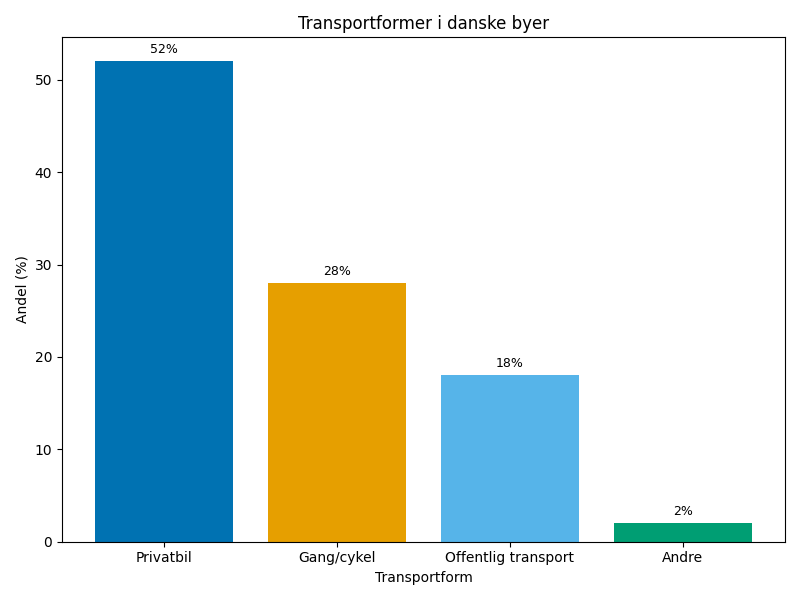
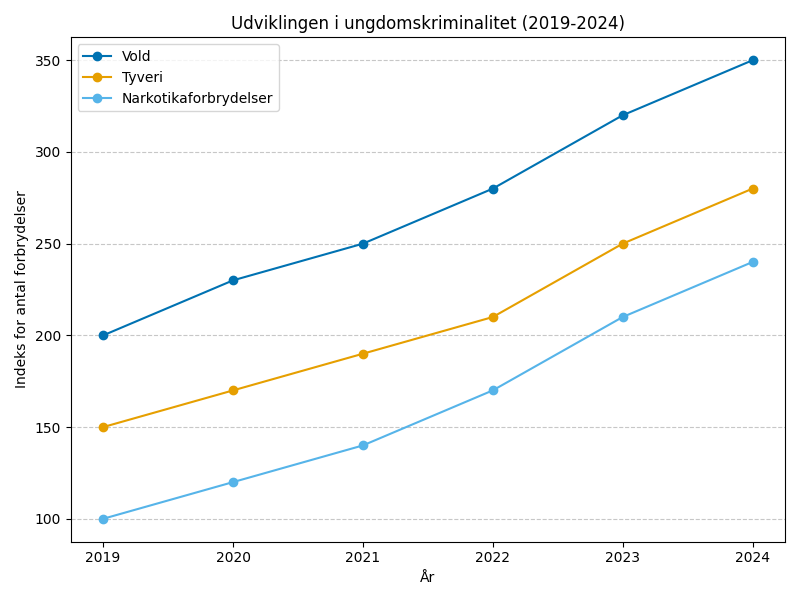
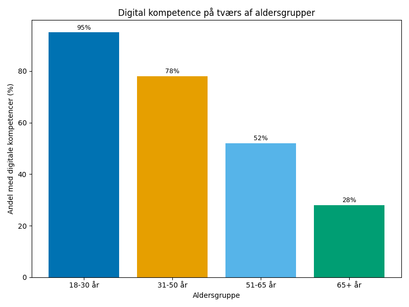

# Studieprøven _Practice Test 6_

  

## Outline

- Læseforståelse (90 minutter)
  - Delprøve 1
  - Delprøve 2A
  - Delprøve 2B
  - Delprøve 3
- Skriftlig fremstilling (3 timer)
- Mundtlig kommunikation (30 minutter)

  Help Den Frie Prøvebank

_This practice test was generated by Den Frie Prøvebank and is unofficial. Den Frie Prøvebank's ability to validate how well its tests match the official tests, in terms of content and structure, is limited. Users should seek guidance from official teaching institutions as to the structure and content of the exams in question._

## Læseforståelse

### Delprøve 1 (25 minutter)
**Ingen hjælpemidler tilladt**

#### Tekstsamling: Urbanisering og byudvikling i Danmark

**Tekst A: Københavns vækst og udfordringer**

Københavns befolkning er vokset med 15% siden 2015 og når nu 1,4 millioner indbyggere i hovedstadsområdet. Boligmanglen har ført til prisstigninger på 35% på fem år. 42% af de unge mellem 25-35 år bor stadig hjemme eller i kollektiv. Kommunen har igangsat 25 nye byudviklingsprojekter for at skabe 50.000 nye boliger inden 2030. Trafikpropper koster samfundet 12 milliarder kroner årligt i tabt produktivitet.

**Tekst B: Provinsbyernes transformation**

Aarhus har oplevet en digital transformation med 120 nye tech-virksomheder siden 2020. Odense satser på robotteknologi og life science med 8.000 nye arbejdspladser. Aalborg udvikler sig til centrum for grøn energi med vindmølleindustri. 65% af provinsbyers vækst sker inden for videnssektoren. Uddannelsesmigration medfører, at 55% af gymnasieelever flytter til større byer.

**Tekst C: Infrastruktur og mobilitet**

 Danske byer investerer 45 milliarder kroner i offentlig transport over ti år. Letbaner i Aarhus og Odense transporterer 35.000 passagerer dagligt. Cykeltrafik udgør 28 % af al transport i danske byer. Elbusser erstatter dieselbusser – 60 % af busflåden er elektrificeret. Intelligente trafiksystemer reducerer rejsetiden med 18 % i myldretiden.

**Tekst D: Grønne byområder og bæredygtighed**

Danmarks byer har 16 m² grønt areal per indbygger - under EU-gennemsnittet på 23 m². Københavns klimaplan sigter mod CO2-neutralitet i 2025. Regnvandshåndtering investeres der 8 milliarder kroner nationalt. Tagdyrkning og vertikale haver spredes til 300 bygninger. Affaldshåndtering i byer opnår 52% genanvendelse, målrettet 70% inden 2030.

**Tekst E: Sociale udfordringer og boligpolitik**

Ghettolisten omfatter 15 boligområder med særlige sociale problemer. 32% af borgere i udsatte områder har ikke-vestlig baggrund. Ungdomskriminalitet er steget med 22% i storbyerne siden 2020. Almene boliger udgør 20% af boligmassen men har ventelister på 7-12 år. Byfornyelse og sociale investeringer prioriteres med 6 milliarder kroner årligt.

#### Spørgsmål til tekstsamlingen:

1. Med hvor mange procent er Københavns befolkning vokset siden 2015?

2. Hvor mange millioner indbyggere bor i hovedstadsområdet?

3. Med hvor mange procent er boligpriserne steget på fem år?

4. Hvor mange nye boliger skal skabes i København inden 2030?

5. Hvor mange milliarder koster trafikpropper samfundet årligt?

6. Hvor mange nye tech-virksomheder er der kommet til Aarhus siden 2020?

7. Hvor mange nye arbejdspladser skaber Odense inden for robotteknologi og life science?

8. Hvor mange procent af provinsbyers vækst sker inden for videnssektoren?

9. Hvor mange milliarder investeres i offentlig transport over ti år?

10. Hvor mange procent af busflåden er elektrificeret?

11. Hvor mange m² grønt areal har danske byer per indbygger?

12. Hvor mange milliarder investeres i regnvandshåndtering nationalt?

13. Hvor mange boligområder omfatter ghettolisten?

14. Med hvor mange procent er ungdomskriminalitet steget siden 2020?

15. Hvor mange procent udgør almene boliger af boligmassen?

### Delprøve 2A (Del af 65 minutter samlet for 2A, 2B og 3)

#### Tekst med fjernede afsnit: Fremtidens fødevareproduktion i Danmark

_Sæt bogstavet for den rigtige sætning i hvert felt._

Danmarks fødevaresektor står over for grundlæggende forandringer. Klimaforandringer, skiftende forbrugerpræferencer og teknologisk innovation kræver nye tilgange til produktion, distribution og forbrug af mad.

**(1)** ________

Traditionelt landbrug udfordres af ekstreme vejrbegivenheder og krav om reduktion af pesticider. Landmænd investerer i præcisionslandbrug med GPS-styrede traktorer og droneteknologi. Vertikale farme i byerne producerer grøntsager året rundt under kontrollerede forhold, men energiforbruget er højt.

**(2)** ________

Forbrugerne efterspørger i stigende grad plantebaserede alternativer til kød og mejeriprodukter. Danske virksomheder udvikler innovative proteinkilder fra bønner, alger og insekter. Fermentering og bioteknologi åbner muligheder for at producere "kunstigt kød" med lavere miljøpåvirkning.

**(3)** ________

Fødevarespild udgør et stort problem - 30% af al produceret mad smides væk. AI og big data hjælper med at optimere lagerstyring og forudsige efterspørgsel. Cirkulære forretningsmodeller genanvender madaffald til biogas eller gødning.

**(4)** ________

Internationale handelskrige og klimaforandringer gør lokal fødevareproduktion strategisk vigtig. Fællesskabsstøttede landbrugsordninger og lokale fødevaresystemer reducerer transportomkostninger og styrker fødevaresikkerheden.

**(5)** ________

Politiske reguleringer og subsidier skal tilpasses den nye virkelighed. EU's fra jord til bord-strategi sætter ambitiøse mål for økologisk produktion og reducerede pesticider, hvilket kræver massiv omstilling af sektoren.

#### Fjernede afsnit (vælg det rigtige for hver position):

1. Afsnit 1
<ul class="multiple-choice-answers">
1. Klimaforandringer forårsager ustabile høstudbytter og tvinger landmænd til at adoptere klimaresistente afgrødesorter. Temperaturstigninger og ændrede nedbørsmønstre påvirker alle aspekter af primærproduktionen.
2. Demografiske ændringer driver efterspørgslen efter mere varierede og næringsrige fødevarer. En aldrende befolkning har andre ernæringsbehov, mens yngre generationer prioriterer bæredygtighed og sundhed.
3. Teknologisk innovation revolutionerer alle led i fødevarekæden. Fra genmodificerede afgrøder til robotisk høst og AI-styret distribution transformerer digitalisering sektoren fundamentalt.
</ul>

2. Afsnit 2
<ul class="multiple-choice-answers">
1. Økologisk landbrug vokser med 15% årligt, men kræver større arealer og giver lavere udbytter end konventionel produktion. Balancen mellem miljøhensyn og produktivitet bliver central for fremtidens landbrug.
2. Madtryghed og sporbarhed bliver vigtigere for forbrugerne. Blockchain-teknologi muliggør fuld sporbarhed fra jord til bord, mens skandaler med forurenet mad skærper kravene til kontrol.
3. Arbejdskraftmangel i landbruget accelererer automatiseringen. Sæsonarbejdere er sværere at rekruttere, mens robotter kan arbejde døgnet rundt under alle vejrforhold.
</ul>

3. Afsnit 3
<ul class="multiple-choice-answers">
1. Emballageindustrien innoverer med bionedbrydelige materialer fra havtang og svampe. Plastikforurening driver udviklingen af miljøvenlige alternativer til traditionel emballage.
2. Personaliseret ernæring baseret på genetiske profiler og sundhedsdata bliver mainstream. AI kan anbefale optimale diæter baseret på individuelle behov og mål.
3. Urban landbrug spreder sig til tagtoppe og forladte bygninger. Hydroponisk dyrkning og LED-belysning gør det muligt at producere mad tæt på forbrugerne i bycentre.
</ul>

4. Afsnit 4
<ul class="multiple-choice-answers">
1. Bæredygtigt fiskeri og akvakultur udvikles for at beskytte havets økosystemer. Overfiskning truer de marine ressourcer, mens landbaseret fiskeopdræt kan reducere miljøpåvirkningen.
2. Madlavningsrobotter og automatiserede køkkener forandrer restaurantbranchen. Konsistens og effektivitet forbedres, mens personalebehov reduceres betydeligt.
3. Insektprotein accepteres gradvist som almindelig fødevare. Melorme og fårekyllinger har et højt proteinindhold og et lavt ressourceforbrug sammenlignet med traditionel husdyrproduktion.
</ul>

5. Afsnit 5
<ul class="multiple-choice-answers">
1. Internationale samarbejder om fødevareforskning intensiveres. Klimaforandringer kræver globale løsninger, og vidensdeling mellem lande bliver afgørende for fødevaresikkerheden.
2. Fremtidens fødevaresystem kræver radikale ændringer i både produktion og forbrug. Kun gennem innovation, regulering og forbrugeradfærd kan Danmark sikre bæredygtig fødevareforsyning.
3. Investeringer i food-tech virksomheder eksploderer, da venture capital-fonde satser på disruption af traditionelle fødevaresystemer. Start-ups udvikler alt fra laboratoriedyrkede proteiner til AI-optimerede diæter.
</ul>

### Delprøve 2B (Del af 65 minutter samlet for 2A, 2B og 3)

#### Tekst: Mental sundhed og stress i det moderne Danmark

Danskernes mentale sundhed er kommet under pres. Stress, angst og depression påvirker stadig flere, og sundhedssystemet kæmper for at følge med efterspørgslen efter psykologisk behandling. Årsagerne er komplekse og spænder fra arbejdsliv over sociale medier til samfundets generelle tempo.

Arbejdsrelateret stress er blevet en epidemi. Lange arbejdsdage, konstant tilgængelighed gennem smartphones og krav om multitasking presser mange til bristepunktet. Særligt yngre medarbejdere føler sig udbrændte allerede i starten af deres karriere. Fjernarbejde har sløret grænserne mellem privatliv og arbejde, hvilket forværrer problemet.

Sociale medier spiller en central rolle i mental sundhed, især blandt unge. Konstant sammenligning med andre, cybermobning og frygt for at gå glip af noget (FOMO) skaber urealistiske forventninger og lav selvværd. Paradoksalt nok føler mange sig ensomme trods konstant digital forbindelse til andre.

Behandlingskapaciteten er utilstrækkelig. Ventelister til psykologhjælp strækker sig over måneder, og mange private psykologer er ikke omfattet af det offentlige tilskudssystem. Krisecentre og præventive tiltag er underfinansierede, selvom de kunne forhindre mange alvorlige tilfælde.

Samfundets tempo og præstationskultur bidrager til problemet. Fra små børn til pensionister bombarderes alle med beskeder om selvoptimering og produktivitet. Sociale forventninger om succes på alle områder samtidigt - karriere, familie, helbred og hobbyer - skaber et umuligt pres.

COVID-19 pandemien accelererede mange mentale sundhedsproblemer. Isolation, økonomisk usikkerhed og frygt for fremtiden ramte befolkningen hårdt. Selvom samfundet er åbnet igen, varer de psykologiske eftervirkninger ved, særligt blandt unge og ældre.

Forebyggelse og tidlig indsats får for lidt opmærksomhed. Mental sundhed undervises sjældent i skoler, og arbejdspladser har ofte utilstrækkelige ressourcer til stresshåndtering. Stigmatiseringen omkring mental sygdom forhindrer mange i at søge hjælp i tide.

#### Spørgsmål til teksten:

_Sæt en cirkel om det rigtige svar._

1. Hvad identificeres som hovedårsager til arbejdsrelateret stress ifølge teksten?
<ul class="multiple-choice-answers">
1. Lave lønninger og dårlige arbejdsforhold
2. Lange arbejdsdage, konstant tilgængelighed og multitasking-krav
3. Mangel på jobsikkerhed og konkurrence fra udlandet
</ul>

2. Hvordan påvirker sociale medier mental sundhed ifølge teksten?
<ul class="multiple-choice-answers">
1. De skaber bedre forbindelser mellem mennesker
2. De har ingen dokumenteret effekt på mental sundhed
3. De forårsager sammenligning, cybermobning og FOMO
</ul>

3. Hvad karakteriserer behandlingskapaciteten for mental sundhed?
<ul class="multiple-choice-answers">
1. Den er fuldt tilstrækkelig til at dække alle behov
2. Den er utilstrækkelig med lange ventelister
3. Den er kun tilgængelig for rige borgere
</ul>

4. Hvordan bidrager samfundets præstationskultur til mental sundhed-problemer?
<ul class="multiple-choice-answers">
1. Den motiverer folk til at præstere bedre
2. Den skaber pres om at være succesfuld på alle områder samtidigt
3. Den har ingen påvirkning på mental sundhed
</ul>

5. Hvad siger teksten om forebyggelse og tidlig indsats?
<ul class="multiple-choice-answers">
1. De får passende opmærksomhed og ressourcer
2. De får for lidt opmærksomhed og ressourcer
3. De er ikke nødvendige for mental sundhed
</ul>

### Delprøve 3 (Del af 65 minutter samlet for 2A, 2B og 3)

#### Tekst med fjernede ord: Danmarks rolle i global handelspolitik

Som en lille åben økonomi __(1)__ ______ Danmark stærkt af internationale handelsforhold. Landet skal navigere mellem stormagters konkurrerende interesser, mens det __(2)__ ______ egne værdier og økonomiske fordele.

EU-medlemskabet __(3)__ ______ Danmark adgang til det indre marked med 450 millioner forbrugere. Samtidig __(4)__ ______ medlemskabet også begrænsninger på unilateral handelspolitik. Danmark må balancere mellem europæisk solidaritet og __(5)__ ______ nationale interesser.

Handelskrigen mellem USA og Kina __(6)__ ______ danske eksportvirksomheder i en vanskelig situation. Mange danske produkter møder højere toldsatser på begge markeder, hvilket __(7)__ ______ konkurrenceevnen betydeligt. Virksomheder må omstrukturere deres globale værdikæder.

Bæredygtighed bliver __(8)__ ______ vigtigere i handelspolitik. Danmarks grønne profil kan åbne nye eksportmuligheder, men __(9)__ ______ også krav om at leve op til høje standarder. Grøn teknologi og vedvarende energi udgør voksende eksportsektorer.

WTO's tvistløsningssystem er under pres, hvilket __(10)__ ______ usikkerhed for internationale handelsregler. Danmark må arbejde for at styrke multilaterale institutioner og regelbaseret handel på trods af stigende protektionisme.

#### Valgmuligheder:

<table class="horizontal-multiple-choice">
  <tbody>
    <tr>
      <td><strong>1</strong></td>
      <td><strong>a.</strong> påvirkes</td>
      <td><strong>b.</strong> styres</td>
      <td><strong>c.</strong> kontrolleres</td>
      <td><strong>d.</strong> bestemmes</td>
    </tr>
    <tr>
      <td><strong>2</strong></td>
      <td><strong>a.</strong> opgiver</td>
      <td><strong>b.</strong> forsvarer</td>
      <td><strong>c.</strong> ændrer</td>
      <td><strong>d.</strong> tilpasser</td>
    </tr>
    <tr>
      <td><strong>3</strong></td>
      <td><strong>a.</strong> nægter</td>
      <td><strong>b.</strong> giver</td>
      <td><strong>c.</strong> begrænser</td>
      <td><strong>d.</strong> forhindrer</td>
    </tr>
    <tr>
      <td><strong>4</strong></td>
      <td><strong>a.</strong> medfører</td>
      <td><strong>b.</strong> eliminerer</td>
      <td><strong>c.</strong> reducerer</td>
      <td><strong>d.</strong> undgår</td>
    </tr>
    <tr>
      <td><strong>5</strong></td>
      <td><strong>a.</strong> internationale</td>
      <td><strong>b.</strong> europæiske</td>
      <td><strong>c.</strong> specifikke</td>
      <td><strong>d.</strong> globale</td>
    </tr>
    <tr>
      <td><strong>6</strong></td>
      <td><strong>a.</strong> hjælper</td>
      <td><strong>b.</strong> støtter</td>
      <td><strong>c.</strong> placerer</td>
      <td><strong>d.</strong> beskytter</td>
    </tr>
    <tr>
      <td><strong>7</strong></td>
      <td><strong>a.</strong> styrker</td>
      <td><strong>b.</strong> forbedrer</td>
      <td><strong>c.</strong> svækker</td>
      <td><strong>d.</strong> bevarer</td>
    </tr>
    <tr>
      <td><strong>8</strong></td>
      <td><strong>a.</strong> mindre</td>
      <td><strong>b.</strong> stadigt</td>
      <td><strong>c.</strong> stadig</td>
      <td><strong>d.</strong> sjældent</td>
    </tr>
    <tr>
      <td><strong>9</strong></td>
      <td><strong>a.</strong> eliminerer</td>
      <td><strong>b.</strong> reducerer</td>
      <td><strong>c.</strong> skaber</td>
      <td><strong>d.</strong> undgår</td>
    </tr>
    <tr>
      <td><strong>10</strong></td>
      <td><strong>a.</strong> reducerer</td>
      <td><strong>b.</strong> skaber</td>
      <td><strong>c.</strong> eliminerer</td>
      <td><strong>d.</strong> forbedrer</td>
    </tr>
  </tbody>
</table>

## Skriftlig fremstilling (3 timer)
**Alle ordbøger er tilladt**

### Vælg én af følgende tre opgaver:

#### Opgave 1: Kollektiv transport versus privatbilisme

**Grafik:** 

**Manchet:** Danske byer kæmper med trafikpropper og luftforurening. Selvom der investeres massivt i offentlig transport, foretrækker de fleste borgere stadig privatbilen. Dette skaber udfordringer for både miljø og bytrafik.

**Opgave:** Skriv en sammenhængende tekst på minimum 400 ord, hvor du:
- Analyserer transportfordelingen vist i grafikken
- Diskuterer fordele og ulemper ved forskellige transportformer
- Vurderer årsagerne til privatbilens dominans
- Foreslår strategier til at fremme mere bæredygtig transport

#### Opgave 2: Ungdomskriminalitet og forebyggelse

**Grafik:** 

**Manchet:** Ungdomskriminalitet er steget markant i danske byer. Unge mellem 15-20 år begår flere voldsforbrydelser og deltager i organiserede bander. Samfundet søger efter effektive forebyggelsesstrategier.

**Opgave:** Skriv en sammenhængende tekst på minimum 400 ord, hvor du:
- Præsenterer udviklingen i ungdomskriminalitet fra grafikken
- Analyserer mulige årsager til stigningen
- Diskuterer konsekvenserne for samfundet og de unge selv
- Argumenterer for konkrete forebyggelsestiltag

#### Opgave 3: Digital kløft mellem generationer

**Grafik:** 

**Manchet:** Digitaliseringen skaber kløft mellem generationer. Mens unge navigerer naturligt i den digitale verden, kæmper mange ældre med grundlæggende teknologi. Dette påvirker arbejdsmarked, sundhedstjenester og social deltagelse.

**Opgave:** Skriv en sammenhængende tekst på minimum 400 ord, hvor du:
- Redegør for de digitale kompetenceforskelle fra grafikken
- Analyserer konsekvenserne af den digitale kløft
- Diskuterer udfordringer for både unge og ældre
- Vurderer løsninger til at mindske den digitale opdeling

_Brug disse sider til at skrive din skriftlige opgave._

## Mundtlig kommunikation (30 minutter inkl. votering)

### Opgaveark med tre emner til forberedelse:

#### Emne 1: Byplanlægning og livskvalitet

**Stikord til inspiration:**
- Tæt bebyggelse versus grønne områder
- Offentlig transport og tilgængelighed
- Sociale forskelle mellem bydele
- Butiksdød i indre byer
- Gentrifikation og boligpriser
- Kulturliv og rekreative faciliteter
- Luftkvalitet og støjforurening
- Borgerinddragelse i byudvikling

#### Emne 2: Arbejdsliv i den digitale tidsalder

**Stikord til inspiration:**
- Fjernarbejde og fleksible arbejdstider
- Work-life balance og stress
- Automatisering og jobsikkerhed
- Digitale kompetencer og efteruddannelse
- Gig-økonomi og freelance-kultur
- Generationsskifte på arbejdspladsen
- AI og menneskelig kreativitet
- Fagforeninger og digitale rettigheder

#### Emne 3: Madkultur og bæredygtighed

**Stikord til inspiration:**
- Plantebaseret kost og miljøpåvirkning
- Lokal versus global fødevareproduktion
- Madspild og cirkulær økonomi
- Økologisk versus konventionel landbrug
- Gastronomi som kulturel identitet
- Fødevaresikkerhed og selvforsyning
- Innovation i fødevareteknologi
- Forbrugeradfærd og madvaner

### Prøveforløb:

1. **Lodtrækning:** Vælg ét af de tre forberedte emner
2. **Præsentation (5 minutter):** Struktureret gennemgang af det valgte emne
3. **Interview (15 minutter):** Uddybende samtale med eksaminator baseret på præsentationen
4. **Votering og karaktergivning (10 minutter)**

### Bedømmelseskriterier:

- **Sproglig korrekthed:** Grammatik, ordforråd og udtale
- **Kommunikativ kompetence:** Evne til at formidle budskaber klart
- **Indholdsrigdom:** Faglig dybde og nuanceret forståelse
- **Struktur:** Logisk opbygning og sammenhæng
- **Interaktion:** Evne til dialog og respons på spørgsmål

---

_This practice test was generated by Den Frie Prøvebank and is unofficial. Den Frie Prøvebank's ability to validate how well its tests match the official tests, in terms of content and structure, is limited. Users should seek guidance from official teaching institutions as to the structure and content of the exams in question._
