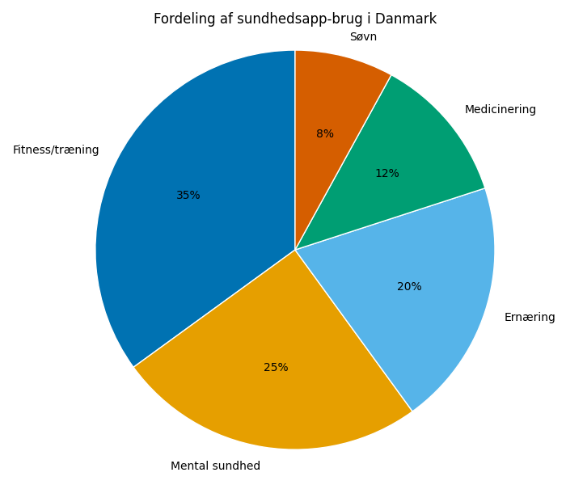
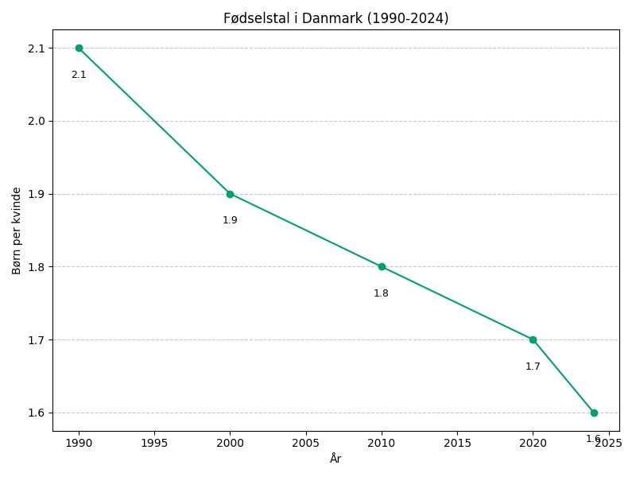
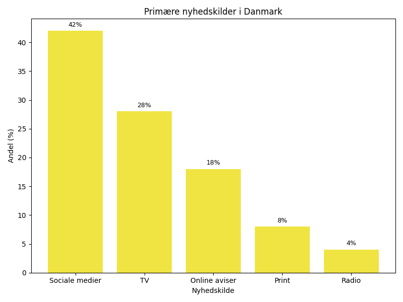

# Studieprøven _Practice Test 7_

  

## Outline

- Læseforståelse (90 minutter)
  - Delprøve 1
  - Delprøve 2A
  - Delprøve 2B
  - Delprøve 3
- Skriftlig fremstilling (3 timer)
- Mundtlig kommunikation (30 minutter)

  Help Den Frie Prøvebank

_This practice test was generated by Den Frie Prøvebank and is unofficial. Den Frie Prøvebank's ability to validate how well its tests match the official tests, in terms of content and structure, is limited. Users should seek guidance from official teaching institutions as to the structure and content of the exams in question._

## Læseforståelse

### Delprøve 1 (25 minutter)
**Ingen hjælpemidler tilladt**

#### Tekstsamling: Sundhedssektoren og demografiske udfordringer

**Tekst A: En aldrende befolkning**

Danmarks befolkning ældes hurtigt. 25 % vil være over 65 år i 2040 sammenlignet med 19 % i dag. Antallet af 80‑årige fordobles til 650.000 personer. Dette kræver 40 % flere sundhedsprofessionelle inden 2035. Demenstilfælde stiger fra 95.000 til 140.000. Kommunerne skal etablere 15.000 nye plejehjemspladser. Omkostningerne til ældrepleje vil stige med 35 milliarder kroner årligt.

**Tekst B: Personalekrisen i sundhedssektoren**

25 % af sygeplejersker overvejer karriereskift inden for to år. Lægemangel rammer særligt psykiatrien med 400 ledige stillinger. SOSU‑assistentuddannelsen mangler 3.000 ansøgere årligt. Overtid i sundhedssektoren koster 8 milliarder kroner om året. 45 % af sundhedspersonalet rapporterer om arbejdsrelateret stress. Rekruttering fra udlandet stiger med 15 % årligt, men sprogbarrierer skaber udfordringer.

**Tekst C: Teknologi og innovation**

Telemedicin anvendes nu i 60 % af konsultationer inden for visse specialer. Robotkirurgi reducerer operationstiden med 25 % og genoprettelsestiden med 30 %. AI‑diagnostik kan identificere hudkræft med 95 % nøjagtighed. Elektroniske patientjournaler sparer 12 minutter per patientbesøg. Sundhedsapps bruges af 3,2 millioner danskere. Investeringer i sundhedsteknologi er steget til 4,5 milliarder kroner siden 2020.

**Tekst D: Forebyggelse og livsstilssygdomme**

Diabetes type 2 påvirker 350.000 danskere med stigende tendens. Fedme hos børn er steget til 18 % af alle børn under 15 år. Rygestopprogrammer har 35 % succesrate efter et år. Alkoholrelaterede indlæggelser stiger med 8 % årligt. Mentale sundhedsprogrammer når kun 25 % af dem, der har behov. Der investeres 2,8 milliarder kroner årligt i sundhedsfremme med begrænset effekt.

**Tekst E: Økonomisk bæredygtighed**

Sundhedsudgifter udgør 16 % af BNP og vokser hurtigere end økonomien. Udgifter til medicin stiger med 6 % årligt, primært på grund af dyr kræftmedicin. Private sundhedsforsikringer vokser med 12 % årligt. Medicinalindustrien eksporterer for 180 milliarder kroner og beskæftiger 55.000 personer. Regionerne har samlet underskud på 3,2 milliarder kroner. Brugerbetaling diskuteres som løsning på finansieringsgabet.

#### Spørgsmål til tekstsamlingen:

1. Hvor mange procent vil være over 65 år i 2040?

2. Til hvor mange personer fordobles antallet af 80-årige?

3. Hvor mange procent flere sundhedsprofessionelle kræves inden 2035?

4. Hvor mange nye plejehjemspladser skal kommunerne etablere?

5. Hvor mange procent af sygeplejersker overvejer karriereskift?

6. Hvor mange ledige stillinger er der i psykiatrien?

7. Hvor mange ansøgere mangler SOSU‑assistentuddannelsen årligt?

8. Hvor mange procent af konsultationer bruges telemedicin i?

9. Med hvor mange procent reducerer robotkirurgi operationstid?

10. Hvor mange procent nøjagtighed har AI-diagnostik for hudkræft?

11. Hvor mange danskere bruger sundhedsapps?

12. Hvor mange danskere påvirkes af diabetes type 2?

13. Hvor mange procent af børn under 15 har fedme?

14. Med hvor mange procent stiger alkoholrelaterede indlæggelser årligt?

15. Hvor mange procent af BNP udgør sundhedsudgifter?

### Delprøve 2A (Del af 65 minutter samlet for 2A, 2B og 3)

#### Tekst med fjernede afsnit: Danskernes forhold til naturen og miljøet

_Sæt bogstavet for den rigtige sætning i hvert felt._

Danske naturoplevelser er under pres fra klimaforandringer, intensive landbrug og stigende urbanisering. Samtidig vokser befolkningens behov for adgang til grønne områder og autentiske naturoplevelser i en stadig mere digitaliseret verden.

**(1)** ________

Skovbruget balancerer mellem økonomisk udbytte og biodiversitet. Statskovene åbnes for flere rekreative aktiviteter, mens private skovejere kæmper med rentabilitet. Stormskader og tørke påvirker træernes sundhed og vækst betydeligt.

**(2)** ________

Nationalparker og naturreservater beskyttes med skærpede regler, men budgetterne til vedligeholdelse og overvågning er begrænsede. Overtourisme truer sårbare økosystemer, særligt på Bornholm og ved populære vandreruter.

**(3)** ________

Borgeres engagement i naturbevarelse vokser gennem frivillige organisationer og borgerforskningsprojekter. Naturguider og friluftsaktiviteter oplever stor efterspørgsel, mens naturvejledning bliver integreret i uddannelsessystemet.

**(4)** ________

Intensive landbrugsmetoder reducerer biodiversiteten drastisk. Pesticider og gødning påvirker grundvandet og insektbestande. EU's fælles landbrugspolitik presser på for mere miljøvenlige praktikker.

**(5)** ________

Fremtidens natursyn kræver balance mellem beskyttelse og tilgængelighed. Teknologi kan hjælpe med overvågning og formidling, mens økonomiske incitamenter skal tilskynde til bæredygtig forvaltning af naturressourcer.

#### Fjernede afsnit (vælg det rigtige for hver position):

1. Afsnit 1
<ul class="multiple-choice-answers">
1. Klimaforandringer forandrer Danmarks landskab fundamentalt. Højere temperaturer og ekstreme vejrbegivenheder påvirker plantevækst og dyreliv på måder, der kræver tilpasning af naturforvaltning.
2. Urbanisering fragmenterer naturområder og skaber øer af biodiversitet omgivet af byer og infrastruktur. Grønne korridorer mellem naturområder bliver afgørende for dyrelivets overlevelse.
3. Digitalisering ændrer folks forhold til naturen. Hvor tidligere generationer lærte om natur gennem direkte kontakt, får mange nu deres naturkendskab gennem skærme og apps.
</ul>

2. Afsnit 2
<ul class="multiple-choice-answers">
1. Bæredygtig skovdrift kræver langsigtet planlægning og investeringer i nye træarter, der kan klare fremtidens klima. Skovenes rolle som kulstoflagre bliver vigtigere end nogensinde.
2. Vindmøller og solpaneler i naturområder skaber konflikter mellem grøn energi og naturbeskyttelse. Balancen mellem klimatiltag og bevarelse af landskaber udfordrer politikerne.
3. Invasive arter spreder sig hurtigere på grund af global handel og transport. Bekæmpelse af uønskede planter og dyr kræver koordineret international indsats.
</ul>

3. Afsnit 3
<ul class="multiple-choice-answers">
1. Øget fokus på mental sundhed gør naturoplevelser til en vigtig del af sundhedssystemet. Grøn terapi og friluftsaktiviteter ordineres som behandling for stress og depression.
2. Social ulighed påvirker adgang til naturoplevelser. Familier med lav indkomst har mindre mulighed for at nyde naturens goder, hvilket forstærker sundhedsmæssige forskelle.
3. Uddannelsessystemet integrerer naturfag og friluftspædagogik for at skabe miljøbevidste borgere. Skoler etablerer naturklasser og samarbejder med lokale naturcentre.
</ul>

4. Afsnit 4
<ul class="multiple-choice-answers">
1. Kulturlandskaber formes af tusinder af års menneskeligt samspil med naturen. Traditionelle driftsformer som græsning og høslæt er nødvendige for at bevare karakteristiske biotoper.
2. Genetisk diversitet i danske plante- og dyrearter falder drastisk. Genbanker og avlsprogrammer arbejder på at bevare truede arter for fremtidige generationer.
3. Naturturisme kan finansiere naturbeskyttelse, men kræver bæredygtig styring. Certificeringsordninger og besøgsregulering hjælper med at beskytte sårbare områder.
</ul>

5. Afsnit 5
<ul class="multiple-choice-answers">
1. Politisk vilje til naturinvestering vokser blandt borgerne, men oversættes sjældent til tilstrækkelige budgetbevillinger. Naturorganisationer lobbyerer for øgede offentlige investeringer.
2. Internationalt samarbejde om naturbeskyttelse intensiveres gennem EU-direktiver og globale aftaler. Danmarks internationale forpligtelser påvirker national naturpolitik betydeligt.
3. Teknologiske løsninger som kunstig intelligens og satellitkortlægning revolutionerer naturovervågning. Big data hjælper med at forudse og forhindre miljøkatastrofer.
</ul>

### Delprøve 2B (Del af 65 minutter samlet for 2A, 2B og 3)

#### Tekst: Innovation og iværksætterkultur i Danmark

Danmark har udviklet sig til et center for innovation og iværksætteri. Med en kultur, der værdsætter kreativitet og risikovillighed, kombineret med stærke institutioner og uddannelsessystem, skaber landet optimale betingelser for nye virksomheder og teknologiske gennembrud.

Startup-økosystemet i Danmark blomstrer. København rangerer blandt Europas top fem startup-byer, med over 2.000 nye virksomheder grundlagt årligt. Venture capital-investeringer har tredoblet sig siden 2018, og danske unicorns som Zendesk og Vestas inspirerer nye entreprenører. Incubatorer og acceleratorer støtter unge virksomheder gennem kritiske vækstfaser.

Uddannelsessystemet spiller en central rolle. Tekniske universiteter og business schools integrerer entreprenørskab i deres curriculum. Studerende opfordres til at tage risici og fejle hurtigt, hvilket skaber en kultur af eksperimentering. Samarbejde mellem universiteter og industrien sikrer, at forskning bliver til kommercielle produkter.

Regeringen faciliterer innovation gennem skatteincitamenter og forenklede reguleringer. Den danske model balancerer mellem at støtte innovation og beskytte forbrugere og arbejdstagere. Digitale løsninger til offentlig service demonstrerer, hvordan teknologi kan forbedre samfundet og inspirerer private innovatører.

Teknologiske klynger udvikles omkring specifikke ekspertiseområder. Medico Valley fokuserer på life sciences, Offshore-industrien på vindenergi, og Clean-tech på miljøteknologi. Disse klynger skaber synergi mellem store virksomheder, SMV'er og forskningsinstitutioner.

Internationale partnerskaber og markeder er afgørende for danske startups. Hjemmemarkedet er for lille til at skalere globalt, så virksomheder må internationalisere hurtigt. Innovation Danmark og handelskamre hjælper med at åbne nye markeder og skabe strategiske alliancer.

Finansieringslandskabet er modnet betydeligt. Fra angel investorer til pensionsfonde engagerer sig danske kapitalkkilder i startup-investeringer. Crowdfunding og alternative finansieringsformer giver entreprenører flere muligheder for at finansiere deres ideer uden at miste kontrol.

Udfordringer består stadig. Talentmangel inden for teknologi hæmmer vækst, og konkurrence om kvalificeret arbejdskraft intensiveres. Regelkompleksitet og bureaukrati kan bremse hurtigtvoksende virksomheder, selvom Danmark scores relativt godt på internationale sammenligninger.

#### Spørgsmål til teksten:

_Sæt en cirkel om det rigtige svar._
1. Hvad karakteriserer Danmarks position som startup-destination ifølge teksten?
<ul class="multiple-choice-answers">
1. Det er blandt Europas mindst attraktive startup-steder
2. København rangerer blandt Europas top fem startup-byer
3. Det har begrænset startup-aktivitet sammenlignet med nabolande
</ul>
2. Hvordan har venture capital-investeringer udviklet sig siden 2018?
<ul class="multiple-choice-answers">
1. De er faldet betydeligt på grund af økonomisk usikkerhed
2. De er forblevet stabile uden større ændringer
3. De har tredoblet sig og viser stærk vækst
</ul>
3. Hvilken rolle spiller uddannelsessystemet i innovation ifølge teksten?
<ul class="multiple-choice-answers">
1. Det fokuserer kun på teoretisk viden uden praktisk anvendelse
2. Det integrerer entreprenørskab og opfordrer til eksperimentering
3. Det har ingen påvirkning på landet's innovationskapacitet
</ul>
4. Hvad er hovedudfordringen for danske startups med hensyn til markeder?
<ul class="multiple-choice-answers">
1. For høje produktionsomkostninger i Danmark
2. Mangel på teknologisk ekspertise
3. Hjemmemarkedet er for lille, så de må internationalisere hurtigt
</ul>
5. Hvilke udfordringer nævnes som hindringer for innovation?
<ul class="multiple-choice-answers">
1. Mangel på finansieringsmuligheder og investorer
2. Talentmangel inden for teknologi og regelkompleksitet
3. Lav efterspørgsel efter innovative produkter
</ul>

### Delprøve 3 (Del af 65 minutter samlet for 2A, 2B og 3)

#### Tekst med fjernede ord: E-sport og gaming i Danmarks digitale strategi

E-sport har udviklet sig fra __(1)__ ______ til en professionel industri med millioner af seere og betydelige økonomiske konsekvenser. Danmark __(2)__ ______ international anerkendelse for sine e-sport-talenter og innovative tilgang til gaming-kulturen.

Danske spillere __(3)__ ______ på verdensscenen inden for populære spil som Counter-Strike og League of Legends. Astralis-holdet har vundet __(4)__ ______ internationale mesterskaber og inspireret en ny generation af unge gamere til at satse professionelt på e-sport.

Uddannelsesinstitutioner __(5)__ ______ e-sport som en legitim karrierevej. Gymnasier tilbyder e-sport som valgfag, og videregående uddannelser udvikler programmer inden for game design og e-sport management. Dette __(6)__ ______ Danmarks position som foregangsland.

Streaming og content creation skaber nye __(7)__ ______ for kreative talenter. Danske streamere og YouTubere bygger globale communities og genererer indtægter gennem sponsorater og donations. Platform-økonomien __(8)__ ______ traditionelle mediestrukturer.

Sundhedsmæssige __(9)__ ______ omkring langvarig skærmtid og stillesiddende livsstil kræver opmærksomhed. E-sport-organisationer investerer i spillernes fysiske fitness og mentale sundhed for at __(10)__ ______ bæredygtige karrierer.

#### Valgmuligheder:

<table class="horizontal-multiple-choice">
  <tbody>
    <tr>
      <td><strong>1</strong></td>
      <td><strong>a.</strong> hobby</td>
      <td><strong>b.</strong> profession</td>
      <td><strong>c.</strong> sport</td>
      <td><strong>d.</strong> konkurrence</td>
    </tr>
    <tr>
      <td><strong>2</strong></td>
      <td><strong>a.</strong> mister</td>
      <td><strong>b.</strong> søger</td>
      <td><strong>c.</strong> afviser</td>
      <td><strong>d.</strong> opnår</td>
    </tr>
    <tr>
      <td><strong>3</strong></td>
      <td><strong>a.</strong> fejler</td>
      <td><strong>b.</strong> konkurrerer</td>
      <td><strong>c.</strong> undgår</td>
      <td><strong>d.</strong> træner</td>
    </tr>
    <tr>
      <td><strong>4</strong></td>
      <td><strong>a.</strong> få</td>
      <td><strong>b.</strong> ingen</td>
      <td><strong>c.</strong> flere</td>
      <td><strong>d.</strong> nogle</td>
    </tr>
    <tr>
      <td><strong>5</strong></td>
      <td><strong>a.</strong> ignorerer</td>
      <td><strong>b.</strong> afviser</td>
      <td><strong>c.</strong> anerkender</td>
      <td><strong>d.</strong> kritiserer</td>
    </tr>
    <tr>
      <td><strong>6</strong></td>
      <td><strong>a.</strong> svækker</td>
      <td><strong>b.</strong> styrker</td>
      <td><strong>c.</strong> ændrer</td>
      <td><strong>d.</strong> undgår</td>
    </tr>
    <tr>
      <td><strong>7</strong></td>
      <td><strong>a.</strong> problemer</td>
      <td><strong>b.</strong> barrierer</td>
      <td><strong>c.</strong> muligheder</td>
      <td><strong>d.</strong> begrænsninger</td>
    </tr>
    <tr>
      <td><strong>8</strong></td>
      <td><strong>a.</strong> styrker</td>
      <td><strong>b.</strong> undgår</td>
      <td><strong>c.</strong> udfordrer</td>
      <td><strong>d.</strong> støtter</td>
    </tr>
    <tr>
      <td><strong>9</strong></td>
      <td><strong>a.</strong> fordele</td>
      <td><strong>b.</strong> bekymringer</td>
      <td><strong>c.</strong> muligheder</td>
      <td><strong>d.</strong> gevinster</td>
    </tr>
    <tr>
      <td><strong>10</strong></td>
      <td><strong>a.</strong> undgå</td>
      <td><strong>b.</strong> skabe</td>
      <td><strong>c.</strong> sikre</td>
      <td><strong>d.</strong> forhindre</td>
    </tr>
  </tbody>
</table>

## Skriftlig fremstilling (3 timer)
**Alle ordbøger er tilladt**

### Vælg én af følgende tre opgaver:

#### Opgave 1: Sundhed og teknologi

**Grafik:** 

**Manchet:** Sundhedsapps er blevet en integreret del af danskernes hverdag. Millioner bruger teknologi til at overvåge deres helbred, men eksperter diskuterer effektiviteten og privatlivsproblemer ved digital sundhedshåndtering.

**Opgave:** Skriv en sammenhængende tekst på minimum 400 ord, hvor du:
- Analyserer fordelingen af sundhedsapp-brug fra grafikken
- Diskuterer fordele og risici ved digital sundhedsteknologi
- Vurderer teknologiens rolle i fremtidens sundhedssystem
- Argumenterer for regulering eller frihed i brugen af sundhedsdata

#### Opgave 2: Fødselstalsudvikling og samfundskonsekvenser

**Grafik:** 

**Manchet:** Danmarks fødselstal ligger under reproduktionsniveauet og fortsætter med at falde. Dette skaber udfordringer for velfærdsstaten, arbejdsmarkedet og den sociale sammenhængskraft på lang sigt.

**Opgave:** Skriv en sammenhængende tekst på minimum 400 ord, hvor du:
- Præsenterer udviklingen i fødselstal fra grafikken
- Analyserer årsagerne til det faldende fødselstal
- Diskuterer konsekvenserne for samfundet og økonomien
- Foreslår politikker til at adressere udfordringen

#### Opgave 3: Medier og demokrati i den digitale tidsalder

**Grafik:** 

**Manchet:** Sociale medier er blevet danskernes primære nyhedskilde, mens traditionelle medier mister læsere. Dette rejser spørgsmål om nyhedskvalitet, misinformation og demokratiets sundhed.

**Opgave:** Skriv en sammenhængende tekst på minimum 400 ord, hvor du:
- Redegør for ændringerne i nyhedsforbrug fra grafikken
- Analyserer konsekvenserne for journalistik og informationskvalitet
- Diskuterer mediernes rolle i et fungerende demokrati
- Vurderer løsninger til at sikre pålidelig nyhedsformidling

_Brug disse sider til at skrive din skriftlige opgave._

---

## Mundtlig kommunikation (30 minutter inkl. votering)

### Opgaveark med tre emner til forberedelse:

#### Emne 1: Globalisering og national identitet

**Stikord til inspiration:**
- Kulturel homogenisering versus diversitet
- Lokalproduktion versus global handel
- Sproglig påvirkning og engelsk dominans
- Immigration og integration
- EU-medlemskab og suverænitet
- Traditionelle værdier og modernisering
- Medier og kulturel påvirkning
- Økonomisk interdependens

#### Emne 2: Privatisering versus offentlige serviceydelser

**Stikord til inspiration:**
- Effektivitet og kvalitet i service
- Markedskræfter og social lighed
- Offentlige udgifter og skattetryk
- Arbejdstagernes rettigheder
- Forbrugernes valgmuligheder
- Demokratisk kontrol og ansvarliggørelse
- Innovation og konkurrence
- Universelle rettigheder og adgang

#### Emne 3: Teknologi og menneskeligt samvær

**Stikord til inspiration:**
- Social isolation og digitale fællesskaber
- Kommunikation og ægte relationer
- Multitasking og opmærksomhed
- Generationskløfter og teknologi
- Privatliv og overvågning
- Kreativitet og afhængighed
- Arbejdsliv og personlig tid
- Mental sundhed og skærmtid

### Prøveforløb:

1. **Lodtrækning:** Vælg ét af de tre forberedte emner
2. **Præsentation (5 minutter):** Struktureret gennemgang af det valgte emne
3. **Interview (15 minutter):** Uddybende samtale med eksaminator baseret på præsentationen
4. **Votering og karaktergivning (10 minutter)**

### Bedømmelseskriterier:

- **Sproglig korrekthed:** Grammatik, ordforråd og udtale
- **Kommunikativ kompetence:** Evne til at formidle budskaber klart
- **Indholdsrigdom:** Faglig dybde og nuanceret forståelse
- **Struktur:** Logisk opbygning og sammenhæng
- **Interaktion:** Evne til dialog og respons på spørgsmål

---

_This practice test was generated by Den Frie Prøvebank and is unofficial. Den Frie Prøvebank's ability to validate how well its tests match the official tests, in terms of content and structure, is limited. Users should seek guidance from official teaching institutions as to the structure and content of the exams in question._
