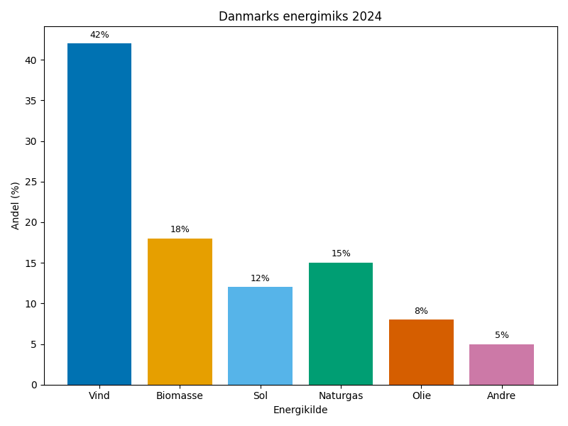
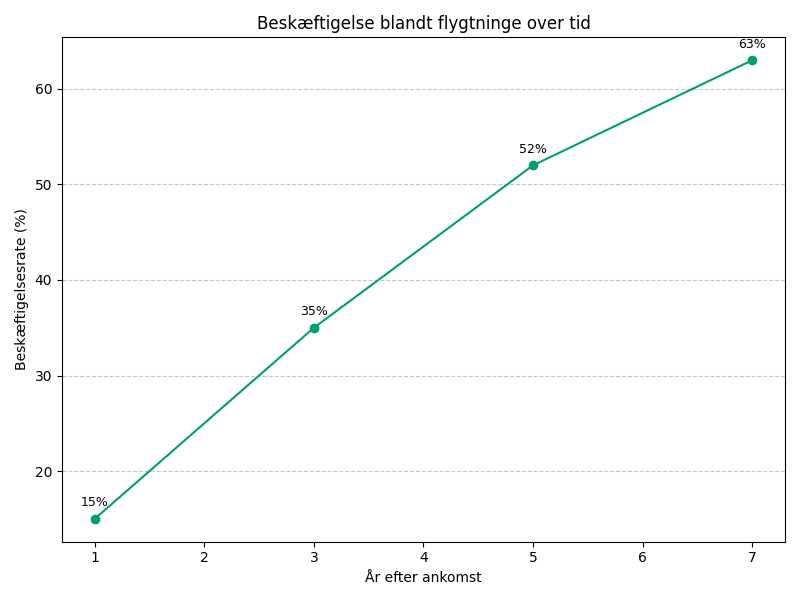
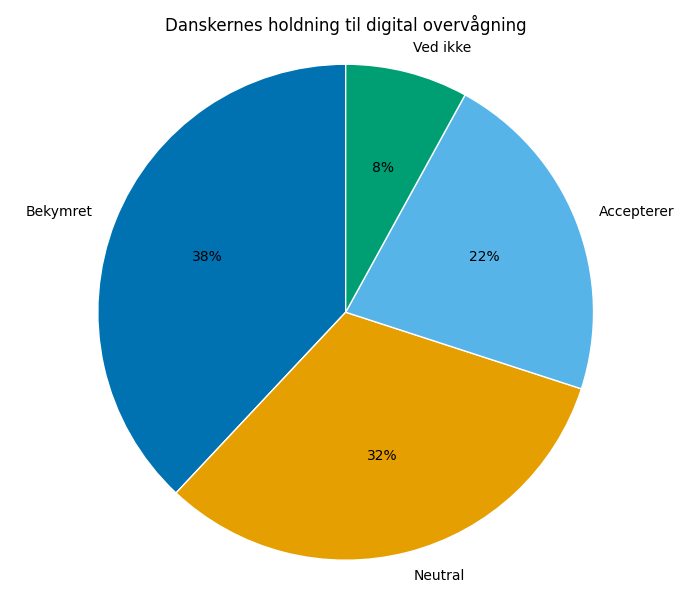

# Studieprøven _Practice Test 8_

  

## Outline

- Læseforståelse (90 minutter)
  - Delprøve 1
  - Delprøve 2A
  - Delprøve 2B
  - Delprøve 3
- Skriftlig fremstilling (3 timer)
- Mundtlig kommunikation (30 minutter)

  Help Den Frie Prøvebank

_This practice test was generated by Den Frie Prøvebank and is unofficial. Den Frie Prøvebank's ability to validate how well its tests match the official tests, in terms of content and structure, is limited. Users should seek guidance from official teaching institutions as to the structure and content of the exams in question._

## Læseforståelse

### Delprøve 1 (25 minutter)
**Ingen hjælpemidler tilladt**

#### Tekstsamling: Energiforsyning og grøn omstilling

**Tekst A: Vindenergi og offshore udvikling**
Danmarks vindenergikapacitet er steget til 6.200 MW offshore og 4.100 MW onshore. Vindenergi dækker 55% af landets elektricitetsforsyning i gennemsnit. Ørsted er verdens største offshore udvikler med projekter i 8 lande. Energy Island Bornholm bliver centrum for 3.000 MW kapacitet med forbindelse til Tyskland og Polen. Investeringer i offshore vind ventes at nå 200 milliarder kroner frem til 2030.

**Tekst B: Solenergi og energilagring**
Solenergi er vokset fra 2% til 8% af energimikset på fem år. Private solceller på tage udgør 70% af installationer. Batteriteknologi forbedres med 15% årligt i energidensitet. Power-to-X teknologi kan konvertere overskudsstrøm til brint eller syntetiske brændstoffer. Danmarks første store batteripark på 50 MW åbner i 2025. Energilagring bliver kritisk for at håndtere uforudsigelig vedvarende energi.

**Tekst C: Fjernvarme og biomasse**
Fjernvarme forsyner 64% af danske boliger og er verdens mest udbyggede system. Biomasse udgør 45% af fjernvarmeproduktionen, men bæredygtighed diskuteres. Overskudsvarme fra datacentre integreres i fjernvarmenettet. Geotermisk energi testes som alternativ til biomasse med 3 pilotprojekter. Moderne fjernvarmepumper kan udnytte havvand ved 7-12 grader.

**Tekst D: Energieffektivitet og bygninger**
Bygninger står for 35% af Danmarks energiforbrug. Energirenovering af offentlige bygninger får 10 milliarder kroner over fem år. Smart home-teknologi kan reducere energiforbrug med 20-30%. Varmepumper erstatter olie- og gasfyr i 18.000 boliger årligt. Nye byggeforskrifter kræver næsten-nul-energi-standard fra 2025. Passivhuse og plus-energi-bygninger demonstrerer fremtidens byggeri.

**Tekst E: Energisikkerhed og international samarbejde**
Danmark er netto-eksportør af elektricitet til nabolandene gennem 8 internationale kabler. Nord Stream sabotagen øgede fokus på energisikkerhed og diversificering. EU's REPowerEU-plan accelererer grøn energi med dansk teknologi og knowhow. Energidiplomati bliver vigtigere for at sikre kritiske mineraler til grøn teknologi. Danmarks energiuafhængighed målsættes til 95% ved brug af egen vedvarende energi.

#### Spørgsmål til tekstsamlingen:

1. Hvor mange MW offshore vindenergikapacitet har Danmark?

2. Hvor mange procent af elektricitetsforsyningen dækker vindenergi?

3. I hvor mange lande har Ørsted offshore projekter?

4. Hvor mange MW kapacitet bliver Energy Island Bornholm centrum for?

5. Fra hvor mange procent til hvor mange procent er solenergi vokset på fem år?

6. Hvor mange procent udgør private solceller af installationer?

7. Med hvor mange procent forbedres batteriteknologi årligt?

8. Hvor mange MW bliver Danmarks første store batteripark?

9. Hvor mange procent af danske boliger forsynes med fjernvarme?

10. Hvor mange procent af fjernvarmeproduktionen udgør biomasse?

11. Hvor mange pilotprojekter tester geotermisk energi?

12. For hvor mange procent af Danmarks energiforbrug står bygninger?

13. Hvor mange milliarder kroner får energirenovering af offentlige bygninger?

14. I hvor mange boliger erstatter varmepumper olie- og gasfyr årligt?

15. Gennem hvor mange internationale kabler eksporterer Danmark elektricitet?

### Delprøve 2A (Del af 65 minutter samlet for 2A, 2B og 3)

#### Tekst med fjernede afsnit: Social medier og deres påvirkning af det danske samfund

_Sæt bogstavet for den rigtige sætning i hvert felt._

Sociale medier har fundamentalt ændret, hvordan danskere kommunikerer, informerer sig og skaber sociale relationer. Fra at være en teknologisk nyhed er platforme som Facebook, Instagram og TikTok blevet integrerede dele af hverdagen med både positive og negative konsekvenser.

**(1)** ________

Unge bruger i gennemsnit 4-5 timer dagligt på sociale medier, hvilket påvirker deres søvnmønstre og koncentrationsevne. Forskere dokumenterer sammenhæng mellem intensiv brug og øget angst, depression og lavt selvværd blandt teenagere.

**(2)** ________

Misinformation spreder sig hurtigere end faktuel information på sociale platforme. Algoritmer favoriserer indhold, der vækker stærke følelser, hvilket ofte er kontroversielt eller unuanceret. Dette underminerer tilliden til eksperter og institutioner.

**(3)** ________

Danske politikere bruger sociale medier til direkte kommunikation med vælgerne, men dette kan også polarisere den offentlige debat. Kommentarfelter bliver arenaer for hadefulde ytringer og ekstremisme, hvilket truer det demokratiske sammenliv.

**(4)** ________

Dansk e-handel og markedsføring er blevet revolutioneret af sociale medier. Influencer‑marketing og målrettet reklame skaber nye forretningsmodeller, men rejser også spørgsmål om forbrugerbeskyttelse og privatliv.

**(5)** ________

Regulering af sociale medier bliver en presserende politisk opgave. EU's Digital Services Act og GDPR sætter rammer, men teknologiudviklingen går hurtigere end lovgivningen. Balance mellem ytringsfrihed og beskyttelse kræver konstant overvejelse.

#### Fjernede afsnit (vælg det rigtige for hver position):

1. Afsnit 1
<ul class="multiple-choice-answers">
1. COVID-19‑pandemien accelererede digitaliseringen af sociale relationer markant. Videoopkald og online‑fællesskaber kompenserede for fysisk isolation, men skabte også digital udmattelse.
2. Generationskløften i mediebrug skaber kommunikationsudfordringer i familier. Forældre kæmper for at forstå deres børns digitale adfærd og etablere sunde grænser.
3. Danske virksomheder investerer milliarder i markedsføring på sociale medier for at nå forbrugerne, hvor de befinder sig. Traditionel reklame mister terræn til influencere og viral markedsføring.
</ul>

2. Afsnit 2
<ul class="multiple-choice-answers">
1. Cybermobning er blevet et alvorligt problem i danske skoler. Konflikter, der tidligere sluttede efter skoletid, fortsætter nu døgnet rundt på digitale platforme.
2. Mentale sundhedsproblemer blandt unge korrelerer stærkt med brug af sociale medier. Sammenligning med andres perfekte online‑profiler skaber urealistiske forventninger til eget liv.
3. FOMO (fear of missing out) driver konstant behov for at tjekke sociale medier. Notifikationer afbryder arbejde, søvn og ansigt‑til‑ansigt‑samtaler.
</ul>

3. Afsnit 3
<ul class="multiple-choice-answers">
1. Ekkokamre og filterbobler fragmenterer samfundsdebatten. Algoritmerne viser brugerne primært indhold, der bekræfter deres eksisterende holdninger.
2. Fact‑checking og mediealfabetisering bliver kritiske færdigheder. Skoler implementerer undervisning i at identificere og verificere pålidelige kilder.
3. Konspirationsteorier og ekstremisme rekrutterer gennem sociale medier. Online‑radikalisering truer både individuelle borgere og demokratiske værdier.
</ul>

4. Afsnit 4
<ul class="multiple-choice-answers">
1. Digital deltagelse styrker demokratiet ved at give alle borgere mulighed for at deltage i den offentlige debat. Græsrodsorganisering og aktivisme faciliteres af sociale platforme.
2. Politik bliver mere personligt og følelsesladet gennem sociale medier. Nuancerede holdninger forenkles til korte budskaber og virale memes.
3. Internationale påvirkningskampagner målretter danske vælgere gennem sofistikerede desinformationsstrategier. Fremmede magter forsøger at påvirke valg og offentlig opinion.
</ul>

5. Afsnit 5
<ul class="multiple-choice-answers">
1. Datatilsyn og forbrugermyndigheder intensiverer overvågningen af tech-giganternes praksis. Bøder og reguleringer skal beskytte borgernes rettigheder og privatliv.
2. Fremtiden kræver bedre balance mellem innovation og beskyttelse. Teknologivirksomheder må tage mere ansvar for deres platformes samfundsmæssige påvirkning.
3. Digital dannelse bliver lige så vigtig som traditionelle færdigheder. Borgerne skal lære at navigere ansvarligt i det digitale landskab.
</ul>

### Delprøve 2B (Del af 65 minutter samlet for 2A, 2B og 3)

#### Tekst: Kulturarv og moderne Danmark

Danmark balancerer mellem at bevare sin rige kulturarv og tilpasse sig moderne samfundsudvikling. Historiske bygninger, traditioner og kulturlandskaber konfronteres med urbanisering, globalisering og teknologisk forandring.

Bygningsarven udfordres af klimatilpasning og energirenovering. Fredede bygninger skal moderniseres uden at miste deres historiske karakter. Københavns historiske centrum må balancere mellem bevaring og livskraftig byudvikling. Højhuse og moderne arkitektur diskuteres intensivt i forhold til deres påvirkning af bysilhuetten.

Kulturlandskabet formes af tusindårige landbrugstraditioner, men intensive driftsmetoder truer karakteristiske biotoper. Vadehavet, Stevns Klint og Kronborg Slot på UNESCO's verdensarvsliste kræver særlig beskyttelse. Vindmøller og infrastruktur skaber konflikter mellem grøn omstilling og landskabsbevaring.

Håndværkstraditioner og gamle erhverv risikerer at forsvinde. Få lærer traditionelle teknikker som bygningshåndværk, tekstilproduktion og madlavning. Digitalisering dokumenterer viden, men kan ikke erstatte praktisk erfaring og håndværksmæssig kunnen.

Museer og kulturinstitutioner kæmper med begrænsede budgetter og skiftende publikumsinteresser. Digitale udstillinger og interaktive oplevelser tiltrækker nye besøgende, men fundamentale museumsfunktioner som forskning og bevaring får mindre opmærksomhed.

Sproget påvirkes af engelsk dominans og immigration. Danske ord erstattes af engelske, mens nye danskere bidrager med låneord fra deres modersmål. Dialekter og regionalt sprog svækkes af standardiseret mediedansk og øget mobilitet.

Traditioner som sankthans, jul og påske tilpasses multikulturelle samfund. Nye borgere skaber hybride traditioner, der kombinerer dansk kultur med deres egen baggrund. Dette beriger kulturen, men kan også skabe identitetskonflikter.

Populærkultur globaliseres gennem streaming og sociale medier. Danske kunstnere konkurrerer på verdensmarkedet, mens lokale kulturudtryk risikerer at marginaliseres. Statsstøtte til kulturen diskuteres som værktøj til at bevare kulturel diversitet.

#### Spørgsmål til teksten:

_Sæt en cirkel om det rigtige svar._

1. Hvad er hovedudfordringen for fredede bygninger ifølge teksten?  
<ul class="multiple-choice-answers">
1.  Mangel på turistinteresse og besøgende  
2.  At moderniseres uden at miste historisk karakter  
3.  For høje vedligeholdelsesomkostninger
</ul>

2. Hvilke steder nævnes som værende på UNESCO's verdensarvsliste?  
<ul class="multiple-choice-answers">
1.  Københavns historiske centrum, Kronborg og Frederiksborg  
2.  Vadehavet, Stevns Klint og Kronborg Slot  
3.  Bornholm, Møns Klint og Egeskov Slot
</ul>

3. Hvad truer håndværkstraditioner og gamle erhverv?  
<ul class="multiple-choice-answers">
1.  For høje uddannelseskrav og lange studieforløb  
2.  Konkurrence fra billigere udenlandske produkter  
3.  Få lærer traditionelle teknikker og praktisk erfaring forsvinder
</ul>

4. Hvilke udfordringer står museer og kulturinstitutioner over for? 
<ul class="multiple-choice-answers"> 
1.  For mange besøgende og overkapacitet  
2.  Begrænsede budgetter og skiftende publikumsinteresser  
3.  Politisk indblanding i udstillingsindhold
</ul>

5. Hvordan påvirkes det danske sprog ifølge teksten?  
<ul class="multiple-choice-answers">
1.  Kun af engelsk dominans uden andre påvirkninger  
2.  Af engelsk dominans og immigration med nye låneord  
3.  Det forbliver uændret på trods af globalisering
</ul>

### Delprøve 3 (Del af 65 minutter samlet for 2A, 2B og 3)

#### Tekst med fjernede ord: Danmarks position i det globale økonomiske system

Som en lille åben økonomi __(1)__ ______ Danmark enormt på international handel og investeringer. Landets velstand er __(2)__ ______ knyttet til dets evne til at konkurrere på globale markeder og tiltrække internationale virksomheder.

Danmarks eksport __(3)__ ______ for over 50% af BNP, hvilket gør landet sårbart over for globale økonomiske svingninger. Medicinal- og cleantech-industrier __(4)__ ______ som danske styrkepositioner på verdensmarkedet, mens traditionelle industrier mister __(5)__ ______.

Internationale handelskrige og protektionisme __(6)__ ______ danske eksportvirksomheder i vanskelige situationer. Toldkrige mellem stormagter __(7)__ ______ indirekte danske interesser, selvom Danmark ikke er direkte part i konflikten.

EU-medlemskabet __(8)__ ______ Danmark adgang til verdens største indre marked, men begrænser også landets __(9)__ ______ til unilateral handelspolitik. Balancen mellem europæisk integration og national suverænitet diskuteres __(10)__ ______.

Kinas voksende økonomiske magt skaber både muligheder og dilemmaer for Danmark. Handel med Kina vokser, men værdikonflikter og sikkerhedshensyn komplicerer forholdet betydeligt.

#### Valgmuligheder:

<table class="horizontal-multiple-choice">
  <tbody>
    <tr>
      <td><strong>1</strong></td>
      <td><strong>a.</strong> baserer</td>
      <td><strong>b.</strong> afhænger</td>
      <td><strong>c.</strong> satser</td>
      <td><strong>d.</strong> fokuserer</td>
    </tr>
    <tr>
      <td><strong>2</strong></td>
      <td><strong>a.</strong> løst</td>
      <td><strong>b.</strong> sjældent</td>
      <td><strong>c.</strong> tæt</td>
      <td><strong>d.</strong> svagt</td>
    </tr>
    <tr>
      <td><strong>3</strong></td>
      <td><strong>a.</strong> betaler</td>
      <td><strong>b.</strong> står</td>
      <td><strong>c.</strong> koster</td>
      <td><strong>d.</strong> udgør</td>
    </tr>
    <tr>
      <td><strong>4</strong></td>
      <td><strong>a.</strong> fejler</td>
      <td><strong>b.</strong> fungerer</td>
      <td><strong>c.</strong> udvikles</td>
      <td><strong>d.</strong> fremstår</td>
    </tr>
    <tr>
      <td><strong>5</strong></td>
      <td><strong>a.</strong> betydning</td>
      <td><strong>b.</strong> marked</td>
      <td><strong>c.</strong> konkurrenceevne</td>
      <td><strong>d.</strong> relevans</td>
    </tr>
    <tr>
      <td><strong>6</strong></td>
      <td><strong>a.</strong> hjælper</td>
      <td><strong>b.</strong> støtter</td>
      <td><strong>c.</strong> placerer</td>
      <td><strong>d.</strong> beskytter</td>
    </tr>
    <tr>
      <td><strong>7</strong></td>
      <td><strong>a.</strong> styrker</td>
      <td><strong>b.</strong> påvirker</td>
      <td><strong>c.</strong> forbedrer</td>
      <td><strong>d.</strong> støtter</td>
    </tr>
    <tr>
      <td><strong>8</strong></td>
      <td><strong>a.</strong> nægter</td>
      <td><strong>b.</strong> giver</td>
      <td><strong>c.</strong> begrænser</td>
      <td><strong>d.</strong> forhindrer</td>
    </tr>
    <tr>
      <td><strong>9</strong></td>
      <td><strong>a.</strong> bidrag</td>
      <td><strong>b.</strong> mulighed</td>
      <td><strong>c.</strong> ansvar</td>
      <td><strong>d.</strong> forpligtelse</td>
    </tr>
    <tr>
      <td><strong>10</strong></td>
      <td><strong>a.</strong> sjældent</td>
      <td><strong>b.</strong> konstant</td>
      <td><strong>c.</strong> minimalt</td>
      <td><strong>d.</strong> kortvarigt</td>
    </tr>
  </tbody>
</table>

## Skriftlig fremstilling (3 timer)
**Alle ordbøger er tilladt**

### Vælg én af følgende tre opgaver:

#### Opgave 1: Energiforsyningssikkerhed

**Grafik:** 

**Manchet:** Danmarks grønne omstilling har gjort landet mindre afhængigt af fossile brændstoffer, men vedvarende energi skaber nye udfordringer med uforudsigelig produktion og behov for energilagring og backup‑systemer.

**Opgave:** Skriv en sammenhængende tekst på minimum 400 ord, hvor du:
- Analyserer Danmarks energimiks som vist i grafikken
- Diskuterer fordele og udfordringer ved vedvarende energi
- Vurderer energisikkerhed i en grøn økonomi
- Foreslår løsninger til at sikre stabil energiforsyning

#### Opgave 2: Arbejdsmarkedsintegration af flygtninge

**Grafik:** 

**Manchet:** Integration af flygtninge på det danske arbejdsmarked er en langvarig proces. Trods indsats tager det mange år, før flygtninge opnår beskæftigelse på niveau med andre borgere, hvilket skaber økonomiske og sociale udfordringer.

**Opgave:** Skriv en sammenhængende tekst på minimum 400 ord, hvor du:
- Præsenterer udviklingen i flygtninges beskæftigelse fra grafikken
- Analyserer barrierer for hurtigere arbejdsmarkedsintegration
- Diskuterer konsekvenserne for samfundet og de involverede
- Argumenterer for forbedringer i integrationsindsatsen

#### Opgave 3: Digital overvågning og privatliv

**Grafik:** 

**Manchet:** Digitale teknologier gør det muligt at overvåge borgere i hidtil uset omfang. Mellem sikkerhed og privatliv opstår dilemmaer om, hvor meget overvågning et demokratisk samfund kan acceptere.

**Opgave:** Skriv en sammenhængende tekst på minimum 400 ord, hvor du:
- Redegør for danskernes holdninger til overvågning fra grafikken
- Diskuterer argumenter for og imod digital overvågning
- Analyserer balancen mellem sikkerhed og privatliv
- Vurderer regulering af overvågningsteknologi

_Brug disse sider til at skrive din skriftlige opgave._

## Mundtlig kommunikation (30 minutter inkl. votering)

### Opgaveark med tre emner til forberedelse:

#### Emne 1: Landbrugsproduktion og miljøhensyn

**Stikord til inspiration:**
- Økologisk versus konventionel produktion
- Pesticider og grundvandsbeskyttelse
- Dyrevelfærd og intensive produktionssystemer
- CO₂‑udslip fra husdyr og transport
- Biodiversitet og habitatbeskyttelse
- Økonomisk bæredygtighed for landmænd
- Forbrugeradfærd og prisbevidsthed
- EU's landbrugspolitik og subsidier

#### Emne 2: Sociale medier og demokratisk deltagelse

**Stikord til inspiration:**
- Misinformation og faktatjek
- Ekkokamre og polarisering
- Græsrodsorganisering og aktivisme
- Ungdommens politiske engagement
- Privatlivsbeskyttelse og dataindsamling
- Hatefulde ytringer og moderering
- International påvirkning og propaganda
- Mediealfabetisering og kritisk tænkning

#### Emne 3: Kulturel diversitet og integration

**Stikord til inspiration:**
- Flerkulturelt samfund og identitet
- Sprogpolitik og modersmålsundervisning
- Religiøs diversitet og sekulære værdier
- Traditioner og modernisering
- Arbejdsmarkedsintegration og kompetencer
- Ghetto-områder og social segregering
- Kulturel udveksling og berigelse
- National sammenhørighed og fællesskab

### Prøveforløb:

1. **Lodtrækning:** Vælg ét af de tre forberedte emner
2. **Præsentation (5 minutter):** Struktureret gennemgang af det valgte emne
3. **Interview (15 minutter):** Uddybende samtale med eksaminator baseret på præsentationen
4. **Votering og karaktergivning (10 minutter)**

### Bedømmelseskriterier:

- **Sproglig korrekthed:** Grammatik, ordforråd og udtale
- **Kommunikativ kompetence:** Evne til at formidle budskaber klart
- **Indholdsrigdom:** Faglig dybde og nuanceret forståelse
- **Struktur:** Logisk opbygning og sammenhæng
- **Interaktion:** Evne til dialog og respons på spørgsmål

---

_This practice test was generated by Den Frie Prøvebank and is unofficial. Den Frie Prøvebank's ability to validate how well its tests match the official tests, in terms of content and structure, is limited. Users should seek guidance from official teaching institutions as to the structure and content of the exams in question._
