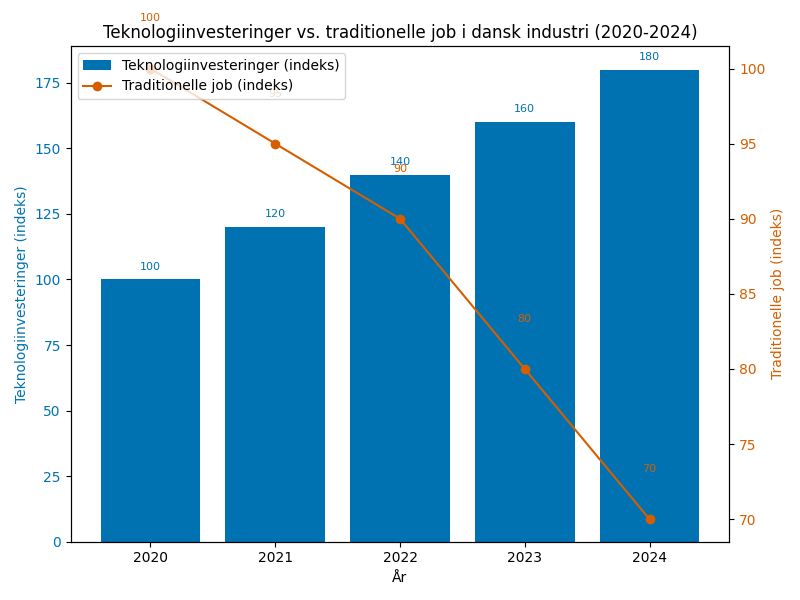
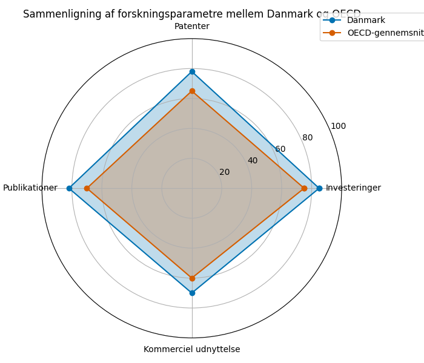
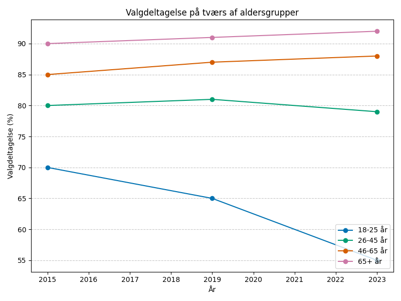

# Studieprøven _Practice Test 9_

  

## Outline

- Læseforståelse (90 minutter)
  - Delprøve 1
  - Delprøve 2A
  - Delprøve 2B
  - Delprøve 3
- Skriftlig fremstilling (3 timer)
- Mundtlig kommunikation (30 minutter)

  Help Den Frie Prøvebank

_This practice test was generated by Den Frie Prøvebank and is unofficial. Den Frie Prøvebank's ability to validate how well its tests match the official tests, in terms of content and structure, is limited. Users should seek guidance from official teaching institutions as to the structure and content of the exams in question._

## Læseforståelse

### Delprøve 1 (25 minutter)
**Ingen hjælpemidler tilladt**

#### Tekstsamling: Forskningsinnovation og vidensamfundet

**Tekst A: Biotech og medicinalindustri**

Danmarks medicinaleksport nåede 180 milliarder kroner i 2024, primært fra Novo Nordisk, Lundbeck og LEO Pharma. Novo Nordisks diabetesmedicin bruges af 35 millioner patienter globalt. Danske biotech-startups tiltrækker 8 milliarder kroner i international venture capital årligt. Medicodalen beskæftiger 55.000 personer og genererer 25% af landets eksportindtægter. Kliniske forsøg i Danmark stiger med 12% årligt på grund af høj datakvalitet og regulatorisk effektivitet.

**Tekst B: Teknologisk innovation og digitalisering**

Danmarks investeringer i forskning og udvikling udgør 3,2 % af BNP – blandt verdens højeste. IT‑sektoren beskæftiger 180.000 personer og vokser med 6 % årligt. Danske fintech‑virksomheder som MobilePay og Lunar Bank ekspanderer til europæiske markeder. Implementering af kunstig intelligens i danske virksomheder når 42 % sammenlignet med EU‑gennemsnittet på 25 %. Forskning i kvantecomputing modtager 500 millioner kroner i offentlig støtte over fem år.

**Tekst C: Grøn teknologi og cleantech**

Vindmølle-teknologi eksporteres for 85 milliarder kroner årligt og skaber 35.000 arbejdspladser. Vestas og Ørsted leder globale vindenergi-markeder med teknologi udviklet i Danmark. Power-to-X investeringer når 45 milliarder kroner med fokus på grøn brint og syntetiske brændstoffer. Carbon capture-teknologi testes i 6 pilotprojekter med potentiale for global eksport. Danske cleantech-virksomheder modtog 12 milliarder kroner i grønne investeringer sidste år.

**Tekst D: Forskning og universiteter**

Danmarks universiteter rangerer højt internationalt med 4 universiteter i global top 200. Forskningspublikationer citeres 45% hyppigere end verdensgennemsnittet, hvilket indikerer høj kvalitet. Internationale studerende udgør 18% af optaget på danske universiteter. Samarbejde mellem universiteter og private virksomheder generer 15 milliarder kroner i forskningskontrakter årligt. PhD-uddannelse tager i gennemsnit 4,8 år sammenlignet med OECD-gennemsnit på 6,2 år.

**Tekst E: Innovation og iværksætteri**

Startup‑investeringer i Danmark steg til 22 milliarder kroner i 2024. Danske unicorns inkluderer Zendesk, Unity Technologies og Just Eat med samlet værdi over 400 milliarder kroner. Copenhagen Fintech vokser til Nordeuropas største fintech‑klynge med 280 virksomheder. Innovationsfonden har investeret 8 milliarder kroner i 2.500 innovationsprojekter siden 2014. Fødevareteknologi og medtech udgør voksende andele af det danske startup‑økosystem.

#### Spørgsmål til tekstsamlingen:

1. Hvor mange milliarder kroner nåede Danmarks medicinaleksport i 2024?

2. Hvor mange millioner patienter bruger Novo Nordisks diabetesmedicin globalt?

3. Hvor mange milliarder kroner tiltrækker danske biotech-startups årligt?

4. Hvor mange procent af landets eksportindtægter genererer Medicodalen?

5. Hvor mange procent af BNP udgør Danmarks investeringer i forskning og udvikling?

6. Hvor mange personer beskæftiger IT-sektoren?

7. Hvor mange procent af danske virksomheder implementerer kunstig intelligens?

8. Hvor mange millioner kroner modtager kvantecomputing-forskning over fem år?

9. For hvor mange milliarder kroner eksporteres vindmølle-teknologi årligt?

10. Hvor mange milliarder kroner når power-to-X investeringer?

11. I hvor mange pilotprojekter testes carbon capture-teknologi?

12. Hvor mange universiteter har Danmark i global top 200?

13. Hvor mange procent hyppigere citeres danske forskningspublikationer end verdensgennemsnittet?

14. Hvor mange procent udgør internationale studerende af optaget?

15. Hvor mange år tager PhD-uddannelse i gennemsnit i Danmark?

### Delprøve 2A (Del af 65 minutter samlet for 2A, 2B og 3)

#### Tekst med fjernede afsnit: Fremtiden for den danske velfærdsstat

_Sæt bogstavet for den rigtige sætning i hvert felt._

Den danske velfærdsmodel står over for fundamentale udfordringer i det 21. århundrede. Demografiske ændringer, globalisering og teknologisk udvikling presser på for reformer af det system, der har defineret Danmark siden 1960'erne.

**(1)** ________

Sundhedsvæsenet kæmper med stigende behandlingsomkostninger og aldrende befolkning. Nye medicinske behandlinger er dyre, men effektive. Personalemangel og lange ventelister skaber utilfredshed blandt borgerne. Private sundhedsforsikringer vokser som supplement til det offentlige system.

**(2)** ________

Uddannelsessystemet skal tilpasse sig hurtige forandringer på arbejdsmarkedet. Livslang læring bliver nødvendigt, da kompetencer hurtigt forældes. Online-uddannelse og fleksible læringsformer udfordrer traditionelle institutioner. Uddannelsesstøtte og SU-systemet diskuteres i lyset af øget internationalisering.

**(3)** ________

Pensionssystemet er under pres fra demografiske ændringer. Færre unge skal finansiere flere pensionister. Pensionsalderen er allerede hævet, men yderligere justeringer ventes. Private pensionsopsparinger bliver vigtigere som supplement til folkepensionen.

**(4)** ________

Globalisering og EU-medlemskab begrænser Danmarks handlefrihed på velfærdspolitik. Arbejdskraftens mobilitet skaber udfordringer for finansieringen af universelle ydelser. Sociale dumping og konkurrence om investeringer påvirker de politiske prioriteter.

**(5)** ________

Fremtidens velfærdsstat kræver innovation og tilpasning. Digitalisering kan effektivisere administrationen og forbedre service-kvaliteten. Men grundlæggende værdier om solidaritet og lighed må bevares for at opretholde samfundets sammenhængskraft.

#### Fjernede afsnit (vælg det rigtige for hver position):

1. Afsnit 1
<ul class="multiple-choice-answers">
1. Demografiske ændringer skaber en dobbelt udfordring: færre borgere i den arbejdsdygtige alder skal finansiere flere pensionister og ældre med øgede sundhedsbehov.
2. Teknologisk automatisering eliminerer mange traditionelle arbejdspladser, men skaber også nye muligheder for produktivitetsstigninger og innovative løsninger.
3. Økonomisk ulighed vokser på trods af høje skatter og omfattende omfordeling. Globalisering koncentrerer rigdom hos de højest uddannede og mest mobile borgere.
</ul>

2. Afsnit 2
<ul class="multiple-choice-answers">
1. Mental sundhed blandt unge forværres på trods af øgede ressourcer til behandling. Stress og angst kræver nye tilgange til forebyggelse og tidlig indsats.
2. Regionalisering af sundhedsvæsenet skaber ubalancer i behandlingskvalitet. Borgere i udkant-Danmark har længere til specialistbehandling og avanceret udstyr.
3. Præventive sundhedstiltag kan reducere fremtidige behandlingsomkostninger betydeligt. Investeringer i sundhedsfremme og livsstilsinterventioner betaler sig på lang sigt.
</ul>

3. Afsnit 3
<ul class="multiple-choice-answers">
1. Internationalisering af uddannelse gør danske uddannelser mere attraktive globalt, men skaber også brain drain når talenter emigrerer efter endt uddannelse.
</ul>

2. Digitalisering af undervisning accelereret af COVID-19 har både fordele og ulemper. Fleksibilitet og tilgængelighed forbedres, men social interaktion og praktisk læring lider.

3. Erhvervsrettet uddannelse får øget fokus da akademiske uddannelser ikke matcher arbejdsmarkedets behov. Håndværk og tekniske færdigheder er mangelvare.

4. Afsnit 4
<ul class="multiple-choice-answers">
1. Arbejdsmarkedspension supplerer folkepensionen, men skaber ulighed mellem forskellige sektorer og ansættelsesformer. Gig-økonomien udfordrer traditionelle pensionssystemer.
2. Automatisering kan frigøre ressourcer til velfærd ved at øge produktiviteten, men overgangen kræver massive omskolingsindsatser og sociale sikkerhedsnet.
3. Indvandring kan afhjælpe demografiske udfordringer ved at tilføre unge arbejdstagere, men integration og kulturel sammenhængskraft kræver målrettede politikker.
</ul>

5. Afsnit 5
<ul class="multiple-choice-answers">
1. Nordisk samarbejde om velfærdsinnovation kan styrke modellens konkurrenceevne globalt. Fælles løsninger og vidensdeling optimerer ressourceudnyttelsen.
2. Borgernes forventninger til velfærdsstaten stiger konstant, mens finansieringsgrundlaget udfordres. Politisk kommunikation om begrænsninger og prioriteter bliver kritisk.
3. Måling af velfærd skal udvides ud over økonomiske indikatorer til at omfatte livskvalitet, miljø og social sammenhængskraft for at guide fremtidens prioriteringer.
</ul>

### Delprøve 2B (Del af 65 minutter samlet for 2A, 2B og 3)

#### Tekst: Boligmarkedet og sociale konsekvenser

Danmarks boligmarked har gennemgået dramatiske forandringer de seneste årtier. Prisstigninger, ændrede familiestrukturer og urbanisering skaber nye udfordringer for både individuelle borgere og samfundet som helhed.

Boligpriserne er steget markant hurtigere end lønninger og inflation. I København er gennemsnitsprisen for en ejerlejlighed tredoblet siden 2000, mens reallønnene kun er steget 30%. Dette skaber en generation af unge, der ikke kan komme ind på boligmarkedet uden familiehjælp eller ekstrem gældsætning.

Geografiske forskelle forstærkes af boligpriser. Attraktive byområder bliver enklaver for højindkomstgrupper, mens lavindkomstfamilier fortrænges til mindre ønskværdige områder. Dette skaber sociale skel og påvirker børns udviklingsmuligheder gennem boligsegregering.

Almene boliger fungerer som sikkerhedsnet, men ventelisterne er ekstreme. I København venter borgere gennemsnitligt 12 år på en almen bolig. Ghettolisten identificerer problemområder, men løsningerne er komplekse og langsigtede. Nedrivning og ombygning koster milliarder uden garanti for løsning af sociale problemer.

Urbanisering koncentrerer efterspørgslen i få områder. Mens København og Aarhus oplever boligmangel, står boliger tomme i yderområder. Infrastruktur og arbejdspladser følger ikke med urbaniseringen, hvilket skaber transportudfordringer og regional ulighed.

Finansielle instrumenter påvirker boligmarkedet betydeligt. Lave renter har drevet priserne op, mens skærpede lånevilkår kan få markedet til at kollapse. Afdragsfrihed og rentetilpasning gør familier sårbare over for renteændringer.

Politiske tiltag har begrænset effekt. Boligskatter, udbudspolitik og planlægning kan påvirke markedet, men globale kapitalstrømme og demografiske trends er stærkere kræfter. Byggeindustrien kan ikke følge med efterspørgslen på grund af kapacitetsbegrænsninger og regulering.

Sociale konsekvenser strækker sig ud over økonomi. Boligusikkerhed påvirker mental sundhed og familierelationer. Børn i ustabile boligsituationer præsterer dårligere i skolen. Samfundets sammenhængskraft trues af geografisk og økonomisk segregering.

#### Spørgsmål til teksten:

_Sæt en cirkel om det rigtige svar._

1. Hvor meget er boligpriserne i København steget siden 2000 ifølge teksten?
<ul class="multiple-choice-answers">
1. De er fordoblet sammenlignet med stigningen i realløn  
2. De er tredoblet mens reallønnene kun er steget 30%  
3. De er steget proportionalt med reallønnene
</ul>

2. Hvad karakteriserer ventetiden på almene boliger i København?
<ul class="multiple-choice-answers">
1. Borgere venter gennemsnitligt 5-7 år  
2. Borgere venter gennemsnitligt 12 år  
3. Borgere venter gennemsnitligt 20 år
</ul>

3. Hvilken hovedudfordring identificeres med urbanisering?
<ul class="multiple-choice-answers">
1. For lidt byggeri i alle dele af landet  
2. Koncentreret efterspørgsel i få områder mens boliger står tomme i yderområder  
3. Manglende interesser fra private investorer
</ul>

4. Hvordan påvirker finansielle instrumenter boligmarkedet ifølge teksten?
<ul class="multiple-choice-answers">
1. De har ingen påvirkning på boligpriserne  
2. Lave renter driver priserne op og gør familier sårbare  
3. Kun politiske tiltag påvirker boligmarkedet
</ul>

5. Hvilke sociale konsekvenser af boligproblemer nævnes?
<ul class="multiple-choice-answers">
1. Kun økonomiske problemer for familierne  
2. Påvirkning af mental sundhed, skoleresultater og samfundets sammenhængskraft  
3. Ingen dokumenterede sociale konsekvenser
</ul>

### Delprøve 3 (Del af 65 minutter samlet for 2A, 2B og 3)

#### Tekst med fjernede ord: Erhvervslivets tilpasning til klimaforandringer

Danske virksomheder står over for __(1)__ ______ pres for at reducere deres miljøpåvirkning og tilpasse sig klimaforandringernes __(2)__ ______. Dette kræver grundlæggende ændringer i forretningsmodeller og strategisk tænkning.

Investorer __(3)__ ______ miljø‑, social‑ og governance‑kriterier (ESG) højere end nogensinde. Virksomheder med __(4)__ ______ bæredygtighedsprofiler tiltrækker mere kapital og betaler lavere renter på lån. Grønne obligationer og __(5)__ ______ finansiering vokser eksponentielt.

Forbrugernes __(6)__ ______ påvirker virksomhedernes strategier markant. Miljøbevidste produkter vinder __(7)__ ______, mens virksomheder med dårlige miljørekorder rammes af boykot og negativ omtale.

Leverandørkæder skal __(8)__ ______ for at reducere CO₂-aftryk og sikre leveringssikkerhed under ekstreme vejrbegivenheder. Lokale leverandører foretrækkes frem for __(9)__ ______ internationale alternativer.

Medarbejdere, særligt __(10)__ ______ generationer, prioriterer arbejdspladser med stærke miljøværdier. Talent retention kræver troværdig bæredygtighedsindsats og meningsfuldt arbejde.

#### Valgmuligheder:

<table class="horizontal-multiple-choice">
  <tbody>
    <tr>
      <td><strong>1</strong></td>
      <td><strong>a.</strong> minimalt</td>
      <td><strong>b.</strong> stigende</td>
      <td><strong>c.</strong> faldende</td>
      <td><strong>d.</strong> konstant</td>
    </tr>
    <tr>
      <td><strong>2</strong></td>
      <td><strong>a.</strong> fordele</td>
      <td><strong>b.</strong> muligheder</td>
      <td><strong>c.</strong> konsekvenser</td>
      <td><strong>d.</strong> gevinster</td>
    </tr>
    <tr>
      <td><strong>3</strong></td>
      <td><strong>a.</strong> ignorerer</td>
      <td><strong>b.</strong> prioriterer</td>
      <td><strong>c.</strong> afviser</td>
      <td><strong>d.</strong> overser</td>
    </tr>
    <tr>
      <td><strong>4</strong></td>
      <td><strong>a.</strong> svage</td>
      <td><strong>b.</strong> uændrede</td>
      <td><strong>c.</strong> stærke</td>
      <td><strong>d.</strong> begrænsede</td>
    </tr>
    <tr>
      <td><strong>5</strong></td>
      <td><strong>a.</strong> traditionel</td>
      <td><strong>b.</strong> konventionel</td>
      <td><strong>c.</strong> bæredygtig</td>
      <td><strong>d.</strong> billig</td>
    </tr>
    <tr>
      <td><strong>6</strong></td>
      <td><strong>a.</strong> indkøb</td>
      <td><strong>b.</strong> præferencer</td>
      <td><strong>c.</strong> vaner</td>
      <td><strong>d.</strong> traditioner</td>
    </tr>
    <tr>
      <td><strong>7</strong></td>
      <td><strong>a.</strong> markedsandele</td>
      <td><strong>b.</strong> opmærksomhed</td>
      <td><strong>c.</strong> kritik</td>
      <td><strong>d.</strong> konkurrence</td>
    </tr>
    <tr>
      <td><strong>8</strong></td>
      <td><strong>a.</strong> udvides</td>
      <td><strong>b.</strong> fastholdes</td>
      <td><strong>c.</strong> billiggøres</td>
      <td><strong>d.</strong> omstruktureres</td>
    </tr>
    <tr>
      <td><strong>9</strong></td>
      <td><strong>a.</strong> lokale</td>
      <td><strong>b.</strong> billigere</td>
      <td><strong>c.</strong> pålidelige</td>
      <td><strong>d.</strong> større</td>
    </tr>
    <tr>
      <td><strong>10</strong></td>
      <td><strong>a.</strong> ældre</td>
      <td><strong>b.</strong> erfarne</td>
      <td><strong>c.</strong> yngre</td>
      <td><strong>d.</strong> uddannede</td>
    </tr>
  </tbody>
</table>

## Skriftlig fremstilling (3 timer)
**Alle ordbøger er tilladt**

### Vælg én af følgende tre opgaver:

#### Opgave 1: Teknologisk innovation og beskæftigelse

**Grafik:** 

**Manchet:** Automatisering og digitalisering forandrer det danske arbejdsmarked dramatisk. Mens nye teknologijob skabes, forsvinder traditionelle produktions- og servicejob. Dette skaber både muligheder og udfordringer for arbejdsstyrken.

**Opgave:** Skriv en sammenhængende tekst på minimum 400 ord, hvor du:
- Analyserer sammenhængen mellem teknologi og beskæftigelse fra grafikken
- Diskuterer fordele og risici ved teknologisk udvikling for arbejdsmarkedet
- Vurderer konsekvenserne for forskellige grupper af arbejdstagere
- Foreslår politikker til at håndtere omstillingen

#### Opgave 2: Forskningsinvestering og international konkurrenceevne

**Grafik:** 

**Manchet:** Danmark investerer massivt i forskning og udvikling for at opretholde konkurrenceevnen i den globale videnøkonomi. Men omsætning af forskningsresultater til kommercielle succeser udfordres af internationale konkurrenter.

**Opgave:** Skriv en sammenhængende tekst på minimum 400 ord, hvor du:
- Præsenterer Danmarks forskningsposition baseret på grafikken
- Analyserer styrker og svagheder i det danske forskningssystem
- Diskuterer betydningen af forskning for økonomisk udvikling
- Argumenterer for forbedringer i forsknings- og innovationspolitik

#### Opgave 3: Demokratisk deltagelse og politisk engagement

**Grafik:** 

**Manchet:** Unge danskere deltager mindre i valg og traditionelle politiske processer, mens ældre generationer forbliver engagerede. Dette skaber demokratiske udfordringer og spørgsmål om repræsentation på tværs af generationer.

**Opgave:** Skriv en sammenhængende tekst på minimum 400 ord, hvor du:
- Redegør for mønsteret i politisk deltagelse fra grafikken
- Analyserer årsager til forskelle i engagement mellem generationer
- Diskuterer konsekvenserne for demokratisk legitimitet
- Vurderer strategier til at styrke yngre borgeres politiske deltagelse

_Brug disse sider til at skrive din skriftlige opgave._

## Mundtlig kommunikation (30 minutter inkl. votering)

### Opgaveark med tre emner til forberedelse:

#### Emne 1: Vidensøkonomi og uddannelse

**Stikord til inspiration:**
- STEM-uddannelser og kompetencegab
- Livslang læring og omskaling
- Internationalisering og brain drain
- Forsknings- og udviklingsinvesteringer
- Innovation og entrepreneurship
- Teknologisk infrastruktur
- Offentlig-private partnerskaber
- Global konkurrenceevne

#### Emne 2: Klima og økonomisk udvikling

**Stikord til inspiration:**
- Grøn omstilling og jobskabelse
- Carbon pricing og regulering
- Internationale klimaaftaler
- Cleantech-eksport og konkurrencefordele
- Energisikkerhed og forsyningskæder
- Bæredygtige investeringer og finans
- Klimatilpasning og infrastruktur
- Innovation og teknologiudvikling

#### Emne 3: Demografiske ændringer og velfærd

**Stikord til inspiration:**
- Befolkningsaldring og arbejdsstyrke
- Immigration og integration
- Pensioner og generationssikring
- Sundhedsvæsen og plejesektoren
- Børnefamilier og fertilitet
- Regional udvikling og fraflytning
- Social sammenhængskraft og solidaritet
- Skattebase og offentlig finansiering

### Prøveforløb:

1. **Lodtrækning:** Vælg ét af de tre forberedte emner  
2. **Præsentation (5 minutter):** Struktureret gennemgang af det valgte emne  
3. **Interview (15 minutter):** Uddybende samtale med eksaminator baseret på præsentationen  
4. **Votering og karaktergivning (10 minutter)**

### Bedømmelseskriterier:

- **Sproglig korrekthed:** Grammatik, ordforråd og udtale
- **Kommunikativ kompetence:** Evne til at formidle budskaber klart
- **Indholdsrigdom:** Faglig dybde og nuanceret forståelse
- **Struktur:** Logisk opbygning og sammenhæng
- **Interaktion:** Evne til dialog og respons på spørgsmål

---

_This practice test was generated by Den Frie Prøvebank and is unofficial. Den Frie Prøvebank's ability to validate how well its tests match the official tests, in terms of content and structure, is limited. Users should seek guidance from official teaching institutions as to the structure and content of the exams in question._
